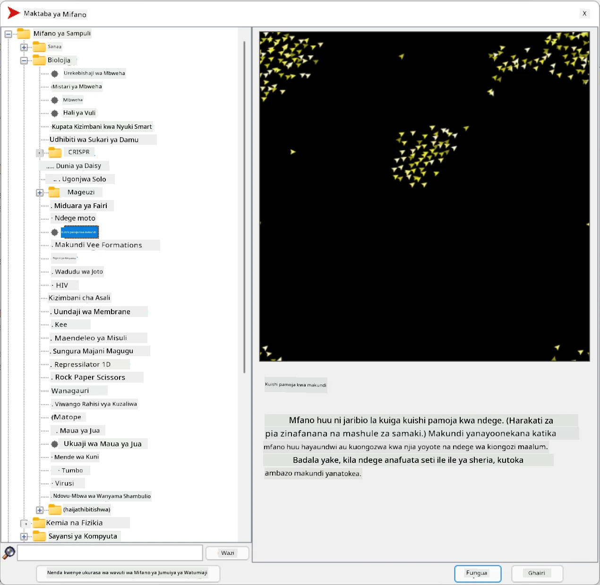
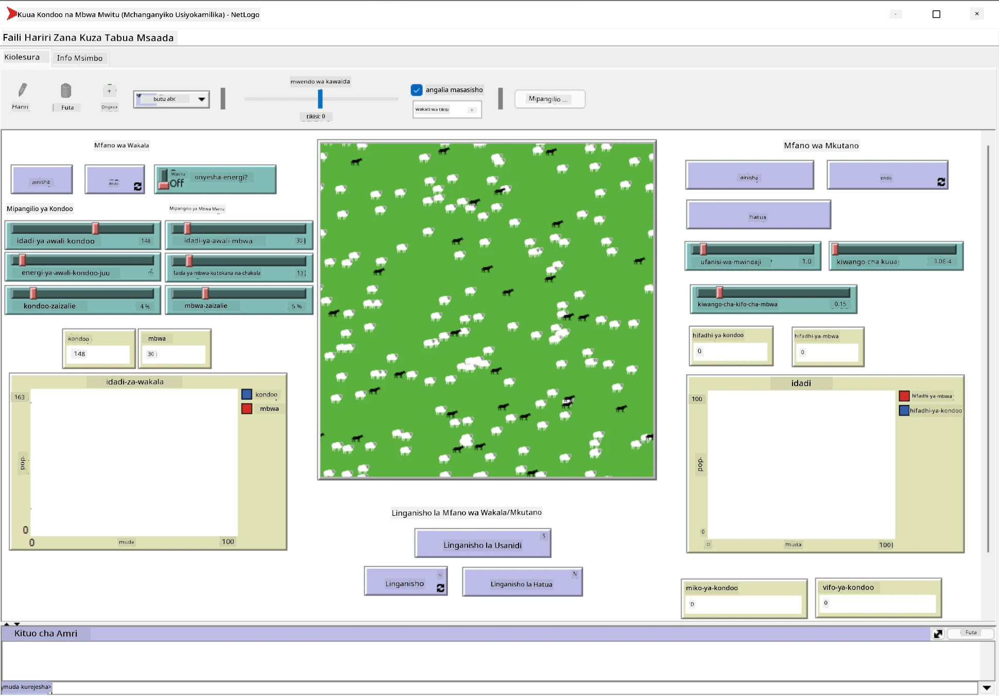

# Mfumo wa Wakala Wengi

Njia mojawapo ya kufanikisha akili ni mbinu inayoitwa **emergent** (au **synergetic**), ambayo inategemea ukweli kwamba tabia ya pamoja ya mawakala wengi wa kawaida inaweza kusababisha tabia ya jumla ya mfumo kuwa ngumu zaidi (au yenye akili). Kimsingi, hii inategemea kanuni za [Akili ya Pamoja](https://en.wikipedia.org/wiki/Collective_intelligence), [Emergentism](https://en.wikipedia.org/wiki/Global_brain) na [Evolutionary Cybernetics](https://en.wikipedia.org/wiki/Global_brain), ambazo zinasema kwamba mifumo ya kiwango cha juu hupata aina fulani ya thamani ya ziada inapounganishwa vizuri kutoka kwa mifumo ya kiwango cha chini (kanuni inayoitwa *metasystem transition*).

## [Maswali ya awali ya mihadhara](https://ff-quizzes.netlify.app/en/ai/quiz/45)

Mwelekeo wa **Mfumo wa Wakala Wengi** ulianza kujitokeza katika AI miaka ya 1990 kama jibu la ukuaji wa mtandao na mifumo ya kusambazwa. Mojawapo ya vitabu vya msingi vya AI, [Artificial Intelligence: A Modern Approach](https://en.wikipedia.org/wiki/Artificial_Intelligence:_A_Modern_Approach), linaangazia mtazamo wa AI ya jadi kutoka kwa mtazamo wa mifumo ya wakala wengi.

Kiini cha mbinu ya wakala wengi ni dhana ya **Wakala** - chombo kinachoishi katika **mazingira** fulani, ambacho kinaweza kutambua na kuchukua hatua juu yake. Hii ni tafsiri pana sana, na kunaweza kuwa na aina nyingi na uainishaji wa mawakala:

* Kwa uwezo wao wa kufikiri:
   - Mawakala **Reactive** mara nyingi huwa na tabia rahisi ya ombi-jibu
   - Mawakala **Deliberative** hutumia aina fulani ya mantiki ya kufikiri na/au uwezo wa kupanga
* Kwa mahali ambapo wakala huendesha msimbo wake:
   - Mawakala **Static** hufanya kazi kwenye nodi maalum ya mtandao
   - Mawakala **Mobile** wanaweza kuhamisha msimbo wao kati ya nodi za mtandao
* Kwa tabia yao:
   - Mawakala **Passive** hawana malengo maalum. Mawakala kama hao wanaweza kujibu vichocheo vya nje, lakini hawataanzisha vitendo vyovyote wenyewe.
   - Mawakala **Active** wana malengo fulani wanayoyafuatilia
   - Mawakala **Cognitive** wanahusisha upangaji na kufikiri kwa kina

Mifumo ya wakala wengi kwa sasa inatumika katika programu kadhaa:

* Katika michezo, wahusika wengi wasio wachezaji hutumia aina fulani ya AI, na wanaweza kuchukuliwa kuwa mawakala wenye akili
* Katika utengenezaji wa video, uundaji wa mandhari changamano za 3D zinazohusisha umati mara nyingi hufanywa kwa kutumia simulizi ya wakala wengi
* Katika uundaji wa mifumo, mbinu ya wakala wengi hutumika kuiga tabia ya mfano changamano. Kwa mfano, mbinu ya wakala wengi imetumika kwa mafanikio kutabiri kuenea kwa ugonjwa wa COVID-19 duniani. Mbinu kama hiyo inaweza kutumika kuiga trafiki katika jiji, na kuona jinsi inavyoitikia mabadiliko ya sheria za trafiki.
* Katika mifumo changamano ya kiotomatiki, kila kifaa kinaweza kutenda kama wakala huru, ambayo hufanya mfumo mzima kuwa na muundo usio wa monolith na wenye nguvu zaidi.

Hatutatumia muda mwingi kuingia kwa kina katika mifumo ya wakala wengi, lakini tutazingatia mfano mmoja wa **Uundaji wa Wakala Wengi**.

## NetLogo

[NetLogo](https://ccl.northwestern.edu/netlogo/) ni mazingira ya uundaji wa wakala wengi yanayotegemea toleo lililorekebishwa la lugha ya programu ya [Logo](https://en.wikipedia.org/wiki/Logo_(programming_language)). Lugha hii ilitengenezwa kwa ajili ya kufundisha dhana za programu kwa watoto, na inakuwezesha kudhibiti wakala anayeitwa **turtle**, ambaye anaweza kusonga, akiacha alama nyuma. Hii inaruhusu kuunda maumbo changamano ya kijiometri, ambayo ni njia ya kuona tabia ya wakala.

Katika NetLogo, tunaweza kuunda kasa wengi kwa kutumia amri ya `create-turtles`. Tunaweza kisha kuamuru kasa wote kufanya vitendo fulani (katika mfano hapa chini - kusonga mbele kwa pointi 10):

```
create-turtles 10
ask turtles [
  forward 10
]
```

Bila shaka, si jambo la kuvutia wakati kasa wote wanafanya kitu kimoja, kwa hivyo tunaweza `ask` vikundi vya kasa, kwa mfano wale walio karibu na eneo fulani. Tunaweza pia kuunda kasa wa *aina* tofauti kwa kutumia amri ya `breed [cats cat]`. Hapa `cat` ni jina la aina, na tunahitaji kutaja neno la umoja na wingi, kwa sababu amri tofauti hutumia aina tofauti kwa uwazi.

> ✅ Hatutaingia katika kujifunza lugha ya NetLogo yenyewe - unaweza kutembelea rasilimali bora ya [Beginner's Interactive NetLogo Dictionary](https://ccl.northwestern.edu/netlogo/bind/) ikiwa una nia ya kujifunza zaidi.

Unaweza [kupakua](https://ccl.northwestern.edu/netlogo/download.shtml) na kusakinisha NetLogo ili kuijaribu.

### Maktaba ya Miundo

Jambo zuri kuhusu NetLogo ni kwamba ina maktaba ya miundo inayofanya kazi ambayo unaweza kuijaribu. Nenda kwa **File &rightarrow; Models Library**, na una kategoria nyingi za miundo za kuchagua.



> Picha ya skrini ya maktaba ya miundo na Dmitry Soshnikov

Unaweza kufungua mojawapo ya miundo, kwa mfano **Biology &rightarrow; Flocking**.

### Kanuni Kuu

Baada ya kufungua mfano, unapelekwa kwenye skrini kuu ya NetLogo. Hapa kuna mfano wa mfano unaoelezea idadi ya mbwa mwitu na kondoo, kwa kuzingatia rasilimali finyu (nyasi).



> Picha ya skrini na Dmitry Soshnikov

Kwenye skrini hii, unaweza kuona:

* Sehemu ya **Interface** ambayo ina:
  - Uwanja mkuu, ambapo mawakala wote wanaishi
  - Vidhibiti tofauti: vifungo, slaidi, nk.
  - Grafu ambazo unaweza kutumia kuonyesha vigezo vya simulizi
* Kichupo cha **Code** ambacho kina mhariri, ambapo unaweza kuandika programu ya NetLogo

Katika hali nyingi, kiolesura kitakuwa na kifungo cha **Setup**, ambacho huanzisha hali ya simulizi, na kifungo cha **Go** kinachoanzisha utekelezaji. Hizi hushughulikiwa na vishughulikiaji vinavyolingana katika msimbo ambao huonekana kama hivi:

```
to go [
...
]
```

Ulimwengu wa NetLogo unajumuisha vitu vifuatavyo:

* **Mawakala** (kasa) ambao wanaweza kusonga kwenye uwanja na kufanya kitu. Unawaamuru mawakala kwa kutumia sintaksia ya `ask turtles [...]`, na msimbo kwenye mabano unatekelezwa na mawakala wote katika *hali ya kasa*.
* **Patches** ni maeneo ya mraba ya uwanja, ambapo mawakala wanaishi. Unaweza kurejelea mawakala wote kwenye kiraka kimoja, au unaweza kubadilisha rangi za kiraka na mali nyingine. Unaweza pia `ask patches` kufanya kitu.
* **Observer** ni wakala wa kipekee anayesimamia ulimwengu. Vishughulikiaji vyote vya vifungo hutekelezwa katika *hali ya mtazamaji*.

> ✅ Uzuri wa mazingira ya wakala wengi ni kwamba msimbo unaoendeshwa katika hali ya kasa au hali ya kiraka unatekelezwa kwa wakati mmoja na mawakala wote kwa sambamba. Kwa hivyo, kwa kuandika msimbo kidogo na kupanga tabia ya wakala mmoja, unaweza kuunda tabia changamano ya mfumo wa simulizi kwa ujumla.

### Flocking

Kama mfano wa tabia ya wakala wengi, hebu tuchunguze **[Flocking](https://en.wikipedia.org/wiki/Flocking_(behavior))**. Flocking ni muundo changamano ambao unafanana sana na jinsi makundi ya ndege huruka. Ukiwaangalia wakiruka unaweza kufikiria kwamba wanafuata aina fulani ya algoriti ya pamoja, au kwamba wanamiliki aina fulani ya *akili ya pamoja*. Hata hivyo, tabia hii changamano hutokea wakati kila wakala mmoja mmoja (katika kesi hii, *ndege*) anatazama tu mawakala wengine kwa umbali mfupi kutoka kwake, na kufuata sheria tatu rahisi:

* **Alignment** - inajielekeza kuelekea mwelekeo wa wastani wa mawakala wa jirani
* **Cohesion** - inajaribu kuelekea nafasi ya wastani ya majirani (*mvuto wa umbali mrefu*)
* **Separation** - inapokaribia sana ndege wengine, inajaribu kujiondoa (*kushinikiza kwa umbali mfupi*)

Unaweza kuendesha mfano wa flocking na kutazama tabia. Unaweza pia kurekebisha vigezo, kama vile *kiwango cha kujitenga*, au *eneo la kuona*, ambalo linafafanua jinsi kila ndege anaweza kuona mbali. Kumbuka kwamba ukipunguza eneo la kuona hadi 0, ndege wote wanakuwa vipofu, na flocking inakoma. Ukipunguza kujitenga hadi 0, ndege wote hukusanyika katika mstari wa moja kwa moja.

> ✅ Badilisha hadi kichupo cha **Code** na uone mahali ambapo sheria tatu za flocking (alignment, cohesion na separation) zinatekelezwa katika msimbo. Kumbuka jinsi tunavyorejelea tu mawakala walioko kwenye eneo la kuona.

### Miundo Mingine ya Kuona

Kuna miundo mingine ya kuvutia ambayo unaweza kujaribu:

* **Art &rightarrow; Fireworks** inaonyesha jinsi fataki zinaweza kuchukuliwa kuwa tabia ya pamoja ya mito ya moto ya mtu binafsi
* **Social Science &rightarrow; Traffic Basic** na **Social Science &rightarrow; Traffic Grid** zinaonyesha mfano wa trafiki ya jiji katika gridi ya 1D na 2D bila au na taa za trafiki. Kila gari katika simulizi hufuata sheria zifuatazo:
   - Ikiwa nafasi mbele yake iko wazi - ongeza kasi (hadi kasi fulani ya juu)
   - Ikiwa linaona kikwazo mbele - punguza kasi (na unaweza kurekebisha jinsi dereva anaweza kuona mbali)
* **Social Science &rightarrow; Party** inaonyesha jinsi watu wanavyokusanyika pamoja wakati wa sherehe ya vinywaji. Unaweza kupata mchanganyiko wa vigezo vinavyopelekea ongezeko la haraka la furaha ya kikundi.

Kama unavyoona kutoka kwa mifano hii, simulizi za wakala wengi zinaweza kuwa njia muhimu ya kuelewa tabia ya mfumo changamano unaojumuisha watu binafsi wanaofuata mantiki sawa au inayofanana. Pia inaweza kutumika kudhibiti mawakala wa kawaida, kama [NPCs](https://en.wikipedia.org/wiki/NPC) katika michezo ya kompyuta, au mawakala katika ulimwengu wa 3D uliotengenezwa.

## Mawakala Deliberative

Mawakala waliotajwa hapo juu ni rahisi sana, wakijibu mabadiliko katika mazingira kwa kutumia aina fulani ya algoriti. Kwa hivyo wao ni **mawakala reactive**. Hata hivyo, wakati mwingine mawakala wanaweza kufikiri na kupanga vitendo vyao, ambapo wanaitwa **deliberative**.

Mfano wa kawaida ungekuwa wakala binafsi anayepokea maagizo kutoka kwa binadamu ya kuweka nafasi ya ziara ya likizo. Fikiria kwamba kuna mawakala wengi wanaoishi kwenye mtandao, ambao wanaweza kumsaidia. Inapaswa kisha kuwasiliana na mawakala wengine kuona ni safari gani zinapatikana, bei za hoteli kwa tarehe tofauti, na kujaribu kujadiliana bei bora. Mpango wa likizo unapokamilika na kuthibitishwa na mmiliki, inaweza kuendelea na uhifadhi.

Ili kufanya hivyo, mawakala wanahitaji **kuwasiliana**. Kwa mawasiliano yenye mafanikio wanahitaji:

* Baadhi ya **lugha za kawaida za kubadilishana maarifa**, kama [Knowledge Interchange Format](https://en.wikipedia.org/wiki/Knowledge_Interchange_Format) (KIF) na [Knowledge Query and Manipulation Language](https://en.wikipedia.org/wiki/Knowledge_Query_and_Manipulation_Language) (KQML). Lugha hizi zimetengenezwa kwa msingi wa [Speech Act theory](https://en.wikipedia.org/wiki/Speech_act).
* Lugha hizo zinapaswa pia kujumuisha baadhi ya **itikadi za mazungumzo**, zinazotegemea aina tofauti za **mnada**.
* **Ontolojia ya kawaida** ya kutumia, ili waweze kurejelea dhana sawa wakijua maana yake
* Njia ya **kugundua** kile mawakala tofauti wanaweza kufanya, pia kwa msingi wa aina fulani ya ontolojia

Mawakala deliberative ni changamano zaidi kuliko reactive, kwa sababu hawajibu tu mabadiliko katika mazingira, wanapaswa pia kuwa na uwezo wa *kuanzisha* vitendo. Mojawapo ya miundo iliyopendekezwa kwa mawakala deliberative ni wakala wa Belief-Desire-Intention (BDI):

* **Beliefs** huunda seti ya maarifa kuhusu mazingira ya wakala. Inaweza kuwa na muundo kama msingi wa maarifa au seti ya sheria ambazo wakala anaweza kutumia kwa hali fulani katika mazingira.
* **Desires** hufafanua kile wakala anataka kufanya, yaani malengo yake. Kwa mfano, lengo la wakala msaidizi binafsi hapo juu ni kuweka nafasi ya ziara, na lengo la wakala wa hoteli ni kuongeza faida.
* **Intentions** ni vitendo maalum ambavyo wakala anapanga kufanikisha malengo yake. Vitendo kwa kawaida hubadilisha mazingira na kusababisha mawasiliano na mawakala wengine.

Kuna majukwaa kadhaa yanayopatikana kwa ajili ya kujenga mifumo ya wakala wengi, kama [JADE](https://jade.tilab.com/). [Karatasi hii](https://arxiv.org/ftp/arxiv/papers/2007/2007.08961.pdf) ina mapitio ya majukwaa ya wakala wengi, pamoja na historia fupi ya mifumo ya wakala wengi na hali tofauti za matumizi.

## Hitimisho

Mifumo ya Wakala Wengi inaweza kuchukua aina tofauti sana na kutumika katika programu nyingi tofauti. 
Yote huwa na mwelekeo wa tabia rahisi ya wakala mmoja, na kufanikisha tabia changamano ya mfumo mzima kutokana na **athari ya synergetic**.

## 🚀 Changamoto

Chukua somo hili katika ulimwengu halisi na jaribu kufikiria mfumo wa wakala wengi ambao unaweza kutatua tatizo. Kwa mfano, mfumo wa wakala wengi ungehitaji kufanya nini ili kuboresha njia ya basi la shule? Unaweza kufanya kazi vipi katika mkate?

## [Maswali ya baada ya mihadhara](https://ff-quizzes.netlify.app/en/ai/quiz/46)

## Mapitio na Kujifunza Binafsi

Pitia matumizi ya aina hii ya mfumo katika sekta. Chagua uwanja kama utengenezaji au sekta ya michezo ya video na ugundue jinsi mifumo ya wakala wengi inaweza kutumika kutatua matatizo ya kipekee.

## [Kazi ya NetLogo](assignment.md)

---

