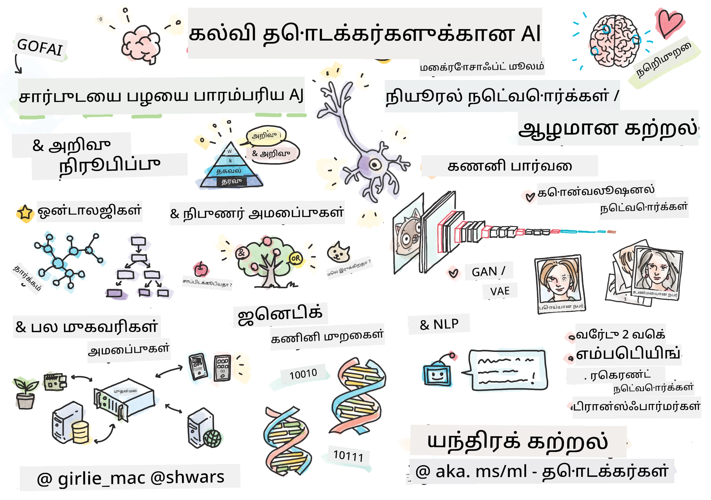

[](https://github.com/microsoft/AI-For-Beginners/blob/main/LICENSE)
[](https://GitHub.com/microsoft/AI-For-Beginners/graphs/contributors/)
[](https://GitHub.com/microsoft/AI-For-Beginners/issues/)
[](https://GitHub.com/microsoft/AI-For-Beginners/pulls/)
[](http://makeapullrequest.com)

[](https://GitHub.com/microsoft/AI-For-Beginners/watchers/)
[](https://GitHub.com/microsoft/AI-For-Beginners/network/)
[](https://GitHub.com/microsoft/AI-For-Beginners/stargazers/)
[](https://mybinder.org/v2/gh/microsoft/ai-for-beginners/HEAD)
[](https://gitter.im/Microsoft/ai-for-beginners?utm_source=badge&utm_medium=badge&utm_campaign=pr-badge)

[](https://discord.gg/nTYy5BXMWG)

# முதல்முறையாக கற்கArtificial Intelligence - பாடத்திட்டம்

||
|:---:|
| AI முதன்முறையாக கற்றல் - _[கிர்லி_மேக்](https://twitter.com/girlie_mac) ஆல் செய்த ஸ்கெட்ச் நோட்_ |

**கற்பனை வாய்ந்த நுண்ணறிவு** (AI) உலகத்தை எங்கள் 12-வாரம், 24-பாடங்களுடைய பாடத்திட்டத்துடன் அறியுங்கள்! இது நடைமுறை பாடங்கள், வினாத்தாள் மற்றும் ஆய்வுக்கூடங்கள் கொண்டுள்ளது. பாடத்திட்டம் தொடக்க நிலை பிறைக்கும் மற்றும் TensorFlow மற்றும் PyTorch போன்ற கருவிகள் மற்றும் AI துறையில் நெறிமுறைகளையும் உள்ளடக்கியதாக உள்ளது.


### 🌐 பல மொழி ஆதரவு

#### GitHub செயல்படும் உதவியுடன் (தானாகவும் எப்போதும் மேம்படுத்தப்படும்)

<!-- CO-OP TRANSLATOR LANGUAGES TABLE START -->
[Arabic](../ar/README.md) | [Bengali](../bn/README.md) | [Bulgarian](../bg/README.md) | [Burmese (Myanmar)](../my/README.md) | [Chinese (Simplified)](../zh-CN/README.md) | [Chinese (Traditional, Hong Kong)](../zh-HK/README.md) | [Chinese (Traditional, Macau)](../zh-MO/README.md) | [Chinese (Traditional, Taiwan)](../zh-TW/README.md) | [Croatian](../hr/README.md) | [Czech](../cs/README.md) | [Danish](../da/README.md) | [Dutch](../nl/README.md) | [Estonian](../et/README.md) | [Finnish](../fi/README.md) | [French](../fr/README.md) | [German](../de/README.md) | [Greek](../el/README.md) | [Hebrew](../he/README.md) | [Hindi](../hi/README.md) | [Hungarian](../hu/README.md) | [Indonesian](../id/README.md) | [Italian](../it/README.md) | [Japanese](../ja/README.md) | [Kannada](../kn/README.md) | [Korean](../ko/README.md) | [Lithuanian](../lt/README.md) | [Malay](../ms/README.md) | [Malayalam](../ml/README.md) | [Marathi](../mr/README.md) | [Nepali](../ne/README.md) | [Nigerian Pidgin](../pcm/README.md) | [Norwegian](../no/README.md) | [Persian (Farsi)](../fa/README.md) | [Polish](../pl/README.md) | [Portuguese (Brazil)](../pt-BR/README.md) | [Portuguese (Portugal)](../pt-PT/README.md) | [Punjabi (Gurmukhi)](../pa/README.md) | [Romanian](../ro/README.md) | [Russian](../ru/README.md) | [Serbian (Cyrillic)](../sr/README.md) | [Slovak](../sk/README.md) | [Slovenian](../sl/README.md) | [Spanish](../es/README.md) | [Swahili](../sw/README.md) | [Swedish](../sv/README.md) | [Tagalog (Filipino)](../tl/README.md) | [Tamil](./README.md) | [Telugu](../te/README.md) | [Thai](../th/README.md) | [Turkish](../tr/README.md) | [Ukrainian](../uk/README.md) | [Urdu](../ur/README.md) | [Vietnamese](../vi/README.md)

> **உங்களை நகலெடுக்க விரும்புகிறீர்களா?**

> இந்த களஞ்சியத்தில் 50+ மொழி மொழிபெயர்ப்புக்கள் உள்ளன, இது பதிவிறக்க அளவை பெரிதாக்குகிறது. மொழிபெயர்ப்புகள் இல்லாமல் நகலெடுக்க, sparse checkout பயன்படுத்தவும்:
> ```bash
> git clone --filter=blob:none --sparse https://github.com/microsoft/AI-For-Beginners.git
> cd AI-For-Beginners
> git sparse-checkout set --no-cone '/*' '!translations' '!translated_images'
> ```
> இது பாடத்திட்டத்தை மிக வேகமாக முடிக்க தேவையான அனைத்தையும் வழங்கும்.
<!-- CO-OP TRANSLATOR LANGUAGES TABLE END -->

**மேலதிக மொழிபெயர்ப்பு மொழிகள் ஆதரிக்க விரும்பினால் இங்கே பட்டியலிடப்பட்டுள்ளன [here](https://github.com/Azure/co-op-translator/blob/main/getting_started/supported-languages.md)**

## சமூகத்தில் சேருங்கள்
[](https://discord.gg/nTYy5BXMWG)

## நீங்கள் என்ன கற்றுக்கொள்வீர்கள்

**[பாடத்தின் மன்சொறி வரைபடம்](http://soshnikov.com/courses/ai-for-beginners/mindmap.html)**

இந்த பாடத்திட்டத்தில் நீங்கள் கற்றுக்கொள்வீர்கள்:

* "நல்ல பழைய" அடையாள வரையறை மற்றும் அறிநிலை காரணிப்பு உடன் **அறிவுச் சட்டியல்** உட்பட farklı செயற்கை நுண்ணறிவு அணுகுமுறைகள் ([GOFAI](https://en.wikipedia.org/wiki/Symbolic_artificial_intelligence)).
* **நியூரல் நெட்வொர்க்குகள்** மற்றும் **ஆழ்ந்த கற்றல்**, இவை நவீன AI இன் மையத்தில் உள்ளன. இந்த முக்கிய தலைப்புகளின் பின்னணியில் இருக்கும் கருத்துக்களை இரண்டு பிரபலமான சூழலான நிகழ்த்தல் மென்பொருட்கள் - [TensorFlow](http://Tensorflow.org) மற்றும் [PyTorch](http://pytorch.org) - மூலம் விளக்குவோம்.
* படங்கள் மற்றும் உரையுடன் வேலை செய்ய **நியூரல் அமைப்புகள்**. சமீபத்திய மாதிரிகள் பற்றிப் பேசுவோம், ஆனால் தற்போது நடந்துருக்கும் முன்னேற்றத்தில் சற்று குறைவு இருக்கலாம்.
* குறைத்து பிரபலமான AI அணுகுமுறைகள், உதாரணமாக **மரபணு ஆல்காரிதம்கள்** மற்றும் **பன்முகக் காரியக்காரர் அமைப்புகள்**.

இந்த பாடத்திட்டத்தில் நாங்கள் பேசப்போகாதவை:

> [இனையத்தில் Microsoft Learn தொகுப்பில் இந்த பாடத்திட்டத்திற்கு அனைத்து கூடுதல் வளங்களையும் காண்க](https://learn.microsoft.com/en-us/collections/7w28iy2xrqzdj0?WT.mc_id=academic-77998-bethanycheum)

* **வணிகத்தில் AI** பயன்படுத்துவதற்கான வணிக வழக்குகள். Microsoft Learn இல் உள்ள [வணிகப் பயனாளிகளுக்கான AI அறிமுகம்](https://docs.microsoft.com/learn/paths/introduction-ai-for-business-users/?WT.mc_id=academic-77998-bethanycheum) கற்றல் பாதையை ஏற்றுக்கொள்ளவும் அல்லது [AI வணிகப் பள்ளி](https://www.microsoft.com/ai/ai-business-school/?WT.mc_id=academic-77998-bethanycheum), [INSEAD](https://www.insead.edu/) உடன் ஒத்துழைவுடன் உருவாக்கப்பட்டது.
* நம்முடைய [மெஷின் லெர்ணிங் முதல்முறையாளர்களுக்கான பாடத்திட்டம்](http://github.com/Microsoft/ML-for-Beginners) மூலம் நல்ல விளக்கம் காணப்படும் **சாதாரண மெஷின் லெர்ணிங்**.
* **[கோக்னிடிவ் சர்வீஸ்கள்](https://azure.microsoft.com/services/cognitive-services/?WT.mc_id=academic-77998-bethanycheum)** கொண்டு உருவாக்கப்படும் நடைமுறை AI பயன்பாடுகள். இதற்காக, Microsoft Learn இல் உள்ள [காட்சி](https://docs.microsoft.com/learn/paths/create-computer-vision-solutions-azure-cognitive-services/?WT.mc_id=academic-77998-bethanycheum), [பொதுவான மொழி செயலாக்கம்](https://docs.microsoft.com/learn/paths/explore-natural-language-processing/?WT.mc_id=academic-77998-bethanycheum), **[Azure OpenAI சேவையைப் பயன்படுத்தி உருவாக்கும் AI](https://learn.microsoft.com/en-us/training/paths/develop-ai-solutions-azure-openai/?WT.mc_id=academic-77998-bethanycheum)** மற்றும் பிற செயல்களைத் தொடங்க பரிந்துரைக்கின்றோம்.
* **கடவு மேக அமைப்புக்கள்**, உதா: [Azure Machine Learning](https://azure.microsoft.com/services/machine-learning/?WT.mc_id=academic-77998-bethanycheum), [Microsoft Fabric](https://learn.microsoft.com/en-us/training/paths/get-started-fabric/?WT.mc_id=academic-77998-bethanycheum), அல்லது [Azure Databricks](https://docs.microsoft.com/learn/paths/data-engineer-azure-databricks?WT.mc_id=academic-77998-bethanycheum). [Azure Machine Learning மூலம் மெஷின் லெர்ணிங் தீர்வுகளை உருவாக்கவும் இயக்கவும்](https://docs.microsoft.com/learn/paths/build-ai-solutions-with-azure-ml-service/?WT.mc_id=academic-77998-bethanycheum) மற்றும் [Azure Databricks மூலம் மெஷின் லெர்ணிங் தீர்வுகளை உருவாக்கவும் இயக்கவும்](https://docs.microsoft.com/learn/paths/build-operate-machine-learning-solutions-azure-databricks/?WT.mc_id=academic-77998-bethanycheum) கற்றல் பாதைகளைப் பயன்படுத்த பரிந்துரைக்கிறோம்.
* ** உரையாடல் AI** மற்றும் **சாட் பா்ட்கள்**. திறம்பட தயாரிக்கப்பட்ட [உரையாடல் AI தீர்வுகளை உருவாக்கு](https://docs.microsoft.com/learn/paths/create-conversational-ai-solutions/?WT.mc_id=academic-77998-bethanycheum) கற்றல் பாதை உள்ளது, மேலும் விவரங்களுக்கு [இந்த வலைப்பதிவு](https://soshnikov.com/azure/hello-bot-conversational-ai-on-microsoft-platform/)ஐ பார்க்கலாம்.
* ஆழ்ந்த கற்றலுக்குப் பின்புற உள்ள **ஆழ்ந்த கணிதம்**. இதற்காக, Ian Goodfellow, Yoshua Bengio மற்றும் Aaron Courville எழுதிய [ஆழ்ந்த கற்றல்](https://www.amazon.com/Deep-Learning-Adaptive-Computation-Machine/dp/0262035618) புத்தகத்தை பரிந்துரைக்கிறோம், இது ஆன்லைனில் [https://www.deeplearningbook.org/](https://www.deeplearningbook.org/) லும் கிடைக்கிறது.

_கடவு கண்டறிதலை அறிமுகமாகக் கற்க_ விரும்பினால், [Azure இல் செயற்கை நுண்ணறிவுடன் துவங்கவும்](https://docs.microsoft.com/learn/paths/get-started-with-artificial-intelligence-on-azure/?WT.mc_id=academic-77998-bethanycheum) கற்றல் பாதையை எடுத்துக்கொள்ளலாம்.

# உள்ளடக்கம்

|     |                                                                 பாட இணைப்பு                                                                  |                                           PyTorch/Keras/TensorFlow                                          | ஆய்வு கூடம்                                                            |
| :-: | :------------------------------------------------------------------------------------------------------------------------------------------: | :---------------------------------------------------------------------------------------------: | ------------------------------------------------------------------------------ |
| 0  |                                 [பாட செயலாக்கம்](./lessons/0-course-setup/setup.md)                                 |                      [உங்கள் மேம்பாட்டு சூழலை அமைக்கவும்](./lessons/0-course-setup/how-to-run.md)                       |   |
| I  |               [**AI அறிமுகம்**](./lessons/1-Intro/README.md)      | | |
| 01  |       [AI அறிமுகமும் வரலாறும்](./lessons/1-Intro/README.md)       |           -                            | -  |
| II |              **அறிவாய்வு AI**              |
| 02  |       [அறிவு பிரதிநிதித்துவம் மற்றும் நிபுணர் அமைப்புகள்](./lessons/2-Symbolic/README.md)       |            [நிபுணர் அமைப்புகள்](./lessons/2-Symbolic/Animals.ipynb) /  [உணர்வு தொகுப்பு](./lessons/2-Symbolic/FamilyOntology.ipynb) /[கருத்துக் காட்சி](./lessons/2-Symbolic/MSConceptGraph.ipynb)                             |  |
| III |                        [**நியூரல் நெட்வொர்க்குகள் அறிமுகம்**](./lessons/3-NeuralNetworks/README.md) |||
| 03  |                [பெர்செப்ட்ரான்](./lessons/3-NeuralNetworks/03-Perceptron/README.md)                 |                       [நோட்புக்](./lessons/3-NeuralNetworks/03-Perceptron/Perceptron.ipynb)                      | [லேப்](./lessons/3-NeuralNetworks/03-Perceptron/lab/README.md) |
| 04  |                   [பல அடுக்கு பெர்செப்ட்ரான் மற்றும் எங்கள் சொந்த கட்டமைப்பை உருவாக்குதல்](./lessons/3-NeuralNetworks/04-OwnFramework/README.md)                   |        [நோட்புக்](./lessons/3-NeuralNetworks/04-OwnFramework/OwnFramework.ipynb)        | [லேப்](./lessons/3-NeuralNetworks/04-OwnFramework/lab/README.md) |
| 05  |            [கட்டமைப்புக்களுக்கு அறிமுகம் (PyTorch/TensorFlow) மற்றும் ஓவர்ஃபிட்டிங்](./lessons/3-NeuralNetworks/05-Frameworks/README.md)             |           [PyTorch](./lessons/3-NeuralNetworks/05-Frameworks/IntroPyTorch.ipynb) / [Keras](./lessons/3-NeuralNetworks/05-Frameworks/IntroKeras.ipynb) / [TensorFlow](./lessons/3-NeuralNetworks/05-Frameworks/IntroKerasTF.ipynb)             | [லேப்](./lessons/3-NeuralNetworks/05-Frameworks/lab/README.md) |
| IV  |            [**கணினி பார்வை**](./lessons/4-ComputerVision/README.md)             | [PyTorch](https://docs.microsoft.com/learn/modules/intro-computer-vision-pytorch/?WT.mc_id=academic-77998-cacaste) / [TensorFlow](https://docs.microsoft.com/learn/modules/intro-computer-vision-TensorFlow/?WT.mc_id=academic-77998-cacaste)| [Microsoft Azure-ல் கணினி பார்வையை ஆராயுங்கள்](https://learn.microsoft.com/en-us/collections/7w28iy2xrqzdj0?WT.mc_id=academic-77998-bethanycheum) |
| 06  |            [கணினி பார்வைக்கான அறிமுகம். OpenCV](./lessons/4-ComputerVision/06-IntroCV/README.md)             |           [நோட்புக்](./lessons/4-ComputerVision/06-IntroCV/OpenCV.ipynb)         | [லேப்](./lessons/4-ComputerVision/06-IntroCV/lab/README.md) |
| 07  |            [கொன்வல்யூஷனல் நியூரல் நெட்வொர்க்குகள்](./lessons/4-ComputerVision/07-ConvNets/README.md) &  [CNN கட்டமைப்புகள்](./lessons/4-ComputerVision/07-ConvNets/CNN_Architectures.md)             |           [PyTorch](./lessons/4-ComputerVision/07-ConvNets/ConvNetsPyTorch.ipynb) /[TensorFlow](./lessons/4-ComputerVision/07-ConvNets/ConvNetsTF.ipynb)             | [லேப்](./lessons/4-ComputerVision/07-ConvNets/lab/README.md) |
| 08  |            [முன்னருந்து பயிற்சி பெற்ற நெட்வொர்க்குகள் மற்றும் மாற்று கற்றல்](./lessons/4-ComputerVision/08-TransferLearning/README.md) மற்றும் [பயிற்சி நுட்பங்கள்](./lessons/4-ComputerVision/08-TransferLearning/TrainingTricks.md)             |           [PyTorch](./lessons/4-ComputerVision/08-TransferLearning/TransferLearningPyTorch.ipynb) / [TensorFlow](./lessons/3-NeuralNetworks/05-Frameworks/IntroKerasTF.ipynb)             | [லேப்](./lessons/4-ComputerVision/08-TransferLearning/lab/README.md) |
| 09  |            [ஆட்டோஎன்கோடர்கள் மற்றும் VAEகள்](./lessons/4-ComputerVision/09-Autoencoders/README.md)             |           [PyTorch](./lessons/4-ComputerVision/09-Autoencoders/AutoEncodersPyTorch.ipynb) / [TensorFlow](./lessons/4-ComputerVision/09-Autoencoders/AutoencodersTF.ipynb)             |  |
| 10  |            [பரிணாம மோதல் நெட்வொர்க்குகள் மற்றும் கலை ஸ்டைல் மாற்றம்](./lessons/4-ComputerVision/10-GANs/README.md)             |           [PyTorch](./lessons/4-ComputerVision/10-GANs/GANPyTorch.ipynb) / [TensorFlow](./lessons/4-ComputerVision/10-GANs/GANTF.ipynb)             |  |
| 11  |            [பொருள் கண்டறிதல்](./lessons/4-ComputerVision/11-ObjectDetection/README.md)             |         [TensorFlow](./lessons/4-ComputerVision/11-ObjectDetection/ObjectDetection.ipynb)             | [லேப்](./lessons/4-ComputerVision/11-ObjectDetection/lab/README.md) |
| 12  |            [பொருள் பிரிவினை. U-Net](./lessons/4-ComputerVision/12-Segmentation/README.md)             |           [PyTorch](./lessons/4-ComputerVision/12-Segmentation/SemanticSegmentationPytorch.ipynb) / [TensorFlow](./lessons/4-ComputerVision/12-Segmentation/SemanticSegmentationTF.ipynb)             |  |
| V  |            [**இயற்கை மொழி செயலாக்கம்**](./lessons/5-NLP/README.md)             | [PyTorch](https://docs.microsoft.com/learn/modules/intro-natural-language-processing-pytorch/?WT.mc_id=academic-77998-cacaste) /[TensorFlow](https://docs.microsoft.com/learn/modules/intro-natural-language-processing-TensorFlow/?WT.mc_id=academic-77998-cacaste) | [Microsoft Azure-ல் இயற்கை மொழி செயலாக்கத்தை ஆராயுங்கள்](https://learn.microsoft.com/en-us/collections/7w28iy2xrqzdj0?WT.mc_id=academic-77998-bethanycheum)|
| 13  |            [உரை பிரதிநிதித்துவம். Bow/TF-IDF](./lessons/5-NLP/13-TextRep/README.md)             |           [PyTorch](https://github.com/microsoft/AI-For-Beginners/blob/main/lessons/5-NLP/13-TextRep/TextRepresentationPyTorch.ipynb) / [TensorFlow](https://github.com/microsoft/AI-For-Beginners/blob/main/lessons/5-NLP/13-TextRep/TextRepresentationTF.ipynb)             | |
| 14  |            [அர்த்தமுள்ள வார்த்தை குறியாக்கங்கள். Word2Vec மற்றும் GloVe](./lessons/5-NLP/14-Embeddings/README.md)             |           [PyTorch](https://github.com/microsoft/AI-For-Beginners/blob/main/lessons/5-NLP/14-Embeddings/EmbeddingsPyTorch.ipynb) / [TensorFlow](https://github.com/microsoft/AI-For-Beginners/blob/main/lessons/5-NLP/14-Embeddings/EmbeddingsTF.ipynb)             |  |
| 15  |            [மொழி மாதிரியாக்கல். உங்கள் சொந்த குறியாக்கங்களை பயிற்சி செய்தல்](./lessons/5-NLP/15-LanguageModeling/README.md)             |           [PyTorch](https://github.com/microsoft/AI-For-Beginners/blob/main/lessons/5-NLP/15-LanguageModeling/CBoW-PyTorch.ipynb) / [TensorFlow](https://github.com/microsoft/AI-For-Beginners/blob/main/lessons/5-NLP/15-LanguageModeling/CBoW-TF.ipynb)             | [லேப்](./lessons/5-NLP/15-LanguageModeling/lab/README.md) |
| 16  |            [மீள நடை நியூரல் நெட்வொர்க்குகள்](./lessons/5-NLP/16-RNN/README.md)             |           [PyTorch](https://github.com/microsoft/AI-For-Beginners/blob/main/lessons/5-NLP/16-RNN/RNNPyTorch.ipynb) / [TensorFlow](https://github.com/microsoft/AI-For-Beginners/blob/main/lessons/5-NLP/16-RNN/RNNTF.ipynb)             |  |
| 17  |            [பரிணாம மீள நடை நெட்வொர்க்குகள்](./lessons/5-NLP/17-GenerativeNetworks/README.md)             |           [PyTorch](https://github.com/microsoft/AI-For-Beginners/blob/main/lessons/5-NLP/17-GenerativeNetworks/GenerativePyTorch.ipynb) / [TensorFlow](https://github.com/microsoft/AI-For-Beginners/blob/main/lessons/5-NLP/17-GenerativeNetworks/GenerativeTF.ipynb)             | [லேப்](./lessons/5-NLP/17-GenerativeNetworks/lab/README.md) |
| 18  |            [டிரான்ஸ்ஃபார்மர்கள். BERT.](./lessons/5-NLP/18-Transformers/README.md)             |           [PyTorch](https://github.com/microsoft/AI-For-Beginners/blob/main/lessons/5-NLP/18-Transformers/TransformersPyTorch.ipynb) /[TensorFlow](https://github.com/microsoft/AI-For-Beginners/blob/main/lessons/5-NLP/18-Transformers/TransformersTF.ipynb)             |  |
| 19  |            [பெயர் உள்ளடக்கிய அலகு அறிவு](./lessons/5-NLP/19-NER/README.md)             |           [TensorFlow](https://microsoft.github.io/AI-For-Beginners/lessons/5-NLP/19-NER/NER-TF.ipynb)             | [லேப்](./lessons/5-NLP/19-NER/lab/README.md) |
| 20  |            [பெரிய மொழி மாதிரிகள், புகைப்பட நிரலைக்்குறிப்பு மற்றும் சில-காட்சி பணிகள்](./lessons/5-NLP/20-LangModels/README.md)             |           [PyTorch](https://microsoft.github.io/AI-For-Beginners/lessons/5-NLP/20-LangModels/GPT-PyTorch.ipynb) | |
| VI |            **மற்ற AI தொழில்நுட்பங்கள்** || |
| 21  |            [மறுமலர்ச்சிச் செல்லுவியல் அலகுகள்](./lessons/6-Other/21-GeneticAlgorithms/README.md)             |           [நோட்புக்](./lessons/6-Other/21-GeneticAlgorithms/Genetic.ipynb) | |
| 22  |            [ஆழ்ந்த ஊக்குவிப்பு கற்றல்](./lessons/6-Other/22-DeepRL/README.md)             |           [PyTorch](./lessons/6-Other/22-DeepRL/CartPole-RL-PyTorch.ipynb) /[TensorFlow](./lessons/6-Other/22-DeepRL/CartPole-RL-TF.ipynb)             | [லேப்](./lessons/6-Other/22-DeepRL/lab/README.md) |
| 23  |            [பல முகவர் அமைப்புகள்](./lessons/6-Other/23-MultiagentSystems/README.md)             |  | |
| VII |            **AI ஒழுக்கவியல்** | | |
| 24  |            [AI ஒழுக்கவியல் மற்றும் பொறுப்புடைமையான AI](./lessons/7-Ethics/README.md)             |           [Microsoft Learn: பொறுப்புடைமையான AI கோட்பாடுகள்](https://docs.microsoft.com/learn/paths/responsible-ai-business-principles/?WT.mc_id=academic-77998-cacaste) | |
| IX  |            **கூடுதல்** | | |
| 25  |            [பல-மகுக சார்ந்த நெட்வொர்க்குகள், CLIP மற்றும் VQGAN](./lessons/X-Extras/X1-MultiModal/README.md)             |           [நோட்புக்](./lessons/X-Extras/X1-MultiModal/Clip.ipynb)    | |

## ஒவ்வொரு பாடமும் கொண்டிருக்கும்

* முன் பாடக் கற்றல் பொருள்
* செயற்படுத்தக்கூடிய ஜுபிட்டர் நோட்புக்குகள், பெரும்பாலும் கட்டமைப்புக்குப் பங்களிப்பானவை (**PyTorch** அல்லது **TensorFlow**). செயற்படுத்தக்கூடிய நோட்புக்கில் நிறைய கூர்மையான கருத்துக்களும் இருப்பதால், பொருளை புரிந்து கொள்ள குறைந்தது ஒரு வடிவம் (PyTorch அல்லது TensorFlow) நோட்புக்கை முழுமையாகப் பார்ப்பது அவசியம்.
* சில பொருட்களுக்கு கிடைக்கும் **லேப்கள்**, இவை நீங்கள் கற்றுக்கொண்ட கதவுக்களை ஒரு குறிப்பிட்ட பிரச்சினைக்கு பயன்படுத்த முயற்சிக்க உதவுகின்றன.
* சில பகுதிகள் [**MS Learn**](https://learn.microsoft.com/en-us/collections/7w28iy2xrqzdj0?WT.mc_id=academic-77998-bethanycheum) தொகுப்புகள் மூலம் தொடர்புடைய தலைப்புகளை வழங்குகின்றன.

## தொடங்குவதற்கு

### 🎯 AI-க்கு புதியவரா? இதிலிருந்து துவங்குங்கள்!

AI-இல் முற்றிலும் புதியவர்களாக நினைத்தால், விரைவான, கையால் செய்யக்கூடிய எடுத்துக்காட்டுகளை எங்கள் [**ஆரம்பநிலை நண்பர்களுக்கான எடுத்துக்காட்டுகள்**](./examples/README.md) பகுதியில் பார்க்கவும்! இதில் அடங்கும்:

- 🌟 **ஹலோ AI உலகம்** - உங்கள் முதல் AI திட்டம் (மாதிரி அடையாளம்)
- 🧠 **எளிய நியூரல் நெட்வொர்க்** - ஆரம்பத்திலிருந்தே நியூரல் நெட்வொர்க் கட்டமைக்கவும்  

- 🖼️ **பட வகைப்பணி** - விரிவான குறிப்புகளுடன் படங்களை வகைப்படுத்து
- 💬 **எழுத்து உணர்வு** - நேர்மறை/எதிர்மறை எழுத்துகளை பகுப்பாய்வு செய்

இந்த உதாரணங்கள் முழு பாடத்திட்டத்தில் குதிப்பதற்கு முன் AI கருத்துக்களை புரிந்து கொள்வதற்கு உதவ வடிவமைக்கப்பட்டுள்ளன.

### 📚 முழு பாடத்திட்ட அமைப்பு

- உங்கள் மேம்பாட்டு சூழலை அமைக்க உதவ [அமைப்பு பாடம்](./lessons/0-course-setup/setup.md) உருவாக்கியுள்ளோம். - ஆசிரியர்களுக்காகவும் ஒரு [பாடத்திட்ட அமைப்பு பாடம்](./lessons/0-course-setup/for-teachers.md) உருவாக்கியுள்ளோம்!
- [VSCode அல்லது Codespace இல் கோ드를 இயக்குவது எப்படி](./lessons/0-course-setup/how-to-run.md)

இந்த படிகளை பின்பற்றவும்:

களஞ்சியத்தை Fork செய்யவும்: இந்த பக்கத்தின் மேல் வலது மூலையில் உள்ள "Fork" பொத்தானை கிளிக் செய்யவும்.

களஞ்சியத்தை Clone செய்யவும்: `git clone https://github.com/microsoft/AI-For-Beginners.git`

இனிமேல் எளிதாக கண்டுபிடிக்க இந்த கோப்பகத்தை நிலைநிறுத்த (🌟) மறக்கவேண்டாம்.

## மற்ற கற்றுப்போகிறவர்களை சந்திக்கவும்

இந்த படிப்பில் உள்ள மற்ற கற்றுப்போகிறவர்களை சந்தித்து தொடர்பு கொள்ள [அத்தியாயமான AI Discord சேவையகம்](https://aka.ms/genai-discord?WT.mc_id=academic-105485-bethanycheum) ஐ இணைந்துகொள்ளவும்.

தயாரிப்பின் கருத்துக்கள் அல்லது கேள்விகள் இருந்தால் கட்டிடும்போது எங்கள் [Azure AI Foundry Developer Forum](https://aka.ms/foundry/forum) இல் பொது பயன்பாட்டை பார்க்கவும்.

## வினாதரவுகள்

> **வினாதர்வுகள் குறித்த ஒரு குறிப்புரை**: அனைத்து வினாதர்வுகளும் Quiz-app கோப்பகத்தில் etc\quiz-app உள்ளன அல்லது [இதில் ஆன்லைனில்](https://ff-quizzes.netlify.app/) இவை பாடங்களின் உள்ளே இணைக்கப்பட்டுள்ளன. Quiz app ஐ உள்ளூரோடு இயக்கவும் அல்லது Azure இல் சூழமைக்கவும்; `quiz-app` கோப்பகத்தில் உள்ள வழிமுறைகளை பின்பற்றவும். இவை படிப்படியாக உள்ளூர் மொழியில் மாற்றப்படுகின்றன.

## உதவி தேவை

உங்களுக்கு பரிந்துரைகள் இருக்கிறதா அல்லது எழுத்துப்பிழைகள் அல்லது குறியீடு பிழைகள் கண்டீர்களா? ஒரு பிரச்சனையை பதிவு செய்யவும் அல்லது ஒரு Pull Request உருவாக்கவும்.

## சிறப்பு நன்றிகள்

* **✍️ முதன்மை எழுத்தாளர்:** [Dmitry Soshnikov](http://soshnikov.com), PhD
* **🔥 தொகுப்பு ஆசிரியர்:** [Jen Looper](https://twitter.com/jenlooper), PhD
* **🎨 ஸ்கெட்ச் நோட்டு வரைபவர்:** [Tomomi Imura](https://twitter.com/girlie_mac)
* **✅ வினாத்தாள் உருவாக்குனர்:** [Lateefah Bello](https://github.com/CinnamonXI), [MLSA](https://studentambassadors.microsoft.com/)
* **🙏 முதன்மை பங்களிப்பாளர்கள்:** [Evgenii Pishchik](https://github.com/Pe4enIks)

## மற்ற பாடத்திட்டங்கள்

எங்கள் குழு மற்ற பாடத்திட்டங்களையும் உருவாக்குகிறது! பாருங்கள்:

<!-- CO-OP TRANSLATOR OTHER COURSES START -->
### LangChain
[](https://aka.ms/langchain4j-for-beginners)
[](https://aka.ms/langchainjs-for-beginners?WT.mc_id=m365-94501-dwahlin)
[](https://github.com/microsoft/langchain-for-beginners?WT.mc_id=m365-94501-dwahlin)
---

### Azure / Edge / MCP / Agents
[](https://github.com/microsoft/AZD-for-beginners?WT.mc_id=academic-105485-koreyst)
[](https://github.com/microsoft/edgeai-for-beginners?WT.mc_id=academic-105485-koreyst)
[](https://github.com/microsoft/mcp-for-beginners?WT.mc_id=academic-105485-koreyst)
[](https://github.com/microsoft/ai-agents-for-beginners?WT.mc_id=academic-105485-koreyst)

---
 
### உருவாக்கும் AI தொடர்ச்சி
[](https://github.com/microsoft/generative-ai-for-beginners?WT.mc_id=academic-105485-koreyst)
[-9333EA?style=for-the-badge&labelColor=E5E7EB&color=9333EA)](https://github.com/microsoft/Generative-AI-for-beginners-dotnet?WT.mc_id=academic-105485-koreyst)
[-C084FC?style=for-the-badge&labelColor=E5E7EB&color=C084FC)](https://github.com/microsoft/generative-ai-for-beginners-java?WT.mc_id=academic-105485-koreyst)
[-E879F9?style=for-the-badge&labelColor=E5E7EB&color=E879F9)](https://github.com/microsoft/generative-ai-with-javascript?WT.mc_id=academic-105485-koreyst)

---
 
### அடிப்படை கற்றல்
[](https://aka.ms/ml-beginners?WT.mc_id=academic-105485-koreyst)
[](https://aka.ms/datascience-beginners?WT.mc_id=academic-105485-koreyst)
[](https://aka.ms/ai-beginners?WT.mc_id=academic-105485-koreyst)
[](https://github.com/microsoft/Security-101?WT.mc_id=academic-96948-sayoung)
[](https://aka.ms/webdev-beginners?WT.mc_id=academic-105485-koreyst)
[](https://aka.ms/iot-beginners?WT.mc_id=academic-105485-koreyst)
[](https://github.com/microsoft/xr-development-for-beginners?WT.mc_id=academic-105485-koreyst)

---
 
### Copilot தொடர்ச்சி
[](https://aka.ms/GitHubCopilotAI?WT.mc_id=academic-105485-koreyst)
[](https://github.com/microsoft/mastering-github-copilot-for-dotnet-csharp-developers?WT.mc_id=academic-105485-koreyst)
[](https://github.com/microsoft/CopilotAdventures?WT.mc_id=academic-105485-koreyst)
<!-- CO-OP TRANSLATOR OTHER COURSES END -->

## உதவி பெறுதல்

AI பயன்பாடுகளை கட்டுவதில் தடையென்று அல்லது கேள்விகள் இருந்தால் MCP பற்றி பேசும் மற்ற கற்றுப்போகிறவர்களுடன் மற்றும் அனுபவமுள்ள மேம்படுத்துநர்களுடன் கலந்துரையாடலில் சேரவும். கேள்விகள் வரவேற்கப்படுகின்றன மற்றும் அறிவு சுதந்திரமாக பகிரப்படுகின்றது.

[](https://discord.gg/nTYy5BXMWG)

உதவிக்குறிப்புகள் அல்லது பிழைகள் இருந்தால்:

[](https://aka.ms/foundry/forum)

---

<!-- CO-OP TRANSLATOR DISCLAIMER START -->
**அறிவுறுத்தல்**:  
இந்த ஆவணம் [Co-op Translator](https://github.com/Azure/co-op-translator) என்ற செயற்கை நுண்ணறிவு மொழிபெயர்ப்பு சேவையை பயன்படுத்தி மொழிபெயர்க்கப்பட்டுள்ளது. நாங்கள் துல்லியத்திற்காக முயலுகிறோம் என்பதே உண்மை, ஆனால் தானியங்கி மொழிபெயர்ப்புகளில் தவறுகள் அல்லது அசாத்தியங்கள் இருக்கக்கூடும் என்பதை தயவுசெய்து கவனிக்கவும். மூல ஆவணம் அதன் சொந்த மொழியிலேயே அதிகாரப்பூர்வ மூலமாக கருதப்பட வேண்டும். முக்கியமான தகவல்களுக்கு, தொழில்முறை மனித மொழிபெயர்ப்பை பரிந்துரைக்கிறோம். இந்த மொழிபெயர்ப்பின் பயன்பாட்டிலிருந்து ஏற்பட்ட ஏதேனும் தவறான புரிதல்கள் அல்லது தவறான விளக்கங்களுக்கு எங்களை பொறுப்பேற்பதாக கருத வேண்டாம்.
<!-- CO-OP TRANSLATOR DISCLAIMER END -->