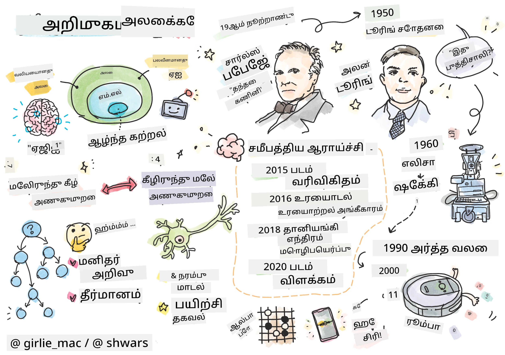
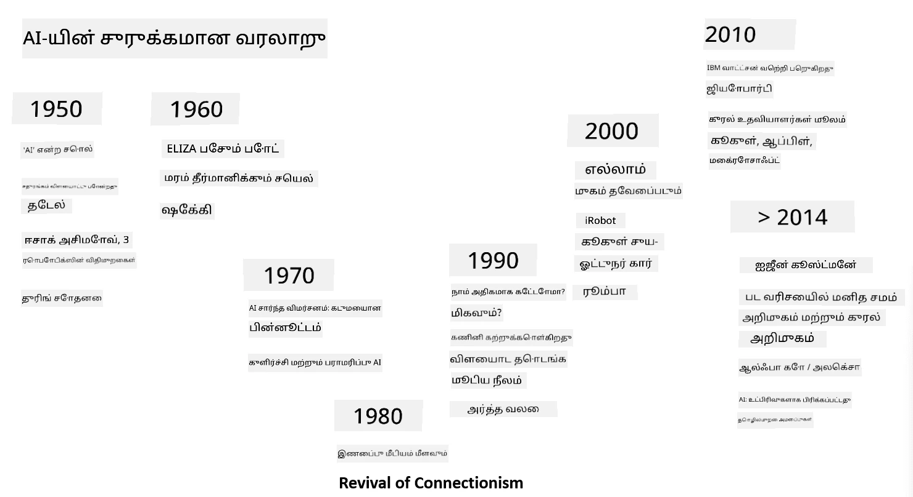
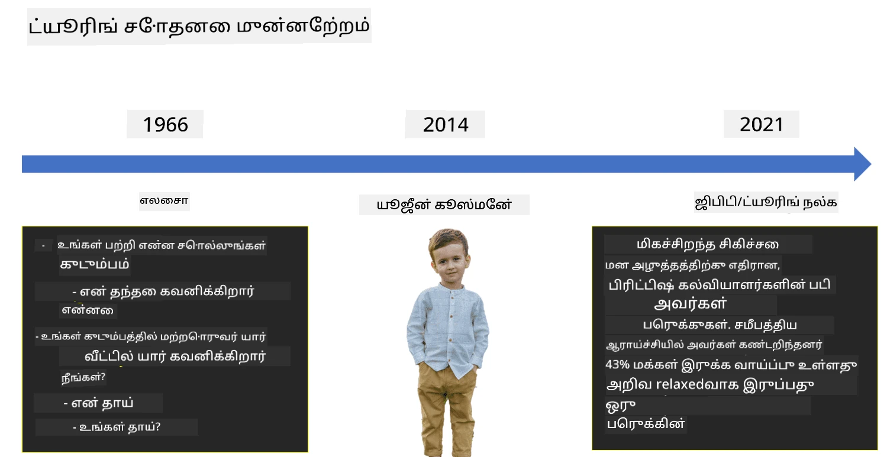

# AI அறிமுகம்

> [Tomomi Imura](https://twitter.com/girlie_mac) இன் ஸ்கெட்ச் நோட்

## [முன்-வகுப்பு வினாடி வினா](https://ff-quizzes.netlify.app/en/ai/quiz/1)

**கிரகித்தல் நுண்ணறிவு** என்பது கணினிகளை மனிதர்களுக்கு இயல்பான செயல்களைச் செய்யச் செய்யும் திறனை உருவாக்கும் அறிவியல் துறையாகும்.

முதலில், கணினிகளை [Charles Babbage](https://en.wikipedia.org/wiki/Charles_Babbage) எண் கணக்கீடுகளை ஒரு நன்கு வரையறுக்கப்பட்ட செயல்முறை - ஒரு ஆல்கொரிதம் - மூலம் செயல்படுத்த உருவாக்கினார். 19ஆம் நூற்றாண்டில் முன்மாதிரியாக உருவாக்கப்பட்ட கணினி மாடலின் அடிப்படையில், நவீன கணினிகள் மிகவும் மேம்பட்டவை என்றாலும், கட்டுப்படுத்தப்பட்ட கணக்கீடுகளின் அடிப்படையில் செயல்படுகின்றன. எனவே, ஒரு குறிப்பிட்ட இலக்கை அடைய தேவையான செயல்முறைகளை நன்கு அறிந்தால், கணினியை ஒரு செயல்பாட்டிற்கு நிரலிட முடியும்.

> [Vickie Soshnikova](http://twitter.com/vickievalerie) இன் புகைப்படம்

> ✅ ஒரு நபரின் புகைப்படத்திலிருந்து வயதை வரையறுப்பது என்பது தெளிவாக நிரலிட முடியாத ஒரு பணியாகும், ஏனெனில் நாம் அதை செய்யும்போது எங்கள் மனதில் ஒரு எண்ணை உருவாக்கும் முறையை நாங்கள் அறியவில்லை.

---

சில பணிகள், இருப்பினும், எவ்வாறு தீர்க்க வேண்டும் என்பதை நாங்கள் தெளிவாக அறியவில்லை. ஒரு நபரின் புகைப்படத்திலிருந்து வயதை தீர்மானிப்பதை எடுத்துக்கொள்ளுங்கள். நாம் அதை somehow கற்றுக்கொள்கிறோம், ஏனெனில் பல்வேறு வயதுடைய மக்களின் பல உதாரணங்களை பார்த்துள்ளோம், ஆனால் அதை எவ்வாறு செய்கிறோம் என்பதை தெளிவாக விளக்க முடியாது, அல்லது கணினியை அதை செய்ய நிரலிட முடியாது. இது **கிரகித்தல் நுண்ணறிவு** (AI) ஆர்வமுள்ள பணிகளின் வகையாகும்.

✅ நீங்கள் AI மூலம் கணினிக்கு ஒப்படைக்கக்கூடிய சில பணிகளை யோசிக்கவும். நிதி, மருத்துவம் மற்றும் கலை ஆகிய துறைகளைப் பரிசீலிக்கவும் - இவை இன்று AI மூலம் எப்படி பயனடைந்துள்ளன?

## பலவீன AI மற்றும் வலுவான AI

பலவீன AI | வலுவான AI
---------------------------------------|-------------------------------------
பலவீன AI என்பது ஒரு குறிப்பிட்ட பணிக்காக அல்லது குறுகிய பணிகளுக்காக வடிவமைக்கப்பட்ட மற்றும் பயிற்சி அளிக்கப்பட்ட AI அமைப்புகளை குறிக்கிறது.|வலுவான AI, அல்லது Artificial General Intelligence (AGI), என்பது மனித மட்டத்திலான அறிவு மற்றும் புரிதலுடன் கூடிய AI அமைப்புகளை குறிக்கிறது.
இந்த AI அமைப்புகள் பொதுவாக அறிவாளிகள் அல்ல; அவை வரையறுக்கப்பட்ட பணியில் சிறப்பாக செயல்படுகின்றன ஆனால் உண்மையான புரிதல் அல்லது விழிப்புணர்வு இல்லை.|இந்த AI அமைப்புகள் மனிதன் செய்யக்கூடிய எந்த அறிவாற்றல் பணியையும் செய்யும் திறன் கொண்டவை, பல துறைகளுக்கு ஏற்ப மாற்றம் செய்யும் திறன் கொண்டவை மற்றும் விழிப்புணர்வு அல்லது சுய விழிப்புணர்வு கொண்டவை.
பலவீன AI உதாரணங்களில் Siri அல்லது Alexa போன்ற மெய்நிகர் உதவியாளர்கள், ஸ்ட்ரீமிங் சேவைகளால் பயன்படுத்தப்படும் பரிந்துரை ஆல்கொரிதங்கள் மற்றும் குறிப்பிட்ட வாடிக்கையாளர் சேவை பணிகளுக்காக வடிவமைக்கப்பட்ட chatbotகள் அடங்கும்.|வலுவான AI ஐ அடைவது AI ஆராய்ச்சியின் நீண்டகால இலக்காகும், இது பல்வேறு பணிகள் மற்றும் சூழல்களில் காரணம் கூறும், கற்றல், புரிதல் மற்றும் தழுவுதல் ஆகியவற்றை உருவாக்கும் AI அமைப்புகளை உருவாக்க வேண்டும்.
பலவீன AI மிகவும் நிபுணத்துவம் வாய்ந்தது மற்றும் அதன் குறுகிய துறையைத் தவிர மனிதனுக்கு ஒப்பான அறிவாற்றல் திறன்கள் அல்லது பொதுவான பிரச்சனை தீர்க்கும் திறன்கள் இல்லை.|வலுவான AI தற்போது ஒரு கோட்பாட்டுக் கருத்தாகும், எந்த AI அமைப்பும் இந்த அளவிலான பொதுவான அறிவு நிலையை அடையவில்லை.

மேலும் தகவலுக்கு **[Artificial General Intelligence](https://en.wikipedia.org/wiki/Artificial_general_intelligence)** (AGI) ஐப் பார்க்கவும்.
## அறிவு வரையறை மற்றும் Turing Test

**[Intelligence](https://en.wikipedia.org/wiki/Intelligence)** என்ற சொல்லைச் சிக்கலாகக் கருதும்போது, இந்த சொல்லுக்கு தெளிவான வரையறை இல்லை என்பது ஒரு பிரச்சனையாகும். அறிவு **மூலதன சிந்தனை** அல்லது **சுய விழிப்புணர்வு** உடன் தொடர்புடையது என்று ஒருவர் வாதிடலாம், ஆனால் அதை சரியாக வரையறுக்க முடியாது.

> [Amber Kipp](https://unsplash.com/@sadmax) இன் Unsplash புகைப்படம் [Photo](https://unsplash.com/photos/75715CVEJhI)

*அறிவு* என்ற சொல்லின் ambiguity ஐப் பார்க்க, "ஒரு பூனை அறிவாளியா?" என்ற கேள்விக்கு பதிலளிக்க முயற்சிக்கவும். இந்தக் கேள்விக்கு உண்மையா அல்லது இல்லை என்பதை நிரூபிக்க ஒரு பரிசோதனை இல்லை என்பதால், வெவ்வேறு மக்கள் வெவ்வேறு பதில்களை அளிக்க முயற்சிக்கின்றனர். நீங்கள் நினைப்பது போல - உங்கள் பூனைக்கு IQ பரிசோதனை செய்ய முயற்சிக்கவும்...

✅ நீங்கள் அறிவை எவ்வாறு வரையறுக்கிறீர்கள் என்பதை ஒரு நிமிடம் யோசிக்கவும். உணவுக்காக ஒரு labyrint ஐத் தீர்க்கும் ஒரு காக அறிவாளியா? ஒரு குழந்தை அறிவாளியா?

---

AGI பற்றி பேசும்போது, ​​நாம் உண்மையில் அறிவாளியான ஒரு அமைப்பை உருவாக்கியுள்ளோம் என்பதைச் சொல்ல ஒரு வழி தேவை. [Alan Turing](https://en.wikipedia.org/wiki/Alan_Turing) **[Turing Test](https://en.wikipedia.org/wiki/Turing_test)** என்ற ஒரு வழியை முன்மொழிந்தார், இது அறிவின் வரையறையாகவும் செயல்படுகிறது. இந்த பரிசோதனை ஒரு குறிப்பிட்ட அமைப்பை ஒரு மனிதனுடன் ஒப்பிடுகிறது, ஏனெனில் எந்த தானியங்கி ஒப்பீடும் ஒரு கணினி நிரலால் தவிர்க்கப்படலாம், நாம் ஒரு மனித விசாரணையாளரைப் பயன்படுத்துகிறோம். எனவே, ஒரு மனிதன் ஒரு உண்மையான நபர் மற்றும் ஒரு கணினி அமைப்பை உரை அடிப்படையிலான உரையாடலில் வேறுபடுத்த முடியாதால் - அந்த அமைப்பு அறிவாளியாகக் கருதப்படுகிறது.

> [Eugene Goostman](https://en.wikipedia.org/wiki/Eugene_Goostman) என்ற chatbot, 2014 இல் Turing Test ஐ கடக்க முயற்சித்தது, ஒரு புத்திசாலி தனித்துவத்தைப் பயன்படுத்தி. இது ஒரு 13 வயது உக்ரைனிய சிறுவன் என்று முன்னதாக அறிவித்தது, இது அறிவின் குறைபாடுகள் மற்றும் உரையில் சில முரண்பாடுகளை விளக்குகிறது. 5 நிமிட உரையாடலுக்குப் பிறகு, 30% நீதிபதிகளை மனிதன் என்று நம்ப வைத்தது, 2000 ஆம் ஆண்டிற்குள் ஒரு இயந்திரம் கடக்க முடியும் என்று Turing நம்பினார். இருப்பினும், இது நாம் ஒரு அறிவாளியான அமைப்பை உருவாக்கியுள்ளோம் அல்லது ஒரு கணினி அமைப்பு மனித விசாரணையாளரை ஏமாற்றியுள்ளது என்பதை குறிக்கவில்லை - மனிதர்களை ஏமாற்றவில்லை, ஆனால் bot உருவாக்குபவர்கள் ஏமாற்றினர்!

✅ நீங்கள் ஒரு chatbot மூலம் மனிதனுடன் பேசுகிறீர்கள் என்று ஏமாற்றப்பட்டதா? அது உங்களை எப்படி நம்ப வைத்தது?

## AI க்கு பல்வேறு அணுகுமுறைகள்

ஒரு கணினி மனிதனைப் போல நடக்க வேண்டும் என்றால், நாம் எங்கள் சிந்தனை முறையை கணினிக்குள் மாதிரியாக்க வேண்டும். இதனால், ஒரு மனிதன் அறிவாளியாக என்ன செய்கிறது என்பதைப் புரிந்துகொள்ள முயற்சிக்க வேண்டும்.

> ஒரு இயந்திரத்தில் அறிவை நிரலிட முடிவதற்கு, எங்கள் சொந்த முடிவெடுக்கும் செயல்முறைகள் எவ்வாறு செயல்படுகின்றன என்பதைப் புரிந்துகொள்ள வேண்டும். நீங்கள் சிறிது சுய-ஆழ்ந்த சிந்தனை செய்தால், சில செயல்முறைகள் subconscious ஆக நடக்கின்றன என்பதை உணருவீர்கள் – உதாரணமாக, ஒரு பூனை மற்றும் ஒரு நாயை வேறுபடுத்த முடியும் - ஆனால் சில செயல்முறைகள் reasoning உடன் தொடர்புடையவை.

இந்த பிரச்சனைக்கு இரண்டு சாத்தியமான அணுகுமுறைகள் உள்ளன:

மேலிருந்து கீழே அணுகுமுறை (Symbolic Reasoning) | கீழிருந்து மேலே அணுகுமுறை (Neural Networks)
---------------------------------------|-------------------------------------
மேலிருந்து கீழே அணுகுமுறை ஒரு நபர் ஒரு பிரச்சனைக்கு தீர்வு காண reasoning செய்யும் முறையை மாதிரியாக்குகிறது. இது ஒரு மனிதனிடமிருந்து **அறிவை** எடுப்பதையும், அதை கணினி வாசிக்கக்கூடிய வடிவத்தில் பிரதிநிதித்துவப்படுத்துவதையும் உள்ளடக்கியது. மேலும், reasoning ஐ கணினிக்குள் மாதிரியாக்க ஒரு வழியை உருவாக்க வேண்டும். | கீழிருந்து மேலே அணுகுமுறை ஒரு மனித மூளையின் அமைப்பை மாதிரியாக்குகிறது, இது **neurons** எனப்படும் எளிய அலகுகளின் ஒரு பெரிய எண்ணிக்கையைக் கொண்டுள்ளது. ஒவ்வொரு neuron அதன் inputs இன் weighted average போல செயல்படுகிறது, மேலும் **training data** வழங்குவதன் மூலம் பயனுள்ள பிரச்சனைகளைத் தீர்க்க ஒரு network of neurons ஐ train செய்யலாம்.

அறிவுக்கான சில பிற சாத்தியமான அணுகுமுறைகளும் உள்ளன:

* **Emergent**, **Synergetic** அல்லது **multi-agent approach** என்பது ஒரு பெரிய எண்ணிக்கையிலான எளிய agents களின் தொடர்பு மூலம் சிக்கலான அறிவாற்றல் நடத்தை பெற முடியும் என்ற உண்மையை அடிப்படையாகக் கொண்டது. [evolutionary cybernetics](https://en.wikipedia.org/wiki/Global_brain#Evolutionary_cybernetics) படி, intelligence என்பது *metasystem transition* செயல்முறையில் எளிய, reactive நடத்தை மூலம் *emerge* ஆகலாம்.

* **Evolutionary approach**, அல்லது **genetic algorithm** என்பது evolution principles அடிப்படையில் ஒரு optimization process ஆகும்.

இந்த approachகளை நாம் later in the course பரிசீலிப்போம், ஆனால் இப்போது இரண்டு முக்கியமான திசைகளில் கவனம் செலுத்துவோம்: மேலிருந்து கீழே மற்றும் கீழிருந்து மேலே.

### மேலிருந்து கீழே அணுகுமுறை

**மேலிருந்து கீழே அணுகுமுறையில்**, reasoning ஐ மாதிரியாக்க முயற்சிக்கிறோம். நாம் reasoning செய்யும்போது எங்கள் சிந்தனைகளைப் பின்தொடர முடியும் என்பதால், இந்த செயல்முறையை formalize செய்து கணினிக்குள் நிரலிட முயற்சிக்கலாம். இது **symbolic reasoning** என்று அழைக்கப்படுகிறது.

மக்கள் decision-making செயல்முறைகளை வழிநடத்தும் சில விதிகளை தங்கள் மனதில் வைத்திருக்கிறார்கள். உதாரணமாக, ஒரு மருத்துவர் ஒரு நோயாளியை diagnose செய்யும்போது, ​​ஒரு நபருக்கு fever உள்ளது என்பதை உணரலாம், எனவே உடலுக்குள் inflammation இருக்கலாம். ஒரு குறிப்பிட்ட பிரச்சனைக்கு ஒரு set of rules ஐப் பயன்படுத்துவதன் மூலம், ஒரு மருத்துவர் இறுதி diagnosis ஐ உருவாக்க முடியும்.

இந்த approach **knowledge representation** மற்றும் **reasoning** மீது மிகவும் சார்ந்துள்ளது. ஒரு மனித நிபுணரிடமிருந்து அறிவை எடுப்பது மிகவும் கடினமான பகுதியாக இருக்கலாம், ஏனெனில் ஒரு மருத்துவர் பல சந்தர்ப்பங்களில் அவர் அல்லது அவள் ஒரு குறிப்பிட்ட diagnosis ஐ எதற்காக உருவாக்குகிறார் என்பதைத் தெரியாது. சில நேரங்களில் தீர்வு explicit thinking இல்லாமல் அவரது அல்லது அவளது மனதில் simply தோன்றுகிறது. சில tasks, உதாரணமாக, ஒரு புகைப்படத்திலிருந்து ஒரு நபரின் வயதைத் தீர்மானிப்பது, knowledge ஐ manipulate செய்வதற்கு முற்றிலும் குறைக்க முடியாது.

### கீழிருந்து மேலே அணுகுமுறை

மாற்றாக, நம் மூளையின் மிக எளிய elements ஐ மாதிரியாக்க முயற்சிக்கலாம் – ஒரு neuron. **artificial neural network** எனப்படும் ஒன்றை கணினிக்குள் உருவாக்கி, உதாரணங்களை வழங்குவதன் மூலம் பிரச்சனைகளைத் தீர்க்க அதை கற்றுக்கொடுக்க முயற்சிக்கலாம். இந்த செயல்முறை ஒரு newborn child தனது சுற்றுப்புறத்தைப் பற்றி observation மூலம் கற்றுக்கொள்வது போன்றது.

✅ குழந்தைகள் எப்படி கற்றுக்கொள்கிறார்கள் என்பதைப் பற்றி சிறிது ஆராயுங்கள். ஒரு குழந்தையின் மூளையின் அடிப்படை கூறுகள் என்ன?

> | ML பற்றி என்ன?         |      |
> |--------------|-----------|
> | சில data அடிப்படையில் ஒரு பிரச்சனையைத் தீர்க்க computer learning அடிப்படையில் Artificial Intelligence இன் ஒரு பகுதி **Machine Learning** என்று அழைக்கப்படுகிறது. இந்த course இல் classical machine learning ஐ நாம் பரிசீலிக்க மாட்டோம் - [Machine Learning for Beginners](http://aka.ms/ml-beginners) curriculum ஐப் பார்க்கவும். |       |

## AI இன் சுருக்கமான வரலாறு

Artificial Intelligence 20ஆம் நூற்றாண்டின் நடுப்பகுதியில் ஒரு துறையாக தொடங்கப்பட்டது. ஆரம்பத்தில், symbolic reasoning ஒரு முக்கியமான approach ஆக இருந்தது, மேலும் இது expert systems போன்ற சில முக்கியமான வெற்றிகளை உருவாக்கியது – குறிப்பிட்ட பிரச்சனை துறைகளில் ஒரு நிபுணராக செயல்படக்கூடிய computer programs. இருப்பினும், இந்த approach நன்றாக scale ஆகாது என்பது விரைவில் தெளிவாகியது. ஒரு நிபுணரிடமிருந்து அறிவை எடுப்பது, அதை கணினியில் பிரதிநிதித்துவப்படுத்துவது மற்றும் அந்த knowledgebase ஐ துல்லியமாக வைத்திருப்பது மிகவும் சிக்கலான task ஆகும், மேலும் பல சந்தர்ப்பங்களில் நடைமுறைக்கு மிகவும் செலவாகும். இது 1970களில் [AI Winter](https://en.wikipedia.org/wiki/AI_winter) என அழைக்கப்படும் நிலைக்கு வழிவகுத்தது.

> [Dmitry Soshnikov](http://soshnikov.com) இன் படம்

காலம் கடந்தபோது, ​​computing resources மலிவாகிவிட்டன, மேலும் data அதிகமாக கிடைக்கிறது, எனவே neural network approaches computer vision அல்லது speech understanding போன்ற பல துறைகளில் மனிதர்களுடன் போட்டியிட சிறந்த செயல்திறனை காட்டத் தொடங்கின. கடந்த தசாப்தத்தில், Artificial Intelligence என்ற term பெரும்பாலும் Neural Networks க்கு ஒப்பானதாக பயன்படுத்தப்பட்டது, ஏனெனில் நாம் கேட்கும் AI வெற்றிகள் பெரும்பாலும் அவற்றின் அடிப்படையில் உள்ளன.

ஒரு chess playing computer program உருவாக்குவதில் approaches எப்படி மாறின என்பதை நாம் கவனிக்கலாம்:

* ஆரம்ப chess programs search அடிப்படையில் இருந்தன – ஒரு program opponent இன் moves ஐ ஒரு குறிப்பிட்ட எண்ணிக்கையிலான moves க்கு estimate செய்ய முயற்சித்தது, மேலும் சில moves இல் optimal position ஐ அடைய based optimal move ஐத் தேர்ந்தெடுத்தது. இது [alpha-beta pruning](https://en.wikipedia.org/wiki/Alpha%E2%80%93beta_pruning) search algorithm ஐ உருவாக்க வழிவகுத்தது.
* Search strategies விளையாட்டின் முடிவில் நன்றாக செயல்படுகின்றன, அங்கு search space ஒரு குறைந்த எண்ணிக்கையிலான moves மூலம் வரையறுக்கப்படுகிறது. இருப்பினும், விளையாட்டின் தொடக்கத்தில், search space மிகப்பெரியது, மேலும் algorithm மனித வீரர்களின் matches க்கான existing data கற்றலால் மேம்படுத்தப்படலாம். பின்னர் [case-based reasoning](https://en.wikipedia.org/wiki/Case-based_reasoning) எனப்படும் முறையைப் பயன்படுத்தி, program current position க்கு மிகவும் similar cases க்கான knowledge base ஐத் தேடியது.
* மனித வீரர்களை வெல்லும் modern programs neural networks மற்றும் [reinforcement learning](https://en.wikipedia.org/wiki/Reinforcement_learning) அடிப்படையில் உள்ளன, programகள் தங்கள் சொந்த தவறுகளிலிருந்து கற்றுக்கொள்வதன் மூலம் தங்கள் மீது விளையாடும் மூலம் விளையாட கற்றுக்கொள்கின்றன – மனித beings chess கற்றுக்கொள்ளும் போது செய்யும் முறையைப் போல. இருப்பினும், ஒரு computer program குறைந்த நேரத்தில் பல விளையாட்டுகளை விளையாட முடியும், எனவே மிகவும் வேகமாக கற்றுக்கொள்ள முடியும்.

✅ AI விளையாடிய பிற விளையாட்டுகளைப் பற்றி சிறிது ஆராயுங்கள்.

அதேபோல், “talking programs” (Turing Test ஐ கடக்கக்கூடியவை) உருவாக்குவதற்கான approach எப்படி மாறியது என்பதை நாம் காணலாம்:

* இந்த வகை ஆரம்ப programs, [Eliza](https://en.wikipedia.org/wiki/ELIZA) போன்றவை, மிகவும் simple grammatical rules மற்றும் input sentence ஐ ஒரு கேள்வியாக re-formulation அடிப்படையில் இருந்தன.
* Cortana, Siri அல்லது Google Assistant போன்ற modern assistants அனைத்தும் hybrid systems ஆகும், அவை speech ஐ text ஆக மாற்ற neural networks ஐ பயன்படுத்துகின்றன மற்றும் நம் intent ஐ recognize செய்கின்றன, பின்னர் தேவையான actions ஐ செய்ய reasoning அல்லது explicit algorithms ஐ employ செய்கின்றன.
* எதிர்காலத்தில், dialogue ஐ தானாகவே handle செய்ய ஒரு complete neural-based model ஐ எதிர்பார்க்கலாம். சமீபத்திய GPT மற்றும் [Turing-NLG](https://www.microsoft.com/research/blog/turing-nlg-a-17-billion-parameter-language-model-by-microsoft) neural networks குடும்பம் இதில் சிறந்த வெற்றியை காட்டுகின்றன.

> படம்: Dmitry Soshnikov, [புகைப்படம்](https://unsplash.com/photos/r8LmVbUKgns): [Marina Abrosimova](https://unsplash.com/@abrosimova_marina_foto), Unsplash

## சமீபத்திய AI ஆராய்ச்சி

நரம்பு வலையமைப்புகள் (Neural Networks) குறித்த ஆராய்ச்சியில் சமீபத்திய பெரிய வளர்ச்சி 2010 ஆம் ஆண்டில் தொடங்கியது, அப்போது பெரிய அளவிலான பொது தரவுத்தொகுப்புகள் கிடைக்கத் தொடங்கின. சுமார் 14 மில்லியன் குறிப்பு செய்யப்பட்ட படங்களை கொண்ட [ImageNet](https://en.wikipedia.org/wiki/ImageNet) என்ற பெரிய படத் தொகுப்பு [ImageNet Large Scale Visual Recognition Challenge](https://image-net.org/challenges/LSVRC/) என்ற போட்டியை உருவாக்கியது.

> படம்: [Dmitry Soshnikov](http://soshnikov.com)

2012 ஆம் ஆண்டில், [Convolutional Neural Networks](../4-ComputerVision/07-ConvNets/README.md) முதன்முதலாக பட வகைப்படுத்தலில் பயன்படுத்தப்பட்டன, இது வகைப்படுத்தல் பிழைகளை குறிப்பிடத்தக்க அளவில் குறைத்தது (கிட்டத்தட்ட 30% இருந்து 16.4% ஆக). 2015 ஆம் ஆண்டில், Microsoft Research உருவாக்கிய ResNet கட்டமைப்பு [மனித மட்டத்திற்குச் சமமான துல்லியத்தை அடைந்தது](https://doi.org/10.1109/ICCV.2015.123).

அதன் பிறகு, நரம்பு வலையமைப்புகள் பல பணிகளில் மிகச் சிறந்த செயல்திறனை வெளிப்படுத்தின:

---

ஆண்டு | மனித மட்டத்திற்குச் சமமானது
-----|--------
2015 | [பட வகைப்படுத்தல்](https://doi.org/10.1109/ICCV.2015.123)
2016 | [உரையாடல் பேச்சு அங்கீகாரம்](https://arxiv.org/abs/1610.05256)
2018 | [தானியங்கி மெஷின் மொழிபெயர்ப்பு](https://arxiv.org/abs/1803.05567) (சீன மொழியில் இருந்து ஆங்கிலம்)
2020 | [பட விளக்கம்](https://arxiv.org/abs/2009.13682)

கடந்த சில ஆண்டுகளில், BERT மற்றும் GPT-3 போன்ற பெரிய மொழி மாதிரிகளின் மூலம் மிகப்பெரிய வெற்றிகளை நாம் கண்டுள்ளோம். இது பெரும்பாலும் பொதுவான உரை தரவுகள் அதிகமாக கிடைப்பதால் நிகழ்ந்தது, இது மாதிரிகளை உரைகளின் அமைப்பு மற்றும் அர்த்தத்தைப் புரிந்துகொள்ள பயிற்சி செய்ய அனுமதிக்கிறது, பொதுவான உரைத் தொகுப்புகளில் முன்பயிற்சி செய்து, பின்னர் அந்த மாதிரிகளை குறிப்பிட்ட பணிகளுக்குப் பொருத்தமாக மாற்றுகிறது. [இயற்கை மொழி செயலாக்கம்](../5-NLP/README.md) பற்றி இந்த பாடத்தில் பின்னர் மேலும் கற்றுக்கொள்வோம்.

## 🚀 சவால்

இணையத்தில் சுற்றி, உங்கள் கருத்தில் AI மிகச் சிறப்பாக எங்கு பயன்படுத்தப்படுகிறது என்பதை கண்டறியுங்கள். அது ஒரு வரைபட பயன்பாட்டில் இருக்கிறதா, அல்லது பேச்சை உரையாக மாற்றும் சேவையிலா அல்லது ஒரு வீடியோ கேமிலா? அந்த அமைப்பு எவ்வாறு உருவாக்கப்பட்டது என்பதை ஆராயுங்கள்.

## [பாடத்திற்குப் பிந்தைய வினாடி வினா](https://ff-quizzes.netlify.app/en/ai/quiz/2)

## மதிப்பீடு & சுயபடிப்பு

[இந்த பாடத்தை](https://github.com/microsoft/ML-For-Beginners/tree/main/1-Introduction/2-history-of-ML) படித்து AI மற்றும் ML வரலாற்றை மதிப்பீடு செய்யுங்கள். அந்த பாடத்தின் மேல் உள்ள ஸ்கெட்ச் நோட்டிலிருந்து அல்லது இந்த பாடத்தில் இருந்து ஒரு கூறை எடுத்துக்கொண்டு, அதன் பரிணாமத்தைத் தகவமைப்பதற்கான கலாச்சார சூழலை மேலும் ஆழமாக ஆராயுங்கள்.

**பணி**: [கேம் ஜாம்](assignment.md)

---

<!-- CO-OP TRANSLATOR DISCLAIMER START -->
**புறக்கணிப்பு**:  
இந்த ஆவணம் AI மொழிபெயர்ப்பு சேவை [Co-op Translator](https://github.com/Azure/co-op-translator) பயன்படுத்தி மொழிபெயர்க்கப்பட்டுள்ளது. நாங்கள் துல்லியத்திற்காக முயற்சிக்கிறோம், ஆனால் தானியங்கி மொழிபெயர்ப்புகளில் பிழைகள் அல்லது தவறுகள் இருக்கக்கூடும் என்பதை கவனத்தில் கொள்ளவும். அதன் தாய்மொழியில் உள்ள மூல ஆவணம் அதிகாரப்பூர்வ ஆதாரமாக கருதப்பட வேண்டும். முக்கியமான தகவல்களுக்கு, தொழில்முறை மனித மொழிபெயர்ப்பு பரிந்துரைக்கப்படுகிறது. இந்த மொழிபெயர்ப்பைப் பயன்படுத்துவதால் ஏற்படும் எந்த தவறான புரிதல்கள் அல்லது தவறான விளக்கங்களுக்கு நாங்கள் பொறுப்பல்ல.
<!-- CO-OP TRANSLATOR DISCLAIMER END -->