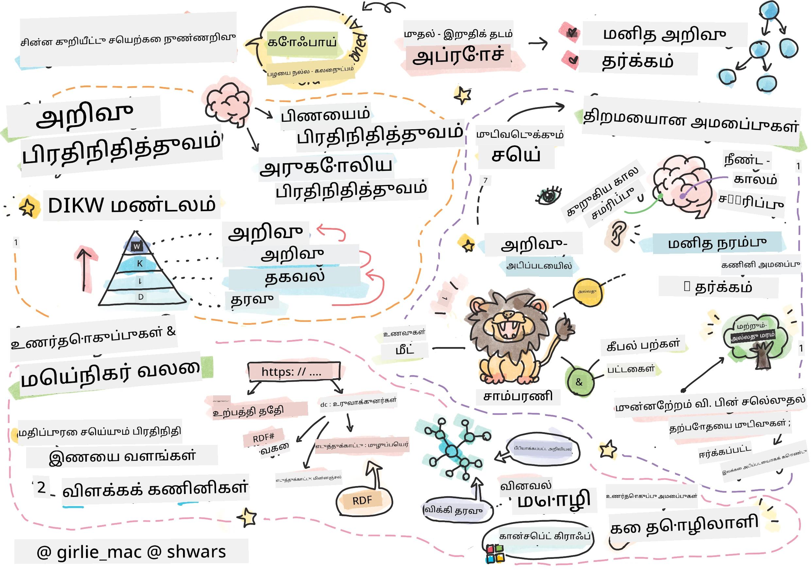
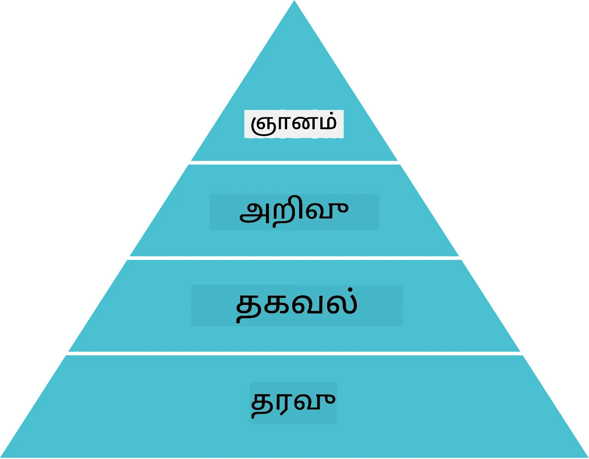
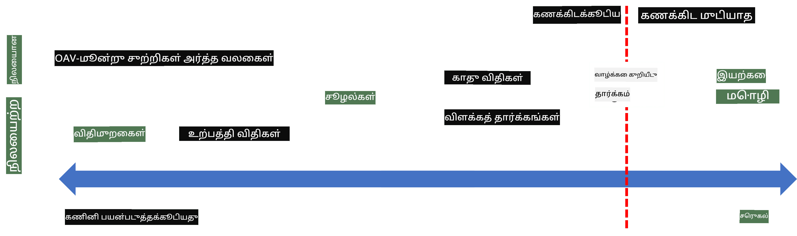
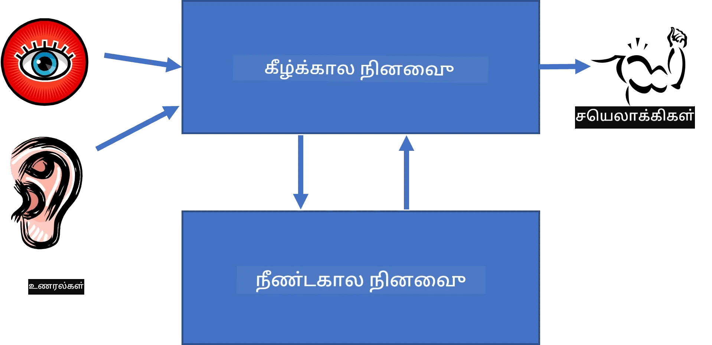
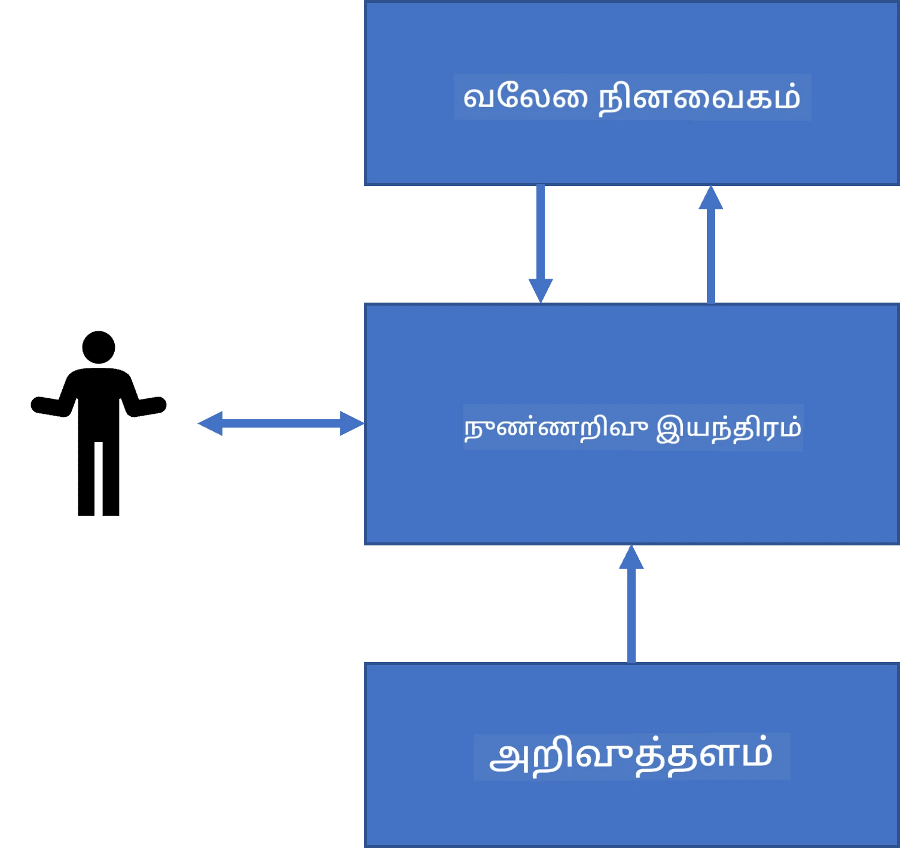
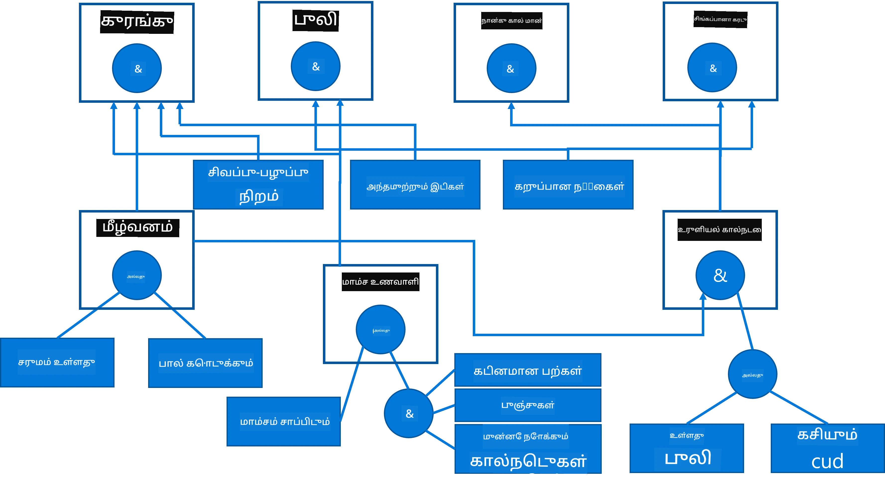
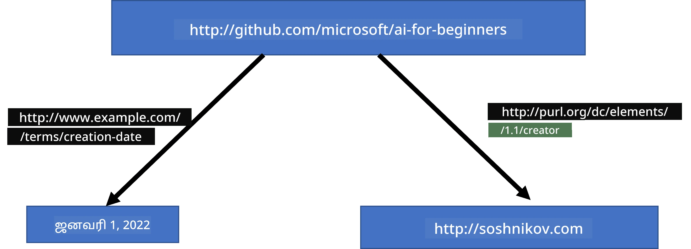
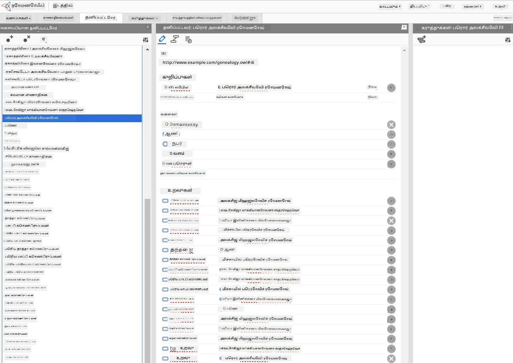

# அறிவுத்திறன் பிரதிநிதித்துவமும் நிபுணர் அமைப்புகளும்



> ஸ்கெட்ச் நோட் [டோமோமி இமுரா](https://twitter.com/girlie_mac) அவர்களால்

கைமுறையாக செயல்படும் புத்திசாலித்தனத்தை உருவாக்கும் முறையை மனிதர்களைப் போல உலகத்தை உணர்ந்து கொள்ளும் அறிவைக் கண்டு பிடிப்பதில்தான் அடிப்படையாக கொண்டுள்ளது. ஆனால் இது எவ்வாறு செய்யப்பட வேண்டும்?

## [முன்னர்-வழக்கு வினாத்தாள்](https://ff-quizzes.netlify.app/en/ai/quiz/3)

ஆய்வியல் புத்திசாலித்தனத்தின் தொடக்க நாட்களில், மேலே இருந்து கீழே நோக்கும் முறையான புத்திசாலி அமைப்புகளை உருவாக்கும் வழிமுறை (முந்தைய பாடத்தில் விவாதிக்கப்பட்டது) பிரபலமாக இருந்தது. மனிதர்களிடமிருந்து அறிவைப் பெறும் விதமாகக் கொண்டு அதை இயந்திரப் படமாக மாற்றி, தானாக பிரச்சனைகளை தீர்க்க பயன்படுத்துதல். இந்த முறையானது இரண்டு பெரிய கோட்பாடுகளின் அடிப்படையில் இருந்தது:

* அறிவுரைப் பிரதிநிதித்துவம்
* காரணியம்

## அறிவுரைப் பிரதிநிதித்துவம்

குறியீட்டு AI இல் முக்கியமான கருத்துக்களில் ஒன்று **அறிவுரைக்** ஆகும். அறிவுரையை *தரவு* அல்லது *தகவல்* என்பவற்றிலிருந்து வேறுபடுத்துவது முக்கியம். எடுத்துக்காட்டாக, புத்தகங்கள் அறிவுறையை கொண்டிருக்கும் என்று சொல்லலாம், ஏனென்றால் புத்தகங்களை படித்து நிபுணர் ஆகலாம். இருப்பினும், புத்தகங்களில் உள்ளவை உண்மையில் *தரவு* என்று அழைக்கப்படுகின்றன, புத்தகங்களைப் படித்து அந்த தரவுகளை உலக மாதிரியில் ஒருங்கிணைத்தால் அந்த தரவை அறிவுரையாக மாற்றுவோம்.

> ✅ **அறிவுரை** என்பது நமது தலைக்குள் உள்ளதும், உலகத்தை எவ்வாறு புரிந்துகொள்கின்றோம் என்பதைக் குறிக்கும். இது ஒரு செயலில் நடைபெறும் **கற்றல்** செயல்முறையால் பெறப்படும், நாம் பெற்ற தகவல்களை உலக மாதிரியில் ஒருங்கிணைக்கும் முறையாகும்.

அதிகமாக, அறிவுரையை கடுமையாக வரையறுக்கவில்லை, ஆனால் அதனை தொடர்புடைய பிற கருத்துகளுடன் [DIKW ஹரிஷேகரம்](https://en.wikipedia.org/wiki/DIKW_pyramid) பயன்படுத்தி ஒத்திசைவேற்று உள்ளோம். இதில் உள்ள கருத்துக்கள்:

* **தரவு** என்பது பழைய எழுத்து அல்லது வாய்மொழிகள் போன்ற உடல் வாயிலாக பிரதிநிதித்துவம் செய்யப்படுகின்றது. தரவு மனிதர்களுக்கு சாராது இருப்பதுடன் பரிமாறப்படக்கூடியதாகும்.
* **தகவல்** என்பது அந்த தரவை நமது மனதில் நாம் எப்படி அர்த்தமாற்றம் செய்கிறோம் என்பதாகும். உதாரணத்திற்கு, *கணினி* என்கிற வார்த்தையை கேட்டால், அதற்கு எவ்வாறு புரிதல் உண்டு.
* **அறிவுரை** என்பது தகவலை உலக மாதிரியில் ஒருங்கிணைக்கும் செயலாகும். உதாரணத்திற்கு, கணினி என்றால், அது எப்படி வேலை செய்கிறது, விலை என்ன, என்ன பயன்பாடுகள் என்பது பற்றி கற்றுக்கொள்கிறோம். இத்தகைய தொடர்புடைய கருத்துக்களின் வலை நமது அறிவுரையை உருவாக்குகிறது.
* **அறிவுமை** என்பது உலகத்தைப் பற்றி மேலதிக புரிந்துகொள்ளல் மட்டமாகும், இது *மெட்டஅறிவு* என்று அழைக்கப்படலாம், உதாரணமாக அறிவுரையை எப்போது மற்றும் எப்படி பயன்படுத்த வேண்டும் என்பது குறித்து ஒரு கருத்து.



*படம் [விக்கிப்பீடியாவிலிருந்து](https://commons.wikimedia.org/w/index.php?curid=37705247), லாங்ளிவ்தெக்ஸ் உருவாக்கம், CC BY-SA 4.0*

இந்த வகையில், **அறிவுரைப் பிரதிநிதித்துவம்** பிரச்சனையை ஒரு கணினியின் உள்ளே தரவு வடிவில் அறிவுரையை பிரதிநிதித்துவம் செய்யக்கூடிய சிறந்த முறையை கண்டறிவதற்கான பிரச்சனை என பார்க்கலாம். இது ஒரு வரம்பு போலும் பார்க்கலாம்:



> படம் [ட்மிட்ரீ சோஷ்னிகோவ்](http://soshnikov.com) அவர்களின் படைப்பு

* இடது பக்கம், கணினிகள் பயனடையக்கூடிய போதிரமான வகை அறிவுரைப் பிரதிநிதித்துவங்கள் உள்ளன. மிகவும் எளிமையானது என்பது கணினி திட்டமிடலின் மூலம் அறிவுரை பிரதிநிதித்துவம் செய்யப்படுவது ஆகும். இது, இருப்பினும், மிகவும் எளிமையாக இல்லாது, ஏனென்றால் இது நெடுங்கால பாதுகாப்பிற்குப் பொருத்தமில்லாமல் இருக்கும். நமது தலைவிரைகளின் அறிவுரை பெரும்பாலும் கூட்டு நிரல் அல்லாத வகையில் இருக்கும்.
* வலது பக்கம், இயற்கை உரை போன்ற பிரதிநிதித்துவங்கள் உள்ளன. அவை மிகவும் சக்திவாய்ந்தவை, ஆனால் தானாகத் காரணீயம் செய்ய இயலாது.

> ✅ சில நินைவில் அந்த அறிவுரையை நீங்கள் உங்கள் தலைவில் எவ்வாறு பிரதிநிதித்துவம் செய்கிறீர்கள் மற்றும் அதை குறிப்புகளாக மாற்றுகையில் எவ்வாறு செய்வதை நினைத்துப் பாருங்கள். இது நினைவில் பாதுகாப்பதற்கு ஏதேனும் சிறந்த வடிவமா?

## கணினி அறிவுரைப் பிரதிநிதித்துவ வகைப்படுத்தல்

நாம் பல்வேறு கணினி அறிவுறைய பிரதிநிதித்துவ முறைகளை பின்வரும் வகைகளாக வகைப்படுத்தலாம்:

* **பிணைய பிரதிநிதித்துவங்கள்** என்பது நமது தலைவிற்குள் உள்ள தொடர்புடைய கருத்துக்களின் பிணையம் கொண்டிருப்பதை அடிப்படையாக்கொண்டது. அதே பிணையங்களை கணினி உள்ளே ஒரு கிராப் போல உருவாக்க முயலலாம் - இது **அர்த்தமுள்ள பிணையம்** என்று அழைக்கப்படும்.

1. **பொருள்-குணம்-மதிப்பு மூன்றுகூட்டங்கள்** அல்லது **குண-மதிப்பு ஜோடிகள்**. ஒரு கிராப் கணினியின் நுட்பத்தில் உருப்படிகளை மற்றும் இணைப்புகளை பட்டியலாகக் கொண்டிருப்பதால், அர்த்தபூர்வமான பிணையத்தை மூன்றுகூட்டங்களின் பட்டியலாக பிரதிநிதித்துவம் செய்யலாம், இதில் பொருள், குணம் மற்றும் மதிப்பு அடங்கும். உதாரணமாக பின்வருமாறு ப்ரோகிராமிங் மொழிகள் பற்றிய மூன்றுகூட்டங்களை கெட்டெடுப்போம்:

Object | Attribute | Value
-------|-----------|------
Python | ஆகும் | Untyped-Language
Python | கண்டுபிடித்தவர் | Guido van Rossum
Python | தொகுதி இலக்கம் | பின்னிழைப்பு
Untyped-Language | இல்லை | வகை வரையறைகள்

> ✅ மூன்றுகூட்டங்களை மற்ற அறிவுரைகளை பிரதிநிதித்துவம் செய்ய எவ்வாறு பயன்படுத்தலாம் என்று யோசிக்கவும்.

2. **அடுக்கு பிரதிநிதித்துவங்கள்** என்பது அதிகாக நாம் ஒரு அடுக்கு முறை பொருட்களை தலைவிற்க்குள் உருவாக்குவதாகும். உதாரணமாக, கானரி என்பது பறவை என்றும் அனைத்து பறவைகளுக்கும் அண்டு இருப்பதாகவும் நாம் அறிவோம். மேலும் கானரி இயல்பாக எந்த நிறமுடையது மற்றும் அதன் பறப்புத் வேகம் என்ன என்பதையும் அறிவோம்.

   - **வடிவமைப்புப் பிரதிநிதித்துவம்** என்பது ஒவ்வொரு பொருள் அல்லது வகுப்பு ஒன்றையும் ஒரு **வடிவமைப்பு** என நிரப்புவதாகும் இதில் **ஸ்லாட்கள்** இருக்கும். ஸ்லாட்களுக்கு இயல்பான மதிப்புகள், மதிப்பு வரம்புகள், அல்லது மதிப்பை பெற அழைக்கப்படும் சேமிக்கப்பட்ட செயல்முறைகள் இருக்கலாம். அனைத்து வடிவமைப்புகளும் பொருள் அடுக்கு முறைபோல இணைகின்றன, பொருள்-அடிப்படையிலான நிரலாக்க மொழிகளுக்கு ஒத்தவை.
   - **நிகழ்வுகள்** என்பது நேரத்தில் விரிவடைவதற்கான சிக்கலான சூழல்களை பிரதிநிதித்துவம் செய்யும் சிறப்பு வடிவமைப்புகள்.

**Python**

Slot | Value | Default value | Interval |
-----|-------|---------------|----------|
Name | Python | | |
Is-A | Untyped-Language | | |
Variable Case | | CamelCase | |
Program Length | | | 5-5000 வரிசைகள் |
Block Syntax | Indent | | |

3. **செயல்முறை பிரதிநிதித்துவங்கள்** என்பது குறிப்பிட்ட நிபந்தனை வந்தபோது செயலாக்கக்கூடிய நடவடிக்கைகள் பட்டியலாக அறிவுரையை பிரதிநிதித்துவம் செய்வதாகும்.
   - உற்பத்தி விதிகள் என்பது "எனில்-அப்பின்" (if-then) வகை கூற்றுகள் ஆகும், அவை தீர்வுகளை செல்லச் செய்கின்றன. உதாரணமாக, ஒரு மருத்துவர் ஒருவர் நோயாளிக்கு உயர் காய்ச்சல் அல்லது இரத்தத்தில் C-ரியாக்டிவ் புரோட்டீன் அளவு அதிகமாக இருந்தால் உள்ளபோது **எனில்** ஒரு விதி வைத்திருக்கலாம் அதாவது நோயாளிக்கு வீக்கம் உள்ளது என்ற முடிவை எடுக்கலாம். நிபந்தனைகளில் ஒன்று சந்திப்பானதும், வீக்கம் பற்றிய முடிவை எடுத்து, மேலும் காரணீயம் செய்யலாம்.
   - ஆல்காரிதங்கள் ஒரு விதமான செயல்முறை பிரதிநிதித்துவம் என கருதப்படலாம், இருப்பினும் அவை அறிவுரை அடிப்படையிலான அமைப்புகளில் நேரடியாக ஒருபோதும் பயன்படுவதில்லை.

4. **தர்க்கம்** முதலில் Արிஸ்டாட்டில் முன்மொழியப்பெற்ற மனித அறிவுரையின் பரவலான பிரதிநிதித்துவமாகும்.
   - கணிதத் தேர்ச்சி Predicate Logic கணிசமாக வளமானது, எனவே அதன் எதையாவது துணுக்கை பொதுவாகப் பயன்படுத்துகிறோம், உதாரணமாக Prolog இல் பயன்படுத்தப்படும் ஹார்ன் கிளாஸ்கள்.
   - விளக்க Logic என்பது பொருள் அடுக்குகளை பிரதிநிதித்துவமும் காரணீயமும் செய்ய பயன்படும் தர்க்கக் குடும்பமாகும், இது *semantic web* போன்ற பகிரப்பட்ட அறிவுரைப் பிரதிநிதித்துவங்களில் பயன்படுத்தப்படுகிறது.

## நிபுணர் அமைப்புகள்

குறியீட்டு AI இன் ஆரம்ப வெற்றிகளில் ஒன்று **நிபுணர் அமைப்புகள்** எனப்படும், குறிப்பிட்ட பிரச்சனையில் நிபුණராக செயல்பட வடிவமைக்கப்பட்ட கணினி அமைப்புகள். இவை மனித நிபுணர்களிடமிருந்து ஒரு அல்லது பலரிடமிருந்து பெற்ற **அறிவு அங்கம்** மற்றும் அதற்கு மேலே சில காரணீயம் செய்யும் **காரண இயந்திரம்** கொண்டவை.

 | 
---------------------------------------------|------------------------------------------------
மனித நியூரல் அமைப்பின் எளிமையான உருவகம் | அறிவுரைப் பிரச்சனை அமைப்பின் கட்டமைப்பு

நிபுணர் அமைப்புகள் மனித காரணும் அமைப்பைப் போலவேச் செய்வது, இதில் **குறுகியகால நினைவகம்** மற்றும் **நீண்டகால நினைவகம்** உள்ளன. அதேபோல் அறிவுரைப் பிரச்சனை அமைப்புகளில் பின்வரும் கூறுகளை பிரித்து பார்க்கிறோம்:

* **பிரச்சனை நினைவகம்**: தற்பொழுது தீர்த்துவரும் பிரச்சனை பற்றிய அறிவுரையை கொண்டுள்ளது, உதாரணமாக நோயாளியின் வெப்பம், இரத்த அழுத்தம் மற்றும் வீக்கம் இருப்பது போன்றவை. இதை **நிலையான அறிவுரை** என்றும் அழைக்கலாம், ஏனெனில் இது பிரச்சனை பற்றிய தற்போதைய நிலையை காட்டும் - இதை *பிரச்சனை நிலை* என்று சொல்லப்படுகிறது.
* **அறிவு அங்கம்**: பிரச்சனைச் சூழலின் நீண்டகால அறிவுரையை பிரதிநிதித்துவம் செய்கிறது. இது மனித நிபுணர்களிடமிருந்து கைமுறை எடுத்துவைக்கப்படுகிறது மற்றும் ஆலோசனையில் மாறாது. ஒன்று பிரச்சனை நிலையிலிருந்து மற்ற நிலைக்கு செல்வதற்கு வழி அளிக்கும் என்பதால் **மையமான அறிவுரை** என்பதும் ஆகும்.
* **காரண இயந்திரம்**: பிரச்சனை நிலை இடைவெளியில் தேடலை ஒருங்கிணைக்கிறது, தேவையான போது பயனரிடம் கேள்விகள் கேட்கிறது. ஒவ்வொரு நிலையிலும் போதுமான விதிகளைக் கண்டறிந்து பயன்படுத்துவது அவளை பயன்பாட்டின் பொறுப்பு ஆகும்.

உதாரணமாக, ஒரு நிபுணர் அமைப்பு, ஒரு உயிரினத்தை அதன் உடலியல் பண்புகளின் அடிப்படையில் கண்டறிக்கும் அமைப்பை எடுத்துக்கொள்வோம்:



> படம் [ட்மிட்ரீ சோஷ்னிகோவ்](http://soshnikov.com) உருவாக்கப்பட்டது

இந்த வரைபடம் **AND-OR மரம்** என்று அழைக்கப்பட며, இது உற்பத்தி விதிகளின் காட்சிமுறைப் பிரதிநிதித்துவமாகும். நிபுணரிடமிருந்து அறிவுரையை எடுக்கும் நேரத்தில் மரம் வரைதல் பயனுள்ளதாக இருக்கும். ஆனால் கணினியில் அறிவுரையை பதிவுசெய்ய விதிகளை பயன்படுத்துவது வசதியாகும்:

```
IF the animal eats meat
OR (animal has sharp teeth
    AND animal has claws
    AND animal has forward-looking eyes
) 
THEN the animal is a carnivore
```

வலது பக்கத்தில் உள்ள விதி மற்றும் நடவடிக்கை என்பது பொதுவாக பொருள்-குணம்-மதிப்பு (OAV) மூன்றுகூட்டங்களின் வடிவில் இருக்கும். **செயல்பாட்டு நினைவகம்** என்பது தற்போது தீர்க்கப்படும் பிரச்சனையை குறிக்கும் OAV மூன்றுகூட்டங்களின் தொகுப்பாகும். ஒரு **விதி இயந்திரம்** தற்பொள்ளும் நிபந்தனை நிறைவடையும் விதிகளைத் தேடுகிறது மற்றும் அவற்றை பயன்படுத்தி புதிய மூன்றுகூட்டங்களை செயல்பாட்டு நினைவகத்தில் சேர்க்கிறது.

> ✅ நீங்கள் விரும்பும் தலைப்பில் உங்கள் சொந்த AND-OR மரத்தை எழுதுங்கள்!

### முன்னேற்ற மற்றும் பின்னோட்ட காரணீயம்

மேலே விவரிக்கப்பட்ட செயல்முறை **முன்னேற்ற காரணீயம்** என்று அழைக்கப்படுகிறது. இது செயல்பாட்டு நினைவகத்தில் உள்ள பிரச்சனையைப் பற்றிய ஆரம்ப தரவோடு துவங்குகிறது, பின்னர் பின்வரும் காரணிய செயலையும் செய்கிறது:

1. இலக்க குணம் செயல்பாட்டு நினைவகத்தில் இருந்தால் நிறுத்தி முடிவை வழங்கு
2. தற்போதைய நிலையில் நிறைவேற்றப்படும் அனைத்து விதிகளையும் தேடு - **சண்டை தொகுப்பு** பெறுக
3. **சண்டை தீர்வு** செய் - அதாவது இந்த கட்டத்தில் செயல்படுத்த ஒரே விதியை தேர்ந்தெடு. சண்டைத் தீர்விற்கு பல வழிகள் இருக்கலாம்:
   - அறிவுக் களத்தில் முதன்முதலில் பொருந்தும் விதியைத் தேர்ந்தெடு
   - எடிக்கமாய் அளவிடப்பட்ட விதியை தேர்ந்தெடு
   - *மிகவும் தனிப்பட்ட* விதியை தேர்ந்தெடு, அதாவது "இடது பக்கம்"(LHS) அதிகமான நிபந்தனைகளை பூர்த்தி செய்யுகிறது
4. தேர்ந்தெடுக்கப்பட்ட விதியை செயல்படுத்து மற்றும் பிரச்சனை நிலைக்கு புதிய அறிவைச் சேர்க்கவும்
5. படி 1 இடைவரை செயல்பாடு தொடர்க

எனினும் சில சமயங்களில், பிரச்சனை பற்றி ஆரம்ப அறிவுரை இல்லாமல் துவங்கி முடிவை அடைய உதவும் கேள்விகளை கேட்க விரும்பலாம். உதாரணமாக மருத்துவ கணிப்பு செய்யும் போது, நோயாளி கண்டறிதலைத் தொடங்கும் முன் எல்லா மருத்துவ பரிசோதனைகளையும் செய்யவேண்டியதில்லை, முடிவு எடுக்கும்போதுவே அவற்றை செய்கிறோம்.

இச்செயலை **பின்னோட்ட காரணீயம்** எனக் கூறலாம். இது **கோல்** - இதைத் தேடுகின்ற attribute மதிப்பின் அடிப்படையில் நடக்கிறது:

1. கோலுக்கான மதிப்பைக் கொடுத்து கொள்ளக்கூடிய அனைத்து விதிகளையும் தேர்வு செய் (அதாவது RHS ("வலது பக்கம்") இல் கோல் உள்ளன) - சண்டை தொகுப்பு
2. அந்த attribute கான விதி இல்லையெனில், அல்லது பயன்படுத்துபவரிடமிருந்து மதிப்பைக் கேட்க சொல்வதுபோன்ற விதி இருந்தால் - கேளோ, இல்லையெனில்:
3. சண்டை தீர்வு முறையை பயன்படுத்தி ஒரு விதியை தேர்வு செய், அதை *கருதுகோள்* என பயன்படுத்துவோம் - அதை நிரூபிப்பதற்கு முயலுவோம்
4. அன்றைய விதியின் LHS இல் உள்ள அனைத்து அம்சங்களுக்கும் மீண்டும் இதே செயல்முறையை திரும்ப திரும்ப செய்யவும், அவற்றையும் கோல் என நிரூபிப்பதற்கு முயலுதல்
5. எதையாவது போது இந்த செயல்பாடு தோல்வியடைத்தால் - படி 3 இல் வேறு விதியை பயன்படுத்து

> ✅ எந்த சூழ்நிலைகளில் முன்னேற்ற காரணியம் பொருத்தமானது? பின்னோட்ட காரணியம் பற்றி எப்படி?

### நிபுணர் அமைப்புகளை அமல்படுத்தல்

நிபுணர் அமைப்புகளை வெவ்வேறு கருவிகளுடன் உருவாக்கலாம்:

* ஒரு உயர் நிலை நிரலாக்க மொழியில் நேரடியாக நிரலாக்குதல். இது சிறந்த யோசனையல்ல, ஏனென்றால் அறிவுரைக் களையும் காரணியையும் பிரித்துவைக்க முடியும் என்பதே அறிவுரைக் நிறுவல் அமைப்புகளின் முதன்மை நன்மை, மேலும் பிரச்சனைத் துறை நிபுணர் அறிவுரைகளை காரணிய விவரங்களைப் புரிந்துகொள்ளாமல் விதிகளை எழுத முடியும்.
* **நிபுணர் அமைப்புக் கோட்டை** (expert systems shell) பயன்படுத்துதல், அதாவது அறிவுரைகளை உருவாக்க ஒரு குறிப்பிட்ட அறிவுரைப் பிரதிநிதித்துவ மொழியைப் பயன்படுத்துவதற்கான அமைப்பு.

## ✍️ பயிற்சி: உயிரினம் தொடர்பான காரணீயம்

[Animals.ipynb](https://github.com/microsoft/AI-For-Beginners/blob/main/lessons/2-Symbolic/Animals.ipynb) ஐ பாருங்கள், முன்னோட்டமும் பின்னோட்ட காரணிய அமைப்பை உருவாக்கிய உதாரணம்.

> **குறிப்பு**: இந்த உதாரணம் மிகவும் எளிமையானது, மற்றும் நிபுணர் அமைப்பின் உருவாக்கம் எப்படி இருக்கிறது என்பதற்கு மட்டும் ஒரு கருத்து தருகிறது. நீங்கள் இந்த அமைப்பைப் பயன்படுத்த ஆரம்பிக்கும் போது, சுமார் 200+ விதிகளுக்கு மட்டுமே நிபுணர் அமைப்பின் *புத்திசாலி* செயல்பாடு தோன்றும். சில நேரங்களில் விதிகள் எல்லாம் மனதில் வைக்கப்பட முடியாத அளவு சிக்கலாக இருக்கும், அப்பொழுது அமைப்பு ஏன் அவ்வாறாய் முடிவு செய்கிறது என்று நீங்கள் ஆச்சரியப்படக்கூடும். இருப்பினும், அறிவுரைப் பிரதிநிதித்துவ அமைப்புகளின் முக்கிய தன்மையே *எவ்வாறு* எந்த முடிவும் எடுக்கப்படுகிறதோ அதை எப்போதும் விளக்க முடியும் என்பதே ஆகும்.

## ஆன்டாலஜிகள் மற்றும் அர்த்தமுள்ள வலை

20ஆம் நூற்றாண்டின் இறுதியில், இணைய வளங்களை குறிப்பிட்டு, மிகவும் குறிப்பிட்ட கேள்விகளுக்கு பொருந்தும் வளங்களை தேட முடியும் என்ற நோக்கத்தில் அறிவுரைப் பிரதிநிதித்துவத்தை பயன்படுத்த முன்முயற்சி ஒன்று துவங்கப்பட்டது. இதை **அர்த்த மிக்க வலை (Semantic Web)** என அழைக்கப்பட்டது, மேலும் இதனுடன் தொடர்புடைய சில கருத்துக்கள் கீழ்வருமாறு:

- **[விளக்கத் தர்க்கங்கள்](https://en.wikipedia.org/wiki/Description_logic)** (DL) அடிப்படையிலான ஒரு சிறப்பு அறிவுரைப் பிரதிநிதித்துவம். இது வடிவமைப்பு அறிவுரைக் பிரதிநிதித்துவத்திற்கு இணையாக உள்ளது, ஏனெனில் இது அம்சங்களைக் கொண்ட பொருள் அடுக்குகளை உருவாக்கிறது, ஆனால் இதற்கு அதிகாரப்பூர்வ தர்க்க அர்த்தவியல் மற்றும் காரணியம் உள்ளது. DL களின் முழு குடும்பம் பிரதிநிதித்துவத்தின் விளக்கத்தன்மையும் காரணிக்கும் ஆல்கோரிதமுறையின் சிக்கல்களையும் சமன்செய்கிறது.
- இணையத்தைச் சூழ்ந்த அறிவுறையை உருவாக்கும் முறையாக உலகளாவிய URI அடையாளம் மூலம் அனைத்து கருத்துக்களும் பிரதிநிதித்துவம் செய்யப்படுகின்றன, இது பகிரப்பட்ட அறிவுரைப் பிரதிநிதித்துவங்களை உருவாக்க உதவுகிறது.
- அறிவு விவரணத்திற்கான XML அடிப்படையிலான ஒரு குடும்பம்: RDF (Resource Description Framework), RDFS (RDF சுற்று), OWL (Ontology Web Language).

Semantic Web-இல் ஒரு முக்கியக் கருத்து **Ontology** என்ற கருத்து ஆகும். இது ஒரு பிரச்சினை துறை பற்றி எளிய அறிவியல் காட்டுகை வரையறுக்கும் ஒரு தெளிவான கணிப்பாகும். எளிய ontology என்பது பிரச்சினை துறையில் உள்ள பொருட்களின் ஒழுங்கு அட்டவணையாக இருக்கலாம், ஆனால் திட்டமிட்ட ontologies இல் inference க்குப் பயன்படுத்தக்கூடிய விதிமுறைகள் அடக்கம் இருக்கும்.

Semantic Web-இல் எல்லா வடிவமைப்புகளும் மூன்று பகுதிகளின் அடிப்படையில் இருக்கும். ஒவ்வொரு பொருளும் மற்றும் ஒவ்வொரு தொடர்பும் தனித்துவமாக URI மூலம் அடையாளப்படுத்தப்படுகின்றன. உதாரணமாக, இந்த AI பாடத்திட்டம் Dmitry Soshnikov அவரால் 2022 ஜனவரி 1-ஆம் தேதி உருவாக்கப்பட்டதை தெரிவித்துக் கொள்ள வேண்டுமானால் நாம் பயன்படுத்தக்கூடிய மூன்று பகுதிகள் இங்கே:



```
http://github.com/microsoft/ai-for-beginners http://www.example.com/terms/creation-date “Jan 1, 2022”
http://github.com/microsoft/ai-for-beginners http://purl.org/dc/elements/1.1/creator http://soshnikov.com
```

> ✅ இங்கே `http://www.example.com/terms/creation-date` மற்றும் `http://purl.org/dc/elements/1.1/creator` என்பது *உருவாக்குனர்* மற்றும் *உருவாக்க தேதி* ஆகிய கருத்துக்களை வெளிப்படுத்த someசிறப்பான மற்றும் அனைத்து இடங்களிலும் ஏற்றுக்கொள்ளப்பட்ட URI கள்.

மேல் நிலை பிரकरणத்தில், ஒரு உருவாக்குனரின் பட்டியலை வரையறுக்க RDF இல் வரையறுக்கப்பட்ட தரவுத் தொகுதிகளை பயன்படுத்தலாம்.


> மேலே உள்ள வரைபடங்களை [Dmitry Soshnikov](http://soshnikov.com) உருவாக்கினார்

Semantic Web உருவாக்கத்தின் முன்னேற்றம் வெற்றி பெற்ற தேடல் பொறிகள் மற்றும் இயற்கை மொழி செயலாக்க நுட்பங்களால் கொஞ்சம் மந்தமடைந்தது, இவை உரையிலிருந்து கட்டமைக்கப்படுத்தப்பட்ட தரவை எடுக்க உதவுகின்றன. இருப்பினும், சில துறைகளில் ontology களையும் அறிவுத் தளங்களையும் பராமரிப்பதில் இன்னும் முக்கிய முயற்சிகள் உண்டு. சில குறிப்பிடத்தக்க திட்டங்கள்:

* [WikiData](https://wikidata.org/) என்பது Wikipedia உடன் தொடர்புடைய கணினி வாசிக்கக்கூடிய அறிவுத் தளங்களின் தொகுப்பு ஆகும். பெரும்பாலான தரவு Wikipedia இன் *InfoBoxes* இலிருந்து பெறப்பட்டது, அவை Wikipedia பக்கங்களில் உள்ள கட்டமைக்கப்பட்ட உள்ளடக்க பகுதிகள். நீங்கள் SPARQL என்ற Semantic Web இற்கான சிறப்பு விசாரணை மொழியில் wikidata ஐ [விசாரிக்க](https://query.wikidata.org/) முடியும். மனிதர்களின் மிகவும் பிரபலமான கண் வண்ணங்களை காட்டும் ஒரு மாதிரி விசாரணை இங்கே:

```sparql
#defaultView:BubbleChart
SELECT ?eyeColorLabel (COUNT(?human) AS ?count)
WHERE
{
  ?human wdt:P31 wd:Q5.       # human instance-of homo sapiens
  ?human wdt:P1340 ?eyeColor. # human eye-color ?eyeColor
  SERVICE wikibase:label { bd:serviceParam wikibase:language "en". }
}
GROUP BY ?eyeColorLabel
```

* [DBpedia](https://www.dbpedia.org/) என்பது WikiData உடன் ஒத்த முயற்சியாகும்.

> ✅ உங்களுக்கேற்ற ontologies உருவாக்க அல்லது உள்ள ontologiesஐ திறக்க விரும்பினால், [Protégé](https://protege.stanford.edu/) என்ற சிறந்த காணொளி ontology தொகுப்பாளரை பயன்படுத்தலாம். அதை பதிவிறக்கவும், அல்லது ஆன்லைனில் பயன்படுத்தவும்.



*Web Protégé தொகுப்பாளரை Romanov குடும்ப ontologyயுடன் திறந்துள்ளது. Dmitry Soshnikov அவர்களின் ஸ்கிரீன்ஷாட்*

## ✍️ பயிற்சி: குடும்ப Ontology

இணைக்கப்பட்டுள்ள [FamilyOntology.ipynb](https://github.com/Ezana135/AI-For-Beginners/blob/main/lessons/2-Symbolic/FamilyOntology.ipynb) ஐ பாருங்கள், இது குடும்ப உறவுகளைப் பற்றி காரணமறிதல் செய்ய Semantic Web நுட்பங்களைப் பயன்படுத்தும் உதாரணமாகும். பொதுவான GEDCOM வடிவில் ஜனங்கள் பிரதிநிதித்துவம் செய்யப்பட்ட குடும்ப மரத்தை மற்றும் குடும்ப உறவுகளின் ontology ஐ எடுத்து கொடுக்கப்பட்ட நபர்களுக்கான அனைத்து குடும்ப உறவுகளின் ஒரு வரைபடத்தை உருவாக்கி பார்க்கிறோம்.

## Microsoft கருத்து வரைபடம்

பெரும்பாலான நேரங்களில் ontologies கையேடு முறையில் கவனமாக உருவாக்கப்படுகின்றன. இருந்தாலும், இயற்கை மொழி உரைப்பிரிவுகளிலிருந்து ontology களை **கருவூலம்** செய்யவும் முடியும்.

அப்படியான ஒரு முயற்சி Microsoft Researchஇல் செய்யபட்டது மற்றும் [Microsoft Concept Graph](https://blogs.microsoft.com/ai/microsoft-researchers-release-graph-that-helps-machines-conceptualize/?WT.mc_id=academic-77998-cacaste) எனும் உருவாகியது.

இது `is-a` என்பதை அடிப்படையாகக் கொண்டு ஒருங்கிணைக்கப்பட்ட பரபரப்பான பல பொருட்களின் ஒரு பெரிய தொகுப்பாகும். இது "Microsoft என்ன?" போன்ற கேள்விகளுக்கு பதில் அளிக்க உதவும் - பதில் "ஒரு நிறுவனம் 0.87 சாத்தியக்கூறுடன் மற்றும் ஒரு பிராண்ட் 0.75 சாத்தியக்கூறுடன்" என இருக்கும்.

இந்த வரைபடம் REST API ஆகவும், அல்லது அனைத்து பொருள் ஜோடிகளையும் பட்டியலிடும் ஒரு பெரிய பதிவிறக்கம் செய்யக்கூடிய உரை கோப்பாகவும் கிடைக்கிறது.

## ✍️ பயிற்சி: கருத்து வரைபடம்

[MSConceptGraph.ipynb](https://github.com/microsoft/AI-For-Beginners/blob/main/lessons/2-Symbolic/MSConceptGraph.ipynb) நோட்புக் முயற்சியிடுங்கள், Microsoft கருத்து வரைபடத்தைப் பயன்படுத்தி செய்தி கட்டுரைகளை பல பிரிவுகளாக எப்படி பகுப்பாய்வு செய்யலாம் என்பது பார்க்க.

## முடிவு

இன்றைய நிலையில், AI பெரும்பாலும் *படையல் கற்றல்* அல்லது *நியூரல் நெட்வொர்க்* என்ற வார்த்தைக்கு சமமென கருதப்படுகிறது. இருப்பினும், மனிதன் தெளிவான காரணமறிதலைவும் வெளிப்படுத்துகிறான், இது இப்போது நியூரல் நெட்வொர்க் மூலம் நிறைவேற்றப்படவில்லை. உண்மையான உலகத் திட்டங்களில், விளக்கங்களுக்காக அல்லது அமைப்பின் நடத்தை கட்டுப்பாடாக மாற்றக்கூடிய வகையில் விளக்கக்கூடிய காரணமறிதல் இன்னும் பயன்படுத்தப்படுகிறது.

## 🚀 சவால்

இந்த பாடத்துடன் இணைக்கப்பட்ட குடும்ப Ontology நோட்புக்கில், மற்ற குடும்ப உறவுகளை முயற்சி செய்யும் வாய்ப்பு உள்ளது. குடும்ப மரத்தில் உள்ள மனிதர்களுக்கு இடையேயான புதிய இணைப்புக்களை கண்டுபிடிக்க முயற்சிக்கவும்.

## [பாடப்பின்னர் வினாடி வினா](https://ff-quizzes.netlify.app/en/ai/quiz/4)

## மதிப்பாய்வு & சுயபடிப்பு

வலைப்பின்னலில் ஆராய்ச்சி செய்து மனிதர்கள் அறிவை எவ்வாறு அளவிட முயற்சி செய்தனர் மற்றும் குறியிட முயற்சி செய்தனர் என்பதை கற்றுக்கொள்ளுங்கள். Bloom இன் வர்க்காக்கலைப் பற்றி பாருங்கள், மற்றும் மறுவாரிசை நோக்கி மனிதர்கள் தங்களுடைய உலகத்தை எவ்வாறு உணர முயன்றனர் என்பதையும் அறியுங்கள். உயிரினங்களுக்கான வர்க்காக்கலை உருவாக்க லின்னியஸ் செய்த பணியை ஆராயவும், இரசாயன கூறுகளுக்கான வகைப்பாட்டை உருவாக்க மென்டலீவ் செய்த முறையையும் கவனியுங்கள். நீங்கள் பிற சிறந்த உதாரணங்களை கண்டுபிடிக்க முடியுமா?

**பணி**: [ஒரு Ontology உருவாக்கவும்](assignment.md)

---

<!-- CO-OP TRANSLATOR DISCLAIMER START -->
**வெறுமனே அறிவிப்பு**:  
இந்த ஆவணம் AI மொழிபெயர்ப்பு சேவை [Co-op Translator](https://github.com/Azure/co-op-translator) பயன்படுத்தி மொழிமாற்றம் செய்யப்பட்டுள்ளது. நாம் துல்லியம் பெற்றுக்கொள்ள முயற்சிப்பதாலும், தானாக செய்யப்பட்ட மொழிபெயர்ப்புகளில் தவறுகள் அல்லது பிழைகள் இருக்கக்கூடும் என்பதை கவனிக்கவும். அந்த ஆவணத்தின் மூல மொழியில் உள்ள அசல் ஆவணம் அதிகாரப்பூர்வயானதாக கருதப்பட வேண்டும். முக்கியமான தகவல்களுக்கு, தொழில்முறை மனித மொழிபெயர்ப்பை பரிந்துரைக்கிறோம். இந்த மொழிபெயர்ப்பின் பயன்பாட்டால் ஏற்படும் எந்த தவறுபாடுகளுக்கும் அல்லது தவறான புரிதலுக்கும் நாம் பொறுப்பேற்கமாட்டோம்.
<!-- CO-OP TRANSLATOR DISCLAIMER END -->