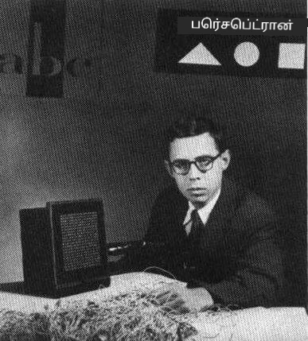
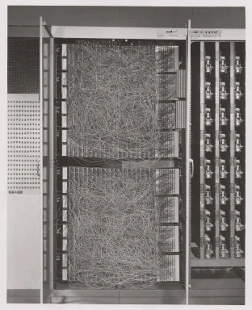
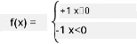

# நரம்பியல் வலைகள்: பெர்செப்ட்ரான் அறிமுகம்

## [முன்-வகுப்பு வினாடி வினா](https://ff-quizzes.netlify.app/en/ai/quiz/5)

1957 ஆம் ஆண்டில், கார்னெல் ஏரோநாடிக்கல் ஆய்வகத்தில் இருந்து ஃப்ராங்க் ரோசன்பிளாட், நவீன நரம்பியல் வலைகளுக்கு ஒத்ததாக ஏதாவது ஒன்றை உருவாக்க முயற்சித்தார். இது "மார்க்-1" எனப்படும் ஒரு ஹார்ட்வேரின் வடிவமைப்பாக இருந்தது, இது முக்கோணங்கள், சதுரங்கள் மற்றும் வட்டங்கள் போன்ற அடிப்படை வடிவங்களை அடையாளம் காண வடிவமைக்கப்பட்டது.

|      |      |
|--------------|-----------|
| | |

> படங்கள் [விக்கிபீடியாவில் இருந்து](https://en.wikipedia.org/wiki/Perceptron)

ஒரு உள்ளீட்டு படம் 20x20 புகைப்பட செல்கள் கொண்ட வரிசையாக பிரதிநிதித்துவப்படுத்தப்பட்டது, எனவே நரம்பியல் வலைகளுக்கு 400 உள்ளீடுகள் மற்றும் ஒரு இரBinary output இருந்தது. ஒரு எளிய வலைகளில் ஒரு நரம்பு இருந்தது, இது **தொகுப்பு தர்க்க அலகு** என்றும் அழைக்கப்பட்டது. நரம்பியல் வலைகள் எடைகள், பயிற்சி கட்டத்தில் கையேடு மூலம் சரிசெய்ய வேண்டிய பொட்டென்சியோமீட்டர்களைப் போல செயல்பட்டன.

> ✅ பொட்டென்சியோமீட்டர் என்பது ஒரு சுற்றின் எதிர்ப்பை சரிசெய்ய பயனர் அனுமதிக்கும் ஒரு சாதனமாகும்.

> அந்த நேரத்தில் நியூயார்க் டைம்ஸ் பெர்செப்ட்ரான் பற்றி எழுதியது: *ஒரு மின்னணு கணினியின் கரு, இது [கடற்படை] நடக்க, பேச, பார்க்க, எழுத, தன்னைப் பிரபலப்படுத்த மற்றும் தனது இருப்பை உணர முடியும் என்று எதிர்பார்க்கிறது.*

## பெர்செப்ட்ரான் மாதிரி

நாம் எங்கள் மாதிரியில் N அம்சங்கள் உள்ளதாகக் கருதுவோம், அந்த நேரத்தில் உள்ளீட்டு வெக்டர் N அளவுடைய ஒரு வெக்டர் ஆக இருக்கும். பெர்செப்ட்ரான் ஒரு **இரBinary வகைப்படுத்தல்** மாதிரியாகும், அதாவது இது உள்ளீட்டு தரவின் இரண்டு வகைகளை வேறுபடுத்த முடியும். ஒவ்வொரு உள்ளீட்டு வெக்டர் x க்கும் எங்கள் பெர்செப்ட்ரானின் வெளியீடு வகையைப் பொறுத்து +1 அல்லது -1 ஆக இருக்கும் என்று நாம் கருதுவோம். வெளியீடு கீழே உள்ள சூத்திரத்தைப் பயன்படுத்தி கணக்கிடப்படும்:

y(x) = f(w<sup>T</sup>x)

இங்கு f என்பது ஒரு படி செயல்பாட்டு செயல்பாடு

<!-- img src="http://www.sciweavers.org/tex2img.php?eq=f%28x%29%20%3D%20%5Cbegin%7Bcases%7D%0A%20%20%20%20%20%20%20%20%20%2B1%20%26%20x%20%5Cgeq%200%20%5C%5C%0A%20%20%20%20%20%20%20%20%20-1%20%26%20x%20%3C%200%0A%20%20%20%20%20%20%20%5Cend%7Bcases%7D%20%5C%5C%0A&bc=White&fc=Black&im=jpg&fs=12&ff=arev&edit=0" align="center" border="0" alt="f(x) = \begin{cases} +1 & x \geq 0 \\ -1 & x < 0 \end{cases} \\" width="154" height="50" / -->


## பெர்செப்ட்ரானை பயிற்சி செய்வது

பெர்செப்ட்ரானை பயிற்சி செய்ய, பெரும்பாலான மதிப்புகளை சரியாக வகைப்படுத்தும் எடைகள் வெக்டர் w ஐ கண்டுபிடிக்க வேண்டும், அதாவது மிகக் குறைந்த **தவறு** பெற வேண்டும். இந்த தவறு E கீழே உள்ள **பெர்செப்ட்ரான் அளவுகோல்** மூலம் வரையறுக்கப்படுகிறது:

E(w) = -&sum;w<sup>T</sup>x<sub>i</sub>t<sub>i</sub>

இங்கு:

* தவறான வகைப்படுத்தலுக்கு காரணமான பயிற்சி தரவுப் புள்ளிகள் i மீது கூட்டம் எடுக்கப்படுகிறது
* x<sub>i</sub> என்பது உள்ளீட்டு தரவு, மற்றும் t<sub>i</sub> என்பது எதிர்மறை மற்றும் நேர்மறை எடுத்துக்காட்டுகளுக்கு முறையே -1 அல்லது +1 ஆகும்.

இந்த அளவுகோல் எடைகள் w இன் செயல்பாடாகக் கருதப்படுகிறது, மேலும் இதை குறைக்க வேண்டும். அடிக்கடி, **சாய்வு இறக்கம்** எனப்படும் ஒரு முறை பயன்படுத்தப்படுகிறது, இதில் நாம் சில ஆரம்ப எடைகள் w<sup>(0)</sup> உடன் தொடங்குகிறோம், பின்னர் ஒவ்வொரு படியிலும் கீழே உள்ள சூத்திரத்தின்படி எடைகளைப் புதுப்பிக்கிறோம்:

w<sup>(t+1)</sup> = w<sup>(t)</sup> - &eta;&nabla;E(w)

இங்கு &eta; என்பது **பயிற்சி வீதம்** எனப்படும் ஒன்று, மற்றும் &nabla;E(w) என்பது E இன் **சாய்வு** ஆகும். சாய்வை கணக்கிடும் பிறகு, நாம் பெறுவது:

w<sup>(t+1)</sup> = w<sup>(t)</sup> + &sum;&eta;x<sub>i</sub>t<sub>i</sub>

Python இல் அல்காரிதம் இவ்வாறு இருக்கும்:

```python
def train(positive_examples, negative_examples, num_iterations = 100, eta = 1):

    weights = [0,0,0] # Initialize weights (almost randomly :)
        
    for i in range(num_iterations):
        pos = random.choice(positive_examples)
        neg = random.choice(negative_examples)

        z = np.dot(pos, weights) # compute perceptron output
        if z < 0: # positive example classified as negative
            weights = weights + eta*weights.shape

        z  = np.dot(neg, weights)
        if z >= 0: # negative example classified as positive
            weights = weights - eta*weights.shape

    return weights
```

## முடிவு

இந்த பாடத்தில், நீங்கள் ஒரு பெர்செப்ட்ரான் பற்றி, இது ஒரு இரBinary வகைப்படுத்தல் மாதிரி, மற்றும் எடைகள் வெக்டர் பயன்படுத்தி அதை எப்படி பயிற்சி செய்வது என்பதை கற்றுக்கொண்டீர்கள்.

## 🚀 சவால்

உங்கள் சொந்த பெர்செப்ட்ரானை உருவாக்க முயற்சிக்க விரும்பினால், [Microsoft Learn இல் உள்ள இந்த ஆய்வகத்தை](https://docs.microsoft.com/en-us/azure/machine-learning/component-reference/two-class-averaged-perceptron?WT.mc_id=academic-77998-cacaste) முயற்சிக்கவும், இது [Azure ML designer](https://docs.microsoft.com/en-us/azure/machine-learning/concept-designer?WT.mc_id=academic-77998-cacaste) ஐ பயன்படுத்துகிறது.

## [பாடத்திற்குப் பின் வினாடி வினா](https://ff-quizzes.netlify.app/en/ai/quiz/6)

## மதிப்பீடு & சுயபயிற்சி

ஒரு சிறு பிரச்சினை மற்றும் உண்மையான வாழ்க்கை பிரச்சினைகளைத் தீர்க்க பெர்செப்ட்ரானை எப்படி பயன்படுத்தலாம் என்பதைப் பார்க்கவும், மேலும் கற்றல் தொடர - [Perceptron](Perceptron.ipynb) நோட்புக் க்கு செல்லவும்.

இங்கே பெர்செப்ட்ரான்கள் பற்றிய ஒரு சுவாரஸ்யமான [கட்டுரை](https://towardsdatascience.com/what-is-a-perceptron-basics-of-neural-networks-c4cfea20c590) உள்ளது.

## [பணி](lab/README.md)

இந்த பாடத்தில், நாம் ஒரு இரBinary வகைப்படுத்தல் பணிக்கான பெர்செப்ட்ரானை செயல்படுத்தியுள்ளோம், மேலும் இரண்டு கையால் எழுதப்பட்ட இலக்கங்களை வேறுபடுத்த அதை பயன்படுத்தியுள்ளோம். இந்த ஆய்வகத்தில், நீங்கள் இலக்க வகைப்படுத்தல் பிரச்சினையை முழுமையாகத் தீர்க்க வேண்டும், அதாவது ஒரு குறிப்பிட்ட படத்திற்கு எந்த இலக்கம் அதிகமாக பொருந்தும் என்பதைத் தீர்மானிக்க வேண்டும்.

* [வழிமுறைகள்](lab/README.md)
* [நோட்புக்](lab/PerceptronMultiClass.ipynb)

---

**அறிவிப்பு**:  
இந்த ஆவணம் [Co-op Translator](https://github.com/Azure/co-op-translator) என்ற AI மொழிபெயர்ப்பு சேவையை பயன்படுத்தி மொழிபெயர்க்கப்பட்டுள்ளது. நாங்கள் துல்லியத்திற்காக முயற்சிக்கிறோம், ஆனால் தானியங்கி மொழிபெயர்ப்புகளில் பிழைகள் அல்லது தவறுகள் இருக்கக்கூடும் என்பதை கவனத்தில் கொள்ளவும். அதன் சொந்த மொழியில் உள்ள மூல ஆவணம் அதிகாரப்பூர்வ ஆதாரமாக கருதப்பட வேண்டும். முக்கியமான தகவல்களுக்கு, தொழில்முறை மனித மொழிபெயர்ப்பு பரிந்துரைக்கப்படுகிறது. இந்த மொழிபெயர்ப்பைப் பயன்படுத்துவதால் ஏற்படும் எந்த தவறான புரிதல்களுக்கும் அல்லது தவறான விளக்கங்களுக்கும் நாங்கள் பொறுப்பல்ல.