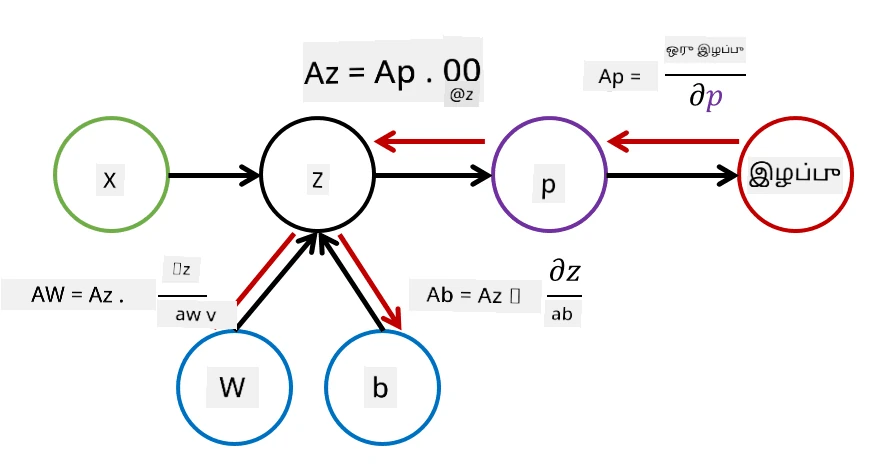

# நர்வியல் நெட்வொர்க்குகளுக்கான அறிமுகம். பன்மடங்கு அடுக்கப்பட்ட பர்செப்ட்ரான்

முந்தைய பகுதியில், நீங்கள் மிகவும் எளிய நர்வியல் நெட்வொர்க்கு மாதிரியைப் பற்றி கற்றீர்கள் - ஒரு அடுக்கு பர்செப்ட்ரான், இது ஒரு நேரியல் இரு வகை வகைப்படுத்தல் மாதிரி.

இந்த பகுதியில், இந்த மாதிரியை மேலும் நெகிழ்வான ஒரு கட்டமைப்பாக விரிவாக்குவோம், இது எங்களுக்கு கீழ்க்கண்டவற்றை செய்ய அனுமதிக்கும்:

* இரண்டு வகை வகைப்படுத்தலுக்கு கூடுதலாக **பன்முக வகைப்படுத்தல்** செய்ய
* வகைப்படுத்தலுக்கு கூடுதலாக **மறுவடையீட்டு பிரச்சினைகளை** தீர்க்க
* நேரியல் முறையில் பிரிக்க முடியாத வகைகளை பிரிக்க

மேலும், Python-ல் நாங்கள் எங்கள் சொந்த மாடுலர் கட்டமைப்பை உருவாக்குவோம், இது நமக்கு பல்வேறு நர்வியல் நெட்வொர்க்கு கட்டமைப்புகளை உருவாக்க அனுமதிக்கும்.

## [முன்-வகுப்பு வினாடி வினா](https://ff-quizzes.netlify.app/en/ai/quiz/7)

## இயந்திர கற்றல் பற்றிய முறையான விளக்கம்

இயந்திர கற்றல் பிரச்சினையை முறையாக விளக்குவதில் இருந்து தொடங்குவோம். **X** என்ற பயிற்சி தரவுத்தொகுப்பும் **Y** என்ற லேபிள்களும் உள்ளன என்று கருதுங்கள், மேலும் மிகச் சரியான கணிப்புகளை செய்யும் *f* என்ற ஒரு மாதிரியை உருவாக்க வேண்டும். கணிப்புகளின் தரம் **இழப்பு செயல்பாடு** &lagran; மூலம் அளவிடப்படுகிறது. பின்வரும் இழப்பு செயல்பாடுகள் அடிக்கடி பயன்படுத்தப்படுகின்றன:

* ஒரு மறுவடையீட்டு பிரச்சினைக்கானது, எப்போது ஒரு எண்ணை கணிக்க வேண்டும், **முழுமையான பிழை** &sum;i|f(x(i))-y(i)| அல்லது **சதுர பிழை** &sum;i(f(x(i))-y(i))2 பயன்படுத்தலாம்.
* வகைப்படுத்தலுக்கானது, **0-1 இழப்பு** (இது **மாதிரியின் துல்லியத்துடன்** அடிப்படையில் ஒரே மாதிரி), அல்லது **லாஜிஸ்டிக் இழப்பு** பயன்படுத்தப்படுகிறது.

ஒரு-அடுக்கு பர்செப்ட்ரானுக்கானது, *f* செயல்பாடு *f(x)=wx+b* என்ற நேரியல் செயல்பாடாக வரையறுக்கப்பட்டது (*w* என்பது எடை மாடரிக்ஸ், *x* என்பது உள்ளீட்டு அம்சங்களின் வெக்டர், மற்றும் *b* என்பது பைஸ் வெக்டர்). பல்வேறு நர்வியல் நெட்வொர்க்கு கட்டமைப்புகளுக்கு, இந்த செயல்பாடு மேலும் சிக்கலான வடிவத்தை எடுக்கலாம்.

> வகைப்படுத்தல் சந்தர்ப்பத்தில், தொடர்புடைய வகைகளின் சாத்தியக்கூறுகளை நெட்வொர்க்கு வெளியீடாக பெறுவது பெரும்பாலும் விரும்பத்தக்கது. சாத்தியக்கூறுகளாக மாற்றுவதற்கு (எ.கா., வெளியீட்டை சாதாரணமாக்க), **softmax** செயல்பாடு &sigma; பயன்படுத்தப்படுகிறது, மேலும் *f* செயல்பாடு *f(x)=&sigma;(wx+b)* ஆக மாறுகிறது.

மேலே உள்ள *f* வரையறையில், *w* மற்றும் *b* ஆகியவை **அளவுருக்கள்** &theta;=⟨*w,b*⟩ என அழைக்கப்படுகின்றன. தரவுத்தொகுப்பு ⟨**X**,**Y**⟩ கொடுக்கப்பட்டால், முழு தரவுத்தொகுப்பில் உள்ள மொத்த பிழையை அளவுருக்களின் செயல்பாடாக கணிக்கலாம்.

> ✅ **நர்வியல் நெட்வொர்க்கு பயிற்சியின் நோக்கம், அளவுருக்களை &theta; மாறுவதன் மூலம் பிழையை குறைப்பதாகும்**

## சாய்வு இறக்குமதி ஆப்டிமைசேஷன்

**சாய்வு இறக்குமதி** எனப்படும் செயல்பாடு ஆப்டிமைசேஷனின் ஒரு பிரபலமான முறை உள்ளது. இழப்பு செயல்பாட்டின் **சாய்வு** (பன்முக பரிமாண வழக்கில் **கிரேடியண்ட்** என அழைக்கப்படும்) அளவுருக்களுடன் தொடர்புடையது என்பதை நாம் கணக்கிட முடியும், மேலும் பிழை குறையும் வகையில் அளவுருக்களை மாறலாம். இதை பின்வருமாறு முறையாகக் குறிப்பிடலாம்:

* சில சீரற்ற மதிப்புகளால் அளவுருக்களை தொடங்கவும் w(0), b(0)
* பின்வரும் படியை பல முறை மீண்டும் செய்யவும்:
    - w(i+1) = w(i)-&eta;&part;&lagran;/&part;w
    - b(i+1) = b(i)-&eta;&part;&lagran;/&part;b

பயிற்சியின் போது, ஆப்டிமைசேஷன் படிகள் முழு தரவுத்தொகுப்பை கருத்தில் கொண்டு கணக்கிடப்பட வேண்டும் (இழப்பு அனைத்து பயிற்சி மாதிரிகளின் மூலம் ஒரு தொகையாக கணக்கிடப்படுகிறது என்பதை நினைவில் கொள்ளுங்கள்). ஆனால், உண்மையான வாழ்க்கையில், **minibatches** எனப்படும் தரவுத்தொகுப்பின் சிறிய பகுதிகளை எடுப்போம், மேலும் தரவின் ஒரு துணுக்கின் அடிப்படையில் கிரேடியண்ட்களை கணக்கிடுவோம். ஒவ்வொரு முறையும் சீரற்ற முறையில் துணுக்குகள் எடுக்கப்படுவதால், இந்த முறை **stochastic gradient descent** (SGD) என அழைக்கப்படுகிறது.

## பன்மடங்கு அடுக்கப்பட்ட பர்செப்ட்ரான்கள் மற்றும் பின்செலுத்தல்

ஒரு-அடுக்கு நெட்வொர்க்கு, மேலே காணப்பட்டபடி, நேரியல் முறையில் பிரிக்கக்கூடிய வகைகளை வகைப்படுத்த முடியும். மேலும் செறிவான மாதிரியை உருவாக்க, நெட்வொர்க்கின் பல அடுக்குகளை இணைக்கலாம். கணித ரீதியாக, *f* செயல்பாடு மேலும் சிக்கலான வடிவத்தை எடுக்கும், மேலும் பல படிகளில் கணக்கிடப்படும்:
* z1=w1x+b1
* z2=w2&alpha;(z1)+b2
* f = &sigma;(z2)

இங்கு, &alpha; என்பது **நேரியல் அல்லாத செயல்பாடு**, &sigma; என்பது softmax செயல்பாடு, மற்றும் அளவுருக்கள் &theta;=<*w1,b1,w2,b2*>.

சாய்வு இறக்குமதி ஆல்கோரிதம் மாறாமல் இருக்கும், ஆனால் கிரேடியண்ட்களை கணக்கிடுவது சிக்கலாக இருக்கும். சங்கிலி வேறுபாடு விதியைப் பயன்படுத்தி, நாங்கள் பின்வருமாறு வேறுபாடுகளை கணக்கிடலாம்:

* &part;&lagran;/&part;w2 = (&part;&lagran;/&part;&sigma;)(&part;&sigma;/&part;z2)(&part;z2/&part;w2)
* &part;&lagran;/&part;w1 = (&part;&lagran;/&part;&sigma;)(&part;&sigma;/&part;z2)(&part;z2/&part;&alpha;)(&part;&alpha;/&part;z1)(&part;z1/&part;w1)

> ✅ இழப்பு செயல்பாட்டின் அளவுருக்களுடன் தொடர்புடைய வேறுபாடுகளை கணக்கிட சங்கிலி வேறுபாடு விதி பயன்படுத்தப்படுகிறது.

இந்த வெளிப்பாடுகளின் இடது-மிகவும் பகுதி அனைத்தும் ஒரே மாதிரியாக இருப்பதால், இழப்பு செயல்பாட்டிலிருந்து "பின்சென்று" கணக்கீட்டு வரைபடத்தின் மூலம் வேறுபாடுகளை பயனுள்ளதாகக் கணக்கிட முடியும். எனவே, பன்மடங்கு அடுக்கப்பட்ட பர்செப்ட்ரானை பயிற்சி செய்யும் முறை **பின்செலுத்தல்** அல்லது 'backprop' என அழைக்கப்படுகிறது.

> TODO: படம் மேற்கோள்

> ✅ நாங்கள் எங்கள் நோட்புக் எடுத்துக்காட்டில் பின்செலுத்தல் பற்றி மேலும் விரிவாகக் கையாளுவோம்.  

## முடிவு

இந்த பாடத்தில், நாங்கள் எங்கள் சொந்த நர்வியல் நெட்வொர்க்கு நூலகத்தை உருவாக்கியுள்ளோம், மேலும் எளிய இரு-பரிமாண வகைப்படுத்தல் பணிக்காக அதை பயன்படுத்தியுள்ளோம்.

## 🚀 சவால்

இணைக்கப்பட்ட நோட்புக்கில், நீங்கள் பன்மடங்கு அடுக்கப்பட்ட பர்செப்ட்ரான்களை உருவாக்கவும் பயிற்சி செய்யவும் உங்கள் சொந்த கட்டமைப்பை செயல்படுத்துவீர்கள். நவீன நர்வியல் நெட்வொர்க்குகள் எவ்வாறு செயல்படுகின்றன என்பதை நீங்கள் விரிவாகக் காண முடியும்.

[OwnFramework](OwnFramework.ipynb) நோட்புக்கிற்கு செல்லவும் மற்றும் அதைச் செயல்படுத்தவும்.

## [பிந்தைய-வகுப்பு வினாடி வினா](https://ff-quizzes.netlify.app/en/ai/quiz/8)

## மதிப்பீடு மற்றும் சுயபயிற்சி

பின்செலுத்தல் என்பது AI மற்றும் ML-ல் பொதுவாக பயன்படுத்தப்படும் ஒரு ஆல்கோரிதம், [மேலும் விரிவாக](https://wikipedia.org/wiki/Backpropagation) கற்க தகுந்தது.

## [பணி](lab/README.md)

இந்த ஆய்வகத்தில், நீங்கள் இந்த பாடத்தில் உருவாக்கிய கட்டமைப்பைப் பயன்படுத்தி MNIST கையால் எழுதப்பட்ட எண் வகைப்படுத்தலை தீர்க்க வேண்டும்.

* [வழிமுறைகள்](lab/README.md)
* [நோட்புக்](lab/MyFW_MNIST.ipynb)

---

**குறிப்பு**:  
இந்த ஆவணம் [Co-op Translator](https://github.com/Azure/co-op-translator) என்ற AI மொழிபெயர்ப்பு சேவையைப் பயன்படுத்தி மொழிபெயர்க்கப்பட்டுள்ளது. நாங்கள் துல்லியத்திற்காக முயற்சிக்கிறோம், ஆனால் தானியங்கி மொழிபெயர்ப்புகளில் பிழைகள் அல்லது தவறான தகவல்கள் இருக்கக்கூடும் என்பதை தயவுசெய்து கவனத்தில் கொள்ளுங்கள். அதன் தாய்மொழியில் உள்ள மூல ஆவணம் அதிகாரப்பூர்வ ஆதாரமாக கருதப்பட வேண்டும். முக்கியமான தகவல்களுக்கு, தொழில்முறை மனித மொழிபெயர்ப்பு பரிந்துரைக்கப்படுகிறது. இந்த மொழிபெயர்ப்பைப் பயன்படுத்துவதால் ஏற்படும் எந்த தவறான புரிதல்கள் அல்லது தவறான விளக்கங்களுக்கு நாங்கள் பொறுப்பல்ல.