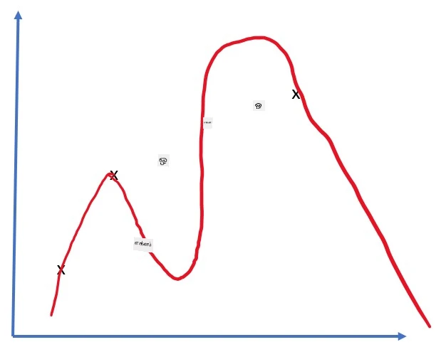
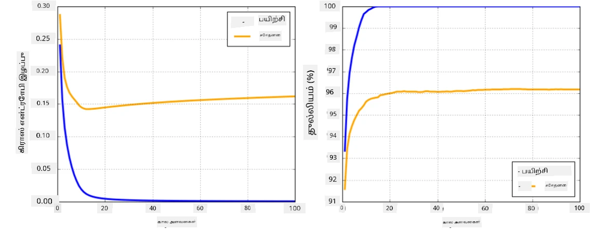

# நரம்பியல் நெட்வொர்க் கட்டமைப்புகள்

நாம் ஏற்கனவே கற்றுக்கொண்டது போல, நரம்பியல் நெட்வொர்க்குகளை திறம்பட பயிற்சி செய்ய, இரண்டு முக்கியமான காரியங்களை செய்ய வேண்டும்:

* டென்சர்களில் செயல்பட வேண்டும், உதாரணமாக பெருக்கம், கூட்டல் மற்றும் sigmoid அல்லது softmax போன்ற சில செயல்பாடுகளை கணக்கிட வேண்டும்.
* அனைத்து வெளிப்பாடுகளின் சாய்வு மதிப்புகளை கணக்கிட வேண்டும், சாய்வு இறக்கத்தைக் கொண்டு மேம்படுத்தல் செய்ய.

## [முன்-பாடம் வினாடி வினா](https://ff-quizzes.netlify.app/en/ai/quiz/9)

`numpy` நூலகம் முதல் பாகத்தை செய்ய முடியும், ஆனால் சாய்வுகளை கணக்கிட ஒரு முறைமையை தேவைப்படும். [நமது கட்டமைப்பில்](../04-OwnFramework/OwnFramework.ipynb) நாம் முந்தைய பகுதியில் உருவாக்கியதைப் போல, `backward` முறைமையில் அனைத்து சாய்வு செயல்பாடுகளையும் கையேடு மூலம் நிரலாக்க வேண்டும். ஆனால், ஒரு சிறந்த கட்டமைப்பு நாம் வரையறுக்கும் *எந்த வெளிப்பாடுகளுக்கும்* சாய்வுகளை கணக்கிடும் வாய்ப்பை வழங்க வேண்டும்.

மற்றொரு முக்கியமான விஷயம் GPU அல்லது [TPU](https://en.wikipedia.org/wiki/Tensor_Processing_Unit) போன்ற சிறப்பு கணக்கீட்டு அலகுகளில் கணக்கீடுகளைச் செய்யும் திறனைப் பெற வேண்டும். ஆழமான நரம்பியல் நெட்வொர்க் பயிற்சி *மிகவும் அதிகமான* கணக்கீடுகளை தேவைப்படுத்துகிறது, மேலும் GPU-களில் அவற்றை இணைந்து செயல்படுத்துவது மிகவும் முக்கியம்.

> ✅ 'parallelize' என்ற சொல் கணக்கீடுகளை பல சாதனங்களில் பகிர்ந்து செயல்படுத்துவதை குறிக்கிறது.

தற்போது, மிகவும் பிரபலமான இரண்டு நரம்பியல் கட்டமைப்புகள்: [TensorFlow](http://TensorFlow.org) மற்றும் [PyTorch](https://pytorch.org/). இரண்டும் CPU மற்றும் GPU இரண்டிலும் டென்சர்களுடன் செயல்பட ஒரு குறைந்த நிலை API-ஐ வழங்குகின்றன. குறைந்த நிலை API-க்கு மேலாக, [Keras](https://keras.io/) மற்றும் [PyTorch Lightning](https://pytorchlightning.ai/) எனப்படும் உயர் நிலை API-களும் உள்ளன.

Low-Level API | [TensorFlow](http://TensorFlow.org) | [PyTorch](https://pytorch.org/)
--------------|-------------------------------------|--------------------------------
High-level API| [Keras](https://keras.io/) | [PyTorch Lightning](https://pytorchlightning.ai/)

**குறைந்த நிலை API-கள்** இரு கட்டமைப்புகளிலும் **கணக்கீட்டு வரைபடங்களை** உருவாக்க அனுமதிக்கின்றன. இந்த வரைபடம் கொடுக்கப்பட்ட உள்ளீட்டு அளவுருக்களுடன் வெளியீட்டை (சாதாரணமாக இழப்பு செயல்பாடு) எப்படி கணக்கிடுவது என்பதை வரையறுக்கிறது, மேலும் GPU-வில் கணக்கீடு செய்ய தள்ளப்படலாம், அது கிடைத்தால். இந்த கணக்கீட்டு வரைபடத்தை வேறுபடுத்தவும் சாய்வுகளை கணக்கிடவும் செயல்பாடுகள் உள்ளன, அவை பின்னர் மாதிரி அளவுருக்களை மேம்படுத்த பயன்படுத்தப்படலாம்.

**உயர் நிலை API-கள்** பெரும்பாலும் நரம்பியல் நெட்வொர்க்குகளை **அடுக்கு வரிசையாக** கருதுகின்றன, மேலும் பெரும்பாலான நரம்பியல் நெட்வொர்க்குகளை உருவாக்குவது மிகவும் எளிதாகிறது. மாதிரியை பயிற்சி செய்வது பொதுவாக தரவைத் தயாரித்து, பின்னர் `fit` செயல்பாட்டை அழைப்பதன் மூலம் செய்யப்படுகிறது.

உயர் நிலை API வழியாக சாதாரண நரம்பியல் நெட்வொர்க்குகளை விரைவாக உருவாக்க முடியும், மேலும் பல விவரங்களைப் பற்றி கவலைப்பட தேவையில்லை. அதே நேரத்தில், குறைந்த நிலை API பயிற்சி செயல்முறையை அதிகமாகக் கட்டுப்படுத்த அனுமதிக்கிறது, எனவே புதிய நரம்பியல் நெட்வொர்க் கட்டமைப்புகளுடன் நீங்கள் செயல்படும்போது ஆராய்ச்சியில் அதிகமாக பயன்படுத்தப்படுகிறது.

இரண்டு API-களையும் ஒன்றாகப் பயன்படுத்த முடியும் என்பதை புரிந்துகொள்வது முக்கியம், உதாரணமாக, நீங்கள் குறைந்த நிலை API-ஐப் பயன்படுத்தி உங்கள் சொந்த நெட்வொர்க் அடுக்கு கட்டமைப்பை உருவாக்கலாம், பின்னர் அதை உயர் நிலை API மூலம் உருவாக்கப்பட்ட மற்றும் பயிற்சி செய்யப்பட்ட பெரிய நெட்வொர்க்கில் பயன்படுத்தலாம். அல்லது நீங்கள் அடுக்குகளின் வரிசையாக உயர் நிலை API மூலம் ஒரு நெட்வொர்க்கை வரையறுக்கலாம், பின்னர் உங்கள் சொந்த குறைந்த நிலை பயிற்சி மடக்கு வழியைப் பயன்படுத்தி மேம்படுத்தல் செய்யலாம். இரண்டு API-களும் ஒரே அடிப்படை அடிப்படைகளைப் பயன்படுத்துகின்றன, மேலும் அவை ஒன்றுடன் ஒன்று நன்றாக வேலை செய்ய வடிவமைக்கப்பட்டுள்ளன.

## கற்றல்

இந்த பாடத்தில், PyTorch மற்றும் TensorFlow ஆகியவற்றிற்கான உள்ளடக்கத்தை நாங்கள் வழங்குகிறோம். நீங்கள் விரும்பிய கட்டமைப்பைத் தேர்ந்தெடுத்து, அதற்கேற்ப உள்ள நோட்புக்குகளை மட்டும் படிக்கலாம். எந்த கட்டமைப்பைத் தேர்ந்தெடுப்பது என்று உறுதியாக இல்லையெனில், **PyTorch vs. TensorFlow** குறித்த இணையத்தில் உள்ள விவாதங்களைப் படியுங்கள். மேலும், இரண்டு கட்டமைப்புகளையும் பார்வையிடுவதன் மூலம் சிறந்த புரிதலைப் பெறலாம்.

சாத்தியமான இடங்களில், எளிமைக்காக உயர் நிலை API-களைப் பயன்படுத்துவோம். இருப்பினும், நரம்பியல் நெட்வொர்க்குகள் அடிப்படையில் எப்படி வேலை செய்கின்றன என்பதைப் புரிந்துகொள்வது முக்கியம் என்று நாங்கள் நம்புகிறோம், எனவே தொடக்கத்தில், குறைந்த நிலை API மற்றும் டென்சர்களுடன் வேலை செய்வதன் மூலம் தொடங்குகிறோம். இருப்பினும், நீங்கள் விரைவாக தொடங்க விரும்பினால் மற்றும் இந்த விவரங்களைப் பற்றி கற்றுக்கொள்வதற்கு அதிக நேரம் செலவிட விரும்பவில்லை என்றால், அவற்றை தவிர்த்து, நேரடியாக உயர் நிலை API நோட்புக்குகளுக்கு செல்லலாம்.

## ✍️ பயிற்சிகள்: கட்டமைப்புகள்

தொடர்ந்து கற்றலை பின்வரும் நோட்புக்குகளில் தொடருங்கள்:

Low-Level API | [TensorFlow+Keras Notebook](IntroKerasTF.ipynb) | [PyTorch](IntroPyTorch.ipynb)
--------------|-------------------------------------|--------------------------------
High-level API| [Keras](IntroKeras.ipynb) | *PyTorch Lightning*

கட்டமைப்புகளை கற்றுக்கொண்ட பிறகு, overfitting என்ற கருத்தை மீண்டும் நினைவில் கொள்ளலாம்.

# Overfitting

Overfitting என்பது இயந்திர கற்றலில் மிகவும் முக்கியமான ஒரு கருத்தாகும், மேலும் அதை சரியாகப் புரிந்து கொள்வது மிகவும் அவசியம்!

கீழே உள்ள வரைபடங்களில் `x` மூலம் குறிக்கப்படும் 5 புள்ளிகளை அணுகும் சிக்கலான பிரச்சினையைப் பரிசீலிக்கவும்:

 | 
-------------------------|--------------------------
**நேர்கோட்ட மாதிரி, 2 அளவுருக்கள்** | **நேர்மற்ற மாதிரி, 7 அளவுருக்கள்**
பயிற்சி பிழை = 5.3 | பயிற்சி பிழை = 0
சரிபார்ப்பு பிழை = 5.1 | சரிபார்ப்பு பிழை = 20

* இடது பக்கம், நல்ல நேர்கோட்ட அணுகுமுறை உள்ளது. அளவுருக்களின் எண்ணிக்கை போதுமானதாக இருப்பதால், மாதிரி புள்ளி விநியோகத்தின் அடிப்படையை சரியாகப் புரிந்துகொள்கிறது.
* வலது பக்கம், மாதிரி மிகவும் சக்திவாய்ந்தது. ஏனெனில் நமக்கு 5 புள்ளிகள் மட்டுமே உள்ளன, ஆனால் மாதிரியில் 7 அளவுருக்கள் உள்ளன, இது அனைத்து புள்ளிகளையும் கடந்து செல்லும் வகையில் சரிசெய்ய முடியும், இதனால் பயிற்சி பிழை 0 ஆகிறது. இருப்பினும், இது தரவின் சரியான முறைமையைப் புரிந்துகொள்வதைத் தடுக்கிறது, எனவே சரிபார்ப்பு பிழை மிகவும் அதிகமாக உள்ளது.

மாதிரியின் செறிவுத்தன்மை (அளவுருக்களின் எண்ணிக்கை) மற்றும் பயிற்சி மாதிரிகளின் எண்ணிக்கை ஆகியவற்றுக்கு இடையில் சரியான சமநிலையை அடைவது மிகவும் முக்கியம்.

## ஏன் overfitting ஏற்படுகிறது

  * போதுமான பயிற்சி தரவுகள் இல்லாதது
  * மிகவும் சக்திவாய்ந்த மாதிரி
  * உள்ளீட்டு தரவுகளில் அதிகமான சத்தம்

## Overfitting-ஐ எப்படி கண்டறிவது

மேலே உள்ள வரைபடத்தில் காண்பது போல, பயிற்சி பிழை மிகவும் குறைவாகவும், சரிபார்ப்பு பிழை மிகவும் அதிகமாகவும் இருந்தால், அது overfitting என்பதை காட்டுகிறது. பொதுவாக பயிற்சியின் போது, பயிற்சி மற்றும் சரிபார்ப்பு பிழைகள் இரண்டும் குறையத் தொடங்கும், பின்னர் ஒரு கட்டத்தில் சரிபார்ப்பு பிழை குறையாமல் அதிகரிக்கத் தொடங்கலாம். இது overfitting-ஐக் காட்டும் ஒரு அறிகுறியாக இருக்கும், மேலும் இந்த கட்டத்தில் பயிற்சியை நிறுத்த வேண்டும் (அல்லது குறைந்தது மாதிரியின் ஒரு நகலை சேமிக்க வேண்டும்).

## Overfitting-ஐ எப்படி தடுக்கலாம்

Overfitting ஏற்படுவதை நீங்கள் கவனித்தால், நீங்கள் பின்வரும் ஒன்றை செய்யலாம்:

 * பயிற்சி தரவின் அளவை அதிகரிக்கவும்
 * மாதிரியின் சிக்கல்தன்மையை குறைக்கவும்
 * [Dropout](../../4-ComputerVision/08-TransferLearning/TrainingTricks.md#Dropout) போன்ற [சீரமைப்பு தொழில்நுட்பத்தை](../../4-ComputerVision/08-TransferLearning/TrainingTricks.md) பயன்படுத்தவும், இதை நாம் பின்னர் பரிசீலிப்போம்.

## Overfitting மற்றும் Bias-Variance Tradeoff

Overfitting என்பது [Bias-Variance Tradeoff](https://en.wikipedia.org/wiki/Bias%E2%80%93variance_tradeoff) எனப்படும் புள்ளியியல் துறையில் உள்ள ஒரு பொதுவான பிரச்சினையின் ஒரு நிலை. நமது மாதிரியில் பிழையின் சாத்தியமான மூலங்களை நாம் பரிசீலித்தால், இரண்டு வகையான பிழைகளை காணலாம்:

* **Bias பிழைகள்** நமது அல்காரிதம் பயிற்சி தரவின் உறவுகளை சரியாகப் பிடிக்க முடியாததால் ஏற்படுகின்றன. இது நமது மாதிரி போதுமான சக்திவாய்ந்ததாக இல்லாததால் ஏற்படலாம் (**underfitting**).
* **Variance பிழைகள்**, அவை உள்ளீட்டு தரவின் சத்தத்தை அர்த்தமுள்ள உறவுகளுக்கு பதிலாக அணுகுவதால் ஏற்படுகின்றன (**overfitting**).

பயிற்சியின் போது, bias பிழை குறைகிறது (எனவே நமது மாதிரி தரவுகளை அணுக கற்றுக்கொள்கிறது), மற்றும் variance பிழை அதிகரிக்கிறது. Overfitting-ஐத் தடுக்க பயிற்சியை நிறுத்துவது முக்கியம் - இது கையேடு மூலம் (நாம் overfitting-ஐ கண்டறிந்தால்) அல்லது தானாகவே (சீரமைப்பை அறிமுகப்படுத்துவதன் மூலம்) செய்யப்படலாம்.

## முடிவு

இந்த பாடத்தில், இரண்டு மிகவும் பிரபலமான AI கட்டமைப்புகளான TensorFlow மற்றும் PyTorch-க்கு உள்ள பல்வேறு API-களின் வித்தியாசங்களைப் பற்றி நீங்கள் கற்றுக்கொண்டீர்கள். கூடுதலாக, நீங்கள் ஒரு மிகவும் முக்கியமான தலைப்பான overfitting பற்றி கற்றுக்கொண்டீர்கள்.

## 🚀 சவால்

இணைக்கப்பட்ட நோட்புக்குகளில், 'tasks' கீழே கொடுக்கப்பட்டுள்ளன; நோட்புக்குகளைப் படித்து, அந்த பணிகளை முடிக்கவும்.

## [பாடத்திற்குப் பிந்தைய வினாடி வினா](https://ff-quizzes.netlify.app/en/ai/quiz/10)

## மதிப்பீடு மற்றும் சுயபயிற்சி

பின்வரும் தலைப்புகளில் சில ஆராய்ச்சிகளைச் செய்யவும்:

- TensorFlow
- PyTorch
- Overfitting

தங்களுக்கே பின்வரும் கேள்விகளை கேளுங்கள்:

- TensorFlow மற்றும் PyTorch இடையே என்ன வித்தியாசம்?
- Overfitting மற்றும் underfitting இடையே என்ன வித்தியாசம்?

## [பணி](lab/README.md)

இந்த ஆய்வகத்தில், PyTorch அல்லது TensorFlow-ஐப் பயன்படுத்தி ஒற்றை மற்றும் பல அடுக்குகள் கொண்ட முழுமையான இணைக்கப்பட்ட நெட்வொர்க்குகளைப் பயன்படுத்தி இரண்டு வகைப்படுத்தல் பிரச்சினைகளை தீர்க்க உங்களை கேட்டுக்கொள்கிறோம்.

* [வழிமுறைகள்](lab/README.md)
* [நோட்புக்](lab/LabFrameworks.ipynb)

---

**குறிப்பு**:  
இந்த ஆவணம் [Co-op Translator](https://github.com/Azure/co-op-translator) என்ற AI மொழிபெயர்ப்பு சேவையை பயன்படுத்தி மொழிபெயர்க்கப்பட்டுள்ளது. எங்கள் நோக்கம் துல்லியமாக இருக்க வேண்டும் என்பதுதான், ஆனால் தானியங்கி மொழிபெயர்ப்புகளில் பிழைகள் அல்லது துல்லியமின்மைகள் இருக்கக்கூடும் என்பதை கவனத்தில் கொள்ளவும். அதன் இயல்பான மொழியில் உள்ள மூல ஆவணம் அதிகாரப்பூர்வ ஆதாரமாக கருதப்பட வேண்டும். முக்கியமான தகவல்களுக்கு, தொழில்முறை மனித மொழிபெயர்ப்பு பரிந்துரைக்கப்படுகிறது. இந்த மொழிபெயர்ப்பைப் பயன்படுத்துவதால் ஏற்படும் எந்த தவறான புரிதல்கள் அல்லது தவறான விளக்கங்களுக்கு நாங்கள் பொறுப்பல்ல.