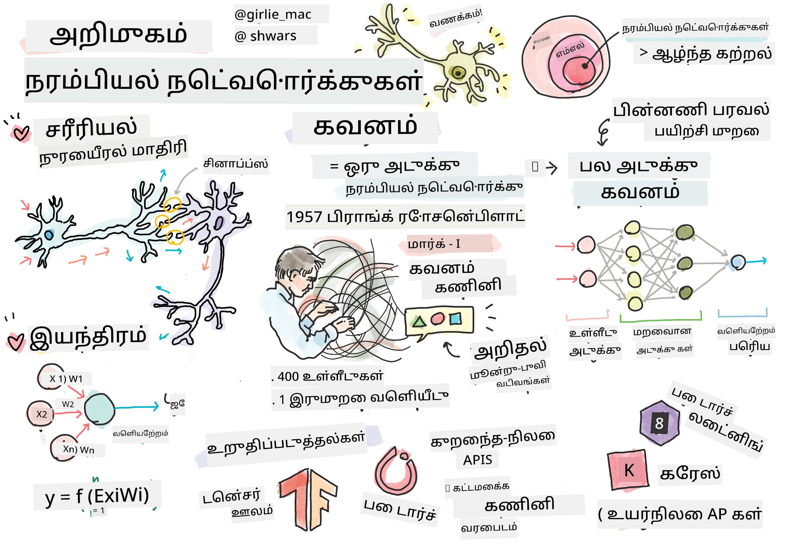
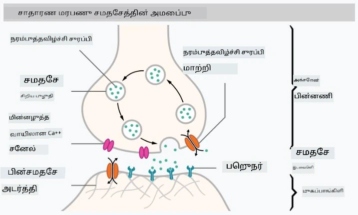
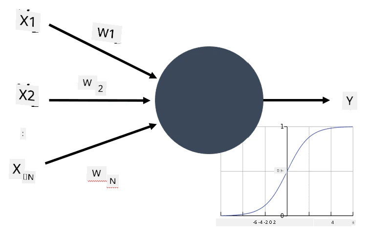
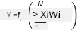

# நரம்பு வலையமைப்புகளுக்கான அறிமுகம்

அறிமுகத்தில் நாம் விவாதித்தபடி, நுண்ணறிவை அடைய ஒரு வழி **கணினி மாதிரி** அல்லது **கிரகித்தல் மூளை** உருவாக்குவது ஆகும். 20ஆம் நூற்றாண்டின் நடுப்பகுதியில் இருந்து, ஆராய்ச்சியாளர்கள் பல்வேறு கணித மாதிரிகளை முயற்சித்தனர், சமீபத்திய ஆண்டுகளில் இந்த திசை மிகுந்த வெற்றியை பெற்றது. மூளையின் இவ்வகை கணித மாதிரிகள் **நரம்பு வலையமைப்புகள்** என்று அழைக்கப்படுகின்றன.

> சில நேரங்களில் நரம்பு வலையமைப்புகள் *கிரகித்தல் நரம்பு வலையமைப்புகள்* (Artificial Neural Networks, ANNs) என்று அழைக்கப்படுகின்றன, இது நிஜ நரம்பு வலையமைப்புகளை அல்ல, மாதிரிகளை குறிக்கிறது.

## இயந்திரக் கற்றல்

நரம்பு வலையமைப்புகள் **இயந்திரக் கற்றல்** எனப்படும் ஒரு பெரிய துறையின் பகுதியாகும், இதன் நோக்கம் தரவுகளை பயன்படுத்தி கணினி மாதிரிகளை பயிற்சி செய்து பிரச்சினைகளை தீர்க்கும் திறனை பெறுவது. இயந்திரக் கற்றல் நுண்ணறிவின் ஒரு பெரிய பகுதியாகும், ஆனால் இந்த பாடத்திட்டத்தில் பாரம்பரிய ML (Machine Learning) பற்றி நாம் கற்றுக்கொள்ளவில்லை.

> பாரம்பரிய இயந்திரக் கற்றல் பற்றி மேலும் அறிய, எங்கள் தனித்துவமான **[Machine Learning for Beginners](http://github.com/microsoft/ml-for-beginners)** பாடத்திட்டத்தை பார்வையிடவும்.

இயந்திரக் கற்றலில், எங்களுக்கு சில உதாரணங்களின் தரவுத்தொகுப்பு **X** மற்றும் அதற்கான வெளியீட்டு மதிப்புகள் **Y** உள்ளன என்று நாம் கருதுகிறோம். உதாரணங்கள் பெரும்பாலும் **அம்சங்கள்** கொண்ட N-பரிமாண வெக்டர்கள் ஆகும், மற்றும் வெளியீடுகள் **லேபல்கள்** என்று அழைக்கப்படுகின்றன.

நாம் இரண்டு பொதுவான இயந்திரக் கற்றல் பிரச்சினைகளைப் பரிசீலிக்கிறோம்:

* **வகைப்படுத்தல்**, இதில் நாங்கள் உள்ளீட்டு பொருளை இரண்டு அல்லது அதற்கு மேற்பட்ட வகைகளில் வகைப்படுத்த வேண்டும்.
* **மீள்பரிசீலனை**, இதில் நாங்கள் ஒவ்வொரு உள்ளீட்டு மாதிரிகளுக்கும் ஒரு எண் மதிப்பை கணிக்க வேண்டும்.

> உள்ளீடுகள் மற்றும் வெளியீடுகளை டென்சர்களாகக் குறிக்கும்போது, உள்ளீட்டு தரவுத்தொகுப்பு M&times;N அளவுடைய ஒரு மடிப்பு ஆகும், இதில் M மாதிரிகளின் எண்ணிக்கையும் N அம்சங்களின் எண்ணிக்கையும் ஆகும். வெளியீட்டு லேபல்கள் Y என்பது M அளவுடைய வெக்டர் ஆகும்.

இந்த பாடத்திட்டத்தில், நாங்கள் நரம்பு வலையமைப்பு மாதிரிகளில் மட்டுமே கவனம் செலுத்துகிறோம்.

## ஒரு நரம்பு செலின் மாதிரி

உயிரியல் அறிவியல் மூலம், நமது மூளை நரம்பு செல்களால் (நரம்புகள்) ஆனது என்பதை நாம் அறிகிறோம், அவற்றில் ஒவ்வொன்றும் பல "உள்ளீடுகள்" (டெண்ட்ரைட்கள்) மற்றும் ஒரு "வெளியீடு" (ஆக்சான்) கொண்டுள்ளது. டெண்ட்ரைட்கள் மற்றும் ஆக்சான்கள் மின்சார சிக்னல்களை நடத்த முடியும், மேலும் அவற்றுக்கிடையிலான இணைப்புகள் — சினாப்ஸ்கள் என்று அழைக்கப்படும் — மாறுபட்ட அளவிலான நடத்துதலைக் காட்ட முடியும், இது நரம்பு சுரப்பிகளால் கட்டுப்படுத்தப்படுகிறது.

 | 
----|----
உயிரியல் நரம்பு செல் *([Wikipedia](https://en.wikipedia.org/wiki/Synapse#/media/File:SynapseSchematic_lines.svg) இல் இருந்து படம்)* | கிரகித்தல் நரம்பு செல் *(ஆசிரியரின் படம்)*

அதனால், ஒரு நரம்பு செலின் எளிய கணித மாதிரி பல உள்ளீடுகள் X1, ..., XN மற்றும் ஒரு வெளியீடு Y, மற்றும் ஒரு வரிசை எடைகள் W1, ..., WN கொண்டுள்ளது. வெளியீடு கீழ்க்கண்டவாறு கணக்கிடப்படுகிறது:

இங்கு f என்பது சில கோட்பாட்டியல் **செயல்பாட்டு செயல்பாடு** ஆகும்.

> நரம்பு செல்களின் ஆரம்ப மாதிரிகள் 1943 ஆம் ஆண்டில் Warren McCullock மற்றும் Walter Pitts எழுதிய [A logical calculus of the ideas immanent in nervous activity](https://www.cs.cmu.edu/~./epxing/Class/10715/reading/McCulloch.and.Pitts.pdf) என்ற பாரம்பரிய ஆவணத்தில் விவரிக்கப்பட்டன. Donald Hebb தனது "[The Organization of Behavior: A Neuropsychological Theory](https://books.google.com/books?id=VNetYrB8EBoC)" என்ற புத்தகத்தில் இந்த வலையமைப்புகளை எப்படி பயிற்சி செய்யலாம் என்பதை முன்மொழிந்தார்.

## இந்த பிரிவில்

இந்த பிரிவில் நாம் கற்றுக்கொள்ளப் போவது:
* [Perceptron](03-Perceptron/README.md), இரண்டு வகை வகைப்படுத்தலுக்கான ஆரம்பகால நரம்பு வலையமைப்பு மாதிரிகளில் ஒன்று
* [பல அடுக்கு வலையமைப்புகள்](04-OwnFramework/README.md) மற்றும் இணைக்கப்பட்ட நோட்புக் [எங்கள் சொந்த கட்டமைப்பை உருவாக்குவது எப்படி](04-OwnFramework/OwnFramework.ipynb)
* [நரம்பு வலையமைப்பு கட்டமைப்புகள்](05-Frameworks/README.md), இந்த நோட்புக்குகளுடன்: [PyTorch](05-Frameworks/IntroPyTorch.ipynb) மற்றும் [Keras/Tensorflow](05-Frameworks/IntroKerasTF.ipynb)
* [Overfitting](../../../../lessons/3-NeuralNetworks/05-Frameworks)

---

**குறிப்பு**:  
இந்த ஆவணம் [Co-op Translator](https://github.com/Azure/co-op-translator) என்ற AI மொழிபெயர்ப்பு சேவையைப் பயன்படுத்தி மொழிபெயர்க்கப்பட்டுள்ளது. எங்கள் தரச்செயல்முறையை உறுதிப்படுத்த முயற்சிக்கிறோம், ஆனால் தானியக்க மொழிபெயர்ப்புகளில் பிழைகள் அல்லது தவறுகள் இருக்கக்கூடும் என்பதை கவனத்தில் கொள்ளவும். அதன் தாய்மொழியில் உள்ள மூல ஆவணம் அதிகாரப்பூர்வ ஆதாரமாக கருதப்பட வேண்டும். முக்கியமான தகவல்களுக்கு, தொழில்முறை மனித மொழிபெயர்ப்பு பரிந்துரைக்கப்படுகிறது. இந்த மொழிபெயர்ப்பைப் பயன்படுத்துவதால் ஏற்படும் எந்த தவறான புரிதல்கள் அல்லது தவறான விளக்கங்களுக்கு நாங்கள் பொறுப்பல்ல.