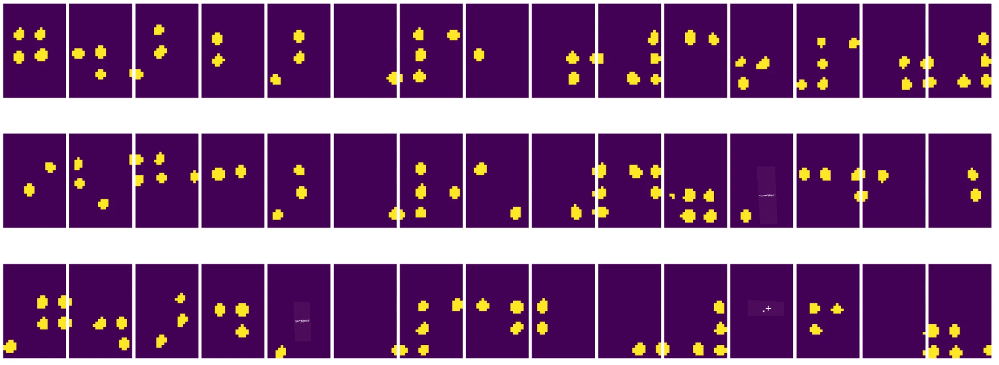
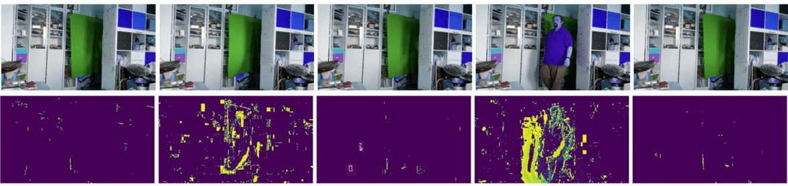

# கணினி பார்வை அறிமுகம்

[கணினி பார்வை](https://wikipedia.org/wiki/Computer_vision) என்பது கணினிகள் டிஜிட்டல் படங்களை உயர்நிலை புரிதலுடன் புரிந்து கொள்ள உதவுவதற்கான ஒரு துறையாகும். இது மிகவும் பரந்த வரையறையாகும், ஏனெனில் *புரிதல்* பலவிதமான பொருள்களை குறிக்கலாம், அதில் ஒரு படத்தில் பொருளை கண்டறிதல் (**பொருள் கண்டறிதல்**), என்ன நடக்கிறது என்பதைப் புரிதல் (**நிகழ்வு கண்டறிதல்**), ஒரு படத்தை உரையில் விவரித்தல் அல்லது 3D-யில் ஒரு காட்சியை மீண்டும் உருவாக்குதல் ஆகியவை அடங்கும். மனித படங்களுடன் தொடர்புடைய சிறப்பு பணிகளும் உள்ளன: வயது மற்றும் உணர்ச்சி மதிப்பீடு, முகம் கண்டறிதல் மற்றும் அடையாளம் காண்தல், மற்றும் 3D போஸ் மதிப்பீடு போன்றவை.

## [முன்-வகுப்பு வினாடி வினா](https://ff-quizzes.netlify.app/en/ai/quiz/11)

கணினி பார்வையின் மிக எளிய பணிகளில் ஒன்று **பட வகைப்படுத்தல்** ஆகும்.

கணினி பார்வை பெரும்பாலும் AI-யின் ஒரு கிளையாகக் கருதப்படுகிறது. இன்றைய காலத்தில், கணினி பார்வை பணிகள் பெரும்பாலும் நரம்பியல் வலைகளைப் பயன்படுத்தி தீர்க்கப்படுகின்றன. கணினி பார்வைக்காக பயன்படுத்தப்படும் [கன்வல்யூஷனல் நரம்பியல் வலைகள்](../07-ConvNets/README.md) பற்றிய மேலும் தகவல்களை இந்த பிரிவில் நாம் கற்றுக்கொள்வோம்.

ஆனால், ஒரு படத்தை நரம்பியல் வலையமைப்புக்கு அனுப்புவதற்கு முன், பல சந்தர்ப்பங்களில் படத்தை மேம்படுத்த சில ஆல்கொரிதமிக் தொழில்நுட்பங்களைப் பயன்படுத்துவது பொருத்தமாக இருக்கும்.

படங்களை செயலாக்குவதற்கான பல Python நூலகங்கள் கிடைக்கின்றன:

* **[imageio](https://imageio.readthedocs.io/en/stable/)** பல்வேறு பட வடிவங்களை வாசிக்க/எழுத பயன்படுத்தலாம். இது ffmpeg-ஐ ஆதரிக்கிறது, இது வீடியோ ஃப்ரேம்களை படங்களாக மாற்ற ஒரு பயனுள்ள கருவியாகும்.
* **[Pillow](https://pillow.readthedocs.io/en/stable/index.html)** (PIL என்றும் அழைக்கப்படுகிறது) மேலும் சக்திவாய்ந்தது, மேலும் மோர்ஃபிங், நிறவெள்ளம் சரிசெய்தல் போன்ற சில பட மாற்றங்களை ஆதரிக்கிறது.
* **[OpenCV](https://opencv.org/)** C++-ல் எழுதப்பட்ட ஒரு சக்திவாய்ந்த பட செயலாக்க நூலகமாகும், இது பட செயலாக்கத்திற்கான *de facto* தரமாக மாறியுள்ளது. இதற்கு வசதியான Python இடைமுகம் உள்ளது.
* **[dlib](http://dlib.net/)** பல இயந்திர கற்றல் ஆல்கொரிதங்களை செயல்படுத்தும் C++ நூலகமாகும், இதில் சில கணினி பார்வை ஆல்கொரிதங்கள் அடங்கும். இது Python இடைமுகத்தையும் கொண்டுள்ளது, மேலும் முகம் மற்றும் முக அடையாளம் கண்டறிதல் போன்ற சவாலான பணிகளுக்கு பயன்படுத்தலாம்.

## OpenCV

[OpenCV](https://opencv.org/) பட செயலாக்கத்திற்கான *de facto* தரமாகக் கருதப்படுகிறது. இது C++-ல் செயல்படுத்தப்பட்ட பல பயனுள்ள ஆல்கொரிதங்களை கொண்டுள்ளது. OpenCV-ஐ Python-ல் இருந்து அழைக்கலாம்.

OpenCV-ஐ கற்றுக்கொள்ள சிறந்த இடம் [இந்த Learn OpenCV பாடநெறி](https://learnopencv.com/getting-started-with-opencv/) ஆகும். எங்கள் பாடத்திட்டத்தில், OpenCV-ஐ கற்றுக்கொள்வது எங்கள் நோக்கம் அல்ல, ஆனால் இது எப்போது பயன்படுத்தப்படலாம், மற்றும் எப்படி என்பதை சில உதாரணங்களுடன் காட்டுவது.

### படங்களை ஏற்றுதல்

Python-ல் படங்கள் NumPy வரிசைகளால் வசதியாக பிரதிநிதித்துவம் செய்யப்படலாம். உதாரணமாக, 320x200 பிக்சல்கள் அளவுள்ள கிரேஸ்கேல் படங்கள் 200x320 வரிசையில் சேமிக்கப்படும், மற்றும் அதே பரிமாணம் கொண்ட வண்ண படங்கள் 200x320x3 (3 நிற சேனல்களுக்கு) வடிவத்தில் இருக்கும். ஒரு படத்தை ஏற்ற, நீங்கள் பின்வரும் குறியீட்டை பயன்படுத்தலாம்:

```python
import cv2
import matplotlib.pyplot as plt

im = cv2.imread('image.jpeg')
plt.imshow(im)
```

பாரம்பரியமாக, OpenCV வண்ண படங்களுக்கு BGR (Blue-Green-Red) குறியாக்கத்தைப் பயன்படுத்துகிறது, Python கருவிகள் RGB (Red-Green-Blue) என்ற பாரம்பரிய குறியாக்கத்தைப் பயன்படுத்துகின்றன. படத்தை சரியாகக் காண, நீங்கள் NumPy வரிசைகளில் பரிமாணங்களை மாற்றுவதன் மூலம் அல்லது OpenCV செயல்பாட்டை அழைப்பதன் மூலம் RGB வண்ண இடத்திற்கு மாற்ற வேண்டும்:

```python
im = cv2.cvtColor(im,cv2.COLOR_BGR2RGB)
```

அதே `cvtColor` செயல்பாட்டை grayscale அல்லது HSV (Hue-Saturation-Value) வண்ண இடத்திற்கு மாற்றுவதற்கும் பயன்படுத்தலாம்.

OpenCV-ஐ வீடியோ ஃப்ரேம்களை ஃப்ரேம்-பை-ஃப்ரேம் ஏற்றுவதற்கும் பயன்படுத்தலாம் - ஒரு உதாரணம் [OpenCV Notebook](OpenCV.ipynb) இல் கொடுக்கப்பட்டுள்ளது.

### பட செயலாக்கம்

ஒரு படத்தை நரம்பியல் வலையமைப்புக்கு அனுப்புவதற்கு முன், நீங்கள் பல முன்னோட்ட செயலாக்க நடவடிக்கைகளை மேற்கொள்ள விரும்பலாம். OpenCV பல விஷயங்களை செய்ய முடியும், அதில்:

* `im = cv2.resize(im, (320,200),interpolation=cv2.INTER_LANCZOS)` மூலம் படத்தை **மாற்றம்** செய்யலாம்.
* `im = cv2.medianBlur(im,3)` அல்லது `im = cv2.GaussianBlur(im, (3,3), 0)` மூலம் படத்தை **தெளிவற்றதாக்கலாம்**.
* படத்தின் **பிரகாசம் மற்றும் மாறுபாட்டை** மாற்ற NumPy வரிசை மாற்றங்களைப் பயன்படுத்தலாம், [இந்த Stackoverflow குறிப்பில்](https://stackoverflow.com/questions/39308030/how-do-i-increase-the-contrast-of-an-image-in-python-opencv) விவரிக்கப்பட்டது போல.
* `cv2.threshold`/`cv2.adaptiveThreshold` செயல்பாடுகளை அழைப்பதன் மூலம் [தெளிவாக்கம்](https://docs.opencv.org/4.x/d7/d4d/tutorial_py_thresholding.html) பயன்படுத்தலாம், இது பிரகாசம் அல்லது மாறுபாட்டை சரிசெய்வதை விட அதிகமாக விரும்பப்படுகிறது.
* படத்தில் பல [மாற்றங்களை](https://docs.opencv.org/4.5.5/da/d6e/tutorial_py_geometric_transformations.html) பயன்படுத்தலாம்:
    - **[அஃபைன் மாற்றங்கள்](https://docs.opencv.org/4.5.5/d4/d61/tutorial_warp_affine.html)** படத்தில் மூன்று புள்ளிகளின் மூல மற்றும் இலக்கு இடங்களை நீங்கள் அறிந்திருந்தால், சுழற்சி, அளவீடு மற்றும் சாய்வு ஆகியவற்றை இணைக்க உதவியாக இருக்கும். அஃபைன் மாற்றங்கள் இணையான கோடுகளை இணையாக வைத்திருக்கின்றன.
    - **[பர்ஸ்பெக்டிவ் மாற்றங்கள்](https://medium.com/analytics-vidhya/opencv-perspective-transformation-9edffefb2143)** படத்தில் 4 புள்ளிகளின் மூல மற்றும் இலக்கு இடங்களை நீங்கள் அறிந்திருந்தால் பயனுள்ளதாக இருக்கும். உதாரணமாக, நீங்கள் ஸ்மார்ட்போன் கேமரா மூலம் ஒரு கோணத்தில் ஒரு செங்குத்து ஆவணத்தைப் படம் எடுக்க, ஆவணத்தின் செங்குத்து படத்தை உருவாக்க விரும்பினால்.
* **[ஆப்டிகல் ஃப்ளோ](https://docs.opencv.org/4.5.5/d4/dee/tutorial_optical_flow.html)** பயன்படுத்தி படத்தின் உள்ளே இயக்கத்தைப் புரிந்துகொள்ளலாம்.

## கணினி பார்வையைப் பயன்படுத்தும் உதாரணங்கள்

எங்கள் [OpenCV Notebook](OpenCV.ipynb) இல், கணினி பார்வை குறிப்பிட்ட பணிகளைச் செய்ய எப்போது பயன்படுத்தப்படலாம் என்பதை சில உதாரணங்களுடன் கொடுக்கிறோம்:

* **ப்ரெயில் புத்தகத்தின் புகைப்படத்தை முன்னோட்ட செயலாக்கம்**. ப்ரெயில் சின்னங்களை தனித்தனியாக பிரித்து, நரம்பியல் வலையமைப்பால் மேலும் வகைப்படுத்துவதற்கான முன்னோட்ட செயலாக்கம், தெளிவாக்கம், அம்ச கண்டறிதல், பர்ஸ்பெக்டிவ் மாற்றம் மற்றும் NumPy மாற்றங்களை எப்படி பயன்படுத்தலாம் என்பதை நாங்கள் கவனம் செலுத்துகிறோம்.

 |  | 
----|-----|-----

> படம் [OpenCV.ipynb](OpenCV.ipynb) இல் இருந்து

* **ஃப்ரேம் வேறுபாட்டைப் பயன்படுத்தி வீடியோவில் இயக்கத்தை கண்டறிதல்**. கேமரா நிலையானதாக இருந்தால், கேமரா ஃபீடில் இருந்து ஃப்ரேம்கள் ஒருவருக்கொருவர் மிகவும் ஒத்ததாக இருக்க வேண்டும். ஃப்ரேம்கள் வரிசைகளாக பிரதிநிதித்துவம் செய்யப்படுவதால், இரண்டு தொடர்ச்சியான ஃப்ரேம்களுக்கு வரிசைகளை கழிப்பதன் மூலம் பிக்சல் வேறுபாட்டைப் பெறலாம், இது நிலையான ஃப்ரேம்களுக்கு குறைவாக இருக்கும், மற்றும் படத்தில் முக்கியமான இயக்கம் ஏற்பட்டால் அதிகமாக மாறும்.



> படம் [OpenCV.ipynb](OpenCV.ipynb) இல் இருந்து

* **ஆப்டிகல் ஃப்ளோவைப் பயன்படுத்தி இயக்கத்தை கண்டறிதல்**. [ஆப்டிகல் ஃப்ளோ](https://docs.opencv.org/3.4/d4/dee/tutorial_optical_flow.html) வீடியோ ஃப்ரேம்களில் தனிப்பட்ட பிக்சல்கள் எப்படி நகர்கின்றன என்பதைப் புரிந்துகொள்ள உதவுகிறது. ஆப்டிகல் ஃப்ளோ இரண்டு வகைகளாக உள்ளது:

   - **தனிமையான ஆப்டிகல் ஃப்ளோ** ஒவ்வொரு பிக்சலுக்கும் அது எங்கு நகர்கிறது என்பதை காட்டும் வெக்டர் புலத்தை கணக்கிடுகிறது.
   - **சிறிய ஆப்டிகல் ஃப்ளோ** படத்தில் சில தனித்துவமான அம்சங்களை (எ.கா. விளிமைகள்) அடிப்படையாகக் கொண்டு, ஃப்ரேம்-பை-ஃப்ரேம் அவற்றின் பாதையை உருவாக்குகிறது.


> படம் [OpenCV.ipynb](OpenCV.ipynb) இல் இருந்து

## ✍️ உதாரண நோட்புக்குகள்: OpenCV [OpenCV செயல்பாட்டில் முயற்சிக்கவும்](OpenCV.ipynb)

[OpenCV Notebook](OpenCV.ipynb) ஐ ஆராய்ந்து OpenCV-இல் சில பரிசோதனைகளை செய்யலாம்.

## முடிவு

சில நேரங்களில், இயக்கம் கண்டறிதல் அல்லது விரல் முனை கண்டறிதல் போன்ற சிக்கலான பணிகள் முழுமையாக கணினி பார்வையால் தீர்க்கப்படலாம். எனவே, கணினி பார்வையின் அடிப்படை தொழில்நுட்பங்களை, மற்றும் OpenCV போன்ற நூலகங்கள் என்ன செய்ய முடியும் என்பதை அறிந்துகொள்வது மிகவும் பயனுள்ளதாக இருக்கும்.

## 🚀 சவால்

AI நிகழ்ச்சியில் இருந்து [இந்த வீடியோவை](https://docs.microsoft.com/shows/ai-show/ai-show--2021-opencv-ai-competition--grand-prize-winners--cortic-tigers--episode-32?WT.mc_id=academic-77998-cacaste) பாருங்கள், Cortic Tigers திட்டம் மற்றும் அவர்கள் ரோபோடின் மூலம் கணினி பார்வை பணிகளை ஜனநாயகமாக்க ஒரு தொகுதி அடிப்படையிலான தீர்வை எப்படி உருவாக்கினர் என்பதை அறிய. இந்த துறையில் புதிய கற்றவர்களை அறிமுகப்படுத்த உதவும் இதுபோன்ற மற்ற திட்டங்களை ஆராயுங்கள்.

## [வகுப்புக்குப் பின் வினாடி வினா](https://ff-quizzes.netlify.app/en/ai/quiz/12)

## மதிப்பீடு & சுய கற்றல்

ஆப்டிகல் ஃப்ளோ பற்றி மேலும் [இந்த சிறந்த டுடோரியலில்](https://learnopencv.com/optical-flow-in-opencv/) படிக்கவும்.

## [பணி](lab/README.md)

இந்த ஆய்வகத்தில், நீங்கள் எளிய சைகைகளுடன் ஒரு வீடியோ எடுப்பீர்கள், மற்றும் உங்கள் இலக்கு ஆப்டிகல் ஃப்ளோவைப் பயன்படுத்தி மேலே/கீழே/இடது/வலது இயக்கங்களை எடுக்க வேண்டும்.


---

**அறிவிப்பு**:  
இந்த ஆவணம் [Co-op Translator](https://github.com/Azure/co-op-translator) என்ற AI மொழிபெயர்ப்பு சேவையைப் பயன்படுத்தி மொழிபெயர்க்கப்பட்டுள்ளது. நாங்கள் துல்லியத்திற்காக முயற்சிக்கிறோம், ஆனால் தானியங்கி மொழிபெயர்ப்புகளில் பிழைகள் அல்லது தவறுகள் இருக்கக்கூடும் என்பதை தயவுசெய்து கவனத்தில் கொள்ளவும். அதன் சொந்த மொழியில் உள்ள மூல ஆவணம் அதிகாரப்பூர்வ ஆதாரமாக கருதப்பட வேண்டும். முக்கியமான தகவல்களுக்கு, தொழில்முறை மனித மொழிபெயர்ப்பை பரிந்துரைக்கிறோம். இந்த மொழிபெயர்ப்பைப் பயன்படுத்துவதால் ஏற்படும் எந்த தவறான புரிதல்களுக்கும் அல்லது தவறான விளக்கங்களுக்கும் நாங்கள் பொறுப்பல்ல.