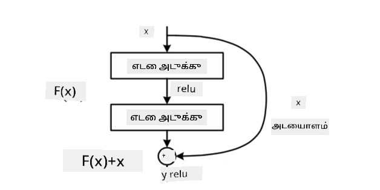
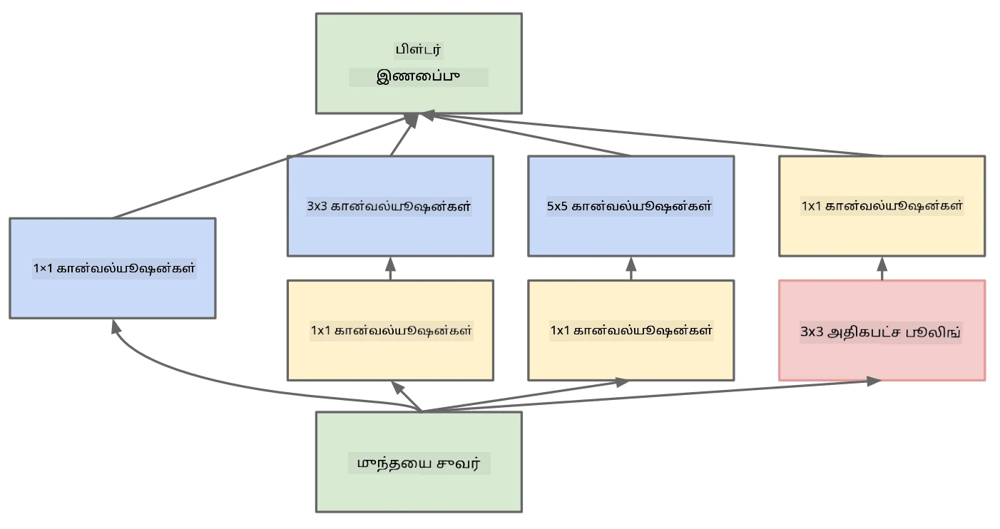

# பிரபலமான CNN கட்டமைப்புகள்

### VGG-16

VGG-16 என்பது 2014 ஆம் ஆண்டில் ImageNet top-5 வகைப்படுத்தலில் 92.7% துல்லியத்தை அடைந்த ஒரு நெட்வொர்க் ஆகும். இதன் அடுக்குகளின் அமைப்பு பின்வருமாறு உள்ளது:

நீங்கள் காணும் படி, VGG ஒரு பாரம்பரிய பyramிட் கட்டமைப்பை பின்பற்றுகிறது, இது கான்வல்யூஷன்-பூலிங் அடுக்குகளின் வரிசையாகும்.

> [Researchgate](https://www.researchgate.net/figure/Vgg16-model-structure-To-get-the-VGG-NIN-model-we-replace-the-2-nd-4-th-6-th-7-th_fig2_335194493) இல் இருந்து படம்

### ResNet

ResNet என்பது 2015 ஆம் ஆண்டில் Microsoft Research மூலம் முன்மொழியப்பட்ட மாடல்களின் குடும்பமாகும். ResNet இன் முக்கிய யோசனை **மீதமுள்ள பிளாக்குகளை** பயன்படுத்துவது:

> [இந்தக் கட்டுரையில்](https://arxiv.org/pdf/1512.03385.pdf) இருந்து படம்

Identity pass-through ஐ பயன்படுத்துவதற்கான காரணம், முந்தைய அடுக்கின் முடிவுக்கும் மீதமுள்ள பிளாக்கின் வெளியீட்டுக்கும் இடையிலான **வேறுபாட்டை** எங்கள் அடுக்கு கணிக்க அனுமதிக்க வேண்டும் - அதனால் *மீதமுள்ள* என்ற பெயர் வந்தது. இந்த பிளாக்குகளை பயிற்சி செய்ய மிகவும் எளிதாக இருக்கும், மேலும் பல நூற்றுக்கணக்கான பிளாக்குகளுடன் நெட்வொர்க்குகளை உருவாக்கலாம் (அதிகமாகப் பயன்படுத்தப்படும் மாறுபாடுகள் ResNet-52, ResNet-101 மற்றும் ResNet-152).

இந்த நெட்வொர்க்கை dataset இன் சிக்கல்களை சரிசெய்யும் திறன் கொண்டதாகவும் நீங்கள் கருதலாம். ஆரம்பத்தில், நெட்வொர்க்கை பயிற்சி செய்ய தொடங்கும்போது, எடை மதிப்புகள் சிறியதாக இருக்கும், மேலும் பெரும்பாலான சிக்னல் passthrough identity அடுக்குகள் வழியாக செல்கிறது. பயிற்சி முன்னேறும்போது எடைகள் அதிகமாகி, நெட்வொர்க்கின் அளவுருக்கள் முக்கியத்துவம் பெறுகிறது, மேலும் நெட்வொர்க்குகள் பயிற்சி படங்களின் சரியான வகைப்படுத்தலுக்கான தேவையான வெளிப்பாட்டுத் திறனை சரிசெய்யும்.

### Google Inception

Google Inception கட்டமைப்பு இந்த யோசனையை மேலும் ஒரு படி முன்னேற்றுகிறது, மேலும் ஒவ்வொரு நெட்வொர்க் அடுக்கையும் பல்வேறு பாதைகளின் கலவையாக உருவாக்குகிறது:

> [Researchgate](https://www.researchgate.net/figure/Inception-module-with-dimension-reductions-left-and-schema-for-Inception-ResNet-v1_fig2_355547454) இல் இருந்து படம்

இங்கு, 1x1 கான்வல்யூஷன்களின் பங்கு முக்கியத்துவம் பெறுகிறது, ஏனெனில் முதலில் அவை பொருத்தமாகத் தோன்றாது. 1x1 ஃபில்டரைப் பயன்படுத்தி படத்தை எதற்காகச் சுழற்சிக்க வேண்டும்? எனினும், கான்வல்யூஷன் ஃபில்டர்கள் பல ஆழக் சேனல்களுடன் வேலை செய்கின்றன (முதலில் - RGB நிறங்கள், பின்னர் - வெவ்வேறு ஃபில்டர்களுக்கான சேனல்கள்), மேலும் 1x1 கான்வல்யூஷன் இந்த உள்ளீட்டு சேனல்களை வெவ்வேறு பயிற்சி செய்யக்கூடிய எடைகளைப் பயன்படுத்தி ஒன்றாகக் கலக்க பயன்படுத்தப்படுகிறது. இது சேனல் பரிமாணத்தில் குறைக்க (pooling) பார்க்கப்படலாம்.

இதில் [ஒரு நல்ல வலைப்பதிவு](https://medium.com/analytics-vidhya/talented-mr-1x1-comprehensive-look-at-1x1-convolution-in-deep-learning-f6b355825578) மற்றும் [அசல் கட்டுரை](https://arxiv.org/pdf/1312.4400.pdf) உள்ளது.

### MobileNet

MobileNet என்பது குறைந்த அளவுடைய மாடல்களின் குடும்பமாகும், இது மொபைல் சாதனங்களுக்கு ஏற்றது. நீங்கள் வளங்கள் குறைவாக இருந்தால், மேலும் சிறிது துல்லியத்தை தியாகம் செய்ய தயாராக இருந்தால், அவற்றைப் பயன்படுத்தவும். இதன் முக்கிய யோசனை **depthwise separable convolution** ஆகும், இது கான்வல்யூஷன் ஃபில்டர்களை இடைவெளி கான்வல்யூஷன்கள் மற்றும் ஆழ சேனல்களில் 1x1 கான்வல்யூஷன் ஆகியவற்றின் கலவையாகக் குறிக்க அனுமதிக்கிறது. இது அளவுருக்களின் எண்ணிக்கையை குறிப்பிடத்தக்க அளவில் குறைக்கிறது, நெட்வொர்க்கை அளவில் சிறியதாகவும், குறைந்த தரவுடன் பயிற்சி செய்ய எளிதாகவும் ஆக்குகிறது.

இதில் [MobileNet பற்றிய ஒரு நல்ல வலைப்பதிவு](https://medium.com/analytics-vidhya/image-classification-with-mobilenet-cc6fbb2cd470) உள்ளது.

## முடிவு

இந்த அலகில், கணினி பார்வை நரம்பியல் நெட்வொர்க்குகளின் முக்கிய கருத்தை நீங்கள் கற்றுக்கொண்டீர்கள் - கான்வல்யூஷனல் நெட்வொர்க்குகள். பட வகைப்படுத்தல், பொருள் கண்டறிதல், மற்றும் பட உருவாக்க நெட்வொர்க்குகளை இயக்கும் உண்மையான வாழ்க்கை கட்டமைப்புகள் அனைத்தும் CNNக்களை அடிப்படையாகக் கொண்டவை, மேலும் சில கூடுதல் பயிற்சி யுக்திகளுடன்.

## 🚀 சவால்

இணைக்கப்பட்ட நோட்புக்குகளில், அதிக துல்லியத்தைப் பெறுவது எப்படி என்பதைப் பற்றிய குறிப்புகள் கீழே உள்ளன. அதிக துல்லியத்தை அடைய நீங்கள் சில பரிசோதனைகளைச் செய்யுங்கள்.

## [பாடத்திற்குப் பிந்தைய வினாடி வினா](https://ff-quizzes.netlify.app/en/ai/quiz/14)

## மதிப்பீடு & சுயபயிற்சி

CNNக்கள் பெரும்பாலும் கணினி பார்வை பணிகளுக்கு பயன்படுத்தப்படுகின்றன, அவை பொதுவாக நிலையான அளவுடைய முறைமைகளை எடுக்க சிறந்தவை. உதாரணமாக, நாம் ஒலிகளுடன் வேலை செய்கிறோம் என்றால், ஒலிச் சிக்னலில் சில குறிப்பிட்ட முறைமைகளைத் தேடவும் CNNக்களைப் பயன்படுத்த விரும்பலாம் - அந்தச் சூழலில் ஃபில்டர்கள் 1-பரிமாணமாக இருக்கும் (இந்த CNN 1D-CNN என்று அழைக்கப்படும்). மேலும், சில நேரங்களில் 3D-CNN பல பரிமாண இடத்தில் அம்சங்களை எடுக்க பயன்படுத்தப்படுகிறது, உதாரணமாக வீடியோவில் நிகழும் சில நிகழ்வுகள் - CNN நேரத்தின் போது அம்சங்கள் மாறும் சில முறைமைகளைப் பிடிக்க முடியும். CNNக்களால் செய்யக்கூடிய பிற பணிகளைப் பற்றி மதிப்பீடு மற்றும் சுயபயிற்சி செய்யுங்கள்.

## [பணி](lab/README.md)

இந்த ஆய்வகத்தில், நீங்கள் வெவ்வேறு பூனைகள் மற்றும் நாய் இனங்களை வகைப்படுத்த பணியமர்த்தப்படுகிறீர்கள். இந்த படங்கள் MNIST dataset ஐ விட சிக்கலானவை மற்றும் அதிக பரிமாணங்களைக் கொண்டவை, மேலும் 10 க்கும் மேற்பட்ட வகைகள் உள்ளன.

---

**அறிவிப்பு**:  
இந்த ஆவணம் [Co-op Translator](https://github.com/Azure/co-op-translator) என்ற AI மொழிபெயர்ப்பு சேவையை பயன்படுத்தி மொழிபெயர்க்கப்பட்டுள்ளது. நாங்கள் துல்லியத்திற்காக முயற்சிக்கிறோம், ஆனால் தானியங்கி மொழிபெயர்ப்புகளில் பிழைகள் அல்லது தவறுகள் இருக்கக்கூடும் என்பதை கவனத்தில் கொள்ளவும். அதன் சொந்த மொழியில் உள்ள மூல ஆவணம் அதிகாரப்பூர்வ ஆதாரமாக கருதப்பட வேண்டும். முக்கியமான தகவல்களுக்கு, தொழில்முறை மனித மொழிபெயர்ப்பு பரிந்துரைக்கப்படுகிறது. இந்த மொழிபெயர்ப்பைப் பயன்படுத்துவதால் ஏற்படும் எந்த தவறான புரிதல்களுக்கும் அல்லது தவறான விளக்கங்களுக்கும் நாங்கள் பொறுப்பல்ல.