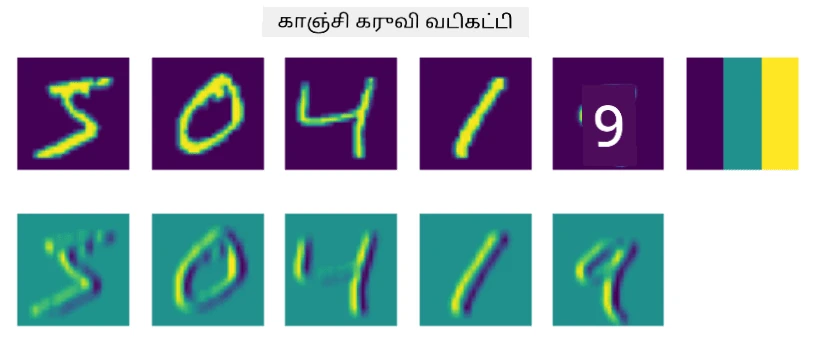
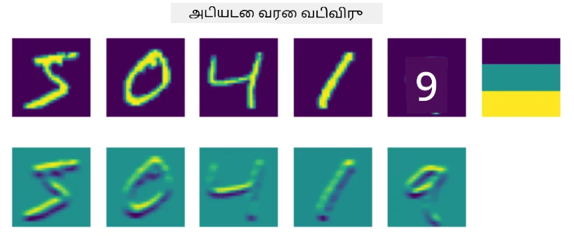
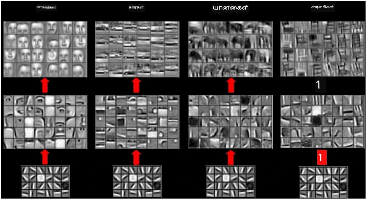
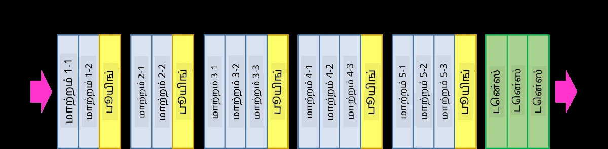
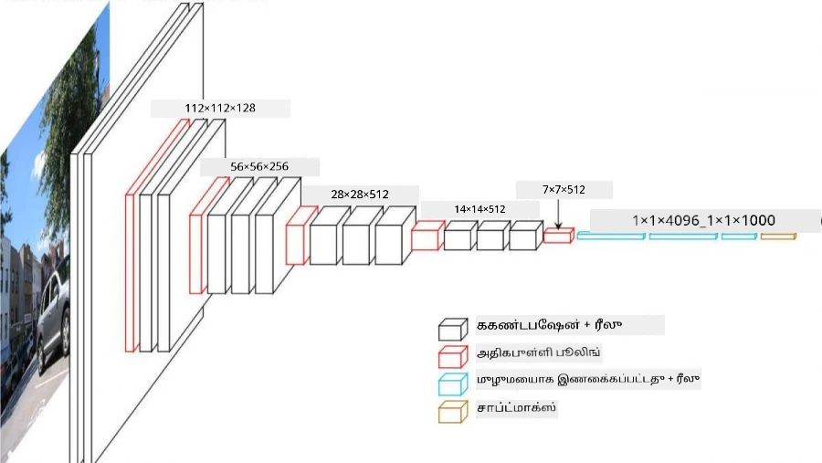

# கன்வல்யூஷனல் நியூரல் நெட்வொர்க்ஸ்

முந்தைய பாடங்களில் நியூரல் நெட்வொர்க்ஸ் படங்களை கையாளுவதில் மிகவும் திறமையானவை என்பதை பார்த்தோம். ஒரு லேயர் பர்செப்ட்ரான் கூட MNIST தரவுத்தொகுப்பில் உள்ள கை எழுதிய எண்களை நியாயமான துல்லியத்துடன் அடையாளம் காண முடியும். ஆனால், MNIST தரவுத்தொகுப்பு மிகவும் தனித்துவமானது, மேலும் அனைத்து எண்களும் படத்தின் மையத்தில் அமைந்துள்ளன, இது பணியை எளிதாக்குகிறது.

## [பாடத்திற்கு முன் வினாடி வினா](https://ff-quizzes.netlify.app/en/ai/quiz/13)

உண்மையான வாழ்க்கையில், படத்தில் உள்ள பொருட்களின் சரியான இடத்தைப் பொருட்படுத்தாமல் அவற்றை அடையாளம் காண முடியும் என்பதைக் காண விரும்புகிறோம். கணினி பார்வை பொதுவான வகைப்படுத்தலுக்கு மாறுபட்டது, ஏனெனில் ஒரு குறிப்பிட்ட பொருளை படத்தில் கண்டுபிடிக்க முயற்சிக்கும் போது, சில குறிப்பிட்ட **முறைகள்** மற்றும் அவற்றின் சேர்க்கைகளைத் தேடுவதற்காக படத்தை ஸ்கேன் செய்கிறோம். உதாரணமாக, ஒரு பூனைக்கான தேடலில், முதலில் நெடுவரை கோடுகளைத் தேடலாம், இது மீசை உருவாக்கலாம், பின்னர் மீசையின் ஒரு குறிப்பிட்ட சேர்க்கை உண்மையில் அது ஒரு பூனையின் படம் என்பதை எங்களுக்குத் தெரிவிக்கலாம். குறிப்பிட்ட முறைகளின் தொடர்புடைய நிலை மற்றும் இருப்பு முக்கியமானவை, ஆனால் அவற்றின் சரியான இடம் முக்கியமல்ல.

முறைகளை எடுக்க, **கன்வல்யூஷனல் ஃபில்டர்கள்** என்ற கருத்தை பயன்படுத்துவோம். நீங்கள் அறிந்தபடி, ஒரு படம் 2D-மாட்ரிக்ஸ் அல்லது நிற ஆழத்துடன் 3D-டென்சராக பிரதிநிதித்துவம் செய்யப்படுகிறது. ஒரு ஃபில்டரைப் பயன்படுத்துவது என்பது, சிறிய **ஃபில்டர் கர்னல்** மாட்ரிக்ஸை எடுத்து, மூலப்படத்தில் உள்ள ஒவ்வொரு பிக்சலுக்கும் அண்டை புள்ளிகளுடன் எடை செய்யப்பட்ட சராசரியை கணக்கிடுவதாகும். இதை ஒரு சிறிய சாளரம் முழு படத்திலும் நகர்ந்து, ஃபில்டர் கர்னல் மாட்ரிக்ஸில் உள்ள எடைகளுக்கு ஏற்ப அனைத்து பிக்சல்களையும் சராசரி செய்யும் முறையாகக் காணலாம்.

 | 
----|----

> படம்: டிமிட்ரி சோஷ்னிகோவ்

உதாரணமாக, MNIST எண்களுக்கு 3x3 நெடுவரை விளிம்பு மற்றும் கிடைமட்ட விளிம்பு ஃபில்டர்களை பயன்படுத்தினால், மூலப்படத்தில் உள்ள நெடுவரை மற்றும் கிடைமட்ட விளிம்புகள் உள்ள இடங்களில் முக்கியமான மதிப்புகளை (உதா. உயர் மதிப்புகள்) பெறலாம். எனவே, இந்த இரண்டு ஃபில்டர்களை விளிம்புகளை "தேட" பயன்படுத்தலாம். அதேபோல், பிற குறைந்த நிலை முறைகளைத் தேடுவதற்காக வெவ்வேறு ஃபில்டர்களை வடிவமைக்கலாம்:

> [லியூங்-மாலிக் ஃபில்டர் வங்கி](https://www.robots.ox.ac.uk/~vgg/research/texclass/filters.html) படத்தை

எனினும், சில முறைகளை கைமுறையாக எடுக்க ஃபில்டர்களை வடிவமைக்க முடியும், நெட்வொர்க்கை முறைகளை தானாக கற்றுக்கொள்ளும் வகையில் வடிவமைக்கவும் முடியும். இது CNN-இன் முக்கியமான கருத்துகளில் ஒன்றாகும்.

## CNN-இன் முக்கிய கருத்துகள்

CNN-கள் செயல்படும் முறை பின்வரும் முக்கிய கருத்துகளின் அடிப்படையில் அமைந்துள்ளது:

* கன்வல்யூஷனல் ஃபில்டர்கள் முறைகளை எடுக்க உதவுகின்றன
* ஃபில்டர்கள் தானாக பயிற்சி பெறும் வகையில் நெட்வொர்க்கை வடிவமைக்க முடியும்
* மூலப்படத்தில் மட்டுமல்லாமல், உயர் நிலை அம்சங்களில் முறைகளை கண்டுபிடிக்க இதே அணுகுமுறையைப் பயன்படுத்த முடியும். எனவே, CNN அம்ச எடுக்கும் செயல்பாடு குறைந்த நிலை பிக்சல் சேர்க்கைகளிலிருந்து தொடங்கி, படத்தின் பகுதிகளின் உயர் நிலை சேர்க்கை வரை அம்சங்களின் ஒரு அடுக்குக்கோபுரத்தில் செயல்படுகிறது.

> [ஹிஸ்லாப்-லின்ச்](https://www.semanticscholar.org/paper/Computer-vision-based-pedestrian-trajectory-Hislop-Lynch/26e6f74853fc9bbb7487b06dc2cf095d36c9021d) எழுதிய ஒரு ஆய்வுக் கட்டுரையிலிருந்து படம், [அவர்களின் ஆராய்ச்சி](https://dl.acm.org/doi/abs/10.1145/1553374.1553453) அடிப்படையில்

## ✍️ பயிற்சிகள்: கன்வல்யூஷனல் நியூரல் நெட்வொர்க்ஸ்

கன்வல்யூஷனல் நியூரல் நெட்வொர்க்ஸ் எப்படி செயல்படுகிறது, மற்றும் பயிற்சி பெறக்கூடிய ஃபில்டர்களை எவ்வாறு அடையலாம் என்பதைப் பற்றி மேலும் ஆராய்வோம், தொடர்புடைய நோட்புக்குகள் மூலம்:

* [கன்வல்யூஷனல் நியூரல் நெட்வொர்க்ஸ் - PyTorch](ConvNetsPyTorch.ipynb)
* [கன்வல்யூஷனல் நியூரல் நெட்வொர்க்ஸ் - TensorFlow](ConvNetsTF.ipynb)

## பyramிட் கட்டமைப்பு

படங்களை செயலாக்க பயன்படுத்தப்படும் பெரும்பாலான CNN-கள் பyramிட் கட்டமைப்பை பின்பற்றுகின்றன. மூலப்படங்களில் பயன்படுத்தப்படும் முதல் கன்வல்யூஷனல் லேயர் பொதுவாக குறைந்த எண்ணிக்கையிலான ஃபில்டர்களைக் கொண்டுள்ளது (8-16), இது கிடைமட்ட/நெடுவரை கோடுகள் போன்ற பிக்சல் சேர்க்கைகளுக்கு இணங்கும். அடுத்த நிலையில், நெட்வொர்க்கின் இடவசதி பரிமாணத்தை குறைத்து, ஃபில்டர்களின் எண்ணிக்கையை அதிகரிக்கிறோம், இது எளிய அம்சங்களின் கூடுதல் சேர்க்கைகளுக்கு இணங்கும். ஒவ்வொரு லேயரிலும், இறுதி வகைப்படுத்தலுக்கு நகரும் போது, படத்தின் இடவசதி பரிமாணங்கள் குறைகின்றன, மற்றும் ஃபில்டர்களின் எண்ணிக்கை அதிகரிக்கிறது.

உதாரணமாக, VGG-16 என்ற கட்டமைப்பின் கட்டமைப்பைப் பார்ப்போம், இது 2014 இல் ImageNet-இன் Top-5 வகைப்படுத்தலில் 92.7% துல்லியத்தை அடைந்தது:

> [ரிசர்ச்கேட்](https://www.researchgate.net/figure/Vgg16-model-structure-To-get-the-VGG-NIN-model-we-replace-the-2-nd-4-th-6-th-7-th_fig2_335194493) மூலம் படம்

## சிறந்த-அறியப்பட்ட CNN கட்டமைப்புகள்

[சிறந்த-அறியப்பட்ட CNN கட்டமைப்புகள் பற்றி உங்கள் படிப்பை தொடருங்கள்](CNN_Architectures.md)

---

**அறிவிப்பு**:  
இந்த ஆவணம் [Co-op Translator](https://github.com/Azure/co-op-translator) என்ற AI மொழிபெயர்ப்பு சேவையை பயன்படுத்தி மொழிபெயர்க்கப்பட்டுள்ளது. நாங்கள் துல்லியத்திற்காக முயற்சிக்கிறோம், ஆனால் தானியங்கி மொழிபெயர்ப்புகளில் பிழைகள் அல்லது தவறுகள் இருக்கக்கூடும் என்பதை கவனத்தில் கொள்ளவும். அதன் சொந்த மொழியில் உள்ள மூல ஆவணம் அதிகாரப்பூர்வ ஆதாரமாக கருதப்பட வேண்டும். முக்கியமான தகவல்களுக்கு, தொழில்முறை மனித மொழிபெயர்ப்பு பரிந்துரைக்கப்படுகிறது. இந்த மொழிபெயர்ப்பைப் பயன்படுத்துவதால் ஏற்படும் எந்த தவறான புரிதல்களுக்கும் அல்லது தவறான விளக்கங்களுக்கும் நாங்கள் பொறுப்பல்ல.