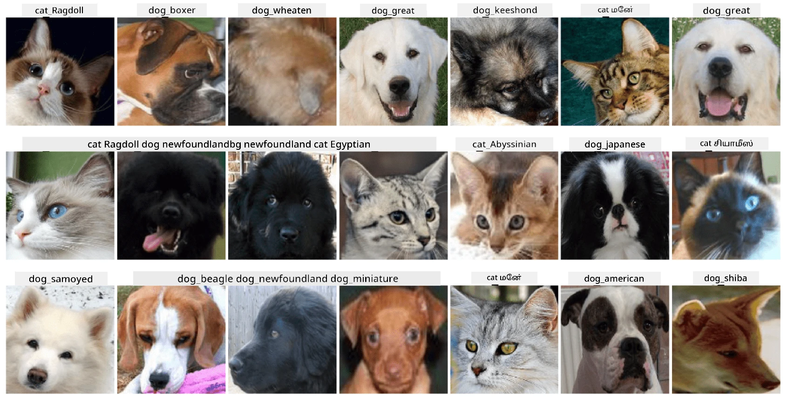

# செல்லப்பிராணிகளின் முகங்களை வகைப்படுத்துதல்

[AI for Beginners Curriculum](https://github.com/microsoft/ai-for-beginners) இலிருந்து ஆய்வகப் பணிக்கான ஒதுக்கீடு.

## பணிக்குறிப்பு

ஒரு செல்லப்பிராணி பராமரிப்பு மையத்திற்கான பயன்பாட்டை உருவாக்க வேண்டும் என்று கற்பனை செய்யுங்கள், இது அனைத்து செல்லப்பிராணிகளையும் பட்டியலிட உதவுகிறது. அத்தகைய பயன்பாட்டின் சிறந்த அம்சங்களில் ஒன்றாக புகைப்படத்திலிருந்து இனத்தை தானாகவே கண்டறிதல் இருக்கும். இது நரம்பியல் வலைகளைப் பயன்படுத்தி வெற்றிகரமாக செய்ய முடியும்.

**Pet Faces** தரவுத்தொகுப்பைப் பயன்படுத்தி, பூனைகள் மற்றும் நாய்களின் பல்வேறு இனங்களை வகைப்படுத்த ஒரு குவியல்முறை நரம்பியல் வலைகளைப் பயிற்றுவிக்க வேண்டும்.

## தரவுத்தொகுப்பு

37 வெவ்வேறு இனங்களுக்கான நாய்கள் மற்றும் பூனைகளின் படங்களை கொண்ட [Oxford-IIIT Pet Dataset](https://www.robots.ox.ac.uk/~vgg/data/pets/) ஐ நாம் பயன்படுத்துவோம்.



தரவுத்தொகுப்பைப் பதிவிறக்க, இந்தக் குறியீட்டு துண்டைப் பயன்படுத்தவும்:

```python
!wget https://thor.robots.ox.ac.uk/~vgg/data/pets/images.tar.gz
!tar xfz images.tar.gz
!rm images.tar.gz
```

**குறிப்பு:** Oxford-IIIT Pet Dataset படங்கள் கோப்பு பெயரால் ஒழுங்குபடுத்தப்பட்டுள்ளன (எ.கா., `Abyssinian_1.jpg`, `Bengal_2.jpg`). இந்த நோட்புக் இனங்களை வகைப்படுத்த எளிதாக இனத்திற்கேற்ப துணை அடைவுகளாக இந்த படங்களை ஒழுங்குபடுத்தும் குறியீட்டைக் கொண்டுள்ளது.

## ஆரம்ப நோட்புக்

ஆய்வகத்தை [PetFaces.ipynb](PetFaces.ipynb) திறந்து தொடங்குங்கள்.

## முக்கியப் புள்ளி

நீங்கள் அடிப்படையில் இருந்து பட வகைப்படுத்தல் என்ற சிக்கலான பிரச்சினையை தீர்த்துள்ளீர்கள்! வகுப்புகள் பல இருந்தாலும், நீங்கள் இன்னும் நியாயமான துல்லியத்தைப் பெற்றுள்ளீர்கள்! சில வகுப்புகள் மனிதர்களுக்கே தெளிவாக வேறுபடாத வகையில் குழப்பமடைவதால், top-k துல்லியத்தை அளவிடுவது பொருத்தமாக இருக்கும்.

---

**குறிப்பு**:  
இந்த ஆவணம் [Co-op Translator](https://github.com/Azure/co-op-translator) என்ற AI மொழிபெயர்ப்பு சேவையை பயன்படுத்தி மொழிபெயர்க்கப்பட்டுள்ளது. எங்கள் தரச்சிறப்பிற்காக முயற்சி செய்தாலும், தானியங்கி மொழிபெயர்ப்புகளில் பிழைகள் அல்லது தவறுகள் இருக்கக்கூடும் என்பதை தயவுசெய்து கவனத்தில் கொள்ளவும். அதன் தாய்மொழியில் உள்ள மூல ஆவணம் அதிகாரப்பூர்வ ஆதாரமாக கருதப்பட வேண்டும். முக்கியமான தகவல்களுக்கு, தொழில்முறை மனித மொழிபெயர்ப்பு பரிந்துரைக்கப்படுகிறது. இந்த மொழிபெயர்ப்பைப் பயன்படுத்துவதால் ஏற்படும் எந்த தவறான புரிதல்கள் அல்லது தவறான விளக்கங்களுக்கு நாங்கள் பொறுப்பல்ல.