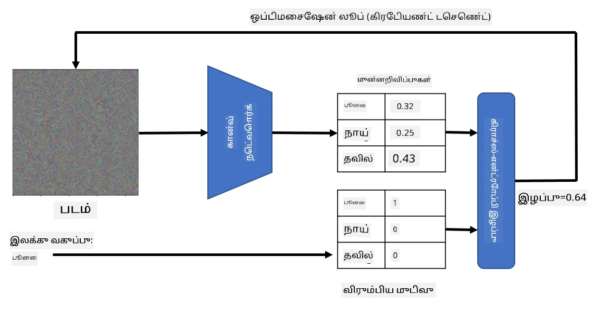

# முன்பே பயிற்சி பெற்ற நெட்வொர்க்குகள் மற்றும் மாற்றக் கற்றல்

CNNகளை பயிற்சி செய்வது மிகவும் நேரம் எடுத்துக்கொள்ளக்கூடியது, மேலும் அதற்கான பணிக்குத் தேவையான தரவுகள் அதிகமாகவே இருக்க வேண்டும். ஆனால், பெரும்பாலான நேரம், ஒரு நெட்வொர்க்கு படங்களிலிருந்து வடிவங்களை எடுக்க சிறந்த தாழ்நிலை வடிகட்டிகளை கற்றுக்கொள்வதில் செலவிடப்படுகிறது. ஒரு இயற்கையான கேள்வி எழுகிறது - ஒரு தரவுத்தொகுப்பில் பயிற்சி பெற்ற நரம்பியல் நெட்வொர்க்கை பயன்படுத்தி, முழுமையான பயிற்சி செயல்முறையைத் தேவையில்லாமல் வேறு படங்களை வகைப்படுத்த மாற்றமுடியுமா?

## [முன்-வகுப்பு வினாடி வினா](https://ff-quizzes.netlify.app/en/ai/quiz/15)

இந்த அணுகுமுறை **மாற்றக் கற்றல்** என்று அழைக்கப்படுகிறது, ஏனெனில் நாம் ஒரு நரம்பியல் நெட்வொர்க்கு மாதிரியில் இருந்து மற்றொன்றுக்கு சில அறிவை மாற்றுகிறோம். மாற்றக் கற்றலில், நாம் பொதுவாக ஒரு பெரிய படத் தரவுத்தொகுப்பில், உதாரணமாக **ImageNet** போன்றவற்றில் பயிற்சி பெற்ற ஒரு முன்பே பயிற்சி பெற்ற மாதிரியைத் தொடங்குகிறோம். இந்த மாதிரிகள் பொதுவான படங்களில் இருந்து பல்வேறு அம்சங்களை எடுக்க ஏற்கனவே நல்ல வேலை செய்ய முடியும், மேலும் பல சந்தர்ப்பங்களில், அந்த எடுக்கப்பட்ட அம்சங்களின் மேல் ஒரு வகைப்படுத்தியை உருவாக்குவது நல்ல முடிவைத் தரலாம்.

> ✅ மாற்றக் கற்றல் என்பது கல்வி போன்ற பிற கல்வி துறைகளிலும் காணப்படும் ஒரு சொல். இது ஒரு துறையில் உள்ள அறிவை எடுத்து மற்றொன்றில் பயன்படுத்தும் செயல்முறையை குறிக்கிறது.

## முன்பே பயிற்சி பெற்ற மாதிரிகள் அம்சங்களை எடுப்பதற்கான கருவிகளாக

முந்தைய பிரிவில் நாம் பேசிய கான்வல்யூஷனல் நெட்வொர்க்குகள் பல அடுக்குகளை கொண்டிருந்தன, ஒவ்வொன்றும் படத்திலிருந்து சில அம்சங்களை எடுக்க வேண்டும், தாழ்நிலை பிக்சல் சேர்க்கைகள் (கிடைமட்ட/செங்குத்து கோடு அல்லது கோடு போன்றவை) முதல், உயர் நிலை அம்சங்களின் சேர்க்கைகள் வரை, ஒரு தீயின் கண் போன்றவற்றுக்கு இணையானவை. பொதுவான மற்றும் பல்வகை படங்களின் போதுமான பெரிய தரவுத்தொகுப்பில் CNNகளை பயிற்சி செய்தால், நெட்வொர்க்கு அந்த பொதுவான அம்சங்களை எடுக்க கற்றுக்கொள்ள வேண்டும்.

Keras மற்றும் PyTorch இரண்டிலும் பொதுவான கட்டமைப்புகளுக்கான முன்பே பயிற்சி பெற்ற நரம்பியல் நெட்வொர்க்கின் எடைகளை எளிதாக ஏற்றுவதற்கான செயல்பாடுகள் உள்ளன, அவற்றில் பெரும்பாலானவை ImageNet படங்களில் பயிற்சி செய்யப்பட்டவை. [CNN கட்டமைப்புகள்](../07-ConvNets/CNN_Architectures.md) பக்கம் முந்தைய பாடத்தில் விவரிக்கப்பட்டவை. குறிப்பாக, நீங்கள் பின்வரும் ஒன்றை பயன்படுத்த பரிந்துரைக்கலாம்:

* **VGG-16/VGG-19** என்பது ஒப்பீட்டளவில் எளிய மாதிரிகள், ஆனால் நல்ல துல்லியத்தை வழங்குகின்றன. மாற்றக் கற்றல் எப்படி வேலை செய்கிறது என்பதைப் பார்க்க VGGயை முதலில் முயற்சியாக பயன்படுத்துவது நல்ல தேர்வாக இருக்கலாம்.
* **ResNet** என்பது Microsoft Research 2015ல் முன்மொழியப்பட்ட மாதிரிகளின் குடும்பம். இவை அதிக அடுக்குகளை கொண்டுள்ளன, எனவே அதிக வளங்களை தேவைப்படும்.
* **MobileNet** என்பது குறைந்த அளவுடைய, மொபைல் சாதனங்களுக்கு ஏற்ற மாதிரிகளின் குடும்பம். வளங்கள் குறைவாக இருந்தால், மற்றும் சிறிது துல்லியத்தை இழக்கத் தயாராக இருந்தால், இவற்றைப் பயன்படுத்தவும்.

இங்கே VGG-16 நெட்வொர்க்கால் ஒரு பூனையின் படத்திலிருந்து எடுக்கப்பட்ட மாதிரி அம்சங்கள் உள்ளன:

## பூனைகள் vs. நாய்கள் தரவுத்தொகுப்பு

இந்த உதாரணத்தில், [பூனைகள் மற்றும் நாய்கள்](https://www.microsoft.com/download/details.aspx?id=54765&WT.mc_id=academic-77998-cacaste) என்ற ஒரு தரவுத்தொகுப்பைப் பயன்படுத்துவோம், இது உண்மையான வாழ்க்கை பட வகைப்படுத்தல் சூழலுக்கு மிகவும் அருகிலுள்ளது.

## ✍️ பயிற்சி: மாற்றக் கற்றல்

மாற்றக் கற்றலைச் செயல்படுத்துவதைக் கீழே உள்ள நோட்புக்குகளில் பார்ப்போம்:

* [மாற்றக் கற்றல் - PyTorch](TransferLearningPyTorch.ipynb)
* [மாற்றக் கற்றல் - TensorFlow](TransferLearningTF.ipynb)

## எதிர்மறை பூனை காட்சிப்படுத்தல்

முன்பே பயிற்சி பெற்ற நரம்பியல் நெட்வொர்க்கு அதன் *மூளை* உள்ளே பல்வேறு வடிவங்களை கொண்டுள்ளது, அதில் **சிறந்த பூனை** (மேலும் சிறந்த நாய், சிறந்த ஜெப்ரா, போன்றவை) பற்றிய கருத்துகள் அடங்கும். இந்த படத்தை எப்படியாவது **காட்சிப்படுத்துவது** 흥미கரமாக இருக்கும். ஆனால், இது எளிதானது அல்ல, ஏனெனில் வடிவங்கள் நெட்வொர்க்கின் எடைகளில் பரவியுள்ளன, மேலும் ஒரு அடுக்கமைப்பு அமைப்பில் ஒழுங்குபடுத்தப்பட்டுள்ளன.

ஒரு அணுகுமுறை என்னவென்றால், ஒரு சீரற்ற படத்துடன் தொடங்குவது, பின்னர் **கிரேடியண்ட் டிசென்ட் ஆப்டிமைசேஷன்** தொழில்நுட்பத்தைப் பயன்படுத்தி அந்த படத்தை சரிசெய்வது, அதனால் நெட்வொர்க்கு அதை பூனையாக நினைக்கத் தொடங்குகிறது.

ஆனால், இதைச் செய்தால், சீரற்ற சத்தத்துடன் மிகவும் ஒத்ததாக ஏதாவது கிடைக்கும். இது *நெட்வொர்க்கு உள்ளீடு ஒரு பூனை என்று நினைக்க பல வழிகள் உள்ளன*, அதில் சில காட்சியளிப்பதில் அர்த்தமற்றவை. அந்த படங்கள் பூனைக்கு பொதுவான பல வடிவங்களை கொண்டிருந்தாலும், அவற்றை காட்சிப்படுத்துவதற்குத் தனித்துவமாக இருக்க வேண்டும் என்று கட்டாயப்படுத்த எதுவும் இல்லை.

முடிவை மேம்படுத்த, **variation loss** என்று அழைக்கப்படும் மற்றொரு சொற்றொடரை இழப்புச் செயல்பாட்டில் சேர்க்கலாம். இது படத்தின் அடுத்தடுத்த பிக்சல்கள் எவ்வளவு ஒத்திருக்கின்றன என்பதை காட்டும் அளவீடு. variation loss ஐ குறைப்பது படத்தை மென்மையாக ஆக்குகிறது, மேலும் சத்தத்தை அகற்றுகிறது - இதனால் காட்சிப்படுத்துவதற்கு அழகான வடிவங்களை வெளிப்படுத்துகிறது. இங்கே பூனை மற்றும் ஜெப்ரா என்று அதிக சாத்தியத்துடன் வகைப்படுத்தப்படும் "சிறந்த" படங்களின் உதாரணம் உள்ளது:

 | 
-----|-----
 *சிறந்த பூனை* | *சிறந்த ஜெப்ரா*

இதே அணுகுமுறையை **எதிர்மறை தாக்குதல்** என்று அழைக்கப்படும் செயல்பாட்டை செய்ய பயன்படுத்தலாம். ஒரு நரம்பியல் நெட்வொர்க்கை ஏமாற்றி, ஒரு நாயை பூனையாக மாற்ற விரும்புகிறோம் என்று நினைத்தால், நாயின் படத்தை எடுத்து, அது நெட்வொர்க்கால் நாய் என்று அடையாளம் காணப்படுகிறது, பின்னர் அதை சிறிது மாற்றி, நெட்வொர்க்கு அதை பூனையாக வகைப்படுத்தும் வரை கிரேடியண்ட் டிசென்ட் ஆப்டிமைசேஷனைப் பயன்படுத்தலாம்:

 | 
-----|-----
*மூல நாயின் படம்* | *பூனையாக வகைப்படுத்தப்படும் நாயின் படம்*

மேலே உள்ள முடிவுகளை மீண்டும் உருவாக்க குறியீட்டை கீழே உள்ள நோட்புக்கில் காணலாம்:

* [சிறந்த மற்றும் எதிர்மறை பூனை - TensorFlow](AdversarialCat_TF.ipynb)

## முடிவு

மாற்றக் கற்றலைப் பயன்படுத்தி, தனிப்பயன் பொருள் வகைப்படுத்தல் பணிக்கான வகைப்படுத்தியை விரைவாக உருவாக்கி, அதிக துல்லியத்தை அடைய முடியும். நாம் தற்போது தீர்க்கும் சிக்கல்கள் அதிக கணினி சக்தியை தேவைப்படுத்துகின்றன, மேலும் CPUவில் எளிதாக தீர்க்க முடியாது. அடுத்த பிரிவில், குறைந்த கணினி வளங்களைப் பயன்படுத்தி அதே மாதிரியைப் பயிற்சி செய்ய ஒரு எளிய செயல்முறையை முயற்சிப்போம், இது சிறிது குறைந்த துல்லியத்தைத் தருகிறது.

## 🚀 சவால்

இணைக்கப்பட்ட நோட்புக்குகளில், மாற்ற அறிவு ஒரே மாதிரியான பயிற்சி தரவுடன் சிறப்பாக வேலை செய்கிறது (ஒரு புதிய வகை விலங்கு, உதாரணமாக) என்று கீழே குறிப்புகள் உள்ளன. முற்றிலும் புதிய வகை படங்களுடன் சில பரிசோதனைகளைச் செய்யுங்கள், உங்கள் மாற்ற அறிவு மாதிரிகள் எவ்வளவு நன்றாக அல்லது மோசமாக செயல்படுகின்றன என்பதைப் பாருங்கள்.

## [பாடத்திற்குப் பின் வினாடி வினா](https://ff-quizzes.netlify.app/en/ai/quiz/16)

## மதிப்பீடு & சுய கற்றல்

[TrainingTricks.md](TrainingTricks.md) ஐப் படித்து, உங்கள் மாதிரிகளைப் பயிற்சி செய்ய பிற வழிகளைப் பற்றிய அறிவை ஆழமாக்குங்கள்.

## [பணி](lab/README.md)

இந்த ஆய்வகத்தில், 35 வகை பூனைகள் மற்றும் நாய்கள் கொண்ட உண்மையான வாழ்க்கை [Oxford-IIIT](https://www.robots.ox.ac.uk/~vgg/data/pets/) செல்லப்பிராணி தரவுத்தொகுப்பைப் பயன்படுத்தி, மாற்றக் கற்றல் வகைப்படுத்தியை உருவாக்குவோம்.

---

**குறிப்பு**:  
இந்த ஆவணம் [Co-op Translator](https://github.com/Azure/co-op-translator) என்ற AI மொழிபெயர்ப்பு சேவையை பயன்படுத்தி மொழிபெயர்க்கப்பட்டுள்ளது. நாங்கள் துல்லியத்திற்காக முயற்சிக்கிறோம், ஆனால் தானியக்க மொழிபெயர்ப்புகளில் பிழைகள் அல்லது தவறான தகவல்கள் இருக்கக்கூடும் என்பதை கவனத்தில் கொள்ளவும். அதன் தாய்மொழியில் உள்ள மூல ஆவணம் அதிகாரப்பூர்வ ஆதாரமாக கருதப்பட வேண்டும். முக்கியமான தகவல்களுக்கு, தொழில்முறை மனித மொழிபெயர்ப்பு பரிந்துரைக்கப்படுகிறது. இந்த மொழிபெயர்ப்பைப் பயன்படுத்துவதால் ஏற்படும் எந்த தவறான புரிதல்கள் அல்லது தவறான விளக்கங்களுக்கு நாங்கள் பொறுப்பல்ல.