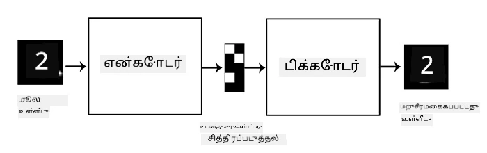
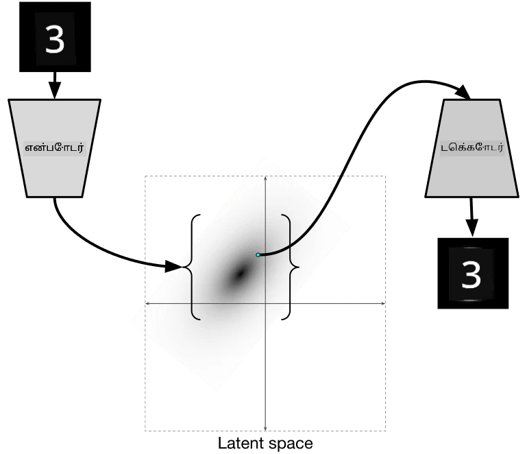

# ஆட்டோஎன்கோடர்கள்

CNNகளை பயிற்சி செய்யும்போது, ஒரு முக்கியமான சிக்கல் என்னவென்றால், நமக்கு அதிக அளவில் லேபிள் செய்யப்பட்ட தரவுகள் தேவைப்படும். படங்களை வகைப்படுத்தும் போது, படங்களை வெவ்வேறு வகைகளாக பிரிக்க வேண்டும், இது கையேடு மூலம் செய்யப்படும் முயற்சியாகும்.

## [முன்-வகுப்பு வினாடி வினா](https://ff-quizzes.netlify.app/en/ai/quiz/17)

ஆனால், நாங்கள் CNN அம்சங்களை எடுக்க பயிற்சி செய்ய **சுய-மேற்பார்வை கற்றல்** எனப்படும் முறையில், லேபிள் செய்யப்படாத (raw) தரவுகளை பயன்படுத்த விரும்பலாம். லேபிள்களின் பதிலாக, பயிற்சி படங்களை நெட்வொர்க் உள்ளீடு மற்றும் வெளியீடாக பயன்படுத்துவோம். **ஆட்டோஎன்கோடர்** என்ற முக்கிய கருத்து என்னவென்றால், **என்கோடர் நெட்வொர்க்** மூலம் உள்ளீட்டு படத்தை **latent space** எனப்படும் ஒரு சிறிய அளவுடைய வெக்டராக மாற்றி, பின்னர் **டிகோடர் நெட்வொர்க்** மூலம் அசல் படத்தை மீண்டும் உருவாக்குவோம்.

> ✅ ஒரு [ஆட்டோஎன்கோடர்](https://wikipedia.org/wiki/Autoencoder) என்பது "லேபிள் செய்யப்படாத தரவுகளின் திறமையான குறியீடுகளை கற்றுக்கொள்வதற்கான ஒரு வகை செயற்கை நரம்பியல் நெட்வொர்க்."

ஆட்டோஎன்கோடரை அசல் படத்தின் தகவல்களை சரியாக மீண்டும் உருவாக்குவதற்காக அதிகமாக பிடிக்க பயிற்சி செய்யும் போது, நெட்வொர்க் சிறந்த **embedding** ஐ கண்டறிந்து, உள்ளீட்டு படங்களின் அர்த்தத்தை பிடிக்க முயற்சிக்கிறது.

> படம் [Keras வலைப்பதிவு](https://blog.keras.io/building-autoencoders-in-keras.html) மூலம்

## ஆட்டோஎன்கோடர்களை பயன்படுத்தும் சூழல்கள்

அசல் படங்களை மீண்டும் உருவாக்குவது தனிப்பட்ட முறையில் பயனுள்ளதாக தெரியவில்லை என்றாலும், ஆட்டோஎன்கோடர்கள் குறிப்பாக பயனுள்ளதாக இருக்கும் சில சூழல்கள் உள்ளன:

* **படங்களின் பரிமாணத்தை குறைத்து காட்சிப்படுத்துதல்** அல்லது **பட எம்பெடிங்குகளை பயிற்சி செய்தல்**. பொதுவாக, ஆட்டோஎன்கோடர்கள் PCA-யை விட சிறந்த முடிவுகளை வழங்குகின்றன, ஏனெனில் இது படங்களின் இடவியல் தன்மையையும், அடுக்குமுறை அம்சங்களையும் கணக்கில் எடுத்துக்கொள்கிறது.
* **இரைச்சலை நீக்குதல்**, அதாவது படத்தில் இருந்து இரைச்சலை அகற்றுதல். இரைச்சல் அதிக அளவில் தேவையற்ற தகவல்களை கொண்டிருப்பதால், ஆட்டோஎன்கோடர் அதை சிறிய latent space-ல் அடக்க முடியாது, எனவே இது படத்தின் முக்கியமான பகுதியை மட்டுமே பிடிக்கிறது. இரைச்சலை அகற்றும் நெட்வொர்க்குகளை பயிற்சி செய்யும்போது, அசல் படங்களுடன் தொடங்குகிறோம், மற்றும் செயற்கையாக சேர்க்கப்பட்ட இரைச்சலுடன் உள்ள படங்களை ஆட்டோஎன்கோடரின் உள்ளீடாக பயன்படுத்துகிறோம்.
* **சூப்பர்-ரெசல்யூஷன்**, படத்தின் தீர்மானத்தை அதிகரித்தல். நாங்கள் உயர் தீர்மான படங்களுடன் தொடங்குகிறோம், மற்றும் குறைந்த தீர்மானத்துடன் உள்ள படத்தை ஆட்டோஎன்கோடரின் உள்ளீடாக பயன்படுத்துகிறோம்.
* **ஜெனரேட்டிவ் மாடல்கள்**. ஆட்டோஎன்கோடரை பயிற்சி செய்த பிறகு, டிகோடர் பகுதியை பயன்படுத்தி, சீரற்ற latent வெக்டர்களைத் தொடங்கி புதிய பொருட்களை உருவாக்கலாம்.

## வேறுபாட்டு ஆட்டோஎன்கோடர்கள் (VAE)

சாதாரண ஆட்டோஎன்கோடர்கள் உள்ளீட்டு தரவின் பரிமாணத்தை குறைத்து, உள்ளீட்டு படங்களின் முக்கிய அம்சங்களை கண்டறிகின்றன. ஆனால், latent வெக்டர்கள் பெரும்பாலும் அர்த்தமற்றதாக இருக்கும். மற்றொரு வார்த்தையில், MNIST தரவுத்தொகுப்பை எடுத்துக்கொண்டால், வெவ்வேறு latent வெக்டர்களுக்கு எந்த எண்கள் பொருந்துகின்றன என்பதை கண்டறிவது எளிதான வேலை அல்ல, ஏனெனில் அருகிலுள்ள latent வெக்டர்கள் அவசியமாக ஒரே எண்களுக்கு பொருந்தாது.

மற்றொரு பக்கம், *ஜெனரேட்டிவ்* மாடல்களை பயிற்சி செய்ய, latent space பற்றிய சில புரிதலைக் கொண்டிருப்பது சிறந்தது. இந்த கருத்து **வேறுபாட்டு ஆட்டோஎன்கோடர்** (VAE) நோக்கத்தை நோக்குகிறது.

VAE என்பது latent அளவுருக்களின் *புள்ளியியல் விநியோகத்தை* (latent distribution) கணிக்க கற்றுக்கொள்கிறது. உதாரணமாக, latent வெக்டர்கள் zmean மற்றும் zsigma (இரண்டும் d பரிமாணத்துடன் கூடிய வெக்டர்கள்) ஆகியவற்றுடன் சாதாரணமாக விநியோகிக்கப்பட வேண்டும். VAE இல் என்கோடர் இந்த அளவுருக்களை கணிக்க கற்றுக்கொள்கிறது, பின்னர் டிகோடர் இந்த விநியோகத்திலிருந்து சீரற்ற வெக்டரை எடுத்து பொருளை மீண்டும் உருவாக்குகிறது.

சுருக்கமாக:

 * உள்ளீட்டு வெக்டரிலிருந்து, `z_mean` மற்றும் `z_log_sigma` ஐ கணிக்கிறோம் (சாதாரண devation ஐ நேரடியாக கணிக்காமல், அதன் லோகாரிதத்தை கணிக்கிறோம்)
 * N(zmean,exp(zlog\_sigma)) விநியோகத்திலிருந்து `sample` வெக்டரை எடுக்கிறோம்
 * டிகோடர் `sample` ஐ உள்ளீட்டு வெக்டராக பயன்படுத்தி அசல் படத்தை டிகோடு செய்ய முயற்சிக்கிறது

 

> படம் [இந்த வலைப்பதிவு](https://ijdykeman.github.io/ml/2016/12/21/cvae.html) மூலம் Isaak Dykeman

வேறுபாட்டு ஆட்டோஎன்கோடர்கள் இரண்டு பகுதிகளைக் கொண்ட ஒரு சிக்கலான இழப்பீட்டு செயல்பாட்டைப் பயன்படுத்துகின்றன:

* **மீளமைப்பு இழப்பு** என்பது மீண்டும் உருவாக்கப்பட்ட படம் இலக்கிற்கு எவ்வளவு அருகில் உள்ளது என்பதை காட்டும் இழப்பீட்டு செயல்பாடு (Mean Squared Error அல்லது MSE ஆக இருக்கலாம்). இது சாதாரண ஆட்டோஎன்கோடர்களில் உள்ள இழப்பீட்டு செயல்பாட்டைப் போன்றதே.
* **KL இழப்பு**, இது latent மாறிலி விநியோகங்கள் சாதாரண விநியோகத்திற்கு அருகில் இருக்க வேண்டும் என்பதை உறுதிப்படுத்துகிறது. இது [Kullback-Leibler divergence](https://www.countbayesie.com/blog/2017/5/9/kullback-leibler-divergence-explained) என்ற கருத்தின் அடிப்படையில் உள்ளது - இரண்டு புள்ளியியல் விநியோகங்கள் எவ்வளவு ஒத்ததாக உள்ளன என்பதை மதிப்பீடு செய்ய ஒரு அளவுகோல்.

VAEs இன் ஒரு முக்கியமான நன்மை என்னவென்றால், புதிய படங்களை எளிதாக உருவாக்க முடியும், ஏனெனில் latent வெக்டர்களை எடுக்க வேண்டிய விநியோகத்தை நாங்கள் அறிந்திருக்கிறோம். உதாரணமாக, 2D latent வெக்டருடன் MNIST-ல் VAE ஐ பயிற்சி செய்தால், latent வெக்டரின் கூறுகளை மாறி வெவ்வேறு எண்களை பெறலாம்:

> படம் [Dmitry Soshnikov](http://soshnikov.com) மூலம்

latent அளவுரு இடத்தின் வெவ்வேறு பகுதிகளில் இருந்து latent வெக்டர்களை எடுக்க தொடங்கும்போது, படங்கள் ஒருவருக்கொருவர் கலக்க ஆரம்பிக்கின்றன என்பதை கவனிக்கவும். இந்த இடத்தை 2D-ல் காட்சிப்படுத்தவும் முடியும்:

 

> படம் [Dmitry Soshnikov](http://soshnikov.com) மூலம்

## ✍️ பயிற்சிகள்: ஆட்டோஎன்கோடர்கள்

இந்த தொடர்புடைய நோட்புக்குகளில் ஆட்டோஎன்கோடர்களைப் பற்றி மேலும் அறிக:

* [TensorFlow-ல் ஆட்டோஎன்கோடர்கள்](AutoencodersTF.ipynb)
* [PyTorch-ல் ஆட்டோஎன்கோடர்கள்](AutoEncodersPyTorch.ipynb)

## ஆட்டோஎன்கோடர்களின் பண்புகள்

* **தரவுக்கேற்ப** - அவை பயிற்சி செய்யப்பட்ட பட வகைகளுடன் மட்டுமே நன்றாக வேலை செய்யும். உதாரணமாக, பூக்களுக்கான சூப்பர்-ரெசல்யூஷன் நெட்வொர்க் உருவாக்கினால், அது உருவப்படங்களில் நன்றாக வேலை செய்யாது. இது நெட்வொர்க் பயிற்சி தரவுத்தொகுப்பில் கற்றுக்கொண்ட அம்சங்களிலிருந்து நுண்ணிய விவரங்களை எடுத்து உயர் தீர்மான படத்தை உருவாக்க முடியும் என்பதற்காக.
* **இழப்பானது** - மீண்டும் உருவாக்கப்பட்ட படம் அசல் படத்துடன் ஒரே மாதிரியானது அல்ல. இழப்பின் தன்மை பயிற்சியின் போது பயன்படுத்தப்படும் *இழப்பீட்டு செயல்பாடு* மூலம் வரையறுக்கப்படுகிறது.
* **லேபிள் செய்யப்படாத தரவுகளில்** வேலை செய்கிறது

## [பிந்தைய-வகுப்பு வினாடி வினா](https://ff-quizzes.netlify.app/en/ai/quiz/18)

## முடிவு

இந்த பாடத்தில், AI விஞ்ஞானி பயன்படுத்தக்கூடிய பல வகையான ஆட்டோஎன்கோடர்களைப் பற்றி நீங்கள் கற்றுக்கொண்டீர்கள். அவற்றை எப்படி உருவாக்குவது, மற்றும் படங்களை மீண்டும் உருவாக்க அவற்றைப் பயன்படுத்துவது எப்படி என்பதை நீங்கள் கற்றுக்கொண்டீர்கள். மேலும், VAE பற்றி மற்றும் புதிய படங்களை உருவாக்க அதை எப்படி பயன்படுத்துவது என்பதை நீங்கள் கற்றுக்கொண்டீர்கள்.

## 🚀 சவால்

இந்த பாடத்தில், நீங்கள் படங்களுக்கான ஆட்டோஎன்கோடர்களைப் பயன்படுத்துவது பற்றி கற்றீர்கள். ஆனால் அவை இசைக்காகவும் பயன்படுத்தப்படலாம்! Magenta திட்டத்தின் [MusicVAE](https://magenta.tensorflow.org/music-vae) திட்டத்தை பாருங்கள், இது இசையை மீண்டும் உருவாக்க கற்றுக்கொள்வதற்கான ஆட்டோஎன்கோடர்களைப் பயன்படுத்துகிறது. இந்த நூலகத்துடன் சில [சோதனைகள்](https://colab.research.google.com/github/magenta/magenta-demos/blob/master/colab-notebooks/Multitrack_MusicVAE.ipynb) செய்யுங்கள், நீங்கள் என்ன உருவாக்க முடியும் என்பதை பாருங்கள்.

## [பிந்தைய-வகுப்பு வினாடி வினா](https://ff-quizzes.netlify.app/en/ai/quiz/16)

## மதிப்பீடு & சுயபயிற்சி

ஆட்டோஎன்கோடர்களைப் பற்றி மேலும் அறிய, இந்த வளங்களைப் படிக்கவும்:

* [Keras-ல் ஆட்டோஎன்கோடர்கள் உருவாக்குதல்](https://blog.keras.io/building-autoencoders-in-keras.html)
* [NeuroHive வலைப்பதிவு](https://neurohive.io/ru/osnovy-data-science/variacionnyj-avtojenkoder-vae/)
* [Variational Autoencoders Explained](https://kvfrans.com/variational-autoencoders-explained/)
* [Conditional Variational Autoencoders](https://ijdykeman.github.io/ml/2016/12/21/cvae.html)

## பணிக்கட்டளை

[இந்த TensorFlow நோட்புக்கின்](AutoencodersTF.ipynb) இறுதியில் ஒரு 'task' உள்ளது - இதை உங்கள் பணிக்கட்டளையாக பயன்படுத்துங்கள்.

---

**குறிப்பு**:  
இந்த ஆவணம் [Co-op Translator](https://github.com/Azure/co-op-translator) என்ற AI மொழிபெயர்ப்பு சேவையைப் பயன்படுத்தி மொழிபெயர்க்கப்பட்டுள்ளது. நாங்கள் துல்லியத்திற்காக முயற்சிக்கின்றோம், ஆனால் தானியக்க மொழிபெயர்ப்புகளில் பிழைகள் அல்லது தவறுகள் இருக்கக்கூடும் என்பதை தயவுசெய்து கவனத்தில் கொள்ளுங்கள். அதன் தாய்மொழியில் உள்ள மூல ஆவணம் அதிகாரப்பூர்வ ஆதாரமாக கருதப்பட வேண்டும். முக்கியமான தகவல்களுக்கு, தொழில்முறை மனித மொழிபெயர்ப்பு பரிந்துரைக்கப்படுகிறது. இந்த மொழிபெயர்ப்பைப் பயன்படுத்துவதால் ஏற்படும் எந்த தவறான புரிதல்கள் அல்லது தவறான விளக்கங்களுக்கு நாங்கள் பொறுப்பல்ல.