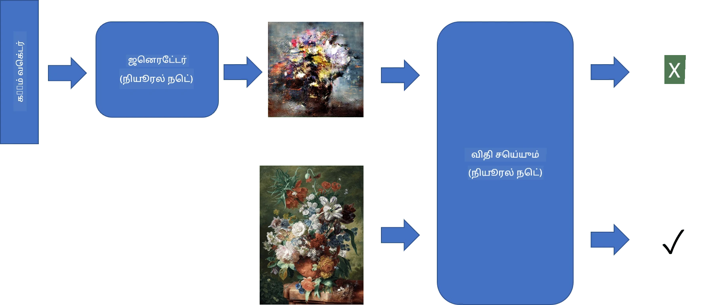
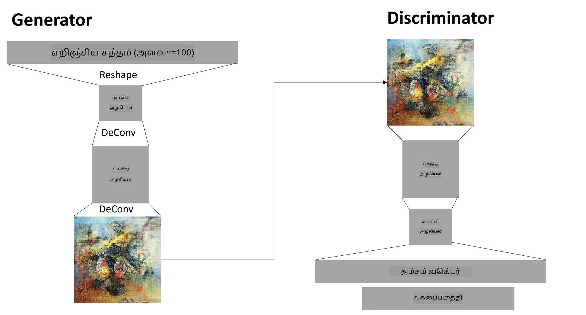

# ஜெனரேட்டிவ் அட்வர்சேரியல் நெட்வொர்க்ஸ்

முந்தைய பிரிவில், **ஜெனரேட்டிவ் மாடல்கள்** பற்றி கற்றுக்கொண்டோம்: பயிற்சி தரவுத்தொகுப்பில் உள்ள படங்களுக்குச் சமமான புதிய படங்களை உருவாக்கும் மாடல்கள். VAE ஒரு நல்ல உதாரணமாகும்.

## [முன்-வகுப்பு வினாடி வினா](https://ff-quizzes.netlify.app/en/ai/quiz/19)

எனினும், VAE மூலம் ஒரு பொருத்தமான தீர்மானத்தில் ஓர் அர்த்தமுள்ள உருவாக்கத்தை, உதாரணமாக ஒரு ஓவியத்தை உருவாக்க முயற்சித்தால், பயிற்சி சரியாக ஒருங்கிணைக்கப்படாது என்பதை காணலாம். இந்த பயன்பாட்டிற்காக, ஜெனரேட்டிவ் மாடல்களுக்கு குறிப்பாக வடிவமைக்கப்பட்ட மற்றொரு கட்டமைப்பைப் பற்றி கற்றுக்கொள்ள வேண்டும் - **ஜெனரேட்டிவ் அட்வர்சேரியல் நெட்வொர்க்ஸ்**, அல்லது GANs.

GAN-இன் முக்கிய யோசனை இரண்டு நரம்பியல் நெட்வொர்க்குகளை ஒன்றுக்கொன்று எதிராகப் பயிற்சி செய்யும் முறையாகும்:

> படம்: [Dmitry Soshnikov](http://soshnikov.com)

> ✅ சிறிய சொற்களஞ்சியம்:
> * **ஜெனரேட்டர்** என்பது ஒரு நெட்வொர்க், இது சில சீரற்ற வெக்டரை எடுத்து, முடிவாக ஒரு படத்தை உருவாக்குகிறது.
> * **டிஸ்கிரிமினேட்டர்** என்பது ஒரு நெட்வொர்க், இது ஒரு படத்தை எடுத்து, அது பயிற்சி தரவுத்தொகுப்பில் இருந்து வந்த உண்மையான படம் அல்லது ஜெனரேட்டர் மூலம் உருவாக்கப்பட்ட படம் என்பதைத் தெரிவிக்க வேண்டும். இது அடிப்படையில் ஒரு பட வகைப்பாளர்.

### டிஸ்கிரிமினேட்டர்

டிஸ்கிரிமினேட்டரின் கட்டமைப்பு ஒரு சாதாரண பட வகைப்பாளர் நெட்வொர்க்கின் கட்டமைப்பில் இருந்து வேறுபடாது. மிக எளிமையான வழியில், இது முழுமையாக இணைக்கப்பட்ட வகைப்பாளர் ஆக இருக்கலாம், ஆனால் பெரும்பாலும் இது ஒரு [கான்வல்யூஷனல் நெட்வொர்க்](../07-ConvNets/README.md) ஆக இருக்கும்.

> ✅ கான்வல்யூஷனல் நெட்வொர்க்கை அடிப்படையாகக் கொண்ட GAN-ஐ [DCGAN](https://arxiv.org/pdf/1511.06434.pdf) என்று அழைக்கப்படுகிறது.

ஒரு CNN டிஸ்கிரிமினேட்டர் பின்வரும் அடுக்குகளை கொண்டுள்ளது: பல கான்வல்யூஷன்கள்+பூலிங்கள் (இடைவெளி அளவை குறைத்து), மற்றும் "சிறப்பு வெக்டர்" பெற ஒரு அல்லது அதற்கு மேற்பட்ட முழுமையாக இணைக்கப்பட்ட அடுக்குகள், இறுதியில் இரும பைனரி வகைப்பாளர்.

> ✅ 'பூலிங்' என்பது படத்தின் அளவை குறைக்கும் ஒரு தொழில்நுட்பமாகும். "பூலிங் அடுக்குகள் தரவின் பரிமாணங்களை குறைக்கின்றன, ஒரு அடுக்கில் நரம்பு குழுக்களின் வெளியீடுகளை அடுத்த அடுக்கில் ஒரு நரம்பில் இணைத்து." - [மூலம்](https://wikipedia.org/wiki/Convolutional_neural_network#Pooling_layers)

### ஜெனரேட்டர்

ஜெனரேட்டர் கொஞ்சம் சிக்கலானது. நீங்கள் இதை ஒரு டிஸ்கிரிமினேட்டரின் மாறுபாடாகக் கருதலாம். ஒரு லேட்டன்ட் வெக்டர் (சிறப்பு வெக்டர் இடத்தில்) மூலம் தொடங்கி, இது தேவையான அளவு/வடிவத்திற்கு மாற்ற ஒரு முழுமையாக இணைக்கப்பட்ட அடுக்கை கொண்டுள்ளது, பின்னர் டிகான்வல்யூஷன்கள்+அப்ஸ்கேலிங். இது [ஆட்டோஎன்கோடர்](../09-Autoencoders/README.md) இன் *டிகோடர்* பகுதியைப் போன்றது.

> ✅ கான்வல்யூஷன் அடுக்கு ஒரு நேரியல் வடிகட்டி படத்தைச் சுற்றி செயல்படுவதால், டிகான்வல்யூஷன் அடிப்படையில் கான்வல்யூஷனுக்கு ஒத்ததாகும், மற்றும் அதே அடுக்கு தர்க்கத்தைப் பயன்படுத்தி செயல்படுத்தலாம்.

> படம்: [Dmitry Soshnikov](http://soshnikov.com)

### GAN-ஐ பயிற்சி செய்வது

GANs **அட்வர்சேரியல்** என்று அழைக்கப்படுவதற்கான காரணம் ஜெனரேட்டர் மற்றும் டிஸ்கிரிமினேட்டர் இடையே ஒரு நிலையான போட்டி உள்ளது. இந்த போட்டியின் போது, ஜெனரேட்டரும் டிஸ்கிரிமினேட்டரும் மேம்படுகின்றன, இதனால் நெட்வொர்க் சிறந்த மற்றும் சிறந்த படங்களை உருவாக்க கற்றுக்கொள்கிறது.

பயிற்சி இரண்டு கட்டங்களில் நடைபெறுகிறது:

* **டிஸ்கிரிமினேட்டரை பயிற்சி செய்வது**. இந்த பணியைச் செய்ய எளிதானது: ஜெனரேட்டர் மூலம் ஒரு பட தொகுப்பை உருவாக்கி, அவற்றை 0 என்று லேபிள் செய்ய வேண்டும், இது போலி படம் என்று குறிக்கிறது, மற்றும் உள்ளீடு தரவுத்தொகுப்பிலிருந்து ஒரு பட தொகுப்பை எடுத்து (லேபிள் 1, உண்மையான படம்). நாம் *டிஸ்கிரிமினேட்டர் லாஸ்* பெறுகிறோம், பின்னர் பின்செலுத்தல் செய்கிறோம்.
* **ஜெனரேட்டரை பயிற்சி செய்வது**. இது கொஞ்சம் சிக்கலானது, ஏனெனில் ஜெனரேட்டருக்கான எதிர்பார்க்கப்பட்ட வெளியீட்டை நேரடியாக அறிய முடியாது. ஜெனரேட்டர் மற்றும் டிஸ்கிரிமினேட்டரை இணைத்து கொண்ட GAN நெட்வொர்க்கை எடுத்து, சில சீரற்ற வெக்டர்களுடன் அதை ஊட்டுவோம், மற்றும் முடிவை 1 (உண்மையான படங்களுக்கு இணையானது) என்று எதிர்பார்க்கிறோம். டிஸ்கிரிமினேட்டரின் அளவுருக்களை உறுதிப்படுத்துகிறோம் (இந்த கட்டத்தில் இது பயிற்சி செய்யப்பட வேண்டாம்), பின்னர் பின்செலுத்தல் செய்கிறோம்.

இந்த செயல்முறையின் போது, ஜெனரேட்டர் மற்றும் டிஸ்கிரிமினேட்டர் இழப்புகள் குறிப்பிடத்தகுந்த அளவில் குறையவில்லை. சரியான சூழலில், அவை இருவரும் தங்கள் செயல்திறனை மேம்படுத்துவதற்கு ஏற்ப அதிர்வெண் செய்ய வேண்டும்.

## ✍️ பயிற்சிகள்: GANs

* [GAN நோட்புக் TensorFlow/Keras-இல்](GANTF.ipynb)
* [GAN நோட்புக் PyTorch-இல்](GANPyTorch.ipynb)

### GAN பயிற்சியில் சிக்கல்கள்

GANs-ஐ பயிற்சி செய்வது மிகவும் கடினமானது என்று அறியப்படுகிறது. சில சிக்கல்கள் இவை:

* **மோட் கோலாப்ஸ்**. இதன் மூலம் ஜெனரேட்டர் ஒரு வெற்றிகரமான படத்தை உருவாக்க கற்றுக்கொள்கிறது, இது ஜெனரேட்டரை ஏமாற்றுகிறது, மற்றும் பல்வேறு படங்களை உருவாக்குவதில்லை.
* **ஹைப்பர்பாராமீட்டர்களுக்கு உணர்திறன்**. GAN ஒருங்கிணைக்கவில்லை என்று நீங்கள் அடிக்கடி காணலாம், பின்னர் திடீரென கற்றல் விகிதத்தை குறைப்பது ஒருங்கிணைப்புக்கு வழிவகுக்கிறது.
* ஜெனரேட்டர் மற்றும் டிஸ்கிரிமினேட்டருக்கு இடையே **சமநிலை** வைத்திருப்பது. பல சந்தர்ப்பங்களில் டிஸ்கிரிமினேட்டர் இழப்பு மிகவும் விரைவாக 0 ஆக குறையலாம், இது ஜெனரேட்டரை மேலும் பயிற்சி செய்ய முடியாத நிலைக்கு கொண்டு செல்கிறது. இதைத் தாண்ட, ஜெனரேட்டர் மற்றும் டிஸ்கிரிமினேட்டருக்கு வெவ்வேறு கற்றல் விகிதங்களை அமைக்க முயற்சிக்கலாம், அல்லது இழப்பு ஏற்கனவே மிகவும் குறைந்தது என்றால் டிஸ்கிரிமினேட்டர் பயிற்சியை தவிர்க்கலாம்.
* **உயர் தீர்மானத்திற்கு பயிற்சி**. ஆட்டோஎன்கோடர்களுடன் உள்ள அதே சிக்கலை பிரதிபலிக்கிறது, இந்த சிக்கல் கான்வல்யூஷனல் நெட்வொர்க்கின் பல அடுக்குகளை மீண்டும் உருவாக்குவதால் கலைச்சிதறல்கள் ஏற்படுகிறது. இந்த சிக்கல் பொதுவாக **ப்ரோக்ரெசிவ் கிரோயிங்** மூலம் தீர்க்கப்படுகிறது, முதலில் சில அடுக்குகள் குறைந்த தீர்மான படங்களில் பயிற்சி செய்யப்படுகின்றன, பின்னர் அடுக்குகள் "திறக்கப்படுகின்றன" அல்லது சேர்க்கப்படுகின்றன. மற்றொரு தீர்வு அடுக்குகளுக்கு இடையே கூடுதல் இணைப்புகளைச் சேர்த்து பல தீர்மானங்களை ஒரே நேரத்தில் பயிற்சி செய்வது - மேலும் விவரங்களுக்கு இந்த [மல்டி-ஸ்கேல் கிரேடியண்ட் GANs பேப்பர்](https://arxiv.org/abs/1903.06048) பார்க்கவும்.

## ஸ்டைல் டிரான்ஸ்ஃபர்

GANs கலைப்படங்களை உருவாக்க ஒரு சிறந்த வழியாகும். மற்றொரு சுவாரஸ்யமான தொழில்நுட்பம் **ஸ்டைல் டிரான்ஸ்ஃபர்** என்று அழைக்கப்படுகிறது, இது ஒரு **உள்ளடக்க படம்** எடுத்து, அதை வேறு ஒரு ஸ்டைலில் மீண்டும் வரைந்து, **ஸ்டைல் படம்** இலிருந்து வடிகட்டிகளைப் பயன்படுத்துகிறது.

இது செயல்படும் முறை பின்வருமாறு:
* நாம் சீரற்ற சத்தம் படத்துடன் தொடங்குகிறோம் (அல்லது உள்ளடக்க படத்துடன் தொடங்கலாம், ஆனால் புரிந்து கொள்ள சீரற்ற சத்தம் படத்துடன் தொடங்குவது எளிது)
* எங்கள் இலக்கு உள்ளடக்க படம் மற்றும் ஸ்டைல் படத்திற்கும் அருகில் இருக்கும் ஒரு படத்தை உருவாக்குவது. இது இரண்டு இழப்பு செயல்பாடுகளால் தீர்மானிக்கப்படும்:
   - **உள்ளடக்க இழப்பு** தற்போதைய படம் மற்றும் உள்ளடக்க படத்திலிருந்து சில அடுக்குகளில் CNN மூலம் எடுக்கப்பட்ட அம்சங்களை அடிப்படையாகக் கொண்டு கணக்கிடப்படுகிறது.
   - **ஸ்டைல் இழப்பு** தற்போதைய படம் மற்றும் ஸ்டைல் படத்திற்கிடையே ஒரு புத்திசாலியான முறையில் கிராம் மேட்ரிக்ஸ்களைப் பயன்படுத்தி கணக்கிடப்படுகிறது (மேலும் விவரங்களுக்கு [உதாரண நோட்புக்](StyleTransfer.ipynb) பார்க்கவும்)
* படத்தை மென்மையாகச் செய்யவும் சத்தத்தை நீக்கவும், **வேரியேஷன் இழப்பு** அறிமுகப்படுத்தப்படுகிறது, இது அண்டை பிக்சல்களுக்கு இடையிலான சராசரி தூரத்தை கணக்கிடுகிறது.
* முக்கிய ஆப்டிமைசேஷன் லூப் தற்போதைய படத்தை மொத்த இழப்பை குறைக்க கிரேடியண்ட் டிசென்ட் (அல்லது மற்றொரு ஆப்டிமைசேஷன் ஆல்காரிதம்) பயன்படுத்தி சரிசெய்கிறது, இது மூன்று இழப்புகளின் எடை செய்யப்பட்ட தொகையாகும்.

## ✍️ உதாரணம்: [ஸ்டைல் டிரான்ஸ்ஃபர்](StyleTransfer.ipynb)

## [பிந்தைய வகுப்பு வினாடி வினா](https://ff-quizzes.netlify.app/en/ai/quiz/20)

## முடிவு

இந்த பாடத்தில், GANs மற்றும் அவற்றை எப்படி பயிற்சி செய்வது என்பதை நீங்கள் கற்றுக்கொண்டீர்கள். இந்த வகை நரம்பியல் நெட்வொர்க்கு எதிர்கொள்ளக்கூடிய சிறப்பு சவால்கள் மற்றும் அவற்றைத் தாண்ட சில உத்திகள் பற்றியும் நீங்கள் கற்றுக்கொண்டீர்கள்.

## 🚀 சவால்

உங்கள் சொந்த படங்களைப் பயன்படுத்தி [ஸ்டைல் டிரான்ஸ்ஃபர் நோட்புக்](StyleTransfer.ipynb) மூலம் செயல்படுங்கள்.

## மதிப்பீடு & சுயபயிற்சி

குறிப்புக்கு, இந்த வளங்களில் GANs பற்றி மேலும் படிக்கவும்:

* Marco Pasini, [10 Lessons I Learned Training GANs for one Year](https://towardsdatascience.com/10-lessons-i-learned-training-generative-adversarial-networks-gans-for-a-year-c9071159628)
* [StyleGAN](https://en.wikipedia.org/wiki/StyleGAN), GAN கட்டமைப்பை கருத்தில் கொள்ள *de facto*
* [Azure ML-ல் GANs பயன்படுத்தி ஜெனரேட்டிவ் கலை உருவாக்குதல்](https://soshnikov.com/scienceart/creating-generative-art-using-gan-on-azureml/)

## பணிக்கட்டளை

இந்த பாடத்துடன் தொடர்புடைய இரண்டு நோட்புக்குகளில் ஒன்றை மீண்டும் பாருங்கள் மற்றும் GAN-ஐ உங்கள் சொந்த படங்களில் மீண்டும் பயிற்சி செய்யுங்கள். நீங்கள் என்ன உருவாக்க முடியும்?

---

**குறிப்பு**:  
இந்த ஆவணம் [Co-op Translator](https://github.com/Azure/co-op-translator) என்ற AI மொழிபெயர்ப்பு சேவையைப் பயன்படுத்தி மொழிபெயர்க்கப்பட்டுள்ளது. நாங்கள் துல்லியத்திற்காக முயற்சிக்கிறோம், ஆனால் தானியங்கி மொழிபெயர்ப்புகளில் பிழைகள் அல்லது தவறான தகவல்கள் இருக்கக்கூடும் என்பதை கவனத்தில் கொள்ளவும். அதன் தாய்மொழியில் உள்ள மூல ஆவணம் அதிகாரப்பூர்வ ஆதாரமாக கருதப்பட வேண்டும். முக்கியமான தகவல்களுக்கு, தொழில்முறை மனித மொழிபெயர்ப்பு பரிந்துரைக்கப்படுகிறது. இந்த மொழிபெயர்ப்பைப் பயன்படுத்துவதால் ஏற்படும் எந்த தவறான புரிதல்கள் அல்லது தவறான விளக்கங்களுக்கு நாங்கள் பொறுப்பல்ல.