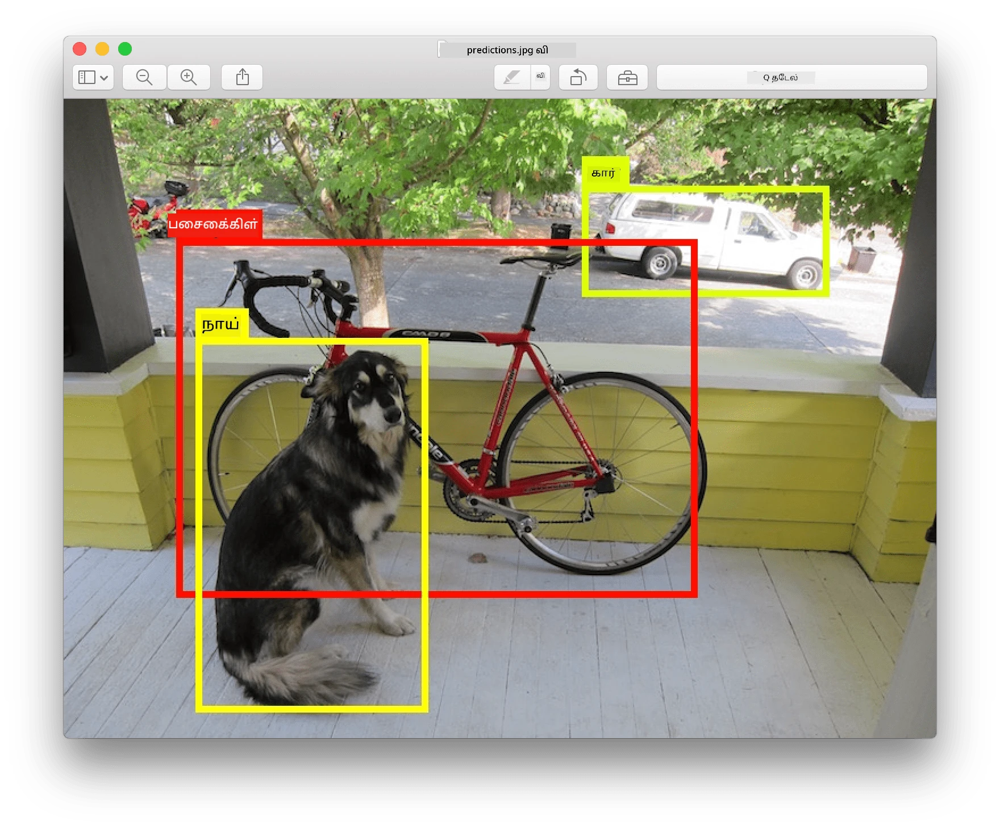
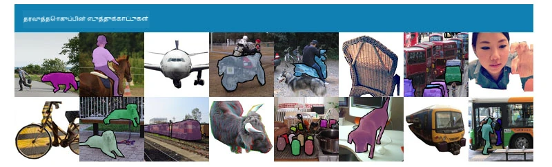
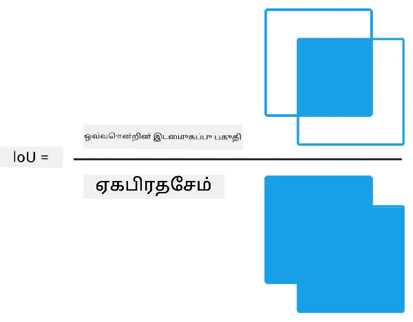
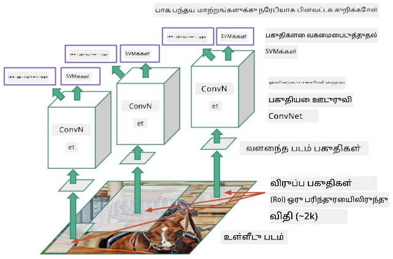
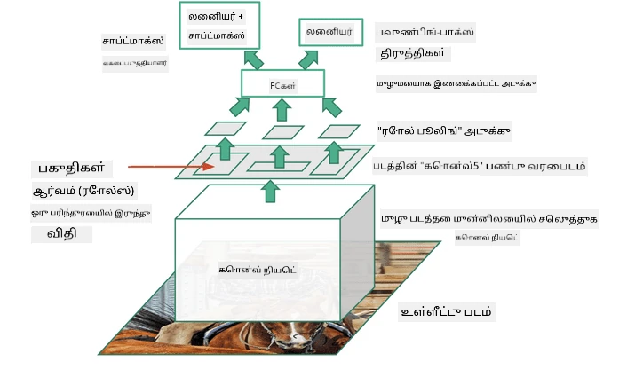
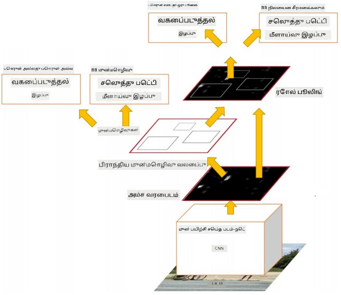
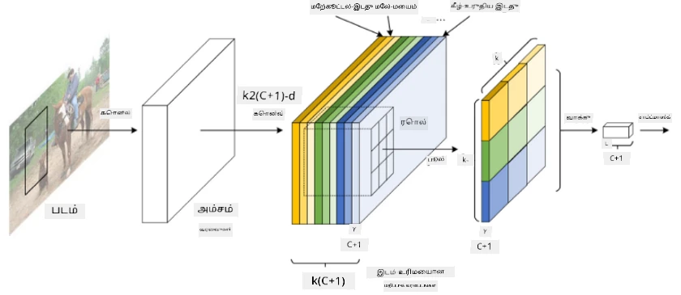
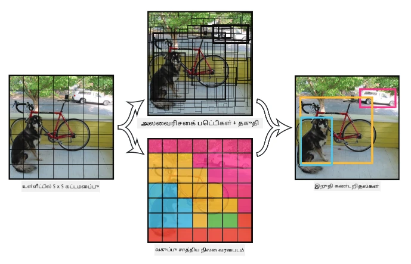

# பொருள் கண்டறிதல்

நாம் இதுவரை பார்த்த பட வகைப்படுத்தல் மாதிரிகள் ஒரு படத்தை எடுத்துக்கொண்டு ஒரு வகைமுறை முடிவை உருவாக்கின, உதாரணமாக MNIST பிரச்சினையில் 'எண்' வகை. ஆனால், பல சந்தர்ப்பங்களில் ஒரு படம் பொருட்களை காட்டுகிறது என்பதை மட்டும் அறிய வேண்டாம் - அதன் துல்லியமான இடத்தை கண்டறிய விரும்புகிறோம். இதுவே **பொருள் கண்டறிதல்** என்ற கருத்தின் முக்கிய நோக்கம்.

## [முன்-வகுப்பு வினாடி வினா](https://ff-quizzes.netlify.app/en/ai/quiz/21)

> படம் [YOLO v2 வலைத்தளத்திலிருந்து](https://pjreddie.com/darknet/yolov2/)

## பொருள் கண்டறிதலுக்கான ஒரு எளிய அணுகுமுறை

ஒரு படத்தில் ஒரு பூனை கண்டறிய விரும்பினால், பொருள் கண்டறிதலுக்கான ஒரு மிக எளிய அணுகுமுறை இதுவாக இருக்கும்:

1. படத்தை பல பகுதிகளாக பிரிக்கவும்.
2. ஒவ்வொரு பகுதியிலும் பட வகைப்படுத்தலை இயக்கவும்.
3. போதுமான அளவு செயல்பாட்டை உருவாக்கும் பகுதிகள், குறிப்பிட்ட பொருளை கொண்டதாக கருதலாம்.

> *படம் [பயிற்சி நோட்புக்](ObjectDetection-TF.ipynb) இலிருந்து*

ஆனால், இந்த அணுகுமுறை சரியானது அல்ல, ஏனெனில் இது பொருளின் **அளவுரு பெட்டியை** (bounding box) மிகவும் துல்லியமாக கண்டறிய அனுமதிக்காது. மேலும் துல்லியமான இடத்தை கண்டறிய, **மீள்பார்வை** (regression) மூலம் அளவுரு பெட்டியின் கோர்டினேட்டுகளை கணிக்க வேண்டும் - இதற்காக குறிப்பிட்ட தரவுத்தொகுப்புகள் தேவைப்படும்.

## பொருள் கண்டறிதலுக்கான மீள்பார்வை

[இந்த வலைப்பதிவு](https://towardsdatascience.com/object-detection-with-neural-networks-a4e2c46b4491) வடிவங்களை கண்டறிய ஒரு சிறந்த அறிமுகத்தை வழங்குகிறது.

## பொருள் கண்டறிதலுக்கான தரவுத்தொகுப்புகள்

இந்த பணிக்கான சில தரவுத்தொகுப்புகளை நீங்கள் சந்திக்கலாம்:

* [PASCAL VOC](http://host.robots.ox.ac.uk/pascal/VOC/) - 20 வகைகள்
* [COCO](http://cocodataset.org/#home) - சூழலில் பொதுவான பொருட்கள். 80 வகைகள், அளவுரு பெட்டிகள் மற்றும் பிரிவுப் முகமூடிகள்

## பொருள் கண்டறிதல் அளவுகோல்கள்

### இணைப்பு மற்றும் ஒன்றிணைவு (Intersection over Union)

பட வகைப்படுத்தலுக்கான செயல்திறனை அளவிடுவது எளிதானது, ஆனால் பொருள் கண்டறிதலுக்கான வகையின் சரியானதையும், அளவுரு பெட்டியின் துல்லியத்தையும் அளவிட வேண்டும். இதற்காக **இணைப்பு மற்றும் ஒன்றிணைவு** (IoU) என்ற அளவுகோலைப் பயன்படுத்துகிறோம், இது இரண்டு பெட்டிகள் (அல்லது இரண்டு பகுதி பகுதிகள்) எவ்வளவு நன்றாக ஒத்துப்போகின்றன என்பதை அளவிடுகிறது.

> *[இந்த சிறந்த வலைப்பதிவிலிருந்து](https://pyimagesearch.com/2016/11/07/intersection-over-union-iou-for-object-detection/) IoU பற்றிய படங்கள்*

காரியம் எளிதானது - இரண்டு வடிவங்களின் இணைப்பு பகுதியின் பரப்பளவை, அவற்றின் ஒன்றிணைவு பகுதியின் பரப்பளவால் வகுக்கிறோம். இரண்டு ஒரே வடிவங்களுக்கான IoU 1 ஆக இருக்கும், முழுமையாக வேறுபட்ட பகுதிகளுக்கு 0 ஆக இருக்கும். இல்லையெனில், இது 0 முதல் 1 வரை மாறும். IoU ஒரு குறிப்பிட்ட மதிப்புக்கு மேல் உள்ள அளவுரு பெட்டிகளை மட்டுமே நாம் கருதுகிறோம்.

### சராசரி துல்லியம் (Average Precision)

ஒரு குறிப்பிட்ட வகை பொருட்கள் $C$ எவ்வளவு நன்றாக அடையாளம் காணப்படுகின்றன என்பதை அளவிட விரும்பினால், **சராசரி துல்லியம்** அளவுகோலைப் பயன்படுத்துகிறோம், இது பின்வருமாறு கணக்கிடப்படுகிறது:

1. துல்லியம்-மீள்பார்வை (Precision-Recall) வளைவு, கண்டறிதல் உத்தேச மதிப்பின் (threshold) அடிப்படையில் துல்லியத்தை காட்டுகிறது (0 முதல் 1 வரை).
2. உத்தேச மதிப்பின் அடிப்படையில், படத்தில் அதிகமான அல்லது குறைவான பொருட்கள் கண்டறியப்படும், மற்றும் துல்லியம் மற்றும் மீள்பார்வை மதிப்புகள் மாறும்.
3. வளைவு இவ்வாறு இருக்கும்:

> *படம் [NeuroWorkshop](http://github.com/shwars/NeuroWorkshop) இலிருந்து*

ஒரு குறிப்பிட்ட வகைக்கு $C$ சராசரி துல்லியம் இந்த வளைவின் கீழ் உள்ள பகுதியின் பரப்பளவாகும். மேலும் துல்லியமாக, மீள்பார்வை அச்சு பொதுவாக 10 பகுதிகளாகப் பிரிக்கப்படுகிறது, மற்றும் துல்லியம் அனைத்து புள்ளிகளிலும் சராசரியாக கணக்கிடப்படுகிறது:

$$
AP = {1\over11}\sum_{i=0}^{10}\mbox{Precision}(\mbox{Recall}={i\over10})
$$

### AP மற்றும் IoU

IoU ஒரு குறிப்பிட்ட மதிப்புக்கு மேல் உள்ள கண்டறிதல்களை மட்டுமே நாம் கருதுவோம். உதாரணமாக, PASCAL VOC தரவுத்தொகுப்பில் பொதுவாக $\mbox{IoU Threshold} = 0.5$ எனக் கருதப்படுகிறது, ஆனால் COCO AP பல $\mbox{IoU Threshold}$ மதிப்புகளுக்கு கணக்கிடப்படுகிறது.

> *படம் [NeuroWorkshop](http://github.com/shwars/NeuroWorkshop) இலிருந்து*

### சராசரி துல்லியத்தின் சராசரி - mAP

பொருள் கண்டறிதலுக்கான முக்கியமான அளவுகோல் **Mean Average Precision** அல்லது **mAP** என அழைக்கப்படுகிறது. இது அனைத்து பொருள் வகைகளிலும் சராசரி துல்லியத்தின் மதிப்பு, மற்றும் சில நேரங்களில் $\mbox{IoU Threshold}$ மதிப்புகளிலும் சராசரி. mAP கணக்கிடும் செயல்முறை [இந்த வலைப்பதிவில்](https://medium.com/@timothycarlen/understanding-the-map-evaluation-metric-for-object-detection-a07fe6962cf3) மேலும் விவரமாக விளக்கப்பட்டுள்ளது, மற்றும் [இங்கு கோடுடன்](https://gist.github.com/tarlen5/008809c3decf19313de216b9208f3734) உள்ளது.

## பொருள் கண்டறிதலுக்கான மாறுபட்ட அணுகுமுறைகள்

பொருள் கண்டறிதல் அல்காரிதம்களுக்கு இரண்டு முக்கிய வகைகள் உள்ளன:

* **பகுதி முன்மொழிவு நெட்வொர்க்குகள்** (Region Proposal Networks) (R-CNN, Fast R-CNN, Faster R-CNN). முக்கியமான கருத்து **பகுதி ஆர்வங்கள்** (Regions of Interests) உருவாக்கி, அவற்றில் CNN இயக்கி அதிகபட்ச செயல்பாட்டை தேடுவது. இது எளிய அணுகுமுறையைப் போன்றது, ஆனால் ROIs (Regions of Interests) மிகவும் புத்திசாலித்தனமாக உருவாக்கப்படுகிறது. இந்த முறைகளின் முக்கிய குறைபாடுகளில் ஒன்று, இது மெதுவாக செயல்படுகிறது, ஏனெனில் படத்தில் CNN வகைப்படுத்தலை பல முறை இயக்க வேண்டும்.
* **ஒரு முறை** (One-pass) (YOLO, SSD, RetinaNet) முறைகள். இந்த கட்டமைப்புகளில், நெட்வொர்க்கை வகைகள் மற்றும் ROIs (Regions of Interests) ஒன்றாக கணிக்க வடிவமைக்கிறோம்.

### R-CNN: பகுதி அடிப்படையிலான CNN

[R-CNN](http://islab.ulsan.ac.kr/files/announcement/513/rcnn_pami.pdf) [Selective Search](http://www.huppelen.nl/publications/selectiveSearchDraft.pdf) பயன்படுத்தி ROI பகுதிகளின் அடுக்கமைப்பை உருவாக்குகிறது, பின்னர் CNN அம்சங்களைப் பயன்படுத்தி SVM வகைப்படுத்திகளை இயக்கி பொருள் வகையைத் தீர்மானிக்கிறது, மற்றும் *அளவுரு பெட்டியின்* கோர்டினேட்டுகளை தீர்மானிக்க நேரியல் மீள்பார்வையை (linear regression) பயன்படுத்துகிறது. [அதிகாரப்பூர்வ ஆவணம்](https://arxiv.org/pdf/1506.01497v1.pdf)

> *படம் van de Sande et al. ICCV’11*

> *படங்கள் [இந்த வலைப்பதிவிலிருந்து](https://towardsdatascience.com/r-cnn-fast-r-cnn-faster-r-cnn-yolo-object-detection-algorithms-36d53571365e)*

### F-RCNN - வேகமான R-CNN

இந்த அணுகுமுறை R-CNN போன்றது, ஆனால் பகுதிகள் குவியல் அடுக்குகள் (convolution layers) பயன்படுத்தப்பட்ட பிறகு வரையறுக்கப்படுகின்றன.

> படம் [அதிகாரப்பூர்வ ஆவணத்திலிருந்து](https://www.cv-foundation.org/openaccess/content_iccv_2015/papers/Girshick_Fast_R-CNN_ICCV_2015_paper.pdf), [arXiv](https://arxiv.org/pdf/1504.08083.pdf), 2015

### Faster R-CNN

இந்த அணுகுமுறையின் முக்கியமான கருத்து, ROIs (Regions of Interests) கணிக்க நரம்பியல் நெட்வொர்க்கை (neural network) பயன்படுத்துவது - *Region Proposal Network* என அழைக்கப்படுகிறது. [ஆவணம்](https://arxiv.org/pdf/1506.01497.pdf), 2016

> படம் [அதிகாரப்பூர்வ ஆவணத்திலிருந்து](https://arxiv.org/pdf/1506.01497.pdf)

### R-FCN: பகுதி அடிப்படையிலான முழுமையான குவியல் நெட்வொர்க்கு

இந்த அல்காரிதம் Faster R-CNN விட வேகமாக செயல்படுகிறது. முக்கியமான கருத்து பின்வருமாறு:

1. ResNet-101 பயன்படுத்தி அம்சங்களை எடுக்கிறோம்.
2. **Position-Sensitive Score Map** மூலம் அம்சங்கள் செயல்படுத்தப்படுகின்றன. $C$ வகைகளிலிருந்து ஒவ்வொரு பொருளும் $k\times k$ பகுதிகளால் பிரிக்கப்படுகிறது, மற்றும் பொருளின் பகுதிகளை கணிக்க பயிற்சி அளிக்கிறோம்.
3. $k\times k$ பகுதிகளிலிருந்து ஒவ்வொரு பகுதியும் பொருள் வகைகளுக்கு வாக்களிக்கிறது, மற்றும் அதிகபட்ச வாக்குகளைப் பெறும் பொருள் வகை தேர்ந்தெடுக்கப்படுகிறது.

> படம் [அதிகாரப்பூர்வ ஆவணத்திலிருந்து](https://arxiv.org/abs/1605.06409)

### YOLO - You Only Look Once

YOLO ஒரு நேரடி ஒரு முறை அல்காரிதம். முக்கியமான கருத்து பின்வருமாறு:

 * படம் $S\times S$ பகுதிகளாகப் பிரிக்கப்படுகிறது.
 * ஒவ்வொரு பகுதிக்கும் **CNN** $n$ சாத்தியமான பொருட்கள், *அளவுரு பெட்டியின்* கோர்டினேட்டுகள் மற்றும் *நம்பகத்தன்மை*=*சாத்தியம்* * IoU கணிக்கிறது.

 

> படம் [அதிகாரப்பூர்வ ஆவணத்திலிருந்து](https://arxiv.org/abs/1506.02640)

### பிற அல்காரிதம்கள்

* RetinaNet: [அதிகாரப்பூர்வ ஆவணம்](https://arxiv.org/abs/1708.02002)
   - [PyTorch இல் Torchvision செயல்பாடு](https://pytorch.org/vision/stable/_modules/torchvision/models/detection/retinanet.html)
   - [Keras செயல்பாடு](https://github.com/fizyr/keras-retinanet)
   - [Keras மாதிரிகளில் RetinaNet மூலம் பொருள் கண்டறிதல்](https://keras.io/examples/vision/retinanet/)
* SSD (Single Shot Detector): [அதிகாரப்பூர்வ ஆவணம்](https://arxiv.org/abs/1512.02325)

## ✍️ பயிற்சிகள்: பொருள் கண்டறிதல்

பின்வரும் நோட்புக்கில் உங்கள் கற்றலை தொடருங்கள்:

[ObjectDetection.ipynb](ObjectDetection.ipynb)

## முடிவு

இந்த பாடத்தில் பொருள் கண்டறிதலை அடைய பல்வேறு வழிகளை விரைவாகப் பார்வையிட்டீர்கள்!

## 🚀 சவால்

இந்த கட்டுரைகள் மற்றும் நோட்புக்குகளைப் படித்து YOLO பற்றி அறிந்து, அதை நீங்கள் முயற்சிக்கவும்:

* [YOLO பற்றி ஒரு நல்ல வலைப்பதிவு](https://www.analyticsvidhya.com/blog/2018/12/practical-guide-object-detection-yolo-framewor-python/)
 * [அதிகாரப்பூர்வ தளம்](https://pjreddie.com/darknet/yolo/)
 * Yolo: [Keras செயல்பாடு](https://github.com/experiencor/keras-yolo2), [கட்டம்-கட்டமாக நோட்புக்](https://github.com/experiencor/basic-yolo-keras/blob/master/Yolo%20Step-by-Step.ipynb)
 * Yolo v2: [Keras செயல்பாடு](https://github.com/experiencor/keras-yolo2), [கட்டம்-கட்டமாக நோட்புக்](https://github.com/experiencor/keras-yolo2/blob/master/Yolo%20Step-by-Step.ipynb)

## [பாடத்திற்குப் பின் வினாடி வினா](https://ff-quizzes.netlify.app/en/ai/quiz/22)

## மதிப்பீடு மற்றும் சுய கற்றல்

* [பொருள் கண்டறிதல்](https://tjmachinelearning.com/lectures/1718/obj/) - Nikhil Sardana
* [பொருள் கண்டறிதல் அல்காரிதம்களின் நல்ல ஒப்பீடு](https://lilianweng.github.io/lil-log/2018/12/27/object-detection-part-4.html)
* [பொருள் கண்டறிதலுக்கான ஆழமான கற்றல் அல்காரிதம்களின் மதிப்பீடு](https://medium.com/comet-app/review-of-deep-learning-algorithms-for-object-detection-c1f3d437b852)
* [அடிப்படை பொருள் கண்டறிதல் அல்காரிதம்களுக்கு கட்டம்-கட்டமாக அறிமுகம்](https://www.analyticsvidhya.com/blog/2018/10/a-step-by-step-introduction-to-the-basic-object-detection-algorithms-part-1/)
* [Python இல் Faster R-CNN செயல்பாடு](https://www.analyticsvidhya.com/blog/2018/11/implementation-faster-r-cnn-python-object-detection/)

## [பணி: பொருள் கண்டறிதல்](lab/README.md)

---

**குறிப்பு**:  
இந்த ஆவணம் [Co-op Translator](https://github.com/Azure/co-op-translator) என்ற AI மொழிபெயர்ப்பு சேவையை பயன்படுத்தி மொழிபெயர்க்கப்பட்டுள்ளது. எங்கள் தரச்சிறப்பிற்காக முயற்சி செய்தாலும், தானியங்கி மொழிபெயர்ப்புகளில் பிழைகள் அல்லது தவறுகள் இருக்கக்கூடும் என்பதை தயவுசெய்து கவனத்தில் கொள்ளவும். அதன் தாய்மொழியில் உள்ள மூல ஆவணம் அதிகாரப்பூர்வ ஆதாரமாக கருதப்பட வேண்டும். முக்கியமான தகவல்களுக்கு, தொழில்முறை மனித மொழிபெயர்ப்பு பரிந்துரைக்கப்படுகிறது. இந்த மொழிபெயர்ப்பைப் பயன்படுத்துவதால் ஏற்படும் எந்த தவறான புரிதல்கள் அல்லது தவறான விளக்கங்களுக்கு நாங்கள் பொறுப்பல்ல.