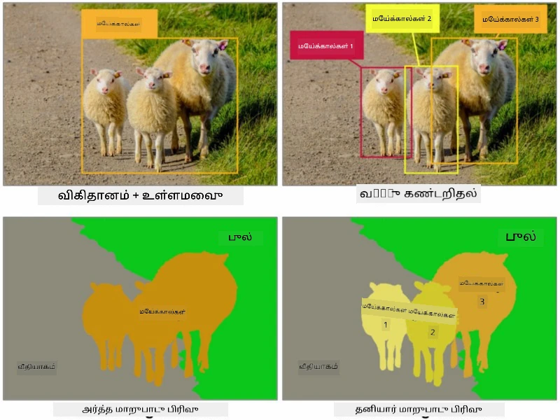
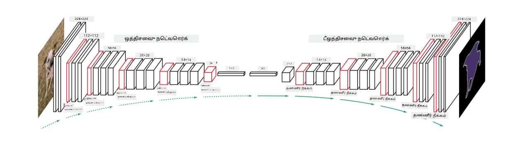
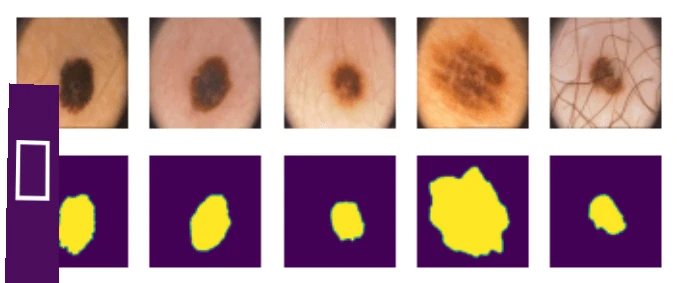

# பகுப்பாய்வு

முந்தைய பாடங்களில், பொருள் கண்டறிதல் பற்றி கற்றுக்கொண்டோம், இது படத்தில் உள்ள பொருட்களை *bounding boxes* மூலம் கண்டறிய உதவுகிறது. ஆனால், சில பணிகளுக்கு bounding boxes மட்டுமல்லாமல், மேலும் துல்லியமான பொருள் இடம்தெரிவும் தேவைப்படுகிறது. இந்த பணியை **பகுப்பாய்வு** என்று அழைக்கப்படுகிறது.

## [பாடத்திற்கு முன் வினாடி வினா](https://ff-quizzes.netlify.app/en/ai/quiz/23)

பகுப்பாய்வை **பிக்சல் வகைப்பாடு** என்று பார்க்கலாம், அதாவது படத்தின் **ஒவ்வொரு** பிக்சலுக்கும் அதன் வகையை (*பின்புலம்* ஒரு வகையாக இருக்கும்) கணிக்க வேண்டும். இரண்டு முக்கியமான பகுப்பாய்வு الگorithம்கள் உள்ளன:

* **Semantic segmentation** பிக்சலின் வகையை மட்டும் தெரிவிக்கிறது, ஆனால் ஒரே வகையைச் சேர்ந்த வேறு பொருட்களை வேறுபடுத்தாது.
* **Instance segmentation** வகைகளை வேறு வேறு நிகழ்வுகளாகப் பிரிக்கிறது.

உதாரணமாக, instance segmentation-இல் இந்த ஆடுகள் வேறு பொருட்களாகக் கருதப்படும், ஆனால் semantic segmentation-இல் அனைத்து ஆடுகளும் ஒரே வகையாகக் கருதப்படும்.

> படம் [இந்த வலைப்பதிவில் இருந்து](https://nirmalamurali.medium.com/image-classification-vs-semantic-segmentation-vs-instance-segmentation-625c33a08d50)

பகுப்பாய்வுக்கான பல நரம்பியல் கட்டமைப்புகள் உள்ளன, ஆனால் அவை அனைத்தும் ஒரே அமைப்பைக் கொண்டுள்ளன. ஒரு வகையில், இது நீங்கள் முன்பு கற்றுக்கொண்ட autoencoder-க்கு ஒத்ததாக உள்ளது, ஆனால் அசல் படத்தை deconstruct செய்யாமல், **mask**-ஐ deconstruct செய்வதே எங்கள் நோக்கம். எனவே, ஒரு பகுப்பாய்வு நெட்வொர்க்கில் பின்வரும் பகுதிகள் உள்ளன:

* **Encoder** உள்ளீடு படத்திலிருந்து அம்சங்களை எடுக்கிறது
* **Decoder** அந்த அம்சங்களை **mask image**-ஆக மாற்றுகிறது, இதன் அளவு மற்றும் சேனல்கள் வகைகளின் எண்ணிக்கைக்கு இணையாக இருக்கும்.

> படம் [இந்த வெளியீட்டில் இருந்து](https://arxiv.org/pdf/2001.05566.pdf)

பகுப்பாய்வுக்கான loss function-ஐ குறிப்பாக குறிப்பிட வேண்டும். பாரம்பரிய autoencoders-ஐ பயன்படுத்தும்போது, இரண்டு படங்களின் ஒற்றுமையை அளவிட வேண்டும், அதற்காக mean square error (MSE)-ஐ பயன்படுத்தலாம். பகுப்பாய்வில், இலக்கு mask image-இல் ஒவ்வொரு பிக்சலும் வகை எண்ணை (மூன்றாவது பரிமாணத்தில் one-hot-encoded) பிரதிநிதித்துவப்படுத்துகிறது, எனவே வகைப்பாட்டுக்கான loss functions-ஐ பயன்படுத்த வேண்டும் - cross-entropy loss, அனைத்து பிக்சல்களிலும் சராசரியாக. mask binary ஆக இருந்தால் - **binary cross-entropy loss** (BCE) பயன்படுத்தப்படுகிறது.

> ✅ One-hot encoding என்பது வகை லேபலை வகைகளின் எண்ணிக்கைக்கு சமமான நீளத்துடன் ஒரு வெக்டராக குறியாக்கும் ஒரு முறை. [இந்த கட்டுரையை](https://datagy.io/sklearn-one-hot-encode/) இந்த தொழில்நுட்பத்தைப் பற்றி பார்க்கவும்.

## மருத்துவ படங்களுக்கான பகுப்பாய்வு

இந்த பாடத்தில், மனித nevi (moles என்று அழைக்கப்படும்) மருத்துவ படங்களில் அடையாளம் காண நெட்வொர்க்கை பயிற்சி செய்வதன் மூலம் பகுப்பாய்வை செயல்பாட்டில் காண்போம். <a href="https://www.fc.up.pt/addi/ph2%20database.html">PH2 Database</a> என்ற dermoscopy படங்களின் தரவுத்தொகுப்பை படங்களின் மூலமாகப் பயன்படுத்துவோம். இந்த தரவுத்தொகுப்பில் மூன்று வகைகளின் 200 படங்கள் உள்ளன: typical nevus, atypical nevus, மற்றும் melanoma. அனைத்து படங்களும் nevus-ஐ வரையறுக்கும் **mask**-ஐ கொண்டுள்ளன.

> ✅ இந்த தொழில்நுட்பம் இந்த வகை மருத்துவ படங்களுக்கு மிகவும் பொருத்தமானது, ஆனால் மற்ற எந்த உண்மையான பயன்பாடுகளை நீங்கள் கற்பனை செய்ய முடியும்?

> படம் PH2 Database-இல் இருந்து

நாங்கள் ஒரு மாதிரியை அதன் பின்புலத்திலிருந்து எந்த nevus-ஐயும் பகுப்பாய்வு செய்ய பயிற்சி செய்ய உள்ளோம்.

## ✍️ பயிற்சிகள்: Semantic Segmentation

கீழே உள்ள நோட்புக்குகளைத் திறந்து, semantic segmentation கட்டமைப்புகள் பற்றிய மேலும் அறியவும், அவற்றுடன் வேலை செய்ய பயிற்சி செய்யவும், மற்றும் அவற்றை செயல்பாட்டில் காணவும்.

* [Semantic Segmentation Pytorch](SemanticSegmentationPytorch.ipynb)
* [Semantic Segmentation TensorFlow](SemanticSegmentationTF.ipynb)

## [பாடத்திற்குப் பின் வினாடி வினா](https://ff-quizzes.netlify.app/en/ai/quiz/24)

## முடிவு

பகுப்பாய்வு என்பது பட வகைப்பாட்டுக்கான மிகவும் சக்திவாய்ந்த தொழில்நுட்பமாகும், bounding boxes-ஐத் தாண்டி பிக்சல் நிலை வகைப்பாட்டுக்கு செல்கிறது. இது மருத்துவ படங்கள் உள்ளிட்ட பல பயன்பாடுகளில் பயன்படுத்தப்படும் ஒரு தொழில்நுட்பமாகும்.

## 🚀 சவால்

உடல் பகுப்பாய்வு என்பது மனிதர்களின் படங்களுடன் செய்யக்கூடிய பொதுவான பணிகளில் ஒன்றாகும். மற்ற முக்கியமான பணிகளில் **எலும்புக்கூடு கண்டறிதல்** மற்றும் **நிலை கண்டறிதல்** அடங்கும். [OpenPose](https://github.com/CMU-Perceptual-Computing-Lab/openpose) நூலகத்தை முயற்சித்து, நிலை கண்டறிதல் எப்படி பயன்படுத்தப்படுகிறதென்று பாருங்கள்.

## மதிப்பீடு & சுயபயிற்சி

இந்த [விக்கிபீடியா கட்டுரை](https://wikipedia.org/wiki/Image_segmentation) இந்த தொழில்நுட்பத்தின் பல்வேறு பயன்பாடுகளின் நல்ல சுருக்கத்தை வழங்குகிறது. இந்த துறையில் Instance segmentation மற்றும் Panoptic segmentation ஆகிய துணை பிரிவுகள் பற்றிய மேலும் அறியவும்.

## [பணி](lab/README.md)

இந்த ஆய்வகத்தில், [Segmentation Full Body MADS Dataset](https://www.kaggle.com/datasets/tapakah68/segmentation-full-body-mads-dataset) என்ற Kaggle தரவுத்தொகுப்பைப் பயன்படுத்தி **மனித உடல் பகுப்பாய்வு** முயற்சிக்கவும்.

---

**குறிப்பு**:  
இந்த ஆவணம் [Co-op Translator](https://github.com/Azure/co-op-translator) என்ற AI மொழிபெயர்ப்பு சேவையைப் பயன்படுத்தி மொழிபெயர்க்கப்பட்டுள்ளது. நாங்கள் துல்லியத்திற்காக முயற்சிக்கின்றோம், ஆனால் தானியங்கி மொழிபெயர்ப்புகளில் பிழைகள் அல்லது தவறான தகவல்கள் இருக்கக்கூடும் என்பதை தயவுசெய்து கவனத்தில் கொள்ளுங்கள். அதன் தாய்மொழியில் உள்ள மூல ஆவணம் அதிகாரப்பூர்வ ஆதாரமாக கருதப்பட வேண்டும். முக்கியமான தகவல்களுக்கு, தொழில்முறை மனித மொழிபெயர்ப்பு பரிந்துரைக்கப்படுகிறது. இந்த மொழிபெயர்ப்பைப் பயன்படுத்துவதால் ஏற்படும் எந்த தவறான புரிதல்கள் அல்லது தவறான விளக்கங்களுக்கு நாங்கள் பொறுப்பல்ல.