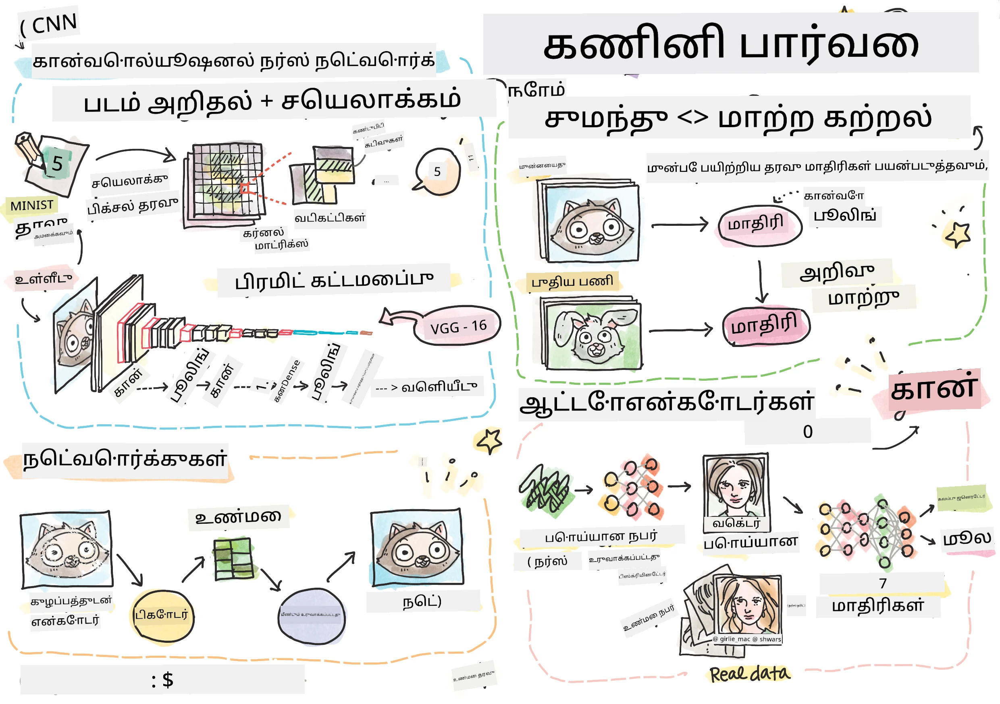

# கணினி பார்வை

இந்த பிரிவில் நாம் கற்றுக்கொள்ள போவது:

* [கணினி பார்வை மற்றும் OpenCV அறிமுகம்](06-IntroCV/README.md)
* [கன்வல்யூஷனல் நியூரல் நெட்வொர்க்கள்](07-ConvNets/README.md)
* [முன்னதாக பயிற்சி பெற்ற நெட்வொர்க்கள் மற்றும் மாற்றம் கற்றல்](08-TransferLearning/README.md) 
* [ஆட்டோஎன்கோடர்கள்](09-Autoencoders/README.md)
* [ஜெனரேட்டிவ் அட்வர்சேரியல் நெட்வொர்க்கள்](10-GANs/README.md)
* [வஸ்து கண்டறிதல்](11-ObjectDetection/README.md)
* [செமாண்டிக் பிரிக்கப்பட்டல்](12-Segmentation/README.md)

---

**குறிப்பு**:  
இந்த ஆவணம் [Co-op Translator](https://github.com/Azure/co-op-translator) என்ற AI மொழிபெயர்ப்பு சேவையை பயன்படுத்தி மொழிபெயர்க்கப்பட்டுள்ளது. நாங்கள் துல்லியத்திற்காக முயற்சிக்கின்றோம், ஆனால் தானியங்கி மொழிபெயர்ப்புகளில் பிழைகள் அல்லது தவறான தகவல்கள் இருக்கக்கூடும் என்பதை கவனத்தில் கொள்ளவும். அதன் தாய்மொழியில் உள்ள மூல ஆவணம் அதிகாரப்பூர்வ ஆதாரமாக கருதப்பட வேண்டும். முக்கியமான தகவல்களுக்கு, தொழில்முறை மனித மொழிபெயர்ப்பு பரிந்துரைக்கப்படுகிறது. இந்த மொழிபெயர்ப்பைப் பயன்படுத்துவதால் ஏற்படும் எந்த தவறான புரிதல்கள் அல்லது தவறான விளக்கங்களுக்கு நாங்கள் பொறுப்பல்ல.