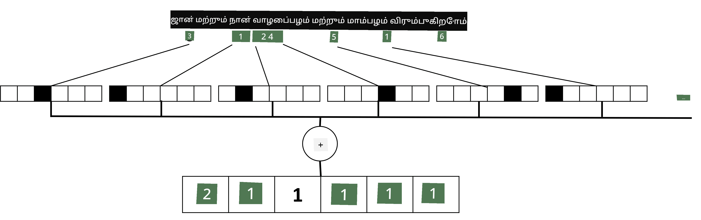

# டெக்ஸ்டை டென்சராக பிரதிநிதித்துவம் செய்யுதல்

## [முன்-வகுப்பு வினாடி வினா](https://ff-quizzes.netlify.app/en/ai/quiz/25)

## உரை வகைப்படுத்தல்

இந்த பிரிவின் முதல் பகுதிக்குள், **உரை வகைப்படுத்தல்** பணியை நாங்கள் கவனிக்கிறோம். [AG News](https://www.kaggle.com/amananandrai/ag-news-classification-dataset) தரவுத்தொகுப்பைப் பயன்படுத்துவோம், இது கீழே உள்ளவாறு செய்தி கட்டுரைகளை கொண்டுள்ளது:

* வகை: அறிவியல்/தொழில்நுட்பம்
* தலைப்பு: Ky. நிறுவனம் பெப்டைட்களை ஆய்வு செய்ய மானியம் வென்றது (AP)
* உடல்: AP - லூயிஸ்வில்லி பல்கலைக்கழகத்தில் ஒரு வேதியியல் ஆராய்ச்சியாளரால் நிறுவப்பட்ட ஒரு நிறுவனம்...

நாங்கள் செய்தி உரையை உரையின் அடிப்படையில் ஒரு வகையில் வகைப்படுத்துவதே எங்கள் நோக்கம்.

## உரையை பிரதிநிதித்துவம் செய்யுதல்

நடுநிலை மொழி செயலாக்க (NLP) பணிகளை நரம்பியல் வலையமைப்புகளுடன் தீர்க்க விரும்பினால், உரையை டென்சராக பிரதிநிதித்துவம் செய்ய ஒரு வழி தேவை. கணினிகள் ஏற்கனவே ASCII அல்லது UTF-8 போன்ற குறியீடுகளைப் பயன்படுத்தி உங்கள் திரையில் எழுத்துருக்களுக்கு வரைபடம் செய்யும் எண்களாக உரை எழுத்துக்களை பிரதிநிதித்துவம் செய்கின்றன.

> [படத்தின் மூலதரவு](https://www.seobility.net/en/wiki/ASCII)

மனிதர்களாக, ஒவ்வொரு எழுத்தும் **எதை பிரதிநிதித்துவம் செய்கிறது** என்பதை நாங்கள் புரிந்துகொள்கிறோம், மேலும் அனைத்து எழுத்துக்களும் ஒரு வாக்கியத்தின் வார்த்தைகளை உருவாக்க ஒன்றாக இணைகின்றன. ஆனால், கணினிகள் தாங்கள் மட்டுமே இப்படிப்பட்ட புரிதலைக் கொண்டிருக்காது, மேலும் நரம்பியல் வலையமைப்பு பயிற்சியின் போது பொருளை கற்றுக்கொள்ள வேண்டும்.

எனவே, உரையை பிரதிநிதித்துவம் செய்யும் போது நாங்கள் பல்வேறு அணுகுமுறைகளைப் பயன்படுத்தலாம்:

* **எழுத்து-நிலை பிரதிநிதித்துவம்**, இதில் ஒவ்வொரு எழுத்தையும் ஒரு எண்ணாகக் கருதுவதன் மூலம் உரையை பிரதிநிதித்துவம் செய்கிறோம். எங்கள் உரை தொகுப்பில் *C* வெவ்வேறு எழுத்துக்கள் உள்ளன என்றால், *Hello* என்ற வார்த்தை 5x*C* டென்சராக பிரதிநிதித்துவம் செய்யப்படும். ஒவ்வொரு எழுத்தும் ஒற்றை-சூடான குறியீட்டில் ஒரு டென்சர் நெடுவரிசைக்கு இணங்கும்.
* **வார்த்தை-நிலை பிரதிநிதித்துவம்**, இதில் நாங்கள் எங்கள் உரையில் உள்ள அனைத்து வார்த்தைகளின் **அகராதி**யை உருவாக்கி, பின்னர் ஒற்றை-சூடான குறியீட்டைப் பயன்படுத்தி வார்த்தைகளை பிரதிநிதித்துவம் செய்கிறோம். இந்த அணுகுமுறை சிறிது சிறந்தது, ஏனெனில் ஒவ்வொரு எழுத்தும் தனியாக அதிக பொருளை கொண்டிருக்காது, மேலும் உயர்நிலை அர்த்தக் கருத்துக்கள் - வார்த்தைகள் - பயன்படுத்துவதன் மூலம் நரம்பியல் வலையமைப்புக்கான பணியை எளிமைப்படுத்துகிறோம். இருப்பினும், பெரிய அகராதி அளவைக் கருத்தில் கொண்டால், உயர்-பரிமாண மிதமான டென்சர்களை கையாள வேண்டும்.

பிரதிநிதித்துவம் எதுவாக இருந்தாலும், முதலில் உரையை **டோக்கன்கள்** வரிசையாக மாற்ற வேண்டும், ஒரு டோக்கன் ஒரு எழுத்து, ஒரு வார்த்தை அல்லது சில நேரங்களில் ஒரு வார்த்தையின் ஒரு பகுதியாக இருக்கலாம். பின்னர், **அகராதி**யைப் பயன்படுத்தி டோக்கனை ஒரு எண்ணாக மாற்ற வேண்டும், மேலும் இந்த எண்ணை ஒற்றை-சூடான குறியீட்டைப் பயன்படுத்தி நரம்பியல் வலையமைப்பில் வழங்கலாம்.

## N-Grams

இயற்கை மொழியில், வார்த்தைகளின் துல்லியமான பொருள் சூழலில் மட்டுமே தீர்மானிக்க முடியும். உதாரணமாக, *neural network* மற்றும் *fishing network* என்பதன் பொருள் முற்றிலும் வேறுபட்டது. இதை கருத்தில் கொள்ள ஒரு வழி, வார்த்தை ஜோடிகளின் அடிப்படையில் எங்கள் மாதிரியை உருவாக்குவது மற்றும் வார்த்தை ஜோடிகளை தனித்துவமான அகராதி டோக்கன்களாகக் கருதுவது. இந்த வழியில், *I like to go fishing* என்ற வாக்கியம் பின்வரும் டோக்கன் வரிசையாக பிரதிநிதித்துவம் செய்யப்படும்: *I like*, *like to*, *to go*, *go fishing*. இந்த அணுகுமுறையின் பிரச்சினை என்னவென்றால், அகராதி அளவு குறிப்பிடத்தக்க அளவில் அதிகரிக்கிறது, மேலும் *go fishing* மற்றும் *go shopping* போன்ற சேர்க்கைகள் வெவ்வேறு டோக்கன்களால் பிரதிநிதித்துவம் செய்யப்படுகின்றன, இது ஒரே வினைச்சொல்லை பகிர்ந்தாலும் அர்த்தத்தில் எந்த ஒற்றுமையையும் பகிரவில்லை.

சில சந்தர்ப்பங்களில், மூன்று வார்த்தைகளின் சேர்க்கைகள் - **tri-grams** - பயன்படுத்தலாம். எனவே, இந்த அணுகுமுறை **n-grams** என்று அழைக்கப்படுகிறது. மேலும், n-grams-ஐ எழுத்து-நிலை பிரதிநிதித்துவத்துடன் பயன்படுத்துவது பொருத்தமாக இருக்கிறது, இதில் n-grams வெவ்வேறு ஒலியல்புகளுக்கு சுமார் இணங்கும்.

## Bag-of-Words மற்றும் TF/IDF

உரை வகைப்படுத்தல் போன்ற பணிகளை தீர்க்கும்போது, ​​நாங்கள் ஒரு நிலையான அளவுள்ள வெக்டராக உரையை பிரதிநிதித்துவம் செய்ய வேண்டும், இது இறுதி அடர்த்தியான வகைப்படுத்தலுக்கான உள்ளீடாக பயன்படுத்தப்படும். அதைச் செய்யும் எளிய வழிகளில் ஒன்று, அனைத்து தனிப்பட்ட வார்த்தை பிரதிநிதித்துவங்களை இணைப்பது, உதாரணமாக, அவற்றைச் சேர்ப்பது. ஒவ்வொரு வார்த்தையின் ஒற்றை-சூடான குறியீட்டுகளைச் சேர்த்தால், உரையின் உள்ளே ஒவ்வொரு வார்த்தையும் எத்தனை முறை தோன்றுகிறது என்பதை காட்டும் அதிர்வெண் வெக்டராக முடிவடையும். உரையின் இப்படிப்பட்ட பிரதிநிதித்துவம் **bag of words** (BoW) என்று அழைக்கப்படுகிறது.

> எழுத்தாளர் உருவாக்கிய படம்

BoW அடிப்படையில் உரையில் எந்த வார்த்தைகள் தோன்றுகின்றன மற்றும் எந்த அளவில் தோன்றுகின்றன என்பதை பிரதிநிதித்துவம் செய்கிறது, இது உரை பற்றி என்னவென்று ஒரு நல்ல குறிக்கோள் ஆக இருக்கலாம். உதாரணமாக, அரசியல் தொடர்பான செய்தி கட்டுரை *president* மற்றும் *country* போன்ற வார்த்தைகளை கொண்டிருக்க வாய்ப்பு உள்ளது, ஆனால் அறிவியல் வெளியீடு *collider*, *discovered* போன்றவற்றைக் கொண்டிருக்க வாய்ப்பு உள்ளது. எனவே, வார்த்தை அதிர்வெண்கள் பல சந்தர்ப்பங்களில் உரை உள்ளடக்கத்தின் நல்ல குறிக்கோளாக இருக்கலாம்.

BoW-இன் பிரச்சினை என்னவென்றால், *and*, *is* போன்ற சில பொதுவான வார்த்தைகள் பெரும்பாலான உரைகளில் தோன்றுகின்றன, மேலும் அவை மிக உயர்ந்த அதிர்வெண்களைப் பெறுகின்றன, உண்மையில் முக்கியமான வார்த்தைகளை மறைக்கின்றன. இந்த வார்த்தைகளின் முக்கியத்துவத்தை குறைக்க, முழு ஆவணத் தொகுப்பில் வார்த்தைகள் தோன்றும் அதிர்வெண்களை கருத்தில் கொள்ளலாம். இது TF/IDF அணுகுமுறையின் முக்கிய யோசனை, இது இந்த பாடத்துடன் இணைக்கப்பட்ட நோட்புக்குகளில் விரிவாகக் கையாளப்படுகிறது.

எனினும், இந்த அணுகுமுறைகள் எதுவும் உரையின் **அர்த்தத்தை** முழுமையாகக் கருத்தில் கொள்ள முடியாது. இதைச் செய்ய அதிக சக்திவாய்ந்த நரம்பியல் வலையமைப்புகள் தேவை, இது இந்த பிரிவில் பின்னர் விவாதிக்கப்படும்.

## ✍️ பயிற்சிகள்: உரை பிரதிநிதித்துவம்

பின்வரும் நோட்புக்குகளில் உங்கள் கற்றலை தொடருங்கள்:

* [PyTorch உடன் உரை பிரதிநிதித்துவம்](TextRepresentationPyTorch.ipynb)
* [TensorFlow உடன் உரை பிரதிநிதித்துவம்](TextRepresentationTF.ipynb)

## முடிவு

இப்போது வரை, வெவ்வேறு வார்த்தைகளுக்கு அதிர்வெண் எடை சேர்க்கும் தொழில்நுட்பங்களை நாங்கள் கற்றுக்கொண்டோம். அவை, இருப்பினும், அர்த்தம் அல்லது வரிசையை பிரதிநிதித்துவம் செய்ய முடியாது. புகழ்பெற்ற மொழியியல் அறிஞர் J. R. Firth 1935-ல் கூறியதாவது: "ஒரு வார்த்தையின் முழுமையான அர்த்தம் எப்போதும் சூழலுடன் தொடர்புடையது, மேலும் சூழலுக்கு வெளியே அர்த்தத்தைப் பற்றிய எந்த ஆய்வும் தீவிரமாக எடுத்துக்கொள்ள முடியாது." மொழி மாதிரியாக்கத்தைப் பயன்படுத்தி உரையிலிருந்து சூழலியல் தகவலை எவ்வாறு பிடிக்கலாம் என்பதை இந்த பாடத்தில் பின்னர் கற்றுக்கொள்வோம்.

## 🚀 சவால்

bag-of-words மற்றும் வெவ்வேறு தரவுத்தொகுப்புகளைப் பயன்படுத்தி சில பிற பயிற்சிகளை முயற்சிக்கவும். இந்த [Kaggle போட்டி](https://www.kaggle.com/competitions/word2vec-nlp-tutorial/overview/part-1-for-beginners-bag-of-words) மூலம் உங்களுக்கு ஊக்கமளிக்கலாம்.

## [பின்-வகுப்பு வினாடி வினா](https://ff-quizzes.netlify.app/en/ai/quiz/26)

## மதிப்பீடு & சுயபயிற்சி

[Microsoft Learn](https://docs.microsoft.com/learn/modules/intro-natural-language-processing-pytorch/?WT.mc_id=academic-77998-cacaste) இல் உரை எம்பெடிங்குகள் மற்றும் bag-of-words தொழில்நுட்பங்களுடன் உங்கள் திறன்களைப் பயிற்சி செய்யுங்கள்.

## [பணி: நோட்புக்குகள்](assignment.md)

---

**அறிவிப்பு**:  
இந்த ஆவணம் [Co-op Translator](https://github.com/Azure/co-op-translator) என்ற AI மொழிபெயர்ப்பு சேவையை பயன்படுத்தி மொழிபெயர்க்கப்பட்டுள்ளது. நாங்கள் துல்லியத்திற்காக முயற்சிக்கிறோம், ஆனால் தானியங்கி மொழிபெயர்ப்புகளில் பிழைகள் அல்லது தவறுகள் இருக்கக்கூடும் என்பதை கவனத்தில் கொள்ளவும். அதன் சொந்த மொழியில் உள்ள மூல ஆவணம் அதிகாரப்பூர்வ ஆதாரமாக கருதப்பட வேண்டும். முக்கியமான தகவல்களுக்கு, தொழில்முறை மனித மொழிபெயர்ப்பு பரிந்துரைக்கப்படுகிறது. இந்த மொழிபெயர்ப்பைப் பயன்படுத்துவதால் ஏற்படும் எந்த தவறான புரிதல்களுக்கும் அல்லது தவறான விளக்கங்களுக்கும் நாங்கள் பொறுப்பல்ல.