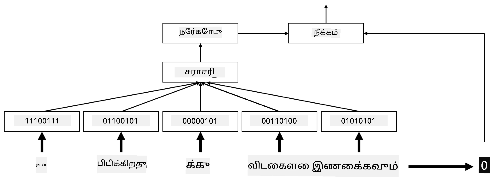
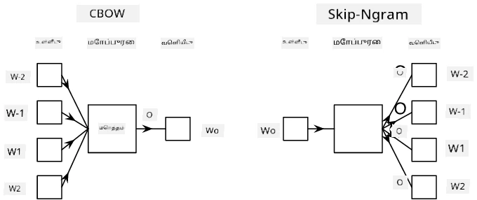

# எம்பெடிங்குகள்

## [முன்-வகுப்பு வினாடி வினா](https://ff-quizzes.netlify.app/en/ai/quiz/27)

BoW அல்லது TF/IDF அடிப்படையில் வகைப்பாட்டாளர்களை பயிற்சி செய்யும்போது, `vocab_size` நீளத்துடன் கூடிய உயர்-பரிமாண வார்த்தை-பை (bag-of-words) வெக்டர்களில் செயல்பட்டோம், மேலும் குறைந்த பரிமாண நிலைமாற்றம் வெக்டர்களிலிருந்து sparse one-hot பிரதிநிதித்துவத்திற்கு மாற்றினோம். ஆனால், இந்த one-hot பிரதிநிதித்துவம் நினைவகத்தை திறமையாக பயன்படுத்துவதில்லை. மேலும், ஒவ்வொரு வார்த்தையும் தனித்தனியாக நடத்தப்படுகிறது, அதாவது one-hot குறியாக்கப்பட்ட வெக்டர்கள் வார்த்தைகளுக்கிடையேயான அர்த்த சார்ந்த ஒற்றுமையை வெளிப்படுத்துவதில்லை.

**எம்பெடிங்** என்ற கருத்து வார்த்தைகளை குறைந்த பரிமாணம் கொண்ட அடர்த்தியான வெக்டர்களால் பிரதிநிதித்துவப்படுத்துவது, இது ஒரு வார்த்தையின் அர்த்தத்தை ஏதோ ஒரு வகையில் பிரதிபலிக்கிறது. அர்த்தமுள்ள வார்த்தை எம்பெடிங்குகளை உருவாக்குவது எப்படி என்பதை பின்னர் விவாதிப்போம், ஆனால் தற்போது எம்பெடிங்குகளை ஒரு வார்த்தை வெக்டரின் பரிமாணத்தை குறைக்கும் ஒரு வழியாகவே நினைத்துக்கொள்ளலாம்.

எம்பெடிங் லேயர் ஒரு வார்த்தையை உள்ளீடாக எடுத்து, குறிப்பிட்ட `embedding_size` வெக்டரை வெளியீடாக உருவாக்கும். இது ஒரு `Linear` லேயருக்கு மிகவும் ஒத்ததாக உள்ளது, ஆனால் ஒரு one-hot குறியாக்கப்பட்ட வெக்டரை எடுப்பதற்குப் பதிலாக, ஒரு வார்த்தை எண்ணை உள்ளீடாக எடுக்க முடியும், இதனால் பெரிய one-hot குறியாக்கப்பட்ட வெக்டர்களை உருவாக்க avoided செய்யலாம்.

எங்கள் வகைப்பாட்டாளர் நெட்வொர்க்கில் முதல் லேயராக எம்பெடிங் லேயரைப் பயன்படுத்துவதன் மூலம், BoW மாடலிலிருந்து **embedding bag** மாடலுக்கு மாறலாம், இதில் முதலில் எங்கள் உரையில் உள்ள ஒவ்வொரு வார்த்தையையும் தொடர்புடைய எம்பெடிங்காக மாற்றி, பின்னர் அந்த எம்பெடிங்குகளின் மீது `sum`, `average` அல்லது `max` போன்ற சில தொகுப்பு செயல்பாடுகளை கணக்கிடலாம்.

> படத்தை உருவாக்கியவர்

## ✍️ பயிற்சிகள்: எம்பெடிங்குகள்

பின்வரும் நோட்புக்குகளில் உங்கள் கற்றலை தொடருங்கள்:
* [PyTorch உடன் எம்பெடிங்குகள்](EmbeddingsPyTorch.ipynb)
* [TensorFlow உடன் எம்பெடிங்குகள்](EmbeddingsTF.ipynb)

## அர்த்த சார்ந்த எம்பெடிங்குகள்: Word2Vec

எம்பெடிங் லேயர் வார்த்தைகளை வெக்டர் பிரதிநிதித்துவத்திற்கு வரைபடம் செய்ய கற்றுக்கொண்டாலும், இந்த பிரதிநிதித்துவம் அவசியமாக அர்த்த சார்ந்த பொருளை கொண்டிருக்காது. ஒத்த வார்த்தைகள் அல்லது ஒத்தார்த்த வார்த்தைகள், சில வெக்டர் தூரத்தின் அடிப்படையில் (எ.கா. Euclidean distance) ஒருவருக்கொன்று அருகில் இருக்கும் வெக்டர்களுக்கு ஒத்ததாக இருக்கும் வகையில் ஒரு வெக்டர் பிரதிநிதித்துவத்தை கற்றுக்கொள்வது நல்லது.

அதற்காக, எங்கள் எம்பெடிங் மாடலை ஒரு பெரிய உரை தொகுப்பில் ஒரு குறிப்பிட்ட முறையில் முன்-பயிற்சி செய்ய வேண்டும். அர்த்த சார்ந்த எம்பெடிங்குகளை பயிற்சி செய்ய ஒரு வழி [Word2Vec](https://en.wikipedia.org/wiki/Word2vec) என அழைக்கப்படுகிறது. இது வார்த்தைகளின் பகிர்ந்தளிக்கப்பட்ட பிரதிநிதித்துவத்தை உருவாக்க பயன்படுத்தப்படும் இரண்டு முக்கிய கட்டமைப்புகளின் அடிப்படையில் உள்ளது:

 - **தொடர்ச்சியான வார்த்தை-பை** (CBoW) — இந்த கட்டமைப்பில், சுற்றியுள்ள சூழலிலிருந்து ஒரு வார்த்தையை கணிக்க மாடலை பயிற்சி செய்கிறோம். ngram $(W_{-2},W_{-1},W_0,W_1,W_2)$ கொடுக்கப்பட்டால், மாடலின் நோக்கம் $(W_{-2},W_{-1},W_1,W_2)$-இல் இருந்து $W_0$-ஐ கணிக்க வேண்டும்.
 - **தொடர்ச்சியான skip-gram** CBoW-க்கு எதிர்மாறானது. மாடல் சூழலின் சாளர வார்த்தைகளைப் பயன்படுத்தி தற்போதைய வார்த்தையை கணிக்கிறது.

CBoW வேகமாக செயல்படுகிறது, ஆனால் skip-gram மெதுவாக செயல்படுகிறது, ஆனால் அரிதான வார்த்தைகளை பிரதிநிதித்துவப்படுத்த சிறந்த வேலை செய்கிறது.

> [இந்த ஆவணத்தில்](https://arxiv.org/pdf/1301.3781.pdf) இருந்து படம்

Word2Vec முன்-பயிற்சி செய்யப்பட்ட எம்பெடிங்குகள் (மற்ற GloVe போன்ற மாடல்கள்) நரம்பியல் நெட்வொர்க்குகளில் எம்பெடிங் லேயரின் இடத்தில் பயன்படுத்தப்படலாம். ஆனால், வார்த்தை தொகுப்புகளை கையாள வேண்டும், ஏனெனில் Word2Vec/GloVe-ஐ முன்-பயிற்சி செய்ய பயன்படுத்திய வார்த்தை தொகுப்பு எங்கள் உரை தொகுப்பில் உள்ள வார்த்தை தொகுப்பில் இருந்து மாறுபட வாய்ப்பு உள்ளது. இந்த பிரச்சினையை எப்படி தீர்க்கலாம் என்பதை மேலே உள்ள நோட்புக்குகளில் பாருங்கள்.

## சூழலியல் எம்பெடிங்குகள்

Word2Vec போன்ற பாரம்பரிய முன்-பயிற்சி செய்யப்பட்ட எம்பெடிங் பிரதிநிதித்துவங்களின் முக்கியமான ஒரு வரம்பு வார்த்தை அர்த்தம் தெளிவுபடுத்தல் பிரச்சினையாகும். முன்-பயிற்சி செய்யப்பட்ட எம்பெடிங்குகள் வார்த்தைகளின் அர்த்தத்தை சில அளவுக்கு சூழலில் பிடிக்க முடியும், ஆனால் ஒரு வார்த்தையின் அனைத்து சாத்தியமான அர்த்தங்களும் ஒரே எம்பெடிங்கில் குறியாக்கப்படுகின்றன. இது பல அர்த்தங்களை கொண்ட வார்த்தைகள், உதாரணமாக 'play' போன்ற வார்த்தைகள், பயன்படுத்தப்படும் சூழலின் அடிப்படையில் வெவ்வேறு அர்த்தங்களை கொண்டிருக்கும் போது, கீழ்மட்ட மாடல்களில் பிரச்சினைகளை ஏற்படுத்தும்.

உதாரணமாக, 'play' என்ற வார்த்தை இந்த இரண்டு வாக்கியங்களில் வெவ்வேறு அர்த்தங்களை கொண்டுள்ளது:

- நான் தியேட்டரில் ஒரு **play**-ஐப் பார்த்தேன்.
- ஜான் தனது நண்பர்களுடன் **play** செய்ய விரும்புகிறார்.

மேலே உள்ள முன்-பயிற்சி செய்யப்பட்ட எம்பெடிங்குகள் 'play' என்ற வார்த்தையின் இந்த இரண்டு அர்த்தங்களையும் ஒரே எம்பெடிங்கில் பிரதிநிதித்துவப்படுத்துகின்றன. இந்த வரம்பை தாண்ட, **மொழி மாடல்** அடிப்படையில் எம்பெடிங்குகளை உருவாக்க வேண்டும், இது ஒரு பெரிய உரை தொகுப்பில் பயிற்சி செய்யப்படுகிறது, மேலும் வார்த்தைகள் வெவ்வேறு சூழல்களில் எப்படி சேர்க்கப்படலாம் என்பதை *அறிகிறது*. சூழலியல் எம்பெடிங்குகளை விவாதிப்பது இந்த பாடத்திட்டத்தின் வரம்புக்கு வெளியே உள்ளது, ஆனால் மொழி மாடல்களைப் பற்றி பேசும்போது பின்னர் இதை மீண்டும் பார்க்கலாம்.

## முடிவு

இந்த பாடத்தில், வார்த்தைகளின் அர்த்தங்களை சிறப்பாக பிரதிபலிக்க TensorFlow மற்றும் PyTorch-இல் எம்பெடிங் லேயர்களை உருவாக்குவது மற்றும் பயன்படுத்துவது எப்படி என்பதை நீங்கள் கண்டறிந்தீர்கள்.

## 🚀 சவால்

Word2Vec பாடல் வரிகள் மற்றும் கவிதைகளை உருவாக்க சில சுவாரஸ்யமான பயன்பாடுகளுக்கு பயன்படுத்தப்பட்டுள்ளது. [இந்த கட்டுரையை](https://www.politetype.com/blog/word2vec-color-poems) பாருங்கள், இதில் ஆசிரியர் Word2Vec-ஐ கவிதை உருவாக்க பயன்படுத்திய விதத்தை விளக்குகிறார். [Dan Shiffmann-இன் இந்த வீடியோவை](https://www.youtube.com/watch?v=LSS_bos_TPI&ab_channel=TheCodingTrain) பாருங்கள், இதில் இந்த தொழில்நுட்பத்தின் வேறுபட்ட விளக்கத்தை கண்டறியலாம். பின்னர் இந்த தொழில்நுட்பங்களை உங்கள் சொந்த உரை தொகுப்பில், உதாரணமாக Kaggle-இல் இருந்து பெறப்பட்ட உரை தொகுப்பில் பயன்படுத்த முயற்சிக்கவும்.

## [பின்-வகுப்பு வினாடி வினா](https://ff-quizzes.netlify.app/en/ai/quiz/28)

## மதிப்பீடு & சுய கற்றல்

Word2Vec பற்றிய இந்த ஆவணத்தை படிக்கவும்: [Efficient Estimation of Word Representations in Vector Space](https://arxiv.org/pdf/1301.3781.pdf)

## [பணி: நோட்புக்குகள்](assignment.md)

---

**அறிவிப்பு**:  
இந்த ஆவணம் [Co-op Translator](https://github.com/Azure/co-op-translator) என்ற AI மொழிபெயர்ப்பு சேவையை பயன்படுத்தி மொழிபெயர்க்கப்பட்டுள்ளது. நாங்கள் துல்லியத்திற்காக முயற்சிக்கிறோம், ஆனால் தானியங்கி மொழிபெயர்ப்புகளில் பிழைகள் அல்லது தவறுகள் இருக்கக்கூடும் என்பதை கவனத்தில் கொள்ளவும். அதன் சொந்த மொழியில் உள்ள மூல ஆவணம் அதிகாரப்பூர்வ ஆதாரமாக கருதப்பட வேண்டும். முக்கியமான தகவல்களுக்கு, தொழில்முறை மனித மொழிபெயர்ப்பு பரிந்துரைக்கப்படுகிறது. இந்த மொழிபெயர்ப்பைப் பயன்படுத்துவதால் ஏற்படும் எந்த தவறான புரிதல்களுக்கும் அல்லது தவறான விளக்கங்களுக்கும் நாங்கள் பொறுப்பல்ல.