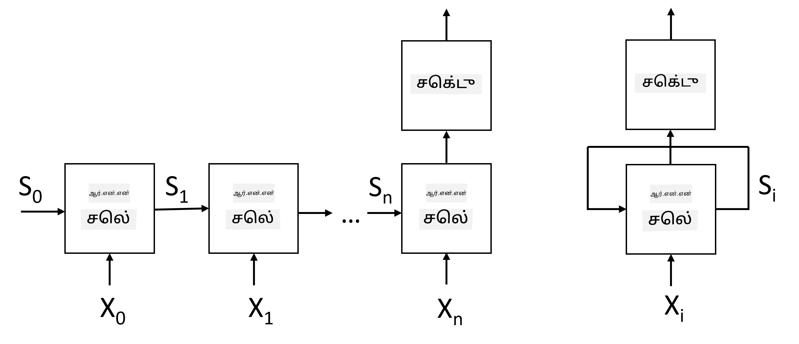
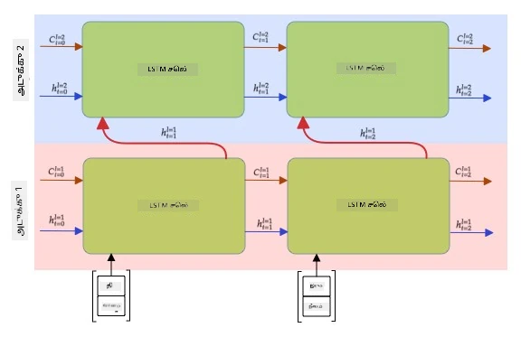

# மீண்டும் நிகழும் நரம்பியல் வலைகள்

## [முன்-வகுப்பு வினாடி வினா](https://ff-quizzes.netlify.app/en/ai/quiz/31)

முந்தைய பிரிவுகளில், நாங்கள் உரையின் செம்மையான அர்த்தங்களைப் பயன்படுத்தி, எம்பெடிங்குகளின் மேல் ஒரு எளிய நேரியல் வகைப்பாட்டாளரை பயன்படுத்தி வந்தோம். இந்த கட்டமைப்பு ஒரு வாக்கியத்தில் உள்ள சொற்களின் ஒருங்கிணைந்த அர்த்தத்தைப் பிடிக்கிறது, ஆனால் சொற்களின் **வரிசையை** கணக்கில் எடுத்துக்கொள்ளாது, ஏனெனில் எம்பெடிங்குகளின் மேல் உள்ள ஒருங்கிணைப்பு செயல்பாடு இந்த தகவலை மூல உரையிலிருந்து நீக்கிவிடுகிறது. இந்த மாதிரிகள் சொற்களின் வரிசையை மாதிரி செய்ய முடியாததால், உரை உருவாக்கம் அல்லது கேள்வி பதில் போன்ற சிக்கலான அல்லது குழப்பமான பணிகளைத் தீர்க்க முடியாது.

உரையின் வரிசை அர்த்தத்தைப் பிடிக்க, **மீண்டும் நிகழும் நரம்பியல் வலை**, அல்லது RNN எனப்படும் மற்றொரு நரம்பியல் வலை கட்டமைப்பைப் பயன்படுத்த வேண்டும். RNN இல், நாங்கள் எங்கள் வாக்கியத்தை ஒவ்வொரு சின்னத்தையும் ஒரு நேரத்தில் வலையமைப்பில் அனுப்புகிறோம், மற்றும் வலையமைப்பு சில **நிலை** உருவாக்குகிறது, அதை அடுத்த சின்னத்துடன் மீண்டும் வலையமைப்பில் அனுப்புகிறோம்.

> படத்தை உருவாக்கியவர்

சின்னங்களின் உள்ளீட்டு வரிசை X0,...,Xn கொடுக்கப்பட்டால், RNN நரம்பியல் வலைகள் வரிசையை உருவாக்குகிறது, மற்றும் இந்த வரிசையை முடிவுக்கு கொண்டு செல்ல ஒரு பின்செலுத்தல் செயல்பாட்டைப் பயன்படுத்தி பயிற்சி செய்கிறது. ஒவ்வொரு வலையமைப்பு தொகுதியும் (Xi,Si) என்ற ஜோடியை உள்ளீடாக எடுத்து, Si+1 என்ற முடிவை உருவாக்குகிறது. இறுதி நிலை Sn அல்லது (முடிவு Yn) ஒரு நேரியல் வகைப்பாட்டாளருக்கு அனுப்பப்படுகிறது முடிவை உருவாக்க. அனைத்து வலையமைப்பு தொகுதிகளும் ஒரே எடைகளைப் பகிர்ந்து கொள்கின்றன, மற்றும் ஒரு பின்செலுத்தல் செயல்பாட்டைப் பயன்படுத்தி முடிவுக்கு பயிற்சி செய்யப்படுகின்றன.

நிலை வெக்டர்கள் S0,...,Sn வலையமைப்பில் அனுப்பப்படுவதால், இது சொற்களுக்கிடையிலான வரிசை சார்புகளை கற்றுக்கொள்ள முடியும். உதாரணமாக, *not* என்ற சொல் வரிசையில் எங்காவது தோன்றும்போது, இது நிலை வெக்டரின் குறிப்பிட்ட கூறுகளை மறுக்க கற்றுக்கொள்ள முடியும், இது மறுப்பு விளைவாக இருக்கும்.

> ✅ மேலே உள்ள படத்தில் RNN தொகுதிகளின் எடைகள் பகிரப்பட்டுள்ளதால், ஒரே தொகுதியாக (வலது பக்கம்) மீண்டும் நிகழும் பின்னூட்டக் குருவுடன் இந்த படத்தை பிரதிநிதித்துவப்படுத்தலாம், இது வலையமைப்பின் வெளியீட்டு நிலையை உள்ளீட்டிற்கு மீண்டும் அனுப்புகிறது.

## RNN செல் அமைப்பு

ஒரு எளிய RNN செல் எப்படி அமைக்கப்பட்டுள்ளது என்பதை பார்ப்போம். இது முந்தைய நிலை Si-1 மற்றும் தற்போதைய சின்னம் Xi ஆகியவற்றை உள்ளீடாக ஏற்றுக்கொள்கிறது, மற்றும் வெளியீட்டு நிலை Si (மற்றும், சில நேரங்களில், நாங்கள் மற்றொரு வெளியீட்டு Yi இல் ஆர்வமாக இருக்கிறோம், உருவாக்க வலையமைப்புகளின் வழக்கில்).

ஒரு எளிய RNN செல்லில் இரண்டு எடை மடிக்கோவைகள் உள்ளன: ஒன்று உள்ளீட்டு சின்னத்தை மாற்றுகிறது (W என்று அழைக்கலாம்), மற்றொன்று உள்ளீட்டு நிலையை மாற்றுகிறது (H). இந்த வழக்கில் வலையமைப்பின் வெளியீடு &sigma;(W&times;Xi+H&times;Si-1+b) என கணக்கிடப்படுகிறது, இங்கு &sigma; செயல்பாட்டைச் செயல்படுத்தும் செயல்பாடு மற்றும் b கூடுதல் பாகுபாடு.

> படத்தை உருவாக்கியவர்

பல நேரங்களில், உள்ளீட்டு சின்னங்கள் RNN இல் நுழைவதற்கு முன் எம்பெடிங் அடுக்கு மூலம் அனுப்பப்படுகின்றன, இது பரிமாணத்தை குறைக்கிறது. இந்த வழக்கில், உள்ளீட்டு வெக்டர்களின் பரிமாணம் *emb_size* மற்றும் நிலை வெக்டர் *hid_size* என்றால் - W இன் அளவு *emb_size*&times;*hid_size*, மற்றும் H இன் அளவு *hid_size*&times;*hid_size*.

## நீண்ட குறுகிய கால நினைவகம் (LSTM)

சாதாரண RNN களின் முக்கிய பிரச்சனைகளில் ஒன்று **மங்கும் சாய்வு** பிரச்சனை. RNN கள் ஒரு பின்செலுத்தல் செயல்பாட்டில் முடிவுக்கு பயிற்சி செய்யப்படுவதால், இது பிழையை வலையமைப்பின் முதல் அடுக்கு வரை பரப்புவதில் சிரமம் அடைகிறது, எனவே வலையமைப்பு தொலைதூர சின்னங்களுக்கிடையிலான உறவுகளை கற்றுக்கொள்ள முடியாது. இந்த பிரச்சனையைத் தவிர்க்க ஒரு வழி **வெளிப்படையான நிலை மேலாண்மை** அறிமுகப்படுத்துவது, **கேடுகள்** எனப்படும். இந்த வகையான இரண்டு பிரபலமான கட்டமைப்புகள் உள்ளன: **நீண்ட குறுகிய கால நினைவகம்** (LSTM) மற்றும் **கேடட் ரிலே யூனிட்** (GRU).

> படத்தின் மூலத்தைத் தீர்மானிக்க வேண்டும்

LSTM வலையமைப்பு RNN போலவே அமைக்கப்பட்டுள்ளது, ஆனால் இரண்டு நிலைகள் அடுக்கு முதல் அடுக்கு வரை அனுப்பப்படுகின்றன: உண்மையான நிலை C மற்றும் மறைக்கப்பட்ட வெக்டர் H. ஒவ்வொரு அலகிலும், மறைக்கப்பட்ட வெக்டர் Hi மற்றும் உள்ளீட்டு Xi இணைக்கப்பட்டு, **கேடுகள்** மூலம் நிலை C இல் என்ன நடக்கிறது என்பதை கட்டுப்படுத்துகின்றன. ஒவ்வொரு கேடும் சிக்மாய்டு செயல்பாட்டுடன் (வெளியீடு [0,1] வரம்பில்) ஒரு நரம்பியல் வலையமைப்பாகும், இது நிலை வெக்டருடன் பெருக்கப்பட்டால் பிட்ட்வைஸ் மாஸ்க் எனக் கருதலாம். கீழே உள்ள கேடுகள் உள்ளன (படத்தில் இடது பக்கம் முதல் வலது பக்கம் வரை):

* **மறக்க கேடு** மறைக்கப்பட்ட வெக்டரை எடுத்து, வெக்டர் C இன் எந்த கூறுகளை நாம் மறக்க வேண்டும், மற்றும் எவை வழியாக அனுப்ப வேண்டும் என்பதைத் தீர்மானிக்கிறது.
* **உள்ளீட்டு கேடு** உள்ளீட்டு மற்றும் மறைக்கப்பட்ட வெக்டர்களிலிருந்து சில தகவல்களை எடுத்து, நிலைக்கு சேர்க்கிறது.
* **வெளியீட்டு கேடு** நிலையை *tanh* செயல்பாட்டுடன் ஒரு நேரியல் அடுக்கு மூலம் மாற்றுகிறது, பின்னர் புதிய நிலை Ci+1 உருவாக்குவதற்கு Hi மறைக்கப்பட்ட வெக்டரைப் பயன்படுத்தி அதன் கூறுகளைத் தேர்ந்தெடுக்கிறது.

நிலை C இன் கூறுகளை சில கொடிகள் போலவே மாற்றலாம். உதாரணமாக, வரிசையில் *Alice* என்ற பெயரை சந்திக்கும்போது, இது ஒரு பெண் கதாபாத்திரத்தை குறிக்கிறது என்று கருதலாம், மற்றும் வாக்கியத்தில் ஒரு பெண் பெயர்ச்சொல் உள்ளது என்று நிலை கொடியை உயர்த்தலாம். பின்னர் *and Tom* என்ற சொற்றொடர்களை சந்திக்கும்போது, பலவினை பெயர்ச்சொல் உள்ளது என்று கொடியை உயர்த்துவோம். எனவே நிலையை மாற்றுவதன் மூலம், வாக்கியத்தின் இலக்கண பண்புகளை கண்காணிக்க முடியும்.

> ✅ LSTM இன் உள்துறை செயல்பாடுகளைப் புரிந்துகொள்ள சிறந்த வளம், Christopher Olah எழுதிய [Understanding LSTM Networks](https://colah.github.io/posts/2015-08-Understanding-LSTMs/) என்ற இந்த சிறந்த கட்டுரை.

## இருவழி மற்றும் பல அடுக்கு RNN கள்

நாம் ஒரு திசையில் செயல்படும் மீண்டும் நிகழும் வலையமைப்புகளைப் பற்றி விவாதித்தோம், வரிசையின் தொடக்கத்திலிருந்து முடிவிற்கு. இது இயல்பாகத் தெரிகிறது, ஏனெனில் இது நாம் படிக்கும் மற்றும் பேச்சைக் கேட்கும் முறையை ஒத்திருக்கிறது. ஆனால், பல நடைமுறை வழக்குகளில், உள்ளீட்டு வரிசைக்கு சீரற்ற அணுகல் உள்ளதால், மீண்டும் நிகழும் கணக்கீட்டை இரு திசைகளிலும் இயக்குவது பொருத்தமாக இருக்கலாம். இப்படியான வலையமைப்புகள் **இருவழி** RNN கள் என அழைக்கப்படுகின்றன. இருவழி வலையமைப்புடன் செயல்படும்போது, ஒவ்வொரு திசைக்கும் ஒரு மறைக்கப்பட்ட நிலை வெக்டர் தேவைப்படும்.

ஒரு மீண்டும் நிகழும் வலையமைப்பு, ஒரு திசை அல்லது இருவழி, ஒரு வரிசையின் குறிப்பிட்ட முறைமைகளைப் பிடிக்கிறது, மற்றும் அவற்றை நிலை வெக்டரில் சேமிக்க அல்லது வெளியீட்டிற்கு அனுப்ப முடியும். குவியல்முறை வலையமைப்புகளின் வழக்கில், முதல் அடுக்கால் எடுக்கப்பட்ட குறைந்த நிலை முறைமைகளிலிருந்து கட்டமைக்க, முதல் அடுக்கால் எடுக்கப்பட்ட குறைந்த நிலை முறைமைகளைப் பிடிக்க மற்றொரு மீண்டும் நிகழும் அடுக்கை மேலே கட்டமைக்கலாம். இது **பல அடுக்கு RNN** என்ற கருத்துக்கு வழிவகுக்கிறது, இது இரண்டு அல்லது அதற்கு மேற்பட்ட மீண்டும் நிகழும் வலையமைப்புகளைக் கொண்டுள்ளது, இதில் முந்தைய அடுக்கின் வெளியீடு அடுத்த அடுக்கிற்கு உள்ளீடாக அனுப்பப்படுகிறது.

*Fernando López எழுதிய [இந்த அற்புதமான பதிவிலிருந்து](https://towardsdatascience.com/from-a-lstm-cell-to-a-multilayer-lstm-network-with-pytorch-2899eb5696f3) படம்*

## ✍️ பயிற்சிகள்: எம்பெடிங்குகள்

பின்வரும் நோட்புக்குகளில் உங்கள் கற்றலை தொடருங்கள்:

* [PyTorch உடன் RNN கள்](RNNPyTorch.ipynb)
* [TensorFlow உடன் RNN கள்](RNNTF.ipynb)

## முடிவு

இந்த அலகில், வரிசை வகைப்பாட்டிற்காக RNN களைப் பயன்படுத்தலாம் என்பதை நாங்கள் பார்த்தோம், ஆனால் உண்மையில், அவை உரை உருவாக்கம், இயந்திர மொழிபெயர்ப்பு மற்றும் பலவற்றைச் செய்ய முடியும். அடுத்த அலகில், அந்த பணிகளை நாங்கள் பரிசீலிப்போம்.

## 🚀 சவால்

LSTM களின் பயன்பாடுகளைப் பற்றிய சில இலக்கியங்களைப் படிக்கவும்:

- [Grid Long Short-Term Memory](https://arxiv.org/pdf/1507.01526v1.pdf)
- [Show, Attend and Tell: Neural Image Caption
Generation with Visual Attention](https://arxiv.org/pdf/1502.03044v2.pdf)

## [பின்-வகுப்பு வினாடி வினா](https://ff-quizzes.netlify.app/en/ai/quiz/32)

## மதிப்பீடு & சுய கற்றல்

- Christopher Olah எழுதிய [Understanding LSTM Networks](https://colah.github.io/posts/2015-08-Understanding-LSTMs/).

## [பணி: நோட்புக்குகள்](assignment.md)

---

**குறிப்பு**:  
இந்த ஆவணம் [Co-op Translator](https://github.com/Azure/co-op-translator) என்ற AI மொழிபெயர்ப்பு சேவையைப் பயன்படுத்தி மொழிபெயர்க்கப்பட்டுள்ளது. நாங்கள் துல்லியத்திற்காக முயற்சிக்கின்றோம், ஆனால் தானியக்க மொழிபெயர்ப்புகளில் பிழைகள் அல்லது தவறான தகவல்கள் இருக்கக்கூடும் என்பதை தயவுசெய்து கவனத்தில் கொள்ளுங்கள். அதன் தாய்மொழியில் உள்ள மூல ஆவணம் அதிகாரப்பூர்வ ஆதாரமாக கருதப்பட வேண்டும். முக்கியமான தகவல்களுக்கு, தொழில்முறை மனித மொழிபெயர்ப்பு பரிந்துரைக்கப்படுகிறது. இந்த மொழிபெயர்ப்பைப் பயன்படுத்துவதால் ஏற்படும் எந்த தவறான புரிதல்கள் அல்லது தவறான விளக்கங்களுக்கு நாங்கள் பொறுப்பல்ல.