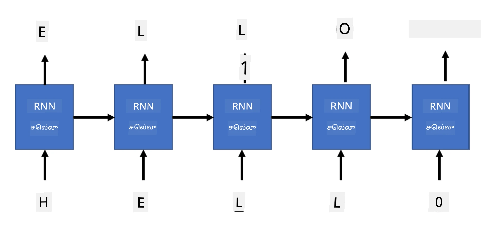

# ஜெனரேட்டிவ் நெட்வொர்க்கள்

## [முன்-வகுப்பு வினாடி வினா](https://ff-quizzes.netlify.app/en/ai/quiz/33)

மீளும் நரம்பியல் நெட்வொர்க்கள் (RNNs) மற்றும் அவற்றின் கதவுகள் கொண்ட செல்கள், Long Short Term Memory Cells (LSTMs) மற்றும் Gated Recurrent Units (GRUs) போன்றவை, மொழி மாதிரியாக்கத்திற்கான ஒரு முறை வழங்குகின்றன. இவை வார்த்தைகளின் வரிசையை கற்றுக்கொண்டு, வரிசையில் அடுத்த வார்த்தைக்கான கணிப்புகளை வழங்க முடியும். இதனால், RNNகளை **ஜெனரேட்டிவ் பணிகள்** போன்ற சாதாரண உரை உருவாக்கம், இயந்திர மொழிபெயர்ப்பு மற்றும் படங்களுக்கு விளக்க உரை உருவாக்கம் போன்றவற்றில் பயன்படுத்த முடிகிறது.

> ✅ நீங்கள் தட்டச்சு செய்யும் போது உரை முடிவுறுத்தல் போன்ற ஜெனரேட்டிவ் பணிகளின் பலன்களை அனுபவித்த அனைத்து நேரங்களையும் நினைவுகூருங்கள். உங்கள் விருப்பமான பயன்பாடுகளை ஆராய்ந்து, அவை RNNகளை பயன்படுத்தியதா என்பதை பாருங்கள்.

முந்தைய அலகில் RNN கட்டமைப்பை விவாதித்தபோது, ஒவ்வொரு RNN யூனிடும் அடுத்த மறைமாநிலத்தை வெளியீடாக உருவாக்கியது. ஆனால், ஒவ்வொரு மீளும் யூனிடுக்கும் மற்றொரு வெளியீட்டை சேர்க்கவும் முடியும், இது ஒரு **வரிசையை** (மூல வரிசைக்கு சமமான நீளத்தில்) வெளியிட அனுமதிக்கும். மேலும், ஒவ்வொரு படியிலும் உள்ளீட்டை ஏற்காத RNN யூனிட்களை பயன்படுத்த முடியும்; இவை ஒரு ஆரம்ப நிலை வெக்டரை மட்டும் எடுத்து, பின்னர் வெளியீட்டு வரிசையை உருவாக்கும்.

இதனால், கீழே உள்ள படத்தில் காட்டப்பட்டுள்ள பல்வேறு நரம்பியல் கட்டமைப்புகள் உருவாகின்றன:


> [Andrej Karpaty](http://karpathy.github.io/) எழுதிய [Unreasonable Effectiveness of Recurrent Neural Networks](http://karpathy.github.io/2015/05/21/rnn-effectiveness/) என்ற வலைப்பதிவிலிருந்து படம்

* **ஒன்று-ஒன்று** என்பது ஒரு பாரம்பரிய நரம்பியல் நெட்வொர்க், இதில் ஒரு உள்ளீடு மற்றும் ஒரு வெளியீடு உள்ளது.
* **ஒன்று-பல** என்பது ஒரு ஜெனரேட்டிவ் கட்டமைப்பு, இது ஒரு உள்ளீட்டு மதிப்பை ஏற்றுக்கொண்டு, வெளியீட்டு மதிப்புகளின் வரிசையை உருவாக்குகிறது. உதாரணமாக, ஒரு **பட விளக்க உரை** நெட்வொர்க்கை பயிற்சி செய்ய விரும்பினால், ஒரு படத்தை உள்ளீடாக எடுத்து, அதை CNN மூலம் அதன் மறைமாநிலத்தை பெற, பின்னர் ஒரு மீளும் சங்கிலி வார்த்தை வார்த்தையாக விளக்கத்தை உருவாக்கலாம்.
* **பல-ஒன்று** என்பது முந்தைய அலகில் விவாதிக்கப்பட்ட RNN கட்டமைப்புகளுக்கு இணையானது, உதாரணமாக உரை வகைப்படுத்தல்.
* **பல-பல**, அல்லது **வரிசை-வரிசை** என்பது **இயந்திர மொழிபெயர்ப்பு** போன்ற பணிகளுக்கு இணையானது, இதில் முதல் RNN உள்ளீட்டு வரிசையிலிருந்து அனைத்து தகவல்களையும் மறைமாநிலத்தில் சேகரிக்கிறது, மற்றும் மற்றொரு RNN சங்கிலி இந்த நிலையை வெளியீட்டு வரிசையாக விரிக்கிறது.

இந்த அலகில், எளிய ஜெனரேட்டிவ் மாதிரிகளை கவனமாக ஆராய்வோம், இது எங்களுக்கு உரையை உருவாக்க உதவுகிறது. எளிமைக்காக, எழுத்து மட்டத்திலான டோக்கனீசேஷனை பயன்படுத்துவோம்.

இந்த RNN-ஐ படி படியாக உரை உருவாக்க பயிற்சி செய்யலாம். ஒவ்வொரு படியிலும், `nchars` நீளத்திலான எழுத்துக்களின் வரிசையை எடுத்து, ஒவ்வொரு உள்ளீட்டு எழுத்துக்கான அடுத்த வெளியீட்டு எழுத்தை நெட்வொர்க்கிடம் கேட்போம்:



உரை உருவாக்கும் போது (தீர்மானத்தில்), சில **தூண்டுதல்** மூலம் தொடங்குவோம், இது RNN செல்களுக்குள் செலுத்தப்பட்டு அதன் இடைநிலை நிலையை உருவாக்கும், பின்னர் இந்த நிலையிலிருந்து உருவாக்கம் தொடங்கும். ஒவ்வொரு நேரத்திலும் ஒரு எழுத்தை உருவாக்கி, அந்த நிலை மற்றும் உருவாக்கப்பட்ட எழுத்தை மற்றொரு RNN செலுக்கு அனுப்பி அடுத்த எழுத்தை உருவாக்குவோம், தேவையான அளவு எழுத்துகளை உருவாக்கும் வரை.


> எழுத்தாளர் உருவாக்கிய படம்

## ✍️ பயிற்சிகள்: ஜெனரேட்டிவ் நெட்வொர்க்கள்

கீழே உள்ள நோட்புக்குகளில் உங்கள் கற்றலை தொடருங்கள்:

* [PyTorch மூலம் ஜெனரேட்டிவ் நெட்வொர்க்கள்](GenerativePyTorch.ipynb)
* [TensorFlow மூலம் ஜெனரேட்டிவ் நெட்வொர்க்கள்](GenerativeTF.ipynb)

## மென்மையான உரை உருவாக்கம் மற்றும் வெப்பநிலை

ஒவ்வொரு RNN செலின் வெளியீடு எழுத்துக்களின் சாத்தியமான விநியோகமாகும். உருவாக்கப்பட்ட உரையில் அடுத்த எழுத்தாக எப்போதும் அதிக சாத்தியமுள்ள எழுத்தை எடுத்தால், உரை "சுழல்கிறது" மற்றும் மீண்டும் மீண்டும் ஒரே எழுத்து வரிசைகளில் சிக்கிக்கொள்ளும், இதுபோன்ற உதாரணத்தில்:

```
today of the second the company and a second the company ...
```
  
ஆனால், அடுத்த எழுத்துக்கான சாத்தியமான விநியோகத்தை பார்க்கும்போது, சில அதிக சாத்தியமுள்ள எழுத்துகளுக்கு இடையேயான வேறுபாடு மிகப்பெரியதாக இருக்காது, உதாரணமாக, ஒரு எழுத்துக்கு சாத்தியம் 0.2, மற்றொன்றுக்கு 0.19 போன்றது. உதாரணமாக, '*play*' என்ற வரிசையில் அடுத்த எழுத்து இடைவெளி அல்லது **e** (உதாரணமாக *player* என்ற வார்த்தையில்) இரண்டுமே சமமாக இருக்கலாம்.

இதனால், அதிக சாத்தியமுள்ள எழுத்தை எடுப்பது "நியாயமானது" அல்ல, ஏனெனில் இரண்டாவது அதிக சாத்தியமுள்ள எழுத்தை தேர்வு செய்தாலும் பொருத்தமான உரைக்கு வழிவகுக்கும். இது நெட்வொர்க்கின் வெளியீட்டில் வழங்கப்பட்ட சாத்தியமான விநியோகத்திலிருந்து எழுத்துக்களை **மாதிரி** எடுப்பது புத்திசாலித்தனமாக இருக்கும். மேலும், **வெப்பநிலை** என்ற அளவீட்டை பயன்படுத்தலாம், இது சாத்தியமான விநியோகத்தை சமமாக்கும், அதிக சீரற்ற தன்மையை சேர்க்க விரும்பினால், அல்லது அதிக சாத்தியமுள்ள எழுத்துக்களை அதிகமாக பின்பற்ற விரும்பினால், அதை கூர்மையாக மாற்றலாம்.

மேலே இணைக்கப்பட்ட நோட்புக்குகளில் இந்த மென்மையான உரை உருவாக்கம் எப்படி செயல்படுத்தப்படுகிறது என்பதை ஆராயுங்கள்.

## முடிவு

உரை உருவாக்கம் தன்னிச்சையாக பயனுள்ளதாக இருக்கலாம், ஆனால் முக்கியமான நன்மைகள் RNNகளை பயன்படுத்தி சில ஆரம்ப அம்ச வெக்டரிலிருந்து உரை உருவாக்கும் திறனிலிருந்து வருகிறது. உதாரணமாக, உரை உருவாக்கம் இயந்திர மொழிபெயர்ப்பில் (வரிசை-வரிசை, இதில் *என்கோடர்* நிலை வெக்டர் பயன்படுத்தி மொழிபெயர்க்கப்பட்ட செய்தியை உருவாக்க அல்லது *டிகோடு* செய்ய) அல்லது படத்தின் உரை விளக்கத்தை உருவாக்க (இதில் அம்ச வெக்டர் CNN எக்ஸ்ட்ராக்டரிலிருந்து வரும்) பயன்படுத்தப்படுகிறது.

## 🚀 சவால்

இந்த தலைப்பில் Microsoft Learn பாடங்களை எடுத்துக்கொள்ளுங்கள்

* [PyTorch](https://docs.microsoft.com/learn/modules/intro-natural-language-processing-pytorch/6-generative-networks/?WT.mc_id=academic-77998-cacaste)/[TensorFlow](https://docs.microsoft.com/learn/modules/intro-natural-language-processing-tensorflow/5-generative-networks/?WT.mc_id=academic-77998-cacaste) மூலம் உரை உருவாக்கம்

## [பிந்தைய வகுப்பு வினாடி வினா](https://ff-quizzes.netlify.app/en/ai/quiz/34)

## மதிப்பீடு & சுய கற்றல்

உங்கள் அறிவை விரிவாக்க சில கட்டுரைகள் இங்கே

* Markov Chain, LSTM மற்றும் GPT-2 மூலம் உரை உருவாக்கத்திற்கு மாறுபட்ட அணுகுமுறைகள்: [வலைப்பதிவு](https://towardsdatascience.com/text-generation-gpt-2-lstm-markov-chain-9ea371820e1e)
* [Keras ஆவணத்தில்](https://keras.io/examples/generative/lstm_character_level_text_generation/) உரை உருவாக்க மாதிரி

## [பணி](lab/README.md)

எழுத்து-எழுத்தாக உரை உருவாக்கத்தை எப்படி செய்யலாம் என்பதை நாம் பார்த்தோம். ஆய்வகத்தில், வார்த்தை மட்டத்திலான உரை உருவாக்கத்தை நீங்கள் ஆராய்வீர்கள்.

---

**குறிப்பு**:  
இந்த ஆவணம் [Co-op Translator](https://github.com/Azure/co-op-translator) என்ற AI மொழிபெயர்ப்பு சேவையைப் பயன்படுத்தி மொழிபெயர்க்கப்பட்டுள்ளது. நாங்கள் துல்லியத்திற்காக முயற்சிக்கின்றோம், ஆனால் தானியங்கி மொழிபெயர்ப்புகளில் பிழைகள் அல்லது தவறான தகவல்கள் இருக்கக்கூடும் என்பதை தயவுசெய்து கவனத்தில் கொள்ளுங்கள். அதன் தாய்மொழியில் உள்ள மூல ஆவணம் அதிகாரப்பூர்வ ஆதாரமாக கருதப்பட வேண்டும். முக்கியமான தகவல்களுக்கு, தொழில்முறை மனித மொழிபெயர்ப்பு பரிந்துரைக்கப்படுகிறது. இந்த மொழிபெயர்ப்பைப் பயன்படுத்துவதால் ஏற்படும் எந்த தவறான புரிதல்கள் அல்லது தவறான விளக்கங்களுக்கு நாங்கள் பொறுப்பல்ல.