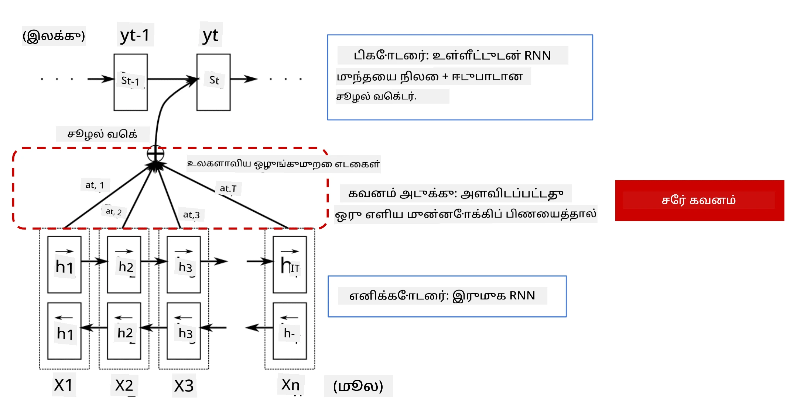
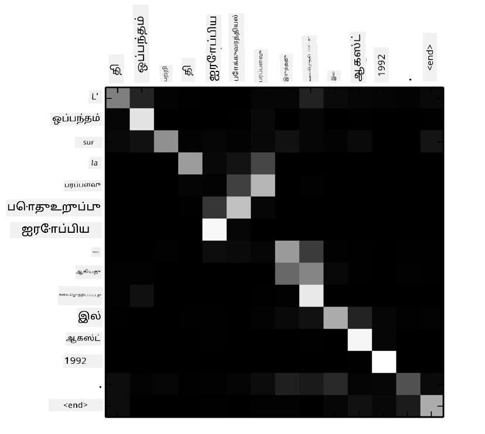
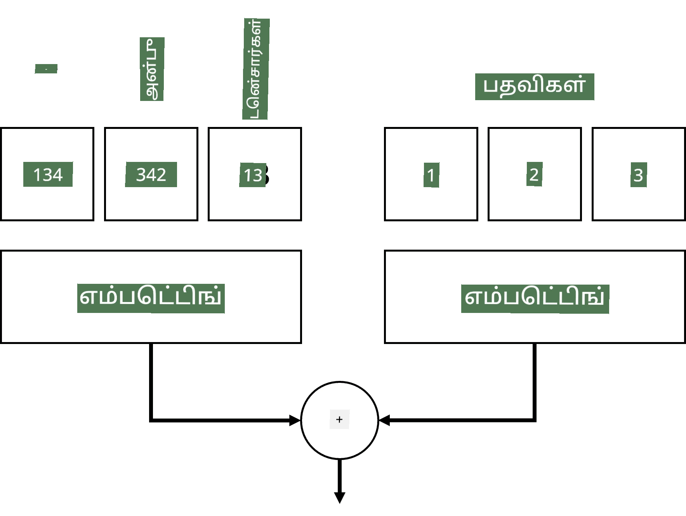
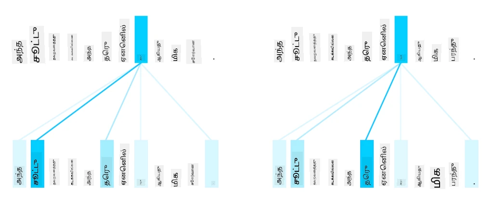
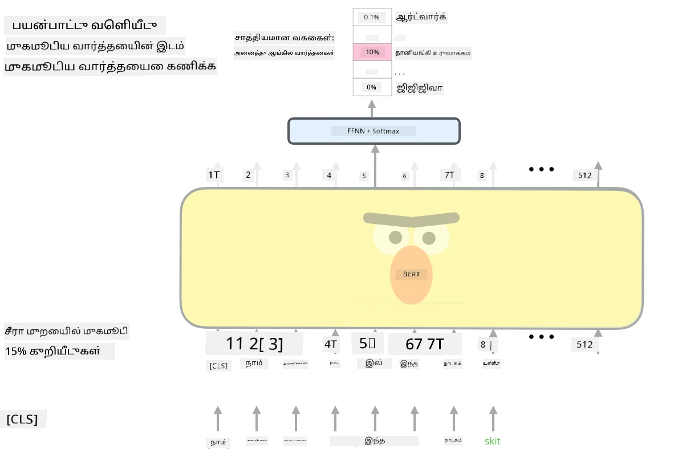

# கவன механизмங்கள் மற்றும் டிரான்ஸ்ஃபார்மர்கள்

## [முன்-வகுப்பு வினாடி வினா](https://ff-quizzes.netlify.app/en/ai/quiz/35)

NLP துறையின் முக்கியமான பிரச்சனைகளில் ஒன்று **இயந்திர மொழிபெயர்ப்பு** ஆகும், இது Google Translate போன்ற கருவிகளின் அடிப்படையான பணியாகும். இந்த பிரிவில், இயந்திர மொழிபெயர்ப்பில் கவனம் செலுத்துவோம், அல்லது பொதுவாக, எந்த *வரிசை-முதல்-வரிசை* பணியிலும் (இது **வாக்கிய மாற்றம்** என்றும் அழைக்கப்படுகிறது).

RNNகளுடன், வரிசை-முதல்-வரிசை இரண்டு மீள்நினைவூட்டும் நெட்வொர்க்குகளால் செயல்படுத்தப்படுகிறது, இதில் ஒரு நெட்வொர்க், **என்கோடர்**, உள்ளீட்டு வரிசையை ஒரு மறைமாநிலமாக சுருக்குகிறது, மற்றொரு நெட்வொர்க், **டிகோடர்**, இந்த மறைமாநிலத்தை மொழிபெயர்க்கப்பட்ட முடிவாக விரிக்கிறது. இந்த அணுகுமுறையில் சில பிரச்சனைகள் உள்ளன:

* என்கோடர் நெட்வொர்க்கின் இறுதி நிலை ஒரு வாக்கியத்தின் தொடக்கத்தை நினைவில் வைத்துக்கொள்ள கடினமாக உள்ளது, இதனால் நீண்ட வாக்கியங்களுக்கு மாடலின் தரம் குறைவாகிறது.
* ஒரு வரிசையில் உள்ள அனைத்து வார்த்தைகளும் முடிவில் ஒரே தாக்கத்தை ஏற்படுத்துகின்றன. ஆனால் உண்மையில், உள்ளீட்டு வரிசையில் உள்ள குறிப்பிட்ட வார்த்தைகள் மற்றவற்றை விட தொடர்ச்சியான வெளியீடுகளில் அதிக தாக்கத்தை ஏற்படுத்துகின்றன.

**கவன механизмங்கள்** RNN இன் ஒவ்வொரு வெளியீட்டு கணிப்பில் உள்ளீட்டு வெக்டரின் சூழலியல் தாக்கத்தை எடுக்கும் ஒரு வழியை வழங்குகின்றன. இது செயல்படுத்தப்படும் விதம், உள்ளீட்டு RNN மற்றும் வெளியீட்டு RNN இன் இடைநிலை நிலைகளுக்கு இடையே குறுக்குவழிகளை உருவாக்குவதன் மூலம். இந்த முறையில், yt வெளியீட்டு சின்னத்தை உருவாக்கும்போது, ​​hi உள்ளீட்டு மறைமாநிலங்களை, வெவ்வேறு எடை குணகங்கள் &alpha;t,i உடன் கணக்கில் எடுத்துக்கொள்வோம்.

> [Bahdanau et al., 2015](https://arxiv.org/pdf/1409.0473.pdf) இல் சேர்க்கை கவன механизмம் கொண்ட என்கோடர்-டிகோடர் மாடல், [இந்த வலைப்பதிவு](https://lilianweng.github.io/lil-log/2018/06/24/attention-attention.html) இல் மேற்கோள்.

கவன அணி {&alpha;i,j} என்பது ஒரு வெளியீட்டு வரிசையில் ஒரு குறிப்பிட்ட வார்த்தையை உருவாக்குவதில் சில உள்ளீட்டு வார்த்தைகள் விளையாடும் அளவை பிரதிநிதித்துவப்படுத்தும். கீழே ஒரு அத்தகைய அணி எடுத்துக்காட்டாக உள்ளது:

> [Bahdanau et al., 2015](https://arxiv.org/pdf/1409.0473.pdf) (Fig.3) இல் இருந்து எடுத்த படம்

கவன механизмங்கள் NLP இல் தற்போதைய அல்லது தற்போதைய நிலைமையைப் பெரும்பாலும் பொறுப்பாக உள்ளன. கவனத்தைச் சேர்ப்பது மாடல் அளவுருக்களின் எண்ணிக்கையை பெரிதும் அதிகரிக்கிறது, இது RNNகளுடன் அளவீட்டு சிக்கல்களை ஏற்படுத்தியது. RNNகளை அளவீட்டில் ஒரு முக்கிய கட்டுப்பாடு என்பது மாடல்களின் மீள்நினைவூட்டும் தன்மை பயிற்சியை தொகுதி மற்றும் இணைபார்க்க சிக்கலாக்குகிறது. RNN இல் ஒரு வரிசையின் ஒவ்வொரு கூறும் தொடர்ச்சியான வரிசையில் செயல்படுத்தப்பட வேண்டும், இது எளிதாக இணைபார்க்க முடியாது என்பதைக் குறிக்கிறது.

> [Google வலைப்பதிவு](https://research.googleblog.com/2016/09/a-neural-network-for-machine.html) இல் இருந்து எடுத்த படம்

கவன механизмங்களை ஏற்றுக்கொள்வது மற்றும் இந்த கட்டுப்பாட்டுடன் இணைந்து, இன்று நாம் அறிந்த மற்றும் பயன்படுத்தும் நிலைமையான டிரான்ஸ்ஃபார்மர் மாடல்களின் உருவாக்கத்துக்கு வழிவகுத்தது, உதாரணமாக BERT முதல் Open-GPT3 வரை.

## டிரான்ஸ்ஃபார்மர் மாடல்கள்

டிரான்ஸ்ஃபார்மர்களின் முக்கியமான யோசனைகளில் ஒன்று RNNகளின் தொடர்ச்சியான தன்மையைத் தவிர்க்கவும், பயிற்சியின் போது இணைபார்க்கக்கூடிய மாடலை உருவாக்கவும். இது இரண்டு யோசனைகளை செயல்படுத்துவதன் மூலம் அடையப்படுகிறது:

* நிலை குறியீடு
* RNNகள் (அல்லது CNNகள்) பதிலாக முறைபாடுகளைப் பிடிக்க **சுய-கவன механизмம்** பயன்படுத்துதல் (அதனால் டிரான்ஸ்ஃபார்மர்களை அறிமுகப்படுத்தும் ஆவணம் *[Attention is all you need](https://arxiv.org/abs/1706.03762)* என்று அழைக்கப்படுகிறது)

### நிலை குறியீடு/எம்பெடிங்

நிலை குறியீட்டின் யோசனை பின்வருமாறு:
1. RNNகளைப் பயன்படுத்தும்போது, ​​டோக்கன்களின் தொடர்புடைய நிலை படிகளின் எண்ணிக்கையால் பிரதிநிதித்துவப்படுத்தப்படுகிறது, எனவே வெளிப்படையாக பிரதிநிதித்துவப்படுத்த தேவையில்லை.
2. ஆனால் கவனத்தை மாற்றியவுடன், ஒரு வரிசையில் உள்ள டோக்கன்களின் தொடர்புடைய நிலைகளை அறிய வேண்டும்.
3. நிலை குறியீட்டை பெற, டோக்கன்களின் வரிசையுடன் வரிசையில் டோக்கன் நிலைகளின் வரிசையை (அதாவது, 0,1, ...) சேர்க்கிறோம்.
4. பின்னர் டோக்கன் எம்பெடிங் வெக்டருடன் டோக்கன் நிலையை கலக்கிறோம். நிலையை (முழு எண்) வெக்டராக மாற்ற, நாம் வெவ்வேறு அணுகுமுறைகளைப் பயன்படுத்தலாம்:

* டோக்கன் எம்பெடிங் போன்ற பயிற்சி செய்யக்கூடிய எம்பெடிங். இது இங்கு நாம் கருதும் அணுகுமுறை. டோக்கன்களுக்கும் அவற்றின் நிலைகளுக்கும் மேல் எம்பெடிங் அடுக்குகளைப் பயன்படுத்துகிறோம், இதனால் ஒரே பரிமாணங்களின் எம்பெடிங் வெக்டர்கள் கிடைக்கின்றன, பின்னர் அவற்றை ஒன்றாகச் சேர்க்கிறோம்.
* அசையாத நிலை குறியீட்டு செயல்பாடு, அசல் ஆவணத்தில் முன்மொழியப்பட்டது.

> எழுத்தாளரின் படம்

நிலை எம்பெடிங் மூலம் நாம் பெறும் முடிவு, அசல் டோக்கனையும் அதன் வரிசையிலுள்ள நிலையையும் எம்பெடிங் செய்கிறது.

### மல்டி-ஹெடட் சுய-கவனம்

அடுத்ததாக, நமது வரிசையில் சில முறைபாடுகளைப் பிடிக்க வேண்டும். இதைச் செய்ய, டிரான்ஸ்ஃபார்மர்கள் **சுய-கவன механизмம்** பயன்படுத்துகின்றன, இது உள்ளீட்டு மற்றும் வெளியீட்டாக ஒரே வரிசையில் கவனம் செலுத்துவது ஆகும். சுய-கவனத்தைப் பயன்படுத்துவது வாக்கியத்தின் **சூழலத்தை** கணக்கில் எடுத்துக்கொள்ளவும், எந்த வார்த்தைகள் தொடர்புடையவை என்பதைப் பார்க்கவும் உதவுகிறது. உதாரணமாக, *it* போன்ற இணைப்புகள் எந்த வார்த்தைகளை குறிப்பிடுகின்றன என்பதைப் பார்க்கவும், சூழலத்தை கணக்கில் எடுத்துக்கொள்ளவும் உதவுகிறது:

> [Google வலைப்பதிவு](https://research.googleblog.com/2017/08/transformer-novel-neural-network.html) இல் இருந்து எடுத்த படம்

டிரான்ஸ்ஃபார்மர்களில், **மல்டி-ஹெடட் கவனம்** பயன்படுத்தப்படுகிறது, இது நெட்வொர்க்கிற்கு பல்வேறு வகையான சார்புகளைப் பிடிக்க சக்தியை வழங்குகிறது, உதாரணமாக, நீண்டகாலம் மற்றும் குறுகியகால வார்த்தை உறவுகள், இணைப்பு மற்றும் வேறு ஏதோ போன்றவை.

[TensorFlow Notebook](TransformersTF.ipynb) டிரான்ஸ்ஃபார்மர் அடுக்குகளின் செயல்பாட்டில் மேலும் விவரங்களை உள்ளடக்கியது.

### என்கோடர்-டிகோடர் கவனம்

டிரான்ஸ்ஃபார்மர்களில், கவனம் இரண்டு இடங்களில் பயன்படுத்தப்படுகிறது:

* உள்ளீட்டு உரையில் முறைபாடுகளைப் பிடிக்க சுய-கவனம்
* வரிசை மொழிபெயர்ப்பு செய்ய - இது என்கோடர் மற்றும் டிகோடருக்கு இடையிலான கவன அடுக்கு.

என்கோடர்-டிகோடர் கவனம் RNNகளில் பயன்படுத்தப்படும் கவன механизмத்திற்கு மிகவும் ஒத்ததாக உள்ளது, இந்த பிரிவின் தொடக்கத்தில் விவரிக்கப்பட்டது. இந்த அனிமேஷன் வரைபடம் என்கோடர்-டிகோடர் கவனத்தின் பங்கைக் கூறுகிறது.

ஒவ்வொரு உள்ளீட்டு நிலையும் ஒவ்வொரு வெளியீட்டு நிலைக்கு தனித்தனியாக வரைமுறைப்படுத்தப்படுவதால், டிரான்ஸ்ஃபார்மர்கள் RNNகளை விட சிறப்பாக இணைபார்க்க முடியும், இது மிகவும் பெரிய மற்றும் வெளிப்படையான மொழி மாடல்களை இயக்குகிறது. ஒவ்வொரு கவன தலைவும் வார்த்தைகளுக்கு இடையிலான வெவ்வேறு உறவுகளை கற்றுக்கொள்வதற்கு பயன்படுத்தப்படலாம், இது கீழ்மட்ட இயற்கை மொழி செயலாக்க பணிகளை மேம்படுத்துகிறது.

## BERT

**BERT** (Bidirectional Encoder Representations from Transformers) என்பது 12 அடுக்குகளைக் கொண்ட *BERT-base* மற்றும் 24 அடுக்குகளைக் கொண்ட *BERT-large* ஆகியவற்றுடன் மிகப்பெரிய பல அடுக்கு டிரான்ஸ்ஃபார்மர் நெட்வொர்க் ஆகும். மாடல் முதலில் ஒரு பெரிய உரை தரவுத்தொகுப்பில் (WikiPedia + புத்தகங்கள்) மேற்பயிற்சி செய்யப்படுகிறது, இது கண்காணிக்கப்படாத பயிற்சியைப் (ஒரு வாக்கியத்தில் மறைக்கப்பட்ட வார்த்தைகளை கணிக்க) பயன்படுத்துகிறது. மேற்பயிற்சியின் போது, ​​மாடல் முக்கியமான அளவிலான மொழி புரிதலை உறிஞ்சுகிறது, இது பிற தரவுத்தொகுப்புகளுடன் நன்றாக தகுந்து பயன்படுத்தப்படலாம். இந்த செயல்முறை **மாற்றம் கற்றல்** என்று அழைக்கப்படுகிறது.

> படம் [மூலம்](http://jalammar.github.io/illustrated-bert/)

## ✍️ பயிற்சிகள்: டிரான்ஸ்ஃபார்மர்கள்

பின்வரும் நோட்புக்குகளில் உங்கள் கற்றலை தொடருங்கள்:

* [PyTorch இல் டிரான்ஸ்ஃபார்மர்கள்](TransformersPyTorch.ipynb)
* [TensorFlow இல் டிரான்ஸ்ஃபார்மர்கள்](TransformersTF.ipynb)

## முடிவு

இந்த பாடத்தில் நீங்கள் டிரான்ஸ்ஃபார்மர்கள் மற்றும் கவன механизмங்கள் பற்றி கற்றுக்கொண்டீர்கள், இது NLP கருவி பெட்டியில் முக்கியமான கருவிகள். BERT, DistilBERT, BigBird, OpenGPT3 மற்றும் பலவற்றை உள்ளடக்கிய டிரான்ஸ்ஃபார்மர் கட்டமைப்புகளின் பல்வேறு மாறுபாடுகள் உள்ளன, அவற்றை நன்றாக தகுந்து பயன்படுத்தலாம். [HuggingFace தொகுப்பு](https://github.com/huggingface/) PyTorch மற்றும் TensorFlow இரண்டையும் பயன்படுத்தி இந்த கட்டமைப்புகளைப் பயிற்சி செய்ய ஒரு களஞ்சியத்தை வழங்குகிறது.

## 🚀 சவால்

## [பாடத்திற்குப் பின் வினாடி வினா](https://ff-quizzes.netlify.app/en/ai/quiz/36)

## மதிப்பீடு & சுய கற்றல்

* டிரான்ஸ்ஃபார்மர்களை அறிமுகப்படுத்தும் [Attention is all you need](https://arxiv.org/abs/1706.03762) ஆவணத்தை விளக்கும் [வலைப்பதிவு](https://mchromiak.github.io/articles/2017/Sep/12/Transformer-Attention-is-all-you-need/).
* டிரான்ஸ்ஃபார்மர்களை விளக்கும் [வலைப்பதிவுகளின் தொடர்](https://towardsdatascience.com/transformers-explained-visually-part-1-overview-of-functionality-95a6dd460452), கட்டமைப்பை விரிவாக விளக்குகிறது.

## [பணி](assignment.md)

---

**குறிப்பு**:  
இந்த ஆவணம் [Co-op Translator](https://github.com/Azure/co-op-translator) என்ற AI மொழிபெயர்ப்பு சேவையைப் பயன்படுத்தி மொழிபெயர்க்கப்பட்டுள்ளது. நாங்கள் துல்லியத்திற்காக முயற்சிக்கிறோம், ஆனால் தானியக்க மொழிபெயர்ப்புகளில் பிழைகள் அல்லது தவறான தகவல்கள் இருக்கக்கூடும் என்பதை தயவுசெய்து கவனத்தில் கொள்ளுங்கள். அதன் தாய்மொழியில் உள்ள மூல ஆவணம் அதிகாரப்பூர்வ ஆதாரமாக கருதப்பட வேண்டும். முக்கியமான தகவல்களுக்கு, தொழில்முறை மனித மொழிபெயர்ப்பு பரிந்துரைக்கப்படுகிறது. இந்த மொழிபெயர்ப்பைப் பயன்படுத்துவதால் ஏற்படும் எந்த தவறான புரிதல்கள் அல்லது தவறான விளக்கங்களுக்கு நாங்கள் பொறுப்பல்ல.