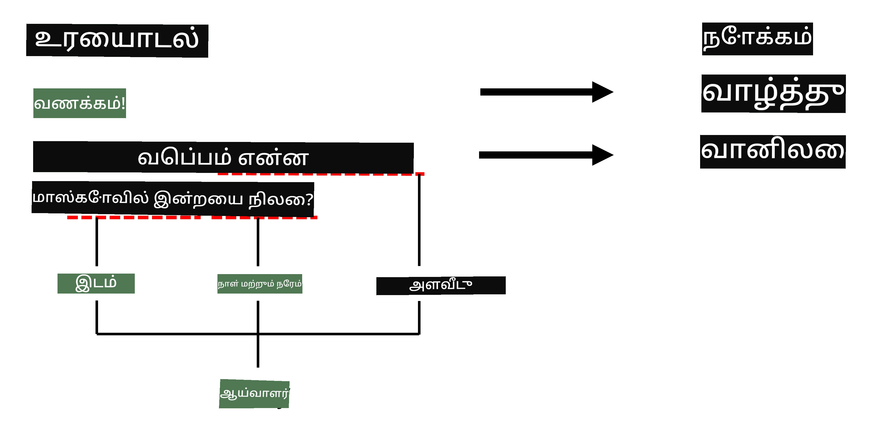
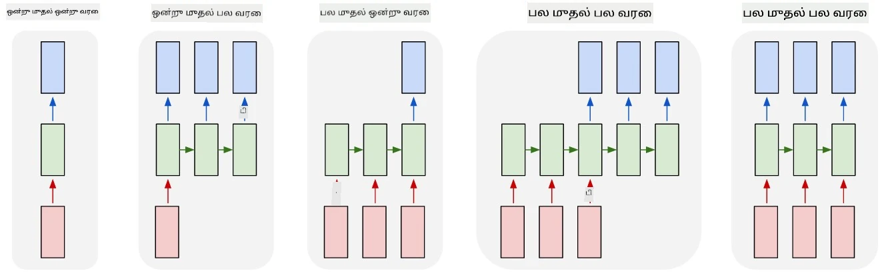

# பெயரிடப்பட்ட பொருள் அடையாளம்

இப்போது வரை, நாங்கள் பெரும்பாலும் ஒரு NLP பணியில் - வகைப்படுத்தலில் கவனம் செலுத்தி வந்தோம். ஆனால், நரம்பியல் வலைகளைப் பயன்படுத்தி செய்யக்கூடிய மற்ற NLP பணிகளும் உள்ளன. அவற்றில் ஒன்று **[பெயரிடப்பட்ட பொருள் அடையாளம்](https://wikipedia.org/wiki/Named-entity_recognition)** (NER), இது உரையில் குறிப்பிட்ட இடங்கள், மனிதர் பெயர்கள், தேதி-நேர இடைவெளிகள், வேதியியல் சூத்திரங்கள் போன்றவற்றை அடையாளம் காண்பதைக் குறிக்கிறது.

## [முன்-வகுப்பு வினாடி வினா](https://ff-quizzes.netlify.app/en/ai/quiz/37)

## NER பயன்படுத்தும் உதாரணம்

உங்கள் இயற்கை மொழி உரையாடல் சாட் பாட்டை உருவாக்க விரும்புகிறீர்கள் என்று நினைக்கவும், இது Amazon Alexa அல்லது Google Assistant போன்றது. புத்திசாலி சாட் பாட்டுகள் செயல்படுவது, பயனர் என்ன விரும்புகிறார் என்பதை *புரிந்து* கொள்ளும் வகையில் உள்ளீட்டு வாக்கியத்தில் உரை வகைப்படுத்தல் செய்வதன் மூலம். இந்த வகைப்படுத்தலின் முடிவு **நோக்கம்** என அழைக்கப்படுகிறது, இது சாட் பாட்டின் செயல்பாட்டை நிர்ணயிக்கிறது.

> படத்தை உருவாக்கியவர்

ஆனால், ஒரு பயனர் ஒரு சொற்றொடரின் பகுதியாக சில அளவுருக்களை வழங்கக்கூடும். உதாரணமாக, வானிலை பற்றி கேட்கும்போது, அவர் ஒரு இடத்தை அல்லது தேதியை குறிப்பிடலாம். ஒரு பாட்டுக்கு அந்த பொருட்களை புரிந்து கொள்ள வேண்டும், மற்றும் செயல்பாட்டைச் செய்யும் முன் அளவுரு இடங்களை நிரப்ப வேண்டும். இதுவே NER பயன்படுத்தப்படும் இடம்.

> ✅ மற்றொரு உதாரணம் [அறிவியல் மருத்துவக் கட்டுரைகளை பகுப்பாய்வு செய்வது](https://soshnikov.com/science/analyzing-medical-papers-with-azure-and-text-analytics-for-health/) ஆகும். முக்கியமாக தேட வேண்டியவை குறிப்பிட்ட மருத்துவச் சொற்கள், நோய்கள் மற்றும் மருத்துவப் பொருட்கள் போன்றவை. சில குறைந்த எண்ணிக்கையிலான நோய்களை துண்டு தேடலின் மூலம் கண்டறியலாம், ஆனால் வேதியியல் சேர்மங்கள் மற்றும் மருந்து பெயர்கள் போன்ற சிக்கலான பொருட்களுக்கு ஒரு சிக்கலான அணுகுமுறை தேவை.

## NER ஒரு டோக்கன் வகைப்படுத்தலாக

NER மாதிரிகள் அடிப்படையில் **டோக்கன் வகைப்படுத்தல் மாதிரிகள்** ஆகும், ஏனெனில் உள்ளீட்டு டோக்கன்களில் ஒவ்வொன்றுக்கும் அது ஒரு பொருளுக்கு சொந்தமானதா அல்லது இல்லையா என்பதை முடிவு செய்ய வேண்டும், மற்றும் அது சொந்தமானால் - எந்த பொருள் வகைக்கு சொந்தமானது என்பதை தீர்மானிக்க வேண்டும்.

கீழே உள்ள கட்டுரையின் தலைப்பைப் பாருங்கள்:

**Tricuspid valve regurgitation** மற்றும் **lithium carbonate** **toxicity** ஒரு புதிதாக பிறந்த குழந்தையில்.

இங்கே உள்ள பொருட்கள்:

* Tricuspid valve regurgitation என்பது ஒரு நோய் (`DIS`)
* Lithium carbonate என்பது ஒரு வேதியியல் பொருள் (`CHEM`)
* Toxicity கூட ஒரு நோய் (`DIS`)

ஒரு பொருள் பல டோக்கன்களை உள்ளடக்கக்கூடும் என்பதை கவனிக்கவும். மேலும், இந்தச் சூழலில், இரண்டு தொடர்ச்சியான பொருட்களை வேறுபடுத்த வேண்டும். எனவே, ஒவ்வொரு பொருளுக்கும் இரண்டு வகைகளைப் பயன்படுத்துவது வழக்கமாக உள்ளது - ஒன்று பொருளின் முதல் டோக்கனை குறிப்பிடுகிறது (`B-` முன்னொட்டு, **தொடக்கம்**), மற்றொன்று பொருளின் தொடர்ச்சியை (`I-`, **உள் டோக்கன்**) குறிப்பிடுகிறது. `O` வகையை **மற்றவை** டோக்கன்களைப் பிரதிநிதித்துவப்படுத்த பயன்படுத்துகிறோம். இந்த வகை டோக்கன் குறியீடு [BIO குறியீடு](https://en.wikipedia.org/wiki/Inside%E2%80%93outside%E2%80%93beginning_(tagging)) (அல்லது IOB) என அழைக்கப்படுகிறது. குறியீடு செய்யப்பட்ட பிறகு, தலைப்பு இவ்வாறு இருக்கும்:

டோக்கன் | குறியீடு
------|-----
Tricuspid | B-DIS
valve | I-DIS
regurgitation | I-DIS
and | O
lithium | B-CHEM
carbonate | I-CHEM
toxicity | B-DIS
in | O
a | O
newborn | O
infant | O
. | O

டோக்கன்கள் மற்றும் வகைகளுக்கு ஒரு-மற்றொரு தொடர்பை உருவாக்க வேண்டும் என்பதால், இந்த படத்திலிருந்து ஒரு சரியான **பல-மற்றொரு** நரம்பியல் வலை மாதிரியை உருவாக்கலாம்:

> *இந்த [வலைப்பதிவில்](http://karpathy.github.io/2015/05/21/rnn-effectiveness/) இருந்து [Andrej Karpathy](http://karpathy.github.io/) எழுதிய படம். NER டோக்கன் வகைப்படுத்தல் மாதிரிகள் இந்த படத்தின் வலது பக்கம் உள்ள வலை معماريக்கு ஒத்ததாக உள்ளது.*

## NER மாதிரிகளைப் பயிற்சி செய்வது

NER மாதிரி அடிப்படையில் ஒரு டோக்கன் வகைப்படுத்தல் மாதிரி என்பதால், இந்த பணிக்காக நாம் ஏற்கனவே அறிந்த RNNகளைப் பயன்படுத்தலாம். இந்தச் சூழலில், மீள்நடப்ப வலைகளின் ஒவ்வொரு தொகுதியும் டோக்கன் ஐடியைத் திருப்பும். கீழே உள்ள உதாரண நோட்புக் டோக்கன் வகைப்படுத்தலுக்காக LSTM பயிற்சி செய்வது எப்படி என்பதை காட்டுகிறது.

## ✍️ உதாரண நோட்புக்: NER

கீழே உள்ள நோட்புக்கில் உங்கள் கற்றலை தொடரவும்:

* [TensorFlow உடன் NER](NER-TF.ipynb)

## முடிவு

ஒரு NER மாதிரி ஒரு **டோக்கன் வகைப்படுத்தல் மாதிரி**, இது டோக்கன் வகைப்படுத்தலைச் செய்ய பயன்படுத்தப்படலாம். இது NLPயில் மிகவும் பொதுவான ஒரு பணி, உரையில் குறிப்பிட்ட இடங்கள், பெயர்கள், தேதிகள் மற்றும் பலவற்றை அடையாளம் காண உதவுகிறது.

## 🚀 சவால்

கீழே இணைக்கப்பட்ட பணியை முடித்து மருத்துவச் சொற்களுக்கான பெயரிடப்பட்ட பொருள் அடையாள மாதிரியைப் பயிற்சி செய்யவும், பின்னர் அதை வேறு தரவுத்தொகுப்பில் முயற்சிக்கவும்.

## [வகுப்புக்குப் பின் வினாடி வினா](https://ff-quizzes.netlify.app/en/ai/quiz/38)

## மதிப்பீடு & சுய கற்றல்

[மீள்நடப்ப நரம்பியல் வலைகளின் அசாதாரண செயல்திறன்](http://karpathy.github.io/2015/05/21/rnn-effectiveness/) வலைப்பதிவை முழுமையாக படித்து, அந்த கட்டுரையில் உள்ள மேலும் வாசிக்கவும் பகுதியைத் தொடர்ந்து உங்கள் அறிவை ஆழமாக்கவும்.

## [பணி](lab/README.md)

இந்த பாடத்திற்கான பணியில், நீங்கள் ஒரு மருத்துவ பொருள் அடையாள மாதிரியைப் பயிற்சி செய்ய வேண்டும். இந்த பாடத்தில் விவரிக்கப்பட்ட LSTM மாதிரியைப் பயிற்சி செய்வதிலிருந்து தொடங்கலாம், பின்னர் BERT மாற்றி மாதிரியைப் பயன்படுத்தலாம். [வழிமுறைகளை](lab/README.md) படித்து அனைத்து விவரங்களையும் பெறுங்கள்.

---

**அறிவிப்பு**:  
இந்த ஆவணம் [Co-op Translator](https://github.com/Azure/co-op-translator) என்ற AI மொழிபெயர்ப்பு சேவையை பயன்படுத்தி மொழிபெயர்க்கப்பட்டுள்ளது. நாங்கள் துல்லியத்திற்காக முயற்சிக்கிறோம், ஆனால் தானியங்கி மொழிபெயர்ப்புகளில் பிழைகள் அல்லது தவறுகள் இருக்கக்கூடும் என்பதை கவனத்தில் கொள்ளவும். அதன் சொந்த மொழியில் உள்ள மூல ஆவணம் அதிகாரப்பூர்வ ஆதாரமாக கருதப்பட வேண்டும். முக்கியமான தகவல்களுக்கு, தொழில்முறை மனித மொழிபெயர்ப்பு பரிந்துரைக்கப்படுகிறது. இந்த மொழிபெயர்ப்பைப் பயன்படுத்துவதால் ஏற்படும் எந்த தவறான புரிதல்களுக்கும் அல்லது தவறான விளக்கங்களுக்கும் நாங்கள் பொறுப்பல்ல.