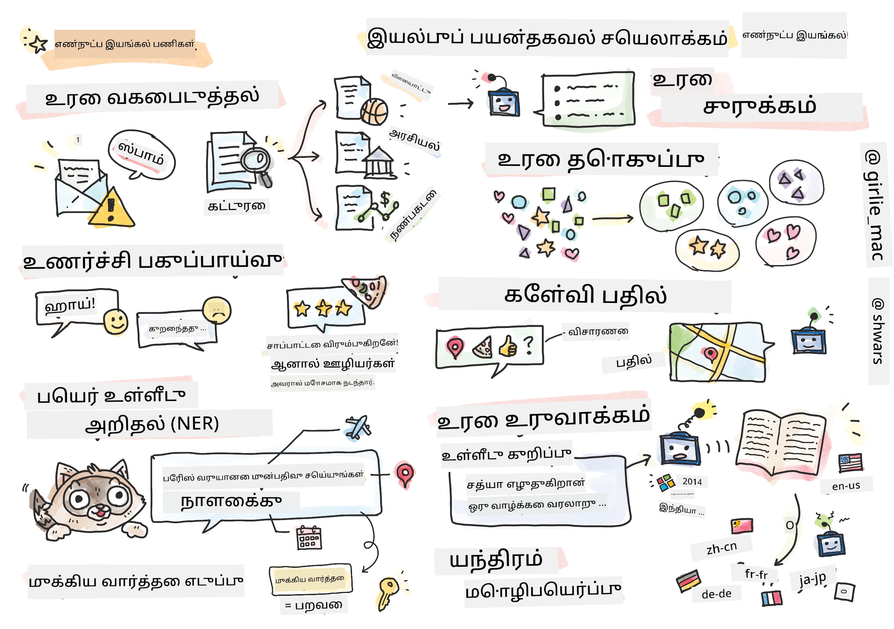

# இயற்கை மொழி செயலாக்கம்



இந்த பிரிவில், **இயற்கை மொழி செயலாக்கம் (NLP)** தொடர்பான பணிகளை கையாள நரம்பியல் வலையமைப்புகளைப் பயன்படுத்துவதில் கவனம் செலுத்துவோம். கணினிகள் தீர்க்க வேண்டிய பல NLP பிரச்சினைகள் உள்ளன:

* **உரை வகைப்படுத்தல்** என்பது உரை வரிசைகளுக்கான ஒரு வழக்கமான வகைப்படுத்தல் பிரச்சினையாகும். உதாரணமாக, மின்னஞ்சல் செய்திகளை ஸ்பாம் மற்றும் ஸ்பாம் அல்ல என வகைப்படுத்துதல் அல்லது கட்டுரைகளை விளையாட்டு, வணிகம், அரசியல் போன்றவையாக வகைப்படுத்துதல். மேலும், சாட் போட்களை உருவாக்கும்போது, பயனர் என்ன சொல்ல விரும்புகிறார் என்பதைப் புரிந்துகொள்ள வேண்டும் - இந்தச் சூழலில் நாம் **நோக்க வகைப்படுத்தல்** (intent classification) பிரச்சினையை கையாளுகிறோம். நோக்க வகைப்படுத்தலில் பல வகைகளை கையாள வேண்டிய நிலை ஏற்படும்.

* **உணர்வு பகுப்பாய்வு** என்பது ஒரு வழக்கமான மடங்கல் (regression) பிரச்சினையாகும், இதில் ஒரு வாக்கியத்தின் அர்த்தம் எவ்வளவு நேர்மறை/எதிர்மறை என்பதைப் பிரதிபலிக்கும் ஒரு எண்ணை (உணர்வு) வழங்க வேண்டும். உணர்வு பகுப்பாய்வின் மேம்பட்ட பதிப்பு **கோண அடிப்படையிலான உணர்வு பகுப்பாய்வு** (ABSA) ஆகும், இதில் முழு வாக்கியத்திற்கு அல்லாமல் அதன் பல்வேறு பகுதிகளுக்கு (கோணங்கள்) உணர்வை வழங்க வேண்டும், உதாரணமாக *இந்த உணவகத்தில், நான் சமையலை விரும்பினேன், ஆனால் சூழல் மோசமாக இருந்தது*.

* **பெயரிடப்பட்ட பொருள் அடையாளம்** (NER) என்பது உரையிலிருந்து குறிப்பிட்ட பொருட்களை எடுப்பதற்கான பிரச்சினையாகும். உதாரணமாக, *நான் நாளை பாரிசுக்கு பறக்க வேண்டும்* என்ற வாக்கியத்தில் *நாளை* என்பது தேதி (DATE) மற்றும் *பாரிஸ்* என்பது இடம் (LOCATION) என்பதைப் புரிந்துகொள்ள வேண்டும்.

* **முக்கிய வார்த்தை எடுப்பது** NER-க்கு ஒத்ததாக உள்ளது, ஆனால் குறிப்பிட்ட பொருள் வகைகளை முன்பயிற்சி செய்யாமல், வாக்கியத்தின் அர்த்தத்திற்கு முக்கியமான வார்த்தைகளை தானாக எடுக்க வேண்டும்.

* **உரை குழுமம்** (Text clustering) என்பது ஒரே மாதிரியான வாக்கியங்களை ஒன்றாகக் குழுமிக்க உதவியாக இருக்கலாம், உதாரணமாக, தொழில்நுட்ப ஆதரவு உரையாடல்களில் ஒரே மாதிரியான கோரிக்கைகளை.

* **கேள்வி பதில்** (Question answering) என்பது ஒரு மாடல் குறிப்பிட்ட கேள்விக்கு பதிலளிக்கக் கூடிய திறனை குறிக்கிறது. மாடல் ஒரு உரை பகுதி மற்றும் ஒரு கேள்வியை உள்ளீடுகளாகப் பெறுகிறது, மற்றும் கேள்விக்கு பதில் உள்ள இடத்தை உரையில் வழங்க வேண்டும் (அல்லது, சில நேரங்களில், பதில் உரையை உருவாக்க வேண்டும்).

* **உரை உருவாக்கல்** (Text Generation) என்பது ஒரு மாடல் புதிய உரையை உருவாக்கும் திறனை குறிக்கிறது. இது ஒரு வகைப்படுத்தல் பணியாகக் கருதப்படலாம், இது *உரைத் தூண்டுதல்* (text prompt) அடிப்படையில் அடுத்த எழுத்து/வார்த்தையை கணிக்கிறது. GPT-3 போன்ற மேம்பட்ட உரை உருவாக்கல் மாடல்கள், [prompt programming](https://towardsdatascience.com/software-3-0-how-prompting-will-change-the-rules-of-the-game-a982fbfe1e0) அல்லது [prompt engineering](https://medium.com/swlh/openai-gpt-3-and-prompt-engineering-dcdc2c5fcd29) என்ற தொழில்நுட்பத்தைப் பயன்படுத்தி வகைப்படுத்தல் போன்ற பிற NLP பணிகளைத் தீர்க்க முடியும்.

* **உரை சுருக்கம்** (Text summarization) என்பது ஒரு கணினி நீண்ட உரையை "படித்து" சில வாக்கியங்களில் சுருக்க வேண்டும்.

* **இயந்திர மொழிபெயர்ப்பு** (Machine translation) என்பது ஒரு மொழியில் உரையைப் புரிந்து கொள்ளுதல் மற்றும் மற்றொரு மொழியில் உரை உருவாக்குதல் ஆகியவற்றின் கலவையாகக் கருதலாம்.

தொடக்கத்தில், பல NLP பணிகள் பாரம்பரிய முறைகளைப் பயன்படுத்தி தீர்க்கப்பட்டன, உதாரணமாக, இலக்கணங்கள். இயந்திர மொழிபெயர்ப்பில், ஆரம்ப வாக்கியத்தை ஒரு இலக்கண மரமாக மாற்ற பார்சர்கள் பயன்படுத்தப்பட்டன, பின்னர் வாக்கியத்தின் அர்த்தத்தை பிரதிபலிக்கும் உயர் நிலை அர்த்த அமைப்புகள் எடுக்கப்பட்டன, மற்றும் இந்த அர்த்தத்தின் அடிப்படையில் மற்றும் இலக்கு மொழியின் இலக்கணத்தின் அடிப்படையில் முடிவு உருவாக்கப்பட்டது. இன்று, பல NLP பணிகள் நரம்பியல் வலையமைப்புகளைப் பயன்படுத்தி மேலும் பயனுள்ளதாக தீர்க்கப்படுகின்றன.

> பல பாரம்பரிய NLP முறைகள் [Natural Language Processing Toolkit (NLTK)](https://www.nltk.org) Python நூலகத்தில் செயல்படுத்தப்பட்டுள்ளன. [NLTK புத்தகம்](https://www.nltk.org/book/) ஆன்லைனில் கிடைக்கிறது, இது NLTK-ஐப் பயன்படுத்தி வெவ்வேறு NLP பணிகளை எப்படி தீர்க்கலாம் என்பதைப் பற்றிக் கூறுகிறது.

இந்த பாடத்தில், நாங்கள் பெரும்பாலும் NLP க்கு நரம்பியல் வலையமைப்புகளைப் பயன்படுத்துவதில் கவனம் செலுத்துவோம், மேலும் தேவையான இடங்களில் NLTK-ஐப் பயன்படுத்துவோம்.

நாங்கள் ஏற்கனவே டேபிள் தரவுகள் மற்றும் படங்களுக்கான நரம்பியல் வலையமைப்புகளைப் பயன்படுத்துவது பற்றி கற்றுக்கொண்டுள்ளோம். இந்த தரவுகளின் வகைகள் மற்றும் உரையின் இடையே முக்கியமான வேறுபாடு என்னவென்றால், உரை என்பது மாறும் நீளத்துடன் கூடிய வரிசையாகும், ஆனால் படங்களின் வழக்கில் உள்ளீட்டு அளவு முன்கூட்டியே தெரிந்திருக்கும். குவியல்களால் (convolutional networks) உள்ளீட்டு தரவிலிருந்து முறைமைகளை எடுக்க முடியும், ஆனால் உரையில் உள்ள முறைமைகள் மேலும் சிக்கலானவை. உதாரணமாக, *நான் ஆரஞ்சுகளை விரும்பவில்லை* மற்றும் *நான் அந்த பெரிய வண்ணமயமான சுவையான ஆரஞ்சுகளை விரும்பவில்லை* போன்ற வாக்கியங்களில் மறுப்பு (negation) பொருளிலிருந்து பல வார்த்தைகளால் பிரிக்கப்பட்டிருக்கலாம், ஆனால் இது ஒரு முறைமையாகவே பொருள் கொள்ள வேண்டும். எனவே, மொழியை கையாள நாங்கள் புதிய நரம்பியல் வலையமைப்பு வகைகளை அறிமுகப்படுத்த வேண்டும், உதாரணமாக *மீளும் வலையமைப்புகள்* (recurrent networks) மற்றும் *மாற்றிகள்* (transformers).

## நூலகங்களை நிறுவுதல்

இந்த பாடத்தை இயக்குவதற்கான உள்ளூர் Python நிறுவலை நீங்கள் பயன்படுத்தினால், கீழே உள்ள கட்டளைகளைப் பயன்படுத்தி NLP க்கு தேவையான அனைத்து நூலகங்களையும் நிறுவ வேண்டும்:

**PyTorch க்கு**
```bash
pip install -r requirements-torch.txt
```
**TensorFlow க்கு**
```bash
pip install -r requirements-tf.txt
```

> TensorFlow-ஐப் பயன்படுத்தி NLP-ஐ [Microsoft Learn](https://docs.microsoft.com/learn/modules/intro-natural-language-processing-tensorflow/?WT.mc_id=academic-77998-cacaste) இல் முயற்சிக்கலாம்.

## GPU எச்சரிக்கை

இந்த பிரிவில், சில உதாரணங்களில், நாங்கள் மிகவும் பெரிய மாடல்களைப் பயிற்சி செய்யப் போகிறோம்.
* **GPU-இயக்கப்பட்ட கணினியைப் பயன்படுத்தவும்**: பெரிய மாடல்களுடன் வேலை செய்யும்போது காத்திருக்கும் நேரத்தை குறைக்க GPU-இயக்கப்பட்ட கணினியில் உங்கள் நோட்புக்குகளை இயக்க பரிந்துரைக்கப்படுகிறது.
* **GPU நினைவக கட்டுப்பாடுகள்**: GPU-இல் இயக்குவது, குறிப்பாக பெரிய மாடல்களைப் பயிற்சி செய்யும்போது, GPU நினைவகம் குறைவாக இருக்கும் சூழல்களை உருவாக்கலாம்.
* **GPU நினைவக பயன்பாடு**: பயிற்சியின் போது GPU நினைவக பயன்பாட்டின் அளவு, மினிபேட்ச் அளவு உள்ளிட்ட பல காரணிகளின் அடிப்படையில் மாறுபடும்.
* **மினிபேட்ச் அளவை குறைக்கவும்**: GPU நினைவக பிரச்சினைகளை எதிர்கொள்வீர்கள் என்றால், உங்கள் குறியீட்டில் மினிபேட்ச் அளவை குறைப்பதை ஒரு தீர்வாகக் கருதவும்.
* **TensorFlow GPU நினைவக வெளியீடு**: Python கர்னலில் பல மாடல்களைப் பயிற்சி செய்யும்போது, TensorFlow-இன் பழைய பதிப்புகள் GPU நினைவகத்தை சரியாக வெளியிடாமல் இருக்கலாம். GPU நினைவக பயன்பாட்டை திறமையாக நிர்வகிக்க, தேவையான போது GPU நினைவகத்தை ஒதுக்க TensorFlow-ஐ அமைக்கலாம்.
* **குறியீட்டு சேர்க்கை**: GPU நினைவக ஒதுக்கீட்டை தேவையான போது மட்டுமே வளரச் செய்ய, உங்கள் நோட்புக்குகளில் கீழே உள்ள குறியீட்டைச் சேர்க்கவும்:

```python
physical_devices = tf.config.list_physical_devices('GPU') 
if len(physical_devices)>0:
    tf.config.experimental.set_memory_growth(physical_devices[0], True) 
```

பாரம்பரிய ML பார்வையில் இருந்து NLP பற்றி கற்றுக்கொள்ள ஆர்வமாக இருந்தால், [இந்த பாடங்களின் தொகுப்பை](https://github.com/microsoft/ML-For-Beginners/tree/main/6-NLP) பார்வையிடவும்.

## இந்த பிரிவில்
இந்த பிரிவில் நாம் கற்றுக்கொள்ளப் போகிறோம்:

* [உரையை டென்சர்களாக பிரதிபலித்தல்](13-TextRep/README.md)
* [வார்த்தை எம்பெடிங்ஸ்](14-Emdeddings/README.md)
* [மொழி மாதிரிகள்](15-LanguageModeling/README.md)
* [மீளும் நரம்பியல் வலையமைப்புகள்](16-RNN/README.md)
* [உருவாக்கும் வலையமைப்புகள்](17-GenerativeNetworks/README.md)
* [மாற்றிகள்](18-Transformers/README.md)

---

**குறிப்பு**:  
இந்த ஆவணம் [Co-op Translator](https://github.com/Azure/co-op-translator) என்ற AI மொழிபெயர்ப்பு சேவையை பயன்படுத்தி மொழிபெயர்க்கப்பட்டுள்ளது. எங்கள் நோக்கம் துல்லியமாக இருக்க வேண்டும் என்பதுதான், ஆனால் தானியங்கி மொழிபெயர்ப்புகளில் பிழைகள் அல்லது துல்லியமின்மைகள் இருக்கக்கூடும் என்பதை தயவுசெய்து கவனத்தில் கொள்ளவும். அதன் தாய்மொழியில் உள்ள மூல ஆவணம் அதிகாரப்பூர்வ ஆதாரமாக கருதப்பட வேண்டும். முக்கியமான தகவல்களுக்கு, தொழில்முறை மனித மொழிபெயர்ப்பு பரிந்துரைக்கப்படுகிறது. இந்த மொழிபெயர்ப்பைப் பயன்படுத்துவதால் ஏற்படும் எந்த தவறான புரிதல்கள் அல்லது தவறான விளக்கங்களுக்கு நாங்கள் பொறுப்பல்ல.