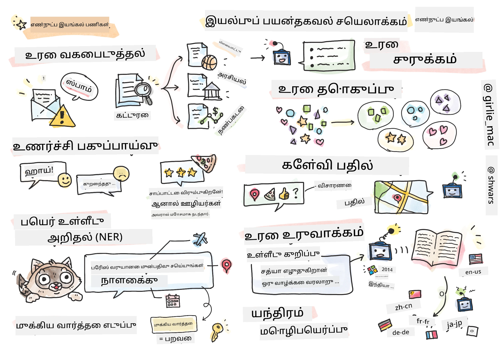

# இயற்கை மொழி செயலாக்கம்



இந்த பிரிவில், நாங்கள் நியூரல் நெட்வொர்க்குகளைப் பயன்படுத்தி **இயற்கை மொழி செயலாக்கம் (NLP)** தொடர்பான பணிகளை மேற்கொள்ள கவனம் செலுத்தப்போகிறோம். கணினிகள் தீர்க்க விரும்பும் பல NLP பிரச்சினைகள் உள்ளன:

* **ஆயிர்த்தொடர் வர்க்கப்பிரிவு** என்பது உரை தொடர்களுக்கு தொடர்புடைய ஒரு வழக்கமான வகைப்பாடு பிரச்சினை. உதாரணமாக, மின்னஞ்சல் எடை அஞ்சல்கள் ஸ்பாம் அல்லது ஸ்பாம் அல்ல என வகைப்படுத்துதல் அல்லது கட்டுரைகளை விளையாட்டுக் காலம், தொழில், அரசியல் என்பனவாக வகைப்படுத்துதல். மேலும், சாட் பாட்டுகளை உருவாக்கும்போது, பயனர் என்னக் கூற விரும்பினார்களோ அதை புரிந்துகொள்ள வேண்டும் -- இதை **நோக்கம் வகைப்படுத்தல்** என்று கூறுகிறோம். நோக்கம் வகைப்படுத்தலில் பல வகைகளை கையாள வேண்டி இருக்கிறது.
* **புகைப்படம் பகுப்பாய்வு** என்பது ஒரு வழக்கமான மறுபடியும் கணக்கிடுதல் பிரச்சினை, இதில் ஒரு வாக்கியத்தின் பொருள் எவ்வளவு நேர்மறை/எதிர்மறை என ஒரு எண்ணை (புகைப்படம்) நாங்கள் ஒதுக்கவேண்டும். புகைப்படக் கணக்கீட்டின் மேம்பட்ட பதிப்பு **அங்ஙீகங்களை அடிப்படையாகக் கொண்ட புகைப்பட பகுப்பாய்வு** (ABSA), இதில் முழு வாக்கியத்திற்கு மாறாக அதன் வெவ்வேறு பகுதிகளுக்கு (அங்ஙீகங்கள்) புகைப்படம் ஒதுக்கப்படுகிறது, உதாரணமாக *இந்த உணவுக்கடையில், எனக்கு சமையல் பிடித்தது, ஆனால் சூழல் மோசமாக இருந்தது*.
* **பெயர் பொருள் அடையாளம்** (NER) என்பது உரையிலிருந்து குறிப்பிட்ட பொருட்களை எடுக்கும் பிரச்சினை. எடுத்துக்காட்டிற்கு, *நாளை பாரிஸுக்கு பறக்க வேண்டும்* என்ற வாக்கியத்தில் *நாளை* என்பது தேதி (DATE) என்பதையும் *பாரிஸ்* என்பது இடம் (LOCATION) என்பதையும் புரிந்துகொள்ள வேண்டும்.
* **துணைக்குறிகள் எடுக்கும் பணிகள்** NER போன்றது, ஆனால் நாங்கள் குறிப்பிட்ட பொருள் வகைகளுக்காக முன் பயிற்சி செய்யாமல் வாக்கியத்தின் பொருளுக்கு முக்கியமான வார்த்தைகளை தானாக எடுக்கவேண்டும்.
* **உரை தொகுப்பு** என்பது ஒரே மாதிரியான வாக்கியங்களை குழுவாக்கவேண்டியபோது உதவியாக இருக்கக்கூடும், உதாரணமாக, தொழில்நுட்ப ஆதரவு உரையாடல்களில் ஒரே மாதிரியான கோரிக்கைகள்.
* **பிரச்னை பதில் அளித்தல்** என்பது ஒரு மாதிரியால் ஒரு குறிப்பிட்ட கேள்விக்கு பதில் அளிக்கும் திறன். மாதிரி ஒரு உரை பகுதியையும் ஒரு கேள்வியையும் உள்ளீடாக பெறுகிறது, கேள்விக்கு பதில் கொண்டிருக்கும் இடத்தை (அல்லது, சில சமயங்களில், பதில் உரையை உருவாக்க) வழங்க வேண்டும்.
* **உரை உருவாக்கம்** என்பது ஒரு மாதிரி புதிய உரையை உருவாக்கும் திறனாகும். இது ஒரு வகைப்பாடு வேலைவாய்ப்பு போல கருதப்படலாம், அடுத்து வரும் அகரவியல்/வார்த்தையை *உரை ஊக்கம்* அடிப்படையில் முன்னறிவிக்கும். GPT-3 போன்ற மேம்பட்ட உரை உருவாக்க மாதிரிகள், [prompt programming](https://towardsdatascience.com/software-3-0-how-prompting-will-change-the-rules-of-the-game-a982fbfe1e0) அல்லது [prompt engineering](https://medium.com/swlh/openai-gpt-3-and-prompt-engineering-dcdc2c5fcd29) என்ற முறையைப் பயன்படுத்தி வகைப்படுத்தல் போன்ற மற்ற NLP பணிகளையும் எளிதில் செய்ய முடியும்.
* **உரை சுருக்கம்** என்பது கணினி நீண்ட உரையை "படித்து" அதை சில வாக்கியங்களில் சுருக்க வேண்டும் என்று இரு தொழில்.
* **மெஷின் மொழிபெயர்ப்பு** என்பது ஒரு மொழியில் உரையை புரிந்து, மற்றொரு மொழியில் உரையை உருவாக்குவதன் கலவையாக பார்க்க முடியும்.

ஆரம்பத்தில், பல NLP பணிகள் வழக்கமான வேதியியல் முறைகளைப் பயன்படுத்தி தீர்க்கப்பட்டன. எடுத்துக்காட்டிற்கு, மெஷின் மொழிபெயர்ப்பில் ஆரம்ப வாக்கியத்தை ஒரு வர்க்க மரமாக மாற்ற பர்ஸர்கள் பயன்படுத்தப்பட்டனர், பின்னர் மேல்நிலை பொருள் அமைப்புகள் எடுக்கப்பட்டு வாக்கியத்தின் பொருள் பிரதிநிதித்துவப்படுத்தப்பட்டது, இதற்கும் இலக்க மொழியின் வேதியியலும் அடிப்படையாக கொண்டு முடிவு உருவாக்கப்பட்டது. இந்நிலையில், இன்று பல NLP பணிகள் நியூரல் நெட்வொர்க்குகளைப் பயன்படுத்தி இன்னும் பயனுள்ள முறையில் தீர்க்கப்படுகின்றன.

> பல பாரம்பரிய NLP முறைகள் [Natural Language Processing Toolkit (NLTK)](https://www.nltk.org) பைதான் நூலகத்தில் வடிவமைக்கப்பட்டுள்ளன. பல்வேறு NLP பணிகளை NLTK மூலம் எப்படி தீர்க்கலாம் என்பதை கொண்ட ஒரு சிறந்த [NLTK புத்தகம்](https://www.nltk.org/book/) இணையத்தில் கிடைக்கும்.

எங்கள் பாடத்தில், பெரும்பாலும் NLP க்கான நியூரல் நெட்வொர்க்குகளை பயன்படுத்துவோம், தேவையான இடங்களில் NLTK பயன்செய்யப்படும்.

நாங்கள் ஏற்கனவே நியூரல் நெட்வொர்க்குகள் மூலம் அட்டவணை தரவையும் படங்களையும் கையாள எப்படி என்று கற்றுக்கொண்டுள்ளோம். அந்த வகை தரவுகளுக்கும் உரைக்கும் இடையேயான முக்கிய வேறுபாடு என்னவெனில் உரை ஒரு மாறி நீள கொண்ட தொடர் ஆகும், ஆனால் படங்களின் உள்ளீடு அளவு முன்கூட்டியே தெரியும். கான்வால்யூஷனல் நெட்வொர்க்குகள் உள்ளீடில் இருந்து வடிவங்களை எடுத்துக் கொள்ள முடியும், ஆனால் உரையின் வடிவங்கள் மிகவும் சிக்கலானவை. எடுத்துக்காட்டிற்கு, மறுப்பு (negation) தலைப்பு (subject) இலிருந்து நான் பல வார்த்தைகளுக்கு விலகி இருக்கலாம் (உதா., *நான் ஆரஞ்சுகளை விரும்பவில்லை*, vs. *நான் அந்த பெரிய வண்ணமயமான சுவையான ஆரஞ்சுகளை விரும்பவில்லை*), ஆனால் அதே வடிவமாகவே பொருள்படுத்தப்படவேண்டும். ஆகவே, மொழியை கையாள நமது புதிய நியூரல் நெட்வொர்க்கு வகைகள், உதாரணமாக *ஆரம்ப நெட்வொர்க்குகள்* மற்றும் *டிரான்ஸ்ஃபார்மர்கள்* அறிமுகப்படுத்த வேண்டியிருக்கும்.

## நூலகங்கள் நிறுவுதல்

நீங்கள் இந்த பாடத்திட்டத்தைக் கணினியில் உள்ள பைதான் நிறுவலைப் பயன்படுத்தி இயக்கினால், கீழ்காணும் கட்டளைகளைப் பயன்படுத்தி NLP க்கான தேவையான அனைத்து நூலகங்களையும் நிறுவ வேண்டும்:

**PyTorch க்கு**
```bash
pip install -r requirements-pytorch.txt
```
**TensorFlow க்கு**
```bash
pip install -r requirements-tf.txt
```

> TensorFlow உடன் NLP ஐ [Microsoft Learn](https://docs.microsoft.com/learn/modules/intro-natural-language-processing-tensorflow/?WT.mc_id=academic-77998-cacaste) இல் முயற்சிக்கலாம்

## GPU எச்சரிக்கை

இந்தப் பிரிவில், சில உதாரணங்களில் நாங்கள் பெரிய மாதிரிகளை பயிற்சி செய்யப் போகிறோம்.
* **GPU-ஐ இயக்கு கணினியைப் பயன்படுத்தவும்**: பெரிய மாதிரிகளுடன் வேலை செய்யும் போது காத்திருக்கும் நேரங்களை குறைக்க GPU இயக்கு கணினியில் உங்கள் நோட்புக்களை இயக்க பரிந்துரைக்கப்படுகிறது.
* **GPU நினைவகத் தடைகள்**: பெரிய மாதிரிகள் பயிற்சி செய்யும் போது GPU நினைவகம் மூடிவிடும் நிலைகள் ஏற்படலாம்.
* **GPU நினைவக பயன்பாடு**: பயிற்சியின் போது பயன்படுத்தப்படும் GPU நினைவக அளவு பல காரணிகளால் பாதிக்கப்படும், அதில் மினிபேட்ச்(குழு அளவு) முக்கியம்.
* **மினிபேட்ச் அளவை சிறியது செய்யவும்**: GPU நினைவக பிரச்சினைகள் இருந்தால், உங்கள் குறியீட்டில் மினிபேட்ச் அளவை குறைப்பதைக் கவனிக்கவும்.
* **TensorFlow GPU நினைவகம் வெளியேற்றம்**: பழைய TensorFlow பதிப்புகள் ஒரே Python கர்னலில் பல மாதிரிகள் பயிற்சியிடும் போது GPU நினைவகத்தை சரியாக விடு விடாமலிருக்கும். GPU நினைவகத்தை சீராக நிர்வகிக்க, தேவைப்பட்டால் மட்டுமே GPU நினைவகம் ஒதுக்க TensorFlow ஐ அமைக்கலாம்.
* **குறியீட்டு உள்ளடக்கம்**: TensorFlow க்கு தேவையான போது மட்டும் GPU நினைவகம் அதிகரிக்க கீழ்காணும் குறியீட்டை உங்கள் நோட்புக்களில் சேர்க்கவும்:

```python
physical_devices = tf.config.list_physical_devices('GPU') 
if len(physical_devices)>0:
    tf.config.experimental.set_memory_growth(physical_devices[0], True) 
```

நீங்கள் பாரம்பரிய எம்பிஎல் (ML) பார்வையில் NLP பற்றி அறிய விரும்பினால், [இந்த பாடங்களின் தொகுப்பை](https://github.com/microsoft/ML-For-Beginners/tree/main/6-NLP) பார்வையிடவும்

## இந்தப் பிரிவில்
இந்தப் பிரிவில் நாங்கள் கற்கப்போகும் விஷயங்கள்:

* [உரை துணைப்பொருள்களாக (tensors) பிரதிநிதிக்கும்](13-TextRep/README.md)
* [வார்த்தை கையிருப்புக்கள்](14-Embeddings/README.md)
* [மொழிமுறை மாதிரிப்பாக்கம்](15-LanguageModeling/README.md)
* [திரும்பி செயல்படும் நியூரல் நெட்வொர்க்குகள்](16-RNN/README.md)
* [உருவாக்கும் நெட்வொர்க்குகள்](17-GenerativeNetworks/README.md)
* [டிரான்ஸ்ஃபார்மர்கள்](18-Transformers/README.md)

---

<!-- CO-OP TRANSLATOR DISCLAIMER START -->
**மறுப்பு**:
இந்த ஆவணம் AI மொழிபெயர்ப்பு சேவை [Co-op Translator](https://github.com/Azure/co-op-translator) பயன்படுத்தி மொழிபெயர்க்கப்பட்டுள்ளது. நாங்கள் துல்லியத்திற்காக முயற்சி செய்துள்ளோம், ஆனால் தானாக செய்யப்படும் மொழிபெயர்ப்புகளில் பிழைகள் அல்லது தவறுகள் இருக்கலாம் என்பதை கவனத்தில் கொள்ளவும். அசல் ஆவணம் அதன் தாய்மொழியில் அதிகாரப்பூர்வ ஆதாரமாக கருதப்பட வேண்டும். முக்கியமான தகவல்களுக்கு, தொழில்நுட்பமான மனித மொழிபெயர்ப்பு பரிந்துரைக்கப்படுகிறது. இந்த மொழிபெயர்ப்பைப் பயன்படுத்துவதால் ஏற்படும் எந்த தவறான புரிதல்கள் அல்லது தவறான விளக்கத்திற்கும் நாங்கள் பொறுப்பில்வில்லை.
<!-- CO-OP TRANSLATOR DISCLAIMER END -->