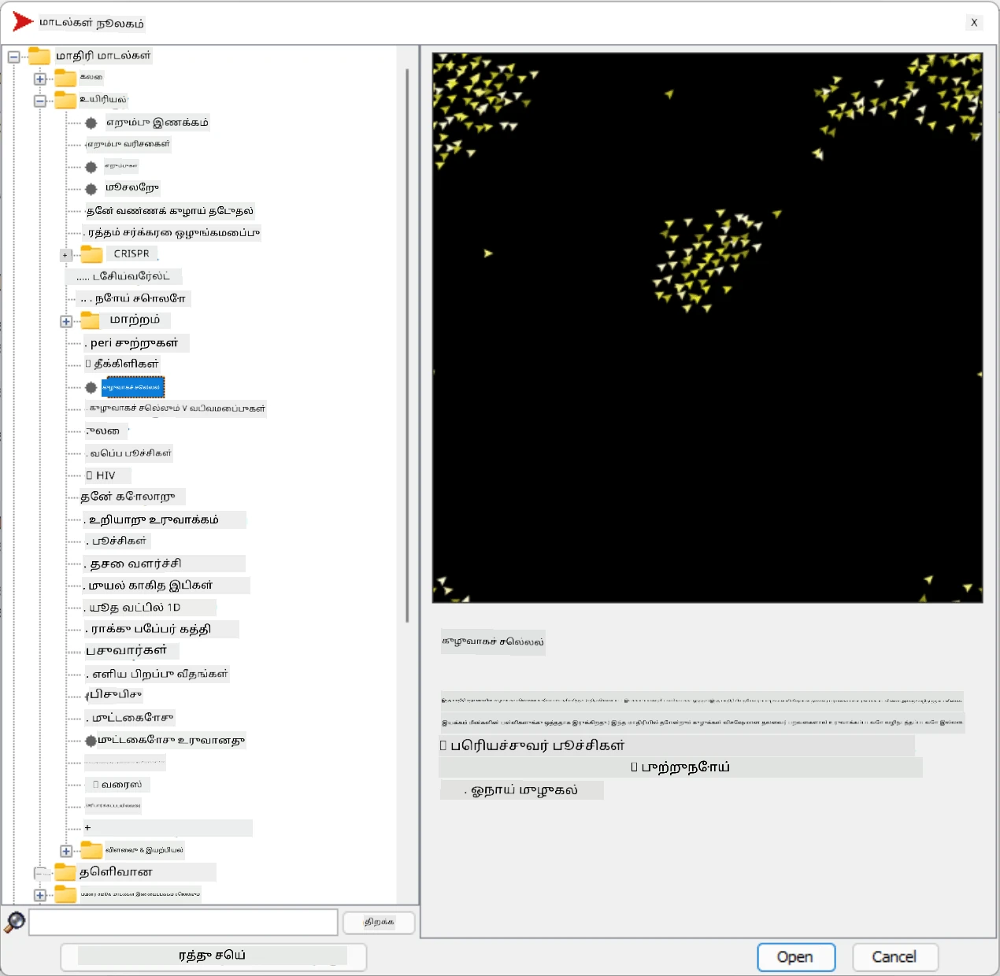
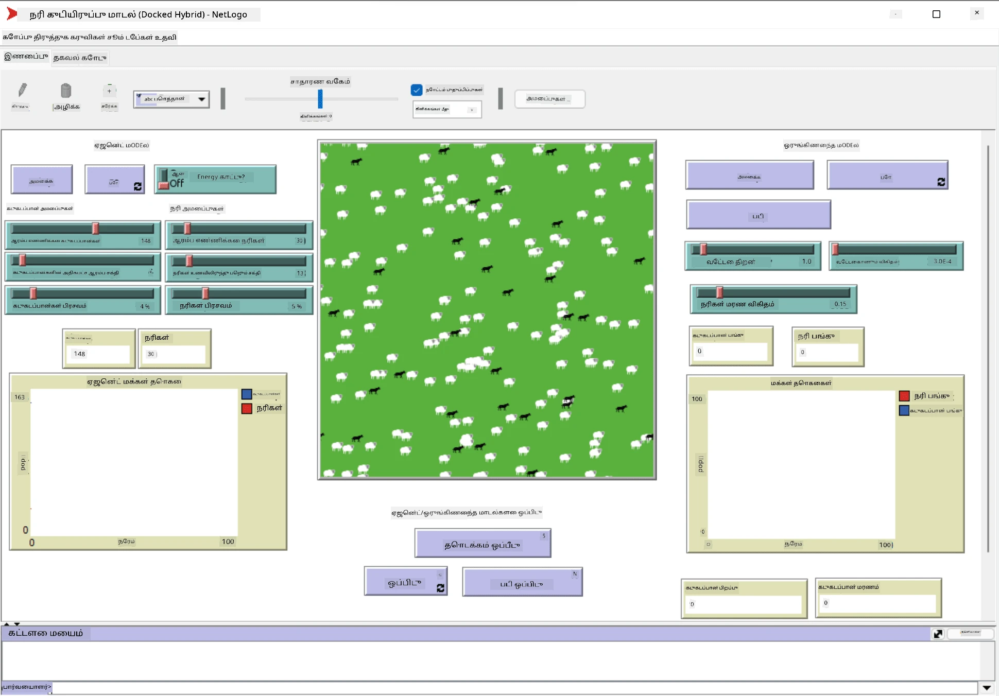

# பல்கூறு முகவர் அமைப்புகள்

உளவுத்திறனை அடையக்கூடிய வழிகளில் ஒன்றாக **தோன்றும்** (அல்லது **சக்தி**) அணுகுமுறை உள்ளது, இது பல எளிய முகவர்களின் இணைந்த செயல்பாடு, மொத்த அமைப்பின் முழுமையான சிக்கலான (அல்லது புத்திசாலியான) செயல்பாட்டை உருவாக்க முடியும் என்பதை அடிப்படையாகக் கொண்டது. இது தத்துவ ரீதியாக [கூட்டு உளவுத்திறன்](https://en.wikipedia.org/wiki/Collective_intelligence), [தோன்றும் தத்துவம்](https://en.wikipedia.org/wiki/Global_brain) மற்றும் [மாறும் சைபர்நெடிக்ஸ்](https://en.wikipedia.org/wiki/Global_brain) ஆகியவற்றின் கோட்பாடுகளின் அடிப்படையில் உள்ளது, இது உயர் நிலை அமைப்புகள் தகுந்த முறையில் கீழ்நிலை அமைப்புகளிலிருந்து இணைக்கப்பட்டால் கூடுதல் மதிப்பை பெறுகின்றன என்று கூறுகிறது (*மெட்டாசிஸ்டம் மாற்றத்தின் கோட்பாடு*).

## [முன்-வகுப்பு வினாடி வினா](https://ff-quizzes.netlify.app/en/ai/quiz/45)

**பல்கூறு முகவர் அமைப்புகள்** என்ற திசை 1990களில் AI இல் உருவாகியது, இணையம் மற்றும் பகிர்ந்தமைப்பு அமைப்புகள் வளர்ச்சிக்கு பதிலளிக்க. [Artificial Intelligence: A Modern Approach](https://en.wikipedia.org/wiki/Artificial_Intelligence:_A_Modern_Approach) என்ற AI இன் பாரம்பரிய 교재, பல்கூறு முகவர் அமைப்புகளின் பார்வையில் பாரம்பரிய AI ஐ மையமாகக் கொண்டுள்ளது.

பல்கூறு முகவர் அணுகுமுறையின் மையத்தில் **முகவர்** என்ற கருத்து உள்ளது - இது ஒரு **சூழலில்** வாழும் ஒரு அலகு, அதை உணர்ந்து, அதில் செயல்பட முடியும். இது மிகவும் பரந்த வரையறையாகும், மேலும் பல்வேறு வகையான முகவர்களின் வகைகள் மற்றும் வகைப்பாடுகள் இருக்கலாம்:

* அவர்கள் காரணம் கூறும் திறன் அடிப்படையில்:
   - **பிரதிசெயல்பாட்டு** முகவர்கள் பொதுவாக எளிய கோரிக்கை-பதில் வகை செயல்பாட்டைக் கொண்டிருக்கும்
   - **தீர்மான** முகவர்கள் ஒரு வகையான தர்க்க reasoning மற்றும்/அல்லது திட்டமிடும் திறன்களைப் பயன்படுத்துகின்றனர்
* முகவர் தனது குறியீட்டை செயல்படுத்தும் இடத்தின் அடிப்படையில்:
   - **நிலையான** முகவர்கள் ஒரு ஒதுக்கப்பட்ட நெட்வொர்க் node இல் செயல்படுகின்றனர்
   - **மொபைல்** முகவர்கள் நெட்வொர்க் node களுக்கு இடையில் குறியீட்டை நகர்த்த முடியும்
* அவர்களின் நடத்தை அடிப்படையில்:
   - **செயலற்ற முகவர்கள்** குறிப்பிட்ட இலக்குகளை கொண்டிருக்கவில்லை. இவ்வகை முகவர்கள் வெளிப்புற தூண்டுதல்களுக்கு பதிலளிக்கலாம், ஆனால் தாங்கள் எந்த நடவடிக்கைகளையும் தொடங்க மாட்டார்கள்.
   - **செயல்பாட்டு முகவர்கள்** சில இலக்குகளைத் தொடர்ந்து செயல்படுகின்றனர்
   - **அறிவாற்றல் முகவர்கள்** சிக்கலான திட்டமிடல் மற்றும் reasoning உட்படுத்துகின்றனர்

இன்றைய காலத்தில் பல்கூறு முகவர் அமைப்புகள் பல பயன்பாடுகளில் பயன்படுத்தப்படுகின்றன:

* விளையாட்டுகளில், பல non-player characters (NPCs) ஒரு வகையான AI ஐ பயன்படுத்துகின்றன, மேலும் அவை புத்திசாலியான முகவர்களாகக் கருதப்படலாம்
* வீடியோ தயாரிப்பில், கூட்டம் அடங்கிய சிக்கலான 3D காட்சிகளை உருவாக்குவது பொதுவாக பல்கூறு முகவர் சிமுலேஷன் மூலம் செய்யப்படுகிறது
* அமைப்பு மாதிரியில், பல்கூறு முகவர் அணுகுமுறை ஒரு சிக்கலான மாதிரியின் நடத்தை சிமுலேட் செய்ய பயன்படுத்தப்படுகிறது. உதாரணமாக, COVID-19 நோயின் பரவலை உலகளவில் கணிக்க பல்கூறு முகவர் அணுகுமுறை வெற்றிகரமாக பயன்படுத்தப்பட்டுள்ளது. இதே அணுகுமுறை நகரத்தில் போக்குவரத்தை மாதிரியாக்கவும், போக்குவரத்து விதிகளில் மாற்றங்களுக்கு அது எப்படி பதிலளிக்கிறது என்பதைப் பார்க்கவும் பயன்படுத்தலாம்.
* சிக்கலான தானியக்க அமைப்புகளில், ஒவ்வொரு சாதனமும் ஒரு சுயாதீன முகவராக செயல்பட முடியும், இது முழு அமைப்பை குறைவான monolith ஆகவும், அதிக உறுதியாகவும் மாற்றுகிறது.

நாம் பல்கூறு முகவர் அமைப்புகளை ஆழமாக ஆராய அதிக நேரத்தை செலவிடமாட்டோம், ஆனால் **பல்கூறு முகவர் மாதிரியாக்கல்** என்ற ஒரு உதாரணத்தைப் பார்க்கலாம்.

## NetLogo

[NetLogo](https://ccl.northwestern.edu/netlogo/) என்பது [Logo](https://en.wikipedia.org/wiki/Logo_(programming_language)) நிரலாக்க மொழியின் மாற்றியமைக்கப்பட்ட பதிப்பின் அடிப்படையில் உருவாக்கப்பட்ட ஒரு பல்கூறு முகவர் மாதிரியாக்கல் சூழல். இந்த மொழி குழந்தைகளுக்கு நிரலாக்கக் கருத்துகளை கற்பிப்பதற்காக உருவாக்கப்பட்டது, மேலும் இது **turtle** எனப்படும் ஒரு முகவரை கட்டுப்படுத்த அனுமதிக்கிறது, இது நகர்ந்து, பின்னால் ஒரு தடத்தை விட்டுச் செல்ல முடியும். இது ஒரு முகவரின் நடத்தை புரிந்து கொள்ள காட்சிப்படுத்தும் வழியாக சிக்கலான புவியியல் வடிவங்களை உருவாக்க அனுமதிக்கிறது.

NetLogo இல், `create-turtles` கட்டளையைப் பயன்படுத்தி பல தட்டல்கள் (turtles) உருவாக்கலாம். பின்னர் அனைத்து தட்டல்களுக்கும் சில நடவடிக்கைகளைச் செய்ய (கீழே உள்ள உதாரணத்தில் - 10 புள்ளி முன்னேற) கட்டளையிடலாம்:

```
create-turtles 10
ask turtles [
  forward 10
]
```

எல்லா தட்டல்களும் ஒரே செயல்பாட்டைச் செய்யும்போது அது சுவாரஸ்யமாக இருக்காது, எனவே நாம் குறிப்பிட்ட புள்ளியின் அருகிலுள்ள தட்டல்களின் குழுக்களை `ask` செய்யலாம். மேலும் `breed [cats cat]` கட்டளையைப் பயன்படுத்தி வெவ்வேறு *பிரீட்ஸ்* உடைய தட்டல்களை உருவாக்கலாம். இங்கு `cat` என்பது ஒரு பிரீடின் பெயராகும், மேலும் ஒற்றை மற்றும் பன்மை சொற்களை இரண்டையும் குறிப்பிட வேண்டும், ஏனெனில் தெளிவுக்காக வெவ்வேறு கட்டளைகள் வெவ்வேறு வடிவங்களைப் பயன்படுத்துகின்றன.

> ✅ NetLogo மொழியை கற்றல் நோக்கில் நாம் செல்லமாட்டோம் - நீங்கள் மேலும் அறிய ஆர்வமாக இருந்தால் [Beginner's Interactive NetLogo Dictionary](https://ccl.northwestern.edu/netlogo/bind/) என்ற அருமையான வளத்தைப் பார்வையிடலாம்.

NetLogo ஐ [பதிவிறக்கம்](https://ccl.northwestern.edu/netlogo/download.shtml) செய்து நிறுவி முயற்சிக்கலாம்.

### மாதிரிகள் நூலகம்

NetLogo இன் சிறப்பம்சம், இது நீங்கள் முயற்சிக்கக்கூடிய செயல்படும் மாதிரிகளின் நூலகத்தை கொண்டுள்ளது. **File &rightarrow; Models Library** க்கு செல்லவும், மேலும் நீங்கள் தேர்ந்தெடுக்க பல வகைகளின் மாதிரிகள் உள்ளன.



> NetLogo மாதிரிகள் நூலகத்தின் ஸ்கிரீன்ஷாட் - Dmitry Soshnikov

நீங்கள் ஒரு மாதிரியைத் திறக்கலாம், உதாரணமாக **Biology &rightarrow; Flocking**.

### முக்கியக் கோட்பாடுகள்

மாதிரியைத் திறந்த பிறகு, நீங்கள் NetLogo இன் முக்கிய திரைக்கு கொண்டு செல்லப்படுகிறீர்கள். இங்கு முடிவான வளங்கள் (பசுமை) கொண்ட ஓநாய்கள் மற்றும் செம்மறியாடுகளின் மக்கள் தொகையை விவரிக்கும் மாதிரி உள்ளது.



> Dmitry Soshnikov இன் ஸ்கிரீன்ஷாட்

இந்த திரையில், நீங்கள் காணலாம்:

* **இணைப்பு** பகுதி, இது கொண்டுள்ளது:
  - முக்கிய புலம், அனைத்து முகவர்களும் வாழும் இடம்
  - வெவ்வேறு கட்டுப்பாடுகள்: பொத்தான்கள், ஸ்லைடர்கள், மற்றும் பல
  - சிமுலேஷனின் அளவுருக்களை காட்ட நீங்கள் பயன்படுத்தக்கூடிய கிராஃப்கள்
* **குறியீடு** தாவல், இது NetLogo நிரல்களை நீங்கள் எழுதும் எடிட்டரை கொண்டுள்ளது

பொதுவாக, இணைப்பு பகுதியில் **Setup** பொத்தானும் **Go** பொத்தானும் இருக்கும், இது சிமுலேஷன் நிலையை ஆரம்பிக்கவும் செயல்படுத்தவும் உதவுகிறது. இவை குறியீட்டில் உள்ள தொடர்புடைய ஹேண்ட்லர்களால் நிர்வகிக்கப்படுகின்றன, இது இவ்வாறு இருக்கும்:

```
to go [
...
]
```

NetLogo உலகம் பின்வரும் பொருட்களை கொண்டுள்ளது:

* **முகவர்கள்** (turtles) புலத்தின் முழுவதும் நகர்ந்து ஏதாவது செய்ய முடியும். `ask turtles [...]` சyntax ஐப் பயன்படுத்தி முகவர்களுக்கு கட்டளையிடலாம், மேலும் அடுக்குக்குறியீட்டில் உள்ள குறியீடு அனைத்து முகவர்களாலும் *turtle mode* இல் செயல்படுத்தப்படும்.
* **பேட்ச்கள்** புலத்தின் சதுர பகுதிகள், இதில் முகவர்கள் வாழ்கின்றனர். நீங்கள் அதே பேட்சில் உள்ள அனைத்து முகவர்களையும் குறிப்பிடலாம், அல்லது பேட்ச் நிறங்களை மற்றும் பிற பண்புகளை மாற்றலாம். மேலும் `ask patches` மூலம் பேட்ச்களுக்கு ஏதாவது செய்யச் சொல்லலாம்.
* **நிர்வாகி** உலகத்தை கட்டுப்படுத்தும் தனித்துவமான முகவர். அனைத்து பொத்தான் ஹேண்ட்லர்களும் *observer mode* இல் செயல்படுத்தப்படும்.

> ✅ பல்கூறு முகவர் சூழலின் அழகு, turtle mode அல்லது patch mode இல் இயங்கும் குறியீடு அனைத்து முகவர்களாலும் ஒரே நேரத்தில் ஒரே நேரத்தில் செயல்படுத்தப்படும். எனவே, குறைந்த குறியீட்டை எழுதுவதன் மூலம் தனிப்பட்ட முகவரின் நடத்தை நிரலாக்கி, முழு சிமுலேஷன் அமைப்பின் சிக்கலான நடத்தை உருவாக்க முடியும்.

### கூட்டம்

பல்கூறு முகவர் நடத்தைக்கான உதாரணமாக, **[Flocking](https://en.wikipedia.org/wiki/Flocking_(behavior))** ஐக் கருதலாம். கூட்டம் என்பது பறவைகள் கூட்டமாக பறக்கும் விதத்தை மிகவும் ஒத்த ஒரு சிக்கலான முறை. அவற்றின் பறப்பை பார்த்தால், அவை ஒரு வகையான கூட்ட algorithm ஐ பின்பற்றுகின்றன அல்லது அவை *கூட்டு உளவுத்திறன்* கொண்டிருக்கின்றன என்று நீங்கள் நினைக்கலாம். ஆனால், இந்த சிக்கலான நடத்தை ஒவ்வொரு தனிப்பட்ட முகவரும் (இந்தக் காட்சியில், ஒரு *பறவை*) தன்னிடம் இருந்து குறுகிய தூரத்தில் உள்ள பிற முகவர்களை மட்டுமே கவனித்து, மூன்று எளிய விதிகளைப் பின்பற்றும்போது தோன்றுகிறது:

* **Alignment** - அருகிலுள்ள முகவர்களின் சராசரி தலைப்பை நோக்கி திருப்புகிறது
* **Cohesion** - அருகிலுள்ளவர்களின் சராசரி நிலையை நோக்கி திருப்ப முயற்சிக்கிறது (*தூரம் ஈர்ப்பு*)
* **Separation** - பிற பறவைகளுக்கு மிகவும் அருகில் சென்றால், விலக முயற்சிக்கிறது (*குறுகிய தூரம் தள்ளுதல்*)

நீங்கள் கூட்ட உதாரணத்தை இயக்கி நடத்தை கவனிக்கலாம். மேலும் *பிரிவு அளவு* அல்லது *காணும் வரம்பு* போன்ற அளவுருக்களை சரிசெய்யலாம், இது ஒவ்வொரு பறவையும் எவ்வளவு தூரம் பார்க்க முடியும் என்பதை வரையறுக்கிறது. நீங்கள் காணும் வரம்பை 0 ஆகக் குறைத்தால், அனைத்து பறவைகளும் குருடாக மாறுகின்றன, மேலும் கூட்டம் நிற்கிறது. நீங்கள் பிரிவை 0 ஆகக் குறைத்தால், அனைத்து பறவைகளும் நேராக வரிசையில் திரளுகின்றன.

> ✅ **Code** தாவலுக்கு மாறி, கூட்டத்தின் மூன்று விதிகள் (alignment, cohesion மற்றும் separation) குறியீட்டில் எங்கு செயல்படுத்தப்பட்டுள்ளன என்பதைப் பாருங்கள். நாம் பார்வையில் உள்ள முகவர்களையே குறிப்பிடுகிறோம் என்பதை கவனிக்கவும்.

### பார்க்க வேண்டிய பிற மாதிரிகள்

நீங்கள் பரிசோதிக்கக்கூடிய சில சுவாரஸ்யமான மாதிரிகள் உள்ளன:

* **Art &rightarrow; Fireworks** ஒரு பட்டாசு தனிப்பட்ட தீப்பாய்ச்சல்களின் கூட்ட நடத்தை எனக் கருதப்படலாம் என்பதை காட்டுகிறது
* **Social Science &rightarrow; Traffic Basic** மற்றும் **Social Science &rightarrow; Traffic Grid** நகர போக்குவரத்து மாதிரியை 1D மற்றும் 2D Grid இல் traffic lights உடன் அல்லது இல்லாமல் காட்டுகிறது. சிமுலேஷனில் ஒவ்வொரு கார் கீழ்க்கண்ட விதிகளைப் பின்பற்றுகிறது:
   - அதன் முன் இடம் காலியாக இருந்தால் - வேகத்தை அதிகரிக்கவும் (கCertain max speed வரை)
   - முன் தடையைப் பார்க்கும்போது - brake செய்யவும் (ஒரு டிரைவர் எவ்வளவு தூரம் பார்க்க முடியும் என்பதை நீங்கள் சரிசெய்யலாம்)
* **Social Science &rightarrow; Party** ஒரு cocktail party இல் மக்கள் எப்படி குழுக்களாக திரளுகிறார்கள் என்பதை காட்டுகிறது. குழுவின் மகிழ்ச்சியின் வேகமான அதிகரிப்பை ஏற்படுத்தும் அளவுருக்களின் சேர்க்கையை நீங்கள் கண்டுபிடிக்கலாம்.

இந்த உதாரணங்களில் இருந்து நீங்கள் காணக்கூடியது, பல்கூறு முகவர் சிமுலேஷன்கள் ஒரே அல்லது ஒத்த தர்க்கத்தைப் பின்பற்றும் தனிப்பட்டவர்களைக் கொண்ட ஒரு சிக்கலான அமைப்பின் நடத்தை புரிந்து கொள்ள மிகவும் பயனுள்ளதாக இருக்கலாம். இது கணினி விளையாட்டுகளில் [NPCs](https://en.wikipedia.org/wiki/NPC) போன்ற மெய்நிகர் முகவர்களை அல்லது 3D அனிமேஷன் உலகங்களில் முகவர்களை கட்டுப்படுத்தவும் பயன்படுத்தப்படலாம்.

## தீர்மான முகவர்கள்

மேலே விவரிக்கப்பட்ட முகவர்கள் மிகவும் எளிமையானவை, சூழலில் மாற்றங்களுக்கு பதிலளிக்க ஒரு வகையான algorithm ஐப் பயன்படுத்துகின்றன. எனவே அவை **பிரதிசெயல்பாட்டு முகவர்கள்**. ஆனால், சில நேரங்களில் முகவர்கள் காரணம் கூறி தங்கள் நடவடிக்கையை திட்டமிட முடியும், அப்போது அவை **தீர்மான** முகவர்களாக அழைக்கப்படுகின்றன.

ஒரு பொதுவான உதாரணம், மனிதனிடமிருந்து விடுமுறை சுற்றுலா ஒன்றை முன்பதிவு செய்யும் பணியைப் பெறும் தனிப்பட்ட முகவர். இணையத்தில் வாழும் பல முகவர்கள் உள்ளனர், இது அதை உதவ முடியும். அது பிற முகவர்களைத் தொடர்பு கொண்டு எந்த விமானங்கள் கிடைக்கின்றன, எந்த தேதிகளுக்கு ஹோட்டல் விலைகள் என்ன, மற்றும் சிறந்த விலையை பேச்சுவார்த்தை செய்ய முயற்சிக்க வேண்டும். விடுமுறை திட்டம் முடிவடைந்து உரிமையாளரால் உறுதிப்படுத்தப்பட்ட பிறகு, அது முன்பதிவுடன் தொடரலாம்.

அதைச் செய்ய, முகவர்களுக்கு **தொடர்பு கொள்ள** வேண்டும். வெற்றிகரமான தொடர்புக்கு அவர்கள் தேவை:

* **அறிவை பரிமாற்றம் செய்ய** சில **நிலையான மொழிகள்**, [Knowledge Interchange Format](https://en.wikipedia.org/wiki/Knowledge_Interchange_Format) (KIF) மற்றும் [Knowledge Query and Manipulation Language](https://en.wikipedia.org/wiki/Knowledge_Query_and_Manipulation_Language) (KQML) போன்றவை. இந்த மொழிகள் [Speech Act theory](https://en.wikipedia.org/wiki/Speech_act) அடிப்படையில் வடிவமைக்கப்பட்டுள்ளன.
* இந்த மொழிகள் **பேச்சுவார்த்தைகளுக்கான நெறிமுறைகளை** கொண்டிருக்க வேண்டும், வெவ்வேறு **விலையம்ச வகைகள்** அடிப்படையில்.
* **பொதுவான ontology** பயன்படுத்த வேண்டும், எனவே அவர்கள் semantics ஐ அறிந்து அதே கருத்துகளை குறிப்பிடுகிறார்கள்
* **முகவர்கள் என்ன செய்ய முடியும்** என்பதை **கண்டறிய** ஒரு வழி, ஒரு வகையான ontology அடிப்படையில்

தீர்மான முகவர்கள் பிரதிசெயல்பாட்டு முகவர்களை விட மிகவும் சிக்கலானவை, ஏனெனில் அவை சூழலில் மாற்றங்களுக்கு பதிலளிக்க மட்டுமல்லாமல், *நடவடிக்கைகளை தொடங்க*வும் முடியும். தீர்மான முகவர்களுக்கான ஒரு பரிந்துரைக்கப்பட்ட கட்டமைப்பு Belief-Desire-Intention (BDI) முகவர் ஆகும்:

* **Beliefs** ஒரு முகவரின் சூழல் பற்றிய அறிவின் தொகுப்பை உருவாக்குகின்றன. இது ஒரு knowledge base அல்லது சூழலில் ஒரு குறிப்பிட்ட நிலைக்கு ஒரு முகவர் பயன்படுத்தக்கூடிய விதிகளின் தொகுப்பாக அமைக்கப்படலாம்.
* **Desires** ஒரு முகவர் என்ன செய்ய விரும்புகிறது என்பதை வரையறுக்கிறது, அதாவது அதன் இலக்குகள். மேலே உள்ள தனிப்பட்ட உதவியாளர் முகவரின் இலக்கு ஒரு சுற்றுலாவை முன்பதிவு செய்வது, மேலும் ஹோட்டல் முகவரின் இலக்கு லாபத்தை அதிகரிப்பது.
* **Intentions** ஒரு முகவர் தனது இலக்குகளை அடைய திட்டமிடும் குறிப்பிட்ட நடவடிக்கைகள். நடவடிக்கைகள் பொதுவாக சூழலை மாற்றுகின்றன மற்றும் பிற முகவர்களுடன் தொடர்பு கொள்ள காரணமாக இருக்கும்.

பல்கூறு முகவர் அமைப்புகளை உருவாக்க JADE போன்ற சில தளங்கள் கிடைக்கின்றன. [இந்தக் கட்டுரை](https://arxiv.org/ftp/arxiv/papers/2007/2007.08961.pdf) பல்கூறு முகவர் தளங்களின் மதிப்பாய்வை, பல்கூறு முகவர் அமைப்புகளின் சுருக்கமான வரலாற்றுடன் மற்றும் அவற்றின் வெவ்வேறு பயன்பாட்டு சூழல்களுடன் கொண்டுள்ளது.

## முடிவு

பல்கூறு முகவர் அமைப்புகள் பல்வேறு வடிவங்களை எடுக்க முடியும் மற்றும் பல்வேறு பயன்பாடுகளில் பயன்படுத்தப்படலாம். 
அவை அனைத்தும் தனிப்பட்ட முகவரின் எளிய நடத்தை மீது கவனம் செலுத்துகின்றன, மேலும் **சக்தி விளைவு** காரணமாக மொத்த அமைப்பின் சிக்கலான நடத்தை அடைகின்றன.

## 🚀 சவால்

இந்த பாடத்தை ந

---

**குறிப்பு**:  
இந்த ஆவணம் [Co-op Translator](https://github.com/Azure/co-op-translator) என்ற AI மொழிபெயர்ப்பு சேவையைப் பயன்படுத்தி மொழிபெயர்க்கப்பட்டுள்ளது. நாங்கள் துல்லியத்திற்காக முயற்சிக்கின்றோம், ஆனால் தானியங்கி மொழிபெயர்ப்புகளில் பிழைகள் அல்லது தவறான தகவல்கள் இருக்கக்கூடும் என்பதை தயவுசெய்து கவனத்தில் கொள்ளுங்கள். அதன் தாய்மொழியில் உள்ள மூல ஆவணம் அதிகாரப்பூர்வ ஆதாரமாக கருதப்பட வேண்டும். முக்கியமான தகவல்களுக்கு, தொழில்முறை மனித மொழிபெயர்ப்பு பரிந்துரைக்கப்படுகிறது. இந்த மொழிபெயர்ப்பைப் பயன்படுத்துவதால் ஏற்படும் எந்த தவறான புரிதல்கள் அல்லது தவறான விளக்கங்களுக்கு நாங்கள் பொறுப்பல்ல.