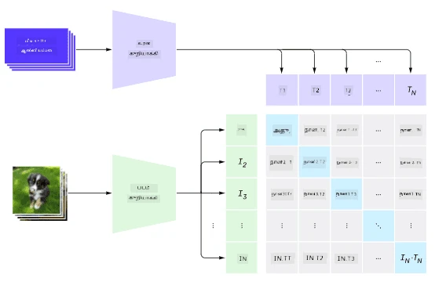
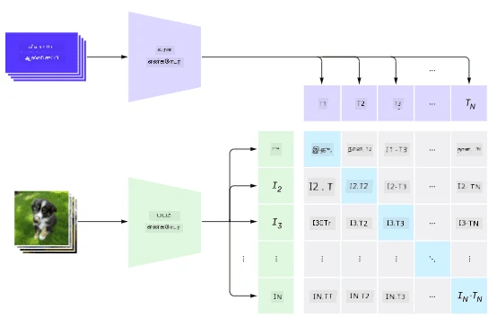
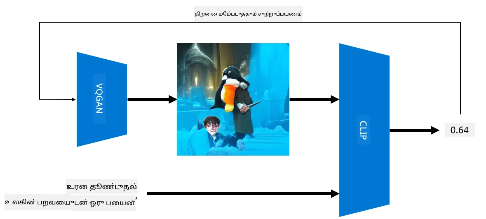

# பல்முக வலைப்பின்னல்கள்

NLP பணிகளைத் தீர்க்க டிரான்ஸ்ஃபார்மர் மாடல்கள் வெற்றிபெற்ற பிறகு, அதே அல்லது இதே போன்ற கட்டமைப்புகள் கணினி காட்சி பணிகளுக்கு பயன்படுத்தப்பட்டன. காட்சி மற்றும் இயற்கை மொழி திறன்களை *இணைக்கும்* மாடல்களை உருவாக்குவதில் அதிக ஆர்வம் உள்ளது. OpenAI இன் முயற்சிகளில் ஒன்று CLIP மற்றும் DALL.E என அழைக்கப்படுகிறது.

## எதிர்மறை காட்சி முன்பயிற்சி (CLIP)

CLIP இன் முக்கிய நோக்கம், உரை முன்மொழிவுகளை ஒரு படத்துடன் ஒப்பிட்டு, அந்த படம் முன்மொழிவுடன் எவ்வளவு பொருந்துகிறது என்பதைத் தீர்மானிக்க வேண்டும்.

> *[இந்த வலைப்பதிவில்](https://openai.com/blog/clip/) இருந்து எடுத்த படம்*

இந்த மாடல் இணையத்திலிருந்து பெறப்பட்ட படங்கள் மற்றும் அவற்றின் விளக்கங்களின் அடிப்படையில் பயிற்சியளிக்கப்படுகிறது. ஒவ்வொரு தொகுப்பிற்கும், N (படம், உரை) ஜோடிகளை எடுத்து, அவற்றை சில வெக்டார் பிரதிநிதிகளாக மாற்றுகிறோம் I1,..., IN / T1, ..., TN. இந்த பிரதிநிதிகள் பின்னர் ஒன்றுக்கொன்று பொருந்துகின்றன. இழப்புக் கோட்பாடு, ஒரு ஜோடிக்கு (எ.கா. Ii மற்றும் Ti) இடையிலான கோசைன் ஒற்றுமையை அதிகரிக்கவும், மற்ற அனைத்து ஜோடிகளுக்கிடையிலான கோசைன் ஒற்றுமையை குறைக்கவும் வரையறுக்கப்பட்டுள்ளது. அதனால் இந்த அணுகுமுறை **எதிர்மறை** என அழைக்கப்படுகிறது.

CLIP மாடல்/நூலகம் [OpenAI GitHub](https://github.com/openai/CLIP) இல் கிடைக்கிறது. இந்த அணுகுமுறை [இந்த வலைப்பதிவில்](https://openai.com/blog/clip/) விவரிக்கப்பட்டுள்ளது, மேலும் [இந்த ஆவணத்தில்](https://arxiv.org/pdf/2103.00020.pdf) விரிவாக விளக்கப்பட்டுள்ளது.

இந்த மாடல் முன்பயிற்சி செய்யப்பட்ட பிறகு, நாம் ஒரு தொகுப்பு படங்களையும் ஒரு தொகுப்பு உரை முன்மொழிவுகளையும் கொடுக்கலாம், இது சாத்தியக்கூறுகளுடன் கூடிய டென்சரை திருப்பி அளிக்கும். CLIP பல பணிகளுக்கு பயன்படுத்தப்படலாம்:

**பட வகைப்படுத்தல்**

நாம் படங்களை, உதாரணமாக, பூனைகள், நாய்கள் மற்றும் மனிதர்கள் ஆகியவற்றுக்கு இடையில் வகைப்படுத்த வேண்டும் எனக் கருதுக. இந்த நிலையில், மாடலுக்கு ஒரு படம் மற்றும் ஒரு தொடர் உரை முன்மொழிவுகளை கொடுக்கலாம்: "*ஒரு பூனையின் படம்*", "*ஒரு நாயின் படம்*", "*ஒரு மனிதனின் படம்*". 3 சாத்தியக்கூறுகளின் விளைவாக கிடைக்கும் வெக்டாரில், அதிக மதிப்புள்ள குறியீட்டை தேர்ந்தெடுக்க வேண்டும்.

> *[இந்த வலைப்பதிவில்](https://openai.com/blog/clip/) இருந்து எடுத்த படம்*

**உரையின் அடிப்படையிலான பட தேடல்**

நாம் இதற்கு மாறாகவும் செய்யலாம். ஒரு படத் தொகுப்பை வைத்திருந்தால், அந்த தொகுப்பை மாடலுக்கு அனுப்பி, ஒரு உரை முன்மொழிவை கொடுக்கலாம் - இது கொடுக்கப்பட்ட முன்மொழிவுக்கு மிகவும் பொருந்தும் படத்தை அளிக்கும்.

## ✍️ உதாரணம்: [CLIP ஐப் பயன்படுத்தி பட வகைப்படுத்தல் மற்றும் பட தேடல்](Clip.ipynb)

CLIP செயல்படுவது எப்படி என்பதைப் பார்க்க [Clip.ipynb](Clip.ipynb) நோட்புக் திறக்கவும்.

## VQGAN+CLIP உடன் பட உருவாக்கம்

CLIP ஐ **உரையிலிருந்து பட உருவாக்கம்** செய்யவும் பயன்படுத்தலாம். இதைச் செய்ய, ஒரு **உருவாக்கி மாடல்** தேவைப்படும், இது சில வெக்டார் உள்ளீட்டின் அடிப்படையில் படங்களை உருவாக்க முடியும். [VQGAN](https://compvis.github.io/taming-transformers/) (Vector-Quantized GAN) என அழைக்கப்படும் மாடல்களில் ஒன்று.

VQGAN இன் முக்கியமான கருத்துக்கள், சாதாரண [GAN](../../4-ComputerVision/10-GANs/README.md) களிலிருந்து வேறுபட்டவை:
* படத்தை உருவாக்கும் சூழலுடன் கூடிய காட்சி பகுதிகளின் தொடரை உருவாக்க ஆட்டோரெக்ரெசிவ் டிரான்ஸ்ஃபார்மர் கட்டமைப்பைப் பயன்படுத்துதல். இந்த காட்சி பகுதிகள் [CNN](../../4-ComputerVision/07-ConvNets/README.md) மூலம் கற்றுக்கொள்ளப்படுகின்றன.
* "முழுமையா அல்லது இல்லையா" அணுகுமுறைக்கு பதிலாக, படத்தின் பகுதிகள் "உண்மையானவை" அல்லது "போலியானவை" என்பதை கண்டறியும் துணை-பட வேறுபாட்டாளரைப் பயன்படுத்துதல்.

VQGAN பற்றி மேலும் அறிய [Taming Transformers](https://compvis.github.io/taming-transformers/) இணையதளத்தை பார்வையிடவும்.

VQGAN மற்றும் பாரம்பரிய GAN களுக்கிடையிலான முக்கியமான வேறுபாடுகளில் ஒன்று, GAN எந்த உள்ளீட்டு வெக்டாரிலிருந்தும் ஒரு நல்ல படத்தை உருவாக்க முடியும், ஆனால் VQGAN ஒருங்கிணைந்த படத்தை உருவாக்க முடியாமல் போகலாம். எனவே, பட உருவாக்க செயல்முறையை மேலும் வழிநடத்த வேண்டும், இது CLIP ஐப் பயன்படுத்தி செய்ய முடியும்.

ஒரு உரை முன்மொழிவுக்கு பொருந்தும் படத்தை உருவாக்க, சில சீரற்ற குறியீட்டு வெக்டாருடன் தொடங்குகிறோம், இது VQGAN வழியாக அனுப்பப்பட்டு ஒரு படத்தை உருவாக்குகிறது. பின்னர் CLIP ஒரு இழப்புக் கோட்பாட்டை உருவாக்க பயன்படுத்தப்படுகிறது, இது படம் உரை முன்மொழிவுக்கு எவ்வளவு பொருந்துகிறது என்பதை காட்டுகிறது. பின்னர் இந்த இழப்பை குறைப்பதே நோக்கம், பின்னடைவு மூலம் உள்ளீட்டு வெக்டார் அளவுருக்களை சரிசெய்தல்.

VQGAN+CLIP ஐ செயல்படுத்தும் ஒரு சிறந்த நூலகம் [Pixray](http://github.com/pixray/pixray)

 |   | 
----|----|----
முன்மொழிவு *ஒரு புத்தகத்துடன் இளம் ஆண் இலக்கிய ஆசிரியரின் நெருக்கமான நீர்வண்ண உருவப்படம்* | முன்மொழிவு *ஒரு கணினியுடன் இளம் பெண் கணினி அறிவியல் ஆசிரியரின் நெருக்கமான எண்ணெய் உருவப்படம்* | முன்மொழிவு *கரும்பலகையின் முன் முதிய ஆண் கணித ஆசிரியரின் நெருக்கமான எண்ணெய் உருவப்படம்*

> **Artificial Teachers** தொகுப்பிலிருந்து [Dmitry Soshnikov](http://soshnikov.com) உருவாக்கிய படங்கள்

## DALL-E
### [DALL-E 1](https://openai.com/research/dall-e)
DALL-E என்பது GPT-3 இன் ஒரு பதிப்பு, இது முன்மொழிவுகளிலிருந்து படங்களை உருவாக்க பயிற்சியளிக்கப்பட்டது. இது 12-பில்லியன் அளவுருக்களுடன் பயிற்சியளிக்கப்பட்டுள்ளது.

CLIP ஐ விட DALL-E உரை மற்றும் படத்தை ஒரே டோக்கன்களின் ஓர் ஓட்டமாக பெறுகிறது. எனவே, பல முன்மொழிவுகளிலிருந்து, உரையின் அடிப்படையில் படங்களை உருவாக்க முடியும்.

### [DALL-E 2](https://openai.com/dall-e-2)
DALL-E 1 மற்றும் 2 இன் முக்கியமான வேறுபாடு, இது மேலும் யதார்த்தமான படங்கள் மற்றும் கலைகளை உருவாக்குகிறது.

DALL-E மூலம் உருவாக்கப்பட்ட படங்களின் உதாரணங்கள்:
 |   | 
----|----|----
முன்மொழிவு *ஒரு புத்தகத்துடன் இளம் ஆண் இலக்கிய ஆசிரியரின் நெருக்கமான நீர்வண்ண உருவப்படம்* | முன்மொழிவு *ஒரு கணினியுடன் இளம் பெண் கணினி அறிவியல் ஆசிரியரின் நெருக்கமான எண்ணெய் உருவப்படம்* | முன்மொழிவு *கரும்பலகையின் முன் முதிய ஆண் கணித ஆசிரியரின் நெருக்கமான எண்ணெய் உருவப்படம்*

## குறிப்புகள்

* VQGAN ஆவணம்: [Taming Transformers for High-Resolution Image Synthesis](https://compvis.github.io/taming-transformers/paper/paper.pdf)
* CLIP ஆவணம்: [Learning Transferable Visual Models From Natural Language Supervision](https://arxiv.org/pdf/2103.00020.pdf)

---

**குறிப்பு**:  
இந்த ஆவணம் [Co-op Translator](https://github.com/Azure/co-op-translator) என்ற AI மொழிபெயர்ப்பு சேவையை பயன்படுத்தி மொழிபெயர்க்கப்பட்டுள்ளது. எங்கள் நோக்கம் துல்லியமாக இருக்க வேண்டும் என்பதுதான், ஆனால் தானியங்கி மொழிபெயர்ப்புகளில் பிழைகள் அல்லது துல்லியமின்மைகள் இருக்கக்கூடும் என்பதை தயவுசெய்து கவனத்தில் கொள்ளவும். அதன் தாய்மொழியில் உள்ள மூல ஆவணம் அதிகாரப்பூர்வ ஆதாரமாக கருதப்பட வேண்டும். முக்கியமான தகவல்களுக்கு, தொழில்முறை மனித மொழிபெயர்ப்பு பரிந்துரைக்கப்படுகிறது. இந்த மொழிபெயர்ப்பைப் பயன்படுத்துவதால் ஏற்படும் எந்த தவறான புரிதல்கள் அல்லது தவறான விளக்கங்களுக்கு நாங்கள் பொறுப்பல்ல.