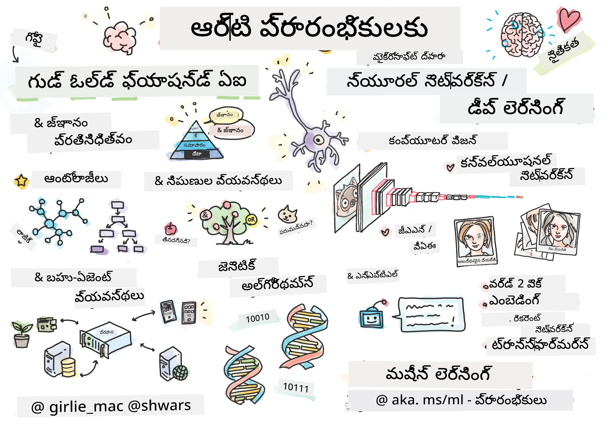

[](https://github.com/microsoft/AI-For-Beginners/blob/main/LICENSE)
[](https://GitHub.com/microsoft/AI-For-Beginners/graphs/contributors/)
[](https://GitHub.com/microsoft/AI-For-Beginners/issues/)
[](https://GitHub.com/microsoft/AI-For-Beginners/pulls/)
[](http://makeapullrequest.com)

[](https://GitHub.com/microsoft/AI-For-Beginners/watchers/)
[](https://GitHub.com/microsoft/AI-For-Beginners/network/)
[](https://GitHub.com/microsoft/AI-For-Beginners/stargazers/)
[](https://mybinder.org/v2/gh/microsoft/ai-for-beginners/HEAD)
[](https://gitter.im/Microsoft/ai-for-beginners?utm_source=badge&utm_medium=badge&utm_campaign=pr-badge)

[](https://discord.gg/nTYy5BXMWG)

# ప్రారంభికుల కోసం కృత్రిమ మేధస్సు - ఒక పాఠ్యક્રમం

||
|:---:|
| ప్రారంభికుల కోసం AI - _[@girlie_mac](https://twitter.com/girlie_mac) చేత స్కెచ్‌నోట్_ |

మా 12-వారాల, 24-పాఠాల పాఠ్యক্রমంతో **కృత్రిమ మేధస్సు** (AI) ప్రపంచాన్ని అన్వేషించండి! దీని లోపల ప్రాక్టికల్ పాఠాలు, క్విజ్లు మరియు ప్రయోగశాలలు ఉన్నాయి. ఈ పాఠ్యಕ್ರಮం ప్రారంభికులకై అనుకూలంగా ఉంది మరియు TensorFlow, PyTorch వంటి సాధనాలు మరియు AI లో ఆచరణాత్మకతలను కవర్ చేస్తుంది.


### 🌐 బహుభాషా మద్దతు

#### GitHub కార్యాచరణ ద్వారా మద్దతు పొందింది (స్వయంచాలక & ఎల్లప్పుడూ తాజా)

<!-- CO-OP TRANSLATOR LANGUAGES TABLE START -->
[Arabic](../ar/README.md) | [Bengali](../bn/README.md) | [Bulgarian](../bg/README.md) | [Burmese (Myanmar)](../my/README.md) | [Chinese (Simplified)](../zh-CN/README.md) | [Chinese (Traditional, Hong Kong)](../zh-HK/README.md) | [Chinese (Traditional, Macau)](../zh-MO/README.md) | [Chinese (Traditional, Taiwan)](../zh-TW/README.md) | [Croatian](../hr/README.md) | [Czech](../cs/README.md) | [Danish](../da/README.md) | [Dutch](../nl/README.md) | [Estonian](../et/README.md) | [Finnish](../fi/README.md) | [French](../fr/README.md) | [German](../de/README.md) | [Greek](../el/README.md) | [Hebrew](../he/README.md) | [Hindi](../hi/README.md) | [Hungarian](../hu/README.md) | [Indonesian](../id/README.md) | [Italian](../it/README.md) | [Japanese](../ja/README.md) | [Kannada](../kn/README.md) | [Korean](../ko/README.md) | [Lithuanian](../lt/README.md) | [Malay](../ms/README.md) | [Malayalam](../ml/README.md) | [Marathi](../mr/README.md) | [Nepali](../ne/README.md) | [Nigerian Pidgin](../pcm/README.md) | [Norwegian](../no/README.md) | [Persian (Farsi)](../fa/README.md) | [Polish](../pl/README.md) | [Portuguese (Brazil)](../pt-BR/README.md) | [Portuguese (Portugal)](../pt-PT/README.md) | [Punjabi (Gurmukhi)](../pa/README.md) | [Romanian](../ro/README.md) | [Russian](../ru/README.md) | [Serbian (Cyrillic)](../sr/README.md) | [Slovak](../sk/README.md) | [Slovenian](../sl/README.md) | [Spanish](../es/README.md) | [Swahili](../sw/README.md) | [Swedish](../sv/README.md) | [Tagalog (Filipino)](../tl/README.md) | [Tamil](../ta/README.md) | [Telugu](./README.md) | [Thai](../th/README.md) | [Turkish](../tr/README.md) | [Ukrainian](../uk/README.md) | [Urdu](../ur/README.md) | [Vietnamese](../vi/README.md)

> **స్థానికంగా క్లోన్ చేయాలనుకుంటున్నారా?**

> ఈ భాండాగారం 50+ భాషా అనువదింపుల్ని కలిగి ఉండడంతో డౌన్లోడ్ పరిమాణం చాలా పెరుగుతుంది. అనువదింపుల్ని లేకుండా క్లోన్ చేయడానికి, స్పార్స్ చెకౌట్ ఉపయోగించండి:
> ```bash
> git clone --filter=blob:none --sparse https://github.com/microsoft/AI-For-Beginners.git
> cd AI-For-Beginners
> git sparse-checkout set --no-cone '/*' '!translations' '!translated_images'
> ```
> ఇది మీరు కోర్స్ పూర్తి చేసుకోవడానికి అవసరమైన అన్నీ చాలా వేగంగా డౌన్లోడ్ చేయడానికి అనుమతిస్తుంది.
<!-- CO-OP TRANSLATOR LANGUAGES TABLE END -->

**మీరు ఇంకా అనువాద భాషలు మద్దతు కావాలి అనుకుంటే అవి ఇక్కడ [here](https://github.com/Azure/co-op-translator/blob/main/getting_started/supported-languages.md) సూచించబడ్డాయి**

## కమ్యూనిటీని చేరండి
[](https://discord.gg/nTYy5BXMWG)

## మీరు ఎం నేర్చుకుంటారు

**[కోర్స్ యొక్క మైండ్ మాప్](http://soshnikov.com/courses/ai-for-beginners/mindmap.html)**

ఈ పాఠ్యక్రమంలో, మీరు నేర్చుకోబోయే పฆారాలు:

* వేర్వేరు విధాలుగా కృత్రిమ మేధస్సు కు దృష్టి, ఆ "గుడ్ ఓల్డ్" సారూపక దృక్కోణం తో కూడిన **జ్ఞాన ప్రాతినిధ్యం** మరియు తర్కం ([GOFAI](https://en.wikipedia.org/wiki/Symbolic_artificial_intelligence)) సహా.
* ఆధునిక AI యొక్క మూలంగా ఉన్న **న్యూరల్ నెట్‌వర్క్లు** మరియు **డీప్ లెర్నింగ్**. ఈ ముఖ్యాంశాల వెనుక భావాలను [TensorFlow](http://Tensorflow.org) మరియు [PyTorch](http://pytorch.org) అనే రెండు ప్రసిద్ధ ఫ్రేమ్‌వర్క్లలోని కోడ్ ఉపయోగించి వివరించబోతున్నాము.
* చిత్రాలు మరియు టెక్స్ట్‌తో పనిచేసే **న్యూరల్ معماريలు**. ఇటివల మోడళ్లను కవర్ చేస్తుంది కానీ అత్యాధునిక పరిస్థితిలో కొంచెం కొరత ఉండవచ్చు.
* తక్కువ ప్రాచుర్యం పొందిన AI దృష్టులైన **జెనెటిక్ అల్గోరిథమ్‌లు** మరియు **మల్టీ-ఏజెంట్ సిస్టమ్స్**.

ఈ పాఠ్యక్రమంలో మేము కవర్ చేయబోయే వాటి కంటే వేరే విషయాలు:

> [ఈ కోర్సుకు సంబంధించిన అన్ని అదనపు వనరులను మా Microsoft Learn కలెక్షన్ లో కనుగొనండి](https://learn.microsoft.com/en-us/collections/7w28iy2xrqzdj0?WT.mc_id=academic-77998-bethanycheum)

* **వ్యవసాయ రంగంలో AI** యొక్క వ్యాపార కేసులు. దీని కోసం, Microsoft Learnలో [Introduction to AI for business users](https://docs.microsoft.com/learn/paths/introduction-ai-for-business-users/?WT.mc_id=academic-77998-bethanycheum) నేర్చుకునే మార్గం లేదా [AI Business School](https://www.microsoft.com/ai/ai-business-school/?WT.mc_id=academic-77998-bethanycheum), [INSEAD](https://www.insead.edu/) తో కలిసి అభివృద్ధి చేయబడింది, తీసుకోవచ్చు.
* మా [Machine Learning for Beginners Curriculum](http://github.com/Microsoft/ML-for-Beginners)లో వివరించబడిన **సాంప్రదాయ యంత్ర అధ్యయనం**.
* **[Cognitive Services](https://azure.microsoft.com/services/cognitive-services/?WT.mc_id=academic-77998-bethanycheum)** ఉపయోగించి కుడా ప్రాక్టికల్ AI అప్లికేషన్లు. దానికి, మీరు Microsoft Learnలోని [vision](https://docs.microsoft.com/learn/paths/create-computer-vision-solutions-azure-cognitive-services/?WT.mc_id=academic-77998-bethanycheum), [natural language processing](https://docs.microsoft.com/learn/paths/explore-natural-language-processing/?WT.mc_id=academic-77998-bethanycheum), **[Generative AI with Azure OpenAI Service](https://learn.microsoft.com/en-us/training/paths/develop-ai-solutions-azure-openai/?WT.mc_id=academic-77998-bethanycheum)** మరియు మరింత మాడ్యూల్స్ తో ప్రారంభమవ్వడం సిఫార్సు.
* [Azure Machine Learning](https://azure.microsoft.com/services/machine-learning/?WT.mc_id=academic-77998-bethanycheum), [Microsoft Fabric](https://learn.microsoft.com/en-us/training/paths/get-started-fabric/?WT.mc_id=academic-77998-bethanycheum), లేదా [Azure Databricks](https://docs.microsoft.com/learn/paths/data-engineer-azure-databricks?WT.mc_id=academic-77998-bethanycheum) వంటి ప్రత్యేక ML క్లౌడ్ ఫ్రేమ్‌వర్క్లు. [Build and operate machine learning solutions with Azure Machine Learning](https://docs.microsoft.com/learn/paths/build-ai-solutions-with-azure-ml-service/?WT.mc_id=academic-77998-bethanycheum) మరియు [Build and Operate Machine Learning Solutions with Azure Databricks](https://docs.microsoft.com/learn/paths/build-operate-machine-learning-solutions-azure-databricks/?WT.mc_id=academic-77998-bethanycheum) నేర్చుకునే మార్గాలను ఉపయోగించండి.
* **కథన AI** మరియు **చాట్ బాట్స్**. ప్రత్యేకంగా [Create conversational AI solutions](https://docs.microsoft.com/learn/paths/create-conversational-ai-solutions/?WT.mc_id=academic-77998-bethanycheum) నేర్చుకునే మార్గం ఉంది, మరియు [ఈ బ్లాగ్ పోస్టును](https://soshnikov.com/azure/hello-bot-conversational-ai-on-microsoft-platform/) కూడా చూడవచ్చు మరిన్ని వివరాలకు.
* సుదీర్ఘ గణిత శాస్త్రం (డీప్ లెర్నింగ్ వెనుక). దీ కోసం, ఇయాన్ గూడ్‌ఫెలో, Yoshua Bengio మరియు ఆయిరాన్ Courville వారు రచించిన [Deep Learning](https://www.amazon.com/Deep-Learning-Adaptive-Computation-Machine/dp/0262035618) పుస్తకం, ఇది ఆన్‌లైన్‌లో [https://www.deeplearningbook.org/](https://www.deeplearningbook.org/) అందుబాటులో ఉంది, మేముం సిఫార్సు చేస్తాము.

_క్లౌడ్‌లో AI_ ప్రకటనలకు మృదువైన పరిచయం కోసం మీరు [Get started with artificial intelligence on Azure](https://docs.microsoft.com/learn/paths/get-started-with-artificial-intelligence-on-azure/?WT.mc_id=academic-77998-bethanycheum) నేర్చుకునే మార్గాన్ని తీసుకోవచ్చు.

# విషయం

|     |                                                                 పాఠం లింక్                                                                  |                                           PyTorch/Keras/TensorFlow                                          | ప్రయోగశాల                                                            |
| :-: | :------------------------------------------------------------------------------------------------------------------------------------------: | :---------------------------------------------------------------------------------------------: | ------------------------------------------------------------------------------ |
| 0  |                                 [పాఠ్యక్రమ సెటప్](./lessons/0-course-setup/setup.md)                                 |                      [మీ అభివృద్ధి వాతావరణం సెటప్ చేయండి](./lessons/0-course-setup/how-to-run.md)                       |   |
| I  |               [**AIకి పరిచయం**](./lessons/1-Intro/README.md)      | | |
| 01  |       [AI పరిచయం మరియు చరిత్ర](./lessons/1-Intro/README.md)       |           -                            | -  |
| II |              **సారూపక AI**              |
| 02  |       [జ్ఞాన ప్రాతినిధ్యం మరియు నిపుణ వ్యవస్థలు](./lessons/2-Symbolic/README.md)       |            [నిపుణ వ్యవస్థలు](./lessons/2-Symbolic/Animals.ipynb) /  [ఆంటాలజీ](./lessons/2-Symbolic/FamilyOntology.ipynb) /[సంకల్ప గ్రాఫ్](./lessons/2-Symbolic/MSConceptGraph.ipynb)                             |  |
| III |                        [**న్యూరల్ నెట్‌వర్క్ల పరిచయం**](./lessons/3-NeuralNetworks/README.md) |||
| 03  |                [పర్సెప్ట్రాన్](./lessons/3-NeuralNetworks/03-Perceptron/README.md)                 |                       [నోట్‌బుక్](./lessons/3-NeuralNetworks/03-Perceptron/Perceptron.ipynb)                      | [ల్యాబ్](./lessons/3-NeuralNetworks/03-Perceptron/lab/README.md) |
| 04  |                   [మల్టీ-లేయర్‌డ్ పర్సెప్ట్రాన్ మరియు మన స్వంత ఫ్రేమ్‌వర్క్ సృష్టించడం](./lessons/3-NeuralNetworks/04-OwnFramework/README.md)                   |        [నోట్‌బుక్](./lessons/3-NeuralNetworks/04-OwnFramework/OwnFramework.ipynb)        | [ల్యాబ్](./lessons/3-NeuralNetworks/04-OwnFramework/lab/README.md) |
| 05  |            [ఫ్రేమ్‌వర్క్‌ల (PyTorch/TensorFlow) పరిచయం మరియు ఓవర్‌ఫిట్టింగ్](./lessons/3-NeuralNetworks/05-Frameworks/README.md)             |           [PyTorch](./lessons/3-NeuralNetworks/05-Frameworks/IntroPyTorch.ipynb) / [Keras](./lessons/3-NeuralNetworks/05-Frameworks/IntroKeras.ipynb) / [TensorFlow](./lessons/3-NeuralNetworks/05-Frameworks/IntroKerasTF.ipynb)             | [ల్యాబ్](./lessons/3-NeuralNetworks/05-Frameworks/lab/README.md) |
| IV  |            [**కంప్యూటర్ విజన్**](./lessons/4-ComputerVision/README.md)             | [PyTorch](https://docs.microsoft.com/learn/modules/intro-computer-vision-pytorch/?WT.mc_id=academic-77998-cacaste) / [TensorFlow](https://docs.microsoft.com/learn/modules/intro-computer-vision-TensorFlow/?WT.mc_id=academic-77998-cacaste)| [మైక్రోసాఫ్ట్ అజ్యూర్‌లో కంప్యూటర్ విజన్ అన్వేషించండి](https://learn.microsoft.com/en-us/collections/7w28iy2xrqzdj0?WT.mc_id=academic-77998-bethanycheum) |
| 06  |            [కంప్యూటర్ విజన్ పరిచయం. OpenCV](./lessons/4-ComputerVision/06-IntroCV/README.md)             |           [నోట్‌బుక్](./lessons/4-ComputerVision/06-IntroCV/OpenCV.ipynb)         | [ల్యాబ్](./lessons/4-ComputerVision/06-IntroCV/lab/README.md) |
| 07  |            [కన్వల్యూషనల్ న్యూరల్ నెట్‌వర్క్స్](./lessons/4-ComputerVision/07-ConvNets/README.md) &  [CNN ఆర్కిటెక్చర్లు](./lessons/4-ComputerVision/07-ConvNets/CNN_Architectures.md)             |           [PyTorch](./lessons/4-ComputerVision/07-ConvNets/ConvNetsPyTorch.ipynb) /[TensorFlow](./lessons/4-ComputerVision/07-ConvNets/ConvNetsTF.ipynb)             | [ల్యాబ్](./lessons/4-ComputerVision/07-ConvNets/lab/README.md) |
| 08  |            [మునుపటి శిక్షణ పొందిన నెట్‌వర్క్లు మరియు ట్రాన్స్‌ఫర్ లెర్నింగ్](./lessons/4-ComputerVision/08-TransferLearning/README.md) మరియు [శిక్షణ ట్రిక్స్](./lessons/4-ComputerVision/08-TransferLearning/TrainingTricks.md)             |           [PyTorch](./lessons/4-ComputerVision/08-TransferLearning/TransferLearningPyTorch.ipynb) / [TensorFlow](./lessons/3-NeuralNetworks/05-Frameworks/IntroKerasTF.ipynb)             | [ల్యాబ్](./lessons/4-ComputerVision/08-TransferLearning/lab/README.md) |
| 09  |            [ఆటోఎంకోడర్స్ మరియు VAEs](./lessons/4-ComputerVision/09-Autoencoders/README.md)             |           [PyTorch](./lessons/4-ComputerVision/09-Autoencoders/AutoEncodersPyTorch.ipynb) / [TensorFlow](./lessons/4-ComputerVision/09-Autoencoders/AutoencodersTF.ipynb)             |  |
| 10  |            [జెనెరేటివ్ అడ్వర్సేరియల్ నెట్‌వర్క్లు & ఆర్టిస్టిక్ స్టైల్ ట్రాన్స్‌ఫర్](./lessons/4-ComputerVision/10-GANs/README.md)             |           [PyTorch](./lessons/4-ComputerVision/10-GANs/GANPyTorch.ipynb) / [TensorFlow](./lessons/4-ComputerVision/10-GANs/GANTF.ipynb)             |  |
| 11  |            [ఆబ్జెక్ట్ డిటెక్షన్](./lessons/4-ComputerVision/11-ObjectDetection/README.md)             |         [TensorFlow](./lessons/4-ComputerVision/11-ObjectDetection/ObjectDetection.ipynb)             | [ల్యాబ్](./lessons/4-ComputerVision/11-ObjectDetection/lab/README.md) |
| 12  |            [సెమాంటిక్ సెగ్మెంటేషన్. U-Net](./lessons/4-ComputerVision/12-Segmentation/README.md)             |           [PyTorch](./lessons/4-ComputerVision/12-Segmentation/SemanticSegmentationPytorch.ipynb) / [TensorFlow](./lessons/4-ComputerVision/12-Segmentation/SemanticSegmentationTF.ipynb)             |  |
| V  |            [**నేచురల్ లాంగ్వేజ్ ప్రాసెసింగ్**](./lessons/5-NLP/README.md)             | [PyTorch](https://docs.microsoft.com/learn/modules/intro-natural-language-processing-pytorch/?WT.mc_id=academic-77998-cacaste) /[TensorFlow](https://docs.microsoft.com/learn/modules/intro-natural-language-processing-TensorFlow/?WT.mc_id=academic-77998-cacaste) | [మైక్రోసాఫ్ట్ అజ్యూర్‌లో నేచురల్ లాంగ్వేజ్ ప్రాసెసింగ్ అన్వేషించండి](https://learn.microsoft.com/en-us/collections/7w28iy2xrqzdj0?WT.mc_id=academic-77998-bethanycheum)|
| 13  |            [పాఠ్య ప్రాతినిధ్యం. Bow/TF-IDF](./lessons/5-NLP/13-TextRep/README.md)             |           [PyTorch](https://github.com/microsoft/AI-For-Beginners/blob/main/lessons/5-NLP/13-TextRep/TextRepresentationPyTorch.ipynb) / [TensorFlow](https://github.com/microsoft/AI-For-Beginners/blob/main/lessons/5-NLP/13-TextRep/TextRepresentationTF.ipynb)             | |
| 14  |            [సెమాన్టిక్ వర్డ్ ఎంబెడ్డింగ్స్. Word2Vec మరియు GloVe](./lessons/5-NLP/14-Embeddings/README.md)             |           [PyTorch](https://github.com/microsoft/AI-For-Beginners/blob/main/lessons/5-NLP/14-Embeddings/EmbeddingsPyTorch.ipynb) / [TensorFlow](https://github.com/microsoft/AI-For-Beginners/blob/main/lessons/5-NLP/14-Embeddings/EmbeddingsTF.ipynb)             |  |
| 15  |            [భాషా మోడలింగ్. మీ స్వంత ఎంబెడ్డింగ్స్ శిక్షణ](./lessons/5-NLP/15-LanguageModeling/README.md)             |           [PyTorch](https://github.com/microsoft/AI-For-Beginners/blob/main/lessons/5-NLP/15-LanguageModeling/CBoW-PyTorch.ipynb) / [TensorFlow](https://github.com/microsoft/AI-For-Beginners/blob/main/lessons/5-NLP/15-LanguageModeling/CBoW-TF.ipynb)             | [ల్యాబ్](./lessons/5-NLP/15-LanguageModeling/lab/README.md) |
| 16  |            [రికరెంట్ న్యూరల్ నెట్‌వర్క్స్](./lessons/5-NLP/16-RNN/README.md)             |           [PyTorch](https://github.com/microsoft/AI-For-Beginners/blob/main/lessons/5-NLP/16-RNN/RNNPyTorch.ipynb) / [TensorFlow](https://github.com/microsoft/AI-For-Beginners/blob/main/lessons/5-NLP/16-RNN/RNNTF.ipynb)             |  |
| 17  |            [జనరేటివ్ రికరెంట్ నెట్‌వర్క్స్](./lessons/5-NLP/17-GenerativeNetworks/README.md)             |           [PyTorch](https://github.com/microsoft/AI-For-Beginners/blob/main/lessons/5-NLP/17-GenerativeNetworks/GenerativePyTorch.ipynb) / [TensorFlow](https://github.com/microsoft/AI-For-Beginners/blob/main/lessons/5-NLP/17-GenerativeNetworks/GenerativeTF.ipynb)             | [ల్యాబ్](./lessons/5-NLP/17-GenerativeNetworks/lab/README.md) |
| 18  |            [ట్రాన్స్‌ఫార్మర్స్. BERT.](./lessons/5-NLP/18-Transformers/README.md)             |           [PyTorch](https://github.com/microsoft/AI-For-Beginners/blob/main/lessons/5-NLP/18-Transformers/TransformersPyTorch.ipynb) /[TensorFlow](https://github.com/microsoft/AI-For-Beginners/blob/main/lessons/5-NLP/18-Transformers/TransformersTF.ipynb)             |  |
| 19  |            [పేర్చిన ఎంటిటీ గుర్తింపు](./lessons/5-NLP/19-NER/README.md)             |           [TensorFlow](https://microsoft.github.io/AI-For-Beginners/lessons/5-NLP/19-NER/NER-TF.ipynb)             | [ల్యాబ్](./lessons/5-NLP/19-NER/lab/README.md) |
| 20  |            [పెద్ద భాషా మోడల్స్, ప్రాంప్ట్ ప్రోగ్రామింగ్ మరియు ఫ్యూషాట్ పనులు](./lessons/5-NLP/20-LangModels/README.md)             |           [PyTorch](https://microsoft.github.io/AI-For-Beginners/lessons/5-NLP/20-LangModels/GPT-PyTorch.ipynb) | |
| VI |            **ఇతర AI సాంకేతికతలు** || |
| 21  |            [జెనెటిక్ అల్గోరిథమ్స్](./lessons/6-Other/21-GeneticAlgorithms/README.md)             |           [నోట్‌బుక్](./lessons/6-Other/21-GeneticAlgorithms/Genetic.ipynb) | |
| 22  |            [డీప్ రీన్ఫోర్స్‌మెంట్ లెర్నింగ్](./lessons/6-Other/22-DeepRL/README.md)             |           [PyTorch](./lessons/6-Other/22-DeepRL/CartPole-RL-PyTorch.ipynb) /[TensorFlow](./lessons/6-Other/22-DeepRL/CartPole-RL-TF.ipynb)             | [ల్యాబ్](./lessons/6-Other/22-DeepRL/lab/README.md) |
| 23  |            [మల్టీ-ఏజెంట్ సిస్టమ్స్](./lessons/6-Other/23-MultiagentSystems/README.md)             |  | |
| VII |            **AI నెతిక్స్** | | |
| 24  |            [AI నెతిక్స్ మరియు బాధ్యతాయుత AI](./lessons/7-Ethics/README.md)             |           [Microsoft Learn: బాధ్యతాయుత AI స 원ు అవ వార్తాంశం](https://docs.microsoft.com/learn/paths/responsible-ai-business-principles/?WT.mc_id=academic-77998-cacaste) | |
| IX  |            **అత్యధికాలు** | | |
| 25  |            [మల్టీ-మోడల్ నెట్‌వర్క్లు, CLIP మరియు VQGAN](./lessons/X-Extras/X1-MultiModal/README.md)             |           [నోట్‌బుక్](./lessons/X-Extras/X1-MultiModal/Clip.ipynb)    | |

## ప్రతి పాఠం లో

* ముందస్తు చదువు పదార్థం
* అమలు చేయగల జూపిటర్ నోట్‌బుక్స్, ఇవి తరచుగా ఫ్రేమ్‌వర్క్‌కు ప్రత్యేకంగా ఉంటాయి (**PyTorch** లేదా **TensorFlow**). అమలు చేయగల నోట్‌బుక్ కూడా చాలా స 이య సరస్వతీయ పదార్థం కలిగి ఉంటుంది, కాబట్టి అంశాన్ని అర్ధం చేసుకోవడానికి మీరు కనీసం ఒక వర్షన్ నోట్‌బుక్ చూసి తెలుసుకోవాలి (PyTorch లేదా TensorFlow ఏదైనా).
* కొంచెం విషయాలకు **ల్యాబ్స్** అందుబాటులో ఉంటాయి, ఇవి మీరు నేర్చుకున్న పదార్థాన్ని ఒక నిర్దిష్ట సమస్యపై ప్రయోగించడానికి అవకాశం ఇస్తాయి.
* కొన్ని విభాగాలు సంబంధించిన అంశాలను కవర్ చేసే [**MS Learn**](https://learn.microsoft.com/en-us/collections/7w28iy2xrqzdj0?WT.mc_id=academic-77998-bethanycheum) మాడ్యూల్‌లకు లింకులు కలిగి ఉంటాయి.

## ప్రారంభం

### 🎯 AI కొత్తవారా? ఇక్కడి నుంచి ప్రారంభించండి!

మీరు పూర్తిగా AI కొత్తవారుగా ఉంటే మరియు త్వరగా, ప్రత్యక్ష ఉదాహరణలను చూడాలనుకుంటే, మా [**ప్రారంభికులకు అనుకూల ఉదాహరణలు**](./examples/README.md) చూడండి! ఇవి కలిగి ఉంటాయి:

- 🌟 **హలో AI వరల్డ్** - మీ మొదటి AI ప్రోగ్రామ్ (ప్యాటర్న్ గుర్తింపు)
- 🧠 **సరళ న్యూరల్ నెట్‌వర్క్** - సున్నితంగా న్యూరల్ నెట్‌వర్క్ నిర్మాణం  

- 🖼️ **చిత్ర వర్గీకరణకర్త** - పరిశీలన లతో చిత్రాలను వర్గీకరించండి  
- 💬 **పాఠ్య భావవ్యక్తి** - సానుకూల/నెగటివ్ పాఠ్యాన్ని విశ్లేషించండి  

ఈ ఉదాహరణలు పూర్తిగా పాఠ్యాంశంలోకి ప్రవేశించే ముందు AI సంధర్భాలను అర్థం చేసుకోవడంలో మీకు సహాయపడటానికి రూపొందించబడ్డాయి.

### 📚 పూర్తి పాఠ్యాంశం సెట్ అప్

- మా ప్రోగ్రామ్ సెట్ చేసుకోవడానికి మేము ఒక [సెట్ అప్ పాఠం](./lessons/0-course-setup/setup.md) రూపొందించాము. - ఉపాధ్యాయుల కోసం కూడా మేము ఒక [పాఠ్యాంశ సెట్ అప్ పాఠం](./lessons/0-course-setup/for-teachers.md) రూపొందించాము!  
- ఎలా [VSCode లేదా Codespace లో కోడ్ నడుపాలి](./lessons/0-course-setup/how-to-run.md)

ఈ దశలను అనుసరించండి:

రిపాజిటరీని ఫోర్క్ చేయండి: ఈ పేజీ యొక్క పై-కుడి మూలలోని "Fork" బటన్‌పై క్లిక్ చేయండి.

రిపాజిటరీని క్లోన్ చేయండి: `git clone https://github.com/microsoft/AI-For-Beginners.git`

తర్వాత ఈ రెపోను సులభంగా కనుగొనాలంటే నక్షత్రం (🌟) గుర్తించడానికి మరచిపోకండి.

## ఇతర అభ్యసకులను కలవండి

ఈ కోర్సు తీసుకుంటున్న ఇతర అభ్యసకులతో కలవడానికి మా [అధికారిక AI Discord సర్వర్](https://aka.ms/genai-discord?WT.mc_id=academic-105485-bethanycheum) లో చేరండి మరియు సపోర్ట్ పొందండి.

ఉత్పత్తి సూచనలు లేదా ప్రశ్నలు ఉంటే మాకు సందర్శించండి [Azure AI Foundry Developer Forum](https://aka.ms/foundry/forum)  

## క్విజ్‌లు  

> **క్విజ్‌ల గురించి ఒక గమనిక**: అన్ని క్విజ్‌లు etc\quiz-app ఫోల్డర్‌లో ఉన్న Quiz-app లో ఉన్నాయి, లేదా [కథనాత్మకంగా ఇక్కడ](https://ff-quizzes.netlify.app/). అవి పాఠాలలో లింక్ చేయబడ్డాయి. క్విజ్ యాప్‌ను స్థానికంగా నడపవచ్చు లేదా Azure కు డిప్లాయ్ చేయవచ్చు; `quiz-app` ఫోల్డర్ లో ఉన్న సూచనలు అనుసరించండి. అవి దశలవారీగా స్థానీకృతం అవతలుచేస్తుండగా.

## సహాయం కావాలి

మీ ఉంచలనాలున్నాయా లేదా వ్రాతపత్రము లేదా కోడ్ లో తప్పులు కనుగొన్నారు? ఇష్యూ తెరుస్తూ లేదా పుల్ రిక్వెస్ట్ సృష్టించండి.

## ప్రత్యేక కృతజ్ఞతలు

* **✍️ ప్రాథమిక రచయిత:** [Dmitry Soshnikov](http://soshnikov.com), PhD  
* **🔥 ఎడిటర్:** [Jen Looper](https://twitter.com/jenlooper), PhD  
* **🎨 స్కెచ్నోట్ ఇల్లస్ట్రేటర్:** [Tomomi Imura](https://twitter.com/girlie_mac)  
* **✅ క్విజ్ సృష్టికర్త:** [Lateefah Bello](https://github.com/CinnamonXI), [MLSA](https://studentambassadors.microsoft.com/)  
* **🙏 కోర్ సహాయకులు:** [Evgenii Pishchik](https://github.com/Pe4enIks)  

## ఇతర పాఠ్యాంశాలు

మా జట్టు ఇతర పాఠ్యాంశాలు రూపొందిస్తుంది! వీటిని పరిశీలించండి:

<!-- CO-OP TRANSLATOR OTHER COURSES START -->
### LangChain
[](https://aka.ms/langchain4j-for-beginners)
[](https://aka.ms/langchainjs-for-beginners?WT.mc_id=m365-94501-dwahlin)
[](https://github.com/microsoft/langchain-for-beginners?WT.mc_id=m365-94501-dwahlin)
---

### Azure / Edge / MCP / Agents
[](https://github.com/microsoft/AZD-for-beginners?WT.mc_id=academic-105485-koreyst)
[](https://github.com/microsoft/edgeai-for-beginners?WT.mc_id=academic-105485-koreyst)
[](https://github.com/microsoft/mcp-for-beginners?WT.mc_id=academic-105485-koreyst)
[](https://github.com/microsoft/ai-agents-for-beginners?WT.mc_id=academic-105485-koreyst)

---
 
### Generative AI Series
[](https://github.com/microsoft/generative-ai-for-beginners?WT.mc_id=academic-105485-koreyst)
[-9333EA?style=for-the-badge&labelColor=E5E7EB&color=9333EA)](https://github.com/microsoft/Generative-AI-for-beginners-dotnet?WT.mc_id=academic-105485-koreyst)
[-C084FC?style=for-the-badge&labelColor=E5E7EB&color=C084FC)](https://github.com/microsoft/generative-ai-for-beginners-java?WT.mc_id=academic-105485-koreyst)
[-E879F9?style=for-the-badge&labelColor=E5E7EB&color=E879F9)](https://github.com/microsoft/generative-ai-with-javascript?WT.mc_id=academic-105485-koreyst)

---
 
### కోర్ నేర్చుకోలు
[](https://aka.ms/ml-beginners?WT.mc_id=academic-105485-koreyst)
[](https://aka.ms/datascience-beginners?WT.mc_id=academic-105485-koreyst)
[](https://aka.ms/ai-beginners?WT.mc_id=academic-105485-koreyst)
[](https://github.com/microsoft/Security-101?WT.mc_id=academic-96948-sayoung)
[](https://aka.ms/webdev-beginners?WT.mc_id=academic-105485-koreyst)
[](https://aka.ms/iot-beginners?WT.mc_id=academic-105485-koreyst)
[](https://github.com/microsoft/xr-development-for-beginners?WT.mc_id=academic-105485-koreyst)

---
 
### కోపైలట్ సిరీస్
[](https://aka.ms/GitHubCopilotAI?WT.mc_id=academic-105485-koreyst)
[](https://github.com/microsoft/mastering-github-copilot-for-dotnet-csharp-developers?WT.mc_id=academic-105485-koreyst)
[](https://github.com/microsoft/CopilotAdventures?WT.mc_id=academic-105485-koreyst)
<!-- CO-OP TRANSLATOR OTHER COURSES END -->

## సహాయం పొందడం

మీరు ఏదైనా ఇబ్బంది పడినప్పుడు లేదా AI అప్లికేషన్లను తయారుచేయడంలో ప్రశ్నలు ఉంటే, MCP చర్చలలో ఇతర అభ్యసకులు మరియు అనుభవజ్ఞులైన డెవలపర్లతో కలసి చర్చించండి. ఇది సపోర్టివ్ కమ్యూనిటీ, ఇక్కడ ప్రశ్నలు ఆహ్వానించబడతాయి మరియు జ్ఞానం స్వేచ్ఛగా పంచబడుతుంది.

[](https://discord.gg/nTYy5BXMWG)

ఉత్పత్తి ప్రతిస్పందనలు లేదా నిర్మాణ సమయంలో లోపాలు ఉంటే దయచేసి సందర్శించండి:

[](https://aka.ms/foundry/forum)

---

<!-- CO-OP TRANSLATOR DISCLAIMER START -->
**స్వాతంత్ర్య ప్రకటన**:  
ఈ దస్త్రాన్ని AI అనువాద සේవ అయిన [Co-op Translator](https://github.com/Azure/co-op-translator) ఉపయోగించి అనువదించబడింది. మేము ఖచ్చితత్వం కోసం ప్రయత్నిస్తామేను, అయితే ఆటోమేటిక్ అనువాదాల్లో దోషాలు లేదా అసత్యతలు ఉండవచ్చు అని దయచేసి గమనించండి. మూల దస్త్రాన్ని దాని స్వదేశీ భాషలోనే అధికారిక మూలంగా పరిగణించాలి. తప్పనిసరి సమాచారం కోసం, ప్రొఫెషనల్ మానవ అనువాదాన్ని సూచించబడుతుంది. ఈ అనువాదం వాడకం కారణంగా ఏర్పడిన ఏ అవగాహన లోపాలు లేదా తప్పుగా అర్థం చేసుకోవడాలకు మేము బాధ్యులు కాదు.
<!-- CO-OP TRANSLATOR DISCLAIMER END -->