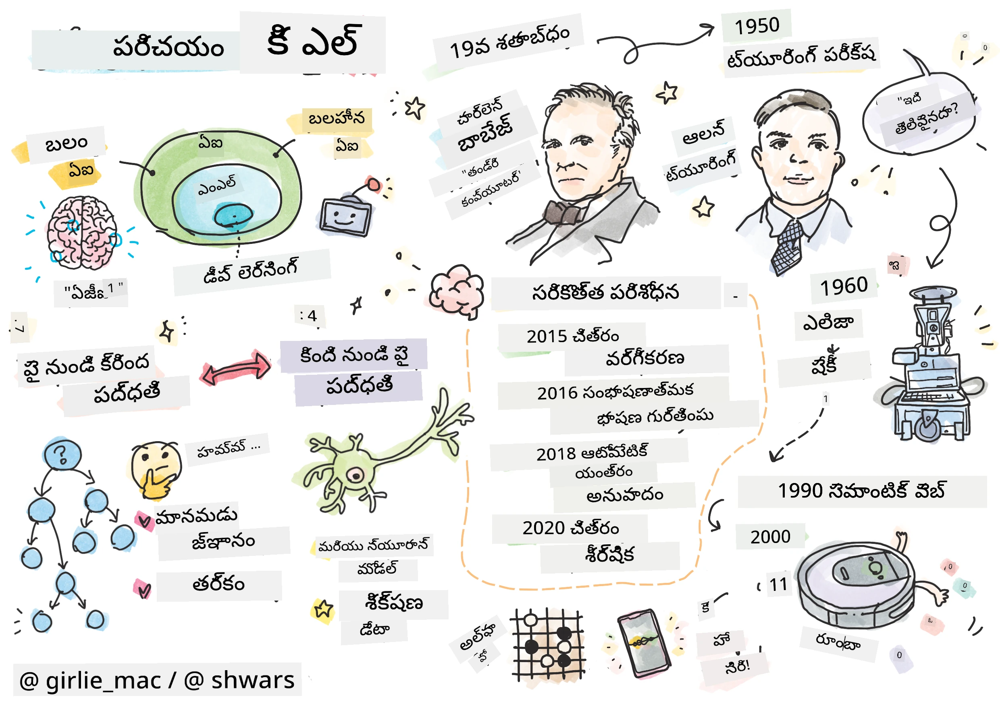
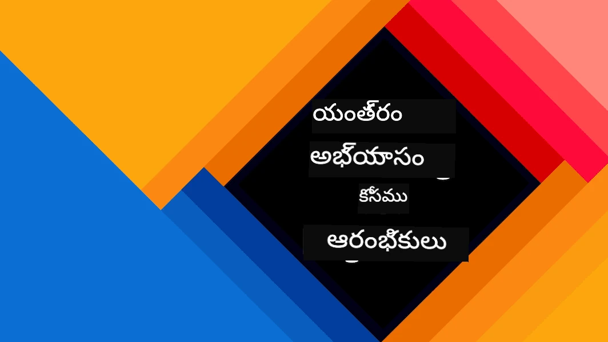
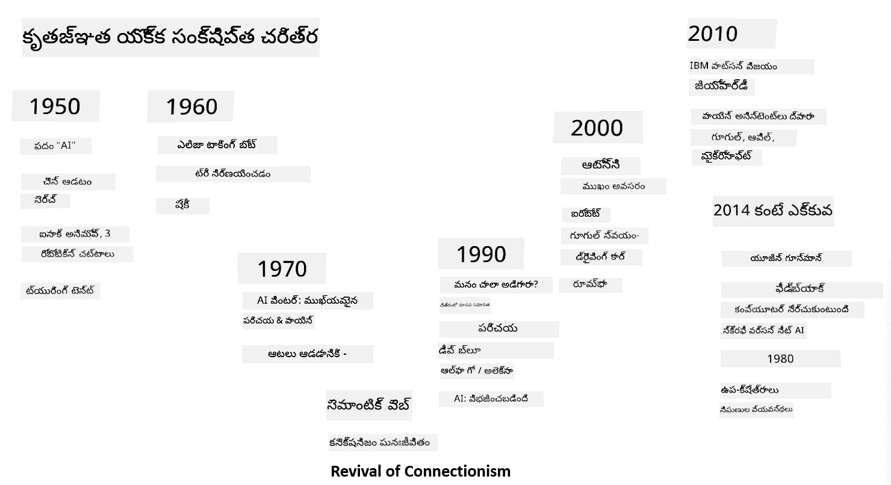

# AI పరిచయం

> స్కెచ్‌నోట్: [Tomomi Imura](https://twitter.com/girlie_mac)

## [పాఠం ముందు క్విజ్](https://ff-quizzes.netlify.app/en/ai/quiz/1)

**కృత్రిమ మేధస్సు** అనేది ఒక ఆసక్తికరమైన శాస్త్రీయ విభాగం, ఇది కంప్యూటర్లను మేధావిగా ప్రవర్తించేటట్లు ఎలా చేయాలో అధ్యయనం చేస్తుంది, ఉదాహరణకు మనుషులు బాగా చేయగల పనులను చేయగలగడం.

మూలంగా, కంప్యూటర్లు [చార్లెస్ బాబేజ్](https://en.wikipedia.org/wiki/Charles_Babbage) చేత సంఖ్యలపై ఒక సుస్పష్టమైన ప్రక్రియను అనుసరించి పనిచేయడానికి ఆవిష్కరించబడ్డాయి - ఒక అల్గోరిథం. ఆధునిక కంప్యూటర్లు, 19వ శతాబ్దంలో ప్రతిపాదించిన మోడల్ కంటే చాలా అభివృద్ధి చెందినప్పటికీ, ఇంకా నియంత్రిత గణనలను అనుసరిస్తాయి. కాబట్టి, లక్ష్యాన్ని సాధించడానికి అవసరమైన ఖచ్చితమైన దశలను మనం తెలుసుకుంటే, కంప్యూటర్‌ను ప్రోగ్రామ్ చేయడం సాధ్యం.

> ఫోటో: [Vickie Soshnikova](http://twitter.com/vickievalerie)

> ✅ ఒక వ్యక్తి ఫోటో నుండి వయస్సును నిర్వచించడం స్పష్టంగా ప్రోగ్రామ్ చేయలేని పని, ఎందుకంటే మనం మన మెదడులో సంఖ్యను ఎలా నిర్ణయిస్తామో తెలియదు.

---

కానీ కొన్ని పనులు మనం స్పష్టంగా ఎలా పరిష్కరించాలో తెలియదు. ఒక వ్యక్తి ఫోటో నుండి వయస్సును నిర్ణయించడం తీసుకోండి. మనం అనేక వయస్సుల వ్యక్తుల ఉదాహరణలు చూసి నేర్చుకున్నాం, కానీ మనం ఎలా చేస్తామో వివరించలేము, అలాగే కంప్యూటర్‌కు ప్రోగ్రామ్ చేయలేము. ఇది **కృత్రిమ మేధస్సు** (AI) ఆసక్తి కలిగించే పనులే.

✅ మీరు AI సహాయంతో కంప్యూటర్‌కు అప్పగించగల పనులను ఆలోచించండి. ఆర్థిక, వైద్య, కళల రంగాలలో AI ఎలా ఉపయోగపడుతోంది?

## వీక్ AI vs. స్ట్రాంగ్ AI

వీక్ AI | స్ట్రాంగ్ AI
---------------------------------------|-------------------------------------
వీక్ AI అనేది ఒక నిర్దిష్ట పని లేదా చిన్న పనుల సమూహం కోసం రూపొందించిన, శిక్షణ పొందిన AI వ్యవస్థలు.|స్ట్రాంగ్ AI లేదా ఆర్టిఫిషియల్ జనరల్ ఇంటెలిజెన్స్ (AGI) అనేది మానవ స్థాయి మేధస్సు మరియు అవగాహన కలిగిన AI వ్యవస్థలు.
ఈ AI వ్యవస్థలు సాధారణ మేధావిగా ఉండవు; అవి ఒక నిర్దిష్ట పనిలో నైపుణ్యం కలిగి ఉంటాయి కానీ నిజమైన అవగాహన లేదా చైతన్యం లేవు.|ఈ AI వ్యవస్థలు మానవులు చేయగల ఏ మేధోపరమైన పనిని చేయగలవు, విభిన్న రంగాలకు అనుకూలించగలవు, మరియు చైతన్యం లేదా స్వీయ అవగాహన కలిగి ఉంటాయి.
వీక్ AI ఉదాహరణలు: సిరి, అలెక్సా వంటి వర్చువల్ అసిస్టెంట్లు, స్ట్రీమింగ్ సర్వీసుల సిఫారసు అల్గోరిథమ్లు, నిర్దిష్ట కస్టమర్ సర్వీస్ పనుల కోసం రూపొందించిన చాట్‌బాట్లు.|స్ట్రాంగ్ AI సాధించడం AI పరిశోధనలో దీర్ఘకాల లక్ష్యం, ఇది వివిధ పనులు మరియు సందర్భాలలో తర్కం, నేర్చుకోవడం, అవగాహన మరియు అనుకూలత కలిగిన AI వ్యవస్థలను అభివృద్ధి చేయాల్సి ఉంటుంది.
వీక్ AI చాలా ప్రత్యేకమైనది, మానవుల మాదిరి జ్ఞాన సామర్థ్యాలు లేదా సాధారణ సమస్య పరిష్కార సామర్థ్యాలు లేవు.|స్ట్రాంగ్ AI ప్రస్తుతం సైద్ధాంతిక భావన మాత్రమే, ఇలాంటి ఏ AI వ్యవస్థ కూడా ఇప్పటివరకు సాధించలేదు.

మరింత సమాచారం కోసం **[ఆర్టిఫిషియల్ జనరల్ ఇంటెలిజెన్స్](https://en.wikipedia.org/wiki/Artificial_general_intelligence)** (AGI) చూడండి.

## మేధస్సు నిర్వచనం మరియు ట్యూరింగ్ పరీక్ష

**[మేధస్సు](https://en.wikipedia.org/wiki/Intelligence)** అనే పదం స్పష్టమైన నిర్వచనం లేకపోవడం ఒక సమస్య. మేధస్సు అనేది **సారాంశ ఆలోచన** లేదా **స్వీయ అవగాహన**కి సంబంధించినదని వాదించవచ్చు, కానీ దీన్ని సరైన రీతిలో నిర్వచించలేము.

> ఫోటో: [Amber Kipp](https://unsplash.com/@sadmax) నుండి Unsplash

*మేధస్సు* అనే పదం అస్పష్టతను చూడటానికి, "పిల్లి మేధావిగా ఉందా?" అనే ప్రశ్నకు జవాబు ఇవ్వండి. వేర్వేరు వ్యక్తులు వేర్వేరు జవాబులు ఇస్తారు, ఎందుకంటే ఈ విషయాన్ని నిరూపించే ఏ సాధారణ పరీక్ష లేదు. మీరు ఉంటే - మీ పిల్లిని IQ పరీక్షలో పెట్టి చూడండి...

✅ మీరు మేధస్సును ఎలా నిర్వచిస్తారు? ఒక కాకి మజిలీని పరిష్కరించి ఆహారం పొందగలదా? ఒక పిల్లవాడు మేధావిగా ఉన్నాడా?

---

AGI గురించి మాట్లాడేటప్పుడు నిజంగా మేధావి వ్యవస్థను సృష్టించామా అని తెలుసుకోవడానికి ఒక పద్ధతి అవసరం. [అలన్ ట్యూరింగ్](https://en.wikipedia.org/wiki/Alan_Turing) ప్రతిపాదించిన **[ట్యూరింగ్ పరీక్ష](https://en.wikipedia.org/wiki/Turing_test)** ఒక నిర్వచనంగా కూడా పనిచేస్తుంది. ఈ పరీక్ష ఒక వ్యవస్థను నిజమైన మానవుడితో పోల్చుతుంది, మరియు ఏ ఆటోమేటిక్ తేడా గుర్తింపు కంప్యూటర్ ప్రోగ్రామ్ ద్వారా తప్పించుకోవచ్చు కాబట్టి, మానవ విచారణకర్త ఉపయోగిస్తారు. ఒక మానవుడు టెక్స్ట్-ఆధారిత సంభాషణలో నిజమైన వ్యక్తి మరియు కంప్యూటర్ వ్యవస్థ మధ్య తేడా గుర్తించలేకపోతే, ఆ వ్యవస్థ మేధావిగా పరిగణించబడుతుంది.

> 2014లో సెయింట్ పీటర్స్‌బర్గ్‌లో అభివృద్ధి చేసిన [Eugene Goostman](https://en.wikipedia.org/wiki/Eugene_Goostman) అనే చాట్‌బాట్ ట్యూరింగ్ పరీక్షకు దగ్గరగా వచ్చింది. ఇది 13 ఏళ్ల ఉక్రెయిన్ బాలుడిగా తనను ప్రకటించి, తెలియకపోవడం మరియు కొన్ని వ్యత్యాసాలను అర్థం చేసుకోవడానికి వ్యక్తిత్వ మాయాజాలం ఉపయోగించింది. 5 నిమిషాల సంభాషణ తర్వాత 30% న్యాయమూర్తులను ఇది మానవుడిగా నమ్మించింది, ఇది ట్యూరింగ్ 2000 నాటికి యంత్రం ఈ పరీక్షను ఉత్తీర్ణం అవుతుందని నమ్మిన ప్రమాణం. అయితే, ఇది మేధావి వ్యవస్థ సృష్టించామని లేదా కంప్యూటర్ మానవ విచారణకర్తను మోసం చేశాడని సూచించదు - మానవులను మోసం చేసిన వారు బాట్ సృష్టికర్తలు!

✅ మీరు ఎప్పుడైనా చాట్‌బాట్ మానవుడితో మాట్లాడుతున్నట్టు అనిపించిందా? అది ఎలా నమ్మించింది?

## AIకి వివిధ దృక్పథాలు

కంప్యూటర్ మానవుల మాదిరిగా ప్రవర్తించాలంటే, మన ఆలోచనా విధానాన్ని కంప్యూటర్‌లో మోడల్ చేయాలి. అందుకే మనం మానవ మేధస్సు ఏమిటి అనేది అర్థం చేసుకోవాలి.

> మేధస్సును యంత్రంలో ప్రోగ్రామ్ చేయాలంటే, మన నిర్ణయ ప్రక్రియలు ఎలా పనిచేస్తాయో అర్థం చేసుకోవాలి. స్వీయ పరిశీలన చేస్తే, కొన్ని ప్రక్రియలు అవగాహన లేకుండా జరుగుతాయని తెలుసుకుంటారు – ఉదాహరణకు, పిల్లిని కుక్కతో తేడా చేయడం ఆలోచించకుండా జరుగుతుంది – మరికొన్ని తర్కం అవసరం.

ఈ సమస్యకు రెండు దృక్పథాలు ఉన్నాయి:

టాప్-డౌన్ దృక్పథం (సింబాలిక్ తర్కం) | బాటమ్-అప్ దృక్పథం (న్యూరల్ నెట్‌వర్క్స్)
---------------------------------------|-------------------------------------
టాప్-డౌన్ దృక్పథం ఒక వ్యక్తి తర్కం విధానాన్ని మోడల్ చేస్తుంది. ఇది మానవుల నుండి **జ్ఞానం** సేకరించి, కంప్యూటర్-ఓదార్పు రూపంలో ప్రతినిధ్యం చేస్తుంది. అలాగే **తర్కం**ని కంప్యూటర్‌లో మోడల్ చేయడం అవసరం.|బాటమ్-అప్ దృక్పథం మానవ మెదడులోని న్యూరాన్ల నిర్మాణాన్ని మోడల్ చేస్తుంది. ప్రతి న్యూరాన్ తన ఇన్‌పుట్‌ల యొక్క బరువు సగటు లాగా పనిచేస్తుంది, మరియు **శిక్షణ డేటా** ద్వారా న్యూరాన్ల నెట్‌వర్క్‌ను ఉపయోగకరమైన సమస్యలు పరిష్కరించడానికి శిక్షణ ఇస్తారు.

ఇంకా కొన్ని ఇతర దృక్పథాలు ఉన్నాయి:

* **ఎమర్జెంట్**, **సినర్జిటిక్** లేదా **మల్టీ-ఏజెంట్ దృక్పథం** అనేది చాలా సులభమైన ఏజెంట్ల పరస్పర చర్య ద్వారా సంక్లిష్ట మేధావి ప్రవర్తన పొందగలదని ఆధారపడింది. [ఎవల్యూషనరీ సైబర్నెటిక్స్](https://en.wikipedia.org/wiki/Global_brain#Evolutionary_cybernetics) ప్రకారం, మేధస్సు *మెటాసిస్టమ్ ట్రాన్సిషన్* ప్రక్రియలో సులభమైన, ప్రతిస్పందనాత్మక ప్రవర్తన నుండి *ఎమర్జ్* అవుతుంది.

* **ఎవల్యూషనరీ దృక్పథం** లేదా **జెనెటిక్ అల్గోరిథం** అనేది అభివృద్ధి సూత్రాలపై ఆధారపడి ఒక ఆప్టిమైజేషన్ ప్రక్రియ.

ఈ దృక్పథాలను కోర్సులో తర్వాత చర్చిస్తాము, కానీ ఇప్పటికి రెండు ప్రధాన దిశలైన టాప్-డౌన్ మరియు బాటమ్-అప్ పై దృష్టి పెడదాం.

### టాప్-డౌన్ దృక్పథం

**టాప్-డౌన్ దృక్పథంలో**, మన తర్కాన్ని మోడల్ చేయడానికి ప్రయత్నిస్తాము. మన ఆలోచనలు అనుసరించగలిగే కారణంగా, ఈ ప్రక్రియను ఫార్మలైజ్ చేసి కంప్యూటర్‌లో ప్రోగ్రామ్ చేయవచ్చు. దీన్ని **సింబాలిక్ తర్కం** అంటారు.

మానవులు తమ నిర్ణయ ప్రక్రియలను మార్గనిర్దేశం చేసే కొన్ని నియమాలు కలిగి ఉంటారు. ఉదాహరణకు, డాక్టర్ ఒక రోగిని నిర్ధారణ చేస్తున్నప్పుడు, అతను జ్వరం ఉందని గమనించి శరీరంలో ఇన్ఫ్లమేషన్ ఉండవచ్చని భావించవచ్చు. పెద్ద సంఖ్యలో నియమాలను ఒక నిర్దిష్ట సమస్యకు వర్తింపజేసి డాక్టర్ తుది నిర్ధారణకు వస్తాడు.

ఈ దృక్పథం **జ్ఞాన ప్రతినిధ్యం** మరియు **తర్కం**పై ఆధారపడి ఉంటుంది. మానవ నిపుణుల నుండి జ్ఞానాన్ని సేకరించడం చాలా కష్టం, ఎందుకంటే డాక్టర్ కొన్నిసార్లు ఎందుకు నిర్ధారణకు వస్తున్నాడో తెలియదు. కొన్ని పనులు, ఉదాహరణకు ఫోటో నుండి వయస్సు నిర్ణయించడం, జ్ఞానాన్ని మార్చడం ద్వారా చేయలేవు.

### బాటమ్-అప్ దృక్పథం

మరొకవైపు, మన మెదడులోని అత్యంత సులభమైన అంశం – న్యూరాన్‌ను మోడల్ చేయవచ్చు. కంప్యూటర్‌లో **కృత్రిమ న్యూరల్ నెట్‌వర్క్** నిర్మించి, దానికి ఉదాహరణలు ఇచ్చి సమస్యలు పరిష్కరించడానికి నేర్పించవచ్చు. ఇది ఒక పుట్టిన పిల్లవాడు తన చుట్టూ ఉన్న ప్రపంచాన్ని పరిశీలించి నేర్చుకునే విధానం లాంటిది.

✅ పిల్లలు ఎలా నేర్చుకుంటారో కొంత పరిశోధన చేయండి. పిల్లల మెదడులో ప్రాథమిక అంశాలు ఏమిటి?

> | ML గురించి ఏమిటి?         |      |
> |--------------|-----------|
> | డేటా ఆధారంగా సమస్య పరిష్కరించడానికి కంప్యూటర్ నేర్చుకునే కృత్రిమ మేధస్సు భాగం **మిషన్ లెర్నింగ్** అని పిలవబడుతుంది. ఈ కోర్సులో క్లాసికల్ మిషన్ లెర్నింగ్ చర్చించము - మీరు ప్రత్యేక [Machine Learning for Beginners](http://aka.ms/ml-beginners) పాఠ్యాంశాన్ని చూడండి. |       |

## AI చరిత్ర సంక్షిప్తంగా

కృత్రిమ మేధస్సు 20వ శతాబ్ద మధ్యలో ఒక రంగంగా ప్రారంభమైంది. మొదట, సింబాలిక్ తర్కం ప్రాచుర్యం పొందింది, ఇది నిపుణుల వ్యవస్థలు వంటి విజయాలను తీసుకువచ్చింది – కొన్ని పరిమిత సమస్యల పరిధిలో నిపుణులుగా పనిచేసే కంప్యూటర్ ప్రోగ్రాములు. కానీ ఈ దృక్పథం విస్తరించలేదని స్పష్టమైంది. నిపుణుల నుండి జ్ఞానాన్ని సేకరించడం, కంప్యూటర్‌లో ప్రతినిధ్యం చేయడం, జ్ఞానాన్ని సరిగ్గా ఉంచడం చాలా క్లిష్టమైన పని మరియు చాలా ఖరీదైనది. ఇది 1970లలో [AI వింటర్](https://en.wikipedia.org/wiki/AI_winter)కి దారితీసింది.

> చిత్రం: [Dmitry Soshnikov](http://soshnikov.com)

కాలంతో, కంప్యూటింగ్ వనరులు చౌకగా మారాయి, మరిన్ని డేటా అందుబాటులోకి వచ్చాయి, కాబట్టి న్యూరల్ నెట్‌వర్క్ దృక్పథాలు కంప్యూటర్ విజన్, స్పీచ్ అర్థం చేసుకోవడంలో మానవులతో పోటీ పడుతూ గొప్ప ప్రదర్శన చూపించాయి. గత దశాబ్దంలో, కృత్రిమ మేధస్సు పదం ఎక్కువగా న్యూరల్ నెట్‌వర్క్స్‌కు సమానార్థకం అయింది, ఎందుకంటే మనం వింటున్న AI విజయాలు ఎక్కువగా వాటిపై ఆధారపడి ఉంటాయి.

చదరంగం ఆడే కంప్యూటర్ ప్రోగ్రామ్ సృష్టించడంలో దృక్పథాలు ఎలా మారాయో చూడవచ్చు:

* ప్రారంభ చదరంగ ప్రోగ్రాములు శోధన ఆధారంగా ఉండేవి – ప్రత్యర్థి యొక్క తదుపరి కొన్ని చలనం అవకాశాలను అంచనా వేసి, కొన్ని చలనాలలో సాధ్యమైన ఉత్తమ స్థితిని ఆధారంగా ఉత్తమ చలనం ఎంచుకునేవి. ఇది [ఆల్ఫా-బీటా ప్రూనింగ్](https://en.wikipedia.org/wiki/Alpha%E2%80%93beta_pruning) శోధన అల్గోరిథం అభివృద్ధికి దారితీసింది.
* శోధన వ్యూహాలు ఆట చివర్లో బాగా పనిచేస్తాయి, ఎందుకంటే ఆ సమయంలో శోధన స్థలం చిన్నదిగా ఉంటుంది. కానీ ఆట ప్రారంభంలో శోధన స్థలం విస్తృతంగా ఉంటుంది, అల్గోరిథం మానవ ఆటగాళ్ల మధ్య జరిగిన మ్యాచ్‌ల నుండి నేర్చుకోవడం ద్వారా మెరుగుపడుతుంది. తరువాతి ప్రయోగాలు [కేస్-బేస్డ్ రీజనింగ్](https://en.wikipedia.org/wiki/Case-based_reasoning) ఉపయోగించాయి, ఇందులో ప్రోగ్రామ్ ప్రస్తుత ఆట స్థితికి సమానమైన కేసులను జ్ఞాన భాండారంలో వెతుకుతుంది.
* ఆధునిక ప్రోగ్రాములు న్యూరల్ నెట్‌వర్క్స్ మరియు [రిఇన్ఫోర్స్‌మెంట్ లెర్నింగ్](https://en.wikipedia.org/wiki/Reinforcement_learning) ఆధారంగా ఉంటాయి, ఇవి స్వయంగా చాలా సమయం ఆడుతూ తప్పుల నుండి నేర్చుకుంటాయి – మానవులు చదరంగం నేర్చుకునే విధానం లాంటిది. కానీ కంప్యూటర్ చాలా ఎక్కువ ఆటలు తక్కువ సమయంలో ఆడగలదు, కాబట్టి వేగంగా నేర్చుకుంటుంది.

✅ AI ఆడిన ఇతర ఆటల గురించి కొంత పరిశోధన చేయండి.

అలాగే, “మాట్లాడే ప్రోగ్రాములు” (ట్యూరింగ్ పరీక్ష ఉత్తీర్ణం కావచ్చు) సృష్టించడంలో దృక్పథాలు ఎలా మారాయో చూడవచ్చు:

* ప్రారంభ ప్రోగ్రాములు, ఉదాహరణకు [ఎలిజా](https://en.wikipedia.org/wiki/ELIZA), చాలా సులభమైన వ్యాకరణ నియమాలు మరియు ఇన్‌పుట్ వాక్యాన్ని ప్రశ్నగా మార్చడం ఆధారంగా ఉండేవి.
* ఆధునిక అసిస్టెంట్లు, ఉదాహరణకు Cortana, Siri లేదా Google Assistant, న్యూరల్ నెట్‌వర్క్స్ ఉపయోగించి మాటను టెక్స్ట్‌గా మార్చి మన ఉద్దేశ్యాన్ని గుర్తించి, తరువాత తర్కం లేదా స్పష్టమైన అల్గోరిథమ్లను ఉపయోగించి అవసరమైన చర్యలు చేస్తాయి.
* భవిష్యత్తులో, పూర్తిగా న్యూరల్ ఆధారిత మోడల్ సంభాషణను స్వయంగా నిర్వహించగలదని ఆశించవచ్చు. తాజా GPT మరియు [Turing-NLG](https://www.microsoft.com/research/blog/turing-nlg-a
> Dmitry Soshnikov గారి చిత్రం, [ఫోటో](https://unsplash.com/photos/r8LmVbUKgns) [Marina Abrosimova](https://unsplash.com/@abrosimova_marina_foto) గారు తీసినది, Unsplash

## తాజా AI పరిశోధన

న్యూరల్ నెట్‌వర్క్ పరిశోధనలో భారీ వృద్ధి 2010 సుమారు ప్రారంభమైంది, అప్పుడే పెద్ద పబ్లిక్ డేటాసెట్లు అందుబాటులోకి వచ్చాయి. సుమారు 14 మిలియన్ల అనోటేటెడ్ చిత్రాల కలెక్షన్ అయిన [ImageNet](https://en.wikipedia.org/wiki/ImageNet) ద్వారా [ImageNet Large Scale Visual Recognition Challenge](https://image-net.org/challenges/LSVRC/) ప్రారంభమైంది.

> చిత్రం [Dmitry Soshnikov](http://soshnikov.com) గారు తీసినది

2012లో, [Convolutional Neural Networks](../4-ComputerVision/07-ConvNets/README.md) మొదటిసారిగా చిత్రం వర్గీకరణలో ఉపయోగించబడ్డాయి, దీని వల్ల వర్గీకరణ లోపాలు గణనీయంగా తగ్గాయి (సుమారు 30% నుండి 16.4%కి). 2015లో, Microsoft Research నుండి ResNet ఆర్కిటెక్చర్ [మానవ స్థాయి ఖచ్చితత్వాన్ని సాధించింది](https://doi.org/10.1109/ICCV.2015.123).

అప్పటి నుండి, న్యూరల్ నెట్‌వర్క్స్ అనేక పనుల్లో చాలా విజయవంతంగా ప్రవర్తించాయి:

---

సంవత్సరం | మానవ సమానత సాధించబడింది
-----|--------
2015 | [చిత్ర వర్గీకరణ](https://doi.org/10.1109/ICCV.2015.123)
2016 | [సంభాషణాత్మక స్పీచ్ రికగ్నిషన్](https://arxiv.org/abs/1610.05256)
2018 | [స్వయంచాలక యంత్ర అనువాదం](https://arxiv.org/abs/1803.05567) (చైనీస్-టు-ఇంగ్లీష్)
2020 | [చిత్ర వివరణ](https://arxiv.org/abs/2009.13682)

గత కొన్ని సంవత్సరాలలో, BERT మరియు GPT-3 వంటి పెద్ద భాషా మోడల్స్ తో భారీ విజయాలు సాధించాము. ఇది ప్రధానంగా అందుబాటులో ఉన్న విస్తృత సాధారణ టెక్స్ట్ డేటా వల్ల జరిగింది, ఇది మోడల్స్‌ను టెక్స్ట్ నిర్మాణం మరియు అర్థం పట్టుకునేలా శిక్షణ ఇవ్వడానికి, సాధారణ టెక్స్ట్ సేకరణలపై ప్రీ-ట్రెయిన్ చేయడానికి, మరియు ఆ తర్వాత మరింత ప్రత్యేక పనుల కోసం ఆ మోడల్స్‌ను ప్రత్యేకీకరించడానికి సహాయపడింది. ఈ కోర్సులో తర్వాత [Natural Language Processing](../5-NLP/README.md) గురించి మరింత తెలుసుకుంటాము.

## 🚀 సవాలు

మీ అభిప్రాయం ప్రకారం, ఇంటర్నెట్‌లో ఎక్కడ AI అత్యంత సమర్థవంతంగా ఉపయోగించబడుతోంది అనేది తెలుసుకోండి. అది మ్యాపింగ్ యాప్‌లోనా, స్పీచ్-టు-టెక్స్ట్ సర్వీస్‌లోనా లేదా వీడియో గేమ్‌లోనా? ఆ సిస్టమ్ ఎలా నిర్మించబడిందో పరిశోధించండి.

## [పోస్ట్-లెక్చర్ క్విజ్](https://ff-quizzes.netlify.app/en/ai/quiz/2)

## సమీక్ష & స్వీయ అధ్యయనం

AI మరియు ML చరిత్రను [ఈ పాఠం](https://github.com/microsoft/ML-For-Beginners/tree/main/1-Introduction/2-history-of-ML) చదవడం ద్వారా సమీక్షించండి. ఆ పాఠం లేదా ఈ పాఠం పైభాగంలో ఉన్న స్కెచ్‌నోట్ నుండి ఒక అంశాన్ని తీసుకుని దాని సాంస్కృతిక సందర్భాన్ని అర్థం చేసుకోవడానికి లోతుగా పరిశోధించండి.

**అసైన్‌మెంట్**: [గేమ్ జామ్](assignment.md)

---

<!-- CO-OP TRANSLATOR DISCLAIMER START -->
**అస్పష్టత**:  
ఈ పత్రాన్ని AI అనువాద సేవ [Co-op Translator](https://github.com/Azure/co-op-translator) ఉపయోగించి అనువదించబడింది. మేము ఖచ్చితత్వానికి ప్రయత్నించినప్పటికీ, ఆటోమేటెడ్ అనువాదాల్లో పొరపాట్లు లేదా తప్పిదాలు ఉండవచ్చు. మూల పత్రం దాని స్వదేశీ భాషలో అధికారిక మూలంగా పరిగణించాలి. ముఖ్యమైన సమాచారానికి, ప్రొఫెషనల్ మానవ అనువాదం సిఫార్సు చేయబడుతుంది. ఈ అనువాదం వాడకంలో ఏర్పడిన ఏవైనా అపార్థాలు లేదా తప్పుదారితీసే అర్థాలు కోసం మేము బాధ్యత వహించము.
<!-- CO-OP TRANSLATOR DISCLAIMER END -->