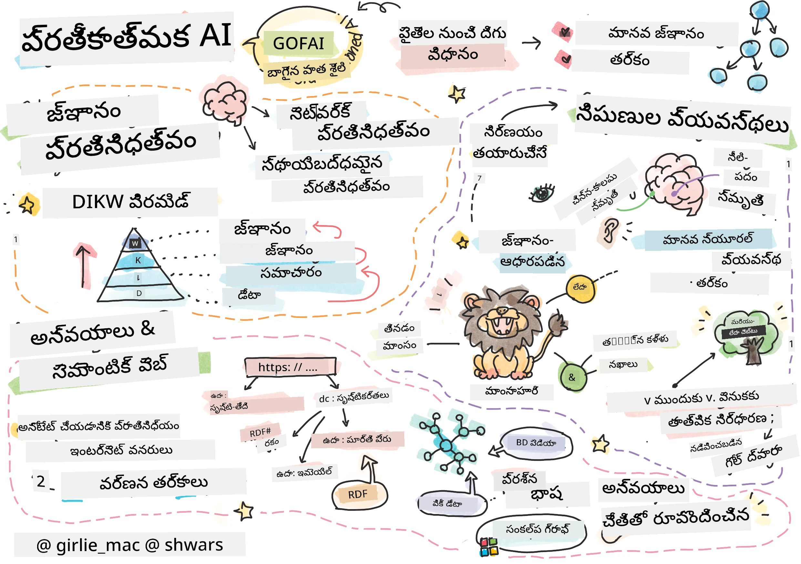
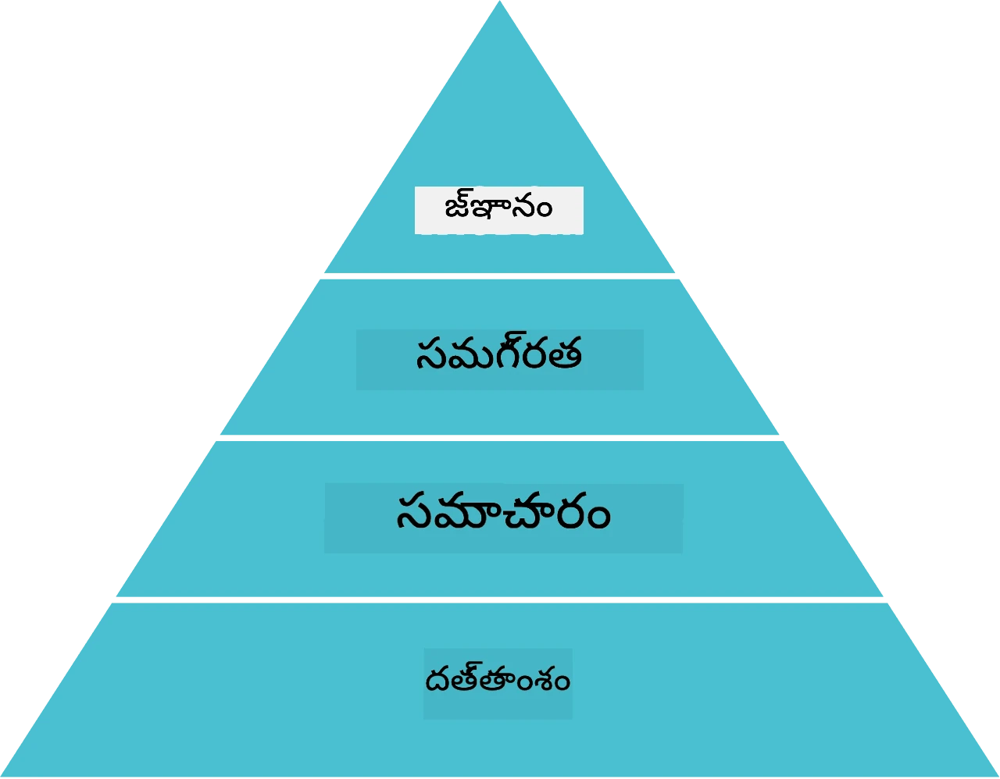
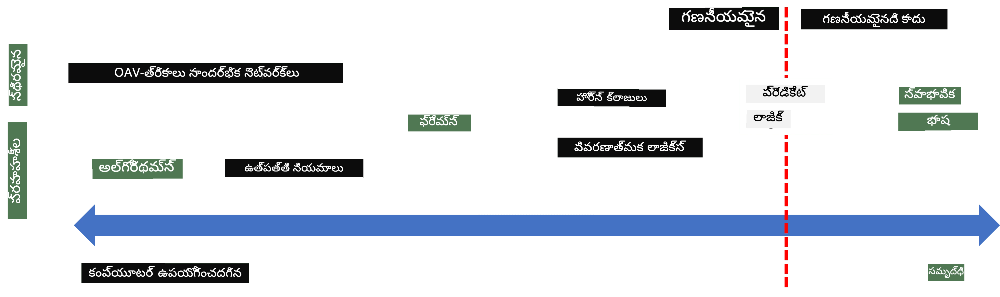
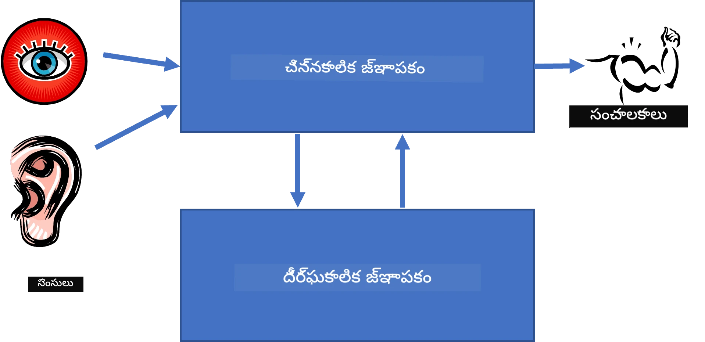
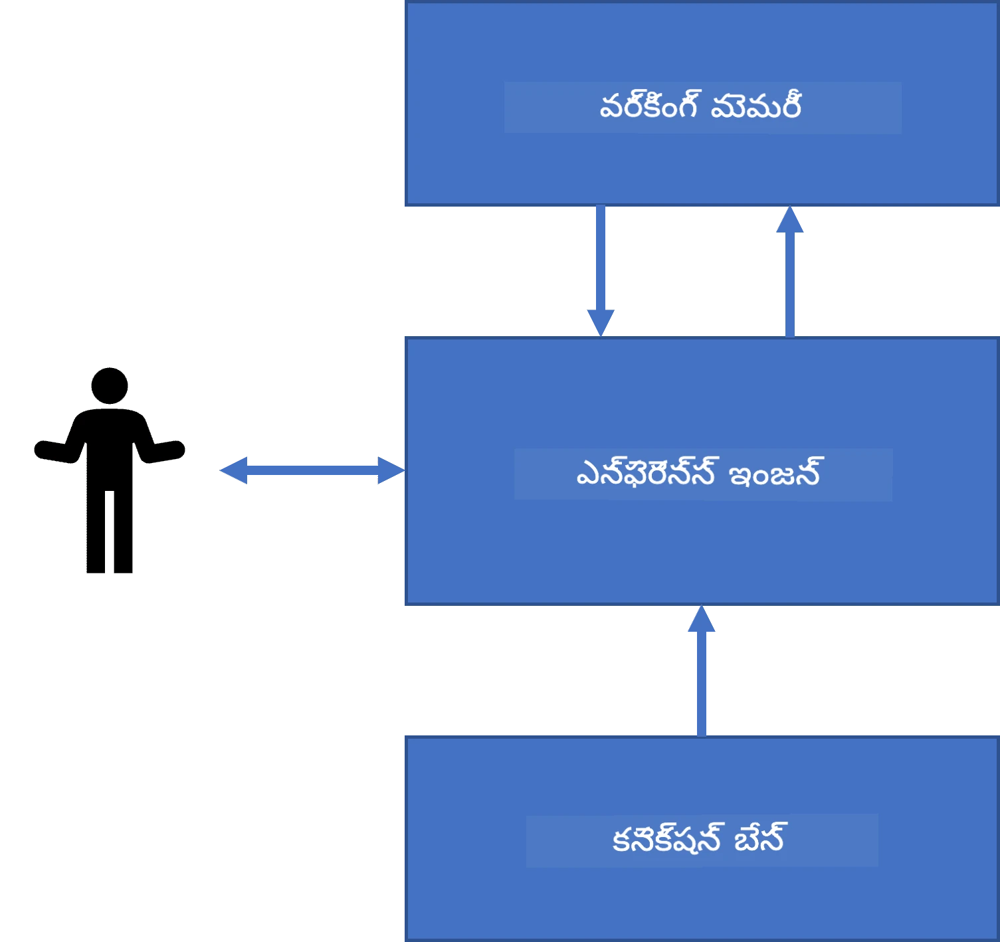
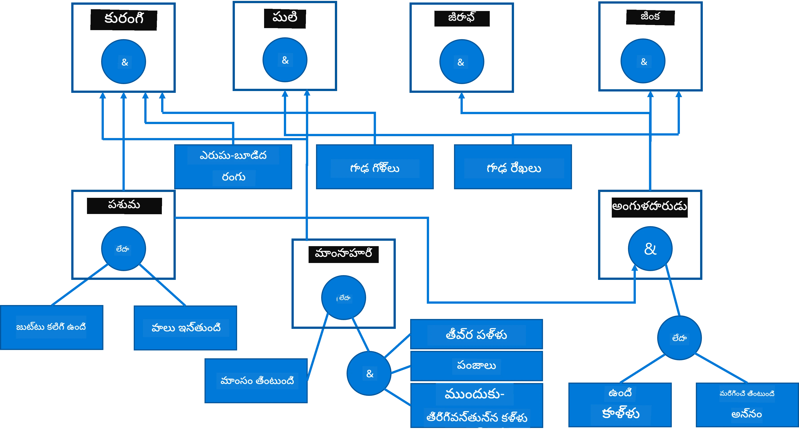
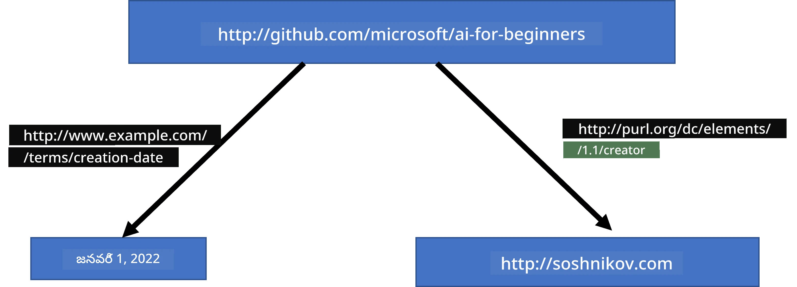
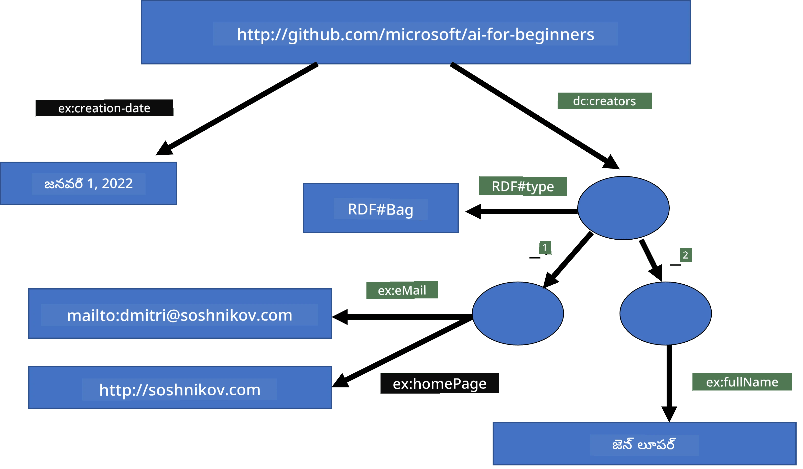
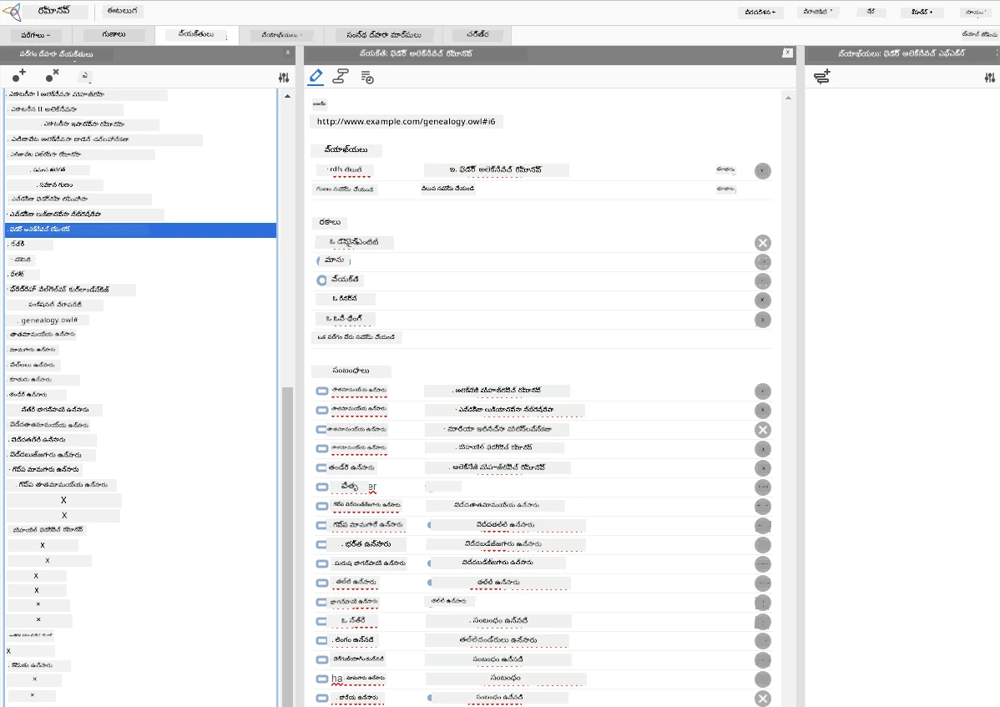

# జ్ఞాన ప్రతినిధిత్వం మరియు నిపుణుల సిస్టమ్‌లు



> స్కెచ్‌నోట్ దీన్ని [Tomomi Imura](https://twitter.com/girlie_mac) చేత రాయబడింది

కృత్రిమ మేధస్సు అన్వేషణ అనేది మానవులు ప్రపంచాన్ని అర్థం చేసుకునే విధంగా, ప్రపంచాన్ని అర్థం చేసుకోవడానికి జ్ఞానం కోసం ఒక శోధన ఆధారంగా ఉంటుంది. కానీ దీన్ని ఎలా చేయవచ్చు?

## [ప్రివ్య Lecture క్విజ్](https://ff-quizzes.netlify.app/en/ai/quiz/3)

AI ప్రారంభ దశలలో, తెలివైన సిస్టమ్‌లను సృష్టించడానికి టాప్-డౌన్ విధానం (మునుపటి పాఠంలో చర్చించబడినది) ప్రజాదరణ పొందింది. ఆ ఆలోచన మీకు తెలుసు, మనుషుల నుండి జ్ఞానాన్ని తీసుకుని యంత్రం రీడబుల్ రూపంలోకి మార్చి, దానిని ఆటోమేటల్లీ సమస్యలను పరిష్కరించడానికి ఉపయోగించడం. ఈ విధానం రెండు పెద్ద ఆలోచనలపై ఆధారపడి ఉంది:

* జ్ఞాన ప్రతినిధిత్వం
* తార్కికం

## జ్ఞాన ప్రతినిధిత్వం

సింబాలిక్ AIలో ఒక ముఖ్యమైన భావన **జ్ఞానం**. దాన్ని *సమాచారం* లేదా *డేటా* నుండి వేరుచేసుకోవడం ముఖ్యం. ఉదాహరణకు, పుస్తకాలు జ్ఞానం కలిగి ఉన్నట్లు చెప్పవచ్చు, ఎందుకంటే మనం పుస్తకాలు చదివి నిపుణులు అవ్వగలము. కానీ, విషయం ఏమిటంటే పుస్తకాలు వాస్తవానికి *డేటా*ని కలిగి ఉంటాయి, మనం పుస్తకాలను చదవటం మరియు ఈ డేటాను మన ప్రపంచ నమూనాకి అనుసంధానం చేయడం ద్వారా డేటాను జ్ఞానంగా మారుస్తాము.

> ✅ **జ్ఞానం** అనేది మన తలలో ఉండి, ప్రపంచాన్నో అర్థం చేసుకునే మన అవగాహనను సూచిస్తుంది. ఇది ఒక క్రియాశీల **అధ్యయనం** ప్రక్రియ ద్వారా పొందబడుతుంది, ఇది మనకు అందే సమాచార భాగాలను మన సక్రియ మోడల్‌లో చోటు చేస్తుంది.

చాలా సార్లు, మనం కఠినంగా జ్ఞానాన్ని నిర్వచించము, కానీ మనం దాన్ని ఇతర సంబందిత భావనలతో [DIKW Pyramid](https://en.wikipedia.org/wiki/DIKW_pyramid) ద్వారా సరిపోలుస్తాము. దీని లో ఈ భావనలు ఉంటాయి:

* **డేటా** అనేది శారీరక మీడియా (ఉదా: వ్రాసిన వచనం లేదా మాట్లాడిన మాటలు)లో ప్రతినిధ్యం వహిస్తుంది. డేటా మానవులతో సంబంధం లేకుండా కూడా ఉంటుంది మరియు ప్రజల మధ్య పంచుకోగలదు.
* **సమాచారం** అనేది మన తలలో డేటాను ఎలా అర్థం చేసుకుంటామో. ఉదా: *కంప్యూటర్* అనే పదం వింటే మనకి దానికి సంబంధించిన అవగాహన ఉంటుంది.
* **జ్ఞానం** అనేది సమాచారాన్ని మన ప్రపంచ నమూనాలో అనుసంధానించడం. ఉదా: ఒకసారి కంప్యూటర్ అంటే ఏంటి తెలుసుకుంటే, అది ఎలా పనిచేస్తుంది, దీనికి ఎంత ధర ఉంటుంది, దానిని ఏం కోసం ఉపయోగిస్తారు అనే అంశాల్లో కొంత అవగాహన కలిగి మేము అవుతాము.
* **ప్రముఖత** అనేది మన ప్రపంచపు అవగాహనలో మరొక అంతస్తు, ఇది *మెటా-జ్ఞానం*, అంటే జ్ఞానాన్ని ఎప్పుడే మరియు ఎలా ఉపయోగించాలోనూ కొంత భావన.



*చిత్రం [వికీపీడియా నుండి](https://commons.wikimedia.org/w/index.php?curid=37705247), Longlivetheux - స్వంత పని, CC BY-SA 4.0*

కాబట్టి, **జ్ఞాన ప్రతినిధిత్వం** సమస్య అనేది జ్ఞానాన్ని కంప్యూటర్ లో డేటా రూపంలో ప్రతినిధ్యం చేసుకునే సమర్థవంతమైన మార్గం కనుగొనడమే, తద్వారా దాన్ని ఆటోమేటిక్ గా ఉపయోగించుకోవచ్చు. దీనిని ఒక స్పెక్ట్రమ్ గా చూడవచ్చు:



> చిత్రాన్ని [Dmitry Soshnikov](http://soshnikov.com) నిర్మించారు

* ఎడమ వైపు, కంప్యూటర్‌ ల ద్వారా సమర్థవంతంగా ఉపయోగించదగిన చాలా సరళ జ్ఞాన ప్రతినిధిత్వ రకాలు ఉన్నాయి. అత్యంత సరళమైనది అల్గోరిథమిక్ విధానం, ఇది జ్ఞానాన్ని ఒక కంప్యూటర్ ప్రోగ్రామ్ ద్వారా ప్రతినిధ్యం చేస్తుంది. అయితే ఇది మంచిదైన మార్గం కాదు, ఎందుకంటే ఇది సర్దుబాటు కానిది. మన తలలో జ్ఞానం చాల సార్లు అల్గోరిథమిక్ కాదు.
* కుడి వైపు, సహజ వచనం వంటి ప్రతినిధిత్వాలు ఉన్నాయి. ఇవి అత్యంత శక్తివంతమైనవి కానీ ఆటోమేటిక్ తార్కికం కోసం ఉపయోగించలేవు.

> ✅ మీరు మీ తలలో జ్ఞానాన్ని ఎలా ప్రతినిధ్యం చేస్తారు మరియు దాన్ని నోట్స్‌గా మారుస్తారు అని ఒక నిమిషం ఆలోచించండి. మీకు జ్ఞాన నిల్వకి సహాయపడే ఎటువంటి నిర్దిష్ట రూపకం ఉన్నదా?

## కంప్యూటర్ జ్ఞాన ప్రతినిధిత్వాలను వర్గీకరించడం

మేము వివిధ కంప్యూటర్ జ్ఞాన ప్రతినిధిత్వ పద్ధతులను ఈ క్రింది వర్గాల్లో వర్గీకరించవచ్చు:

* **నెట్‌వర్క్ ప్రతినిధిత్వాలు** మన తలలో అనుసంధానిత భావనల నెట్‌వర్క్ ఉనికిని ఆధారపడి ఉంటాయి. మనం యే విధంగా ఈ నెట్‌వర్క్‌లను కంప్యూటర్ లో గ్రాఫ్ గా పునఃసృష్టించవచ్చు - దీన్ని **సెమాంటిక్ నెట్‌వర్క్** అంటారు.

1. **ఆబ్జెక్ట్-గుణం-మూల్యం త్రిపుటాలు** లేదా **గుణం-మూల్యం జంటలు**. ఒక గ్రాఫ్‌ను కంప్యూటర్‌లో నోడ్స్ మరియు ఎడ్జెస్ జాబితాగా ప్రతినిధ్యం చేయవచ్చు, అందువల్ల అనుసంధానిత నెట్‌వర్క్‌ను త్రిపుటాల జాబితాగా ప్రతినిధ్యం చేయవచ్చు, దానిలో ఆబ్జెక్టులు, గుణాలు మరియు విలువలు ఉంటాయి. ఉదా: ప్రోగ్రామింగ్ భాషలపై క్రింది త్రిపుటాలు నిర్మిస్తాము:

Object | Attribute | Value
-------|-----------|------
Python | is | Untyped-Language
Python | invented-by | Guido van Rossum
Python | block-syntax | indentation
Untyped-Language | doesn't have | type definitions

> ✅ ఇతర రకాల జ్ఞానాన్ని త్రిపుటలతో ఎలా ప్రతినిధ్యం చేయవచ్చు అనేది ఆలోచించండి.

2. **హైరార్కికల్ ప్రతినిధిత్వాలు** మనం తరచూ మన తలలోని ఆబ్జెక్టుల హైరార్కీ సృష్టించే విషయం పై గమనిస్తాయి. ఉదాహరణకు, మనకు తెలియదు కేనరీ చిలుకపై భాగమైన పక్షి అని, అన్ని పక్షులకి రెక్కలు ఉంటాయి అని. కేనరీ సాధారణంగా ఏ రంగులో ఉంటుందో, వాటి ప్రయాణ వేగం ఎంత అనేది కూడా కొంత అవగాహన ఉంటుంది.

   - **ఫ్రేమ్ ప్రతినిధిత్వం** ప్రతీ ఆబ్జెక్ట్ లేదా ఆబ్జెక్టుల తరగతిని ఒక **ఫ్రేమ్** ద్వారా ప్రతినిధ్యం చేస్తుంది. ఈ ఫ్రేమ్‌ లో **స్లాట్లు** ఉంటాయి. స్లాట్లకు సాధారణ విలువలు, విలువ పరిమితులు లేదా విలువను పొందటానికి పిలవదగిన సంరక్షిత పద్ధతులు ఉండవచ్చు. అన్ని ఫ్రేములు ఒక హైరార్కీని సృష్టిస్తాయి, ఇది ఆబ్జెక్ట్-ఒరియెంటెడ్ ప్రోగ్రామింగ్ భాషలలో ఆబ్జెక్ట్ హైరార్కీకు సమానం.
   - **స్కెనారియోలు** కాలపరిమితిలో విస్తరించగల సంక్లిష్ట పరిస్థితులను సూచించే ప్రత్యేక రకాల ఫ్రేములు.

**Python**

Slot | Value | Default value | Interval |
-----|-------|---------------|----------|
Name | Python | | |
Is-A | Untyped-Language | | |
Variable Case | | CamelCase | |
Program Length | | | 5-5000 lines |
Block Syntax | Indent | | |

3. **ప్రొసీజరల్ ప్రతినిధిత్వాలు** ఒక నిర్దిష్ట పరిస్థితి జరిగే సమయంలో నిర్వర్తించదగిన చర్యల జాబితాగా జ్ఞానాన్ని ప్రతినిధ్యం చేస్తాయి.
   - ప్రొడక్షన్ రూల్స్ అనేవి if-then ప్రకటనలు, ఇవి మనకు తరచుగా నిష్కర్ష లెక్కించడానికి అనుమతిస్తాయి. ఉదా: ఒక డాక్టర్ కె షరతుని ఉన్నట్టు అనుకుంటే, ఒక రోగికి ఎక్కువ జ్వరం లేదా రక్త పరీక్షలో C-reactive ప్రోటీన్ ఎక్కువగా ఉన్నట్లయితే, అతనికి వాపు ఉందని రూల్ ఉంటే. ఈ పరిస్థితులు గమనించిన తర్వాత వాపుపై ఒక తరచుగా నిష్కర్ష లెక్కించవచ్చు, తదుపరి తార్కికంలో ఉపయోగించవచ్చు.
   - అల్గోరిథమ్స్ ను మరో ప్రొసీజరల్ ప్రతినిధిత్వ రూపంగా పరిగణించవచ్చు, అయినప్పటికీ అవి చాలసార్లు నేరుగా జ్ఞాన ఆధారిత సిస్టమ్‌లలో ఉపయోగించబడవు.

4. **లాజిక్** మొదలగిన వాటిని అరిస్టోటిల్ ప్రతిపాదించారు, ఇది విశ్వవ్యాప్త మానవ జ్ఞానాన్ని సూచించే మార్గం.
   - ప్రతిపాదిత లాజిక్ గణిత సిద్దాంతానికి చాలా సంక్లిష్టంగా ఉండటంతో, సాధారణంగా కొన్ని ఉపసమూహాలు - ఉదా: ప్రొలాగ్‌లో ఉపయోగించే హోర్న్ క్లాజస్‌లను ఉపయోగిస్తారు.
   - వివరణాత్మక లాజిక్ అనేది తర్కపూర్వక సిస్టమ్‌ల కుటుంబం, ఇది వస్తువుల హైరార్కీలు మరియు *సెమాంటిక్ వెబ్* వంటి పంపిణీ చేయబడిన జ్ఞాన ప్రతినిధిత్వాలను ప్రతినిధ్యం చేసి, దాని గురించి తార్కికం చేయడానికి ఉపయోగిస్తారు.

## నిపుణుల సిస్టమ్‌లు

సింబాలిక్ AI ప్రారంభ విజయాలలో ఒకటి **నిపుణుల సిస్టమ్‌లు** - ఇది కొన్ని పరిమిత సమస్యా పరిధిలో నిపుణుడి పాత్రను పోషించడానికి రూపొందించిన కంప్యూటర్ సిస్టమ్‌లు. ఇవి ఒక లేదా ఎక్కువ మానవ నిపుణుల నుండి తీసుకున్న **జ్ఞాన సమస్యా పాఠశాల** ఆధారంగా ఉంటాయి మరియు అందుపైని తార్కికం నిర్వహించే **అవధారణ యంత్రం** ను కలిగి ఉంటాయి.

 | 
---------------------------------------------|------------------------------------------------
మానవ నరమైన వ్యవస్థ సరళీకృత నిర్మాణం | జ్ఞాన-ఆధారిత వ్యవస్థ నిర్మాణం

నిపుణుల సిస్టమ్‌లు మానవ తార్కిక వ్యవస్థ లాగా తయారు చేయబడ్డాయి, ఇందులో **సన్నాహిత స్మృతి** మరియు **దీర్ఘకాల స్మృతి** ఉంటాయి. ఇదే విధంగా, జ్ఞాన-ఆధారిత సిస్టమ్‌లలో ఈ భాగాలు వేరుచేయబడతాయి:

* **సమస్య స్మృతి**: ప్రస్తుతం పరిష్కరించబడుతున్న సమస్య గురించి జ్ఞానం ఉంటుంది, ఉదా: రోగి ఉష్ణోగ్రత లేదా రక్తపోటు, వాపు ఉందా లేదా, మొదలైనవి. దీనిని **స్థిర జ్ఞానం** అని కూడా పిలుస్తారు, ఎందుకంటే ఇది మనకు ప్రస్తుత సమస్య స్థితి సంక్షిప్తాన్ని ఇస్తుంది.
* **జ్ఞానపీఠం**: సమస్య పరిధి గురించి దీర్ఘకాలం జ్ఞానం. ఇది మానవ నిపుణులచే మాన్యువల్ గా తీసుకురాబడుతుంది మరియు సలహా ప్రతిసారి మారదు. ఇది ఒక్క సమస్య స్థితి నుండి మరొక దానికి మారేందుకు అనుమతిస్తుందని, అందువల్ల దీనిని **డైనమిక్ జ్ఞానం** అని కూడా అంటారు.
* **అవధారణ యంత్రం**: సమస్య స్థితి స్థలం నుంచి శోధన మరియూ అవసరమైతే వినియోగదారుడి నుండి ప్రశ్నలు అడుగుతుందని మొత్తం ప్రక్రియను నిర్వర్తించేది. ప్రతి సమస్య స్థితికి సరైన నియమాలను అన్వయించే బాధ్యత కూడా దీనికే ఉంటుంది.

ఉదాహరణకు, ఒక జంతువును దాని శారీరక లక్షణాల ఆధారంగా గుర్తించడం కోసం క్రింది నిపుణుల సిస్టమ్‌ను పరిగణించాము:



> చిత్రాన్ని [Dmitry Soshnikov](http://soshnikov.com) చిత్రించేరు

ఈ డయాగ్రామ్‌ను **AND-OR చెట్టు** అంటారు, ఇది ప్రొడక్షన్ రూల్స్ సమితి యొక్క గ్రాఫికల్ ప్రాతినిధ్యం. నిపుణుల నుండి జ్ఞానం సేకరించడం ప్రారంభంలో చెట్టును గీసుకోవడం ఉపయోగకరం. కంప్యూటర్‌లో జ్ఞానాన్ని ప్రతినిధ్యం చెయ్యడానికి, రూల్స్ ఉపయోగించడం మరింత సౌకర్యవంతం:

```
IF the animal eats meat
OR (animal has sharp teeth
    AND animal has claws
    AND animal has forward-looking eyes
) 
THEN the animal is a carnivore
```

మీకు గమనించవచ్చు, నియమంల బ 左వైపున ఉన్న ప్రతి షరతు మరియు చర్య ఆబ్జెక్ట్-గుణం-మూల్యం (OAV) త్రిపుటలే. **పనిలో ఉన్న స్మృతి** ప్రస్తుత సమస్య పరిష్కారానికి సంబంధించిన OAV త్రిపుటలు కలిగి ఉంటుంది. **రూల్స్ ఇంజిన్** షరతు తార్కికం అయిన రూల్స్ కోసం వెతుకుతుంది, వాటిని వర్తింపజేస్తుంది మరియు పనిలో ఉన్న స్మృతిలో కొత్త త్రిపుటను జోడిస్తుంది.

> ✅ మీకు ఇష్టమైన అంశంపై మీ స్వంత AND-OR చెట్టు వ్రాయండి!

### ముందుకు లేదా వెనుకకు అవధారణ

పై ప్రక్రియ **ముందుకు అవధారణ** అని పిలవబడుతుంది. ఇది పనిలో ఉన్న స్మృతిలో ఉన్న కొన్ని ప్రాథమిక డేటాతో మొదలుకుని ఈ తార్కిక చక్రాన్ని కొనసాగిస్తుంది:

1. లక్ష్య గుణం పనిలో ఉన్న స్మృతిలో ఉందా అయితే నిలిపి ఫలితం ఇవ్వండి
2. ప్రస్తుతం షరతు తార్కికం అయ్యే అన్ని రూల్స్ కోసం వెతకండి - **సంఘర్షణ సెట్** పొందండి
3. **సంఘర్షణ పరిష్కారం** చేయండి - ఈ దశలో అమలు చేయదగిన ఒక రూల్‌ని ఎంచుకోండి. వివిధ పరిష్కార వ్యూహాలు ఉండవచ్చు:
   - జ్ఞానపీఠంలో మొదటి వర్తించదగిన నియమాన్ని ఎంచుకోండి
   - యాదృచ్ఛిక రూల్ ఎంచుకోండి
   - *మరింత ప్రత్యేకమైన* రూల్ ఎంచుకోండి, అంటే ఎల్‌హెచ్ఎస్ (ఎడమవైపు)లో ఎక్కువ షరతులు కలిసే రూల్
4. ఎంచుకున్న రూల్ వర్తించి సమస్య స్థితిలో కొత్త జ్ఞానాన్ని చేర్చండి
5. రెండవ దశ నుండి పునరావృతం చేయండి

కానీ మనం కొన్ని సందర్భాల్లో సమస్య గురించి ఖాళీ జ్ఞానంతో ప్రారంభించి, నిర్ణయానికి సహాయపడే ప్రశ్నలు అడగాలని కావచ్చు. ఉదాహరణకు, వైద్య నిర్ధారణలో, రోగిని నిర్ధారించడానికి ముందే అన్ని వైద్య పరీక్షలు చేయరు. అవసరమైనప్పుడు పరీక్షలు చేస్తారు.

ఈ ప్రక్రియ **వెనుకకు అవధారణ** ద్వారా గేయించవచ్చు. ఇది **లక్ష్యం** ఆధారంగా నడుస్తుంది - మనం కనుగొనదలిచిన గుణ విలువ:

1. లక్ష్య విలువ ఇచ్చే అన్ని రూల్స్‌ను ఎంచుకోండి (రైట్హెండ్సైడ్ ఉన్న వాటితో) - సంఘర్షణ సెట్
2. ఆ గుణానికి ఎలాంటి రూల్స్ లేకపోతే లేదా యూజర్ నుండి విలువ అడగమని రూల్ ఉంటే - అడగండి, లేకపోతే:
3. సంఘర్షణ పరిష్కార వ్యూహం ద్వారా అవగాహన కోసం ఒక రూల్ ఎంచుకోండి - మనం దాన్ని ప్రూవ్ చేయబోతున్నాం
4. ఆ రూల్ LHSలోని అన్ని గుణాల కోసం పునరావృత ప్రక్రియ చేసి వాటినీ లక్ష్యంగా పరిశీలించండి
5. ఏదైనా దశలో ఫెయిలయితే - మూడవ దశలో మరొక రూల్ ఉపయోగించండి

> ✅ ఏ పరిస్థితుల్లో ముందుకు అవధారణ ఎక్కువగా సరిపోతుంది? వెనుకకు అవధారణ గురించి ఎలా?

### నిపుణుల సిస్టమ్‌ల అమలుపరచడం

నిపుణుల సిస్టమ్‌లను వివిధ పరికరాలతో అమలు చేయవచ్చు:

* వారు ఏదైనా ఉన్నత స్థాయి ప్రోగ్రామింగ్ భాషలో నేరుగా ప్రోగ్రామింగ్ చేయవచ్చు. ఇది ఉత్తమ ఆలోచన కాదు, ఎందుకంటే జ్ఞాన-ఆధారిత సిస్టమ్ లో జ్ఞానం మరియు అవధారణ వేరు ఉండవలెను, మరియు పరిస్థితి నిపుణుడు నేరుగా అవధారణ ప్రక్రియ వివరాలు తెలుసుకోకుండా రూల్స్ రాయగలగాలి.
* **నిపుణుల సిస్టమ్ శెల్** ఉపయోగించడం, అంటే ప్రత్యేకంగా డిజైన్ చేసిన సిస్టమ్, దానిలో జ్ఞానం ప్రతినిధిత్వ భాష ద్వారా చేర్చవచ్చు.

## ✍️ వ్యాయామం: జంతు అవధారణ

ముందుకు మరియు వెనుకకు అవధారణ నిపుణుల సిస్టమ్‌లను అమలు చేసే ఉదాహరణ కోసం [Animals.ipynb](https://github.com/microsoft/AI-For-Beginners/blob/main/lessons/2-Symbolic/Animals.ipynb) చూడండి.

> **గమనిక**: ఈ ఉదాహరణ చాలా సరళమైనది, మరియు నిపుణుల సిస్టమ్ ఎలా ఉంటుందో రోజు ఒక భావన మాత్రమే ఇస్తుంది. ఇలాంటి సిస్టమ్ ఆరంభించిన తర్వాత, మీరు కొన్ని రూల్స్ సంఖ్య సుమారు 200+ చేరిన తర్వాత మాత్రమే అదృష్టవంతమైన భాగం చూస్తారు. ఆ సమయంలో, రూల్స్ చాలా సంక్లిష్టమవుతాయి, వాటిని గుర్తుంచుకోవడం కష్టం, మరియు మీరు ఆ సిస్టమ్ నిర్ణయాలు ఎందుకు తీసుకుంటున్నాయనేది ఊహించవచ్చు. అయితే, జ్ఞాన-ఆధారిత సిస్టమ్‌ల ముఖ్య లక్షణం ఏదైతే అంటే మీరు ఎప్పుడైనా ఏ నిర్ణయం ఎలా తీసుకున్నదో *విభ్రాంతంగా* వివరించవచ్చు.

## ఓంటాలజీలు మరియు సెమాంటిక్ వెబ్

20వ శతాబ్దం చివర్లో ఒక ప్రయత్నం జరిగింది, జ్ఞాన ప్రతినిధిత్వాన్ని ఉపయోగించి ఇంటర్నెట్ వనరులను అనోటేట్ చేయడానికి, దీని వలన చాలా ప్రత్యేక క్వెరీలకు సంబంధించిన వనరులు కనుగొనడం సాధ్యం అయ్యింది. ఈ ఉద్యమం **సెమాంటిక్ వెబ్** అని పిలవబడింది, ఇది కొన్ని భావాలపై ఆధారపడి ఉంది:

- **[వివరణాత్మక తర్కాలు](https://en.wikipedia.org/wiki/Description_logic)** (DL) ఆధారమైన ప్రత్యేక జ్ఞాన ప్రతినిధిత్వం. ఇది ఫ్రేమ్ జ్ఞాన ప్రతినిధిత్వానికి సమానమైనది, ఎందుకంటే ఇది ఆబ్జెక్టుల హైరార్కీని ఆస్తులతో నిర్మిస్తుంది, కానీ దీని వద్ద సాంఘిక లాజిక్ సారాంశాలు మరియు అవధారణ ఉంటాయి. వివరణాత్మక తర్కాలు అనే సిస్టమ్‌లు లాజిక్ ప్రయోగంలో సమర్థత మరియు అర్థగర్భత మధ్య సరాసరి కలిగి ఉంటాయి.
- పంపిణీ చేయబడిన జ్ఞాన ప్రతినిధిత్వం, ఇందులో అన్ని భావనలు ఒక గ్లోబల్ URI గుర్తింపుతో సూచించబడతాయి, దీని వలన ఇంటర్నెట్ మొత్తం పరిమితులుగా ఉండే జ్ఞాన హైరార్కీలు సృష్టించవచ్చు.
- జ్ఞాన వివరణ కోసం XML ఆధారిత భాషల కుటుంబం: RDF (Resource Description Framework), RDFS (RDF Schema), OWL (Ontology Web Language).

సెమాంటిక్ వెబ్‌లో ఒక ముఖ్యమైన సిద్ధాంతం **Ontology**. ఇది కొన్ని అధికారిక జ్ఞాన ప్రాతినిధ్యం వాడి సమస్య డొమైన్ యొక్క స్పష్టమైన వివరణకు సంబంధించిఉంది. అత్యంత సులభమైన ontology సాధారణంగా సమస్య డొమైన్‌లోని వస్తువుల హైరార్కీ మాత్రమే ఉండవచ్చు, కాని మరింత సంక్లిష్టమైన ontologies inferencing కోసం ఉపయోగించే నిబంధనలను కలిగి ఉంటాయి.

సెమాంటిక్ వెబ్‌లో, అన్ని ప్రాతినిధ్యాలు ట్రిపుల్స్ (triplets) ఆధారంగా ఉంటాయి. ప్రతి వస్తువు మరియు ప్రతి సంబంధం యూనీక్ URI ద్వారా గుర్తించబడతాయి. ఉదాహరణకు, ఈ AI Curriculum ని Dmitry Soshnikov జనవరి 1, 2022 లో అభివృద్ధి చేశాడు అన్న వాస్తవాన్ని తెలియజేయాలంటే - క్రింది ట్రిపుల్స్ ఉపయోగించవచ్చు:



```
http://github.com/microsoft/ai-for-beginners http://www.example.com/terms/creation-date “Jan 1, 2022”
http://github.com/microsoft/ai-for-beginners http://purl.org/dc/elements/1.1/creator http://soshnikov.com
```

> ✅ ఇక్కడ `http://www.example.com/terms/creation-date` మరియు `http://purl.org/dc/elements/1.1/creator` అనేవి *creator* మరియు *creation date* భావాలను వ్యక్తపరచడానికి బాగా తెలిసిన మరియు విశ్వసనీయ URIs.

కీలకంగా, సృష్టికర్తల జాబితాను నిర్వచించాలంటే RDFలో నిర్వచించిన కొన్ని డేటా గঠనలను ఉపయోగించవచ్చు.



> పై డాగ్రామ్‌లు [Dmitry Soshnikov](http://soshnikov.com) వారి వల్ల.

సెమాంటిక్ వెబ్ నిర్మాణ పురోగతి కొంతమేర ఆలస్యం అయింది, ఇది సెర్చ్ ఇంజిన్లు మరియు సహజ భాషా ప్రాసెసింగ్ సాంకేతికతల విజయపు కారణంగా, వీటి ద్వారా పాఠ్యం నుండి నిర్మిత డేటాను పొందగలవు. అయినప్పటికీ, కొన్ని రంగాల్లో ఇంకా ontologies మరియు జ్ఞాన వనరుల నిర్వహణపై గణనీయమైన ప్రయత్నాలు జరుగుతున్నాయి. కొన్ని గమనించదగ్గ ప్రాజెక్టులు:

* [WikiData](https://wikidata.org/) అనేది వికీపీడియాతో సంబందిత యంత్రం చదువుకునే జ్ఞాన వనరుల సేకరణ. అధికంత డేటా వికీపీడియా *InfoBoxes* నుండి సేకరించబడింది, వీటివి వికీపీడియా పేజీలలోని నిర్మాణాత్మక కంటెంట్ భాగాలు. మీరు [query](https://query.wikidata.org/) wikidata ని SPARQL, సెమాంటిక్ వెబ్ సొంత ప్రత్యేక క్వెరి భాషలో చేయవచ్చు. ఇక్కడ మనుషుల లో అత్యంత ప్రజాదరణ పొందిన కనులు రంగులను చూపించే ఒక నమూనా క్వెరి ఉంది:

```sparql
#defaultView:BubbleChart
SELECT ?eyeColorLabel (COUNT(?human) AS ?count)
WHERE
{
  ?human wdt:P31 wd:Q5.       # human instance-of homo sapiens
  ?human wdt:P1340 ?eyeColor. # human eye-color ?eyeColor
  SERVICE wikibase:label { bd:serviceParam wikibase:language "en". }
}
GROUP BY ?eyeColorLabel
```

* [DBpedia](https://www.dbpedia.org/) కూడా WikiData సారమైన మరో ప్రయత్నం.

> ✅ మీరు మీ స్వంత ontologies నిర్మించేందుకు లేదా ఉన్న ontologies ను తెరవండి అని అనుకుంటే, ఒక అద్భుతమైన విజువల్ ontology ఎడిటర్ [Protégé](https://protege.stanford.edu/) ఉంది. దాన్ని డౌన్లోడ్ చేసుకోండి లేదా ఆన్‌లైన్ ఉపయోగించండి.



*Web Protégé ఎడిటర్ Romanov కుటుంబ ontology తో తెరవబడింది. స్క్రీన్‌షాట్ Dmitry Soshnikov ద్వారా*

## ✍️ వ్యాయామం: కుటుంబ Ontology

[FamilyOntology.ipynb](https://github.com/Ezana135/AI-For-Beginners/blob/main/lessons/2-Symbolic/FamilyOntology.ipynb) చూడండి, ఇది కుటుంబ సంబంధాల గురించి సెమాంటిక్ వెబ్ సాంకేతికతలను ఉపయోగించి వివరణ చేయడం ఎలా అనేది ఉదాహరణ. మనంGEDCOM ఫార్మాట్ లో ఉన్న కుటుంబ వృక్షాన్ని మరియు కుటుంబ సంబంధాల ontologyని తీసుకుని వ్యక్తుల సమూహానికి సంబంధించిన అందరి కుటుంబ సంబంధాల గ్రాఫ్‌ను నిర్మించబోతున్నాము.

## Microsoft Concept Graph

చేతితో ontologies జాగ్రత్తగా తయారు చేయబడతాయి కొన్నిసార్లు. కానీ, అది కాకుండా అనేక సందర్భాలలో సహజ భాష పాఠ్యాల నుండి ontologies ను **ఉదకించడం** కూడా సాధ్యం.

ఈ ప్రయత్నం Microsoft Research ద్వారా చేయబడింది, ఫలితంగా [Microsoft Concept Graph](https://blogs.microsoft.com/ai/microsoft-researchers-release-graph-that-helps-machines-conceptualize/?WT.mc_id=academic-77998-cacaste) వచ్చింది.

ఇది `is-a` వారసత్వ సంబంధంతో గుంపులు చేసిన పెద్ద ఎంటిటీల సేకరణ. ఇది "Microsoft అంటే ఏమిటి?" అనే ప్రశ్నలకు "0.87 అవకాశంతో సంస్థ, 0.75 అవకాశంతో బ్రాండ్" లాంటి సమాధానాలు ఇస్తుంది.

గ్రాఫ్ REST API గా లేదా అన్ని ఎంటిటీ జంటలను జాబితా చేసే పెద్ద డౌన్లోడ్ చేయగలిగే టెక్స్ట్ ఫైల్‌గా అందుబాటులో ఉంటుంది.

## ✍️ వ్యాయామం: ఒక Concept Graph

[MSConceptGraph.ipynb](https://github.com/microsoft/AI-For-Beginners/blob/main/lessons/2-Symbolic/MSConceptGraph.ipynb) నోటుబుక్‌ని ప్రయత్నించి, Microsoft Concept Graph ని ఉపయోగించి వార్తా కథనాలు వివిధ వర్గాలుగా ఎలా బాగుచేయవచ్చునో చూడండి.

## ముగింపు

ఈ రోజుల్లో, AIని తరచుగా *Machine Learning* లేదా *Neural Networks* కు సమానంగా భావిస్తారు. కానీ మనిషి కూడా స్పష్టమైన తర్కాన్ని ప్రదర్శిస్తాడు, ఇది ప్రస్తుత Neural Networks ద్వారా యంత్రవంతంగా చేపట్టలేదని భావిస్తున్నారు. నిజమైన ప్రాజెక్టులలో, వివరణ అవసరమయ్యే లేదా వ్యవస్థ ప్రవర్తనను నియంత్రిత మార్గంలో మార్చుకోవడం అవసరం ఉన్న పనుల కోసం ఇంకా explicit reasoning ఉపయోగిస్తున్నారు.

## 🚀 సవాలు

ఈ పాఠం తో సంబందించిన Family Ontology నోటుబుక్ లో, ఇతర కుటుంబ సంబంధాలతో ప్రయోగాలు చేయవచ్చు. కుటుంబ వృక్షంలో కొత్త వ్యక్తుల మధ్య అనుబంధాలను కనుగొనండి.

## [పోస్ట్-లెక్చర్ క్విజ్](https://ff-quizzes.netlify.app/en/ai/quiz/4)

## సమీక్ష & స్వయంఅభ్యాసం

ఇంటర్నెట్‌లో కొన్ని పరిశోధనలు చేసి, మనిషులు ఎలా జ్ఞానాన్ని కొలిచేందుకు మరియు కోడిఫై చేయడానికి ప్రయత్నించారో తెలుసుకోండి. Bloom's Taxonomy ని చూడండి, మరియు చరిత్రలోకి వెళ్ళి మనిషి వారి ప్రపంచాన్ని ఎలా అర్థం చేసుకోడానికి ప్రయత్నించారో నేర్చుకోండి. Linnaeus జీవుల వర్గీకరణ Taxonomy సృష్టించడం ఎలా చేశాడో తెలుసుకోండి, Dmitri Mendeleev రసాయన మూలకాల వర్గీకరణ నిర్మాణంలో ఉపయోగించిన విధానాన్ని పరిశీలించండి. మీరు మరే ఇతర ఆసక్తికరమైన ఉదాహరణలు ఏవైనా కనుగొనగలరా?

**అసైన్‌మెంట్**: [ఒక Ontology నిర్మించండి](assignment.md)

---

<!-- CO-OP TRANSLATOR DISCLAIMER START -->
**సవరణా నోట్**:  
ఈ పత్రాన్ని AI అనువాద సేవ [Co-op Translator](https://github.com/Azure/co-op-translator) ఉపయోగించి అనువదించబడింది. మేము ఖచ్చితతపై శ్రద్ధ వహిస్తున్నప్పటికీ, సాంకేతిక అనువాదాల్లో దోషాలు లేదా లోపాలు ఉండవచ్చు. మౌలిక పత్రం దాని మూల భాషలో అధికారిక ఆధారం అని పరిగణించాలి. ముఖ్యమైన సమాచారానికి, సకలమైన మనుష్యా అనువాదాన్ని సలహా ఇస్తారు. ఈ అనువాదం వలన కలిగిన ఎటువంటి అర్ధం తీర్చుకోవడంలో గర్భితుల కోసం మేము బాధ్యత వహించము.
<!-- CO-OP TRANSLATOR DISCLAIMER END -->