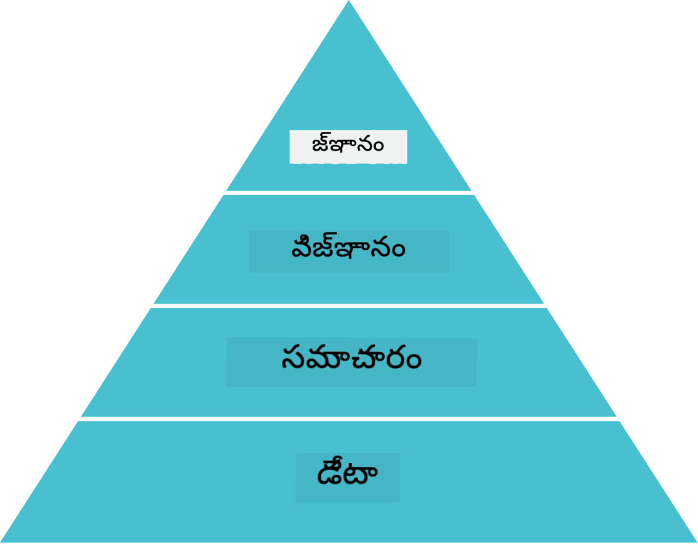
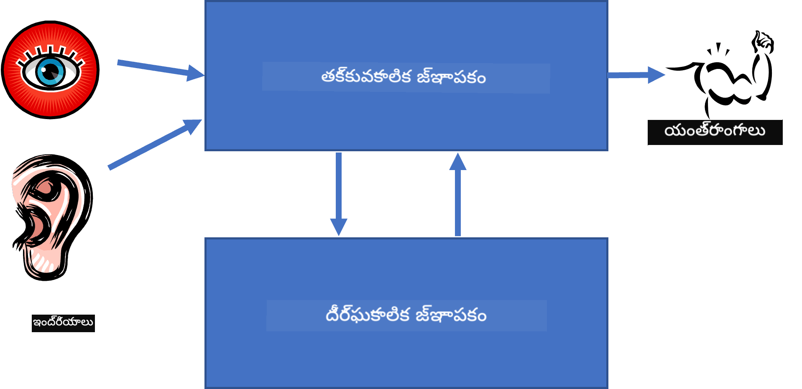

<!--
CO_OP_TRANSLATOR_METADATA:
{
  "original_hash": "7d097f7fda9166ead615e4c34552381b",
  "translation_date": "2025-11-25T20:59:35+00:00",
  "source_file": "lessons/2-Symbolic/README.md",
  "language_code": "te"
}
-->
# జ్ఞాన ప్రాతినిధ్యం మరియు నిపుణుల వ్యవస్థలు


> స్కెచ్ నోట్ [Tomomi Imura](https://twitter.com/girlie_mac) ద్వారా

కృత్రిమ మేధస్సు కోసం ప్రయత్నం అనేది మనుషులు ప్రపంచాన్ని అర్థం చేసుకునే విధంగా జ్ఞానాన్ని వెతకడమే. కానీ దీన్ని ఎలా చేయాలి?

## [పూర్వ-లెక్చర్ క్విజ్](https://ff-quizzes.netlify.app/en/ai/quiz/3)

AI ప్రారంభ దశల్లో, తెలివైన వ్యవస్థలను సృష్టించడానికి టాప్-డౌన్ విధానం (మునుపటి పాఠంలో చర్చించబడింది) ప్రాచుర్యం పొందింది. ఆలోచన ఏమిటంటే, మనుషుల నుండి జ్ఞానాన్ని యంత్రం చదవగల రూపంలోకి తీసుకుని, దానిని ఆటోమేటిక్‌గా సమస్యలను పరిష్కరించడానికి ఉపయోగించడం. ఈ విధానం రెండు పెద్ద ఆలోచనలపై ఆధారపడి ఉంది:

* జ్ఞాన ప్రాతినిధ్యం
* తర్కం

## జ్ఞాన ప్రాతినిధ్యం

సాంబాలిక AIలో ఒక ముఖ్యమైన భావన **జ్ఞానం**. జ్ఞానాన్ని *సమాచారం* లేదా *డేటా* నుండి వేరుచేసుకోవడం ముఖ్యం. ఉదాహరణకు, పుస్తకాలు జ్ఞానం కలిగి ఉంటాయని చెప్పవచ్చు, ఎందుకంటే పుస్తకాలను చదివి నిపుణులు అవ్వవచ్చు. కానీ పుస్తకాల్లో ఉన్నది వాస్తవానికి *డేటా* అని పిలవబడుతుంది, పుస్తకాలను చదివి ఆ డేటాను మన ప్రపంచ మోడల్‌లోకి సమీకరించడం ద్వారా ఆ డేటాను జ్ఞానంగా మార్చుకుంటాము.

> ✅ **జ్ఞానం** అనేది మన తలలో ఉండే, ప్రపంచాన్ని మనం అర్థం చేసుకునే విధానాన్ని ప్రతిబింబించే విషయం. ఇది ఒక క్రియాశీల **అధ్యయన** ప్రక్రియ ద్వారా పొందబడుతుంది, అందులో మనం పొందే సమాచారాన్ని మన ప్రపంచ మోడల్‌లోకి సమీకరిస్తాము.

చాలా సార్లు, మనం జ్ఞానాన్ని ఖచ్చితంగా నిర్వచించము, కానీ దాన్ని ఇతర సంబంధిత భావనలతో [DIKW పిరమిడ్](https://en.wikipedia.org/wiki/DIKW_pyramid) ద్వారా సరిపోల్చుకుంటాము. ఇందులో ఈ భావనలు ఉంటాయి:

* **డేటా** అనేది భౌతిక మాధ్యమాలలో ప్రాతినిధ్యం వహిస్తుంది, ఉదాహరణకు వ్రాసిన పాఠ్యం లేదా మాట్లాడిన మాటలు. డేటా మనుషుల నుండి స్వతంత్రంగా ఉంటుంది మరియు వ్యక్తుల మధ్య పంచుకోవచ్చు.
* **సమాచారం** అనేది మన తలలో డేటాను ఎలా అర్థం చేసుకుంటామో. ఉదాహరణకు, *కంప్యూటర్* అనే పదం విని, దాని గురించి మనకు కొంత అవగాహన ఉంటుంది.
* **జ్ఞానం** అనేది సమాచారాన్ని మన ప్రపంచ మోడల్‌లోకి సమీకరించడం. ఉదాహరణకు, కంప్యూటర్ అంటే ఏమిటి తెలుసుకున్న తర్వాత, అది ఎలా పనిచేస్తుంది, ధర ఎంత, దానిని ఏం కోసం ఉపయోగించవచ్చు అనే ఆలోచనలు కలుగుతాయి. ఈ సంబంధిత భావనల నెట్‌వర్క్ మన జ్ఞానాన్ని ఏర్పరుస్తుంది.
* **ప్రజ్ఞ** అనేది మన ప్రపంచం గురించి మరొక స్థాయి అవగాహన, ఇది *మెటా-జ్ఞానం* ను సూచిస్తుంది, అంటే జ్ఞానాన్ని ఎప్పుడు మరియు ఎలా ఉపయోగించాలో తెలియజేస్తుంది.



*చిత్రం [వికీపీడియా నుండి](https://commons.wikimedia.org/w/index.php?curid=37705247), Longlivetheux - స్వంత పని, CC BY-SA 4.0*

కాబట్టి, **జ్ఞాన ప్రాతినిధ్యం** సమస్య అనేది కంప్యూటర్‌లో జ్ఞానాన్ని డేటా రూపంలో సమర్థవంతంగా ప్రాతినిధ్యం చేయడం, దాన్ని ఆటోమేటిక్‌గా ఉపయోగించుకునేలా చేయడం. దీన్ని ఒక స్పెక్ట్రమ్‌గా చూడవచ్చు:


> చిత్రం [Dmitry Soshnikov](http://soshnikov.com) ద్వారా

* ఎడమవైపు, కంప్యూటర్లు సమర్థవంతంగా ఉపయోగించగల చాలా సరళమైన జ్ఞాన ప్రాతినిధ్య రకాలు ఉంటాయి. అత్యంత సరళమైనది అల్గోరిథమిక్, అంటే జ్ఞానం కంప్యూటర్ ప్రోగ్రామ్ ద్వారా ప్రాతినిధ్యం చేయబడుతుంది. ఇది సరళమైనది కానీ సరైన మార్గం కాదు, ఎందుకంటే ఇది సడలింపు లేదు. మన తలలోని జ్ఞానం తరచుగా అల్గోరిథమిక్ కాదు.
* కుడివైపు, సహజ పాఠ్యం వంటి ప్రాతినిధ్యాలు ఉంటాయి. ఇవి అత్యంత శక్తివంతమైనవి, కానీ ఆటోమేటిక్ తర్కానికి ఉపయోగపడవు.

> ✅ మీ తలలో జ్ఞానాన్ని ఎలా ప్రాతినిధ్యం చేస్తారు, దాన్ని నోట్స్‌గా మార్చేటప్పుడు ఏ విధమైన ఫార్మాట్ మీకు retentionకి సహాయపడుతుంది అని ఒక నిమిషం ఆలోచించండి.

## కంప్యూటర్ జ్ఞాన ప్రాతినిధ్యాలను వర్గీకరించడం

వివిధ కంప్యూటర్ జ్ఞాన ప్రాతినిధ్య పద్ధతులను ఈ కేటగిరీలుగా వర్గీకరించవచ్చు:

* **నెట్‌వర్క్ ప్రాతినిధ్యాలు** మన తలలో ఉన్న సంబంధిత భావనల నెట్‌వర్క్ ఆధారంగా ఉంటాయి. మనం అదే నెట్‌వర్క్‌ను కంప్యూటర్‌లో గ్రాఫ్‌గా పునరుత్పత్తి చేయవచ్చు - దీనిని **సెమాంటిక్ నెట్‌వర్క్** అంటారు.

1. **ఆబ్జెక్ట్-అట్రిబ్యూట్-వాల్యూ త్రిపుట్లు** లేదా **అట్రిబ్యూట్-వాల్యూ జంటలు**. గ్రాఫ్‌ను కంప్యూటర్‌లో నోడ్స్ మరియు ఎడ్జెస్ జాబితాగా ప్రాతినిధ్యం చేయవచ్చు, కాబట్టి సెమాంటిక్ నెట్‌వర్క్‌ను ఆబ్జెక్టులు, అట్రిబ్యూట్లు, విలువలతో కూడిన త్రిపుట్ల జాబితాగా ప్రాతినిధ్యం చేయవచ్చు. ఉదాహరణకు, ప్రోగ్రామింగ్ భాషల గురించి ఈ క్రింది త్రిపుట్లు ఉంటాయి:

Object | Attribute | Value
-------|-----------|------
Python | is | Untyped-Language
Python | invented-by | Guido van Rossum
Python | block-syntax | indentation
Untyped-Language | doesn't have | type definitions

> ✅ త్రిపుట్లు ఇతర రకాల జ్ఞానాన్ని ఎలా ప్రాతినిధ్యం చేయగలవో ఆలోచించండి.

2. **హైరార్కికల్ ప్రాతినిధ్యాలు** మన తలలో తరచుగా వస్తువుల హైరార్కీని సృష్టిస్తామని సూచిస్తాయి. ఉదాహరణకు, కెనరీ పక్షి అని మనకు తెలుసు, అన్ని పక్షులకు రెక్కలు ఉంటాయి. కెనరీ సాధారణంగా ఏ రంగులో ఉంటుంది, దాని ఎగరడం వేగం ఎంత అనే ఆలోచనలు కూడా మనకు ఉంటాయి.

   - **ఫ్రేమ్ ప్రాతినిధ్యం** ప్రతి వస్తువు లేదా వస్తువుల తరగతిని **ఫ్రేమ్**గా ప్రాతినిధ్యం చేస్తుంది, ఇందులో **స్లాట్లు** ఉంటాయి. స్లాట్లకు డిఫాల్ట్ విలువలు, విలువ పరిమితులు లేదా విలువ పొందడానికి కాల్ చేయగల ప్రొసీజర్లు ఉంటాయి. అన్ని ఫ్రేమ్‌లు ఒక హైరార్కీని ఏర్పరుస్తాయి, ఇది ఆబ్జెక్ట్-ఓరియెంటెడ్ ప్రోగ్రామింగ్ భాషలలోని ఆబ్జెక్ట్ హైరార్కీకి సమానంగా ఉంటుంది.
   - **సినారియోలు** సమయానుకూలంగా విస్తరించగల సంక్లిష్ట పరిస్థితులను ప్రాతినిధ్యం చేసే ప్రత్యేక రకమైన ఫ్రేమ్‌లు.

**Python**

Slot | Value | Default value | Interval |
-----|-------|---------------|----------|
Name | Python | | |
Is-A | Untyped-Language | | |
Variable Case | | CamelCase | |
Program Length | | | 5-5000 lines |
Block Syntax | Indent | | |

3. **ప్రొసీజరల్ ప్రాతినిధ్యాలు** ఒక నిర్దిష్ట పరిస్థితి సంభవించినప్పుడు అమలు చేయగల చర్యల జాబితాగా జ్ఞానాన్ని ప్రాతినిధ్యం చేస్తాయి.
   - ప్రొడక్షన్ రూల్స్ అనేవి if-then స్టేట్మెంట్లు, ఇవి తర్కాన్ని సులభతరం చేస్తాయి. ఉదాహరణకు, ఒక డాక్టర్ వద్ద ఒక నియమం ఉండవచ్చు: **IF** రోగికి అధిక జ్వరం లేదా రక్త పరీక్షలో C-రియాక్టివ్ ప్రోటీన్ అధికంగా ఉంటే **THEN** అతనికి ఇన్ఫ్లమేషన్ ఉంది. ఒక పరిస్థితి కనుగొనగానే, ఇన్ఫ్లమేషన్ గురించి తర్కం చేయవచ్చు, తదుపరి తర్కంలో ఉపయోగించవచ్చు.
   - అల్గోరిథమ్స్ కూడా మరో రకమైన ప్రొసీజరల్ ప్రాతినిధ్యం, కానీ అవి జ్ఞాన ఆధారిత వ్యవస్థల్లో నేరుగా ఉపయోగించబడవు.

4. **లాజిక్** మొదట ఆరిస్టాటిల్ ప్రతిపాదించినది, ఇది సార్వత్రిక మానవ జ్ఞానాన్ని ప్రాతినిధ్యం చేయడానికి.
   - ప్రెడికేట్ లాజిక్ గణిత సిద్ధాంతంగా చాలా సమృద్ధిగా ఉంటుంది, అందువల్ల దాని ఉపసమితి సాధారణంగా ఉపయోగిస్తారు, ఉదాహరణకు ప్రోలాగ్‌లో హార్న్ క్లాజులు.
   - డిస్క్రిప్టివ్ లాజిక్ అనేది వస్తువుల హైరార్కీలను ప్రాతినిధ్యం చేసి తర్కం చేయడానికి ఉపయోగించే లాజిక్ వ్యవస్థల కుటుంబం, ఉదాహరణకు *సెమాంటిక్ వెబ్*.

## నిపుణుల వ్యవస్థలు

సాంబాలిక AI ప్రారంభ విజయాలలో ఒకటి **నిపుణుల వ్యవస్థలు** - కొన్ని పరిమిత సమస్యల పరిధిలో నిపుణులుగా వ్యవహరించే కంప్యూటర్ వ్యవస్థలు. ఇవి ఒక లేదా ఎక్కువ మానవ నిపుణుల నుండి తీసుకున్న **జ్ఞాన బేస్** ఆధారంగా ఉండి, దాని పై తర్కం చేసే **ఇన్ఫరెన్స్ ఇంజిన్** కలిగి ఉంటాయి.

 | 
---------------------------------------------|------------------------------------------------
మానవ న్యూరల్ సిస్టమ్ సరళీకృత నిర్మాణం | జ్ఞాన ఆధారిత వ్యవస్థ నిర్మాణం

నిపుణుల వ్యవస్థలు మానవ తర్క వ్యవస్థలా నిర్మించబడ్డాయి, ఇందులో **తాత్కాలిక జ్ఞాపకం** మరియు **దీర్ఘకాలిక జ్ఞాపకం** ఉంటాయి. అలాగే, జ్ఞాన ఆధారిత వ్యవస్థల్లో ఈ భాగాలు ఉంటాయి:

* **సమస్య జ్ఞాపకం**: ప్రస్తుతం పరిష్కరించబడుతున్న సమస్య గురించి జ్ఞానం, ఉదాహరణకు రోగి ఉష్ణోగ్రత లేదా రక్తపోటు, ఇన్ఫ్లమేషన్ ఉందా లేదా. దీనిని **స్థిర జ్ఞానం** అంటారు, ఎందుకంటే ఇది సమస్య గురించి మనకు ఉన్న ఒక స్నాప్‌షాట్ - *సమస్య స్థితి*.
* **జ్ఞాన బేస్**: సమస్య పరిధి గురించి దీర్ఘకాలిక జ్ఞానం. ఇది మానవ నిపుణుల నుండి మాన్యువల్‌గా తీసుకుంటారు, మరియు ప్రతి సలహా సమయంలో మారదు. ఇది ఒక సమస్య స్థితి నుండి మరొకదానికి మారడానికి సహాయపడుతుంది, అందువల్ల దీనిని **డైనమిక్ జ్ఞానం** కూడా అంటారు.
* **ఇన్ఫరెన్స్ ఇంజిన్**: సమస్య స్థితి స్థలంలో శోధన ప్రక్రియను సమన్వయపరుస్తుంది, అవసరమైతే వినియోగదారుని ప్రశ్నలు అడుగుతుంది. ప్రతి స్థితికి వర్తించే సరైన నియమాలను కనుగొనడం బాధ్యత.

ఉదాహరణకు, ఒక జంతువును దాని శారీరక లక్షణాల ఆధారంగా గుర్తించే నిపుణుల వ్యవస్థను పరిశీలిద్దాం:


> చిత్రం [Dmitry Soshnikov](http://soshnikov.com) ద్వారా

ఈ డయాగ్రామ్‌ను **AND-OR చెట్టు** అంటారు, ఇది ప్రొడక్షన్ రూల్స్ సెట్ యొక్క గ్రాఫికల్ ప్రాతినిధ్యం. నిపుణుల నుండి జ్ఞానం తీసుకోవడంలో చెట్టు గీయడం ప్రారంభంలో ఉపయోగకరం. కంప్యూటర్‌లో జ్ఞానాన్ని ప్రాతినిధ్యం చేయడానికి నియమాలను ఉపయోగించడం సౌకర్యవంతం:

```
IF the animal eats meat
OR (animal has sharp teeth
    AND animal has claws
    AND animal has forward-looking eyes
) 
THEN the animal is a carnivore
```

ప్రతి నియమం ఎడమవైపు ఉన్న పరిస్థితి మరియు చర్య వాస్తవానికి ఆబ్జెక్ట్-అట్రిబ్యూట్-వాల్యూ (OAV) త్రిపుట్లు. **వర్కింగ్ మెమరీ** ప్రస్తుతం పరిష్కరించబడుతున్న సమస్యకు సంబంధించిన OAV త్రిపుట్లను కలిగి ఉంటుంది. **నియమాల ఇంజిన్** పరిస్థితి సంతృప్తి చెందే నియమాలను వెతుకుతుంది మరియు వాటిని వర్తింపజేస్తుంది, వర్కింగ్ మెమరీలో మరో త్రిపుట్ జోడిస్తుంది.

> ✅ మీకు ఇష్టమైన అంశంపై మీ స్వంత AND-OR చెట్టు వ్రాయండి!

### ముందుకు vs. వెనుకకు తర్కం

పై ప్రక్రియను **ముందుకు తర్కం** అంటారు. ఇది వర్కింగ్ మెమరీలో ఉన్న ప్రారంభ డేటాతో మొదలవుతుంది, తరువాత ఈ తర్కం లూప్‌ను అమలు చేస్తుంది:

1. లక్ష్య అట్రిబ్యూట్ వర్కింగ్ మెమరీలో ఉంటే - ఆపు మరియు ఫలితాన్ని ఇవ్వు
2. ప్రస్తుతం సంతృప్తి చెందుతున్న పరిస్థితి ఉన్న అన్ని నియమాలను వెతుకు - **సంఘర్షణ సెట్** పొందు
3. **సంఘర్షణ పరిష్కారం** చేయి - ఈ దశలో అమలు చేయవలసిన ఒక నియమాన్ని ఎంచుకో. వివిధ పరిష్కార విధానాలు ఉండవచ్చు:
   - జ్ఞాన బేస్‌లో మొదటి వర్తించే నియమాన్ని ఎంచుకో
   - యాదృచ్ఛిక నియమాన్ని ఎంచుకో
   - *మరింత ప్రత్యేకమైన* నియమాన్ని ఎంచుకో, అంటే ఎల్ఎచ్ఎస్‌లో ఎక్కువ పరిస్థితులు తీరుస్తున్నది
4. ఎంచుకున్న నియమాన్ని వర్తింపజెయ్యి మరియు సమస్య స్థితిలో కొత్త జ్ఞానాన్ని చేర్చు
5. దశ 1 నుండి పునరావృతం చేయి

కానీ, కొన్ని సందర్భాల్లో సమస్య గురించి ఖాళీ జ్ఞానంతో మొదలుపెట్టి, తర్కానికి సహాయపడే ప్రశ్నలు అడగాలనుకోవచ్చు. ఉదాహరణకు, వైద్య నిర్ధారణలో, రోగిని పరీక్షించే ముందు అన్ని వైద్య పరీక్షలు చేయరు. నిర్ణయం తీసుకోవాల్సినప్పుడు పరీక్షలు చేస్తారు.

ఈ ప్రక్రియను **వెనుకకు తర్కం** ద్వారా మోడల్ చేయవచ్చు. ఇది **లక్ష్యం** ఆధారంగా నడుస్తుంది - మనం కనుగొనదలచిన అట్రిబ్యూట్ విలువ:

1. లక్ష్య విలువను ఇవ్వగల అన్ని నియమాలను ఎంచుకో (అంటే ఆ లక్ష్యం ఆర్హత ఉన్న నియమాలు) - సంఘర్షణ సెట్
2. ఆ అట్రిబ్యూట్‌కు నియమాలు లేకపోతే, లేదా వినియోగదారుని నుండి విలువ అడగాలని నియమం ఉంటే - అడుగు, లేకపోతే:
3. సంఘర్షణ పరిష్కార విధానంతో ఒక నియమాన్ని *హైపోథసిస్* గా ఎంచుకో - దాన్ని నిరూపించడానికి ప్రయత్నించు
4. ఆ నియమం ఎల్ఎచ్ఎస్‌లో ఉన్న అన్ని అట్రిబ్యూట్ల కోసం పునరావృతంగా ప్రక్రియను చేయి, వాటిని లక్ష్యాలుగా నిరూపించు
5. ఎక్కడైనా ప్రక్రియ విఫలమైతే - దశ 3లో మరో నియమాన్ని ఉపయోగించు

> ✅ ఏ సందర్భాల్లో ముందుకు తర్కం అనుకూలం? వెనుకకు తర్కం ఎప్పుడు మంచిది?

### నిపుణుల వ్యవస్థలను అమలు చేయడం

నిపుణుల వ్యవస్థలను వివిధ సాధనాలతో అమలు చేయవచ్చు:

* ఎత్తైన స్థాయి ప్రోగ్రామింగ్ భాషలో నేరుగా ప్రోగ్రామ్ చేయడం. ఇది ఉత్తమ ఆలోచన కాదు, ఎందుకంటే జ్ఞాన ఆధారిత వ్యవస్థలో జ్ఞానం మరియు తర్కం వేరు ఉండాలి, మరియు సమస్య పరిధి నిపుణుడు తర్క ప్రక్రియ వివరాలు తెలియకుండానే నియమాలు రాయగలగాలి.
* **నిపుణుల వ్యవస్థ షెల్** ఉపయోగించడం, అంటే జ్ఞాన ప్రాతినిధ్యం భాష ఉపయోగించి జ్ఞానాన్ని నింపడానికి ప్రత్యేకంగా రూపొందించిన వ్యవస్థ.

## ✍️ వ్యాయామం: జంతు తర్కం

ముందుకు మరియు వెనుకకు తర్కం నిపుణుల వ్యవస్థను అమలు చేసిన ఉదాహరణ కోసం [Animals.ipynb](https://github.com/microsoft/AI-For-Beginners/blob/main/lessons/2-Symbolic/Animals.ipynb) చూడండి.

> **గమనిక**: ఈ ఉదాహరణ చాలా సరళమైనది, మరియు నిపుణుల వ్యవస్థ ఎలా ఉంటుందో ఆలోచన ఇస్తుంది. మీరు ఇలాంటి వ్యవస్థను సృష్టించడం ప్రారంభించినప్పుడు, సుమారు 200+ నియ
- జ్ఞాన వివరణ కోసం XML ఆధారిత భాషల కుటుంబం: RDF (Resource Description Framework), RDFS (RDF Schema), OWL (Ontology Web Language).

సెమాంటిక్ వెబ్‌లో ఒక ముఖ్యమైన భావన **ఆంటాలజీ**. ఇది ఒక సమస్య పరిధిని స్పష్టంగా నిర్వచించడానికి ఉపయోగించే ఫార్మల్ జ్ఞాన ప్రాతినిధ్యం. సులభమైన ఆంటాలజీ అంటే సమస్య పరిధిలోని వస్తువుల హైరార్కీ మాత్రమే కావచ్చు, కానీ క్లిష్టమైన ఆంటాలజీలు నిర్ధారణ కోసం ఉపయోగించే నియమాలను కూడా కలిగి ఉంటాయి.

సెమాంటిక్ వెబ్‌లో అన్ని ప్రాతినిధ్యాలు ట్రిప్లెట్లపై ఆధారపడి ఉంటాయి. ప్రతి వస్తువు మరియు ప్రతి సంబంధం ప్రత్యేకంగా URI ద్వారా గుర్తించబడతాయి. ఉదాహరణకు, ఈ AI పాఠ్యాంశం డిమిత్రి సోష్నికోవ్ 2022 జనవరి 1న అభివృద్ధి చేశారని చెప్పాలంటే, మనం ఉపయోగించగల ట్రిప్లెట్లు ఇవి:


```
http://github.com/microsoft/ai-for-beginners http://www.example.com/terms/creation-date “Jan 13, 2007”
http://github.com/microsoft/ai-for-beginners http://purl.org/dc/elements/1.1/creator http://soshnikov.com
```

> ✅ ఇక్కడ `http://www.example.com/terms/creation-date` మరియు `http://purl.org/dc/elements/1.1/creator` అనేవి *సృష్టికర్త* మరియు *సృష్టి తేదీ* భావాలను వ్యక్తం చేయడానికి ప్రసిద్ధి చెందిన, విశ్వవ్యాప్త URIలు.

మరింత క్లిష్టమైన సందర్భంలో, సృష్టికర్తల జాబితాను నిర్వచించాలంటే, RDFలో నిర్వచించిన కొన్ని డేటా నిర్మాణాలను ఉపయోగించవచ్చు.


> పై చిత్రాలు [డిమిత్రి సోష్నికోవ్](http://soshnikov.com) చేత రూపొందించబడ్డవి

సెమాంటిక్ వెబ్ నిర్మాణం కొంతమేర ఆలస్యం అయినది, ఎందుకంటే సెర్చ్ ఇంజిన్లు మరియు సహజ భాషా ప్రాసెసింగ్ సాంకేతికతలు టెక్స్ట్ నుండి నిర్మిత డేటాను తీయగలవు. అయినప్పటికీ, కొన్ని రంగాలలో ఆంటాలజీలు మరియు జ్ఞాన భాండారాలను నిర్వహించడానికి గణనీయమైన ప్రయత్నాలు కొనసాగుతున్నాయి. కొన్ని ప్రాజెక్టులు:

* [WikiData](https://wikidata.org/) అనేది వికీపీడియాతో సంబంధం ఉన్న యంత్రం చదవగలిగే జ్ఞాన భాండారాల సేకరణ. ఎక్కువ భాగం డేటా వికీపీడియా *ఇన్ఫోబాక్స్* నుండి సేకరించబడుతుంది, ఇవి వికీపీడియా పేజీలలోని నిర్మిత కంటెంట్ భాగాలు. మీరు [SPARQL](https://query.wikidata.org/) అనే ప్రత్యేక సెమాంటిక్ వెబ్ ప్రశ్న భాషలో వికిడేటాను ప్రశ్నించవచ్చు. ఇక్కడ మానవులలో అత్యంత ప్రాచుర్యం పొందిన కళ్ళ రంగులను చూపించే ఒక నమూనా ప్రశ్న ఉంది:

```sparql
#defaultView:BubbleChart
SELECT ?eyeColorLabel (COUNT(?human) AS ?count)
WHERE
{
  ?human wdt:P31 wd:Q5.       # human instance-of homo sapiens
  ?human wdt:P1340 ?eyeColor. # human eye-color ?eyeColor
  SERVICE wikibase:label { bd:serviceParam wikibase:language "en". }
}
GROUP BY ?eyeColorLabel
```

* [DBpedia](https://www.dbpedia.org/) కూడా WikiDataకు సమానమైన మరో ప్రయత్నం.

> ✅ మీ స్వంత ఆంటాలజీలు నిర్మించడానికి లేదా ఉన్న వాటిని తెరవడానికి, [Protégé](https://protege.stanford.edu/) అనే అద్భుతమైన విజువల్ ఆంటాలజీ ఎడిటర్ ఉంది. దాన్ని డౌన్లోడ్ చేసుకోండి లేదా ఆన్‌లైన్‌లో ఉపయోగించండి.


*Web Protégé ఎడిటర్ రోమానోవ్ కుటుంబ ఆంటాలజీతో తెరవబడింది. స్క్రీన్‌షాట్ డిమిత్రి సోష్నికోవ్ చేత*

## ✍️ వ్యాయామం: కుటుంబ ఆంటాలజీ

సెమాంటిక్ వెబ్ సాంకేతికతలను ఉపయోగించి కుటుంబ సంబంధాలపై తర్కం చేయడం ఎలా అనేది చూడటానికి [FamilyOntology.ipynb](https://github.com/Ezana135/AI-For-Beginners/blob/main/lessons/2-Symbolic/FamilyOntology.ipynb) చూడండి. సాధారణ GEDCOM ఫార్మాట్‌లో ఉన్న కుటుంబ వృక్షాన్ని మరియు కుటుంబ సంబంధాల ఆంటాలజీని తీసుకుని, ఇచ్చిన వ్యక్తుల సమూహానికి సంబంధించిన అన్ని కుటుంబ సంబంధాల గ్రాఫ్‌ను నిర్మిస్తాము.

## Microsoft Concept Graph

అధిక భాగం సందర్భాల్లో, ఆంటాలజీలు జాగ్రత్తగా చేతితో రూపొందించబడతాయి. అయితే, సహజ భాషా టెక్స్ట్‌ల నుండి కూడా ఆంటాలజీలను **మైన్** చేయవచ్చు.

మైక్రోసాఫ్ట్ రీసెర్చ్ చేసిన ఒక ప్రయత్నం [Microsoft Concept Graph](https://blogs.microsoft.com/ai/microsoft-researchers-release-graph-that-helps-machines-conceptualize/?WT.mc_id=academic-77998-cacaste)గా ఫలితమైంది.

ఇది `is-a` వారసత్వ సంబంధం ఉపయోగించి సమూహీకరించిన పెద్ద ఎంటిటీ సేకరణ. "మైక్రోసాఫ్ట్ అంటే ఏమిటి?" అనే ప్రశ్నకు "0.87 సాదృశ్యంతో ఒక కంపెనీ, 0.75 సాదృశ్యంతో ఒక బ్రాండ్" వంటి సమాధానాలు ఇస్తుంది.

గ్రాఫ్ REST APIగా లేదా అన్ని ఎంటిటీ జంటలను జాబితా చేసే పెద్ద టెక్స్ట్ ఫైల్‌గా డౌన్లోడ్ చేసుకోవచ్చు.

## ✍️ వ్యాయామం: కాన్సెప్ట్ గ్రాఫ్

మైక్రోసాఫ్ట్ కాన్సెప్ట్ గ్రాఫ్‌ను ఉపయోగించి వార్తా వ్యాసాలను వివిధ వర్గాలుగా ఎలా సమూహీకరించవచ్చో చూడటానికి [MSConceptGraph.ipynb](https://github.com/microsoft/AI-For-Beginners/blob/main/lessons/2-Symbolic/MSConceptGraph.ipynb) నోట్‌బుక్ ప్రయత్నించండి.

## ముగింపు

ఈ రోజుల్లో, AIను తరచుగా *మిషన్ లెర్నింగ్* లేదా *న్యూరల్ నెట్‌వర్క్స్*కు సమానంగా భావిస్తారు. అయితే, మనుషులు స్పష్టమైన తర్కాన్ని కూడా ప్రదర్శిస్తారు, ఇది ప్రస్తుతం న్యూరల్ నెట్‌వర్క్స్ చేత నిర్వహించబడడం లేదు. వాస్తవ ప్రపంచ ప్రాజెక్టుల్లో, వివరణలు అవసరమైన లేదా వ్యవస్థ ప్రవర్తనను నియంత్రితంగా మార్చగలిగే పనుల కోసం స్పష్టమైన తర్కం ఇంకా ఉపయోగించబడుతుంది.

## 🚀 సవాలు

ఈ పాఠ్యాంశానికి సంబంధించిన కుటుంబ ఆంటాలజీ నోట్‌బుక్‌లో, ఇతర కుటుంబ సంబంధాలతో ప్రయోగం చేయవచ్చు. కుటుంబ వృక్షంలో వ్యక్తుల మధ్య కొత్త సంబంధాలను కనుగొనండి.

## [పోస్ట్-లెక్చర్ క్విజ్](https://ff-quizzes.netlify.app/en/ai/quiz/4)

## సమీక్ష & స్వీయ అధ్యయనం

ఇంటర్నెట్‌లో పరిశోధన చేసి, మనుషులు జ్ఞానాన్ని కొలవడానికి మరియు కోడిఫై చేయడానికి ప్రయత్నించిన ప్రాంతాలను కనుగొనండి. బ్లూమ్ టాక్సోనమీని పరిశీలించండి, మరియు చరిత్రలోకి వెళ్ళి మనుషులు తమ ప్రపంచాన్ని ఎలా అర్థం చేసుకున్నారు తెలుసుకోండి. లినియస్ యొక్క జీవుల వర్గీకరణ పనిని అన్వేషించండి, మరియు డిమిత్రి మెండెలీవ్ రసాయన మూలకాలను వర్ణించడానికి మరియు సమూహీకరించడానికి ఎలా పద్ధతి రూపొందించాడో గమనించండి. మీరు మరెలాంటి ఆసక్తికర ఉదాహరణలను కనుగొంటారు?

**అసైన్‌మెంట్**: [ఆంటాలజీ నిర్మించండి](assignment.md)

---

<!-- CO-OP TRANSLATOR DISCLAIMER START -->
**అస్పష్టత**:  
ఈ పత్రాన్ని AI అనువాద సేవ [Co-op Translator](https://github.com/Azure/co-op-translator) ఉపయోగించి అనువదించబడింది. మేము ఖచ్చితత్వానికి ప్రయత్నించినప్పటికీ, ఆటోమేటెడ్ అనువాదాల్లో పొరపాట్లు లేదా తప్పిదాలు ఉండవచ్చు. మూల పత్రం దాని స్వదేశీ భాషలోనే అధికారిక మూలంగా పరిగణించాలి. ముఖ్యమైన సమాచారానికి, ప్రొఫెషనల్ మానవ అనువాదం చేయించుకోవడం మంచిది. ఈ అనువాదం వలన కలిగే ఏవైనా అపార్థాలు లేదా తప్పుదారుల బాధ్యత మేము తీసుకోము.
<!-- CO-OP TRANSLATOR DISCLAIMER END -->