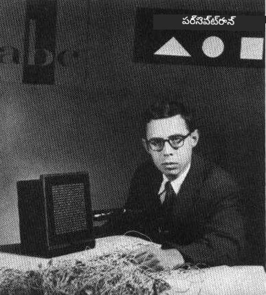
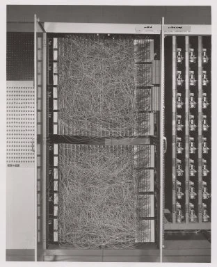
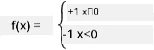

# న్యూరల్ నెట్‌వర్క్స్ పరిచయం: పర్సెప్ట్రాన్

## [పాఠం ముందు క్విజ్](https://ff-quizzes.netlify.app/en/ai/quiz/5)

ఆధునిక న్యూరల్ నెట్‌వర్క్‌లకు సమానమైన ఏదైనా మొదటి ప్రయత్నాలలో ఒకటి 1957లో కార్నెల్ ఏరోనాటికల్ ల్యాబొరేటరీలో ఫ్రాంక్ రోజెన్‌బ్లాట్ చేసినది. ఇది "మార్క్-1" అనే హార్డ్‌వేర్ అమలు, ఇది త్రిభుజాలు, చతురస్రాలు, వృత్తాలు వంటి ప్రాథమిక జ్యామితీయ ఆకారాలను గుర్తించడానికి రూపొందించబడింది.

|      |      |
|--------------|-----------|
| | |

> చిత్రాలు [వికీపీడియా నుండి](https://en.wikipedia.org/wiki/Perceptron)

ఒక ఇన్‌పుట్ చిత్రం 20x20 ఫోటోసెల్ అర్రే ద్వారా ప్రాతినిధ్యం వహించబడింది, కాబట్టి న్యూరల్ నెట్‌వర్క్‌కు 400 ఇన్‌పుట్లు మరియు ఒక బైనరీ అవుట్‌పుట్ ఉండేది. ఒక సాదా నెట్‌వర్క్‌లో ఒక న్యూరాన్ ఉండేది, దీనిని **థ్రెషోల్డ్ లాజిక్ యూనిట్** అని కూడా పిలుస్తారు. న్యూరల్ నెట్‌వర్క్ వెయిట్లు ట్రైనింగ్ దశలో మాన్యువల్ సర్దుబాటు అవసరం ఉన్న పొటెన్షియోమీటర్ల్లా పనిచేశాయి.

> ✅ పొటెన్షియోమీటర్ అనేది సర్క్యూట్ యొక్క రెసిస్టెన్స్‌ను యూజర్ సర్దుబాటు చేసుకునే పరికరం.

> ఆ సమయంలో న్యూయార్క్ టైమ్స్ పర్సెప్ట్రాన్ గురించి ఇలా రాశింది: *నేవీ ఆశిస్తున్న ఎలక్ట్రానిక్ కంప్యూటర్ యొక్క ప్రారంభ రూపం, ఇది నడవగలదు, మాట్లాడగలదు, చూడగలదు, రాయగలదు, స్వయంగా పునరుత్పత్తి చేసుకోగలదు మరియు తన ఉనికిని తెలుసుకోగలదు.*

## పర్సెప్ట్రాన్ మోడల్

మన మోడల్‌లో N ఫీచర్లు ఉన్నాయని అనుకుందాం, అప్పుడు ఇన్‌పుట్ వెక్టర్ N పరిమాణం కలిగిన వెక్టర్ అవుతుంది. పర్సెప్ట్రాన్ అనేది **బైనరీ వర్గీకరణ** మోడల్, అంటే ఇది రెండు వర్గాల ఇన్‌పుట్ డేటాను వేరుచేయగలదు. ప్రతి ఇన్‌పుట్ వెక్టర్ x కోసం మన పర్సెప్ట్రాన్ అవుట్‌పుట్ +1 లేదా -1 అవుతుంది, వర్గం ఆధారంగా. అవుట్‌పుట్ క్రింది సూత్రం ద్వారా లెక్కించబడుతుంది:

y(x) = f(w<sup>T</sup>x)

ఇక్కడ f అనేది స్టెప్ యాక్టివేషన్ ఫంక్షన్

<!-- img src="http://www.sciweavers.org/tex2img.php?eq=f%28x%29%20%3D%20%5Cbegin%7Bcases%7D%0A%20%20%20%20%20%20%20%20%20%2B1%20%26%20x%20%5Cgeq%200%20%5C%5C%0A%20%20%20%20%20%20%20%20%20-1%20%26%20x%20%3C%200%0A%20%20%20%20%20%20%20%5Cend%7Bcases%7D%20%5C%5C%0A&bc=White&fc=Black&im=jpg&fs=12&ff=arev&edit=0" align="center" border="0" alt="f(x) = \begin{cases} +1 & x \geq 0 \\ -1 & x < 0 \end{cases} \\" width="154" height="50" / -->


## పర్సెప్ట్రాన్ శిక్షణ

పర్సెప్ట్రాన్‌ను శిక్షణ ఇవ్వడానికి మనం ఎక్కువ భాగం విలువలను సరిగా వర్గీకరించే వెయిట్స్ వెక్టర్ w కనుగొనాలి, అంటే కనిష్ట **లోపం** (error) రావాలి. ఈ లోపం E ని **పర్సెప్ట్రాన్ ప్రమాణం** (criterion) క్రింద ఇలా నిర్వచిస్తారు:

E(w) = -&sum;w<sup>T</sup>x<sub>i</sub>t<sub>i</sub>

ఇక్కడ:

* సమాహారం తప్పు వర్గీకరణ కలిగిన శిక్షణ డేటా పాయింట్ల i పై తీసుకుంటారు
* x<sub>i</sub> ఇన్‌పుట్ డేటా, t<sub>i</sub> -1 లేదా +1, నెగటివ్ మరియు పాజిటివ్ ఉదాహరణలకు వరుసగా.

ఈ ప్రమాణం వెయిట్స్ w యొక్క ఫంక్షన్‌గా పరిగణించబడుతుంది, మరియు దీన్ని కనిష్టం చేయాలి. సాధారణంగా, **గ్రాడియెంట్ డిసెంట్** అనే పద్ధతి ఉపయోగిస్తారు, ఇందులో మనం ప్రారంభంలో కొన్ని ప్రాథమిక వెయిట్స్ w<sup>(0)</sup> తో మొదలుపెట్టి, ప్రతి దశలో క్రింది సూత్రం ప్రకారం వెయిట్స్‌ను నవీకరిస్తాము:

w<sup>(t+1)</sup> = w<sup>(t)</sup> - &eta;&nabla;E(w)

ఇక్కడ &eta; అనేది **లెర్నింగ్ రేట్**, &nabla;E(w) అనేది E యొక్క **గ్రాడియెంట్**. గ్రాడియెంట్ లెక్కించిన తర్వాత మనకు వస్తుంది:

w<sup>(t+1)</sup> = w<sup>(t)</sup> + &sum;&eta;x<sub>i</sub>t<sub>i</sub>

Python లో అల్గోరిథం ఇలా ఉంటుంది:

```python
def train(positive_examples, negative_examples, num_iterations = 100, eta = 1):

    weights = [0,0,0] # బరువులను ప్రారంభించండి (దాదాపు యాదృచ్ఛికంగా :)
        
    for i in range(num_iterations):
        pos = random.choice(positive_examples)
        neg = random.choice(negative_examples)

        z = np.dot(pos, weights) # పర్సెప్ట్రాన్ అవుట్పుట్‌ను లెక్కించండి
        if z < 0: # సానుకూల ఉదాహరణను ప్రతికూలంగా వర్గీకరించారు
            weights = weights + eta*weights.shape

        z  = np.dot(neg, weights)
        if z >= 0: # ప్రతికూల ఉదాహరణను సానుకూలంగా వర్గీకరించారు
            weights = weights - eta*weights.shape

    return weights
```

## ముగింపు

ఈ పాఠంలో మీరు పర్సెప్ట్రాన్ గురించి, ఇది ఒక బైనరీ వర్గీకరణ మోడల్ అని, మరియు వెయిట్స్ వెక్టర్ ఉపయోగించి దాన్ని ఎలా శిక్షణ ఇవ్వాలో నేర్చుకున్నారు.

## 🚀 సవాలు

మీరు మీ స్వంత పర్సెప్ట్రాన్ నిర్మించాలనుకుంటే, [Microsoft Learn లో ఈ ల్యాబ్](https://docs.microsoft.com/en-us/azure/machine-learning/component-reference/two-class-averaged-perceptron?WT.mc_id=academic-77998-cacaste) ప్రయత్నించండి, ఇది [Azure ML డిజైనర్](https://docs.microsoft.com/en-us/azure/machine-learning/concept-designer?WT.mc_id=academic-77998-cacaste) ఉపయోగిస్తుంది.

## [పాఠం తర్వాత క్విజ్](https://ff-quizzes.netlify.app/en/ai/quiz/6)

## సమీక్ష & స్వీయ అధ్యయనం

పర్సెప్ట్రాన్‌ను ఉపయోగించి ఒక చిన్న సమస్య మరియు వాస్తవ జీవిత సమస్యలను ఎలా పరిష్కరించవచ్చో చూడటానికి, మరియు నేర్చుకోవడం కొనసాగించడానికి - [Perceptron](Perceptron.ipynb) నోట్‌బుక్ చూడండి.

ఇంకా ఒక ఆసక్తికరమైన [పర్సెప్ట్రాన్ గురించి వ్యాసం](https://towardsdatascience.com/what-is-a-perceptron-basics-of-neural-networks-c4cfea20c590) కూడా ఉంది.

## [అసైన్‌మెంట్](lab/README.md)

ఈ పాఠంలో, మేము బైనరీ వర్గీకరణ పనికి పర్సెప్ట్రాన్‌ను అమలు చేశాము, మరియు రెండు చేతితో వ్రాసిన అంకెల మధ్య వర్గీకరించడానికి ఉపయోగించాము. ఈ ల్యాబ్‌లో, మీరు అంకెల వర్గీకరణ సమస్యను పూర్తిగా పరిష్కరించాలి, అంటే ఇచ్చిన చిత్రానికి ఏ అంకె అత్యంత సంభావ్యంగా సరిపోతుందో నిర్ణయించాలి.

* [సూచనలు](lab/README.md)
* [నోట్‌బుక్](lab/PerceptronMultiClass.ipynb)

---

<!-- CO-OP TRANSLATOR DISCLAIMER START -->
**అస్పష్టత**:  
ఈ పత్రాన్ని AI అనువాద సేవ [Co-op Translator](https://github.com/Azure/co-op-translator) ఉపయోగించి అనువదించబడింది. మేము ఖచ్చితత్వానికి ప్రయత్నించినప్పటికీ, ఆటోమేటెడ్ అనువాదాల్లో పొరపాట్లు లేదా తప్పిదాలు ఉండవచ్చు. మూల పత్రం దాని స్వదేశీ భాషలో అధికారిక మూలంగా పరిగణించాలి. ముఖ్యమైన సమాచారానికి, ప్రొఫెషనల్ మానవ అనువాదం సిఫార్సు చేయబడుతుంది. ఈ అనువాదం వాడకంలో ఏర్పడిన ఏవైనా అపార్థాలు లేదా తప్పుదారుల కోసం మేము బాధ్యత వహించము.
<!-- CO-OP TRANSLATOR DISCLAIMER END -->