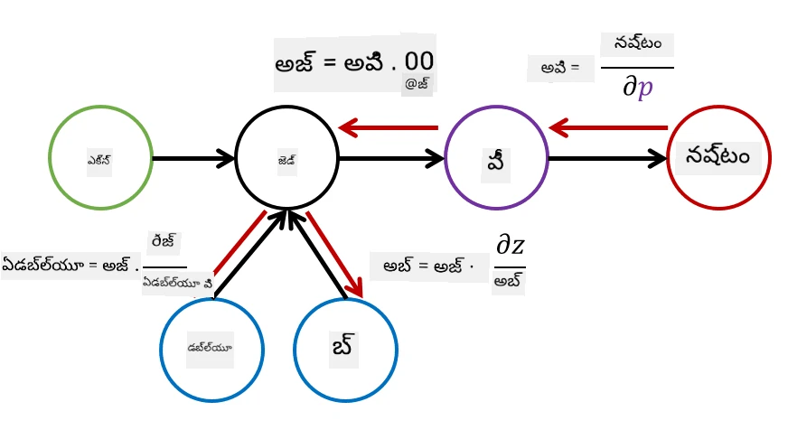

# న్యూరల్ నెట్‌వర్క్స్ పరిచయం. మల్టీ-లేయర్డ్ పర్సెప్ట్రాన్

మునుపటి విభాగంలో, మీరు అత్యంత సాదాసీదా న్యూరల్ నెట్‌వర్క్ మోడల్ - ఒక లేయర్డ్ పర్సెప్ట్రాన్, ఒక రేఖీయ రెండు-వర్గాల వర్గీకరణ మోడల్ గురించి నేర్చుకున్నారు.

ఈ విభాగంలో, మనం ఈ మోడల్‌ను మరింత సౌకర్యవంతమైన ఫ్రేమ్‌వర్క్‌గా విస్తరించబోతున్నాము, ఇది మనకు అనుమతిస్తుంది:

* రెండు-వర్గాల వర్గీకరణతో పాటు **బహు-వర్గ వర్గీకరణ** చేయడం
* వర్గీకరణతో పాటు **రెగ్రెషన్ సమస్యలను** పరిష్కరించడం
* రేఖీయంగా వేరుచేయలేని తరగతులను వేరుచేయడం

మనం పైన పేర్కొన్న విధంగా, వివిధ న్యూరల్ నెట్‌వర్క్ నిర్మాణాలను సృష్టించడానికి మన సొంత మాడ్యులర్ ఫ్రేమ్‌వర్క్‌ను Python లో అభివృద్ధి చేస్తాము.

## [పాఠం ముందు క్విజ్](https://ff-quizzes.netlify.app/en/ai/quiz/7)

## మెషీన్ లెర్నింగ్ యొక్క ఫార్మలైజేషన్

మెషీన్ లెర్నింగ్ సమస్యను ఫార్మలైజ్ చేయడం ప్రారంభిద్దాం. మనకు లేబుల్స్ **Y** ఉన్న శిక్షణ డేటాసెట్ **X** ఉందని ఊహించుకోండి, మరియు మనం అత్యంత ఖచ్చితమైన అంచనాలు చేయగల మోడల్ *f* ను నిర్మించాలి. అంచనాల నాణ్యతను **లాస్ ఫంక్షన్** &lagran; ద్వారా కొలుస్తారు. క్రింది లాస్ ఫంక్షన్లు తరచుగా ఉపయోగిస్తారు:

* రెగ్రెషన్ సమస్య కోసం, మనం ఒక సంఖ్యను అంచనా వేయాల్సినప్పుడు, మనం **అబ్సల్యూట్ ఎర్రర్** &sum;i|f(x(i))-y(i)| లేదా **స్క్వేర్ ఎర్రర్** &sum;i(f(x(i))-y(i))2 ఉపయోగించవచ్చు
* వర్గీకరణ కోసం, మనం **0-1 లాస్** (ఇది మోడల్ యొక్క **ఖచ్చితత్వం**కి సమానం), లేదా **లాజిస్టిక్ లాస్** ఉపయోగిస్తాము.

ఒక-లేయర్డ్ పర్సెప్ట్రాన్ కోసం, ఫంక్షన్ *f* ను రేఖీయ ఫంక్షన్ *f(x)=wx+b* గా నిర్వచించాము (ఇక్కడ *w* వెయిట్ మ్యాట్రిక్స్, *x* ఇన్‌పుట్ ఫీచర్ల వెక్టర్, మరియు *b* బైయాస్ వెక్టర్). వివిధ న్యూరల్ నెట్‌వర్క్ నిర్మాణాల కోసం, ఈ ఫంక్షన్ మరింత సంక్లిష్ట రూపం తీసుకోవచ్చు.

> వర్గీకరణ సందర్భంలో, తరచుగా నెట్‌వర్క్ అవుట్‌పుట్‌గా సంబంధిత తరగతుల ప్రాబబిలిటీలను పొందడం కోరుకుంటారు. ఏదైనా సంఖ్యలను ప్రాబబిలిటీలుగా మార్చడానికి (ఉదా: అవుట్‌పుట్‌ను నార్మలైజ్ చేయడానికి), మనం తరచుగా **softmax** ఫంక్షన్ &sigma; ఉపయోగిస్తాము, మరియు ఫంక్షన్ *f* అవుతుంది *f(x)=&sigma;(wx+b)*

పై *f* నిర్వచనంలో, *w* మరియు *b* ను **పారామీటర్లు** &theta;=⟨*w,b*⟩ అంటారు. డేటాసెట్ ⟨**X**,**Y**⟩ ఇచ్చినప్పుడు, మనం మొత్తం డేటాసెట్‌పై పొరపాటు మొత్తాన్ని పారామీటర్ల &theta; ఆధారంగా లెక్కించవచ్చు.

> ✅ **న్యూరల్ నెట్‌వర్క్ శిక్షణ లక్ష్యం పారామీటర్లను మార్చి పొరపాటును తగ్గించడం**

## గ్రాడియెంట్ డిసెంట్ ఆప్టిమైజేషన్

ఫంక్షన్ ఆప్టిమైజేషన్‌కు ప్రసిద్ధ పద్ధతి **గ్రాడియెంట్ డిసెంట్**. ఆలోచన ఏమిటంటే, మనం లాస్ ఫంక్షన్ యొక్క డెరివేటివ్ (బహుమాణిక సందర్భంలో దీనిని **గ్రాడియెంట్** అంటారు) ను పారామీటర్ల పట్ల లెక్కించి, పొరపాటు తగ్గే దిశగా పారామీటర్లను మార్చవచ్చు. దీన్ని ఇలా ఫార్మలైజ్ చేయవచ్చు:

* పారామీటర్లను యాదృచ్ఛిక విలువలతో ప్రారంభించండి w(0), b(0)
* క్రింది దశను అనేక సార్లు పునరావృతం చేయండి:
    - w(i+1) = w(i)-&eta;&part;&lagran;/&part;w
    - b(i+1) = b(i)-&eta;&part;&lagran;/&part;b

శిక్షణ సమయంలో, ఆప్టిమైజేషన్ దశలను మొత్తం డేటాసెట్‌ను పరిగణలోకి తీసుకుని లెక్కించాలి (లాస్ మొత్తం శిక్షణ నమూనాలపై సమంగా లెక్కించబడుతుంది). అయితే, వాస్తవ జీవితంలో మనం డేటాసెట్ చిన్న భాగాలుగా తీసుకుంటాము, వీటిని **మినీబ్యాచెస్** అంటారు, మరియు డేటా ఉపసమూహం ఆధారంగా గ్రాడియెంట్లను లెక్కిస్తాము. ప్రతి సారి యాదృచ్ఛికంగా ఉపసమూహం తీసుకోవడం వల్ల, ఈ పద్ధతిని **స్టోకాస్టిక్ గ్రాడియెంట్ డిసెంట్** (SGD) అంటారు.

## మల్టీ-లేయర్డ్ పర్సెప్ట్రాన్లు మరియు బ్యాక్‌ప్రొపగేషన్

ఒక లేయర్డ్ నెట్‌వర్క్, మనం పైగా చూశాం, రేఖీయంగా వేరుచేయగల తరగతులను వర్గీకరించగలదు. మరింత సమృద్ధి మోడల్ నిర్మించడానికి, మనం నెట్‌వర్క్ యొక్క అనేక లేయర్లను కలపవచ్చు. గణితంగా అంటే ఫంక్షన్ *f* మరింత సంక్లిష్ట రూపం తీసుకుంటుంది, మరియు అనేక దశల్లో లెక్కించబడుతుంది:
* z1=w1x+b1
* z2=w2&alpha;(z1)+b2
* f = &sigma;(z2)

ఇక్కడ, &alpha; అనేది **నాన్-లీనియర్ యాక్టివేషన్ ఫంక్షన్**, &sigma; అనేది softmax ఫంక్షన్, మరియు పారామీటర్లు &theta;=<*w1,b1,w2,b2*>.

గ్రాడియెంట్ డిసెంట్ అల్గోరిథం అదే ఉంటుంది, కానీ గ్రాడియెంట్ల లెక్కింపు కష్టం అవుతుంది. చైన్ డిఫరెన్షియేషన్ నియమం ప్రకారం, మనం డెరివేటివ్స్ లెక్కించవచ్చు:

* &part;&lagran;/&part;w2 = (&part;&lagran;/&part;&sigma;)(&part;&sigma;/&part;z2)(&part;z2/&part;w2)
* &part;&lagran;/&part;w1 = (&part;&lagran;/&part;&sigma;)(&part;&sigma;/&part;z2)(&part;z2/&part;&alpha;)(&part;&alpha;/&part;z1)(&part;z1/&part;w1)

> ✅ చైన్ డిఫరెన్షియేషన్ నియమం పారామీటర్ల పట్ల లాస్ ఫంక్షన్ యొక్క డెరివేటివ్స్ లెక్కించడానికి ఉపయోగిస్తారు.

గమనించండి, ఈ అన్ని వ్యక్తీకరణల ఎడమవైపు భాగం ఒకటే ఉంటుంది, కాబట్టి మనం లాస్ ఫంక్షన్ నుండి "వెనుకకు" కంప్యూటేషనల్ గ్రాఫ్ ద్వారా డెరివేటివ్స్‌ను సమర్థవంతంగా లెక్కించవచ్చు. అందువల్ల, మల్టీ-లేయర్డ్ పర్సెప్ట్రాన్ శిక్షణ పద్ధతిని **బ్యాక్‌ప్రొపగేషన్** లేదా 'బ్యాక్‌ప్రాప్' అంటారు.

> TODO: చిత్రం మూలం

> ✅ మనం బ్యాక్‌ప్రాప్‌ను మన నోట్బుక్ ఉదాహరణలో మరింత వివరంగా చూడబోతున్నాము.

## ముగింపు

ఈ పాఠంలో, మనం మన సొంత న్యూరల్ నెట్‌వర్క్ లైబ్రరీని నిర్మించాము, మరియు దాన్ని సాదాసీదా రెండు-డైమెన్షనల్ వర్గీకరణ పనికి ఉపయోగించాము.

## 🚀 సవాలు

సహాయక నోట్బుక్‌లో, మీరు మల్టీ-లేయర్డ్ పర్సెప్ట్రాన్లను నిర్మించడం మరియు శిక్షణ ఇవ్వడం కోసం మీ సొంత ఫ్రేమ్‌వర్క్‌ను అమలు చేస్తారు. ఆధునిక న్యూరల్ నెట్‌వర్క్స్ ఎలా పనిచేస్తాయో మీరు వివరంగా చూడగలుగుతారు.

[OwnFramework](OwnFramework.ipynb) నోట్బుక్‌కు వెళ్లి దాన్ని పూర్తి చేయండి.

## [పాఠం తర్వాత క్విజ్](https://ff-quizzes.netlify.app/en/ai/quiz/8)

## సమీక్ష & స్వీయ అధ్యయనం

బ్యాక్‌ప్రొపగేషన్ అనేది AI మరియు ML లో సాధారణంగా ఉపయోగించే అల్గోరిథం, దీన్ని [మరింత వివరంగా](https://wikipedia.org/wiki/Backpropagation) అధ్యయనం చేయడం మంచిది.

## [అసైన్‌మెంట్](lab/README.md)

ఈ ల్యాబ్‌లో, మీరు ఈ పాఠంలో నిర్మించిన ఫ్రేమ్‌వర్క్‌ను ఉపయోగించి MNIST చేతితో వ్రాసిన అంకెల వర్గీకరణను పరిష్కరించాల్సి ఉంటుంది.

* [సూచనలు](lab/README.md)
* [నోట్బుక్](lab/MyFW_MNIST.ipynb)

---

<!-- CO-OP TRANSLATOR DISCLAIMER START -->
**అస్పష్టత**:  
ఈ పత్రాన్ని AI అనువాద సేవ [Co-op Translator](https://github.com/Azure/co-op-translator) ఉపయోగించి అనువదించబడింది. మేము ఖచ్చితత్వానికి ప్రయత్నించినప్పటికీ, ఆటోమేటెడ్ అనువాదాల్లో పొరపాట్లు లేదా తప్పిదాలు ఉండవచ్చు. మూల పత్రం దాని స్వదేశీ భాషలో అధికారిక మూలంగా పరిగణించాలి. ముఖ్యమైన సమాచారానికి, ప్రొఫెషనల్ మానవ అనువాదం సిఫార్సు చేయబడుతుంది. ఈ అనువాదం వాడకంలో ఏర్పడిన ఏవైనా అపార్థాలు లేదా తప్పుదారితీసే అర్థాలు కోసం మేము బాధ్యత వహించము.
<!-- CO-OP TRANSLATOR DISCLAIMER END -->