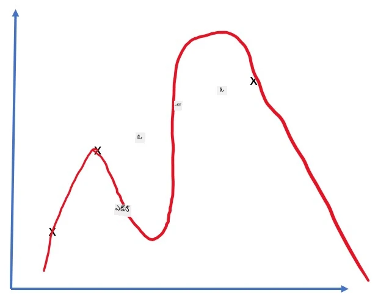
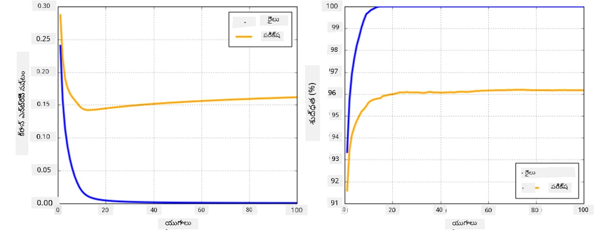

# న్యూరల్ నెట్‌వర్క్ ఫ్రేమ్‌వర్క్స్

మనం ఇప్పటికే నేర్చుకున్నట్లుగా, న్యూరల్ నెట్‌వర్క్స్‌ను సమర్థవంతంగా శిక్షణ ఇవ్వడానికి రెండు విషయాలు చేయాలి:

* టెన్సార్లపై ఆపరేట్ చేయడం, ఉదాహరణకు గుణించడం, జోడించడం, మరియు సిగ్మాయిడ్ లేదా సాఫ్ట్‌మ్యాక్స్ వంటి కొన్ని ఫంక్షన్లను గణించడం
* గ్రాడియెంట్లను గణించడం, గ్రాడియెంట్ డిసెంట్ ఆప్టిమైజేషన్ చేయడానికి

## [ప్రీ-లెక్చర్ క్విజ్](https://ff-quizzes.netlify.app/en/ai/quiz/9)

`numpy` లైబ్రరీ మొదటి భాగాన్ని చేయగలిగినా, గ్రాడియెంట్లను గణించడానికి మాకు ఒక యంత్రాంగం అవసరం. [మా ఫ్రేమ్‌వర్క్](../04-OwnFramework/OwnFramework.ipynb) లో మేము గత సెక్షన్‌లో అభివృద్ధి చేసినట్లుగా, `backward` మెథడ్‌లో అన్ని డెరివేటివ్ ఫంక్షన్లను మాన్యువల్‌గా ప్రోగ్రామ్ చేయాల్సి వచ్చింది, ఇది బ్యాక్‌ప్రొపగేషన్ చేస్తుంది. Ideally, ఒక ఫ్రేమ్‌వర్క్ మాకు *ఏదైనా వ్యక్తీకరణ* యొక్క గ్రాడియెంట్లను గణించడానికి అవకాశం ఇవ్వాలి.

మరొక ముఖ్యమైన విషయం GPU లేదా [TPU](https://en.wikipedia.org/wiki/Tensor_Processing_Unit) వంటి ఇతర ప్రత్యేక కంప్యూట్ యూనిట్లపై గణనలను చేయగలగడం. డీప్ న్యూరల్ నెట్‌వర్క్ శిక్షణకు *చాలా* గణనలు అవసరం, మరియు వాటిని GPUsపై సమాంతరంగా చేయగలగడం చాలా ముఖ్యం.

> ✅ 'parallelize' అనే పదం అనగా గణనలను అనేక పరికరాలపై పంపిణీ చేయడం.

ప్రస్తుతం, రెండు అత్యంత ప్రాచుర్యం పొందిన న్యూరల్ ఫ్రేమ్‌వర్క్స్: [TensorFlow](http://TensorFlow.org) మరియు [PyTorch](https://pytorch.org/). ఇవి రెండూ CPU మరియు GPU రెండింటిలో టెన్సార్లతో ఆపరేట్ చేయడానికి లో-లెవెల్ API అందిస్తాయి. లో-లెవెల్ API పై, ఉన్నత-స్థాయి APIలు కూడా ఉన్నాయి, అవి వరుసగా [Keras](https://keras.io/) మరియు [PyTorch Lightning](https://pytorchlightning.ai/).

లో-లెవెల్ API | [TensorFlow](http://TensorFlow.org) | [PyTorch](https://pytorch.org/)
--------------|-------------------------------------|--------------------------------
ఉన్నత-స్థాయి API| [Keras](https://keras.io/) | [PyTorch Lightning](https://pytorchlightning.ai/)

**లో-లెవెల్ APIs** రెండు ఫ్రేమ్‌వర్క్స్‌లోనూ మీరు **కంప్యూటేషనల్ గ్రాఫ్‌లు** నిర్మించడానికి అనుమతిస్తాయి. ఈ గ్రాఫ్ ఇచ్చిన ఇన్‌పుట్ పారామీటర్లతో అవుట్‌పుట్ (సాధారణంగా లాస్ ఫంక్షన్) ఎలా గణించాలో నిర్వచిస్తుంది, మరియు GPU అందుబాటులో ఉంటే అక్కడ గణనకు పంపవచ్చు. ఈ కంప్యూటేషనల్ గ్రాఫ్‌ను డిఫరెన్షియేట్ చేసి గ్రాడియెంట్లను గణించే ఫంక్షన్లు ఉన్నాయి, వాటిని మోడల్ పారామీటర్లను ఆప్టిమైజ్ చేయడానికి ఉపయోగించవచ్చు.

**ఉన్నత-స్థాయి APIs** న్యూరల్ నెట్‌వర్క్స్‌ను **లేయర్ల సీక్వెన్స్**గా పరిగణించి, చాలా న్యూరల్ నెట్‌వర్క్స్ నిర్మాణాన్ని సులభతరం చేస్తాయి. మోడల్ శిక్షణ సాధారణంగా డేటాను సిద్ధం చేసి, `fit` ఫంక్షన్‌ను పిలవడం ద్వారా జరుగుతుంది.

ఉన్నత-స్థాయి APIలు సాధారణ న్యూరల్ నెట్‌వర్క్స్‌ను త్వరగా నిర్మించడానికి అనుమతిస్తాయి, చాలా వివరాల గురించి ఆందోళన చెందకుండా. అదే సమయంలో, లో-లెవెల్ API శిక్షణ ప్రక్రియపై మరింత నియంత్రణ ఇస్తుంది, కాబట్టి కొత్త న్యూరల్ నెట్‌వర్క్ ఆర్కిటెక్చర్లతో పని చేసే పరిశోధనలో ఎక్కువగా ఉపయోగిస్తారు.

మరియు మీరు రెండు APIలను కలిసి ఉపయోగించవచ్చు, ఉదాహరణకు, మీ స్వంత నెట్‌వర్క్ లేయర్ ఆర్కిటెక్చర్‌ను లో-లెవెల్ APIతో అభివృద్ధి చేసి, దాన్ని ఉన్నత-స్థాయి APIతో నిర్మించిన పెద్ద నెట్‌వర్క్‌లో ఉపయోగించవచ్చు. లేదా ఉన్నత-స్థాయి APIతో లేయర్ల సీక్వెన్స్‌గా నెట్‌వర్క్ నిర్వచించి, మీ స్వంత లో-లెవెల్ శిక్షణ లూప్‌తో ఆప్టిమైజేషన్ చేయవచ్చు. రెండు APIలు ఒకే ప్రాథమిక భావనలను ఉపయోగిస్తాయి మరియు కలిసి బాగా పనిచేయడానికి రూపొందించబడ్డాయి.

## నేర్చుకోవడం

ఈ కోర్సులో, మేము ఎక్కువ భాగం కంటెంట్‌ను PyTorch మరియు TensorFlow రెండింటికీ అందిస్తున్నాము. మీరు మీ ఇష్టమైన ఫ్రేమ్‌వర్క్‌ను ఎంచుకుని సంబంధిత నోట్‌బుక్స్ మాత్రమే చూడవచ్చు. మీరు ఏ ఫ్రేమ్‌వర్క్ ఎంచుకోవాలో తెలియకపోతే, ఇంటర్నెట్‌లో **PyTorch vs. TensorFlow** గురించి చర్చలను చదవండి. మీరు రెండు ఫ్రేమ్‌వర్క్స్‌ను కూడా పరిశీలించి మెరుగైన అవగాహన పొందవచ్చు.

సాధ్యమైన చోట్ల, సులభత కోసం ఉన్నత-స్థాయి APIలను ఉపయోగిస్తాము. అయితే, న్యూరల్ నెట్‌వర్క్స్ ఎలా పనిచేస్తాయో మౌలికంగా అర్థం చేసుకోవడం ముఖ్యం కాబట్టి, ప్రారంభంలో లో-లెవెల్ API మరియు టెన్సార్లతో పని చేయడం ప్రారంభిస్తాము. కానీ మీరు త్వరగా ముందుకు వెళ్లాలనుకుంటే, ఈ వివరాలను నేర్చుకోవడంలో ఎక్కువ సమయం ఖర్చు చేయకుండా ఉన్నత-స్థాయి API నోట్‌బుక్స్‌కు నేరుగా వెళ్లవచ్చు.

## ✍️ వ్యాయామాలు: ఫ్రేమ్‌వర్క్స్

క్రింది నోట్‌బుక్స్‌లో మీ అభ్యాసాన్ని కొనసాగించండి:

లో-లెవెల్ API | [TensorFlow+Keras నోట్‌బుక్](IntroKerasTF.ipynb) | [PyTorch](IntroPyTorch.ipynb)
--------------|-------------------------------------|--------------------------------
ఉన్నత-స్థాయి API| [Keras](IntroKeras.ipynb) | *PyTorch Lightning*

ఫ్రేమ్‌వర్క్స్‌లో నైపుణ్యం సాధించిన తర్వాత, ఓవర్‌ఫిట్టింగ్ భావనను పునఃసమీక్షిద్దాం.

# ఓవర్‌ఫిట్టింగ్

ఓవర్‌ఫిట్టింగ్ అనేది మెషీన్ లెర్నింగ్‌లో అత్యంత ముఖ్యమైన భావన, మరియు దీన్ని సరిగ్గా అర్థం చేసుకోవడం చాలా ముఖ్యం!

క్రింది సమస్యను పరిగణించండి, 5 డాట్లను (గ్రాఫ్‌లలో `x`గా సూచించబడినవి) సన్నిహితంగా అంచనా వేయడం:

 | 
-------------------------|--------------------------
**లీనియర్ మోడల్, 2 పారామీటర్లు** | **నాన్-లీనియర్ మోడల్, 7 పారామీటర్లు**
శిక్షణ లోపం = 5.3 | శిక్షణ లోపం = 0
వాలిడేషన్ లోపం = 5.1 | వాలిడేషన్ లోపం = 20

* ఎడమవైపు, మంచి సరళ రేఖా సన్నిహితీకరణ కనిపిస్తుంది. పారామీటర్ల సంఖ్య సరిపడినందున, మోడల్ పాయింట్ల పంపిణీ వెనుక ఉన్న భావనను సరిగ్గా అర్థం చేసుకుంటుంది.
* కుడివైపు, మోడల్ చాలా శక్తివంతంగా ఉంది. మాకు కేవలం 5 పాయింట్లు ఉన్నప్పుడు, మోడల్ 7 పారామీటర్లతో అన్ని పాయింట్ల ద్వారా వెళ్లేలా సర్దుబాటు చేయగలదు, అందువల్ల శిక్షణ లోపం 0 అవుతుంది. అయితే, ఇది డేటా వెనుక ఉన్న సరైన నమూనాను అర్థం చేసుకోవడాన్ని నిరోధిస్తుంది, అందువల్ల వాలిడేషన్ లోపం చాలా ఎక్కువగా ఉంటుంది.

మోడల్ యొక్క సంపద (పారామీటర్ల సంఖ్య) మరియు శిక్షణ నమూనాల సంఖ్య మధ్య సరైన సమతుల్యతను సాధించడం చాలా ముఖ్యం.

## ఓవర్‌ఫిట్టింగ్ ఎందుకు జరుగుతుంది

  * సరిపడా శిక్షణ డేటా లేకపోవడం
  * మోడల్ చాలా శక్తివంతంగా ఉండటం
  * ఇన్‌పుట్ డేటాలో ఎక్కువ శబ్దం ఉండటం

## ఓవర్‌ఫిట్టింగ్ ఎలా గుర్తించాలి

పై గ్రాఫ్ నుండి మీరు చూడగలిగినట్లుగా, ఓవర్‌ఫిట్టింగ్ చాలా తక్కువ శిక్షణ లోపం మరియు ఎక్కువ వాలిడేషన్ లోపం ద్వారా గుర్తించవచ్చు. సాధారణంగా శిక్షణ సమయంలో శిక్షణ మరియు వాలిడేషన్ లోపాలు రెండూ తగ్గడం ప్రారంభిస్తాయి, ఆపై ఏదో సమయంలో వాలిడేషన్ లోపం తగ్గడం ఆగి పెరుగుతుండవచ్చు. ఇది ఓవర్‌ఫిట్టింగ్ సంకేతం, మరియు ఆ సమయంలో శిక్షణను ఆపడం (లేదా కనీసం మోడల్ యొక్క స్నాప్‌షాట్ తీసుకోవడం) అవసరం.

## ఓవర్‌ఫిట్టింగ్ ఎలా నివారించాలి

ఓవర్‌ఫిట్టింగ్ జరుగుతుందని మీరు గమనిస్తే, ఈ క్రింది చర్యలు తీసుకోవచ్చు:

 * శిక్షణ డేటా పరిమాణాన్ని పెంచండి
 * మోడల్ సంక్లిష్టతను తగ్గించండి
 * [రెగ్యులరైజేషన్ సాంకేతికత](../../4-ComputerVision/08-TransferLearning/TrainingTricks.md) ఉపయోగించండి, ఉదాహరణకు [డ్రాపౌట్](../../4-ComputerVision/08-TransferLearning/TrainingTricks.md#Dropout), దీన్ని తర్వాత పరిశీలిస్తాము.

## ఓవర్‌ఫిట్టింగ్ మరియు బైయాస్-వేరియన్స్ ట్రేడ్‌ఆఫ్

ఓవర్‌ఫిట్టింగ్ అనేది గణాంకాల్లో [బైయాస్-వేరియన్స్ ట్రేడ్‌ఆఫ్](https://en.wikipedia.org/wiki/Bias%E2%80%93variance_tradeoff) అనే సాధారణ సమస్య యొక్క ఒక ఉదాహరణ. మన మోడల్ లోపాల మూలాలను పరిశీలిస్తే, రెండు రకాల లోపాలు ఉంటాయి:

* **బైయాస్ లోపాలు** మన అల్గోరిథం శిక్షణ డేటా మధ్య సంబంధాన్ని సరిగ్గా పట్టుకోలేకపోవడం వల్ల వస్తాయి. ఇది మోడల్ తక్కువ శక్తివంతంగా ఉండటం వల్ల (అంటే **అండర్‌ఫిట్టింగ్**) జరుగుతుంది.
* **వేరియన్స్ లోపాలు**, ఇవి మోడల్ ఇన్‌పుట్ డేటాలోని శబ్దాన్ని అర్థవంతమైన సంబంధం కాకుండా అంచనా వేయడం వల్ల (అంటే **ఓవర్‌ఫిట్టింగ్**) వస్తాయి.

శిక్షణ సమయంలో, బైయాస్ లోపం తగ్గుతుంది (మోడల్ డేటాను అంచనా వేయడం నేర్చుకుంటుంది), మరియు వేరియన్స్ లోపం పెరుగుతుంది. ఓవర్‌ఫిట్టింగ్ నివారించడానికి శిక్షణను ఆపడం ముఖ్యం — మాన్యువల్‌గా (ఓవర్‌ఫిట్టింగ్ గుర్తించినప్పుడు) లేదా ఆటోమేటిక్‌గా (రెగ్యులరైజేషన్ ప్రవేశపెట్టడం ద్వారా).

## ముగింపు

ఈ పాఠంలో, మీరు రెండు అత్యంత ప్రాచుర్యం పొందిన AI ఫ్రేమ్‌వర్క్స్ అయిన TensorFlow మరియు PyTorch కోసం వివిధ APIల మధ్య తేడాలను నేర్చుకున్నారు. అదనంగా, ఓవర్‌ఫిట్టింగ్ అనే చాలా ముఖ్యమైన అంశాన్ని కూడా తెలుసుకున్నారు.

## 🚀 సవాలు

సహాయక నోట్‌బుక్స్‌లో, మీరు కింద 'టాస్క్‌లు' కనుగొంటారు; నోట్‌బుక్స్‌ను పూర్తి చేసి టాస్క్‌లను పూర్తి చేయండి.

## [పోస్ట్-లెక్చర్ క్విజ్](https://ff-quizzes.netlify.app/en/ai/quiz/10)

## సమీక్ష & స్వీయ అధ్యయనం

క్రింది విషయాలపై కొంత పరిశోధన చేయండి:

- TensorFlow
- PyTorch
- ఓవర్‌ఫిట్టింగ్

ఈ ప్రశ్నలను మీకు అడగండి:

- TensorFlow మరియు PyTorch మధ్య తేడా ఏమిటి?
- ఓవర్‌ఫిట్టింగ్ మరియు అండర్‌ఫిట్టింగ్ మధ్య తేడా ఏమిటి?

## [అసైన్‌మెంట్](lab/README.md)

ఈ ల్యాబ్‌లో, మీరు PyTorch లేదా TensorFlow ఉపయోగించి సింగిల్ మరియు మల్టీ-లేయర్డ్ ఫుల్-కనెక్టెడ్ నెట్‌వర్క్స్ ఉపయోగించి రెండు వర్గీకరణ సమస్యలను పరిష్కరించాల్సి ఉంటుంది.

* [సూచనలు](lab/README.md)
* [నోట్‌బుక్](lab/LabFrameworks.ipynb)

---

<!-- CO-OP TRANSLATOR DISCLAIMER START -->
**అస్పష్టత**:  
ఈ పత్రాన్ని AI అనువాద సేవ [Co-op Translator](https://github.com/Azure/co-op-translator) ఉపయోగించి అనువదించబడింది. మేము ఖచ్చితత్వానికి ప్రయత్నించినప్పటికీ, ఆటోమేటెడ్ అనువాదాల్లో పొరపాట్లు లేదా తప్పిదాలు ఉండవచ్చు. మూల పత్రం దాని స్వదేశీ భాషలో అధికారిక మూలంగా పరిగణించాలి. ముఖ్యమైన సమాచారానికి, ప్రొఫెషనల్ మానవ అనువాదం సిఫార్సు చేయబడుతుంది. ఈ అనువాదం వాడకంలో ఏర్పడిన ఏవైనా అపార్థాలు లేదా తప్పుదారితీసే అర్థాలు కోసం మేము బాధ్యత వహించము.
<!-- CO-OP TRANSLATOR DISCLAIMER END -->