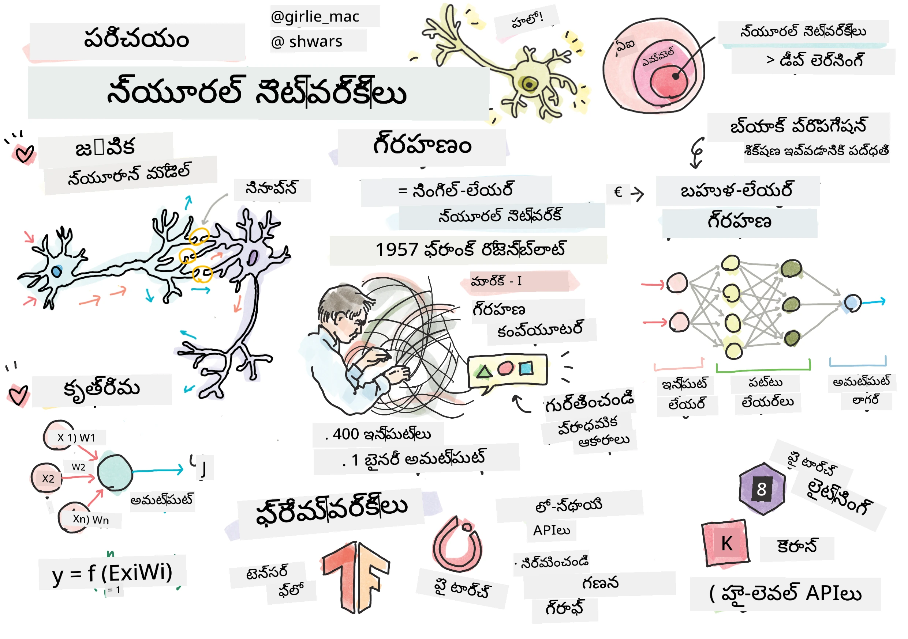
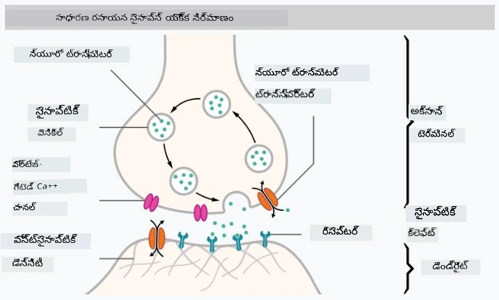
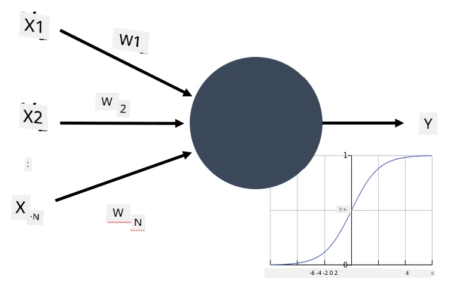

# న్యూరల్ నెట్‌వర్క్స్ పరిచయం

మనం పరిచయంలో చర్చించినట్లుగా, మేధస్సును సాధించడానికి ఒక మార్గం **కంప్యూటర్ మోడల్** లేదా **కృత్రిమ మెదడు**ను శిక్షణ ఇవ్వడం. 20వ శతాబ్దం మధ్య నుండి పరిశోధకులు వివిధ గణిత మోడల్స్ ప్రయత్నించారు, ఇటీవల సంవత్సరాలలో ఈ దిశ చాలా విజయవంతమైంది. మెదడుకు ఇలాంటి గణిత మోడల్స్‌ను **న్యూరల్ నెట్‌వర్క్స్** అంటారు.

> న్యూరల్ నెట్‌వర్క్స్‌ను కొన్నిసార్లు *కృత్రిమ న్యూరల్ నెట్‌వర్క్స్* (ANNs) అని పిలుస్తారు, ఎందుకంటే మేము నిజమైన న్యూరాన్ల నెట్‌వర్క్స్ కాకుండా మోడల్స్ గురించి మాట్లాడుతున్నామనే సూచన కోసం.

## మెషీన్ లెర్నింగ్

న్యూరల్ నెట్‌వర్క్స్ ఒక పెద్ద శాస్త్రశాఖ అయిన **మెషీన్ లెర్నింగ్**లో భాగం, దీని లక్ష్యం డేటాను ఉపయోగించి సమస్యలను పరిష్కరించగల కంప్యూటర్ మోడల్స్‌ను శిక్షణ ఇవ్వడం. మెషీన్ లెర్నింగ్ ఆర్టిఫిషియల్ ఇంటెలిజెన్స్‌లో పెద్ద భాగాన్ని కలిగి ఉంటుంది, అయితే ఈ పాఠ్యాంశంలో క్లాసికల్ ML ను కవర్ చేయము.

> క్లాసికల్ మెషీన్ లెర్నింగ్ గురించి మరింత తెలుసుకోవడానికి మా ప్రత్యేక **[Machine Learning for Beginners](http://github.com/microsoft/ml-for-beginners)** పాఠ్యాంశాన్ని సందర్శించండి.

మెషీన్ లెర్నింగ్‌లో, మనకు కొన్ని ఉదాహరణల డేటాసెట్ **X** మరియు అనుగుణమైన అవుట్‌పుట్ విలువలు **Y** ఉంటాయని భావిస్తాము. ఉదాహరణలు సాధారణంగా N-డైమెన్షనల్ వెక్టర్లు, వీటిలో **ఫీచర్లు** ఉంటాయి, అవుట్‌పుట్లు **లేబుల్స్** అని పిలవబడతాయి.

మనం రెండు సాధారణ మెషీన్ లెర్నింగ్ సమస్యలను పరిశీలిస్తాము:

* **వర్గీకరణ (Classification)**, ఇన్‌పుట్ వస్తువును రెండు లేదా అంతకంటే ఎక్కువ తరగతులలో వర్గీకరించాల్సిన అవసరం ఉన్నప్పుడు.
* **రెగ్రెషన్ (Regression)**, ఇన్‌పుట్ నమూనాలకు సంఖ్యాత్మక విలువను అంచనా వేయాల్సినప్పుడు.

> ఇన్‌పుట్లు మరియు అవుట్‌పుట్లను టెన్సర్లుగా ప్రదర్శించినప్పుడు, ఇన్‌పుట్ డేటాసెట్ M×N పరిమాణం గల మ్యాట్రిక్స్, ఇక్కడ M నమూనాల సంఖ్య మరియు N ఫీచర్ల సంఖ్య. అవుట్‌పుట్ లేబుల్స్ Y M పరిమాణం గల వెక్టర్.

ఈ పాఠ్యాంశంలో, మనం కేవలం న్యూరల్ నెట్‌వర్క్ మోడల్స్‌పై దృష్టి సారిస్తాము.

## న్యూరాన్ మోడల్

జీవశాస్త్రం ప్రకారం, మన మెదడు న్యూరల్ సెల్స్ (న్యూరాన్లు)తో కూడి ఉంటుంది, ప్రతి న్యూరాన్‌కు అనేక "ఇన్‌పుట్లు" (డెండ్రైట్స్) మరియు ఒకే "అవుట్‌పుట్" (ఆక్సాన్) ఉంటుంది. డెండ్రైట్స్ మరియు ఆక్సాన్లు విద్యుత్ సంకేతాలను ప్రసారం చేయగలవు, మరియు వాటి మధ్య కనెక్షన్లు — సైనాప్సెస్ అని పిలవబడతాయి — వివిధ స్థాయిలలో విద్యుత్ ప్రసరణ సామర్థ్యాన్ని చూపుతాయి, ఇవి న్యూరోట్రాన్స్‌మిటర్ల ద్వారా నియంత్రించబడతాయి.

 | 
----|----
నిజమైన న్యూరాన్ *([చిత్రం](https://en.wikipedia.org/wiki/Synapse#/media/File:SynapseSchematic_lines.svg) వికీపీడియా నుండి)* | కృత్రిమ న్యూరాన్ *(చిత్రం రచయిత ద్వారా)*

కాబట్టి, న్యూరాన్ యొక్క సులభమైన గణిత మోడల్‌లో అనేక ఇన్‌పుట్లు X1, ..., XN, ఒక అవుట్‌పుట్ Y మరియు ఒక శ్రేణి వెయిట్లు W1, ..., WN ఉంటాయి. అవుట్‌పుట్ ఈ విధంగా లెక్కించబడుతుంది:

ఇక్కడ f అనేది ఒక నాన్-లీనియర్ **యాక్టివేషన్ ఫంక్షన్**.

> న్యూరాన్ యొక్క ప్రారంభ మోడల్స్ 1943లో వారెన్ మెక్‌కలాక్ మరియు వాల్టర్ పిట్స్ రాసిన క్లాసికల్ పేపర్ [A logical calculus of the ideas immanent in nervous activity](https://www.cs.cmu.edu/~./epxing/Class/10715/reading/McCulloch.and.Pitts.pdf)లో వివరించబడ్డాయి. డొనాల్డ్ హెబ్ తన పుస్తకం "[The Organization of Behavior: A Neuropsychological Theory](https://books.google.com/books?id=VNetYrB8EBoC)"లో ఆ నెట్‌వర్క్స్‌ను శిక్షణ ఇవ్వగల మార్గాన్ని ప్రతిపాదించారు.

## ఈ విభాగంలో

ఈ విభాగంలో మనం నేర్చుకునేది:
* [పర్సెప్ట్రాన్](03-Perceptron/README.md), రెండు తరగతుల వర్గీకరణ కోసం ప్రారంభ న్యూరల్ నెట్‌వర్క్ మోడల్
* [బహుళ-పట్టాల నెట్‌వర్క్స్](04-OwnFramework/README.md) మరియు జతచేసిన నోట్‌బుక్ [మన స్వంత ఫ్రేమ్‌వర్క్ ఎలా నిర్మించాలి](04-OwnFramework/OwnFramework.ipynb)
* [న్యూరల్ నెట్‌వర్క్ ఫ్రేమ్‌వర్క్స్](05-Frameworks/README.md), ఈ నోట్‌బుక్స్‌తో: [PyTorch](05-Frameworks/IntroPyTorch.ipynb) మరియు [Keras/Tensorflow](05-Frameworks/IntroKerasTF.ipynb)
* [ఓవర్‌ఫిట్టింగ్](../../../../lessons/3-NeuralNetworks/05-Frameworks)

---

<!-- CO-OP TRANSLATOR DISCLAIMER START -->
**అస్పష్టత**:  
ఈ పత్రాన్ని AI అనువాద సేవ [Co-op Translator](https://github.com/Azure/co-op-translator) ఉపయోగించి అనువదించబడింది. మేము ఖచ్చితత్వానికి ప్రయత్నించినప్పటికీ, ఆటోమేటెడ్ అనువాదాల్లో పొరపాట్లు లేదా తప్పిదాలు ఉండవచ్చు. మూల పత్రం దాని స్వదేశీ భాషలో అధికారిక మూలంగా పరిగణించాలి. ముఖ్యమైన సమాచారానికి, ప్రొఫెషనల్ మానవ అనువాదం సిఫార్సు చేయబడుతుంది. ఈ అనువాదం వాడకంలో ఏర్పడిన ఏవైనా అపార్థాలు లేదా తప్పుదారుల కోసం మేము బాధ్యత వహించము.
<!-- CO-OP TRANSLATOR DISCLAIMER END -->