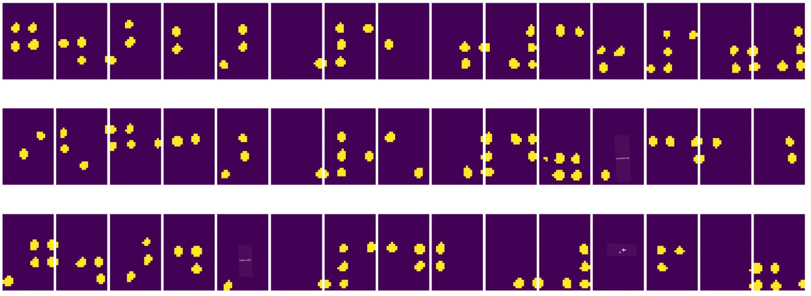

# కంప్యూటర్ విజన్ పరిచయం

[కంప్యూటర్ విజన్](https://wikipedia.org/wiki/Computer_vision) అనేది కంప్యూటర్లకు డిజిటల్ చిత్రాలపై ఉన్నత స్థాయి అవగాహన పొందేలా చేయడం లక్ష్యంగా ఉన్న శాస్త్రశాఖ. ఇది చాలా విస్తృత నిర్వచనం, ఎందుకంటే *అవగాహన* అనేది అనేక రకాల అర్థాలు కలిగి ఉండవచ్చు, ఉదాహరణకు చిత్రంలో ఒక వస్తువును కనుగొనడం (**object detection**), ఏం జరుగుతుందో అర్థం చేసుకోవడం (**event detection**), చిత్రాన్ని వచనంగా వివరించడం, లేదా సన్నివేశాన్ని 3Dలో పునర్నిర్మించడం. మానవ చిత్రాలకు సంబంధించిన ప్రత్యేక పనులు కూడా ఉన్నాయి: వయస్సు మరియు భావోద్వేగ అంచనా, ముఖ గుర్తింపు మరియు గుర్తింపు, 3D పోజ్ అంచనా వంటి కొన్ని.

## [పూర్వ-లెక్చర్ క్విజ్](https://ff-quizzes.netlify.app/en/ai/quiz/11)

కంప్యూటర్ విజన్ యొక్క సులభమైన పనుల్లో ఒకటి **చిత్ర వర్గీకరణ**.

కంప్యూటర్ విజన్‌ను తరచుగా AI శాఖగా పరిగణిస్తారు. ఈ రోజుల్లో, కంప్యూటర్ విజన్ పనులన్నీ ఎక్కువగా న్యూరల్ నెట్‌వర్క్‌లను ఉపయోగించి పరిష్కరించబడుతున్నాయి. ఈ విభాగంలో, కంప్యూటర్ విజన్ కోసం ఉపయోగించే ప్రత్యేక న్యూరల్ నెట్‌వర్క్‌ల గురించి, [కన్వల్యూషనల్ న్యూరల్ నెట్‌వర్క్‌లు](../07-ConvNets/README.md) గురించి మరింత తెలుసుకుంటాము.

అయితే, చిత్రాన్ని న్యూరల్ నెట్‌వర్క్‌కు పంపించే ముందు, చాలా సందర్భాల్లో చిత్రాన్ని మెరుగుపరచడానికి కొన్ని అల్గోరిథమిక్ సాంకేతికతలను ఉపయోగించడం మంచిది.

చిత్ర ప్రాసెసింగ్ కోసం పలు Python లైబ్రరీలు అందుబాటులో ఉన్నాయి:

* **[imageio](https://imageio.readthedocs.io/en/stable/)** వివిధ చిత్ర ఫార్మాట్లను చదవడం/వ్రాయడం కోసం ఉపయోగించవచ్చు. ఇది ffmpeg ను కూడా మద్దతు ఇస్తుంది, ఇది వీడియో ఫ్రేమ్‌లను చిత్రాలుగా మార్చడానికి ఉపయోగపడుతుంది.
* **[Pillow](https://pillow.readthedocs.io/en/stable/index.html)** (PIL అని కూడా పిలవబడుతుంది) కొంతమేర శక్తివంతమైనది, మరియు మోర్ఫింగ్, ప్యాలెట్ సర్దుబాటు వంటి చిత్ర మార్పిడి పనులను కూడా మద్దతు ఇస్తుంది.
* **[OpenCV](https://opencv.org/)** C++ లో రాయబడిన శక్తివంతమైన చిత్ర ప్రాసెసింగ్ లైబ్రరీ, ఇది చిత్ర ప్రాసెసింగ్ కోసం *de facto* ప్రమాణంగా మారింది. దీనికి సౌకర్యవంతమైన Python ఇంటర్‌ఫేస్ ఉంది.
* **[dlib](http://dlib.net/)** అనేది C++ లైబ్రరీ, ఇది అనేక మెషీన్ లెర్నింగ్ అల్గోరిథమ్స్‌ను అమలు చేస్తుంది, వాటిలో కొన్ని కంప్యూటర్ విజన్ అల్గోరిథమ్స్ కూడా ఉన్నాయి. దీనికి Python ఇంటర్‌ఫేస్ కూడా ఉంది, మరియు ముఖ గుర్తింపు, ముఖ లక్షణాల గుర్తింపు వంటి కష్టమైన పనులకు ఉపయోగించవచ్చు.

## OpenCV

[OpenCV](https://opencv.org/) చిత్ర ప్రాసెసింగ్ కోసం *de facto* ప్రమాణంగా పరిగణించబడుతుంది. ఇది C++ లో అమలు చేసిన అనేక ఉపయోగకరమైన అల్గోరిథమ్స్ కలిగి ఉంది. మీరు Python నుండి కూడా OpenCV ను పిలవవచ్చు.

OpenCV నేర్చుకోవడానికి మంచి స్థలం [ఈ Learn OpenCV కోర్సు](https://learnopencv.com/getting-started-with-opencv/) అవుతుంది. మన పాఠ్యక్రమంలో, OpenCV నేర్చుకోవడం కాదు, కానీ దాన్ని ఎప్పుడు మరియు ఎలా ఉపయోగించవచ్చో కొన్ని ఉదాహరణలు చూపించడం లక్ష్యం.

### చిత్రాలు లోడ్ చేయడం

Python లో చిత్రాలను సౌకర్యవంతంగా NumPy అర్రేలుగా ప్రాతినిధ్యం వహించవచ్చు. ఉదాహరణకు, 320x200 పిక్సెల్‌ల గ్రేస్కేల్ చిత్రాలు 200x320 అర్రేలో నిల్వ చేయబడతాయి, అదే పరిమాణం కలిగిన రంగు చిత్రాలు 200x320x3 ఆకారంలో ఉంటాయి (3 రంగు ఛానెల్స్ కోసం). చిత్రాన్ని లోడ్ చేయడానికి, మీరు క్రింది కోడ్ ఉపయోగించవచ్చు:

```python
import cv2
import matplotlib.pyplot as plt

im = cv2.imread('image.jpeg')
plt.imshow(im)
```


సాంప్రదాయంగా, OpenCV రంగు చిత్రాలకు BGR (బ్లూ-గ్రీన్-రెడ్) ఎంకోడింగ్ ఉపయోగిస్తుంది, Python ఇతర సాధనాలు ఎక్కువగా ఉపయోగించే RGB (రెడ్-గ్రీన్-బ్లూ) కంటే భిన్నంగా ఉంటుంది. చిత్రాన్ని సరిగ్గా చూపించాలంటే, మీరు దాన్ని RGB రంగు స్థలానికి మార్చాలి, ఇది NumPy అర్రేలో డైమెన్షన్లను మార్చడం ద్వారా లేదా OpenCV ఫంక్షన్ పిలవడం ద్వారా చేయవచ్చు:

```python
im = cv2.cvtColor(im,cv2.COLOR_BGR2RGB)
```


అదే `cvtColor` ఫంక్షన్‌ను చిత్రాన్ని గ్రేస్కేల్ లేదా HSV (హ్యూ-సాచురేషన్-వాల్యూ) రంగు స్థలానికి మార్చడానికి కూడా ఉపయోగించవచ్చు.

OpenCV ను ఉపయోగించి వీడియోను ఫ్రేమ్-బై-ఫ్రేమ్ లోడ్ చేయవచ్చు - ఉదాహరణ [OpenCV Notebook](OpenCV.ipynb) లో ఇవ్వబడింది.

### చిత్ర ప్రాసెసింగ్

చిత్రాన్ని న్యూరల్ నెట్‌వర్క్‌కు పంపించే ముందు, మీరు కొన్ని ప్రీ-ప్రాసెసింగ్ దశలను వర్తింపజేయాలనుకోవచ్చు. OpenCV అనేక పనులు చేయగలదు, వాటిలో:

* `im = cv2.resize(im, (320,200),interpolation=cv2.INTER_LANCZOS)` ఉపయోగించి చిత్రాన్ని **పునఃపరిమాణం** చేయడం
* `im = cv2.medianBlur(im,3)` లేదా `im = cv2.GaussianBlur(im, (3,3), 0)` ఉపయోగించి చిత్రాన్ని **బ్లర్** చేయడం
* చిత్రపు **బ్రైట్‌నెస్ మరియు కాంట్రాస్ట్** ను NumPy అర్రే మార్పులతో మార్చవచ్చు, [ఈ Stackoverflow నోట్లో](https://stackoverflow.com/questions/39308030/how-do-i-increase-the-contrast-of-an-image-in-python-opencv) వివరించబడింది.
* `cv2.threshold`/`cv2.adaptiveThreshold` ఫంక్షన్లను పిలిచి [thresholding](https://docs.opencv.org/4.x/d7/d4d/tutorial_py_thresholding.html) ఉపయోగించడం, ఇది బ్రైట్‌నెస్ లేదా కాంట్రాస్ట్ సర్దుబాటు కంటే ఎక్కువగా ఉపయోగపడుతుంది.
* చిత్రానికి వివిధ [మార్పులు](https://docs.opencv.org/4.5.5/da/d6e/tutorial_py_geometric_transformations.html) వర్తింపజేయడం:
    - **[Affine transformations](https://docs.opencv.org/4.5.5/d4/d61/tutorial_warp_affine.html)** ఉపయోగించి మీరు చిత్రాన్ని తిప్పడం, పునఃపరిమాణం చేయడం మరియు స్క్యూ చేయడం చేయవచ్చు, మరియు మీరు చిత్రంలోని మూడు పాయింట్ల మూలం మరియు గమ్యం స్థానాలను తెలుసుకుంటే. Affine మార్పులు సమాంతర రేఖలను సమాంతరంగా ఉంచుతాయి.
    - **[Perspective transformations](https://medium.com/analytics-vidhya/opencv-perspective-transformation-9edffefb2143)** ఉపయోగించి మీరు చిత్రంలోని 4 పాయింట్ల మూలం మరియు గమ్యం స్థానాలను తెలుసుకుంటే ఉపయోగపడుతుంది. ఉదాహరణకు, మీరు స్మార్ట్‌ఫోన్ కెమెరాతో ఏదైనా కోణం నుండి ఒక చతురస్ర డాక్యుమెంట్ ఫోటో తీసుకుంటే, దాన్ని చతురస్ర చిత్రంగా మార్చడానికి.
* చిత్రంలో కదలికను అర్థం చేసుకోవడానికి **[optical flow](https://docs.opencv.org/4.5.5/d4/dee/tutorial_optical_flow.html)** ఉపయోగించడం.

## కంప్యూటర్ విజన్ ఉపయోగించే ఉదాహరణలు

మన [OpenCV Notebook](OpenCV.ipynb) లో, కంప్యూటర్ విజన్ ప్రత్యేక పనులు చేయడానికి ఎప్పుడు ఉపయోగించవచ్చో కొన్ని ఉదాహరణలు ఇస్తాము:

* **బ్రెయిల్ పుస్తకం ఫోటో ప్రీ-ప్రాసెసింగ్**. thresholding, ఫీచర్ డిటెక్షన్, perspective transformation మరియు NumPy మార్పులతో వ్యక్తిగత బ్రెయిల్ చిహ్నాలను వేరుచేసి, తరువాత న్యూరల్ నెట్‌వర్క్ ద్వారా వర్గీకరణ కోసం ఎలా సిద్ధం చేయాలో మనం దృష్టి సారిస్తాము.

 |  | 
----|-----|-----

> చిత్రం [OpenCV.ipynb](OpenCV.ipynb) నుండి

* **ఫ్రేమ్ తేడా ఉపయోగించి వీడియోలో కదలిక గుర్తించడం**. కెమెరా స్థిరంగా ఉంటే, కెమెరా ఫీడ్ నుండి ఫ్రేమ్‌లు ఒకదానితో ఒకటి చాలా సమానంగా ఉంటాయి. ఫ్రేమ్‌లు అర్రేలుగా ప్రాతినిధ్యం వహిస్తాయి, కాబట్టి రెండు వరుస ఫ్రేమ్‌ల అర్రేల మధ్య తేడాను తీసుకుంటే, స్థిరమైన ఫ్రేమ్‌లకు తేడా తక్కువగా ఉంటుంది, మరియు చిత్రంలో గణనీయమైన కదలిక ఉన్నప్పుడు ఎక్కువగా ఉంటుంది.


> చిత్రం [OpenCV.ipynb](OpenCV.ipynb) నుండి

* **Optical Flow ఉపయోగించి కదలిక గుర్తించడం**. [Optical flow](https://docs.opencv.org/3.4/d4/dee/tutorial_optical_flow.html) వీడియో ఫ్రేమ్‌లలో వ్యక్తిగత పిక్సెల్స్ ఎలా కదులుతున్నాయో అర్థం చేసుకోవడానికి సహాయపడుతుంది. optical flow రెండు రకాలు ఉన్నాయి:

   - **Dense Optical Flow** ప్రతి పిక్సెల్ ఎక్కడికి కదులుతుందో చూపించే వెక్టర్ ఫీల్డ్‌ను లెక్కిస్తుంది
   - **Sparse Optical Flow** చిత్రంలోని కొన్ని ప్రత్యేక లక్షణాలను (ఉదా: అంచులు) తీసుకుని, వాటి ట్రాజెక్టరీని ఫ్రేమ్ నుండి ఫ్రేమ్ వరకు నిర్మిస్తుంది.


> చిత్రం [OpenCV.ipynb](OpenCV.ipynb) నుండి

## ✍️ ఉదాహరణ నోట్‌బుక్స్: OpenCV [OpenCV ను ప్రాక్టీస్ చేయండి](OpenCV.ipynb)

OpenCV తో కొన్ని ప్రయోగాలు చేద్దాం, [OpenCV Notebook](OpenCV.ipynb) ను అన్వేషిస్తూ

## ముగింపు

కొన్నిసార్లు, కదలిక గుర్తింపు లేదా వేళ్ల చిటికెన గుర్తింపు వంటి సాపేక్షంగా క్లిష్టమైన పనులు పూర్తిగా కంప్యూటర్ విజన్ ద్వారా పరిష్కరించవచ్చు. అందువల్ల, కంప్యూటర్ విజన్ యొక్క ప్రాథమిక సాంకేతికతలను తెలుసుకోవడం, మరియు OpenCV వంటి లైబ్రరీలు ఏమి చేయగలవో తెలుసుకోవడం చాలా ఉపయోగకరం.

## 🚀 సవాలు

AI షో నుండి [ఈ వీడియో](https://docs.microsoft.com/shows/ai-show/ai-show--2021-opencv-ai-competition--grand-prize-winners--cortic-tigers--episode-32?WT.mc_id=academic-77998-cacaste) చూడండి, Cortic Tigers ప్రాజెక్ట్ గురించి తెలుసుకోండి, వారు రోబోట్ ద్వారా కంప్యూటర్ విజన్ పనులను ప్రజలందరికీ అందుబాటులోకి తీసుకురావడానికి బ్లాక్-ఆధారిత పరిష్కారాన్ని ఎలా నిర్మించారో తెలుసుకోండి. ఈ రంగంలో కొత్త అభ్యాసకులను చేరవేయడంలో సహాయపడే ఇతర ప్రాజెక్టులపై కొంత పరిశోధన చేయండి.

## [పోస్ట్-లెక్చర్ క్విజ్](https://ff-quizzes.netlify.app/en/ai/quiz/12)

## సమీక్ష & స్వీయ అధ్యయనం

optical flow గురించి మరింత చదవండి [ఈ అద్భుతమైన ట్యుటోరియల్‌లో](https://learnopencv.com/optical-flow-in-opencv/).

## [అసైన్‌మెంట్](lab/README.md)

ఈ ల్యాబ్‌లో, మీరు సులభమైన జెస్తర్స్‌తో వీడియో తీసుకుంటారు, మరియు optical flow ఉపయోగించి పైకి/కిందకి/ఎడమ/కుడి కదలికలను వెలికి తీయడం మీ లక్ష్యం.


---

<!-- CO-OP TRANSLATOR DISCLAIMER START -->
**అస్పష్టత**:  
ఈ పత్రాన్ని AI అనువాద సేవ [Co-op Translator](https://github.com/Azure/co-op-translator) ఉపయోగించి అనువదించబడింది. మేము ఖచ్చితత్వానికి ప్రయత్నించినప్పటికీ, ఆటోమేటెడ్ అనువాదాల్లో పొరపాట్లు లేదా తప్పిదాలు ఉండవచ్చు. మూల పత్రం దాని స్వదేశీ భాషలో అధికారిక మూలంగా పరిగణించాలి. ముఖ్యమైన సమాచారానికి, ప్రొఫెషనల్ మానవ అనువాదం సిఫార్సు చేయబడుతుంది. ఈ అనువాదం వాడకంలో ఏర్పడిన ఏవైనా అపార్థాలు లేదా తప్పుదారుల కోసం మేము బాధ్యత వహించము.
<!-- CO-OP TRANSLATOR DISCLAIMER END -->