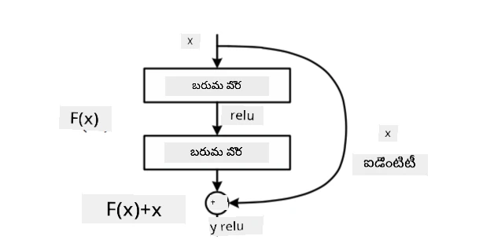
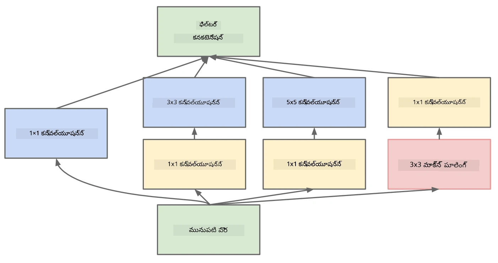

# ప్రసిద్ధి చెందిన CNN నిర్మాణాలు

### VGG-16

VGG-16 అనేది 2014లో ImageNet టాప్-5 వర్గీకరణలో 92.7% ఖచ్చితత్వాన్ని సాధించిన నెట్‌వర్క్. దీని లేయర్ నిర్మాణం ఈ విధంగా ఉంది:

మీరు చూడగలిగినట్లుగా, VGG సంప్రదాయమైన పిరమిడ్ నిర్మాణాన్ని అనుసరిస్తుంది, ఇది కన్‌వల్యూషన్-పూలింగ్ లేయర్ల శ్రేణి.

> చిత్రం [Researchgate](https://www.researchgate.net/figure/Vgg16-model-structure-To-get-the-VGG-NIN-model-we-replace-the-2-nd-4-th-6-th-7-th_fig2_335194493) నుండి

### ResNet

ResNet అనేది 2015లో Microsoft Research ప్రతిపాదించిన మోడల్స్ కుటుంబం. ResNet యొక్క ప్రధాన ఆలోచన **రెసిడ్యువల్ బ్లాక్స్** ఉపయోగించడం:

> చిత్రం [ఈ పేపర్](https://arxiv.org/pdf/1512.03385.pdf) నుండి

ఐడెంటిటీ పాస్-త్రూ ఉపయోగించే కారణం, మన లేయర్ గత లేయర్ ఫలితం మరియు రెసిడ్యువల్ బ్లాక్ అవుట్పుట్ మధ్య **తేడా**ను అంచనా వేయడం - అందుకే దీనికి *రెసిడ్యువల్* అనే పేరు. ఆ బ్లాక్స్ శిక్షణకు చాలా సులభం, మరియు వందల సంఖ్యలో బ్లాక్స్ కలిగిన నెట్‌వర్క్‌లను నిర్మించవచ్చు (సాధారణ వేరియంట్లు ResNet-52, ResNet-101, ResNet-152).

ఈ నెట్‌వర్క్‌ను డేటాసెట్‌కు అనుగుణంగా తన సంక్లిష్టతను సర్దుబాటు చేసుకునేలా కూడా భావించవచ్చు. మొదట శిక్షణ ప్రారంభంలో, వెయిట్లు చిన్నవిగా ఉంటాయి, మరియు ఎక్కువ భాగం సిగ్నల్ ఐడెంటిటీ లేయర్ల ద్వారా వెళుతుంది. శిక్షణ కొనసాగుతుండగా వెయిట్లు పెరిగి, నెట్‌వర్క్ పరామితుల ప్రాముఖ్యత పెరుగుతుంది, తద్వారా నెట్‌వర్క్ అవసరమైన వ్యక్తీకరణ శక్తిని సరిగ్గా వర్గీకరించడానికి సర్దుబాటు అవుతుంది.

### Google Inception

Google Inception నిర్మాణం ఈ ఆలోచనను మరింత ముందుకు తీసుకెళ్తుంది, ప్రతి నెట్‌వర్క్ లేయర్‌ను అనేక మార్గాల సమ్మేళనంగా నిర్మిస్తుంది:

> చిత్రం [Researchgate](https://www.researchgate.net/figure/Inception-module-with-dimension-reductions-left-and-schema-for-Inception-ResNet-v1_fig2_355547454) నుండి

ఇక్కడ, 1x1 కన్‌వల్యూషన్స్ పాత్రను ప్రత్యేకంగా గుర్తించాలి, ఎందుకంటే మొదట అవి అర్థం కాకపోవచ్చు. 1x1 ఫిల్టర్‌తో ఇమేజ్‌ను ఎందుకు స్కాన్ చేయాలి? అయితే, కన్‌వల్యూషన్ ఫిల్టర్లు అనేక డెప్త్ ఛానల్స్‌తో పనిచేస్తాయని గుర్తుంచుకోవాలి (మూలంగా - RGB రంగులు, తరువాతి లేయర్లలో - వివిధ ఫిల్టర్ల ఛానల్స్), 1x1 కన్‌వల్యూషన్ ఆ ఇన్‌పుట్ ఛానల్స్‌ను వేర్వేరు శిక్షణీయ వెయిట్లతో కలిపేందుకు ఉపయోగిస్తారు. దీన్ని ఛానల్ డైమెన్షన్‌పై డౌన్‌సాంప్లింగ్ (పూలింగ్)గా కూడా చూడవచ్చు.

ఇది గురించి [ఒక మంచి బ్లాగ్ పోస్ట్](https://medium.com/analytics-vidhya/talented-mr-1x1-comprehensive-look-at-1x1-convolution-in-deep-learning-f6b355825578) మరియు [మూల పేపర్](https://arxiv.org/pdf/1312.4400.pdf) ఉన్నాయి.

### MobileNet

MobileNet అనేది చిన్న పరిమాణం కలిగిన, మొబైల్ పరికరాలకు అనుకూలమైన మోడల్స్ కుటుంబం. మీరు వనరులు తక్కువగా ఉన్నప్పుడు, కొంత ఖచ్చితత్వం త్యాగం చేసుకోవడానికి వీటిని ఉపయోగించవచ్చు. వీటి వెనుక ప్రధాన ఆలోచన **డెప్త్‌వైజ్ సెపరబుల్ కన్‌వల్యూషన్**, ఇది కన్‌వల్యూషన్ ఫిల్టర్లను స్థల కన్‌వల్యూషన్స్ మరియు డెప్త్ ఛానల్స్‌పై 1x1 కన్‌వల్యూషన్ సమ్మేళనంగా ప్రదర్శించడానికి అనుమతిస్తుంది. ఇది పరామితుల సంఖ్యను గణనీయంగా తగ్గించి, నెట్‌వర్క్ పరిమాణాన్ని చిన్నదిగా చేస్తుంది, అలాగే తక్కువ డేటాతో శిక్షణ సులభం చేస్తుంది.

MobileNet గురించి [ఒక మంచి బ్లాగ్ పోస్ట్](https://medium.com/analytics-vidhya/image-classification-with-mobilenet-cc6fbb2cd470) ఇక్కడ ఉంది.

## ముగింపు

ఈ యూనిట్‌లో, మీరు కంప్యూటర్ విజన్ న్యూరల్ నెట్‌వర్క్స్ వెనుక ఉన్న ప్రధాన భావన - కన్‌వల్యూషనల్ నెట్‌వర్క్స్ గురించి నేర్చుకున్నారు. చిత్ర వర్గీకరణ, ఆబ్జెక్ట్ డిటెక్షన్, మరియు ఇమేజ్ జనరేషన్ నెట్‌వర్క్స్ అన్నీ CNNలపై ఆధారపడి ఉంటాయి, కేవలం ఎక్కువ లేయర్లు మరియు కొన్ని అదనపు శిక్షణ చిట్కాలతో.

## 🚀 సవాలు

సహాయక నోటుబుక్స్‌లో, ఎక్కువ ఖచ్చితత్వం సాధించడానికి సూచనలు చివరలో ఉన్నాయి. మీరు ప్రయోగాలు చేసి మరింత ఖచ్చితత్వం సాధించగలరా చూడండి.

## [పోస్ట్-లెక్చర్ క్విజ్](https://ff-quizzes.netlify.app/en/ai/quiz/14)

## సమీక్ష & స్వీయ అధ్యయనం

CNNలు సాధారణంగా కంప్యూటర్ విజన్ పనుల కోసం ఉపయోగిస్తారు, కానీ అవి స్థిర పరిమాణపు నమూనాలను వెలికి తీయడంలో మంచి పనితీరు చూపిస్తాయి. ఉదాహరణకు, మనం శబ్దాలతో పని చేస్తే, ఆడియో సిగ్నల్‌లో కొన్ని నిర్దిష్ట నమూనాలను కనుగొనడానికి CNNలను ఉపయోగించవచ్చు - ఈ సందర్భంలో ఫిల్టర్లు 1-డైమెన్షనల్ (1D-CNN) అవుతాయి. అలాగే, కొన్ని సందర్భాల్లో 3D-CNN ఉపయోగించి బహుమితీయ స్థలంలో ఫీచర్లను వెలికి తీయవచ్చు, ఉదాహరణకు వీడియోలో జరిగే కొన్ని సంఘటనలు - CNN సమయానుగుణంగా ఫీచర్ మార్పుల నమూనాలను పట్టుకోవచ్చు. CNNలతో చేయగల ఇతర పనుల గురించి సమీక్ష మరియు స్వీయ అధ్యయనం చేయండి.

## [అసైన్‌మెంట్](lab/README.md)

ఈ ల్యాబ్‌లో, మీరు వివిధ పిల్లి మరియు కుక్క జాతులను వర్గీకరించాల్సి ఉంటుంది. ఈ చిత్రాలు MNIST డేటాసెట్ కంటే క్లిష్టమైనవి మరియు పెద్ద పరిమాణంలో ఉంటాయి, అలాగే 10 కంటే ఎక్కువ తరగతులు ఉన్నాయి.

---

<!-- CO-OP TRANSLATOR DISCLAIMER START -->
**అస్పష్టత**:  
ఈ పత్రాన్ని AI అనువాద సేవ [Co-op Translator](https://github.com/Azure/co-op-translator) ఉపయోగించి అనువదించబడింది. మేము ఖచ్చితత్వానికి ప్రయత్నించినప్పటికీ, ఆటోమేటెడ్ అనువాదాల్లో పొరపాట్లు లేదా తప్పిదాలు ఉండవచ్చు. మూల పత్రం దాని స్వదేశీ భాషలోనే అధికారిక మూలంగా పరిగణించాలి. ముఖ్యమైన సమాచారానికి, ప్రొఫెషనల్ మానవ అనువాదం సిఫార్సు చేయబడుతుంది. ఈ అనువాదం వాడకంలో ఏర్పడిన ఏవైనా అపార్థాలు లేదా తప్పుదారుల కోసం మేము బాధ్యత వహించము.
<!-- CO-OP TRANSLATOR DISCLAIMER END -->