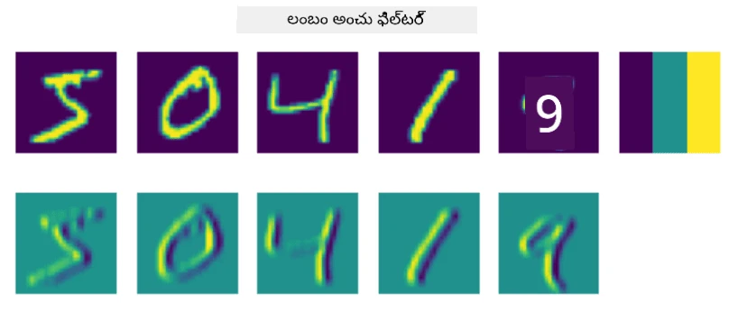
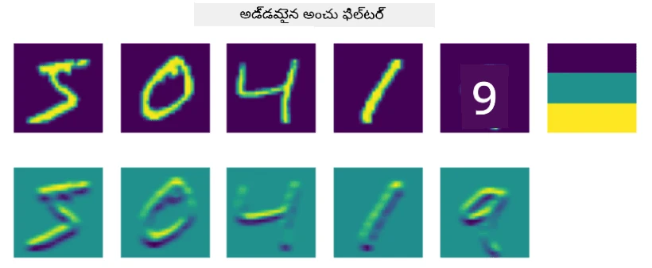
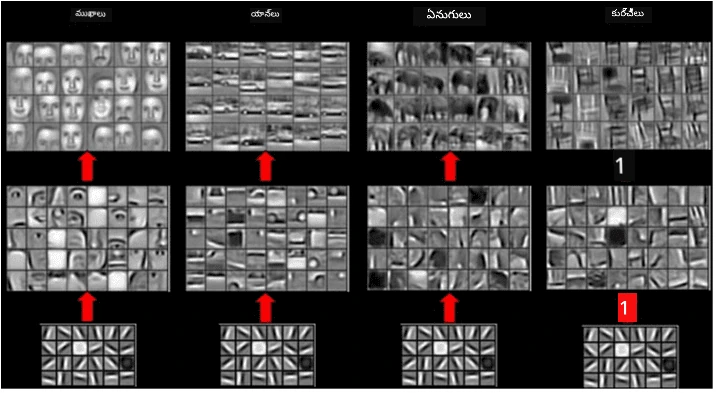
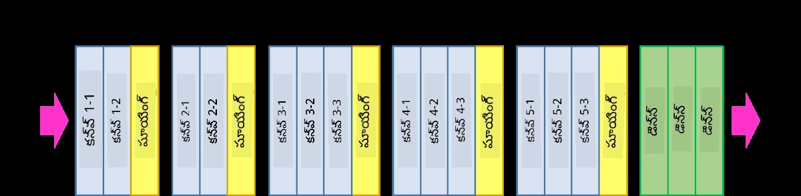
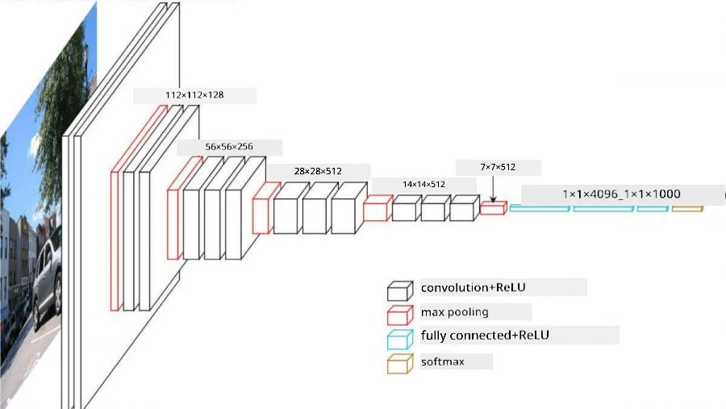

# కన్వల్యూషనల్ న్యూరల్ నెట్‌వర్క్స్

ముందుగా మనం చూశాం, న్యూరల్ నెట్‌వర్క్స్ చిత్రాలను నిర్వహించడంలో చాలా మంచి పనితీరు చూపిస్తాయి, మరియు ఒకే లేయర్ పెర్సెప్ట్రాన్ కూడా MNIST డేటాసెట్ నుండి చేతితో వ్రాసిన అంకెలను సరైన ఖచ్చితత్వంతో గుర్తించగలదు. అయితే, MNIST డేటాసెట్ చాలా ప్రత్యేకమైనది, అందులో అన్ని అంకెలు చిత్రంలో మధ్యలోనే ఉంటాయి, ఇది పనిని సులభతరం చేస్తుంది.

## [ప్రీ-లెక్చర్ క్విజ్](https://ff-quizzes.netlify.app/en/ai/quiz/13)

వాస్తవ జీవితంలో, చిత్రంలో వస్తువుల ఖచ్చితమైన స్థానం ఏదైనా ఉన్నా వాటిని గుర్తించగలగాలి. కంప్యూటర్ విజన్ సాధారణ వర్గీకరణతో భిన్నంగా ఉంటుంది, ఎందుకంటే మనం చిత్రంలో ఒక నిర్దిష్ట వస్తువును కనుగొనడానికి ప్రయత్నిస్తున్నప్పుడు, మనం కొన్ని ప్రత్యేక **నమూనాలు** మరియు వాటి సంయోజనాలను వెతుకుతుంటాము. ఉదాహరణకు, పిల్లిని వెతుకుతున్నప్పుడు, మొదట మనం ఆడవారపు గీతలు (horizontal lines) కోసం చూస్తాము, అవి మీసాలుగా ఉండవచ్చు, ఆ తర్వాత మీసాల సంయోజనం మనకు అది పిల్లి చిత్రమని చెబుతుంది. సంబంధిత స్థానం మరియు కొన్ని నమూనాల ఉనికి ముఖ్యం, కానీ వాటి ఖచ్చితమైన స్థానం ముఖ్యం కాదు.

నమూనాలను తీసుకోవడానికి, మనం **కన్వల్యూషనల్ ఫిల్టర్స్** అనే భావనను ఉపయోగిస్తాము. మీరు తెలుసుకున్నట్లుగా, చిత్రం 2D-మ్యాట్రిక్స్ లేదా రంగు లోతుతో 3D-టెన్సర్ ద్వారా ప్రాతినిధ్యం వహిస్తుంది. ఫిల్టర్ వర్తింపజేయడం అంటే, మనం తక్కువ పరిమాణం గల **ఫిల్టర్ కర్నెల్** మ్యాట్రిక్స్ తీసుకుని, అసలు చిత్రంలోని ప్రతి పిక్సెల్ కోసం పక్కనున్న పాయింట్లతో బరువు గల సగటును లెక్కించడం. దీన్ని ఒక చిన్న విండో మొత్తం చిత్రంపై స్లయిడ్ అవుతూ, ఫిల్టర్ కర్నెల్ మ్యాట్రిక్స్ లోని బరువుల ప్రకారం అన్ని పిక్సెల్స్ సగటు తీసుకోవడం లాగా చూడవచ్చు.

 | 
----|----

> చిత్రాన్ని Dmitry Soshnikov అందించారు

ఉదాహరణకు, మనం MNIST అంకెలపై 3x3 నిలువు అంచు మరియు ఆడవారపు అంచు ఫిల్టర్స్ వర్తింపజేస్తే, అసలు చిత్రంలో నిలువు మరియు ఆడవారపు అంచులు ఉన్న చోట హైలైట్స్ (ఉదా: ఎక్కువ విలువలు) పొందవచ్చు. కాబట్టి ఆ రెండు ఫిల్టర్స్ అంచులను "వెతకడానికి" ఉపయోగించవచ్చు. అలాగే, మనం ఇతర తక్కువ స్థాయి నమూనాలను వెతకడానికి వివిధ ఫిల్టర్స్ రూపొందించవచ్చు:

> [Leung-Malik ఫిల్టర్ బ్యాంక్](https://www.robots.ox.ac.uk/~vgg/research/texclass/filters.html) చిత్రం

కానీ, మనం కొన్ని నమూనాలను మానవీయంగా తీసుకునేలా ఫిల్టర్స్ రూపొందించగలిగినా, నెట్‌వర్క్‌ను అలాంటి విధంగా రూపొందించవచ్చు, అది నమూనాలను స్వయంచాలకంగా నేర్చుకుంటుంది. ఇది CNN వెనుక ఉన్న ప్రధాన ఆలోచనలలో ఒకటి.

## CNN వెనుక ప్రధాన ఆలోచనలు

CNNలు పనిచేసే విధానం ఈ క్రింది ముఖ్యమైన ఆలోచనలపై ఆధారపడి ఉంటుంది:

* కన్వల్యూషనల్ ఫిల్టర్స్ నమూనాలను తీసుకోవచ్చు
* ఫిల్టర్స్ స్వయంచాలకంగా శిక్షణ పొందేలా నెట్‌వర్క్‌ను రూపొందించవచ్చు
* అసలు చిత్రంలో మాత్రమే కాకుండా, ఉన్నత స్థాయి లక్షణాలలో కూడా నమూనాలను కనుగొనడానికి అదే విధానాన్ని ఉపయోగించవచ్చు. కాబట్టి CNN లక్షణాల తీసుకోవడం తక్కువ స్థాయి పిక్సెల్ సంయోజనాల నుండి మొదలుకొని, చిత్ర భాగాల ఉన్నత స్థాయి సంయోజనాల వరకు లక్షణాల హైరార్కీపై పనిచేస్తుంది.

> [Hislop-Lynch పేపర్](https://www.semanticscholar.org/paper/Computer-vision-based-pedestrian-trajectory-Hislop-Lynch/26e6f74853fc9bbb7487b06dc2cf095d36c9021d) నుండి చిత్రం, వారి [గవేషణ](https://dl.acm.org/doi/abs/10.1145/1553374.1553453) ఆధారంగా

## ✍️ వ్యాయామాలు: కన్వల్యూషనల్ న్యూరల్ నెట్‌వర్క్స్

కన్వల్యూషనల్ న్యూరల్ నెట్‌వర్క్స్ ఎలా పనిచేస్తాయో, మరియు శిక్షణ పొందగల ఫిల్టర్స్ ఎలా సాధించవచ్చో తెలుసుకోవడానికి, సంబంధిత నోట్‌బుక్స్ ద్వారా కొనసాగుదాం:

* [కన్వల్యూషనల్ న్యూరల్ నెట్‌వర్క్స్ - PyTorch](ConvNetsPyTorch.ipynb)
* [కన్వల్యూషనల్ న్యూరల్ నెట్‌వర్క్స్ - TensorFlow](ConvNetsTF.ipynb)

## పైరమిడ్ ఆర్కిటెక్చర్

చిత్ర ప్రాసెసింగ్ కోసం ఉపయోగించే చాలా CNNలు పైరమిడ్ ఆర్కిటెక్చర్‌ను అనుసరిస్తాయి. అసలు చిత్రాలకు వర్తింపజేసే మొదటి కన్వల్యూషనల్ లేయర్ సాధారణంగా తక్కువ సంఖ్యలో ఫిల్టర్స్ (8-16) కలిగి ఉంటుంది, ఇవి వివిధ పిక్సెల్ సంయోజనాలకు అనుగుణంగా ఉంటాయి, ఉదాహరణకు ఆడవారపు/నిలువు గీతలు. తదుపరి స్థాయిలో, నెట్‌వర్క్ యొక్క స్థల పరిమాణం తగ్గించి, ఫిల్టర్స్ సంఖ్య పెంచుతారు, ఇది సులభ లక్షణాల మరిన్ని సంయోజనాలకు అనుగుణంగా ఉంటుంది. ప్రతి లేయర్‌తో, చివరి వర్గీకరణ దిశగా పోతూ, చిత్ర స్థల పరిమాణం తగ్గి, ఫిల్టర్స్ సంఖ్య పెరుగుతుంది.

ఉదాహరణకు, 2014లో ImageNet టాప్-5 వర్గీకరణలో 92.7% ఖచ్చితత్వం సాధించిన VGG-16 ఆర్కిటెక్చర్‌ను చూద్దాం:

> [Researchgate](https://www.researchgate.net/figure/Vgg16-model-structure-To-get-the-VGG-NIN-model-we-replace-the-2-nd-4-th-6-th-7-th_fig2_335194493) నుండి చిత్రం

## ప్రసిద్ధమైన CNN ఆర్కిటెక్చర్స్

[ప్రసిద్ధమైన CNN ఆర్కిటెక్చర్స్ గురించి మీ అధ్యయనాన్ని కొనసాగించండి](CNN_Architectures.md)

---

<!-- CO-OP TRANSLATOR DISCLAIMER START -->
**అస్పష్టత**:  
ఈ డాక్యుమెంట్‌ను AI అనువాద సేవ [Co-op Translator](https://github.com/Azure/co-op-translator) ఉపయోగించి అనువదించబడింది. మేము ఖచ్చితత్వానికి ప్రయత్నించినప్పటికీ, ఆటోమేటెడ్ అనువాదాల్లో పొరపాట్లు లేదా తప్పిదాలు ఉండవచ్చు. అసలు డాక్యుమెంట్ దాని స్వదేశీ భాషలోనే అధికారిక మూలంగా పరిగణించాలి. ముఖ్యమైన సమాచారానికి, ప్రొఫెషనల్ మానవ అనువాదం సిఫార్సు చేయబడుతుంది. ఈ అనువాదం వాడకంలో ఏర్పడిన ఏవైనా అపార్థాలు లేదా తప్పుదారితీసే అర్థాలు కోసం మేము బాధ్యత వహించము.
<!-- CO-OP TRANSLATOR DISCLAIMER END -->