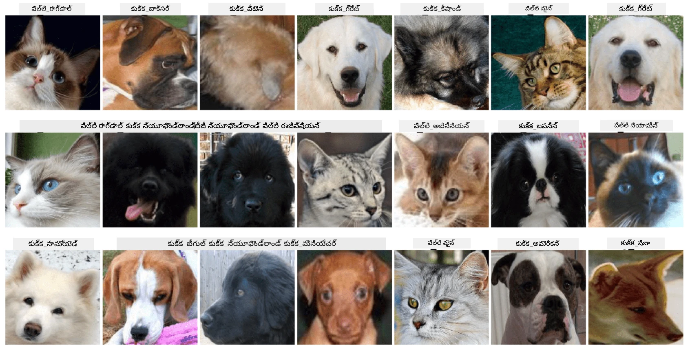

# పెట్స్ ముఖాల వర్గీకరణ

[AI for Beginners Curriculum](https://github.com/microsoft/ai-for-beginners) నుండి ల్యాబ్ అసైన్‌మెంట్.

## పని

మీరు పెట్ నర్సరీ కోసం అన్ని పెట్స్‌ను క్యాటలాగ్ చేయడానికి ఒక అప్లికేషన్ అభివృద్ధి చేయాల్సి ఉందని ఊహించుకోండి. అలాంటి అప్లికేషన్‌లో ఒక గొప్ప ఫీచర్ ఫోటో నుండి జాతిని ఆటోమేటిక్‌గా గుర్తించడం అవుతుంది. ఇది న్యూరల్ నెట్‌వర్క్‌లను ఉపయోగించి విజయవంతంగా చేయవచ్చు.

**Pet Faces** డేటాసెట్ ఉపయోగించి వివిధ జాతుల పిల్లులు మరియు కుక్కలను వర్గీకరించడానికి మీరు ఒక కన్వల్యూషనల్ న్యూరల్ నెట్‌వర్క్‌ను శిక్షణ ఇవ్వాలి.

## డేటాసెట్

మేము [Oxford-IIIT Pet Dataset](https://www.robots.ox.ac.uk/~vgg/data/pets/) ఉపయోగించబోతున్నాము, ఇది 37 వేర్వేరు జాతుల కుక్కలు మరియు పిల్లుల చిత్రాలను కలిగి ఉంది.



డేటాసెట్‌ను డౌన్లోడ్ చేసుకోవడానికి, ఈ కోడ్ స్నిపెట్ ఉపయోగించండి:

```python
!wget https://thor.robots.ox.ac.uk/~vgg/data/pets/images.tar.gz
!tar xfz images.tar.gz
!rm images.tar.gz
```

**గమనిక:** Oxford-IIIT Pet Dataset చిత్రాలు ఫైల్ పేర్ల ఆధారంగా (ఉదా: `Abyssinian_1.jpg`, `Bengal_2.jpg`) క్రమబద్ధీకరించబడ్డాయి. ఈ నోట్‌బుక్‌లో ఈ చిత్రాలను జాతి-ప్రత్యేక ఉపడైరెక్టరీలుగా క్రమబద్ధీకరించే కోడ్ ఉంది, తద్వారా వర్గీకరణ సులభం అవుతుంది.

## ప్రారంభ నోట్‌బుక్

ల్యాబ్‌ను ప్రారంభించడానికి [PetFaces.ipynb](PetFaces.ipynb) ను తెరవండి

## ముఖ్యాంశం

మీరు మొదటి నుండి చిత్ర వర్గీకరణ అనే కొంత క్లిష్టమైన సమస్యను పరిష్కరించారు! చాలా తరగతులు ఉండగా కూడా మీరు సరైన ఖచ్చితత్వాన్ని సాధించారు! కొన్ని తరగతులు మనుషులకు కూడా స్పష్టంగా వేరుగా కనిపించకపోవడం వల్ల top-k ఖచ్చితత్వాన్ని కొలవడం కూడా అర్థవంతం.

---

<!-- CO-OP TRANSLATOR DISCLAIMER START -->
**అస్పష్టత**:  
ఈ డాక్యుమెంట్‌ను AI అనువాద సేవ [Co-op Translator](https://github.com/Azure/co-op-translator) ఉపయోగించి అనువదించబడింది. మేము ఖచ్చితత్వానికి ప్రయత్నించినప్పటికీ, ఆటోమేటెడ్ అనువాదాల్లో పొరపాట్లు లేదా తప్పిదాలు ఉండవచ్చు. అసలు డాక్యుమెంట్ దాని స్వదేశీ భాషలోనే అధికారిక మూలంగా పరిగణించాలి. ముఖ్యమైన సమాచారానికి, ప్రొఫెషనల్ మానవ అనువాదం సిఫార్సు చేయబడుతుంది. ఈ అనువాదం వాడకంలో ఏర్పడిన ఏవైనా అపార్థాలు లేదా తప్పుదారితీసే అర్థాలు కోసం మేము బాధ్యత వహించము.
<!-- CO-OP TRANSLATOR DISCLAIMER END -->