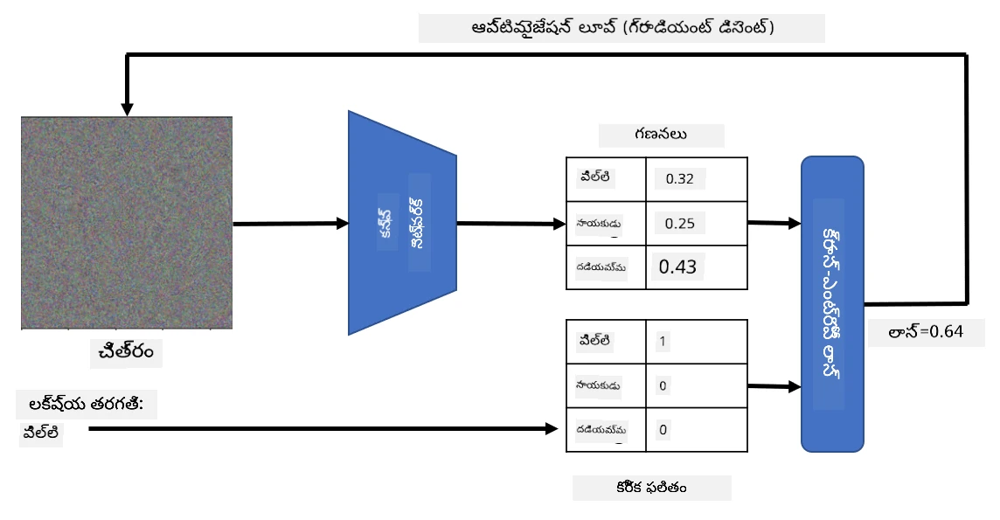

# ముందుగా శిక్షణ పొందిన నెట్‌వర్క్లు మరియు ట్రాన్స్‌ఫర్ లెర్నింగ్

CNNలను శిక్షణ ఇవ్వడం చాలా సమయం తీసుకుంటుంది, మరియు ఆ పనికి చాలా డేటా అవసరం. అయితే, ఎక్కువ సమయం నెట్‌వర్క్ చిత్రాల నుండి నమూనాలను తీసుకునే ఉత్తమ తక్కువ-స్థాయి ఫిల్టర్లను నేర్చుకోవడంలో వెచ్చుతుంది. ఒక సహజమైన ప్రశ్న వస్తుంది - ఒక డేటాసెట్‌పై శిక్షణ పొందిన న్యూరల్ నెట్‌వర్క్‌ను ఉపయోగించి, పూర్తి శిక్షణ ప్రక్రియ అవసరం లేకుండా వేరే చిత్రాలను వర్గీకరించడానికి అనుకూలపరచగలమా?

## [పూర్వ-లెక్చర్ క్విజ్](https://ff-quizzes.netlify.app/en/ai/quiz/15)

ఈ విధానం **ట్రాన్స్‌ఫర్ లెర్నింగ్** అని పిలవబడుతుంది, ఎందుకంటే మనం ఒక న్యూరల్ నెట్‌వర్క్ మోడల్ నుండి మరొకదానికి కొంత జ్ఞానం బదిలీ చేస్తాము. ట్రాన్స్‌ఫర్ లెర్నింగ్‌లో, సాధారణంగా మనం ముందుగా శిక్షణ పొందిన మోడల్‌తో ప్రారంభిస్తాము, ఇది **ImageNet** వంటి పెద్ద చిత్ర డేటాసెట్‌పై శిక్షణ పొందింది. ఆ మోడల్స్ ఇప్పటికే సాధారణ చిత్రాల నుండి వివిధ లక్షణాలను బాగా తీసుకోవడంలో నైపుణ్యం కలిగి ఉంటాయి, మరియు చాలా సందర్భాల్లో ఆ లక్షణాలపై కేవలం ఒక వర్గీకర్తను నిర్మించడం మంచి ఫలితాన్ని ఇస్తుంది.

> ✅ ట్రాన్స్‌ఫర్ లెర్నింగ్ అనేది విద్య వంటి ఇతర అకాడమిక్ రంగాలలో కూడా కనిపించే పదం. ఇది ఒక డొమైన్ నుండి జ్ఞానాన్ని తీసుకుని మరొక డొమైన్‌లో ఉపయోగించే ప్రక్రియను సూచిస్తుంది.

## ఫీచర్ ఎక్స్‌ట్రాక్టర్లుగా ముందుగా శిక్షణ పొందిన మోడల్స్

మునుపటి విభాగంలో మనం చర్చించిన కన్వల్యూషనల్ నెట్‌వర్క్లు అనేక లేయర్లను కలిగి ఉంటాయి, ప్రతి లేయర్ చిత్రం నుండి కొన్ని లక్షణాలను తీసుకోవడానికి ఉద్దేశించబడింది, తక్కువ-స్థాయి పిక్సెల్ కలయికల నుండి (ఉదాహరణకు, ఆడంబరమైన/నిలువైన రేఖ లేదా స్ట్రోక్), పై స్థాయి లక్షణాల కలయికల వరకు, ఉదాహరణకు, జ్వాల యొక్క కంటి వంటి. మనం సరిపడా పెద్ద, విభిన్నమైన సాధారణ చిత్రాల డేటాసెట్‌పై CNNను శిక్షణ ఇస్తే, నెట్‌వర్క్ ఆ సాధారణ లక్షణాలను నేర్చుకుంటుంది.

Keras మరియు PyTorch రెండింటిలోనూ సాధారణ ఆర్కిటెక్చర్లకు ముందుగా శిక్షణ పొందిన న్యూరల్ నెట్‌వర్క్ వెయిట్లను సులభంగా లోడ్ చేసుకునే ఫంక్షన్లు ఉన్నాయి, వీటిలో చాలా ImageNet చిత్రాలపై శిక్షణ పొందినవి. ఎక్కువగా ఉపయోగించే వాటిని మునుపటి పాఠం నుండి [CNN ఆర్కిటెక్చర్లు](../07-ConvNets/CNN_Architectures.md) పేజీలో వివరించారు. ముఖ్యంగా, మీరు ఈ క్రింది వాటిలో ఒకదాన్ని ఉపయోగించవచ్చు:

* **VGG-16/VGG-19** - ఇవి తక్కువ క్లిష్టత గల మోడల్స్ అయినప్పటికీ మంచి ఖచ్చితత్వాన్ని ఇస్తాయి. ట్రాన్స్‌ఫర్ లెర్నింగ్ ఎలా పనిచేస్తుందో చూడటానికి మొదటి ప్రయత్నంగా VGG ఉపయోగించడం మంచి ఎంపిక.
* **ResNet** - 2015లో Microsoft Research ప్రతిపాదించిన మోడల్స్ కుటుంబం. వీటికి ఎక్కువ లేయర్లు ఉంటాయి, అందువల్ల ఎక్కువ వనరులు అవసరం.
* **MobileNet** - చిన్న పరిమాణం గల మోడల్స్ కుటుంబం, మొబైల్ పరికరాలకు అనుకూలం. వనరులు తక్కువగా ఉన్నప్పుడు, కొంత ఖచ్చితత్వం త్యాగం చేసుకుని వీటిని ఉపయోగించవచ్చు.

ఇక్కడ VGG-16 నెట్‌వర్క్ ద్వారా పిల్లి చిత్రంలో నుండి తీసుకున్న కొన్ని ఫీచర్లు ఉన్నాయి:

## పిల్లులు vs. కుక్కల డేటాసెట్

ఈ ఉదాహరణలో, మనం [పిల్లులు మరియు కుక్కలు](https://www.microsoft.com/download/details.aspx?id=54765&WT.mc_id=academic-77998-cacaste) డేటాసెట్‌ను ఉపయోగిస్తాము, ఇది నిజ జీవిత చిత్రం వర్గీకరణ పరిస్థితికి చాలా దగ్గరగా ఉంటుంది.

## ✍️ వ్యాయామం: ట్రాన్స్‌ఫర్ లెర్నింగ్

ట్రాన్స్‌ఫర్ లెర్నింగ్‌ను క్రియాశీలంగా చూడండి సంబంధిత నోట్‌బుక్స్‌లో:

* [ట్రాన్స్‌ఫర్ లెర్నింగ్ - PyTorch](TransferLearningPyTorch.ipynb)
* [ట్రాన్స్‌ఫర్ లెర్నింగ్ - TensorFlow](TransferLearningTF.ipynb)

## ప్రత్యర్థి పిల్లి దృశ్యీకరణ

ముందుగా శిక్షణ పొందిన న్యూరల్ నెట్‌వర్క్ తన *మెదడులో* వివిధ నమూనాలను కలిగి ఉంటుంది, అందులో **ఆదర్శ పిల్లి** (అలాగే ఆదర్శ కుక్క, ఆదర్శ జెబ్రా మొదలైనవి) యొక్క భావనలు ఉంటాయి. ఈ చిత్రాన్ని ఏదో విధంగా **దృశ్యీకరించడం** ఆసక్తికరం. అయితే, ఇది సులభం కాదు, ఎందుకంటే నమూనాలు నెట్‌వర్క్ వెయిట్లలో విస్తరించి ఉంటాయి, మరియు హైరార్కికల్ నిర్మాణంలో ఉంటాయి.

మనము తీసుకోగల ఒక విధానం, యాదృచ్ఛిక చిత్రంతో ప్రారంభించి, ఆ చిత్రాన్ని **గ్రాడియెంట్ డిసెంట్ ఆప్టిమైజేషన్** సాంకేతికత ఉపయోగించి సవరించడం, తద్వారా నెట్‌వర్క్ ఆ చిత్రాన్ని పిల్లిగా భావించడం ప్రారంభిస్తుంది.

కానీ, ఇలాచేస్తే, మనం యాదృచ్ఛిక శబ్దం లాంటి దృశ్యాన్ని పొందుతాము. ఇది ఎందుకంటే *నెట్‌వర్క్ ఇన్‌పుట్ చిత్రాన్ని పిల్లిగా భావించడానికి అనేక మార్గాలు ఉన్నాయి*, వాటిలో కొన్ని దృశ్యంగా అర్థం కానివి కూడా ఉంటాయి. ఆ చిత్రాలు పిల్లికి సాధారణమైన చాలా నమూనాలను కలిగి ఉన్నప్పటికీ, అవి దృశ్యంగా ప్రత్యేకంగా ఉండాలని ఎటువంటి నియంత్రణ లేదు.

ఫలితాన్ని మెరుగుపరచడానికి, మనం లాస్ ఫంక్షన్‌లో మరో పదాన్ని చేర్చవచ్చు, దీనిని **వేరియేషన్ లాస్** అంటారు. ఇది చిత్రంలోని పొరుగువారి పిక్సెల్స్ ఎంత సమానంగా ఉన్నాయో చూపే ప్రమాణం. వేరియేషన్ లాస్‌ను తగ్గించడం ద్వారా చిత్రం మృదువుగా మారుతుంది, శబ్దం తొలగిపోతుంది - తద్వారా మరింత ఆకర్షణీయమైన నమూనాలు బయటపడతాయి. ఇక్కడ పిల్లిగా మరియు జెబ్రాగా అధిక సంభావ్యతతో వర్గీకరించబడిన "ఆదర్శ" చిత్రాల ఉదాహరణ ఉంది:

 | 
-----|-----
 *ఆదర్శ పిల్లి* | *ఆదర్శ జెబ్రా*

ఇలాంటి విధానం న్యూరల్ నెట్‌వర్క్‌పై **ప్రత్యర్థి దాడులు** చేయడానికి కూడా ఉపయోగించవచ్చు. ఒక నెట్‌వర్క్‌ను మోసం చేసి కుక్కను పిల్లిలా చూపించాలనుకుంటే, కుక్క చిత్రాన్ని తీసుకుని, అది నెట్‌వర్క్ ద్వారా కుక్కగా గుర్తించబడినప్పుడు, గ్రాడియెంట్ డిసెంట్ ఆప్టిమైజేషన్ ఉపయోగించి కొంత సవరించి, నెట్‌వర్క్ దాన్ని పిల్లిగా వర్గీకరించడం ప్రారంభించే వరకు ప్రయత్నించవచ్చు:

 | 
-----|-----
*కుక్క యొక్క అసలు చిత్రం* | *పిల్లిగా వర్గీకరించబడిన కుక్క చిత్రం*

పై ఫలితాలను పునరుత్పత్తి చేయడానికి కోడ్ ఈ నోట్‌బుక్‌లో చూడండి:

* [ఆదర్శ మరియు ప్రత్యర్థి పిల్లి - TensorFlow](AdversarialCat_TF.ipynb)

## ముగింపు

ట్రాన్స్‌ఫర్ లెర్నింగ్ ఉపయోగించి, మీరు కస్టమ్ ఆబ్జెక్ట్ వర్గీకరణ పనికి త్వరగా వర్గీకర్తను తయారు చేసి, అధిక ఖచ్చితత్వాన్ని సాధించవచ్చు. మనం ఇప్పుడు పరిష్కరించబోయే క్లిష్టమైన పనులు ఎక్కువ కంప్యూటింగ్ శక్తిని అవసరం చేస్తాయని, CPUపై సులభంగా పరిష్కరించలేమని మీరు గమనించవచ్చు. తదుపరి యూనిట్‌లో, తక్కువ కంప్యూట్ వనరులతో అదే మోడల్‌ను శిక్షణ ఇవ్వడానికి తేలికపాటి అమలును ప్రయత్నిస్తాము, ఇది కొంచెం తక్కువ ఖచ్చితత్వంతో ఉంటుంది.

## 🚀 సవాలు

సహచర నోట్‌బుక్స్‌లో, ట్రాన్స్‌ఫర్ జ్ఞానం కొంతవరకు సమానమైన శిక్షణ డేటాతో (కొత్త జాతి జంతువు వంటి) ఉత్తమంగా పనిచేస్తుందని దిగువన గమనికలు ఉన్నాయి. పూర్తిగా కొత్త రకాల చిత్రాలతో ప్రయోగాలు చేసి, మీ ట్రాన్స్‌ఫర్ జ్ఞానం మోడల్స్ ఎంత బాగా లేదా చెడుగా పనిచేస్తాయో చూడండి.

## [పోస్ట్-లెక్చర్ క్విజ్](https://ff-quizzes.netlify.app/en/ai/quiz/16)

## సమీక్ష & స్వీయ అధ్యయనం

మీ మోడల్స్ శిక్షణకు మరిన్ని మార్గాలు తెలుసుకోవడానికి [TrainingTricks.md](TrainingTricks.md) చదవండి.

## [అసైన్‌మెంట్](lab/README.md)

ఈ ప్రయోగశాలలో, మనం నిజ జీవిత [Oxford-IIIT](https://www.robots.ox.ac.uk/~vgg/data/pets/) పెట్స్ డేటాసెట్‌ను ఉపయోగించి, 35 జాతుల పిల్లులు మరియు కుక్కలతో ట్రాన్స్‌ఫర్ లెర్నింగ్ వర్గీకర్తను నిర్మిస్తాము.

---

<!-- CO-OP TRANSLATOR DISCLAIMER START -->
**అస్పష్టత**:  
ఈ పత్రాన్ని AI అనువాద సేవ [Co-op Translator](https://github.com/Azure/co-op-translator) ఉపయోగించి అనువదించబడింది. మేము ఖచ్చితత్వానికి ప్రయత్నించినప్పటికీ, ఆటోమేటెడ్ అనువాదాల్లో పొరపాట్లు లేదా తప్పిదాలు ఉండవచ్చు. మూల పత్రం దాని స్వదేశీ భాషలోనే అధికారిక మూలంగా పరిగణించాలి. ముఖ్యమైన సమాచారానికి, ప్రొఫెషనల్ మానవ అనువాదం సిఫార్సు చేయబడుతుంది. ఈ అనువాదం వాడకంలో ఏర్పడిన ఏవైనా అపార్థాలు లేదా తప్పుదారుల కోసం మేము బాధ్యత వహించము.
<!-- CO-OP TRANSLATOR DISCLAIMER END -->