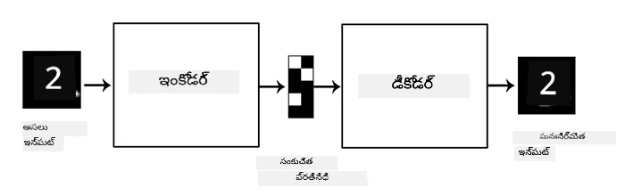
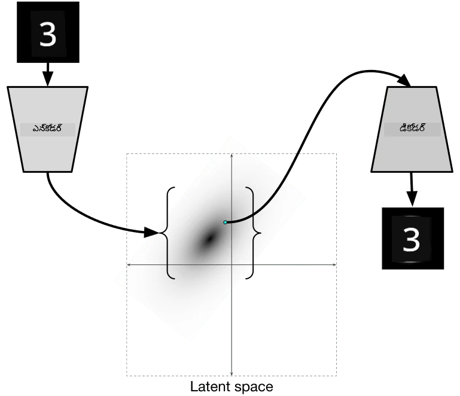

# ఆటోఎంకోడర్స్

CNNలను శిక్షణ ఇచ్చేటప్పుడు, ఒక సమస్య ఏమిటంటే మనకు చాలా లేబుల్ చేసిన డేటా అవసరం. చిత్రం వర్గీకరణ సందర్భంలో, మనం చిత్రాలను వేర్వేరు తరగతులుగా వర్గీకరించాలి, ఇది ఒక మానవీయ ప్రయత్నం.

## [పూర్వ-లెక్చర్ క్విజ్](https://ff-quizzes.netlify.app/en/ai/quiz/17)

అయితే, మనం రా (లేబుల్ చేయని) డేటాను CNN ఫీచర్ ఎక్స్‌ట్రాక్టర్ల శిక్షణకు ఉపయోగించాలనుకోవచ్చు, దీనిని **స్వీయ-పర్యవేక్షణ శిక్షణ** అంటారు. లేబుల్స్ బదులు, శిక్షణ చిత్రాలను నెట్‌వర్క్ ఇన్‌పుట్ మరియు అవుట్‌పుట్ రెండింటిగా ఉపయోగిస్తాము. **ఆటోఎంకోడర్** యొక్క ప్రధాన ఆలోచన ఏమిటంటే, మనకు ఒక **ఎంకోడర్ నెట్‌వర్క్** ఉంటుంది, ఇది ఇన్‌పుట్ చిత్రాన్ని కొన్ని **లాటెంట్ స్పేస్** (సాధారణంగా ఇది చిన్న పరిమాణం ఉన్న వెక్టర్)గా మార్చుతుంది, ఆ తర్వాత **డీకోడర్ నెట్‌వర్క్** ఉంటుంది, దీని లక్ష్యం అసలు చిత్రాన్ని పునఃసృష్టించడం.

> ✅ ఒక [ఆటోఎంకోడర్](https://wikipedia.org/wiki/Autoencoder) అనేది "లేబుల్ చేయని డేటా యొక్క సమర్థవంతమైన కోడింగ్‌లను నేర్చుకోవడానికి ఉపయోగించే ఒక రకమైన కృత్రిమ న్యూరల్ నెట్‌వర్క్."

మనం అసలు చిత్రంలోని సమాచారాన్ని ఎక్కువగా పట్టు కోవడానికి ఆటోఎంకోడర్‌ను శిక్షణ ఇస్తున్నందున, నెట్‌వర్క్ ఇన్‌పుట్ చిత్రాల అర్థాన్ని పట్టు కోవడానికి ఉత్తమ **ఎంబెడ్డింగ్**ను కనుగొనడానికి ప్రయత్నిస్తుంది.

> చిత్రం [Keras బ్లాగ్](https://blog.keras.io/building-autoencoders-in-keras.html) నుండి

## ఆటోఎంకోడర్స్ ఉపయోగించే సందర్భాలు

అసలు చిత్రాలను పునఃసృష్టించడం స్వయంగా ఉపయోగకరంగా కనిపించకపోయినా, కొన్ని సందర్భాల్లో ఆటోఎంకోడర్స్ ప్రత్యేకంగా ఉపయోగకరంగా ఉంటాయి:

* **దృశ్యీకరణ కోసం చిత్రాల పరిమాణం తగ్గించడం** లేదా **చిత్ర ఎంబెడ్డింగ్స్ శిక్షణ**. సాధారణంగా ఆటోఎంకోడర్స్ PCA కంటే మెరుగైన ఫలితాలు ఇస్తాయి, ఎందుకంటే ఇది చిత్రాల స్థలిక స్వభావం మరియు హైరార్కికల్ ఫీచర్లను పరిగణలోకి తీసుకుంటుంది.
* **డినాయిసింగ్**, అంటే చిత్రంలో నుండి శబ్దాన్ని తొలగించడం. శబ్దం అనవసరమైన సమాచారాన్ని కలిగి ఉండటంతో, ఆటోఎంకోడర్ దాన్ని చిన్న లాటెంట్ స్పేస్‌లో సరిపెట్టలేకపోతుంది, అందువల్ల ఇది చిత్రంలోని ముఖ్యమైన భాగాన్ని మాత్రమే పట్టు కోవుతుంది. డినాయిసర్‌లను శిక్షణ ఇస్తున్నప్పుడు, అసలు చిత్రాలతో ప్రారంభించి, కృత్రిమంగా శబ్దం జోడించిన చిత్రాలను ఆటోఎంకోడర్ ఇన్‌పుట్‌గా ఉపయోగిస్తాము.
* **సూపర్-రెసల్యూషన్**, అంటే చిత్ర రిజల్యూషన్ పెంచడం. మనం హై-రెసల్యూషన్ చిత్రాలతో ప్రారంభించి, తక్కువ రిజల్యూషన్ ఉన్న చిత్రాన్ని ఆటోఎంకోడర్ ఇన్‌పుట్‌గా ఉపయోగిస్తాము.
* **జనరేటివ్ మోడల్స్**. ఒకసారి ఆటోఎంకోడర్ శిక్షణ పొందిన తర్వాత, డీకోడర్ భాగాన్ని యాదృచ్ఛిక లాటెంట్ వెక్టర్ల నుండి కొత్త వస్తువులను సృష్టించడానికి ఉపయోగించవచ్చు.

## వేరియేషనల్ ఆటోఎంకోడర్స్ (VAE)

సాంప్రదాయ ఆటోఎంకోడర్స్ ఇన్‌పుట్ డేటా పరిమాణాన్ని తగ్గించి, ఇన్‌పుట్ చిత్రాల ముఖ్య ఫీచర్లను కనుగొంటాయి. అయితే, లాటెంట్ వెక్టర్లు చాలా సార్ధకంగా ఉండవు. ఉదాహరణకు, MNIST డేటాసెట్ తీసుకుంటే, వేర్వేరు లాటెంట్ వెక్టర్లకు ఏ అంకెలు సరిపోతాయో అర్థం చేసుకోవడం సులభం కాదు, ఎందుకంటే సమీప లాటెంట్ వెక్టర్లు తప్పనిసరిగా అదే అంకెలకు సరిపోవు.

మరోవైపు, *జనరేటివ్* మోడల్స్ శిక్షణకు లాటెంట్ స్పేస్ గురించి కొంత అవగాహన ఉండటం మంచిది. ఈ ఆలోచన మనల్ని **వేరియేషనల్ ఆటోఎంకోడర్** (VAE) వైపు తీసుకెళ్తుంది.

VAE అనేది లాటెంట్ పారామీటర్ల *సాంఖ్యిక పంపిణీ*ని, అంటే **లాటెంట్ పంపిణీ**ని అంచనా వేయడం నేర్చుకునే ఆటోఎంకోడర్. ఉదాహరణకు, మనం లాటెంట్ వెక్టర్లు సాధారణంగా zmean అనే సగటు మరియు zsigma అనే ప్రమాణ విభిన్నంతో (రెండూ d-పరిమాణం ఉన్న వెక్టర్లు) పంపిణీ అవ్వాలని కోరుకోవచ్చు. VAEలో ఎంకోడర్ ఆ పారామీటర్లను అంచనా వేయడం నేర్చుకుంటుంది, ఆ తర్వాత డీకోడర్ ఆ పంపిణీ నుండి యాదృచ్ఛిక వెక్టర్ తీసుకుని వస్తువును పునఃసృష్టిస్తుంది.

సారాంశంగా:

 * ఇన్‌పుట్ వెక్టర్ నుండి, మనం `z_mean` మరియు `z_log_sigma` అంచనా వేస్తాము (ప్రామాణిక విభిన్నాన్ని కాకుండా దాని లాగారిథమ్‌ను అంచనా వేస్తాము)
 * మనం N(zmean,exp(zlog_sigma)) పంపిణీ నుండి ఒక `sample` వెక్టర్‌ను సాంపిల్ చేస్తాము
 * డీకోడర్ `sample`ని ఇన్‌పుట్ వెక్టర్‌గా ఉపయోగించి అసలు చిత్రాన్ని పునఃసృష్టించడానికి ప్రయత్నిస్తుంది

 

> చిత్రం [ఈ బ్లాగ్ పోస్ట్](https://ijdykeman.github.io/ml/2016/12/21/cvae.html) నుండి, ఇసాక్ డైకెమన్

వేరియేషనల్ ఆటోఎంకోడర్స్ రెండు భాగాలైన సంక్లిష్ట లాస్ ఫంక్షన్‌ను ఉపయోగిస్తాయి:

* **పునఃసృష్టి లాస్** అనేది పునఃసృష్టించిన చిత్రం లక్ష్యానికి ఎంత దగ్గరగా ఉందో చూపించే లాస్ ఫంక్షన్ (ఇది మిన్ స్క్వేర్ ఎర్రర్, MSE కావచ్చు). ఇది సాధారణ ఆటోఎంకోడర్స్‌లో ఉపయోగించే లాస్ ఫంక్షన్‌తో సమానం.
* **KL లాస్**, ఇది లాటెంట్ వేరియబుల్ పంపిణీలు సాధారణ పంపిణీకి దగ్గరగా ఉండేలా చూసుకుంటుంది. ఇది [కుల్బాక్-లైబ్లర్ డైవర్జెన్స్](https://www.countbayesie.com/blog/2017/5/9/kullback-leibler-divergence-explained) అనే భావనపై ఆధారపడి ఉంటుంది - రెండు సాంఖ్యిక పంపిణీల సమానత్వాన్ని అంచనా వేయడానికి ఒక ప్రమాణం.

VAEల ముఖ్యమైన లాభం ఏమిటంటే, మనకు లాటెంట్ వెక్టర్లను ఎక్కడి నుండి సాంపిల్ చేయాలో తెలుసు కాబట్టి, కొత్త చిత్రాలను సులభంగా సృష్టించవచ్చు. ఉదాహరణకు, 2D లాటెంట్ వెక్టర్‌తో MNISTపై VAE శిక్షణ ఇస్తే, మనం లాటెంట్ వెక్టర్ భాగాలను మార్చి వేర్వేరు అంకెలను పొందవచ్చు:

> చిత్రం [డ్మిత్రి సోష్నికోవ్](http://soshnikov.com) ద్వారా

లాటెంట్ పారామీటర్ స్పేస్ యొక్క వేర్వేరు భాగాల నుండి లాటెంట్ వెక్టర్లను పొందడం ప్రారంభించినప్పుడు చిత్రాలు ఎలా కలిసిపోతున్నాయో గమనించండి. మనం ఈ స్పేస్‌ను 2Dలో కూడా దృశ్యీకరించవచ్చు:

 

> చిత్రం [డ్మిత్రి సోష్నికోవ్](http://soshnikov.com) ద్వారా

## ✍️ వ్యాయామాలు: ఆటోఎంకోడర్స్

ఈ సంబంధిత నోట్బుక్స్‌లో ఆటోఎంకోడర్స్ గురించి మరింత తెలుసుకోండి:

* [TensorFlowలో ఆటోఎంకోడర్స్](AutoencodersTF.ipynb)
* [PyTorchలో ఆటోఎంకోడర్స్](AutoEncodersPyTorch.ipynb)

## ఆటోఎంకోడర్స్ లక్షణాలు

* **డేటా స్పెసిఫిక్** - అవి శిక్షణ పొందిన చిత్రాల రకానికి మాత్రమే బాగా పనిచేస్తాయి. ఉదాహరణకు, మనం పుష్పాలపై సూపర్-రెసల్యూషన్ నెట్‌వర్క్ శిక్షణ ఇస్తే, అది పోర్ట్రెయిట్‌లపై బాగా పనిచేయదు. ఎందుకంటే నెట్‌వర్క్ శిక్షణ డేటాసెట్ నుండి నేర్చుకున్న ఫీచర్ల నుండి సన్నని వివరాలను తీసుకుని అధిక రిజల్యూషన్ చిత్రం ఉత్పత్తి చేస్తుంది.
* **లోసీ** - పునఃసృష్టించిన చిత్రం అసలు చిత్రంతో సమానం కాదు. లోస్ స్వభావం శిక్షణ సమయంలో ఉపయోగించే *లోస్ ఫంక్షన్* ద్వారా నిర్వచించబడుతుంది.
* **లేబుల్ చేయని డేటాపై పనిచేస్తుంది**

## [పోస్ట్-లెక్చర్ క్విజ్](https://ff-quizzes.netlify.app/en/ai/quiz/18)

## ముగింపు

ఈ పాఠంలో, మీరు AI శాస్త్రవేత్తకు అందుబాటులో ఉన్న వివిధ రకాల ఆటోఎంకోడర్స్ గురించి తెలుసుకున్నారు. వాటిని ఎలా నిర్మించాలో, చిత్రాలను పునఃసృష్టించడానికి వాటిని ఎలా ఉపయోగించాలో నేర్చుకున్నారు. మీరు VAE గురించి మరియు దానిని కొత్త చిత్రాలను సృష్టించడానికి ఎలా ఉపయోగించాలో కూడా తెలుసుకున్నారు.

## 🚀 సవాలు

ఈ పాఠంలో, మీరు చిత్రాల కోసం ఆటోఎంకోడర్స్ ఉపయోగించడం గురించి నేర్చుకున్నారు. కానీ అవి సంగీతం కోసం కూడా ఉపయోగించవచ్చు! Magenta ప్రాజెక్ట్ యొక్క [MusicVAE](https://magenta.tensorflow.org/music-vae) ప్రాజెక్ట్‌ను చూడండి, ఇది ఆటోఎంకోడర్స్ ఉపయోగించి సంగీతాన్ని పునఃసృష్టించడం నేర్చుకుంటుంది. ఈ లైబ్రరీతో కొన్ని [ప్రయోగాలు](https://colab.research.google.com/github/magenta/magenta-demos/blob/master/colab-notebooks/Multitrack_MusicVAE.ipynb) చేయండి, మీరు ఏమి సృష్టించగలరో చూడండి.

## [పోస్ట్-లెక్చర్ క్విజ్](https://ff-quizzes.netlify.app/en/ai/quiz/16)

## సమీక్ష & స్వీయ అధ్యయనం

సూచన కోసం, ఈ వనరులలో ఆటోఎంకోడర్స్ గురించి మరింత చదవండి:

* [Kerasలో ఆటోఎంకోడర్స్ నిర్మాణం](https://blog.keras.io/building-autoencoders-in-keras.html)
* [NeuroHiveలో బ్లాగ్ పోస్ట్](https://neurohive.io/ru/osnovy-data-science/variacionnyj-avtojenkoder-vae/)
* [వేరియేషనల్ ఆటోఎంకోడర్స్ వివరణ](https://kvfrans.com/variational-autoencoders-explained/)
* [కండిషనల్ వేరియేషనల్ ఆటోఎంకోడర్స్](https://ijdykeman.github.io/ml/2016/12/21/cvae.html)

## అసైన్‌మెంట్

[Tensoflow ఉపయోగించి ఈ నోట్బుక్](AutoencodersTF.ipynb) చివరలో, మీరు ఒక 'టాస్క్' కనుగొంటారు - దీన్ని మీ అసైన్‌మెంట్‌గా ఉపయోగించండి.

---

<!-- CO-OP TRANSLATOR DISCLAIMER START -->
**అస్పష్టత**:  
ఈ పత్రాన్ని AI అనువాద సేవ [Co-op Translator](https://github.com/Azure/co-op-translator) ఉపయోగించి అనువదించబడింది. మేము ఖచ్చితత్వానికి ప్రయత్నించినప్పటికీ, ఆటోమేటెడ్ అనువాదాల్లో పొరపాట్లు లేదా తప్పిదాలు ఉండవచ్చు. మూల పత్రం దాని స్వదేశీ భాషలోనే అధికారిక మూలంగా పరిగణించాలి. ముఖ్యమైన సమాచారానికి, ప్రొఫెషనల్ మానవ అనువాదం చేయించుకోవడం మంచిది. ఈ అనువాదం వలన కలిగే ఏవైనా అపార్థాలు లేదా తప్పుదారుల బాధ్యత మేము తీసుకోము.
<!-- CO-OP TRANSLATOR DISCLAIMER END -->