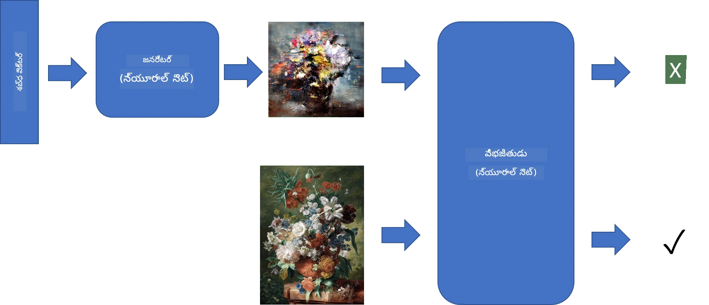
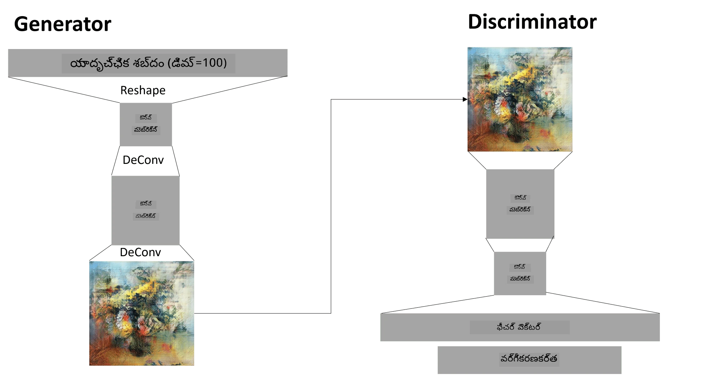

# జనరేటివ్ అడ్వర్సరియల్ నెట్‌వర్క్స్

మునుపటి విభాగంలో, మనం **జనరేటివ్ మోడల్స్** గురించి నేర్చుకున్నాము: శిక్షణ డేటాసెట్‌లోని చిత్రాలకు సమానమైన కొత్త చిత్రాలను సృష్టించగల మోడల్స్. VAE ఒక మంచి ఉదాహరణ.

## [పూర్వ-లెక్చర్ క్విజ్](https://ff-quizzes.netlify.app/en/ai/quiz/19)

కానీ, మనం వాస్తవానికి అర్థవంతమైన, సరైన రిజల్యూషన్‌లో పెయింటింగ్ వంటి దాన్ని సృష్టించాలనుకుంటే, VAEతో శిక్షణ బాగా కుదరదు. ఈ సందర్భంలో, ప్రత్యేకంగా జనరేటివ్ మోడల్స్ కోసం రూపొందించిన మరో ఆర్కిటెక్చర్ గురించి తెలుసుకోవాలి - **జనరేటివ్ అడ్వర్సరియల్ నెట్‌వర్క్స్**, లేదా GANs.

GAN యొక్క ప్రధాన ఆలోచన రెండు న్యూరల్ నెట్‌వర్క్స్‌ను ఒకదానితో ఒకటి పోటీగా శిక్షణ ఇవ్వడం:

> చిత్రం: [Dmitry Soshnikov](http://soshnikov.com)

> ✅ కొంత పదజాలం:
> * **జనరేటర్** అనేది ఒక నెట్‌వర్క్, ఇది కొంత యాదృచ్ఛిక వెక్టర్ తీసుకుని, దాని ఫలితంగా చిత్రం ఉత్పత్తి చేస్తుంది
> * **డిస్క్రిమినేటర్** అనేది ఒక నెట్‌వర్క్, ఇది ఒక చిత్రాన్ని తీసుకుని, అది నిజమైన చిత్రం (శిక్షణ డేటాసెట్ నుండి) కాదా లేదా జనరేటర్ ద్వారా ఉత్పత్తి చేయబడిందా అని చెప్పాలి. ఇది ప్రాథమికంగా ఒక చిత్రం వర్గీకరణ నెట్‌వర్క్.

### డిస్క్రిమినేటర్

డిస్క్రిమినేటర్ ఆర్కిటెక్చర్ సాధారణ చిత్రం వర్గీకరణ నెట్‌వర్క్ నుండి భిన్నంగా ఉండదు. సులభమైన సందర్భంలో ఇది పూర్తిగా కనెక్ట్ అయిన వర్గీకరణ నెట్‌వర్క్ కావచ్చు, కానీ ఎక్కువగా ఇది [కన్వల్యూషనల్ నెట్‌వర్క్](../07-ConvNets/README.md) అవుతుంది.

> ✅ కన్వల్యూషనల్ నెట్‌వర్క్ ఆధారిత GAN ను [DCGAN](https://arxiv.org/pdf/1511.06434.pdf) అంటారు

CNN డిస్క్రిమినేటర్ లో ఈ క్రింది లేయర్లు ఉంటాయి: అనేక కన్వల్యూషన్లు+పూలింగ్‌లు (స్థల పరిమాణం తగ్గుతూ), మరియు ఒకటి లేదా అంతకంటే ఎక్కువ పూర్తిగా కనెక్ట్ అయిన లేయర్లు "ఫీచర్ వెక్టర్" కోసం, చివరగా ద్విభాగ వర్గీకరణ.

> ✅ ఇక్కడ 'పూలింగ్' అనేది చిత్ర పరిమాణాన్ని తగ్గించే సాంకేతికత. "పూలింగ్ లేయర్లు ఒక లేయర్‌లోని న్యూరాన్ క్లస్టర్ల అవుట్పుట్‌లను కలిపి తదుపరి లేయర్‌లో ఒకే న్యూరాన్‌గా మార్చి డేటా పరిమాణాన్ని తగ్గిస్తాయి." - [మూలం](https://wikipedia.org/wiki/Convolutional_neural_network#Pooling_layers)

### జనరేటర్

జనరేటర్ కొంచెం క్లిష్టమైనది. దీన్ని డిస్క్రిమినేటర్ యొక్క రివర్స్‌గా భావించవచ్చు. లాటెంట్ వెక్టర్ (ఫీచర్ వెక్టర్ స్థానంలో) నుండి ప్రారంభించి, అవసరమైన పరిమాణం/ఆకారానికి మార్చే పూర్తిగా కనెక్ట్ అయిన లేయర్, తరువాత డీకన్వల్యూషన్లు+అప్స్కేలింగ్ ఉంటాయి. ఇది [ఆటోఎంకోడర్](../09-Autoencoders/README.md) యొక్క డీకోడర్ భాగానికి సమానంగా ఉంటుంది.

> ✅ కన్వల్యూషన్ లేయర్ చిత్రం మీద లీనియర్ ఫిల్టర్ లాగా అమలు కావడంతో, డీకన్వల్యూషన్ కూడా కన్వల్యూషన్ లాగా ఉంటుంది మరియు అదే లేయర్ లాజిక్ ఉపయోగించి అమలు చేయవచ్చు.

> చిత్రం: [Dmitry Soshnikov](http://soshnikov.com)

### GAN శిక్షణ

GANs ను **అడ్వర్సరియల్** అంటారు ఎందుకంటే జనరేటర్ మరియు డిస్క్రిమినేటర్ మధ్య నిరంతర పోటీ ఉంటుంది. ఈ పోటీలో, రెండు నెట్‌వర్క్స్ మెరుగుపడతాయి, అందువల్ల నెట్‌వర్క్ మెరుగైన చిత్రాలను ఉత్పత్తి చేయడం నేర్చుకుంటుంది.

శిక్షణ రెండు దశల్లో జరుగుతుంది:

* **డిస్క్రిమినేటర్ శిక్షణ**. ఇది సులభం: జనరేటర్ ద్వారా చిత్రాల బ్యాచ్ ఉత్పత్తి చేసి, వాటిని 0 (నకిలీ చిత్రం) గా లేబుల్ చేస్తాము, మరియు ఇన్‌పుట్ డేటాసెట్ నుండి నిజమైన చిత్రాల బ్యాచ్ తీసుకుని వాటిని 1 (నిజమైన చిత్రం) గా లేబుల్ చేస్తాము. డిస్క్రిమినేటర్ నష్టాన్ని పొందిన తర్వాత బ్యాక్‌ప్రొపగేషన్ చేస్తాము.
* **జనరేటర్ శిక్షణ**. ఇది కొంచెం క్లిష్టం, ఎందుకంటే జనరేటర్ కోసం ప్రత్యక్షంగా ఆశించిన అవుట్పుట్ తెలియదు. మొత్తం GAN నెట్‌వర్క్ (జనరేటర్ + డిస్క్రిమినేటర్) తీసుకుని, కొంత యాదృచ్ఛిక వెక్టర్లను ఇస్తాము, ఫలితం 1 (నిజమైన చిత్రం) కావాలని ఆశిస్తాము. ఆ తర్వాత డిస్క్రిమినేటర్ పరామితులను ఫ్రీజ్ చేసి (ఈ దశలో దాన్ని శిక్షణ ఇవ్వకూడదు), బ్యాక్‌ప్రొపగేషన్ చేస్తాము.

ఈ ప్రక్రియలో, జనరేటర్ మరియు డిస్క్రిమినేటర్ నష్టాలు పెద్దగా తగ్గవు. సరిగా ఉంటే, అవి ఊగుతూ ఉంటాయి, అంటే రెండు నెట్‌వర్క్స్ తమ పనితీరును మెరుగుపరుస్తున్నాయి.

## ✍️ వ్యాయామాలు: GANs

* [TensorFlow/Keras లో GAN నోట్బుక్](GANTF.ipynb)
* [PyTorch లో GAN నోట్బుక్](GANPyTorch.ipynb)

### GAN శిక్షణలో సమస్యలు

GANs శిక్షణ చాలా కష్టమైనది. కొన్ని సమస్యలు:

* **మోడ్ కాలాప్స్**. దీని అర్థం జనరేటర్ ఒకే ఒక విజయం సాధించిన చిత్రాన్ని మాత్రమే ఉత్పత్తి చేయడం, వివిధ రకాల చిత్రాలను కాదు.
* **హైపర్‌పరామీటర్లపై సున్నితత్వం**. GAN కుదరదు అనిపించి, తర్వాత అకస్మాత్తుగా లెర్నింగ్ రేట్ తగ్గి కుదరడం.
* జనరేటర్ మరియు డిస్క్రిమినేటర్ మధ్య **సమతుల్యత**. చాలా సందర్భాల్లో డిస్క్రిమినేటర్ నష్టం త్వరగా 0కి చేరుతుంది, దాంతో జనరేటర్ మరింత శిక్షణ పొందలేకపోతుంది. దీన్ని అధిగమించడానికి, జనరేటర్ మరియు డిస్క్రిమినేటర్ కోసం వేర్వేరు లెర్నింగ్ రేట్లు పెట్టడం లేదా డిస్క్రిమినేటర్ నష్టం చాలా తక్కువ అయితే దాని శిక్షణను వదిలివేయడం చేయవచ్చు.
* **అధిక రిజల్యూషన్ శిక్షణ**. ఆటోఎంకోడర్లతో ఉన్న సమస్యలతో సమానంగా, కన్వల్యూషనల్ నెట్‌వర్క్ యొక్క చాలా లేయర్లను పునర్నిర్మించడంలో ఆర్టిఫాక్ట్స్ వస్తాయి. దీన్ని సాధారణంగా **ప్రోగ్రెసివ్ గ్రోయింగ్** ద్వారా పరిష్కరిస్తారు, మొదట తక్కువ రిజల్యూషన్ చిత్రాలపై కొన్ని లేయర్లు శిక్షణ పొందుతాయి, తరువాత లేయర్లు "అన్‌బ్లాక్" చేయబడతాయి లేదా జోడించబడతాయి. మరో పరిష్కారం లేయర్ల మధ్య అదనపు కనెక్షన్లు జోడించి, ఒకేసారి అనేక రిజల్యూషన్లపై శిక్షణ ఇవ్వడం - వివరాలకు ఈ [మల్టీ-స్కేల్ గ్రేడియంట్ GANs పేపర్](https://arxiv.org/abs/1903.06048) చూడండి.

## స్టైల్ ట్రాన్స్‌ఫర్

GANs కళాత్మక చిత్రాలను సృష్టించడానికి అద్భుతమైన మార్గం. మరో ఆసక్తికర సాంకేతికత **స్టైల్ ట్రాన్స్‌ఫర్**, ఇది ఒక **కంటెంట్ చిత్రం** తీసుకుని, దాన్ని వేరే శైలిలో పునఃరూపకల్పన చేస్తుంది, **స్టైల్ చిత్రం** నుండి ఫిల్టర్లు వర్తింపజేస్తుంది.

ఇది ఇలా పనిచేస్తుంది:
* మనం యాదృచ్ఛిక శబ్ద చిత్రం (లేదా కంటెంట్ చిత్రం, కానీ అర్థం చేసుకోవడానికి యాదృచ్ఛిక శబ్దం మొదలుపెట్టడం సులభం) తో ప్రారంభిస్తాము
* మన లక్ష్యం ఇలాంటి చిత్రం సృష్టించడం, ఇది కంటెంట్ చిత్రం మరియు స్టైల్ చిత్రానికి రెండింటికీ దగ్గరగా ఉంటుంది. ఇది రెండు నష్ట ఫంక్షన్ల ద్వారా నిర్ణయించబడుతుంది:
   - **కంటెంట్ నష్టం** ప్రస్తుత చిత్రం మరియు కంటెంట్ చిత్రం నుండి CNN ద్వారా కొన్ని లేయర్లలో తీసుకున్న ఫీచర్ల ఆధారంగా లెక్కించబడుతుంది
   - **స్టైల్ నష్టం** ప్రస్తుత చిత్రం మరియు స్టైల్ చిత్రం మధ్య గ్రామ్ మ్యాట్రిసెస్ ఉపయోగించి తెలివిగా లెక్కించబడుతుంది (మరింత వివరాలు [ఉదాహరణ నోట్బుక్](StyleTransfer.ipynb) లో)
* చిత్రాన్ని మృదువుగా చేసి శబ్దాన్ని తొలగించడానికి, **వేరియేషన్ నష్టం** కూడా పరిచయం చేస్తాము, ఇది పొరుగువారి పిక్సెల్స్ మధ్య సగటు దూరాన్ని లెక్కిస్తుంది
* ప్రధాన ఆప్టిమైజేషన్ లూప్ ప్రస్తుత చిత్రాన్ని గ్రేడియంట్ డిసెంట్ (లేదా ఇతర ఆప్టిమైజేషన్ అల్గోరిథం) ఉపయోగించి సవరించి మొత్తం నష్టాన్ని తగ్గిస్తుంది, ఇది మూడు నష్టాల బరువు కలిగిన సమ్మేళనం.

## ✍️ ఉదాహరణ: [స్టైల్ ట్రాన్స్‌ఫర్](StyleTransfer.ipynb)

## [పోస్ట్-లెక్చర్ క్విజ్](https://ff-quizzes.netlify.app/en/ai/quiz/20)

## ముగింపు

ఈ పాఠంలో, మీరు GANs గురించి మరియు వాటిని ఎలా శిక్షణ ఇవ్వాలో నేర్చుకున్నారు. ఈ రకమైన న్యూరల్ నెట్‌వర్క్ ఎదుర్కొనే ప్రత్యేక సవాళ్లను మరియు వాటిని అధిగమించే కొన్ని వ్యూహాలను కూడా తెలుసుకున్నారు.

## 🚀 సవాలు

మీ స్వంత చిత్రాలతో [స్టైల్ ట్రాన్స్‌ఫర్ నోట్బుక్](StyleTransfer.ipynb) ను అమలు చేయండి.

## సమీక్ష & స్వీయ అధ్యయనం

సూచన కోసం, GANs గురించి ఈ వనరులు చదవండి:

* Marco Pasini, [10 Lessons I Learned Training GANs for one Year](https://towardsdatascience.com/10-lessons-i-learned-training-generative-adversarial-networks-gans-for-a-year-c9071159628)
* [StyleGAN](https://en.wikipedia.org/wiki/StyleGAN), ఒక *de facto* GAN ఆర్కిటెక్చర్
* [Azure ML పై GANs ఉపయోగించి జనరేటివ్ ఆర్ట్ సృష్టించడం](https://soshnikov.com/scienceart/creating-generative-art-using-gan-on-azureml/)

## అసైన్‌మెంట్

ఈ పాఠానికి సంబంధించిన రెండు నోట్బుక్స్‌లో ఒకదాన్ని తిరిగి సందర్శించి, GAN ను మీ స్వంత చిత్రాలపై మళ్లీ శిక్షణ ఇవ్వండి. మీరు ఏమి సృష్టించగలరు?

---

<!-- CO-OP TRANSLATOR DISCLAIMER START -->
**అస్పష్టత**:  
ఈ పత్రాన్ని AI అనువాద సేవ [Co-op Translator](https://github.com/Azure/co-op-translator) ఉపయోగించి అనువదించబడింది. మేము ఖచ్చితత్వానికి ప్రయత్నించినప్పటికీ, ఆటోమేటెడ్ అనువాదాల్లో పొరపాట్లు లేదా తప్పిదాలు ఉండవచ్చు. మూల పత్రం దాని స్వదేశీ భాషలో అధికారిక మూలంగా పరిగణించాలి. ముఖ్యమైన సమాచారానికి, ప్రొఫెషనల్ మానవ అనువాదం సిఫార్సు చేయబడుతుంది. ఈ అనువాదం వాడకంలో ఏర్పడిన ఏవైనా అపార్థాలు లేదా తప్పుదారితీసే అర్థాలు కోసం మేము బాధ్యత వహించము.
<!-- CO-OP TRANSLATOR DISCLAIMER END -->