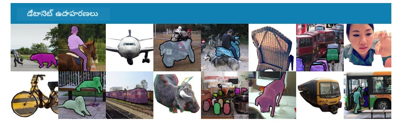
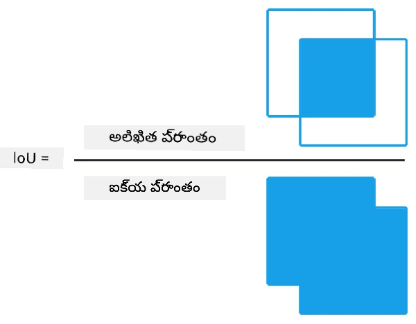
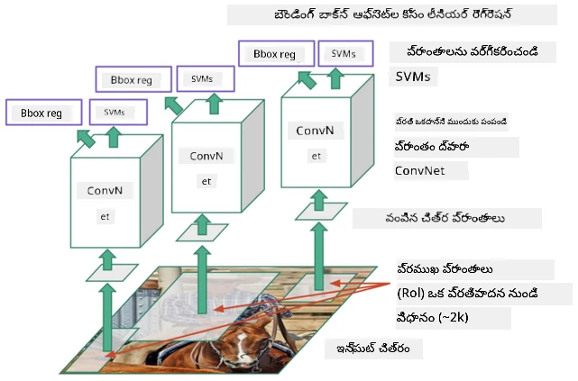
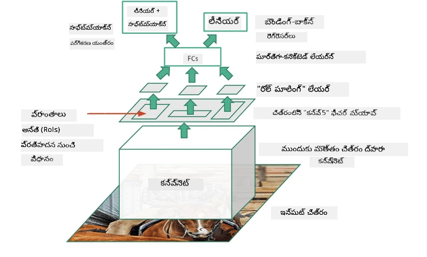
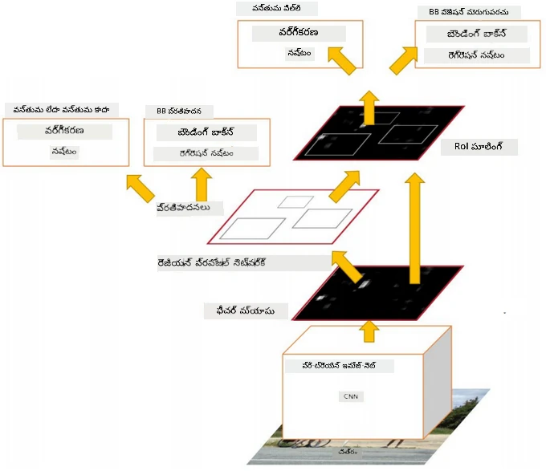
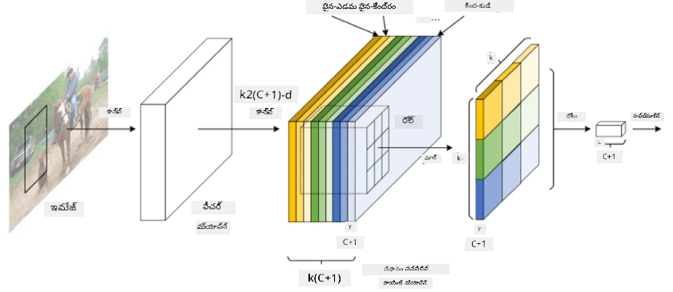
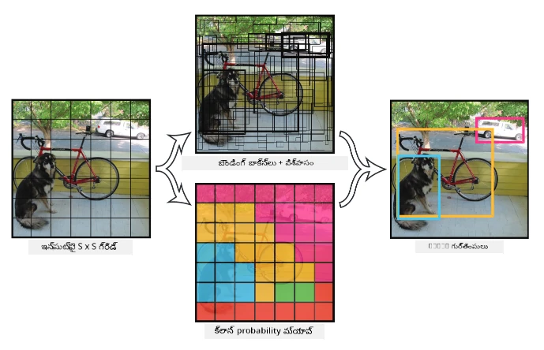

# ఆబ్జెక్ట్ డిటెక్షన్

ఇప్పటివరకు మనం చూసిన ఇమేజ్ క్లాసిఫికేషన్ మోడల్స్ ఒక చిత్రాన్ని తీసుకుని, ఉదాహరణకు MNIST సమస్యలో 'నంబర్' అనే క్లాస్ వంటి వర్గీకరణ ఫలితాన్ని ఉత్పత్తి చేసేవి. అయితే, చాలా సందర్భాల్లో మనం కేవలం ఒక చిత్రం వస్తువులను చూపిస్తుందని తెలుసుకోవడం కాకుండా, వాటి ఖచ్చితమైన స్థానం కూడా తెలుసుకోవాలనుకుంటాము. ఇదే **ఆబ్జెక్ట్ డిటెక్షన్** యొక్క ముఖ్య ఉద్దేశ్యం.

## [ప్రీ-లెక్చర్ క్విజ్](https://ff-quizzes.netlify.app/en/ai/quiz/21)

> చిత్రం [YOLO v2 వెబ్ సైట్](https://pjreddie.com/darknet/yolov2/) నుండి

## ఆబ్జెక్ట్ డిటెక్షన్‌కు ఒక సాదాసీదా విధానం

ఒక చిత్రంలో పిల్లిని కనుగొనాలనుకుంటే, ఆబ్జెక్ట్ డిటెక్షన్‌కు చాలా సాదాసీదా విధానం ఇలా ఉంటుంది:

1. చిత్రాన్ని అనేక టైల్స్‌గా విభజించండి
2. ప్రతి టైల్స్‌పై ఇమేజ్ క్లాసిఫికేషన్ నడపండి.
3. తగినంతగా అధిక యాక్టివేషన్ ఉన్న టైల్స్ ఆ వస్తువు ఉన్నట్లు భావించవచ్చు.

> *చిత్రం [Exercise Notebook](ObjectDetection-TF.ipynb) నుండి*

కానీ, ఈ విధానం సరైనది కాదు, ఎందుకంటే ఇది ఆబ్జెక్ట్ యొక్క బౌండింగ్ బాక్స్‌ను చాలా అస్పష్టంగా మాత్రమే గుర్తించగలదు. ఖచ్చితమైన స్థానం కోసం, బౌండింగ్ బాక్స్ కోఆర్డినేట్లను అంచనా వేయడానికి ఒక రకమైన **రెగ్రెషన్** అవసరం - దానికి ప్రత్యేక డేటాసెట్లు అవసరం.

## ఆబ్జెక్ట్ డిటెక్షన్ కోసం రెగ్రెషన్

[ఈ బ్లాగ్ పోస్ట్](https://towardsdatascience.com/object-detection-with-neural-networks-a4e2c46b4491) ఆకారాలను గుర్తించడంపై మంచి పరిచయాన్ని అందిస్తుంది.

## ఆబ్జెక్ట్ డిటెక్షన్ కోసం డేటాసెట్లు

ఈ పనికి మీరు ఈ క్రింది డేటాసెట్లను చూడవచ్చు:

* [PASCAL VOC](http://host.robots.ox.ac.uk/pascal/VOC/) - 20 తరగతులు
* [COCO](http://cocodataset.org/#home) - Common Objects in Context. 80 తరగతులు, బౌండింగ్ బాక్స్‌లు మరియు సెగ్మెంటేషన్ మాస్కులు

## ఆబ్జెక్ట్ డిటెక్షన్ మెట్రిక్స్

### ఇంటర్సెక్షన్ ఓవర్ యూనియన్

ఇమేజ్ క్లాసిఫికేషన్‌లో అల్గోరిథం ఎంత బాగా పనిచేస్తుందో కొలవడం సులభం, కానీ ఆబ్జెక్ట్ డిటెక్షన్‌లో క్లాస్ సరైనదా మరియు అంచనా వేయబడిన బౌండింగ్ బాక్స్ స్థానం ఎంత ఖచ్చితమో రెండింటినీ కొలవాలి. రెండవదానికి, మనం **ఇంటర్సెక్షన్ ఓవర్ యూనియన్** (IoU) అనే ప్రమాణాన్ని ఉపయోగిస్తాము, ఇది రెండు బాక్స్‌లు (లేదా ఏదైనా రెండు ప్రాంతాలు) ఎంత overlap అవుతాయో కొలుస్తుంది.

> *చిత్రం [ఈ అద్భుతమైన IoU బ్లాగ్ పోస్ట్](https://pyimagesearch.com/2016/11/07/intersection-over-union-iou-for-object-detection/) నుండి*

సూత్రం సులభం - రెండు ఆకారాల మధ్య ఇంటర్సెక్షన్ ప్రాంతాన్ని వారి యూనియన్ ప్రాంతంతో భాగిస్తాము. రెండు సమాన ప్రాంతాల కోసం IoU విలువ 1 అవుతుంది, పూర్తిగా వేరే ప్రాంతాల కోసం 0 అవుతుంది. మిగతా సందర్భాల్లో 0 నుండి 1 మధ్య ఉంటుంది. సాధారణంగా మనం IoU ఒక నిర్దిష్ట విలువ కంటే ఎక్కువ ఉన్న బౌండింగ్ బాక్స్‌లను మాత్రమే పరిగణిస్తాము.

### సగటు ప్రిసిషన్

ఒక నిర్దిష్ట వస్తువు తరగతి $C$ ఎంత బాగా గుర్తించబడిందో కొలవాలనుకుంటే, మనం **సగటు ప్రిసిషన్** (Average Precision) మెట్రిక్‌ను ఉపయోగిస్తాము, ఇది ఇలా లెక్కించబడుతుంది:

1. ప్రిసిషన్-రికాల్ వక్రం (Precision-Recall curve) డిటెక్షన్ థ్రెషోల్డ్ విలువ (0 నుండి 1 వరకు) ఆధారంగా ఖచ్చితత్వాన్ని చూపుతుంది.
2. థ్రెషోల్డ్ ఆధారంగా, చిత్రంలో ఎక్కువ లేదా తక్కువ వస్తువులు గుర్తించబడతాయి, మరియు ప్రిసిషన్, రికాల్ విలువలు మారుతాయి.
3. వక్రం ఇలా ఉంటుంది:

> *చిత్రం [NeuroWorkshop](http://github.com/shwars/NeuroWorkshop) నుండి*

ఒక క్లాస్ $C$ కోసం సగటు ప్రిసిషన్ అనేది ఈ వక్రం క్రింద ఉన్న ప్రాంతం. మరింత ఖచ్చితంగా చెప్పాలంటే, రికాల్ అక్షం సాధారణంగా 10 భాగాలుగా విభజించబడుతుంది, మరియు ఆ పాయింట్లపై ప్రిసిషన్ సగటు తీసుకుంటారు:

$$
AP = {1\over11}\sum_{i=0}^{10}\mbox{Precision}(\mbox{Recall}={i\over10})
$$

### AP మరియు IoU

మనం IoU ఒక నిర్దిష్ట విలువ కంటే ఎక్కువ ఉన్న డిటెక్షన్లను మాత్రమే పరిగణిస్తాము. ఉదాహరణకు, PASCAL VOC డేటాసెట్‌లో సాధారణంగా $\mbox{IoU Threshold} = 0.5$ అనుకుంటారు, COCOలో AP వివిధ $\mbox{IoU Threshold}$ విలువల కోసం కొలుస్తారు.

> *చిత్రం [NeuroWorkshop](http://github.com/shwars/NeuroWorkshop) నుండి*

### సగటు సగటు ప్రిసిషన్ - mAP

ఆబ్జెక్ట్ డిటెక్షన్ కోసం ప్రధాన మెట్రిక్ **Mean Average Precision** లేదా **mAP** అని పిలవబడుతుంది. ఇది అన్ని వస్తువు తరగతులపై సగటుగా తీసుకున్న సగటు ప్రిసిషన్ విలువ, మరియు కొన్నిసార్లు $\mbox{IoU Threshold}$ పై కూడా సగటు తీసుకుంటారు. మరింత వివరంగా, **mAP** లెక్కింపు ప్రక్రియను [ఈ బ్లాగ్ పోస్ట్](https://medium.com/@timothycarlen/understanding-the-map-evaluation-metric-for-object-detection-a07fe6962cf3))లో మరియు [కోడ్ నమూనాలతో ఇక్కడ](https://gist.github.com/tarlen5/008809c3decf19313de216b9208f3734) చూడవచ్చు.

## వివిధ ఆబ్జెక్ట్ డిటెక్షన్ విధానాలు

ఆబ్జెక్ట్ డిటెక్షన్ అల్గోరిథమ్స్ రెండు ప్రధాన తరగతులుగా ఉంటాయి:

* **Region Proposal Networks** (R-CNN, Fast R-CNN, Faster R-CNN). ప్రధాన ఆలోచన **Regions of Interests** (ROI) సృష్టించి, వాటిపై CNN నడిపించి గరిష్ట యాక్టివేషన్ కోసం చూడటం. ఇది సాదాసీదా విధానానికి సమానంగా ఉంటుంది, కానీ ROIs మరింత తెలివైన విధంగా సృష్టిస్తారు. ఇలాంటి పద్ధతుల ప్రధాన లోపం అవి నెమ్మదిగా ఉండటం, ఎందుకంటే చిత్రంపై CNN క్లాసిఫయర్‌ను అనేక సార్లు నడపాలి.
* **ఒకసారి నడిపే** (YOLO, SSD, RetinaNet) పద్ధతులు. ఈ ఆర్కిటెక్చర్లలో నెట్‌వర్క్ ఒకసారి నడిపితేనే క్లాసులు మరియు ROIs రెండింటినీ అంచనా వేస్తుంది.

### R-CNN: Region-Based CNN

[R-CNN](http://islab.ulsan.ac.kr/files/announcement/513/rcnn_pami.pdf) [Selective Search](http://www.huppelen.nl/publications/selectiveSearchDraft.pdf) ఉపయోగించి ROI ప్రాంతాల హైరార్కికల్ నిర్మాణాన్ని సృష్టిస్తుంది, వాటిని CNN ఫీచర్ ఎక్స్‌ట్రాక్టర్లు మరియు SVM-క్లాసిఫయర్లకు పంపించి వస్తువు తరగతిని నిర్ణయిస్తారు, మరియు లీనియర్ రెగ్రెషన్ ద్వారా *బౌండింగ్ బాక్స్* కోఆర్డినేట్లను అంచనా వేస్తారు. [అధికారిక పేపర్](https://arxiv.org/pdf/1506.01497v1.pdf)

> *చిత్రం van de Sande et al. ICCV’11 నుండి*

> *చిత్రాలు [ఈ బ్లాగ్](https://towardsdatascience.com/r-cnn-fast-r-cnn-faster-r-cnn-yolo-object-detection-algorithms-36d53571365e) నుండి*

### F-RCNN - ఫాస్ట్ R-CNN

ఈ విధానం R-CNNకి సమానంగా ఉంటుంది, కానీ ప్రాంతాలు కన్వల్యూషన్ లేయర్లు వరుసగా వర్తించిన తర్వాత నిర్వచించబడతాయి.

> చిత్రం [అధికారిక పేపర్](https://www.cv-foundation.org/openaccess/content_iccv_2015/papers/Girshick_Fast_R-CNN_ICCV_2015_paper.pdf), [arXiv](https://arxiv.org/pdf/1504.08083.pdf), 2015 నుండి

### Faster R-CNN

ఈ విధానం ప్రధాన ఆలోచన ROIs అంచనా వేయడానికి న్యూరల్ నెట్‌వర్క్‌ను ఉపయోగించడం - దీనిని *Region Proposal Network* అంటారు. [పేపర్](https://arxiv.org/pdf/1506.01497.pdf), 2016

> చిత్రం [అధికారిక పేపర్](https://arxiv.org/pdf/1506.01497.pdf) నుండి

### R-FCN: Region-Based Fully Convolutional Network

ఈ అల్గోరిథం Faster R-CNN కంటే కూడా వేగంగా ఉంటుంది. ప్రధాన ఆలోచన:

1. ResNet-101 ఉపయోగించి ఫీచర్లను తీసుకోవడం
2. ఫీచర్లు **Position-Sensitive Score Map** ద్వారా ప్రాసెస్ చేయబడతాయి. $C$ తరగతులలో ప్రతి వస్తువు $k\times k$ ప్రాంతాలుగా విభజించబడుతుంది, మరియు మనం వస్తువుల భాగాలను అంచనా వేయడానికి శిక్షణ పొందుతాము.
3. $k\times k$ ప్రాంతాల ప్రతి భాగం కోసం అన్ని నెట్‌వర్క్లు వస్తువు తరగతుల కోసం ఓటు వేస్తాయి, గరిష్ట ఓటు పొందిన వస్తువు తరగతి ఎంచుకోబడుతుంది.

> చిత్రం [అధికారిక పేపర్](https://arxiv.org/abs/1605.06409) నుండి

### YOLO - You Only Look Once

YOLO ఒక రియల్‌టైమ్ ఒకసారి నడిపే అల్గోరిథం. ప్రధాన ఆలోచన:

 * చిత్రాన్ని $S\times S$ ప్రాంతాలుగా విభజించడం
 * ప్రతి ప్రాంతం కోసం, **CNN** $n$ సాధ్యమైన వస్తువులు, *బౌండింగ్ బాక్స్* కోఆర్డినేట్లు మరియు *confidence* = *probability* * IoU అంచనా వేయడం.

 

> చిత్రం [అధికారిక పేపర్](https://arxiv.org/abs/1506.02640) నుండి

### ఇతర అల్గోరిథమ్స్

* RetinaNet: [అధికారిక పేపర్](https://arxiv.org/abs/1708.02002)
   - [Torchvisionలో PyTorch అమలు](https://pytorch.org/vision/stable/_modules/torchvision/models/detection/retinanet.html)
   - [Keras అమలు](https://github.com/fizyr/keras-retinanet)
   - [Keras నమూనాల్లో RetinaNetతో ఆబ్జెక్ట్ డిటెక్షన్](https://keras.io/examples/vision/retinanet/)
* SSD (Single Shot Detector): [అధికారిక పేపర్](https://arxiv.org/abs/1512.02325)

## ✍️ వ్యాయామాలు: ఆబ్జెక్ట్ డిటెక్షన్

మీ అభ్యాసాన్ని ఈ నోట్బుక్‌లో కొనసాగించండి:

[ObjectDetection.ipynb](ObjectDetection.ipynb)

## ముగింపు

ఈ పాఠంలో మీరు ఆబ్జెక్ట్ డిటెక్షన్ సాధించగల వివిధ మార్గాలను ఒక సారాంశంగా చూశారు!

## 🚀 సవాలు

YOLO గురించి ఈ వ్యాసాలు మరియు నోట్బుక్స్ చదవండి మరియు వాటిని స్వయంగా ప్రయత్నించండి

* [YOLO గురించి మంచి బ్లాగ్ పోస్ట్](https://www.analyticsvidhya.com/blog/2018/12/practical-guide-object-detection-yolo-framewor-python/)
 * [అధికారిక సైట్](https://pjreddie.com/darknet/yolo/)
 * Yolo: [Keras అమలు](https://github.com/experiencor/keras-yolo2), [దశల వారీ నోట్బుక్](https://github.com/experiencor/basic-yolo-keras/blob/master/Yolo%20Step-by-Step.ipynb)
 * Yolo v2: [Keras అమలు](https://github.com/experiencor/keras-yolo2), [దశల వారీ నోట్బుక్](https://github.com/experiencor/keras-yolo2/blob/master/Yolo%20Step-by-Step.ipynb)

## [పోస్ట్-లెక్చర్ క్విజ్](https://ff-quizzes.netlify.app/en/ai/quiz/22)

## సమీక్ష & స్వీయ అధ్యయనం

* [ఆబ్జెక్ట్ డిటెక్షన్](https://tjmachinelearning.com/lectures/1718/obj/) - నిఖిల్ సర్దానా
* [ఆబ్జెక్ట్ డిటెక్షన్ అల్గోరిథమ్స్ మంచి పోలిక](https://lilianweng.github.io/lil-log/2018/12/27/object-detection-part-4.html)
* [ఆబ్జెక్ట్ డిటెక్షన్ కోసం డీప్ లెర్నింగ్ అల్గోరిథమ్స్ సమీక్ష](https://medium.com/comet-app/review-of-deep-learning-algorithms-for-object-detection-c1f3d437b852)
* [ప్రాథమిక ఆబ్జెక్ట్ డిటెక్షన్ అల్గోరిథమ్స్‌కు దశల వారీ పరిచయం](https://www.analyticsvidhya.com/blog/2018/10/a-step-by-step-introduction-to-the-basic-object-detection-algorithms-part-1/)
* [ఫాస్టర్ R-CNN ఆబ్జెక్ట్ డిటెక్షన్ కోసం Pythonలో అమలు](https://www.analyticsvidhya.com/blog/2018/11/implementation-faster-r-cnn-python-object-detection/)

## [అసైన్‌మెంట్: ఆబ్జెక్ట్ డిటెక్షన్](lab/README.md)

---

<!-- CO-OP TRANSLATOR DISCLAIMER START -->
**అస్పష్టత**:  
ఈ పత్రాన్ని AI అనువాద సేవ [Co-op Translator](https://github.com/Azure/co-op-translator) ఉపయోగించి అనువదించబడింది. మేము ఖచ్చితత్వానికి ప్రయత్నించినప్పటికీ, ఆటోమేటెడ్ అనువాదాల్లో పొరపాట్లు లేదా తప్పిదాలు ఉండవచ్చు. మూల పత్రం దాని స్వదేశీ భాషలోనే అధికారిక మూలంగా పరిగణించాలి. ముఖ్యమైన సమాచారానికి, ప్రొఫెషనల్ మానవ అనువాదం సిఫార్సు చేయబడుతుంది. ఈ అనువాదం వాడకంలో ఏర్పడిన ఏవైనా అపార్థాలు లేదా తప్పుదారుల కోసం మేము బాధ్యత వహించము.
<!-- CO-OP TRANSLATOR DISCLAIMER END -->