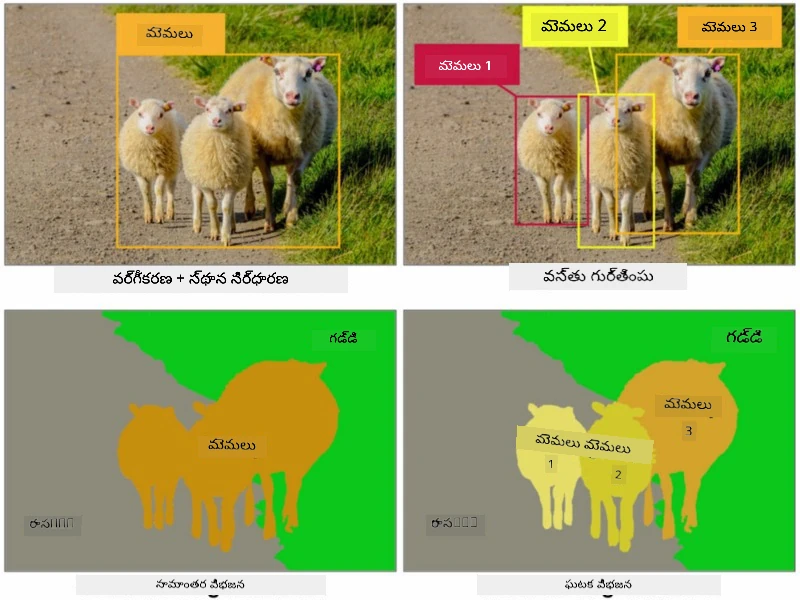
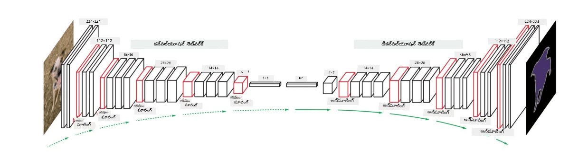
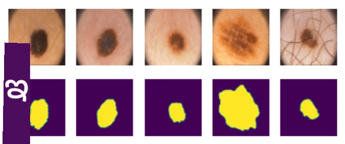

# విభజన

మేము ముందుగా ఆబ్జెక్ట్ డిటెక్షన్ గురించి నేర్చుకున్నాము, ఇది చిత్రంలో ఆబ్జెక్టులను వారి *బౌండింగ్ బాక్స్‌లు*ను అంచనా వేయడం ద్వారా గుర్తించడానికి సహాయపడుతుంది. అయితే, కొన్ని పనుల కోసం మాకు కేవలం బౌండింగ్ బాక్స్‌లు మాత్రమే కాకుండా, మరింత ఖచ్చితమైన ఆబ్జెక్ట్ స్థానాన్ని కూడా అవసరం. ఈ పనిని **విభజన** అంటారు.

## [పూర్వ-లెక్చర్ క్విజ్](https://ff-quizzes.netlify.app/en/ai/quiz/23)

విభజనను **పిక్సెల్ వర్గీకరణ**గా చూడవచ్చు, అంటే చిత్రంలోని **ప్రతి** పిక్సెల్ యొక్క వర్గాన్ని అంచనా వేయాలి (*బ్యాక్‌గ్రౌండ్* ఒక వర్గంగా ఉంటుంది). విభజనకు రెండు ప్రధాన అల్గోరిథమ్లు ఉన్నాయి:

* **సెమాంటిక్ విభజన** పిక్సెల్ వర్గాన్ని మాత్రమే చెప్పుతుంది, అదే వర్గానికి చెందిన వేర్వేరు ఆబ్జెక్టుల మధ్య తేడా చూపదు
* **ఇన్స్టాన్స్ విభజన** వర్గాలను వేర్వేరు ఉదాహరణలుగా విభజిస్తుంది.

ఇన్స్టాన్స్ విభజనలో, ఈ గొర్రెలు వేర్వేరు ఆబ్జెక్టులు, కానీ సెమాంటిక్ విభజనలో అన్ని గొర్రెలు ఒకే వర్గంగా చూపబడతాయి.

> చిత్రం [ఈ బ్లాగ్ పోస్ట్](https://nirmalamurali.medium.com/image-classification-vs-semantic-segmentation-vs-instance-segmentation-625c33a08d50) నుండి

విభజనకు వివిధ న్యూరల్ ఆర్కిటెక్చర్లు ఉన్నాయి, కానీ అవన్నీ ఒకే నిర్మాణాన్ని కలిగి ఉంటాయి. ఒక విధంగా, ఇది మీరు ముందుగా నేర్చుకున్న ఆటోఎంకోడర్‌కు సమానంగా ఉంటుంది, కానీ అసలు చిత్రాన్ని విడగొట్టడం కాకుండా, మన లక్ష్యం **మాస్క్**ను విడగొట్టడం. అందువల్ల, విభజన నెట్‌వర్క్‌లో ఈ భాగాలు ఉంటాయి:

* **ఎంకోడర్** ఇన్‌పుట్ చిత్రంలో నుండి ఫీచర్లను తీసుకుంటుంది
* **డీకోడర్** ఆ ఫీచర్లను **మాస్క్ చిత్రం**గా మార్చుతుంది, అదే పరిమాణం మరియు వర్గాల సంఖ్యకు సరిపోయే ఛానెల్‌లతో.

> చిత్రం [ఈ ప్రచురణ](https://arxiv.org/pdf/2001.05566.pdf) నుండి

విభజనలో ఉపయోగించే లాస్ ఫంక్షన్ గురించి ప్రత్యేకంగా చెప్పాలి. క్లాసికల్ ఆటోఎంకోడర్లను ఉపయోగించినప్పుడు, రెండు చిత్రాల మధ్య సారూప్యతను కొలవాలి, దీనికి మిన్ స్క్వేర్ ఎర్రర్ (MSE) ఉపయోగించవచ్చు. విభజనలో, లక్ష్య మాస్క్ చిత్రంలోని ప్రతి పిక్సెల్ వర్గ సంఖ్యను సూచిస్తుంది (మూడవ డైమెన్షన్‌లో వన్-హాట్ ఎంకోడింగ్), కాబట్టి వర్గీకరణకు ప్రత్యేకమైన లాస్ ఫంక్షన్లు ఉపయోగించాలి - క్రాస్-ఎంట్రోపీ లాస్, అన్ని పిక్సెల్స్ మీద సగటు తీసుకుంటూ. మాస్క్ బైనరీ అయితే - **బైనరీ క్రాస్-ఎంట్రోపీ లాస్** (BCE) ఉపయోగిస్తారు.

> ✅ వన్-హాట్ ఎంకోడింగ్ అనేది వర్గ లేబుల్‌ను వర్గాల సంఖ్యకు సమానమైన వెక్టర్‌గా ఎంకోడ్ చేసే విధానం. ఈ సాంకేతికతపై [ఈ వ్యాసం](https://datagy.io/sklearn-one-hot-encode/) చూడండి.

## వైద్య చిత్రీకరణ కోసం విభజన

ఈ పాఠంలో, మేము వైద్య చిత్రాలలో మానవ నేవి (మోల్స్ అని కూడా పిలవబడే)లను గుర్తించడానికి నెట్‌వర్క్‌ను శిక్షణ ఇస్తూ విభజనను ప్రదర్శిస్తాము. చిత్ర మూలంగా <a href="https://www.fc.up.pt/addi/ph2%20database.html">PH2 డేటాబేస్</a>ని ఉపయోగిస్తాము. ఈ డేటాసెట్‌లో మూడు వర్గాల 200 చిత్రాలు ఉన్నాయి: సాధారణ నేవస్, అసాధారణ నేవస్, మరియు మెలనోమా. అన్ని చిత్రాలకు సంబంధిత **మాస్క్** కూడా ఉంటుంది, ఇది నేవస్‌ను చుట్టుముట్టుతుంది.

> ✅ ఈ సాంకేతికత ఈ రకమైన వైద్య చిత్రీకరణకు చాలా అనుకూలంగా ఉంటుంది, కానీ మీరు మరే ఇతర వాస్తవ ప్రపంచ అనువర్తనాలను ఊహించగలరా?

> చిత్రం PH2 డేటాబేస్ నుండి

మేము ఏదైనా నేవస్‌ను దాని బ్యాక్‌గ్రౌండ్ నుండి విభజించడానికి మోడల్‌ను శిక్షణ ఇస్తాము.

## ✍️ వ్యాయామాలు: సెమాంటిక్ విభజన

క్రింద ఉన్న నోట్బుక్స్‌ను తెరవండి, వివిధ సెమాంటిక్ విభజన ఆర్కిటెక్చర్ల గురించి మరింత తెలుసుకోండి, వాటితో పని చేయడం అభ్యసించండి, మరియు వాటిని ప్రాక్టికల్‌గా చూడండి.

* [సెమాంటిక్ విభజన Pytorch](SemanticSegmentationPytorch.ipynb)
* [సెమాంటిక్ విభజన TensorFlow](SemanticSegmentationTF.ipynb)

## [పోస్ట్-లెక్చర్ క్విజ్](https://ff-quizzes.netlify.app/en/ai/quiz/24)

## ముగింపు

విభజన అనేది బౌండింగ్ బాక్స్‌లకు మించి పిక్సెల్ స్థాయి వర్గీకరణకు ఉపయోగించే శక్తివంతమైన సాంకేతికత. ఇది వైద్య చిత్రీకరణలో మరియు ఇతర అనువర్తనాలలో ఉపయోగించబడుతుంది.

## 🚀 సవాలు

శరీర విభజన అనేది మనుషుల చిత్రాలతో చేయగల సాధారణ పనుల్లో ఒకటి మాత్రమే. మరొక ముఖ్యమైన పనులు **అస్తి గుర్తింపు** మరియు **పోస్ గుర్తింపు**. పోస్ గుర్తింపును ఎలా ఉపయోగించవచ్చో చూడటానికి [OpenPose](https://github.com/CMU-Perceptual-Computing-Lab/openpose) లైబ్రరీని ప్రయత్నించండి.

## సమీక్ష & స్వీయ అధ్యయనం

ఈ [వికీపీడియా వ్యాసం](https://wikipedia.org/wiki/Image_segmentation) ఈ సాంకేతికత యొక్క వివిధ అనువర్తనాలపై మంచి అవగాహన ఇస్తుంది. ఈ పరిశోధనా రంగంలో ఇన్స్టాన్స్ విభజన మరియు పానోప్టిక్ విభజన ఉపశాఖల గురించి స్వయంగా మరింత తెలుసుకోండి.

## [అసైన్‌మెంట్](lab/README.md)

ఈ ప్రయోగశాలలో, [Segmentation Full Body MADS Dataset](https://www.kaggle.com/datasets/tapakah68/segmentation-full-body-mads-dataset) ఉపయోగించి **మానవ శరీర విభజన**ను ప్రయత్నించండి.

---

<!-- CO-OP TRANSLATOR DISCLAIMER START -->
**అస్పష్టత**:  
ఈ పత్రాన్ని AI అనువాద సేవ [Co-op Translator](https://github.com/Azure/co-op-translator) ఉపయోగించి అనువదించబడింది. మేము ఖచ్చితత్వానికి ప్రయత్నించినప్పటికీ, ఆటోమేటెడ్ అనువాదాల్లో పొరపాట్లు లేదా తప్పిదాలు ఉండవచ్చు. మూల పత్రం దాని స్వదేశీ భాషలో అధికారిక మూలంగా పరిగణించాలి. ముఖ్యమైన సమాచారానికి, ప్రొఫెషనల్ మానవ అనువాదం సిఫార్సు చేయబడుతుంది. ఈ అనువాదం వాడకంలో ఏర్పడిన ఏవైనా అపార్థాలు లేదా తప్పుదారులు కోసం మేము బాధ్యత వహించము.
<!-- CO-OP TRANSLATOR DISCLAIMER END -->