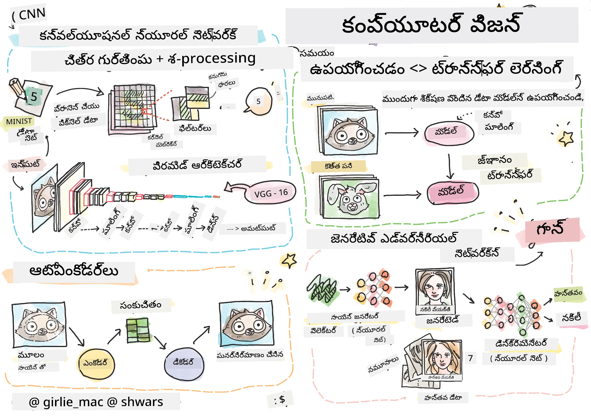

# కంప్యూటర్ విజన్

ఈ విభాగంలో మనం నేర్చుకోబోతున్నవి:

* [కంప్యూటర్ విజన్ మరియు OpenCV పరిచయం](06-IntroCV/README.md)
* [కన్వల్యూషనల్ న్యూరల్ నెట్‌వర్క్స్](07-ConvNets/README.md)
* [ప్రీ-ట్రెయిన్డ్ నెట్‌వర్క్స్ మరియు ట్రాన్స్‌ఫర్ లెర్నింగ్](08-TransferLearning/README.md) 
* [ఆటోఎంకోడర్స్](09-Autoencoders/README.md)
* [జెనరేటివ్ అడ్వర్సరియల్ నెట్‌వర్క్స్](10-GANs/README.md)
* [ఆబ్జెక్ట్ డిటెక్షన్](11-ObjectDetection/README.md)
* [సెమాంటిక్ సెగ్మెంటేషన్](12-Segmentation/README.md)

---

<!-- CO-OP TRANSLATOR DISCLAIMER START -->
**అస్పష్టత**:  
ఈ పత్రాన్ని AI అనువాద సేవ [Co-op Translator](https://github.com/Azure/co-op-translator) ఉపయోగించి అనువదించబడింది. మేము ఖచ్చితత్వానికి ప్రయత్నించినప్పటికీ, ఆటోమేటెడ్ అనువాదాల్లో పొరపాట్లు లేదా తప్పిదాలు ఉండవచ్చు. మూల పత్రం దాని స్వదేశీ భాషలో అధికారిక మూలంగా పరిగణించాలి. ముఖ్యమైన సమాచారానికి, ప్రొఫెషనల్ మానవ అనువాదం సిఫార్సు చేయబడుతుంది. ఈ అనువాదం వాడకం వల్ల కలిగే ఏవైనా అపార్థాలు లేదా తప్పుదారుల బాధ్యత మేము తీసుకోము.
<!-- CO-OP TRANSLATOR DISCLAIMER END -->