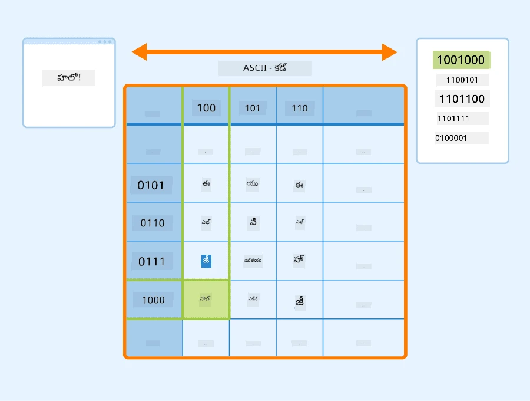

# టెక్స్ట్‌ను టెన్సార్లుగా ప్రాతినిధ్యం వహించడం

## [పూర్వ-లెక్చర్ క్విజ్](https://ff-quizzes.netlify.app/en/ai/quiz/25)

## టెక్స్ట్ వర్గీకరణ

ఈ విభాగం మొదటి భాగంలో, మనం **టెక్స్ట్ వర్గీకరణ** పనిపై దృష్టి సారించబోతున్నాము. మనం [AG News](https://www.kaggle.com/amananandrai/ag-news-classification-dataset) డేటాసెట్‌ను ఉపయోగించబోతున్నాము, ఇది క్రింది విధంగా వార్తా వ్యాసాలను కలిగి ఉంటుంది:

* వర్గం: సైన్స్/టెక్నాలజీ
* శీర్షిక: Ky. కంపెనీ పెప్టైడ్స్ అధ్యయనానికి గ్రాంట్ గెలుచుకుంది (AP)
* శరీరం: AP - లూయిస్విల్లే విశ్వవిద్యాలయంలో రసాయన శాస్త్ర పరిశోధకుడు స్థాపించిన ఒక కంపెనీ అభివృద్ధి కోసం గ్రాంట్ గెలుచుకుంది...

మన లక్ష్యం టెక్స్ట్ ఆధారంగా వార్తా అంశాన్ని ఒక వర్గంలో వర్గీకరించడం.

## టెక్స్ట్ ప్రాతినిధ్యం

నేచురల్ లాంగ్వేజ్ ప్రాసెసింగ్ (NLP) పనులను న్యూరల్ నెట్‌వర్క్‌లతో పరిష్కరించాలంటే, టెక్స్ట్‌ను టెన్సార్లుగా ప్రాతినిధ్యం వహించే విధానం అవసరం. కంప్యూటర్లు ఇప్పటికే ASCII లేదా UTF-8 వంటి ఎంకోడింగ్లను ఉపయోగించి స్క్రీన్‌పై ఫాంట్లకు మ్యాప్ అయ్యే సంఖ్యలుగా టెక్స్ట్ అక్షరాలను ప్రాతినిధ్యం వహిస్తాయి.

> [చిత్ర మూలం](https://www.seobility.net/en/wiki/ASCII)

మనిషిలా, ప్రతి అక్షరం ఏమి **ప్రతినిధ్యం వహిస్తుంది** మరియు అన్ని అక్షరాలు కలిసి వాక్యపు పదాలను ఎలా ఏర్పరుస్తాయో మనం అర్థం చేసుకుంటాము. అయితే, కంప్యూటర్లు స్వయంగా అర్థం చేసుకోలేవు, మరియు న్యూరల్ నెట్‌వర్క్ శిక్షణ సమయంలో అర్థం నేర్చుకోవాలి.

కాబట్టి, టెక్స్ట్ ప్రాతినిధ్యం వహించే సమయంలో మనం వివిధ విధానాలను ఉపయోగించవచ్చు:

* **అక్షర స్థాయి ప్రాతినిధ్యం**, ఇందులో ప్రతి అక్షరాన్ని ఒక సంఖ్యగా పరిగణించి టెక్స్ట్‌ను ప్రాతినిధ్యం చేస్తాము. మన టెక్స్ట్ కార్పస్‌లో *C* వేర్వేరు అక్షరాలు ఉంటే, *Hello* అనే పదం 5x*C* టెన్సార్‌గా ప్రాతినిధ్యం వహిస్తుంది. ప్రతి అక్షరం ఒక హాట్ ఎంకోడింగ్‌లో టెన్సార్ కాలమ్‌కు సరిపోతుంది.
* **పద స్థాయి ప్రాతినిధ్యం**, ఇందులో మనం టెక్స్ట్‌లోని అన్ని పదాల **వాక్యకోశం**ను సృష్టించి, ఆ పదాలను వన్-హాట్ ఎంకోడింగ్‌తో ప్రాతినిధ్యం చేస్తాము. ఈ విధానం కొంత మెరుగైనది, ఎందుకంటే ఒక్కొక్క అక్షరానికి తానే ఎక్కువ అర్థం ఉండదు, కాబట్టి పదాల వంటి ఉన్నత స్థాయి సారాంశ భావాలను ఉపయోగించడం ద్వారా న్యూరల్ నెట్‌వర్క్ పనిని సులభతరం చేస్తాము. అయితే, పెద్ద డిక్షనరీ పరిమాణం కారణంగా, మనం అధిక-పరిమాణపు స్పార్స్ టెన్సార్లను నిర్వహించాల్సి ఉంటుంది.

ప్రాతినిధ్యం ఏ విధంగా ఉన్నా, ముందుగా టెక్స్ట్‌ను **టోకెన్ల** వరుసగా మార్చాలి, ఒక టోకెన్ అక్షరం, పదం లేదా కొన్నిసార్లు పద భాగం కూడా కావచ్చు. ఆ తర్వాత, టోకెన్‌ను సంఖ్యగా మార్చాలి, సాధారణంగా **వాక్యకోశం** ఉపయోగించి, ఆ సంఖ్యను వన్-హాట్ ఎంకోడింగ్ ద్వారా న్యూరల్ నెట్‌వర్క్‌కు ఇన్పుట్‌గా ఇవ్వవచ్చు.

## ఎన్-గ్రామ్స్

సహజ భాషలో, పదాల ఖచ్చిత అర్థం సందర్భంలోనే నిర్ణయించబడుతుంది. ఉదాహరణకు, *న్యూరల్ నెట్‌వర్క్* మరియు *ఫిషింగ్ నెట్‌వర్క్* అర్థాలు పూర్తిగా భిన్నంగా ఉంటాయి. దీన్ని పరిగణలోకి తీసుకోవడానికి ఒక మార్గం, మన మోడల్‌ను పద జంటలపై నిర్మించడం, మరియు పద జంటలను వేరే వాక్యకోశ టోకెన్లుగా పరిగణించడం. ఈ విధంగా, వాక్యం *I like to go fishing* క్రింది టోకెన్ల వరుసగా ప్రాతినిధ్యం వహిస్తుంది: *I like*, *like to*, *to go*, *go fishing*. ఈ విధానంలో సమస్య ఏమిటంటే, డిక్షనరీ పరిమాణం గణనీయంగా పెరుగుతుంది, మరియు *go fishing* మరియు *go shopping* వంటి కలయికలు వేరే టోకెన్లుగా ఉంటాయి, అవి ఒకే క్రియ ఉన్నప్పటికీ సారాంశ సంబంధం పంచుకోవు.

కొన్నిసార్లు, మూడుసార్లు పదాల కలయికలు అయిన ట్రై-గ్రామ్స్‌ను కూడా పరిగణించవచ్చు. ఈ విధానాన్ని సాధారణంగా **ఎన్-గ్రామ్స్** అంటారు. అలాగే, అక్షర స్థాయి ప్రాతినిధ్యంలో ఎన్-గ్రామ్స్ ఉపయోగించడం అర్థం, ఇందులో ఎన్-గ్రామ్స్ సుమారు వేర్వేరు అక్షరాల భాగాలుగా ఉంటుంది.

## బ్యాగ్-ఆఫ్-వర్డ్స్ మరియు TF/IDF

టెక్స్ట్ వర్గీకరణ వంటి పనులను పరిష్కరించేటప్పుడు, మనం ఒక స్థిర పరిమాణం వెక్టర్‌తో టెక్స్ట్‌ను ప్రాతినిధ్యం చేయగలగాలి, దీన్ని తుది డెన్స్ క్లాసిఫయర్‌కు ఇన్పుట్‌గా ఉపయోగిస్తాము. దీని కోసం ఒక సరళమైన మార్గం, ప్రతి పద ప్రాతినిధ్యాలను కలిపి, ఉదాహరణకు వాటిని జోడించడం. ప్రతి పదం వన్-హాట్ ఎంకోడింగ్‌లను జోడిస్తే, మనకు పదాల సంభావ్యతలను చూపించే ఫ్రీక్వెన్సీ వెక్టర్ వస్తుంది, అంటే ప్రతి పదం టెక్స్ట్‌లో ఎన్ని సార్లు వస్తుందో. ఈ విధంగా టెక్స్ట్ ప్రాతినిధ్యం **బ్యాగ్ ఆఫ్ వర్డ్స్** (BoW) అని పిలవబడుతుంది.

> రచయితచే చిత్రీకరణ

BoW టెక్స్ట్‌లో ఏ పదాలు ఎన్ని సార్లు ఉన్నాయో సూచిస్తుంది, ఇది టెక్స్ట్ విషయం గురించి మంచి సూచన కావచ్చు. ఉదాహరణకు, రాజకీయాలపై వార్తా వ్యాసం *president* మరియు *country* వంటి పదాలు ఉండే అవకాశం ఉంది, శాస్త్రీయ ప్రచురణలో *collider*, *discovered* వంటి పదాలు ఉండవచ్చు. కాబట్టి, పదాల ఫ్రీక్వెన్సీలు చాలా సందర్భాల్లో టెక్స్ట్ విషయానికి మంచి సూచన.

BoW సమస్య ఏమిటంటే, *and*, *is* వంటి సాధారణ పదాలు ఎక్కువ టెక్స్ట్‌లలో కనిపిస్తాయి మరియు అత్యధిక ఫ్రీక్వెన్సీ కలిగి ఉంటాయి, ఇవి నిజంగా ముఖ్యమైన పదాలను దాచేస్తాయి. ఈ పదాల ప్రాముఖ్యతను తగ్గించడానికి, మొత్తం డాక్యుమెంట్ సేకరణలో పదాల సంభావ్యతను పరిగణలోకి తీసుకోవచ్చు. ఇది TF/IDF విధానానికి ప్రధాన ఆలోచన, ఇది ఈ పాఠంలో జతచేసిన నోట్బుక్స్‌లో మరింత వివరంగా ఉంది.

అయితే, ఈ విధానాలు టెక్స్ట్ యొక్క **సారాంశం**ను పూర్తిగా పరిగణించలేవు. దీని కోసం మరింత శక్తివంతమైన న్యూరల్ నెట్‌వర్క్ మోడల్స్ అవసరం, వాటిని ఈ విభాగంలో తర్వాత చర్చిస్తాము.

## ✍️ వ్యాయామాలు: టెక్స్ట్ ప్రాతినిధ్యం

క్రింది నోట్బుక్స్‌లో మీ అభ్యాసాన్ని కొనసాగించండి:

* [PyTorchతో టెక్స్ట్ ప్రాతినిధ్యం](TextRepresentationPyTorch.ipynb)
* [TensorFlowతో టెక్స్ట్ ప్రాతినిధ్యం](TextRepresentationTF.ipynb)

## ముగింపు

ఇప్పటివరకు, మనం వివిధ పదాలకు ఫ్రీక్వెన్సీ బరువు జోడించే సాంకేతికతలను అధ్యయనం చేసాము. అవి, అయితే, అర్థం లేదా క్రమాన్ని ప్రాతినిధ్యం చేయలేవు. 1935లో ప్రసిద్ధ భాషావేత్త జె. ఆర్. ఫర్త్ చెప్పినట్లుగా, "పదం యొక్క పూర్తి అర్థం ఎప్పుడూ సందర్భానుసారంగా ఉంటుంది, మరియు సందర్భం లేకుండా అర్థం అధ్యయనం సీరియస్‌గా తీసుకోలేము." భవిష్యత్తులో మనం భాషా మోడలింగ్ ఉపయోగించి టెక్స్ట్ నుండి సందర్భ సమాచారాన్ని ఎలా పొందాలో నేర్చుకుంటాము.

## 🚀 సవాలు

బ్యాగ్-ఆఫ్-వర్డ్స్ మరియు వివిధ డేటా మోడల్స్ ఉపయోగించి మరిన్ని వ్యాయామాలు ప్రయత్నించండి. మీరు ఈ [కాగ్గుల్ పోటీ](https://www.kaggle.com/competitions/word2vec-nlp-tutorial/overview/part-1-for-beginners-bag-of-words) నుండి ప్రేరణ పొందవచ్చు.

## [పోస్ట్-లెక్చర్ క్విజ్](https://ff-quizzes.netlify.app/en/ai/quiz/26)

## సమీక్ష & స్వీయ అధ్యయనం

[Microsoft Learn](https://docs.microsoft.com/learn/modules/intro-natural-language-processing-pytorch/?WT.mc_id=academic-77998-cacaste)లో టెక్స్ట్ ఎంబెడ్డింగ్స్ మరియు బ్యాగ్-ఆఫ్-వర్డ్స్ సాంకేతికతలతో మీ నైపుణ్యాలను అభ్యసించండి.

## [అసైన్‌మెంట్: నోట్బుక్స్](assignment.md)

---

<!-- CO-OP TRANSLATOR DISCLAIMER START -->
**అస్పష్టత**:  
ఈ పత్రాన్ని AI అనువాద సేవ [Co-op Translator](https://github.com/Azure/co-op-translator) ఉపయోగించి అనువదించబడింది. మేము ఖచ్చితత్వానికి ప్రయత్నించినప్పటికీ, ఆటోమేటెడ్ అనువాదాల్లో పొరపాట్లు లేదా తప్పిదాలు ఉండవచ్చు. అసలు పత్రం దాని స్వదేశీ భాషలోనే అధికారిక మూలంగా పరిగణించాలి. ముఖ్యమైన సమాచారానికి, ప్రొఫెషనల్ మానవ అనువాదం చేయించుకోవడం మంచిది. ఈ అనువాదం వలన కలిగే ఏవైనా అపార్థాలు లేదా తప్పుదారుల బాధ్యత మేము తీసుకోము.
<!-- CO-OP TRANSLATOR DISCLAIMER END -->