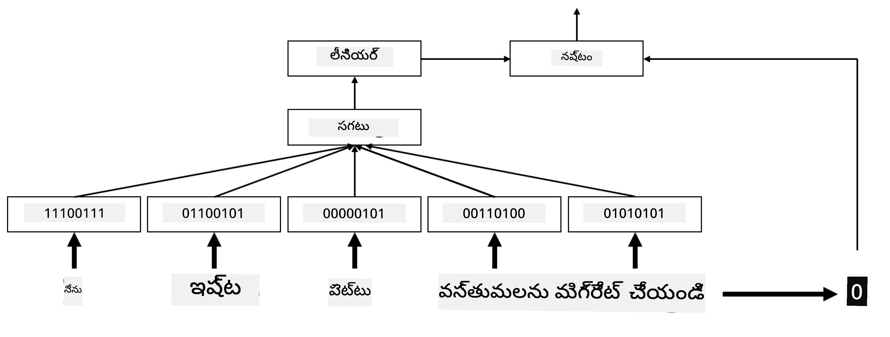
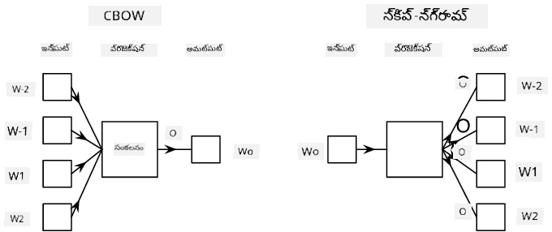

# ఎంబెడ్డింగ్స్

## [ప్రీ-లెక్చర్ క్విజ్](https://ff-quizzes.netlify.app/en/ai/quiz/27)

BoW లేదా TF/IDF ఆధారంగా క్లాసిఫైయర్లను శిక్షణ ఇచ్చేటప్పుడు, మేము `vocab_size` పొడవు ఉన్న అధిక-మానసిక బాగ్-ఆఫ్-వర్డ్స్ వెక్టర్లపై పనిచేశాము, మరియు మేము తక్కువ-మానసిక స్థానిక ప్రాతినిధ్య వెక్టర్లను స్పార్స్ వన్-హాట్ ప్రాతినిధ్యంగా స్పష్టంగా మార్చాము. అయితే, ఈ వన్-హాట్ ప్రాతినిధ్యం మెమరీ-సమర్థవంతంగా లేదు. అదనంగా, ప్రతి పదం ఒకదానితో స్వతంత్రంగా పరిగణించబడుతుంది, అంటే వన్-హాట్ ఎన్‌కోడ్ చేసిన వెక్టర్లు పదాల మధ్య ఏదైనా సార్ధక సారూప్యతను వ్యక్తం చేయవు.

**ఎంబెడ్డింగ్** అనే ఆలోచన పదాలను తక్కువ-మానసిక సాంద్ర వెక్టర్ల ద్వారా ప్రాతినిధ్యం చేయడం, ఇవి ఏదో విధంగా పదం యొక్క సార్ధక అర్థాన్ని ప్రతిబింబిస్తాయి. మనం తర్వాత అర్థవంతమైన పద ఎంబెడ్డింగ్స్ ఎలా నిర్మించాలో చర్చిస్తాము, కానీ ఇప్పటికీ ఎంబెడ్డింగ్స్‌ను పద వెక్టర్ యొక్క మానసికత తగ్గించే ఒక మార్గంగా భావిద్దాం.

కాబట్టి, ఎంబెడ్డింగ్ లేయర్ ఒక పదాన్ని ఇన్‌పుట్‌గా తీసుకుని, నిర్దిష్ట `embedding_size` ఉన్న అవుట్‌పుట్ వెక్టర్‌ను ఉత్పత్తి చేస్తుంది. ఒక అర్థంలో, ఇది `Linear` లేయర్‌కు చాలా సమానంగా ఉంటుంది, కానీ వన్-హాట్ ఎన్‌కోడ్ చేసిన వెక్టర్ తీసుకోవడం కాకుండా, ఇది పద సంఖ్యను ఇన్‌పుట్‌గా తీసుకోవచ్చు, తద్వారా పెద్ద వన్-హాట్ ఎన్‌కోడ్ చేసిన వెక్టర్లను సృష్టించకుండా ఉండవచ్చు.

మన క్లాసిఫైయర్ నెట్‌వర్క్‌లో మొదటి లేయర్‌గా ఎంబెడ్డింగ్ లేయర్ ఉపయోగించడం ద్వారా, మేము బాగ్-ఆఫ్-వర్డ్స్ నుండి **ఎంబెడ్డింగ్ బాగ్** మోడల్‌కు మారవచ్చు, ఇక్కడ మేము మొదట మన టెక్స్ట్‌లోని ప్రతి పదాన్ని సంబంధిత ఎంబెడ్డింగ్‌గా మార్చి, ఆ ఎంబెడ్డింగ్స్‌పై `sum`, `average` లేదా `max` వంటి ఏదైనా సమాహార ఫంక్షన్‌ను లెక్కిస్తాము.

> చిత్రాన్ని రచయిత అందించారు

## ✍️ వ్యాయామాలు: ఎంబెడ్డింగ్స్

క్రింది నోట్బుక్స్‌లో మీ అభ్యాసాన్ని కొనసాగించండి:
* [PyTorch తో ఎంబెడ్డింగ్స్](EmbeddingsPyTorch.ipynb)
* [TensorFlow తో ఎంబెడ్డింగ్స్](EmbeddingsTF.ipynb)

## సార్ధక ఎంబెడ్డింగ్స్: Word2Vec

ఎంబెడ్డింగ్ లేయర్ పదాలను వెక్టర్ ప్రాతినిధ్యానికి మ్యాప్ చేయడం నేర్చుకున్నప్పటికీ, ఈ ప్రాతినిధ్యం తప్పనిసరిగా చాలా సార్ధక అర్థం కలిగి ఉండదు. సమానమైన పదాలు లేదా సమానార్థక పదాలు ఒకదానితో దగ్గరగా ఉండే వెక్టర్లుగా ఉండేలా వెక్టర్ ప్రాతినిధ్యం నేర్చుకోవడం మంచిది (ఉదా: యూక్లిడియన్ దూరం).

అందుకోసం, మనం పెద్ద టెక్స్ట్ సేకరణపై ప్రత్యేకంగా ఎంబెడ్డింగ్ మోడల్‌ను ప్రీ-ట్రెయిన్ చేయాలి. సార్ధక ఎంబెడ్డింగ్స్ శిక్షణకు ఒక విధానం [Word2Vec](https://en.wikipedia.org/wiki/Word2vec) అని పిలవబడుతుంది. ఇది పదాల పంపిణీ ప్రాతినిధ్యం ఉత్పత్తి చేయడానికి ఉపయోగించే రెండు ప్రధాన నిర్మాణాలపై ఆధారపడి ఉంటుంది:

 - **కంటిన్యూయస్ బాగ్-ఆఫ్-వర్డ్స్** (CBoW) — ఈ నిర్మాణంలో, మోడల్‌ను చుట్టూ ఉన్న సందర్భం నుండి ఒక పదాన్ని అంచనా వేయడానికి శిక్షణ ఇస్తారు. ngram $(W_{-2},W_{-1},W_0,W_1,W_2)$ ఇచ్చినప్పుడు, మోడల్ లక్ష్యం $W_0$ ను $(W_{-2},W_{-1},W_1,W_2)$ నుండి అంచనా వేయడం.
 - **కంటిన్యూయస్ స్కిప్-గ్రామ్** CBoWకి వ్యతిరేకంగా ఉంటుంది. మోడల్ ప్రస్తుత పదాన్ని అంచనా వేయడానికి చుట్టూ ఉన్న సందర్భ పదాల విండోను ఉపయోగిస్తుంది.

CBoW వేగంగా ఉంటుంది, స్కిప్-గ్రామ్ మందగిస్తుంది, కానీ అరుదైన పదాలను బాగా ప్రాతినిధ్యం చేస్తుంది.

> చిత్రం [ఈ పేపర్](https://arxiv.org/pdf/1301.3781.pdf) నుండి

Word2Vec ప్రీ-ట్రెయిన్ చేసిన ఎంబెడ్డింగ్స్ (మరియు GloVe వంటి ఇతర సమాన మోడల్స్) న్యూరల్ నెట్‌వర్క్‌లలో ఎంబెడ్డింగ్ లేయర్ స్థానంలో కూడా ఉపయోగించవచ్చు. అయితే, మనం వోకాబ్యులరీలతో వ్యవహరించాలి, ఎందుకంటే Word2Vec/GloVe ప్రీ-ట్రెయిన్ చేసిన వోకాబ్యులరీ మన టెక్స్ట్ కార్పస్‌లోని వోకాబ్యులరీతో భిన్నంగా ఉండవచ్చు. ఈ సమస్యను ఎలా పరిష్కరించాలో పై నోట్బుక్స్‌లో చూడండి.

## సందర్భానుసార ఎంబెడ్డింగ్స్

Word2Vec వంటి సాంప్రదాయ ప్రీ-ట్రెయిన్ చేసిన ఎంబెడ్డింగ్ ప్రాతినిధ్యాల ఒక ముఖ్యమైన పరిమితి పదార్థ అర్థ వివేచన సమస్య. ప్రీ-ట్రెయిన్ చేసిన ఎంబెడ్డింగ్స్ పదాల సందర్భంలో కొంత అర్థం పట్టుకోవచ్చు, కానీ ఒక పదం యొక్క అన్ని సాధ్యమైన అర్థాలు ఒకే ఎంబెడ్డింగ్‌లో సంకేతం చేయబడ్డాయి. ఇది డౌన్‌స్ట్రీమ్ మోడల్స్‌లో సమస్యలు కలిగించవచ్చు, ఎందుకంటే 'play' వంటి అనేక పదాలు ఉపయోగించే సందర్భం ఆధారంగా వేర్వేరు అర్థాలు కలిగి ఉంటాయి.

ఉదాహరణకు, 'play' అనే పదం ఈ రెండు వాక్యాలలో చాలా వేర్వేరు అర్థాలు కలిగి ఉంది:

- నేను థియేటర్‌లో ఒక **play** కి వెళ్లాను.
- జాన్ తన స్నేహితులతో **play** చేయాలనుకుంటున్నాడు.

పై ప్రీ-ట్రెయిన్ చేసిన ఎంబెడ్డింగ్స్ ఈ రెండు అర్థాలను ఒకే ఎంబెడ్డింగ్‌లో ప్రతిబింబిస్తాయి. ఈ పరిమితిని అధిగమించడానికి, మనం **భాషా మోడల్** ఆధారంగా ఎంబెడ్డింగ్స్ నిర్మించాలి, ఇది పెద్ద టెక్స్ట్ కార్పస్‌పై శిక్షణ పొందింది, మరియు పదాలు వివిధ సందర్భాల్లో ఎలా కలిపి ఉండవచ్చో *తెలుసుకుంటుంది*. సందర్భానుసార ఎంబెడ్డింగ్స్ గురించి చర్చించడం ఈ ట్యుటోరియల్ పరిధికి బయట, కానీ భాషా మోడల్స్ గురించి కోర్సులో తర్వాత మళ్లీ చర్చిస్తాము.

## ముగింపు

ఈ పాఠంలో, మీరు TensorFlow మరియు Pytorchలో ఎంబెడ్డింగ్ లేయర్‌లను ఎలా నిర్మించి ఉపయోగించాలో తెలుసుకున్నారు, తద్వారా పదాల సార్ధక అర్థాలను మెరుగ్గా ప్రతిబింబించవచ్చు.

## 🚀 సవాలు

Word2Vec కొన్ని ఆసక్తికరమైన అనువర్తనాలకు ఉపయోగించబడింది, అందులో పాటల లిరిక్స్ మరియు కవిత్వం సృష్టించడం కూడా ఉంది. రచయిత Word2Vec ఉపయోగించి కవిత్వం ఎలా సృష్టించాడో వివరిస్తున్న [ఈ వ్యాసం](https://www.politetype.com/blog/word2vec-color-poems) చూడండి. అలాగే [డాన్ షిఫ్మాన్](https://www.youtube.com/watch?v=LSS_bos_TPI&ab_channel=TheCodingTrain) వీడియోను కూడా చూడండి, ఇది ఈ సాంకేతికతకు వేరే వివరణను అందిస్తుంది. ఆపై ఈ సాంకేతికతలను మీ స్వంత టెక్స్ట్ కార్పస్ (ఉదా: Kaggle నుండి పొందిన) పై ప్రయోగించండి.

## [పోస్ట్-లెక్చర్ క్విజ్](https://ff-quizzes.netlify.app/en/ai/quiz/28)

## సమీక్ష & స్వీయ అధ్యయనం

Word2Vec పై ఈ పేపర్ చదవండి: [Efficient Estimation of Word Representations in Vector Space](https://arxiv.org/pdf/1301.3781.pdf)

## [అసైన్‌మెంట్: నోట్బుక్స్](assignment.md)

---

<!-- CO-OP TRANSLATOR DISCLAIMER START -->
**అస్పష్టత**:  
ఈ పత్రాన్ని AI అనువాద సేవ [Co-op Translator](https://github.com/Azure/co-op-translator) ఉపయోగించి అనువదించబడింది. మేము ఖచ్చితత్వానికి ప్రయత్నించినప్పటికీ, ఆటోమేటెడ్ అనువాదాల్లో పొరపాట్లు లేదా తప్పిదాలు ఉండవచ్చు. మూల పత్రం దాని స్వదేశీ భాషలో అధికారిక మూలంగా పరిగణించాలి. ముఖ్యమైన సమాచారానికి, ప్రొఫెషనల్ మానవ అనువాదం సిఫార్సు చేయబడుతుంది. ఈ అనువాదం వాడకంలో ఏర్పడిన ఏవైనా అపార్థాలు లేదా తప్పుదారితీసే అర్థాలు కోసం మేము బాధ్యత వహించము.
<!-- CO-OP TRANSLATOR DISCLAIMER END -->