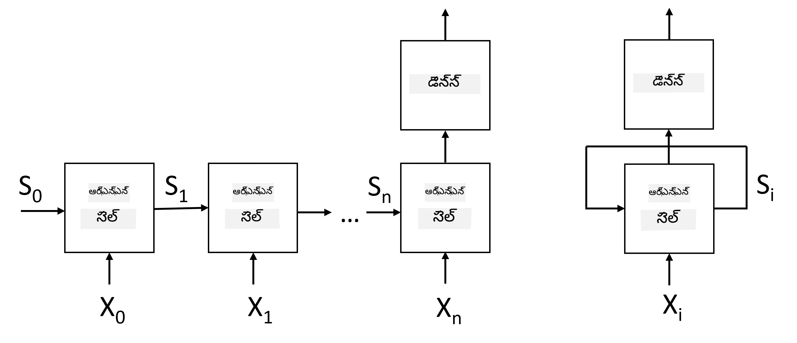
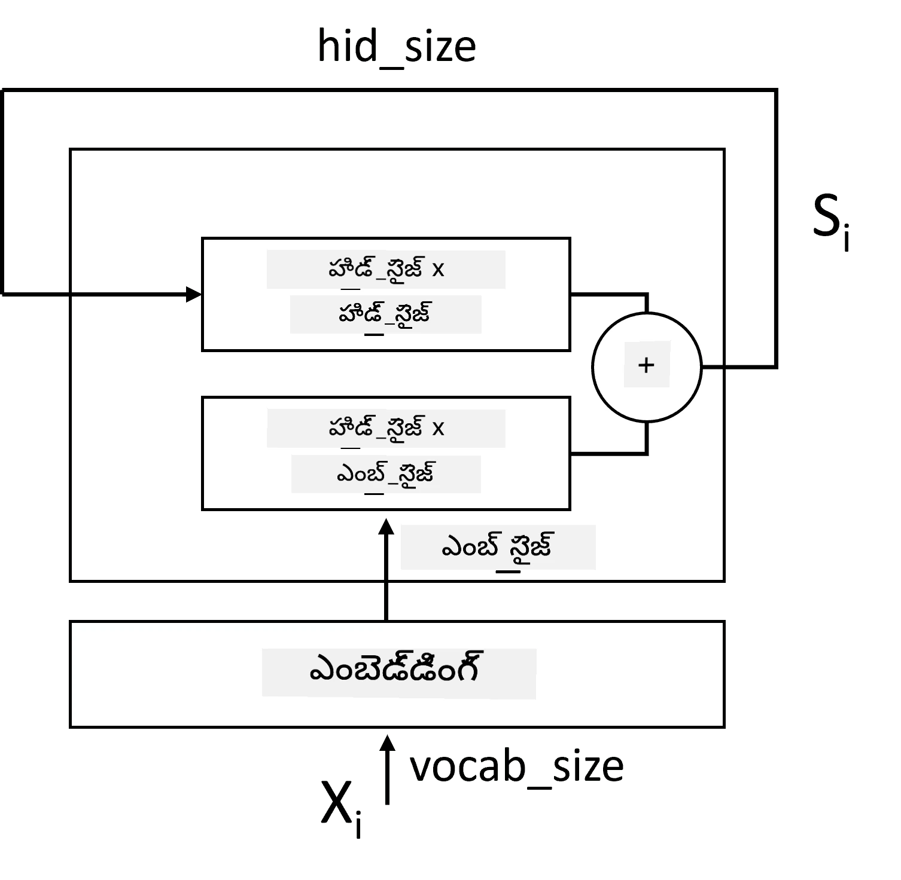
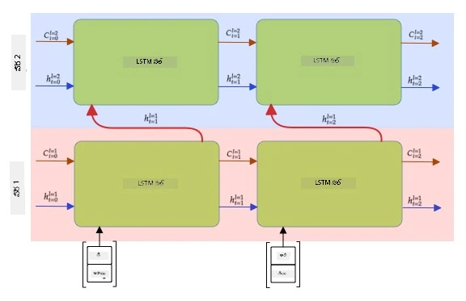

# రికరెంట్ న్యూరల్ నెట్‌వర్క్స్

## [ప్రీ-లెక్చర్ క్విజ్](https://ff-quizzes.netlify.app/en/ai/quiz/31)

మునుపటి విభాగాల్లో, మేము టెక్స్ట్ యొక్క సమృద్ధిగా అర్థం ఉన్న ప్రాతినిధ్యాలను మరియు ఎంబెడ్డింగ్స్ పై సాదా లీనియర్ క్లాసిఫయర్‌ను ఉపయోగించాము. ఈ ఆర్కిటెక్చర్ వాక్యంలో ఉన్న పదాల సమగ్ర అర్థాన్ని పట్టుకోవడమే చేస్తుంది, కానీ పదాల **క్రమం**ని పరిగణలోకి తీసుకోదు, ఎందుకంటే ఎంబెడ్డింగ్స్ పై సమీకరణ ఆపరేషన్ మూల టెక్స్ట్ నుండి ఈ సమాచారాన్ని తీసివేస్తుంది. ఈ మోడల్స్ పదాల క్రమాన్ని మోడల్ చేయలేకపోవడం వలన, టెక్స్ట్ జనరేషన్ లేదా ప్రశ్నోత్తరాల వంటి క్లిష్టమైన లేదా అనిశ్చిత పనులను పరిష్కరించలేవు.

టెక్స్ట్ సీక్వెన్స్ అర్థాన్ని పట్టుకోవడానికి, మేము మరో న్యూరల్ నెట్‌వర్క్ ఆర్కిటెక్చర్ ఉపయోగించాలి, దీనిని **రికరెంట్ న్యూరల్ నెట్‌వర్క్** లేదా RNN అంటారు. RNNలో, మేము వాక్యాన్ని ఒక్కో చిహ్నం ద్వారా నెట్‌వర్క్‌లో పంపుతాము, మరియు నెట్‌వర్క్ కొన్ని **స్థితి**ని ఉత్పత్తి చేస్తుంది, ఆ స్థితిని తరువాతి చిహ్నంతో మళ్లీ నెట్‌వర్క్‌కు ఇస్తాము.

> చిత్రకారుడు

ఇన్‌పుట్ టోకెన్ల సీక్వెన్స్ X0,...,Xn ఇచ్చినప్పుడు, RNN న్యూరల్ నెట్‌వర్క్ బ్లాక్స్ సీక్వెన్స్‌ను సృష్టించి, బ్యాక్‌ప్రొపగేషన్ ద్వారా ఎండ్-టు-ఎండ్ శిక్షణ ఇస్తుంది. ప్రతి నెట్‌వర్క్ బ్లాక్ (Xi,Si) జంటను ఇన్‌పుట్‌గా తీసుకుని, Si+1ని ఉత్పత్తి చేస్తుంది. చివరి స్థితి Sn లేదా (అవుట్‌పుట్ Yn) లీనియర్ క్లాసిఫయర్‌కు వెళ్లి ఫలితాన్ని ఉత్పత్తి చేస్తుంది. అన్ని నెట్‌వర్క్ బ్లాక్స్ ఒకే బరువులను పంచుకుంటాయి మరియు ఒకే బ్యాక్‌ప్రొపగేషన్ పాస్ ద్వారా ఎండ్-టు-ఎండ్ శిక్షణ పొందుతాయి.

స్థితి వెక్టర్లు S0,...,Sn నెట్‌వర్క్ ద్వారా పంపబడటం వలన, ఇది పదాల మధ్య క్రమపద్ధతుల ఆధారిత సంబంధాలను నేర్చుకోగలదు. ఉదాహరణకు, సీక్వెన్స్‌లో *not* అనే పదం వచ్చినప్పుడు, ఇది స్థితి వెక్టర్‌లోని కొన్ని అంశాలను నెగేట్ చేయడం నేర్చుకోవచ్చు, ఫలితంగా నెగేషన్ వస్తుంది.

> ✅ పై చిత్రంలో అన్ని RNN బ్లాక్స్ బరువులు పంచుకున్నందున, అదే చిత్రాన్ని ఒక బ్లాక్ (కుడి వైపు) గా, రికరెంట్ ఫీడ్బ్యాక్ లూప్‌తో చూపవచ్చు, ఇది నెట్‌వర్క్ అవుట్‌పుట్ స్థితిని మళ్లీ ఇన్‌పుట్‌కు పంపుతుంది.

## RNN సెల్ నిర్మాణం

సాదా RNN సెల్ ఎలా ఏర్పడిందో చూద్దాం. ఇది గత స్థితి Si-1 మరియు ప్రస్తుత చిహ్నం Xiని ఇన్‌పుట్‌గా తీసుకుని, అవుట్‌పుట్ స్థితి Si (మరియు కొన్నిసార్లు ఇతర అవుట్‌పుట్ Yi కూడా, ఉదాహరణకు జనరేటివ్ నెట్‌వర్క్స్‌లో) ఉత్పత్తి చేయాలి.

సాదా RNN సెల్‌లో రెండు బరువు మ్యాట్రిక్స్‌లు ఉంటాయి: ఒకటి ఇన్‌పుట్ చిహ్నాన్ని మార్చుతుంది (దాన్ని W అంటాం), మరొకటి ఇన్‌పుట్ స్థితిని మార్చుతుంది (H). ఈ సందర్భంలో నెట్‌వర్క్ అవుట్‌పుట్ &sigma;(W&times;Xi+H&times;Si-1+b) గా లెక్కించబడుతుంది, ఇక్కడ &sigma; యాక్టివేషన్ ఫంక్షన్, b అదనపు బయాస్.

> చిత్రకారుడు

చాలా సందర్భాల్లో, ఇన్‌పుట్ టోకెన్లు RNNకి వెళ్లేముందు ఎంబెడ్డింగ్ లేయర్ ద్వారా పంపబడతాయి, దీని వల్ల డైమెన్షనాలిటీ తగ్గుతుంది. ఇక్కడ, ఇన్‌పుట్ వెక్టర్ల డైమెన్షన్ *emb_size* అయితే, స్థితి వెక్టర్ *hid_size* అయితే - W పరిమాణం *emb_size*&times;*hid_size*, H పరిమాణం *hid_size*&times;*hid_size* అవుతుంది.

## లాంగ్ షార్ట్ టర్మ్ మెమరీ (LSTM)

సాంప్రదాయ RNNల ప్రధాన సమస్యలలో ఒకటి **వానిషింగ్ గ్రాడియెంట్స్** సమస్య. RNNలు ఒకే బ్యాక్‌ప్రొపగేషన్ పాస్‌లో ఎండ్-టు-ఎండ్ శిక్షణ పొందడం వలన, మొదటి లేయర్లకు లోపం సరిగ్గా చేరడం కష్టమవుతుంది, అందువల్ల నెట్‌వర్క్ దూర టోకెన్ల మధ్య సంబంధాలు నేర్చుకోలేకపోతుంది. ఈ సమస్యను నివారించడానికి ఒక మార్గం **స్పష్ట స్థితి నిర్వహణ**ను ప్రవేశపెట్టడం, దీనికి **గేట్స్** ఉపయోగిస్తారు. ఈ తరహా రెండు ప్రసిద్ధ ఆర్కిటెక్చర్లు ఉన్నాయి: **లాంగ్ షార్ట్ టర్మ్ మెమరీ** (LSTM) మరియు **గేటెడ్ రీలే యూనిట్** (GRU).

> చిత్రం మూలం TBD

LSTM నెట్‌వర్క్ RNNకు సమానంగా ఏర్పడింది, కానీ రెండు స్థితులు లేయర్ నుండి లేయర్‌కు పంపబడతాయి: అసలు స్థితి C మరియు హిడెన్ వెక్టర్ H. ప్రతి యూనిట్‌లో, హిడెన్ వెక్టర్ Hiను ఇన్‌పుట్ Xiతో కలిపి, అవి **గేట్స్** ద్వారా స్థితి Cపై నియంత్రణ చేస్తాయి. ప్రతి గేట్ సిగ్మాయిడ్ యాక్టివేషన్ ఉన్న న్యూరల్ నెట్‌వర్క్ (ఫలితం [0,1] పరిధిలో ఉంటుంది), ఇది స్థితి వెక్టర్‌తో గుణించబడినప్పుడు బిట్‌వైజ్ మాస్క్‌లాగా భావించవచ్చు. ఈ గేట్స్ (చిత్రంలో ఎడమ నుండి కుడి వైపు):

* **ఫార్గెట్ గేట్** హిడెన్ వెక్టర్ తీసుకుని, స్థితి Cలోని ఏ భాగాలను మర్చిపోవాలో, ఏ భాగాలను కొనసాగించాలో నిర్ణయిస్తుంది.
* **ఇన్‌పుట్ గేట్** ఇన్‌పుట్ మరియు హిడెన్ వెక్టర్ల నుండి సమాచారం తీసుకుని, దాన్ని స్థితిలో చేర్చుతుంది.
* **అవుట్‌పుట్ గేట్** స్థితిని *tanh* యాక్టివేషన్‌తో లీనియర్ లేయర్ ద్వారా మార్చి, హిడెన్ వెక్టర్ Hi ఉపయోగించి దాని కొన్ని భాగాలను ఎంచుకుని కొత్త స్థితి Ci+1ని ఉత్పత్తి చేస్తుంది.

స్థితి Cలోని భాగాలు కొన్ని ఫ్లాగ్‌లాగా భావించవచ్చు, అవి ఆన్ లేదా ఆఫ్ చేయవచ్చు. ఉదాహరణకు, సీక్వెన్స్‌లో *Alice* అనే పేరు వచ్చినప్పుడు, అది మహిళా పాత్రకు సంబంధించినదని భావించి, వాక్యంలో మహిళా నామవాచకం ఉన్నట్లు ఫ్లాగ్‌ను ఎత్తవచ్చు. తరువాత *and Tom* వంటి పదాలు వచ్చినప్పుడు, బహువచన నామవాచకం ఉన్నట్లు ఫ్లాగ్‌ను ఎత్తవచ్చు. ఈ విధంగా స్థితిని నియంత్రించడం ద్వారా వాక్య భాగాల వ్యాకరణ లక్షణాలను ట్రాక్ చేయవచ్చు.

> ✅ LSTM అంతర్గతాలను అర్థం చేసుకోవడానికి అద్భుతమైన వనరు ఈ గొప్ప వ్యాసం [Understanding LSTM Networks](https://colah.github.io/posts/2015-08-Understanding-LSTMs/) క్రిస్టోఫర్ ఒలాహ్ రాసినది.

## బిడైరెక్షనల్ మరియు మల్టిలేయర్ RNNలు

మేము ఒక దిశలో పనిచేసే రికరెంట్ నెట్‌వర్క్స్ గురించి చర్చించాము, అంటే సీక్వెన్స్ ప్రారంభం నుండి చివర వరకు. ఇది సహజంగా అనిపిస్తుంది, ఎందుకంటే మనం చదవడం మరియు మాట్లాడే విధానం ఇలానే ఉంటుంది. అయితే, అనేక ప్రాక్టికల్ సందర్భాల్లో ఇన్‌పుట్ సీక్వెన్స్‌కు యాదృచ్ఛిక ప్రాప్తి ఉన్నప్పుడు, రికరెంట్ గణనను రెండు దిశలలో నడపడం మంచిది. ఇలాంటి నెట్‌వర్క్స్‌ను **బిడైరెక్షనల్** RNNలు అంటారు. బిడైరెక్షనల్ నెట్‌వర్క్‌తో పని చేయడానికి, ప్రతి దిశకు ఒక హిడెన్ స్థితి వెక్టర్ అవసరం.

రికరెంట్ నెట్‌వర్క్, ఒక దిశలోనైనా లేదా బిడైరెక్షనల్‌గా ఉన్నా, సీక్వెన్స్‌లోని కొన్ని నమూనాలను పట్టుకుని, వాటిని స్థితి వెక్టర్‌లో నిల్వ చేయగలదు లేదా అవుట్‌పుట్‌గా పంపగలదు. కాంవల్యూషనల్ నెట్‌వర్క్స్ లాగా, మొదటి లేయర్ నుండి తీసుకున్న తక్కువ స్థాయి నమూనాలపై ఆధారపడి, మరొక రికరెంట్ లేయర్‌ను నిర్మించి, ఉన్నత స్థాయి నమూనాలను పట్టుకోవచ్చు. దీని ద్వారా **మల్టిలేయర్ RNN** అనే భావన వస్తుంది, ఇది రెండు లేదా అంతకంటే ఎక్కువ రికరెంట్ నెట్‌వర్క్స్ కలిగి ఉంటుంది, ఇక్కడ మునుపటి లేయర్ అవుట్‌పుట్ తదుపరి లేయర్ ఇన్‌పుట్‌గా పంపబడుతుంది.

*చిత్రం [ఈ అద్భుతమైన పోస్ట్](https://towardsdatascience.com/from-a-lstm-cell-to-a-multilayer-lstm-network-with-pytorch-2899eb5696f3) నుండి, ఫెర్నాండో లోపెజ్ రచన*

## ✍️ వ్యాయామాలు: ఎంబెడ్డింగ్స్

క్రింది నోట్బుక్స్‌లో మీ అభ్యాసాన్ని కొనసాగించండి:

* [PyTorchతో RNNలు](RNNPyTorch.ipynb)
* [TensorFlowతో RNNలు](RNNTF.ipynb)

## ముగింపు

ఈ యూనిట్‌లో, RNNలు సీక్వెన్స్ క్లాసిఫికేషన్‌కు ఉపయోగించవచ్చని చూశాము, కానీ వాస్తవానికి, అవి టెక్స్ట్ జనరేషన్, మెషీన్ అనువాదం మరియు మరిన్ని పనులను నిర్వహించగలవు. ఆ పనులను తదుపరి యూనిట్‌లో పరిశీలిస్తాము.

## 🚀 సవాలు

LSTMల గురించి కొంత సాహిత్యం చదవండి మరియు వాటి అనువర్తనాలను పరిశీలించండి:

- [Grid Long Short-Term Memory](https://arxiv.org/pdf/1507.01526v1.pdf)
- [Show, Attend and Tell: Neural Image Caption Generation with Visual Attention](https://arxiv.org/pdf/1502.03044v2.pdf)

## [పోస్ట్-లెక్చర్ క్విజ్](https://ff-quizzes.netlify.app/en/ai/quiz/32)

## సమీక్ష & స్వీయ అధ్యయనం

- [Understanding LSTM Networks](https://colah.github.io/posts/2015-08-Understanding-LSTMs/) క్రిస్టోఫర్ ఒలాహ్ రచన.

## [అసైన్‌మెంట్: నోట్బుక్స్](assignment.md)

---

<!-- CO-OP TRANSLATOR DISCLAIMER START -->
**అస్పష్టత**:  
ఈ డాక్యుమెంట్‌ను AI అనువాద సేవ [Co-op Translator](https://github.com/Azure/co-op-translator) ఉపయోగించి అనువదించబడింది. మేము ఖచ్చితత్వానికి ప్రయత్నించినప్పటికీ, ఆటోమేటెడ్ అనువాదాల్లో పొరపాట్లు లేదా తప్పులు ఉండవచ్చు. మూల డాక్యుమెంట్ దాని స్వదేశీ భాషలో అధికారిక మూలంగా పరిగణించాలి. ముఖ్యమైన సమాచారానికి, ప్రొఫెషనల్ మానవ అనువాదం సిఫార్సు చేయబడుతుంది. ఈ అనువాదం వాడకంలో ఏర్పడిన ఏవైనా అపార్థాలు లేదా తప్పుదారితీసే అర్థాలు కోసం మేము బాధ్యత వహించము.
<!-- CO-OP TRANSLATOR DISCLAIMER END -->