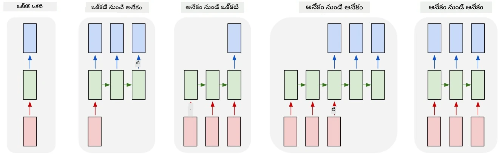
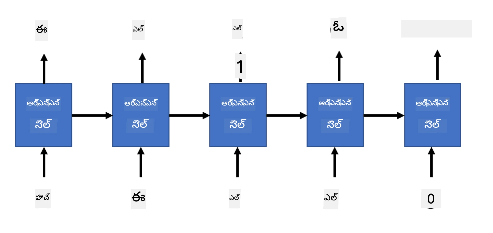

# జనరేటివ్ నెట్‌వర్క్స్

## [ప్రీ-లెక్చర్ క్విజ్](https://ff-quizzes.netlify.app/en/ai/quiz/33)

రికరెంట్ న్యూరల్ నెట్‌వర్క్స్ (RNNs) మరియు వాటి గేటెడ్ సెల్ వేరియంట్లు, ఉదాహరణకు లాంగ్ షార్ట్ టర్మ్ మెమరీ సెల్స్ (LSTMs) మరియు గేటెడ్ రికరెంట్ యూనిట్స్ (GRUs), భాషా మోడలింగ్ కోసం ఒక యంత్రాంగాన్ని అందించాయి, ఎందుకంటే అవి పదాల క్రమాన్ని నేర్చుకుని, సీక్వెన్స్‌లో తదుపరి పదానికి అంచనాలు ఇవ్వగలవు. ఇది RNNలను **జనరేటివ్ పనుల** కోసం ఉపయోగించడానికి అనుమతిస్తుంది, ఉదాహరణకు సాధారణ టెక్స్ట్ జనరేషన్, మెషీన్ అనువాదం, మరియు ఇమేజ్ క్యాప్షనింగ్ కూడా.

> ✅ మీరు టైప్ చేస్తున్నప్పుడు టెక్స్ట్ కంప్లీషన్ వంటి జనరేటివ్ పనుల నుండి లాభం పొందిన అన్ని సందర్భాలను ఆలోచించండి. మీ ఇష్టమైన అప్లికేషన్లు RNNలను ఉపయోగించాయా అని పరిశోధన చేయండి.

మునుపటి యూనిట్‌లో చర్చించిన RNN ఆర్కిటెక్చర్‌లో, ప్రతి RNN యూనిట్ తదుపరి హిడెన్ స్టేట్‌ను అవుట్‌పుట్‌గా ఉత్పత్తి చేసింది. అయితే, ప్రతి రికరెంట్ యూనిట్‌కు మరో అవుట్‌పుట్‌ను కూడా జోడించవచ్చు, ఇది మాకు **సీక్వెన్స్** (మూల సీక్వెన్స్ పొడవుతో సమానం) అవుట్‌పుట్ ఇవ్వడానికి అనుమతిస్తుంది. అంతేకాకుండా, ప్రతి దశలో ఇన్‌పుట్‌ను స్వీకరించని RNN యూనిట్లను ఉపయోగించవచ్చు, కేవలం ప్రారంభ స్టేట్ వెక్టర్ తీసుకుని, ఆ తర్వాత అవుట్‌పుట్‌ల సీక్వెన్స్‌ను ఉత్పత్తి చేస్తాయి.

ఇది క్రింది చిత్రంలో చూపిన వివిధ న్యూరల్ ఆర్కిటెక్చర్లకు అవకాశం ఇస్తుంది:



> చిత్రం బ్లాగ్ పోస్ట్ [Unreasonable Effectiveness of Recurrent Neural Networks](http://karpathy.github.io/2015/05/21/rnn-effectiveness/) నుండి [Andrej Karpaty](http://karpathy.github.io/) రచయిత

* **ఒకటి-కోసం-ఒకటి** అనేది ఒక ఇన్‌పుట్ మరియు ఒక అవుట్‌పుట్ కలిగిన సాంప్రదాయ న్యూరల్ నెట్‌వర్క్
* **ఒకటి-కోసం-చాలా** అనేది ఒక జనరేటివ్ ఆర్కిటెక్చర్, ఇది ఒక ఇన్‌పుట్ విలువను స్వీకరించి, అవుట్‌పుట్ విలువల సీక్వెన్స్‌ను ఉత్పత్తి చేస్తుంది. ఉదాహరణకు, ఒక **ఇమేజ్ క్యాప్షనింగ్** నెట్‌వర్క్‌ను శిక్షణ ఇవ్వాలనుకుంటే, అది చిత్రానికి టెక్స్చువల్ వివరణను ఉత్పత్తి చేస్తుంది, అప్పుడు చిత్రాన్ని ఇన్‌పుట్‌గా తీసుకుని, దాన్ని CNN ద్వారా హిడెన్ స్టేట్ పొందించి, ఆ తర్వాత రికరెంట్ చైన్ క్యాప్షన్ పదాలను ఒక్కొక్కటిగా ఉత్పత్తి చేస్తుంది
* **చాలా-కోసం-ఒకటి** అనేది మునుపటి యూనిట్‌లో వివరించిన RNN ఆర్కిటెక్చర్లకు సరిపోతుంది, ఉదాహరణకు టెక్స్ట్ వర్గీకరణ
* **చాలా-కోసం-చాలా**, లేదా **సీక్వెన్స్-టు-సీక్వెన్స్** అనేది **మెషీన్ అనువాదం** వంటి పనులకు సరిపోతుంది, ఇక్కడ మొదటి RNN ఇన్‌పుట్ సీక్వెన్స్ నుండి అన్ని సమాచారాన్ని హిడెన్ స్టేట్‌లో సేకరిస్తుంది, మరియు మరొక RNN చైన్ ఆ స్టేట్‌ను అవుట్‌పుట్ సీక్వెన్స్‌గా విస్తరిస్తుంది.

ఈ యూనిట్‌లో, మనం సులభమైన జనరేటివ్ మోడల్స్‌పై దృష్టి సారిస్తాము, ఇవి మనకు టెక్స్ట్ ఉత్పత్తి చేయడంలో సహాయపడతాయి. సౌలభ్యానికి, మనం క్యారెక్టర్-స్థాయి టోకనైజేషన్ ఉపయోగిస్తాము.

మనం ఈ RNNను దశలవారీగా టెక్స్ట్ ఉత్పత్తి చేయడానికి శిక్షణ ఇస్తాము. ప్రతి దశలో, `nchars` పొడవు కలిగిన క్యారెక్టర్ల సీక్వెన్స్ తీసుకుని, ప్రతి ఇన్‌పుట్ క్యారెక్టర్ కోసం తదుపరి అవుట్‌పుట్ క్యారెక్టర్‌ను నెట్‌వర్క్ ఉత్పత్తి చేయమని అడుగుతాము:



టెక్స్ట్ ఉత్పత్తి (ఇన్ఫరెన్స్ సమయంలో) చేస్తున్నప్పుడు, మనం కొన్ని **ప్రాంప్ట్**తో ప్రారంభిస్తాము, ఇది RNN సెల్స్ ద్వారా మధ్యవర్తి స్టేట్‌ను ఉత్పత్తి చేయడానికి పంపబడుతుంది, ఆ తర్వాత ఆ స్టేట్ నుండి ఉత్పత్తి ప్రారంభమవుతుంది. ఒక్కో క్యారెక్టర్‌ను ఒకేసారి ఉత్పత్తి చేసి, ఆ స్టేట్ మరియు ఉత్పత్తి చేసిన క్యారెక్టర్‌ను మరొక RNN సెల్‌కు పంపించి తదుపరి క్యారెక్టర్‌ను ఉత్పత్తి చేస్తాము, అవసరమైనంత క్యారెక్టర్లు ఉత్పత్తి అయ్యేవరకు.


> చిత్రం రచయిత

## ✍️ వ్యాయామాలు: జనరేటివ్ నెట్‌వర్క్స్

క్రింది నోట్బుక్స్‌లో మీ అభ్యాసాన్ని కొనసాగించండి:

* [PyTorchతో జనరేటివ్ నెట్‌వర్క్స్](GenerativePyTorch.ipynb)
* [TensorFlowతో జనరేటివ్ నెట్‌వర్క్స్](GenerativeTF.ipynb)

## సాఫ్ట్ టెక్స్ట్ జనరేషన్ మరియు టెంపరేచర్

ప్రతి RNN సెల్ అవుట్‌పుట్ ఒక క్యారెక్టర్ల ప్రాబబిలిటీ పంపిణీ. మనం ఎప్పుడూ అత్యధిక ప్రాబబిలిటీ కలిగిన క్యారెక్టర్‌ను తదుపరి క్యారెక్టర్‌గా తీసుకుంటే, టెక్స్ట్ తరచుగా అదే క్యారెక్టర్ సీక్వెన్స్‌ల మధ్య "సైకిల్" అవుతుంది, ఈ ఉదాహరణలో కనిపించేలా:

```
today of the second the company and a second the company ...
```

అయితే, తదుపరి క్యారెక్టర్ కోసం ప్రాబబిలిటీ పంపిణీని చూస్తే, కొన్ని అత్యధిక ప్రాబబిలిటీల మధ్య తేడా పెద్దది కాకపోవచ్చు, ఉదాహరణకు ఒక క్యారెక్టర్‌కు 0.2 ప్రాబబిలిటీ ఉండవచ్చు, మరొకదానికి 0.19, మొదలైనవి. ఉదాహరణకు, '*play*' సీక్వెన్స్‌లో తదుపరి క్యారెక్టర్ స్పేస్ లేదా **e** (పదం *player* లో ఉన్నట్లుగా) రెండూ సమానంగా ఉండవచ్చు.

దీని ద్వారా మనం తెలుసుకోవచ్చు, ఎప్పుడూ అత్యధిక ప్రాబబిలిటీ కలిగిన క్యారెక్టర్‌ను ఎంచుకోవడం "న్యాయం" కాదు, ఎందుకంటే రెండవ అత్యధిక ప్రాబబిలిటీ కలిగిన క్యారెక్టర్ కూడా అర్థవంతమైన టెక్స్ట్‌కు దారితీస్తుంది. నెట్‌వర్క్ అవుట్‌పుట్ ఇచ్చిన ప్రాబబిలిటీ పంపిణీ నుండి క్యారెక్టర్లను **సాంపుల్** చేయడం మేలు. మనం ఒక పారామీటర్, **టెంపరేచర్**ను కూడా ఉపయోగించవచ్చు, ఇది ప్రాబబిలిటీ పంపిణీని సాఫీగా చేస్తుంది, మరింత యాదృచ్ఛికత చేర్చాలనుకుంటే, లేదా ఎక్కువగా అత్యధిక ప్రాబబిలిటీ క్యారెక్టర్లకు అనుగుణంగా ఉండాలనుకుంటే, మరింత కఠినంగా చేస్తుంది.

ఈ సాఫ్ట్ టెక్స్ట్ జనరేషన్ ఎలా అమలు చేయబడిందో పై నోట్బుక్స్‌లో అన్వేషించండి.

## ముగింపు

టెక్స్ట్ జనరేషన్ తనంతటే ఉపయోగకరమైనదైనా, ప్రధాన లాభాలు RNNల ద్వారా ప్రారంభ ఫీచర్ వెక్టర్ నుండి టెక్స్ట్ ఉత్పత్తి చేయగల సామర్థ్యంలో ఉన్నాయి. ఉదాహరణకు, టెక్స్ట్ జనరేషన్ మెషీన్ అనువాదంలో భాగంగా ఉపయోగించబడుతుంది (సీక్వెన్స్-టు-సీక్వెన్స్, ఈ సందర్భంలో *ఎంకోడర్* నుండి స్టేట్ వెక్టర్ అనువాద సందేశాన్ని ఉత్పత్తి చేయడానికి లేదా *డీకోడ్* చేయడానికి ఉపయోగిస్తారు), లేదా చిత్రానికి టెక్స్చువల్ వివరణను ఉత్పత్తి చేయడంలో (ఈ సందర్భంలో ఫీచర్ వెక్టర్ CNN ఎక్స్‌ట్రాక్టర్ నుండి వస్తుంది).

## 🚀 సవాలు

ఈ విషయంపై Microsoft Learnలో కొన్ని పాఠాలు తీసుకోండి

* [PyTorchతో టెక్స్ట్ జనరేషన్](https://docs.microsoft.com/learn/modules/intro-natural-language-processing-pytorch/6-generative-networks/?WT.mc_id=academic-77998-cacaste)/[TensorFlowతో టెక్స్ట్ జనరేషన్](https://docs.microsoft.com/learn/modules/intro-natural-language-processing-tensorflow/5-generative-networks/?WT.mc_id=academic-77998-cacaste)

## [పోస్ట్-లెక్చర్ క్విజ్](https://ff-quizzes.netlify.app/en/ai/quiz/34)

## సమీక్ష & స్వీయ అధ్యయనం

మీ జ్ఞానాన్ని విస్తరించడానికి కొన్ని వ్యాసాలు:

* మార్కోవ్ చైన్, LSTM మరియు GPT-2తో టెక్స్ట్ జనరేషన్‌కు వివిధ దృక్పథాలు: [బ్లాగ్ పోస్ట్](https://towardsdatascience.com/text-generation-gpt-2-lstm-markov-chain-9ea371820e1e)
* [Keras డాక్యుమెంటేషన్](https://keras.io/examples/generative/lstm_character_level_text_generation/)లో టెక్స్ట్ జనరేషన్ నమూనా

## [అసైన్‌మెంట్](lab/README.md)

మనం క్యారెక్టర్-ప్రతి క్యారెక్టర్ టెక్స్ట్ ఉత్పత్తి ఎలా చేయాలో చూశాము. ల్యాబ్‌లో, మీరు పద-స్థాయి టెక్స్ట్ జనరేషన్‌ను అన్వేషిస్తారు.

---

<!-- CO-OP TRANSLATOR DISCLAIMER START -->
**అస్పష్టత**:  
ఈ పత్రాన్ని AI అనువాద సేవ [Co-op Translator](https://github.com/Azure/co-op-translator) ఉపయోగించి అనువదించబడింది. మేము ఖచ్చితత్వానికి ప్రయత్నించినప్పటికీ, ఆటోమేటెడ్ అనువాదాల్లో పొరపాట్లు లేదా తప్పిదాలు ఉండవచ్చు. అసలు పత్రం దాని స్వదేశీ భాషలోనే అధికారిక మూలంగా పరిగణించాలి. ముఖ్యమైన సమాచారానికి, ప్రొఫెషనల్ మానవ అనువాదం చేయించుకోవడం మంచిది. ఈ అనువాదం వలన కలిగే ఏవైనా అపార్థాలు లేదా తప్పుదారుల బాధ్యత మేము తీసుకోము.
<!-- CO-OP TRANSLATOR DISCLAIMER END -->